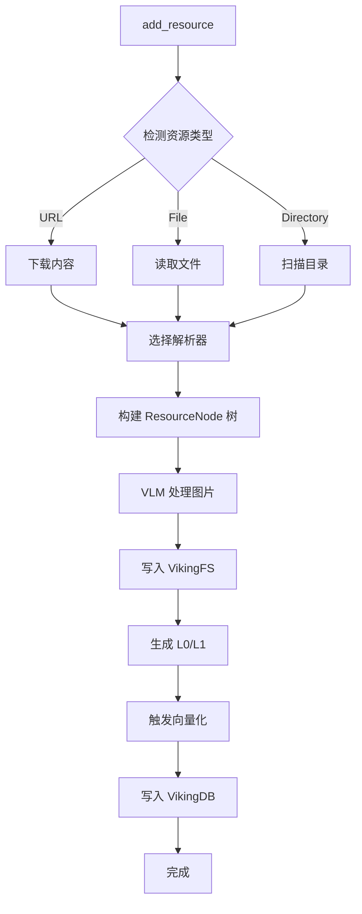
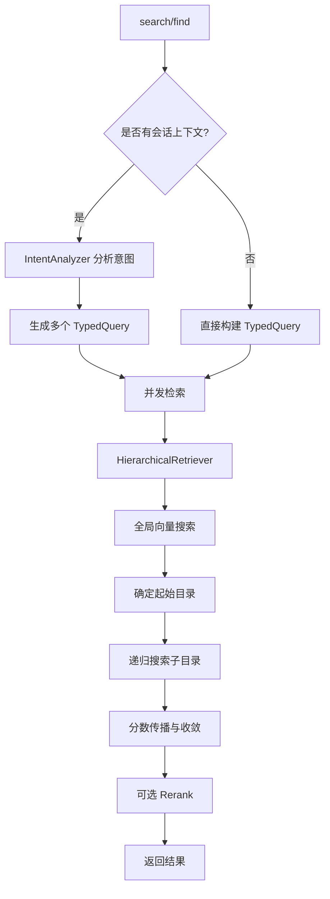
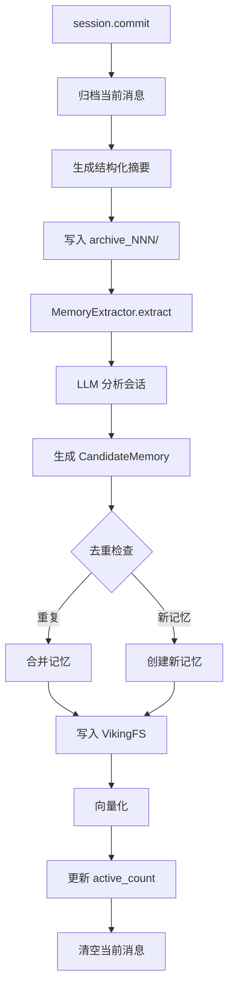

# OpenViking 深度技术调研报告

## 一、项目概览

### 1.1 基本信息

- **项目名称**: OpenViking
- **维护团队**: 字节跳动火山引擎 Viking 团队
- **开源时间**: 2026年1月
- **开源协议**: Apache License 2.0
- **技术栈**: Python + C++ (高性能索引模块)
- **定位**: 为 AI Agent 而生的上下文数据库

### 1.2 核心价值主张

OpenViking 将自己定位为"**Agent-native Context Database**"，旨在解决 AI Agent 开发中的五大核心挑战：

1. **上下文碎片化**: 记忆在代码里，资源在向量库，技能散落各处
2. **上下文猛增**: Agent 长程任务产生大量上下文，简单截断导致信息损失
3. **检索效果不佳**: 传统 RAG 平铺存储，缺乏全局视野
4. **上下文不可观测**: 隐式检索链路如同黑箱，难以调试
5. **记忆迭代有限**: 缺乏 Agent 相关的任务记忆

### 1.3 核心设计理念

OpenViking 创新性地采用 **"文件系统范式"**，将 Agent 所需的记忆、资源和技能进行统一的结构化组织。通过 `viking://` 协议下的虚拟文件系统，让开发者可以像管理本地文件一样构建 Agent 的大脑。

---

## 二、核心架构设计

### 2.1 虚拟文件系统 (VikingFS)

#### 2.1.1 URI 结构

```
viking://{scope}/{path}

核心维度:
├── session/     - 会话级临时数据
├── user/        - 用户级持久化记忆
├── agent/       - Agent级全局数据
└── resources/   - 独立知识和资源存储

示例:
viking://user/memories/preferences/communication_style
viking://agent/skills/search_code
viking://resources/my_project/docs/api/
viking://session/{session_id}/history/archive_001/
```

#### 2.1.2 VikingFS 核心职责

OpenViking 的 `VikingFS` 类（位于 `openviking/storage/viking_fs.py`）是文件系统抽象层的核心实现，封装了底层的 AGFS 客户端：

**基础能力:**
- URI 转换 (`viking://` ↔ `/local/`)
- 文件操作 (read, write, mkdir, rm, mv, ls, tree, glob, grep, stat)
- L0/L1 层读取 (.abstract.md, .overview.md)
- 关系管理 (.relations.json)

**高级能力:**
- 语义搜索 (find/search)
- 向量同步 (rm/mv 时自动更新向量库)
- 批量抽象获取 (并发优化)

**技术亮点:**
```python
# 支持单例模式初始化
init_viking_fs(
    agfs_url="http://localhost:8080",
    query_embedder=embedder,
    rerank_config=rerank_config,
    vector_store=vector_store,
    enable_recorder=True  # 支持 IO 录制用于评估
)

# 全局获取实例
viking_fs = get_viking_fs()
```

### 2.2 分层上下文系统 (L0/L1/L2)

OpenViking 将海量上下文自动处理为三个层级，实现**按需加载**：

| 层级 | 名称 | Token 消耗 | 用途 | 存储方式 |
|------|------|-----------|------|----------|
| **L0** | 抽象层 (Abstract) | ~100 tokens | 快速检索和识别 | .abstract.md |
| **L1** | 概览层 (Overview) | ~500-2k tokens | 规划阶段决策 | .overview.md |
| **L2** | 详情层 (Detail) | 可变 | 深入读取完整数据 | 原始文件 |

**实现机制:**

每个目录都自动维护 L0/L1 文件：
```
viking://resources/my_project/
├── .abstract.md           # L0: 一句话摘要
├── .overview.md           # L1: 结构化概览
├── docs/
│   ├── .abstract.md      
│   ├── .overview.md
│   ├── api/
│   │   ├── auth.md       # L2: 完整内容
│   │   └── endpoints.md
```

**生成方式:**
- 使用 VLM 模型分析原始内容
- 自动提取关键信息和结构
- 支持多模态内容 (文本、图片)

### 2.3 目录递归检索 (Hierarchical Retrieval)

#### 2.3.1 检索策略

OpenViking 设计了创新的**目录递归检索策略**（实现在 `openviking/retrieve/hierarchical_retriever.py`），深度融合多种检索方式：

```
1. 意图分析
   └─> 通过 IntentAnalyzer 生成多个 TypedQuery

2. 初始定位 (Global Search)
   └─> 向量检索快速定位高分目录 (L0/L1 层)

3. 递归探索 (Recursive Search)
   ├─> 在高分目录下进行二次检索
   ├─> 应用分数传播 (Score Propagation)
   └─> 逐层递归重复检索

4. 结果汇总
   └─> 返回最相关上下文
```

#### 2.3.2 核心算法参数

```python
class HierarchicalRetriever:
    MAX_CONVERGENCE_ROUNDS = 3      # 收敛轮次限制
    MAX_RELATIONS = 5               # 每资源最大关系数
    SCORE_PROPAGATION_ALPHA = 0.5   # 分数传播系数
    DIRECTORY_DOMINANCE_RATIO = 1.2 # 目录分数优势比
    GLOBAL_SEARCH_TOPK = 3          # 全局检索数量
```

**分数传播机制:**
```python
final_score = alpha * current_score + (1 - alpha) * parent_score
```

这确保了子节点继承部分父节点的相关性，避免单纯依赖语义匹配导致的误判。

#### 2.3.3 向量检索集成

- 支持 **Dense Vector** (密集向量)
- 支持 **Sparse Vector** (稀疏向量，如 BM25)
- 支持 **Hybrid Search** (混合检索)
- 可选 **Rerank** 二次排序

### 2.4 会话自动管理

#### 2.4.1 会话压缩与归档

Session 类 (`openviking/session/session.py`) 实现了完整的会话生命周期管理：

**核心机制:**
```python
class Session:
    # 会话数据
    _messages: List[Message]           # 当前消息
    _usage_records: List[Usage]        # 使用记录
    _compression: SessionCompression   # 压缩信息
    _stats: SessionStats              # 统计信息
    
    # 自动压缩阈值
    _auto_commit_threshold = 8000  # Token 阈值
```

**归档流程:**
```
1. 消息积累到阈值
   └─> commit() 触发

2. 创建归档
   ├─> 生成结构化摘要 (VLM)
   ├─> 提取 L0 抽象
   ├─> 写入 history/archive_NNN/
   │   ├── messages.jsonl
   │   ├── .abstract.md
   │   └── .overview.md

3. 提取长期记忆
   └─> MemoryExtractor.extract()

4. 清空当前消息
   └─> 节省 Context Window
```

#### 2.4.2 记忆提取 (Memory Extraction)

`MemoryExtractor` (`openviking/session/memory_extractor.py`) 实现六分类记忆提取：

**用户记忆 (UserMemory):**
- `profile`: 用户画像 (profile.md)
- `preferences`: 用户偏好 (按主题聚合)
- `entities`: 实体记忆 (项目、人物、概念)
- `events`: 事件记录 (历史快照，不可更新)

**Agent记忆 (AgentMemory):**
- `cases`: 案例库 (具体问题+解决方案)
- `patterns`: 模式库 (可复用的流程和最佳实践)

**提取流程:**
```python
# 1. 语言检测
output_language = _detect_output_language(messages)

# 2. LLM 分析
prompt = render_prompt("compression.memory_extraction", {
    "recent_messages": formatted_messages,
    "user": user_id,
    "output_language": output_language
})
response = await vlm.get_completion_async(prompt)

# 3. 结构化解析
data = parse_json_from_response(response)
candidates = [CandidateMemory(...) for mem in data["memories"]]

# 4. 持久化
for candidate in candidates:
    memory = await create_memory(candidate, user, session_id)
    await vikingdb.enqueue_embedding_msg(memory)
```

**去重与合并:**
- Profile 自动合并
- Preferences 按主题去重
- Entities/Events/Cases/Patterns 独立存储

#### 2.4.3 记忆去重 (Memory Deduplication)

`MemoryDeduplicator` (`openviking/session/memory_deduplicator.py`) 提供智能去重：

**去重策略:**
1. **向量相似度检索**: 找到候选重复记忆
2. **LLM 判断**: 精确判断是否重复
3. **合并策略**:
   - Profile: 合并更新
   - Preferences: 按主题合并
   - Entities: 追加信息
   - Events/Cases/Patterns: 独立保存

---

## 三、技术实现细节

### 3.1 存储架构

#### 3.1.1 混合存储模型

OpenViking 采用 **文件系统 + 向量数据库** 的混合存储：

```
┌─────────────────────────────────────────┐
│          VikingFS (文件系统)             │
│  - 持久化原始内容                        │
│  - L0/L1/L2 层次文件                     │
│  - 关系图谱 (.relations.json)            │
└─────────────────────────────────────────┘
              ↕ (双向同步)
┌─────────────────────────────────────────┐
│      VikingDB (向量数据库)               │
│  - 向量索引 (Dense + Sparse)             │
│  - 元数据过滤                            │
│  - 语义检索                              │
└─────────────────────────────────────────┘
```

#### 3.1.2 AGFS 底层实现

OpenViking 使用 **AGFS (Agent File System)** 作为底层文件系统，通过 `pyagfs` Python 客户端访问：

**特性:**
- 基于 HTTP 的文件系统服务
- 支持多存储后端 (本地、S3等)
- 原子性操作保证
- 元数据扩展支持

**示例:**
```python
from pyagfs import AGFSClient

agfs = AGFSClient(api_base_url="http://localhost:8080")
agfs.write("/viking/user/memories/profile.md", content)
content = agfs.read("/viking/user/memories/profile.md")
```

### 3.2 向量化与索引

#### 3.2.1 嵌入生成

支持多种 Embedding 模型：
- **火山引擎**: doubao-embedding-vision-250615 (推荐)
- **OpenAI**: text-embedding-3-large
- **Jina AI**: jina-embeddings-v2

**多模态支持:**
```python
# VLM Processor 支持图片内容理解
vlm_processor = VLMProcessor(vlm_model, dense_embedder)
result = await vlm_processor.process_image(image_path)
# -> 生成图片描述 + 向量
```

#### 3.2.2 队列化索引 (QueueFS)

OpenViking 使用观察者模式实现异步向量化：

```
文件写入
  └─> VikingFS.write()
      └─> 触发 Observer
          └─> 入队 EmbeddingMsg
              └─> 后台 Worker 处理
                  └─> 调用 Embedding API
                      └─> 写入 VikingDB
```

**优势:**
- 写入立即返回
- 批量处理优化
- 失败重试机制
- 队列状态可观测

### 3.3 检索优化

#### 3.3.1 意图分析 (Intent Analysis)

`IntentAnalyzer` (`openviking/retrieve/intent_analyzer.py`) 负责将用户查询分解为多个类型化查询：

```python
class TypedQuery:
    query: str                    # 查询文本
    context_type: ContextType     # MEMORY/RESOURCE/SKILL
    intent: str                   # 意图描述
    priority: int = 1             # 优先级
    target_directories: List[str] # 目标目录
```

**分析流程:**
```
用户查询 + 会话上下文
  └─> LLM 分析
      └─> 生成 QueryPlan
          ├─> TypedQuery (MEMORY)
          ├─> TypedQuery (RESOURCE)
          └─> TypedQuery (SKILL)
```

#### 3.3.2 并发检索

```python
async def search(...):
    typed_queries = await intent_analyzer.analyze(...)
    
    tasks = [retriever.retrieve(tq, ...) for tq in typed_queries]
    results = await asyncio.gather(*tasks)
    
    # 合并结果
    return FindResult(
        memories=[...],
        resources=[...],
        skills=[...]
    )
```

### 3.4 资源解析器

#### 3.4.1 解析器架构

OpenViking 提供丰富的文档解析能力 (`openviking/parse/`):

**核心解析器:**
- **TextParser**: 纯文本
- **MarkdownParser**: Markdown 文档
- **PDFParser**: PDF 文档
- **HTMLParser**: 网页内容
- **CodeRepositoryParser**: 代码仓库

**解析流程:**
```
1. 资源检测 (Resource Detector)
   └─> 判断类型 (URL/File/Directory)

2. 目录扫描 (Directory Scan)
   └─> 分类文件 (可处理/不支持)

3. 解析器选择 (Registry)
   └─> 根据文件类型选择解析器

4. 树构建 (Tree Builder)
   └─> 构建 ResourceNode 树

5. VLM 处理 (可选)
   └─> 多模态内容理解

6. 写入 VikingFS
   └─> 生成 L0/L1/L2 层
```

#### 3.4.2 OVPack 格式

OpenViking 定义了 `.ovpack` 导出格式，用于上下文分发：

**结构:**
```
my_context.ovpack (ZIP)
├── manifest.json          # 元数据
├── data/
│   ├── .abstract.md
│   ├── .overview.md
│   ├── file1.md
│   └── file2.md
└── vectors/               # 可选向量数据
    └── embeddings.json
```

**用途:**
- 跨系统分发上下文
- 备份与恢复
- 离线分析

---

## 四、核心流程分析

### 4.1 资源添加流程



**关键代码路径:**
- `openviking/client/LocalClient.add_resource()`
- `openviking/parse/tree_builder.TreeBuilder`
- `openviking/storage/viking_fs.VikingFS.write_context()`

### 4.2 语义搜索流程



**优化点:**
- 批量 Embedding 生成
- 并发目录探索
- 早停与收敛检测
- Rerank 二次排序

### 4.3 会话提交流程



**关键组件:**
- `openviking/session/session.Session.commit()`
- `openviking/session/memory_extractor.MemoryExtractor`
- `openviking/session/memory_deduplicator.MemoryDeduplicator`

---

## 五、技术亮点总结

### 5.1 创新点

1. **文件系统范式**
   - 将碎片化的记忆、资源、技能统一到虚拟文件系统
   - 通过 URI 提供确定性访问
   - 目录结构即语义组织

2. **分层上下文加载**
   - L0/L1/L2 三层渐进式披露
   - 显著降低 Token 消耗
   - 保持完整信息可用性

3. **目录递归检索**
   - 结合目录结构与语义匹配
   - 分数传播机制保留上下文关联
   - 可视化检索轨迹

4. **会话自动管理**
   - 自动压缩与归档
   - 智能记忆提取
   - 六分类记忆体系

5. **可观测性设计**
   - 清晰的 URI 定位
   - 完整的检索轨迹
   - IO 录制与回放

### 5.2 工程实践

1. **单例模式**: VikingFS 全局单例，避免重复初始化
2. **观察者模式**: 文件变更自动触发向量化
3. **队列化处理**: 异步向量化，提升吞吐
4. **批量优化**: 批量抽象获取、批量 Embedding
5. **并发控制**: 信号量限制并发度，避免过载
6. **早停机制**: 收敛检测，减少无效搜索
7. **错误重试**: 向量化失败自动重试

### 5.3 扩展性设计

1. **解析器插件化**: 通过 Registry 注册自定义解析器
2. **存储后端可换**: AGFS 支持多种后端
3. **向量库可换**: VikingDBInterface 抽象接口
4. **LLM 可配置**: 支持多种 Provider (火山引擎、OpenAI等)
5. **Embedding 可选**: 支持多种 Embedding 模型

---

## 六、适用场景

### 6.1 最佳实践场景

1. **知识密集型 Agent**: 需要管理大量文档、代码库
2. **长期记忆场景**: 个人助手、客户服务、教育辅导
3. **多模态应用**: 处理文本、图片、网页等多种资源
4. **复杂检索需求**: 需要精确定位和上下文理解

### 6.2 技术要求

1. **基础设施**:
   - AGFS 服务 (文件系统服务器)
   - VikingDB 或其他向量数据库
   - LLM API (用于提取和分析)
   - Embedding API (用于向量化)

2. **性能要求**:
   - 异步 I/O 支持 (asyncio)
   - 并发控制 (避免 API 限流)
   - 存储空间 (向量+原始文件)

3. **开发成本**:
   - Python 技术栈
   - 理解虚拟文件系统概念
   - 配置 AGFS 服务
   - 调优检索参数

---

## 七、总结

### 7.1 核心优势

1. **统一范式**: 文件系统范式让上下文管理变得直观
2. **性能优化**: L0/L1/L2 分层显著降低 Token 消耗
3. **检索精度**: 目录递归检索提升检索全局性和准确性
4. **自动化**: 会话压缩、记忆提取、向量化全自动
5. **可观测**: 完整的检索轨迹和 URI 定位

### 7.2 适用团队

1. **大厂背景**: 字节跳动内部积累，商业化产品支撑
2. **Python 生态**: 适合 Python AI 应用开发者
3. **复杂场景**: 适合知识密集型、长期记忆场景
4. **基础设施完备**: 需要配套 AGFS 和向量数据库

### 7.3 技术成熟度

- **架构清晰**: 模块化设计，职责分离
- **工程完善**: 错误处理、日志、测试覆盖
- **文档丰富**: 中英文档、示例代码齐全
- **商业支持**: 火山引擎商业化产品背书

**总体评价**: OpenViking 是一个设计理念先进、工程实践完善的 Agent 上下文数据库，特别适合知识密集型、长期记忆场景。其文件系统范式和分层加载机制具有很强的创新性和实用价值。
