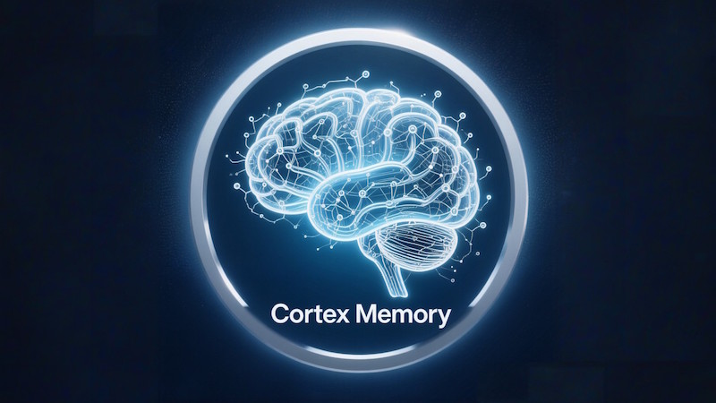
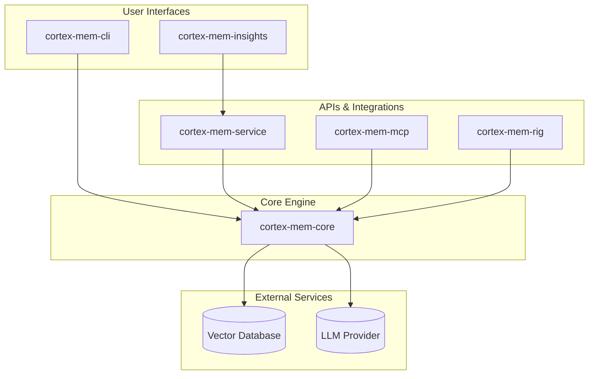
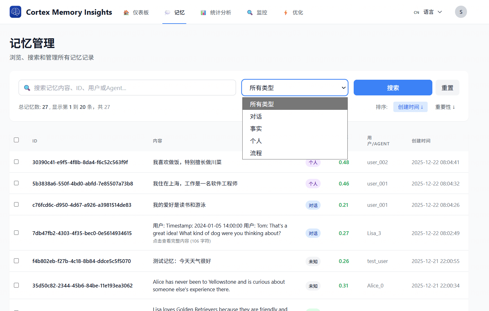
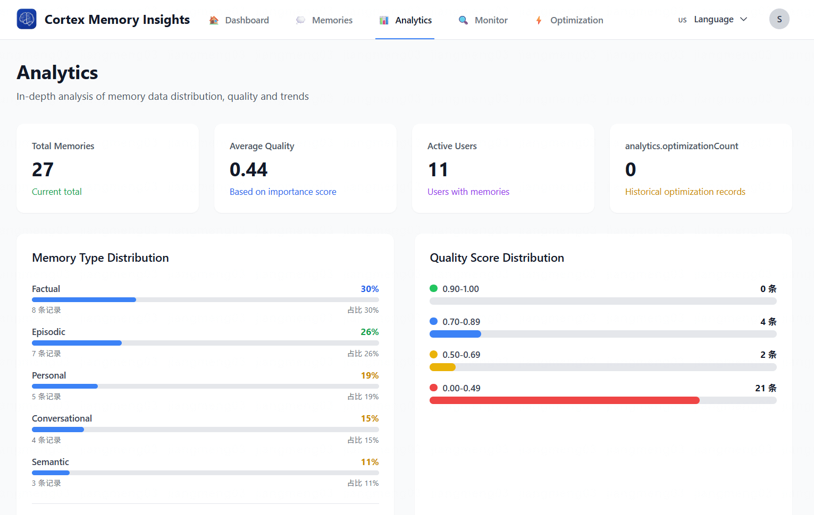
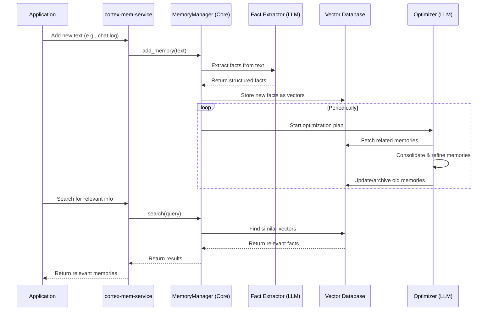

<p align="center">
  
</p>

<h1 align="center">Cortex Memory</h1>

<p align="center">
    <strong>🧠 The AI-native memory framework for building intelligent, context-aware applications 🧠</strong>
</p>
<p align="center">Built with Rust, Cortex Memory gives your AI agents a high-performance, persistent, and intelligent long-term memory.</p>

<p align="center">
  <a href="https://github.com/sopaco/cortex-mem/tree/main/litho.docs">
</a>
  <a href="https://raw.githubusercontent.com/sopaco/cortex-mem/refs/heads/main/assets/benchmark/cortex_mem_vs_langmem.png"></a>
  <a href="https://github.com/sopaco/cortex-mem/actions/workflows/rust.yml"></a>
  <a href="./LICENSE"></a>
</p>

<hr />

# 👋 What is Cortex Memory?

<strong>Cortex Memory</strong> is a complete, production-ready framework for giving your AI applications a long-term memory. It moves beyond simple chat history, providing an intelligent memory system that automatically extracts, organizes, and optimizes information to make your AI agents smarter and more personalized.

Powered by Rust and LLMs, Cortex Memory analyzes conversations, deduces facts, and stores them in a structured, searchable knowledge base. This allows your agent to remember user preferences, past interactions, and key details, leading to more natural and context-aware conversations.

<p align="center">
  <strong>Transform your stateless AI into an intelligent, context-aware partner.</strong>
</p>

<div style="text-align: center; margin: 30px 0;">
  <table style="width: 100%; border-collapse: collapse; margin: 0 auto;">
    <tr>
      <th style="width: 50%; padding: 15px; background-color: #f8f9fa; border: 1px solid #e9ecef; text-align: center; font-weight: bold; color: #495057;">Before Cortex Memory</th>
      <th style="width: 50%; padding: 15px; background-color: #f8f9fa; border: 1px solid #e9ecef; text-align: center; font-weight: bold; color: #495057;">After Cortex Memory</th>
    </tr>
    <tr>
      <td style="padding: 15px; border: 1px solid #e9ecef; vertical-align: top;">
        <p style="font-size: 14px; color: #6c757d; margin-bottom: 10px;"><strong>Stateless AI</strong></p>
        <ul style="font-size: 13px; color: #6c757d; line-height: 1.6;">
          <li>Forgets user details after every session</li>
          <li>Lacks personalization and context</li>
          <li>Repeats questions and suggestions</li>
          <li>Limited to short-term conversation history</li>
          <li>Feels robotic and impersonal</li>
        </ul>
      </td>
      <td style="padding: 15px; border: 1px solid #e9ecef; vertical-align: top;">
        <p style="font-size: 14px; color: #6c757d; margin-bottom: 10px;"><strong>Intelligent AI with Cortex Memory</strong></p>
        <ul style="font-size: 13px; color: #6c757d; line-height: 1.6;">
          <li>Remembers user preferences and history</li>
          <li>Provides deeply personalized interactions</li>
          <li>Learns and adapts over time</li>
          <li>Maintains context across multiple conversations</li>
          <li>Builds rapport and feels like a true assistant</li>
        </ul>
      </td>
    </tr>
  </table>
</div>

<hr />

# 😺 Why Use Cortex Memory?

- <strong>Build Smarter Agents:</strong> Give your AI the ability to learn and remember, leading to more intelligent and useful interactions.
- <strong>Enhance User Experience:</strong> Create personalized, context-aware experiences that delight users and build long-term engagement.
- <strong>Automated Memory Management:</strong> Let the system handle the complexity of extracting, storing, and optimizing memories. No more manual data management.
- <strong>High Performance & Scalability:</strong> Built with Rust, Cortex Memory is fast, memory-safe, and ready to scale with your application.
- <strong>Flexible & Extensible:</strong> Integrate with your existing systems via a REST API, CLI, or direct library usage.
- <strong>Insightful Analytics:</strong> Use the provided web dashboard to visualize and understand your agent's memory.

🌟 <strong>For:</strong>
- Developers building LLM-powered chatbots and agents.
- Teams creating personalized AI assistants.
- Open source projects that need a memory backbone.
- Anyone who wants to build truly intelligent AI applications!

❤️ Like <strong>Cortex Memory</strong>? Star it 🌟 or [Sponsor Me](https://github.com/sponsors/sopaco)! ❤️

# 🌠 Features & Capabilities

- <strong>Intelligent Fact Extraction:</strong> Automatically extracts key facts and insights from unstructured text using LLMs.
- <strong>Memory Classification & Deduplication:</strong> Organizes memories and removes redundant information to keep the knowledge base clean and efficient.
- <strong>Automated Memory Optimization:</strong> Periodically reviews, consolidates, and refines memories to improve relevance and reduce cost.
- <strong>Vector-Based Semantic Search:</strong> Finds the most relevant memories using high-performance vector similarity search.
- <strong>Multi-Modal Access:</strong> Interact with the memory system through a REST API, a command-line interface (CLI), or as a library in your Rust application.
- <strong>Agent Framework Integration:</strong> Provides tools and adapters to easily plug into popular AI agent frameworks.
- <strong>Web Dashboard:</strong> A dedicated web UI (`cortex-mem-insights`) for monitoring, analyzing, and visualizing the agent's memory.

# 🌐 The Cortex Memory Ecosystem

Cortex Memory is a modular system composed of several crates, each with a specific purpose. This design provides flexibility and separation of concerns.



- <strong>`cortex-mem-core`</strong>: The heart of the system. It contains all the business logic for memory management, including extraction, optimization, and search.
- <strong>`cortex-mem-service`</strong>: Exposes the core logic via a high-performance REST API, making it accessible to any programming language or system.
- <strong>`cortex-mem-cli`</strong>: A command-line tool for developers and administrators to directly interact with the memory store for testing and management.
- <strong>`cortex-mem-insights`</strong>: A web-based management tool that provides analytics and visualization of the agent's memory by consuming the `cortex-mem-service` API.
- <strong>`cortex-mem-mcp` / `cortex-mem-rig`</strong>: Specialized adapter crates to integrate Cortex Memory as a "tool" within various AI agent frameworks.
- <strong>`cortex-mem-config`</strong>: Shared configuration and type definitions used across the ecosystem.

# 🖼️ Observability Tools​ Integration

Cortex Memory includes a powerful web-based dashboard (`cortex-mem-insights`) that provides real-time monitoring, analytics and management capabilities. Here's what you can expect to see:

<p align="center">
  
</p>

<p align="center">
  <em><strong>Interactive Dashboard:</strong> Get an overview of memory usage, system health, and activity statistics</em>
</p>

<div style="text-align: center;">
  <table style="width: 100%; margin: 0 auto;">
    <tr>
        <th style="width: 50%;"><strong>View and manage individual memory records</strong></th>
        <th style="width: 50%;"><strong>Analyze and optimize memory quality</strong></th>
    </tr>
    <tr>
      <td style="width: 50%;"></td>
      <td style="width: 50%;"></td>
    </tr>
    <tr>
        <th style="width: 50%;"><strong>Monitor memory performance and activity</strong></th>
        <th style="width: 50%;"><strong>Detailed insights and trends over time</strong></th>
    </tr>
    <tr>
        <td style="width: 50%;"></td>
        <td style="width: 50%;"></td>
    </tr>
  </table>
</div>

These visual tools help you understand how Cortex Memory is performing and how your AI agent's memory is evolving over time.

# 🏆 Benchmark

Cortex Memory has been rigorously evaluated against LangMem using the **LOCOMO dataset** (50 conversations, 150 questions) through a standardized memory system evaluation framework. The results demonstrate Cortex Memory's superior performance across multiple dimensions.

## Performance Comparison

<p align="center">
  
</p>

<p align="center">
  <em><strong>Overall Performance:</strong> Cortex Memory significantly outperforms LangMem across all key metrics</em>
</p>

### Key Metrics

| Metric | Cortex Memory | LangMem | Improvement |
|--------|---------------|---------|-------------|
| **Recall@1** | 93.33% | 26.32% | **+67.02pp** |
| **Recall@3** | 94.00% | 50.00% | +44.00pp |
| **Recall@5** | 94.67% | 55.26% | +39.40pp |
| **Recall@10** | 94.67% | 63.16% | +31.51pp |
| **Precision@1** | 93.33% | 26.32% | +67.02pp |
| **MRR** | 93.72% | 38.83% | **+54.90pp** |
| **NDCG@5** | 80.73% | 18.72% | **+62.01pp** |
| **NDCG@10** | 79.41% | 16.83% | **+62.58pp** |

### Detailed Results

<div style="text-align: center;">
  <table style="width: 100%; margin: 0 auto;">
    <tr>
        <th style="width: 50%;"><strong>Cortex Memory Evaluation:</strong> Excellent retrieval performance with 93.33% Recall@1 and 93.72% MRR</td>
        <th style="width: 50%;"><strong>LangMem Evaluation:</strong> Modest performance with 26.32% Recall@1 and 38.83% MRR</td>
    </tr>
    <tr>
      <td style="width: 50%;"></td>
      <td style="width: 50%;"></td>
    </tr>
  </table>
</div>

### Key Findings

1. **Significantly Improved Retrieval Accuracy**: Cortex Memory achieves **93.33% Recall@1**, a **67.02 percentage point improvement** over LangMem's 26.32%. This indicates Cortex is far superior at retrieving relevant memories on the first attempt.

2. **Clear Ranking Quality Advantage**: Cortex Memory's **MRR of 93.72%** vs LangMem's **38.83%** shows it not only retrieves accurately but also ranks relevant memories higher in the result list.

3. **Comprehensive Performance Leadership**: Across all metrics — especially **NDCG@5 (80.73% vs 18.72%)** — Cortex demonstrates consistent, significant advantages in retrieval quality, ranking accuracy, and overall performance.

4. **Technical Advantages**: Cortex Memory's performance is attributed to:
   - Efficient **Rust-based implementation**
   - Powerful retrieval capabilities of **Qdrant vector database**
   - Optimized memory management strategies

### Evaluation Framework

The benchmark uses a professional memory system evaluation framework located in `examples/lomoco-evaluation`, which includes:

- **Professional Metrics**: Recall@K, Precision@K, MRR, NDCG, and answer quality metrics
- **Enhanced Dataset**: 50 conversations with 150 questions covering various scenarios
- **Statistical Analysis**: 95% confidence intervals, standard deviation, and category-based statistics
- **Multi-System Support**: Supports comparison between Cortex Memory, LangMem, and Simple RAG baselines

For more details on running the evaluation, see the [lomoco-evaluation README](examples/lomoco-evaluation/README.md).

# 🧠 How It Works

Cortex Memory uses a sophisticated pipeline to process and manage memories, orchestrated by the `MemoryManager` in `cortex-mem-core`.




# 🖥 Getting Started

### Prerequisites
- [**Rust**](https://www.rust-lang.org) (version 1.70 or later)
- [**Qdrant**](https://qdrant.tech/) or another compatible vector database
- An **OpenAI-compatible** LLM API endpoint

### Installation
The simplest way to get started is to use the CLI and Service binaries, which can be installed via `cargo`.
```sh
# Install the CLI for command-line management
cargo install cortex-mem-cli

# Install the REST API Service for application integration
cargo install cortex-mem-service

# Install the MCP server for specific agent framework integrations
cargo install cortex-mem-mcp
```

### Configuration
Cortex Memory applications (`cortex-mem-cli`, `cortex-mem-service`, `cortex-mem-mcp`) are configured via a `config.toml` file. The CLI will look for this file in the current directory by default, or you can pass a path using the `-c` or `--config` flag.

Here is a sample `config.toml` with explanations:

```toml
# -----------------------------------------------------------------------------
# HTTP Server Configuration (`cortex-mem-service` only)
# -----------------------------------------------------------------------------
[server]
host = "0.0.0.0"       # IP address to bind the server to
port = 8000            # Port for the HTTP server
cors_origins = ["*"]   # Allowed origins for CORS (use ["*"] for permissive)

# -----------------------------------------------------------------------------
# Qdrant Vector Database Configuration
# -----------------------------------------------------------------------------
[qdrant]
url = "http://localhost:6333" # URL of your Qdrant instance
collection_name = "cortex-memory" # Name of the collection to use for memories
timeout_secs = 5              # Timeout for Qdrant operations
# embedding_dim is now auto-detected and no longer required here.

# -----------------------------------------------------------------------------
# LLM (Large Language Model) Configuration (for reasoning, summarization)
# -----------------------------------------------------------------------------
[llm]
api_base_url = "https://api.openai.com/v1" # Base URL of your LLM provider
api_key = "sk-your-openai-api-key"        # API key for the LLM provider (sensitive)
model_efficient = "gpt-5-mini"         # Model for simple tasks like classification
temperature = 0.7                         # Sampling temperature for LLM responses
max_tokens = 8192                         # Max tokens for LLM generation

# -----------------------------------------------------------------------------
# Embedding Service Configuration
# -----------------------------------------------------------------------------
[embedding]
api_base_url = "https://api.openai.com/v1" # Base URL of your embedding provider
api_key = "sk-your-openai-api-key"        # API key for the embedding provider (sensitive)
model_name = "text-embedding-3-small"     # Name of the embedding model to use
batch_size = 16                           # Number of texts to embed in a single batch
timeout_secs = 10                         # Timeout for embedding requests

# -----------------------------------------------------------------------------
# Memory Management Configuration
# -----------------------------------------------------------------------------
[memory]
max_memories = 10000              # Max number of memories to keep in the store
similarity_threshold = 0.65       # Threshold for considering memories similar
max_search_results = 50           # Default max results for a search query
auto_summary_threshold = 32768    # Token count threshold to trigger auto-summary
auto_enhance = true               # Automatically enhance memories with metadata
deduplicate = true                # Enable or disable memory deduplication
merge_threshold = 0.75            # Similarity threshold for merging memories during optimization
search_similarity_threshold = 0.50 # Minimum similarity for a memory to be included in search results

# -----------------------------------------------------------------------------
# Logging Configuration
# -----------------------------------------------------------------------------
[logging]
enabled = true                     # Enable or disable logging to a file
log_directory = "logs"             # Directory to store log files
level = "info"                     # Logging level (e.g., "info", "debug", "warn", "error")
```

# 🚀 Usage

### CLI (`cortex-mem-cli`)

The CLI provides a powerful interface for direct interaction with the memory system. All commands require a `config.toml` file, which can be specified with `--config <path>`.

#### Add a Memory
Adds a new piece of information to the memory store.

```sh
cortex-mem-cli add --content "The user is interested in Rust programming." --user-id "user123"
```
- `--content <text>`: (Required) The text content of the memory.
- `--user-id <id>`: An optional user ID to associate with the memory.
- `--agent-id <id>`: An optional agent ID to associate with the memory.

#### Search for Memories
Performs a semantic search on the memory store.

```sh
cortex-mem-cli search --query "what are the user's hobbies?" --user-id "user123" --limit 5
```
- `--query <text>`: The natural language query for the search.
- `--user-id <id>`: Filter memories by user ID.
- `--agent-id <id>`: Filter memories by agent ID.
- `--topics <t1,t2>`: Filter by a comma-separated list of topics.
- `--keywords <k1,k2>`: Filter by a comma-separated list of keywords.
- `--limit <n>`: The maximum number of results to return.

#### List Memories
Retrieves a list of memories based on metadata filters, without performing a semantic search.

```sh
cortex-mem-cli list --user-id "user123" --limit 20
```
- Supports the same filters as `search` (`--user-id`, `--agent-id`, etc.), but does not use a `--query`.

#### Delete a Memory
Removes a memory from the store by its unique ID.

```sh
cortex-mem-cli delete <memory-id>
```

#### Manage Optimization
The CLI provides a full suite of tools to manage the memory optimization process.

```sh
# Manually trigger a new optimization run
cortex-mem-cli optimize start

# Check the status of a running or completed optimization job
cortex-mem-cli optimize-status --job-id <job-id>

# View or update the optimization schedule and parameters
cortex-mem-cli optimize-config --get
cortex-mem-cli optimize-config --set --schedule "0 0 * * * *" --enabled
```

### REST API (`cortex-mem-service`)

The REST API allows you to integrate Cortex Memory into any application, regardless of the programming language.

#### Starting the Service
```sh
# Start the API server (will use configuration from config.toml)
cortex-mem-service
```

#### API Endpoints

Here are some of the primary endpoints available:

- `GET /health`: Health check for the service.
- `POST /memories`: Create a new memory.
- `GET /memories`: List memories with metadata filtering.
- `POST /memories/search`: Perform a semantic search for memories.
- `GET /memories/{id}`: Retrieve a single memory by its ID.
- `PUT /memories/{id}`: Update a memory.
- `DELETE /memories/{id}`: Delete a memory.
- `POST /memories/batch/delete`: Delete a batch of memories.
- `POST /memories/batch/update`: Update a batch of memories.
- `POST /optimization`: Manually start an optimization job.
- `GET /optimization/{job_id}`: Get the status of an optimization job.

#### Example: Create a Memory

```bash
curl -X POST http://localhost:8000/memories \
  -H "Content-Type: application/json" \
  -d '{
    "content": "The user just signed up for the premium plan.",
    "metadata": {
      "user_id": "user-xyz-789",
      "agent_id": "billing-bot-01"
    }
  }'
```

#### Example: Search for Memories

```bash
curl -X POST http://localhost:8000/memories/search \
  -H "Content-Type: application/json" \
  -d '{
    "query": "What is the user's current plan?",
    "filters": {
      "user_id": "user-xyz-789"
    },
    "limit": 3
  }'
```

# 🤝 Contribute
We welcome all forms of contributions! Report bugs or submit feature requests through [GitHub Issues](https://github.com/sopaco/cortex-mem/issues).

### Development Process
1. Fork this project
2. Create a feature branch (`git checkout -b feature/amazing-feature`)
3. Commit your changes (`git commit -m 'Add some amazing feature'`)
4. Push to the branch (`git push origin feature/amazing-feature`)
5. Create a Pull Request

# 🪪 License
This project is licensed under the **MIT License**. See the [LICENSE](LICENSE) file for details.
