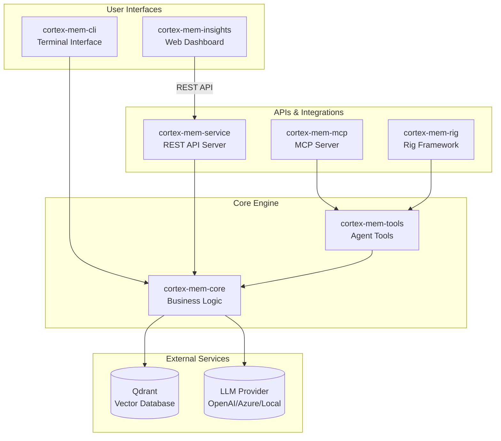
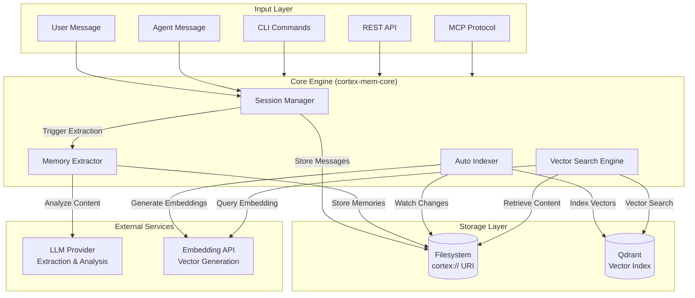

<p align="center">
  
</p>

<h1 align="center">Cortex Memory</h1>

<p align="center">
    <strong>🧠 The AI-native memory framework for building intelligent, context-aware applications 🧠</strong>
</p>
<p align="center">Built with Rust, Cortex Memory gives your AI agents a high-performance, persistent, and intelligent long-term memory.</p>

<p align="center">
    <a href="https://github.com/sopaco/cortex-mem/tree/main/litho.docs/en"></a>
    <a href="https://github.com/sopaco/cortex-mem/tree/main/litho.docs/zh"></a>
  <a href="https://raw.githubusercontent.com/sopaco/cortex-mem/refs/heads/main/assets/benchmark/cortex_mem_vs_langmem.png"></a>
  <a href="https://github.com/sopaco/cortex-mem/actions/workflows/rust.yml"></a>
  <a href="./LICENSE"></a>
</p>

<hr />

# 👋 What is Cortex Memory?

<strong>Cortex Memory</strong> is a complete, production-ready framework for giving your AI applications a long-term memory. It moves beyond simple chat history, providing an intelligent memory system that automatically extracts, organizes, and optimizes information to make your AI agents smarter and more personalized.

Powered by Rust and LLMs, Cortex Memory analyzes conversations, deduces facts, and stores them in a structured, searchable knowledge base. This allows your agent to remember user preferences, past interactions, and key details, leading to more natural and context-aware conversations.

<p align="center">
  <strong>Transform your stateless AI into an intelligent, context-aware partner.</strong>
</p>

<div style="text-align: center; margin: 30px 0;">
  <table style="width: 100%; border-collapse: collapse; margin: 0 auto;">
    <tr>
      <th style="width: 50%; padding: 15px; background-color: #f8f9fa; border: 1px solid #e9ecef; text-align: center; font-weight: bold; color: #495057;">Before Cortex Memory</th>
      <th style="width: 50%; padding: 15px; background-color: #f8f9fa; border: 1px solid #e9ecef; text-align: center; font-weight: bold; color: #495057;">After Cortex Memory</th>
    </tr>
    <tr>
      <td style="padding: 15px; border: 1px solid #e9ecef; vertical-align: top;">
        <p style="font-size: 14px; color: #6c757d; margin-bottom: 10px;"><strong>Stateless AI</strong></p>
        <ul style="font-size: 13px; color: #6c757d; line-height: 1.6;">
          <li>Forgets user details after every session</li>
          <li>Lacks personalization and context</li>
          <li>Repeats questions and suggestions</li>
          <li>Limited to short-term conversation history</li>
          <li>Feels robotic and impersonal</li>
        </ul>
      </td>
      <td style="padding: 15px; border: 1px solid #e9ecef; vertical-align: top;">
        <p style="font-size: 14px; color: #6c757d; margin-bottom: 10px;"><strong>Intelligent AI with Cortex Memory</strong></p>
        <ul style="font-size: 13px; color: #6c757d; line-height: 1.6;">
          <li>Remembers user preferences and history</li>
          <li>Provides deeply personalized interactions</li>
          <li>Learns and adapts over time</li>
          <li>Maintains context across multiple conversations</li>
          <li>Builds rapport and feels like a true assistant</li>
        </ul>
      </td>
    </tr>
  </table>
</div>

<hr />

# 😺 Why Use Cortex Memory?

- <strong>Build Smarter Agents:</strong> Give your AI the ability to learn and remember, leading to more intelligent and useful interactions.
- <strong>Enhance User Experience:</strong> Create personalized, context-aware experiences that delight users and build long-term engagement.
- <strong>Automated Memory Management:</strong> Let the system handle the complexity of extracting, storing, and optimizing memories. No more manual data management.
- <strong>High Performance & Scalability:</strong> Built with Rust, Cortex Memory is fast, memory-safe, and ready to scale with your application.
- <strong>Flexible & Extensible:</strong> Integrate with your existing systems via a REST API, CLI, or direct library usage.
- <strong>Insightful Analytics:</strong> Use the provided web dashboard to visualize and understand your agent's memory.

🌟 <strong>For:</strong>
- Developers building LLM-powered chatbots and agents.
- Teams creating personalized AI assistants.
- Open source projects that need a memory backbone.
- Anyone who wants to build truly intelligent AI applications!

❤️ Like <strong>Cortex Memory</strong>? Star it 🌟 or [Sponsor Me](https://github.com/sponsors/sopaco)! ❤️

# 🌠 Features & Capabilities

- <strong>File-System Based Storage:</strong> Memory content stored as files using the `cortex://` virtual URI scheme, enabling version control compatibility and portability.
- <strong>Intelligent Memory Extraction:</strong> Automatically extracts structured memories (preferences, entities, events, cases) from conversations using LLM analysis.
- <strong>Vector-Based Semantic Search:</strong> High-performance similarity search via Qdrant with metadata filtering across dimensions (user/agent/session).
- <strong>Multi-Modal Access:</strong> Interact through REST API, CLI, MCP protocol, or direct Rust library integration.
- <strong>Three-Tier Memory Layers:</strong> Progressive disclosure system (L0 Abstract → L1 Overview → L2 Detail) optimizes LLM context window usage.
- <strong>Session Management:</strong> Track conversation timelines, participants, and message history with automatic indexing.
- <strong>Multi-Tenancy Support:</strong> Isolated memory spaces for different users and agents within a single deployment.
- <strong>Automation Pipeline:</strong> File watchers and auto-indexers for background processing and synchronization.
- <strong>Agent Framework Integration:</strong> Built-in support for Rig framework and Model Context Protocol (MCP).
- <strong>Web Dashboard:</strong> Svelte 5 SPA for monitoring, tenant management, and semantic search visualization.

# 🌐 The Cortex Memory Ecosystem

Cortex Memory is a modular system composed of several crates, each with a specific purpose. This design provides flexibility and separation of concerns.



- <strong>`cortex-mem-core`</strong>: The heart of the system. Contains business logic for filesystem operations, session management, vector search, memory extraction, and LLM integration.
- <strong>`cortex-mem-service`</strong>: High-performance REST API server (Axum-based) exposing all memory operations via `/api/v2/*` endpoints.
- <strong>`cortex-mem-cli`</strong>: Command-line tool for developers and administrators to interact with the memory store directly.
- <strong>`cortex-mem-insights`</strong>: Pure frontend Svelte 5 SPA for monitoring, analytics, and memory management through a web interface.
- <strong>`cortex-mem-mcp`</strong>: Model Context Protocol server for integration with AI assistants (Claude Desktop, etc.).
- <strong>`cortex-mem-rig`</strong>: Rig framework integration for building AI agents with memory capabilities.
- <strong>`cortex-mem-tools`</strong>: High-level agent tool definitions and operations facade.
- <strong>`cortex-mem-config`</strong>: Shared configuration management across the ecosystem.

# 🖼️ Observability Dashboard

Cortex Memory includes a powerful web-based dashboard (`cortex-mem-insights`) that provides real-time monitoring, analytics and management capabilities. The dashboard is a pure frontend Svelte 5 SPA that connects to the `cortex-mem-service` REST API.

<p align="center">
  
</p>

<p align="center">
  <em><strong>Interactive Dashboard:</strong> Tenant overview, system health, and storage statistics at a glance</em>
</p>

### Key Features

- **Tenant Management**: View and switch between multiple tenants with isolated memory spaces
- **Memory Browser**: Navigate the `cortex://` filesystem to view and manage memory files
- **Semantic Search**: Perform natural language queries across the memory store
- **Health Monitoring**: Real-time service status and LLM availability checks

### Running the Dashboard

```bash
# Start the backend service first
cortex-mem-service --data-dir ./cortex-data --port 8085

# In another terminal, start the insights dashboard
cd cortex-mem-insights
bun install
bun run dev
```

The dashboard will be available at `http://localhost:5173` and will proxy API requests to the backend service.

# 🌟 Community Showcase: Cortex TARS

Meet **Cortex TARS** — a production-ready AI-native TUI (Terminal User Interface) application that demonstrates the true power of Cortex Memory. Built as a "second brain" companion, Cortex TARS brings **auditory presence** to your AI experience and can truly hear and remember your voice in the real world, showcases how persistent memory transforms AI interactions from fleeting chats into lasting, intelligent partnerships.

## What Makes Cortex TARS Special?

Cortex TARS is more than just a chatbot — it's a comprehensive AI assistant platform that leverages Cortex Memory's advanced capabilities:

### 🎭 Multi-Agent Management
Create and manage multiple AI personas, each with distinct personalities, system prompts, and specialized knowledge areas. Whether you need a coding assistant, a creative writing partner, or a productivity coach, Cortex TARS lets you run them all simultaneously with complete separation.

### 💾 Persistent Role Memory
Every agent maintains its own long-term memory, learning from interactions over time. Your coding assistant remembers your coding style and preferences; your writing coach adapts to your voice and goals. No more repeating yourself — each agent grows smarter with every conversation.

### 🔒 Memory Isolation
Advanced memory architecture ensures complete isolation between agents and users. Each agent's knowledge base is separate, preventing cross-contamination while enabling personalized experiences across different contexts and use cases.

### 🎤 Real-Time Audio-to-Memory (The Game Changer)
**This is where Cortex TARS truly shines.** With real-time device audio capture, Cortex TARS can listen to your conversations, meetings, or lectures and automatically convert them into structured, searchable memories. Imagine attending a meeting while Cortex TARS silently captures key insights, decisions, and action items — all stored and ready for instant retrieval later. No more frantic note-taking or forgotten details!

## Why Cortex TARS Matters

Cortex TARS isn't just an example — it's a fully functional application that demonstrates:

- **Real-world production readiness**: Built with Rust, it's fast, reliable, and memory-safe
- **Seamless Cortex Memory integration**: Shows best practices for leveraging the memory framework
- **Practical AI workflows**: From multi-agent conversations to audio capture and memory extraction
- **User-centric design**: Beautiful TUI interface with intuitive controls and rich features

## Explore Cortex TARS

Ready to see Cortex Memory in action? Dive into the Cortex TARS project:

```bash
cd examples/cortex-mem-tars
cargo build --release
cargo run --release
```

Check out the [Cortex TARS README](examples/cortex-mem-tars/README.md) for detailed setup instructions, configuration guides, and usage examples.

**Cortex TARS proves that Cortex Memory isn't just a framework — it's the foundation for building intelligent, memory-aware applications that truly understand and remember.**

# 🏆 Benchmark

Cortex Memory has been rigorously evaluated against LangMem using the **LOCOMO dataset** (50 conversations, 150 questions) through a standardized memory system evaluation framework. The results demonstrate Cortex Memory's superior performance across multiple dimensions.

## Performance Comparison

<p align="center">
  
</p>

<p align="center">
  <em><strong>Overall Performance:</strong> Cortex Memory significantly outperforms LangMem across all key metrics</em>
</p>

### Key Metrics

| Metric | Cortex Memory | LangMem | Improvement |
|--------|---------------|---------|-------------|
| **Recall@1** | 93.33% | 26.32% | **+67.02pp** |
| **Recall@3** | 94.00% | 50.00% | +44.00pp |
| **Recall@5** | 94.67% | 55.26% | +39.40pp |
| **Recall@10** | 94.67% | 63.16% | +31.51pp |
| **Precision@1** | 93.33% | 26.32% | +67.02pp |
| **MRR** | 93.72% | 38.83% | **+54.90pp** |
| **NDCG@5** | 80.73% | 18.72% | **+62.01pp** |
| **NDCG@10** | 79.41% | 16.83% | **+62.58pp** |

### Detailed Results

<div style="text-align: center;">
  <table style="width: 100%; margin: 0 auto;">
    <tr>
        <th style="width: 50%;"><strong>Cortex Memory Evaluation:</strong> Excellent retrieval performance with 93.33% Recall@1 and 93.72% MRR</td>
        <th style="width: 50%;"><strong>LangMem Evaluation:</strong> Modest performance with 26.32% Recall@1 and 38.83% MRR</td>
    </tr>
    <tr>
      <td style="width: 50%;"></td>
      <td style="width: 50%;"></td>
    </tr>
  </table>
</div>

### Key Findings

1. **Significantly Improved Retrieval Accuracy**: Cortex Memory achieves **93.33% Recall@1**, a **67.02 percentage point improvement** over LangMem's 26.32%. This indicates Cortex is far superior at retrieving relevant memories on the first attempt.

2. **Clear Ranking Quality Advantage**: Cortex Memory's **MRR of 93.72%** vs LangMem's **38.83%** shows it not only retrieves accurately but also ranks relevant memories higher in the result list.

3. **Comprehensive Performance Leadership**: Across all metrics — especially **NDCG@5 (80.73% vs 18.72%)** — Cortex demonstrates consistent, significant advantages in retrieval quality, ranking accuracy, and overall performance.

4. **Technical Advantages**: Cortex Memory's performance is attributed to:
   - Efficient **Rust-based implementation**
   - Powerful retrieval capabilities of **Qdrant vector database**
   - Optimized memory management strategies

### Evaluation Framework

The benchmark uses a professional memory system evaluation framework located in `examples/lomoco-evaluation`, which includes:

- **Professional Metrics**: Recall@K, Precision@K, MRR, NDCG, and answer quality metrics
- **Enhanced Dataset**: 50 conversations with 150 questions covering various scenarios
- **Statistical Analysis**: 95% confidence intervals, standard deviation, and category-based statistics
- **Multi-System Support**: Supports comparison between Cortex Memory, LangMem, and Simple RAG baselines

For more details on running the evaluation, see the [lomoco-evaluation README](examples/lomoco-evaluation/README.md).

# 🧠 How It Works

Cortex Memory uses a sophisticated pipeline to process and manage memories, centered around a file-system based architecture with vector search capabilities.



## Memory Architecture

Cortex Memory organizes data using a **virtual filesystem** approach with the `cortex://` URI scheme:

```
cortex://{dimension}/{scope}/{category}/{id}
```

- **Dimension**: `user`, `agent`, or `session`
- **Scope**: Tenant or identifier
- **Category**: `memories`, `profiles`, `entities`, `sessions`, etc.
- **ID**: Unique memory identifier

## Three-Tier Memory Layers

Cortex Memory implements a **progressive disclosure** system with three abstraction layers:

| Layer | Purpose | Token Usage | Use Case |
|-------|---------|-------------|----------|
| **L0 (Abstract)** | Quick relevance filtering | ~50 tokens | Initial screening |
| **L1 (Overview)** | Structured summary | ~200-300 tokens | Context building |
| **L2 (Detail)** | Full content | Variable | Deep inspection |

This tiered approach optimizes LLM context window usage by loading only the necessary detail level.

# 🖥 Getting Started

### Prerequisites
- [**Rust**](https://www.rust-lang.org) (version 1.86 or later)
- [**Qdrant**](https://qdrant.tech/) vector database
- An **OpenAI-compatible** LLM API endpoint (for memory extraction and analysis)
- An **OpenAI-compatible** Embedding API endpoint (for vector search)

### Installation
The simplest way to get started is to use the CLI and Service binaries, which can be installed via `cargo`.
```sh
# Install the CLI for command-line management
cargo install --path cortex-mem-cli

# Install the REST API Service for application integration
cargo install --path cortex-mem-service

# Install the MCP server for AI assistant integrations
cargo install --path cortex-mem-mcp
```

### Configuration
Cortex Memory applications (`cortex-mem-cli`, `cortex-mem-service`, `cortex-mem-mcp`) are configured via a `config.toml` file. The CLI will look for this file in the current directory by default, or you can pass a path using the `-c` or `--config` flag.

Here is a sample `config.toml` with explanations:

```toml
# -----------------------------------------------------------------------------
# Qdrant Vector Database Configuration
# -----------------------------------------------------------------------------
[qdrant]
url = "http://localhost:6333"     # URL of your Qdrant instance
collection_name = "cortex-memory" # Name of the collection to use for memories
timeout_secs = 5                  # Timeout for Qdrant operations
embedding_dim = 1536              # Embedding dimension (e.g., 1536 for text-embedding-3-small)

# -----------------------------------------------------------------------------
# LLM (Large Language Model) Configuration (for reasoning, extraction)
# -----------------------------------------------------------------------------
[llm]
api_base_url = "https://api.openai.com/v1" # Base URL of your LLM provider
api_key = "sk-your-openai-api-key"         # API key for the LLM provider (sensitive)
model_efficient = "gpt-4o-mini"            # Model for extraction and classification
temperature = 0.7                          # Sampling temperature for LLM responses
max_tokens = 8192                          # Max tokens for LLM generation

# -----------------------------------------------------------------------------
# Embedding Service Configuration
# -----------------------------------------------------------------------------
[embedding]
api_base_url = "https://api.openai.com/v1" # Base URL of your embedding provider
api_key = "sk-your-openai-api-key"         # API key for the embedding provider (sensitive)
model_name = "text-embedding-3-small"      # Name of the embedding model to use
batch_size = 16                            # Number of texts to embed in a single batch
timeout_secs = 10                          # Timeout for embedding requests

# -----------------------------------------------------------------------------
# Cortex Data Directory Configuration
# -----------------------------------------------------------------------------
[cortex]
data_dir = "./cortex-data"  # Directory for storing memory files and sessions
```

# 🚀 Usage

### CLI (`cortex-mem-cli`)

The CLI provides a powerful interface for direct interaction with the memory system. All commands require a `config.toml` file, which can be specified with `--config <path>`. The `--tenant` flag allows multi-tenant isolation.

#### Add a Memory
Adds a new message to a session thread, automatically storing it in the memory system.

```sh
cortex-mem-cli --config config.toml --tenant acme add --thread thread-123 --role user --content "The user is interested in Rust programming."
```
- `--thread <id>`: (Required) The thread/session ID.
- `--role <role>`: Message role (user/assistant/system). Default: "user"
- `content`: The text content of the message.

#### Search for Memories
Performs a semantic vector search across the memory store.

```sh
cortex-mem-cli --config config.toml --tenant acme search "what are the user's hobbies?" --thread thread-123 --limit 10
```
- `query`: The natural language query for the search.
- `--thread <id>`: Filter memories by thread ID.
- `--limit <n>`: Maximum number of results. Default: 10
- `--min-score <score>`: Minimum relevance score (0.0-1.0). Default: 0.3
- `--scope <scope>`: Search scope: "session", "user", or "agent". Default: "session"

#### List Memories
Retrieves a list of memories from a specific URI path.

```sh
cortex-mem-cli --config config.toml --tenant acme list --uri "cortex://session" --include-abstracts
```
- `--uri <path>`: URI path to list (e.g., "cortex://session" or "cortex://user/preferences").
- `--include-abstracts`: Include L0 abstracts in results.

#### Get a Specific Memory
Retrieves a specific memory by its URI.

```sh
cortex-mem-cli --config config.toml --tenant acme get "cortex://session/thread-123/memory-456.md"
```
- `uri`: The memory URI.
- `--abstract-only`: Show L0 abstract instead of full content.

#### Delete a Memory
Removes a memory from the store by its URI.

```sh
cortex-mem-cli --config config.toml --tenant acme delete "cortex://session/thread-123/memory-456.md"
```

#### Session Management
Manage conversation sessions.

```sh
# List all sessions
cortex-mem-cli --config config.toml --tenant acme session list

# Create a new session
cortex-mem-cli --config config.toml --tenant acme session create thread-456 --title "My Session"
```

#### Show Statistics
Display system statistics.

```sh
cortex-mem-cli --config config.toml --tenant acme stats
```

### REST API (`cortex-mem-service`)

The REST API allows you to integrate Cortex Memory into any application, regardless of the programming language. The service runs on port 8085 by default.

#### Starting the Service
```sh
# Start the API server with default settings
cortex-mem-service --data-dir ./cortex-data --host 127.0.0.1 --port 8085

# Enable verbose logging
cortex-mem-service -d ./cortex-data -h 127.0.0.1 -p 8085 --verbose
```

#### API Endpoints

**Health Check**
- `GET /health`: Health check for the service.

**Filesystem Operations**
- `GET /api/v2/filesystem/list?uri=<path>`: List directory contents.
- `GET /api/v2/filesystem/read/<path>`: Read file content.
- `POST /api/v2/filesystem/write`: Write content to a file.
- `GET /api/v2/filesystem/stats?uri=<path>`: Get directory statistics.

**Session Management**
- `GET /api/v2/sessions`: List all sessions.
- `POST /api/v2/sessions`: Create a new session.
- `POST /api/v2/sessions/:thread_id/messages`: Add a message to a session.
- `POST /api/v2/sessions/:thread_id/close`: Close a session and trigger memory extraction.

**Semantic Search**
- `POST /api/v2/search`: Perform semantic search across memories.

**Automation**
- `POST /api/v2/automation/extract/:thread_id`: Trigger memory extraction for a thread.
- `POST /api/v2/automation/index/:thread_id`: Trigger vector indexing for a thread.
- `POST /api/v2/automation/index-all`: Index all threads.

**Tenant Management**
- `GET /api/v2/tenants/tenants`: List all available tenants.
- `POST /api/v2/tenants/tenants/switch`: Switch active tenant context.

#### Example: Create a Session and Add Message

```bash
# Create a new session
curl -X POST http://localhost:8085/api/v2/sessions \
  -H "Content-Type: application/json" \
  -d '{
    "thread_id": "thread-123",
    "title": "Support Conversation"
  }'

# Add a message to the session
curl -X POST http://localhost:8085/api/v2/sessions/thread-123/messages \
  -H "Content-Type: application/json" \
  -d '{
    "role": "user",
    "content": "I just upgraded to the premium plan."
  }'
```

#### Example: Semantic Search

```bash
curl -X POST http://localhost:8085/api/v2/search \
  -H "Content-Type: application/json" \
  -d '{
    "query": "What is the user's current subscription?",
    "thread": "thread-123",
    "limit": 5,
    "min_score": 0.5
  }'
```

#### Example: Trigger Memory Extraction

```bash
# Extract memories from a session (typically called when session is closed)
curl -X POST http://localhost:8085/api/v2/automation/extract/thread-123 \
  -H "Content-Type: application/json" \
  -d '{ "auto_save": true }'
```

### Model Context Protocol (MCP) Server (`cortex-mem-mcp`)

Cortex Memory provides an MCP server for integration with AI assistants like Claude Desktop. The MCP server exposes memory tools through the stdio transport.

```sh
# Run the MCP server
cortex-mem-mcp --config config.toml --tenant acme
```

Configure your AI assistant to use the MCP server by adding it to your assistant's configuration.

# 🤝 Contribute
We welcome all forms of contributions! Report bugs or submit feature requests through [GitHub Issues](https://github.com/sopaco/cortex-mem/issues).

### Development Process
1. Fork this project
2. Create a feature branch (`git checkout -b feature/amazing-feature`)
3. Commit your changes (`git commit -m 'Add some amazing feature'`)
4. Push to the branch (`git push origin feature/amazing-feature`)
5. Create a Pull Request

# 🪪 License
This project is licensed under the **MIT License**. See the [LICENSE](LICENSE) file for details.
