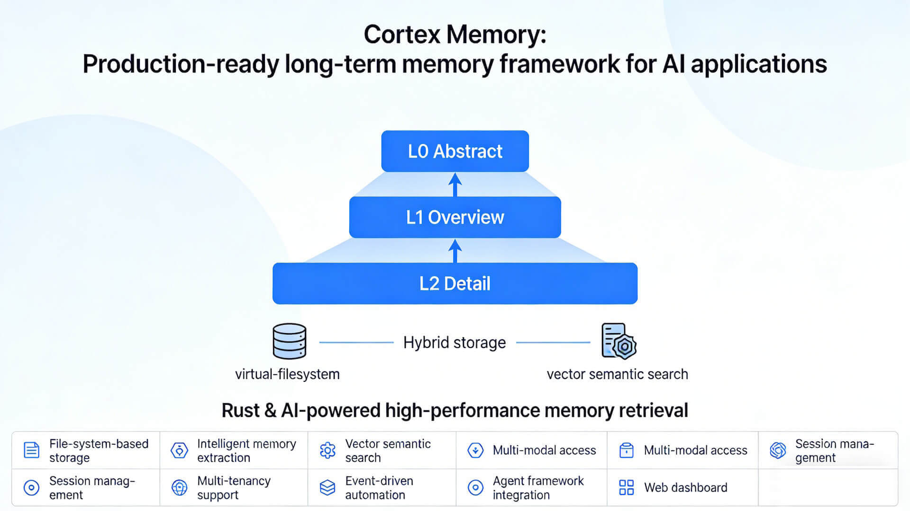
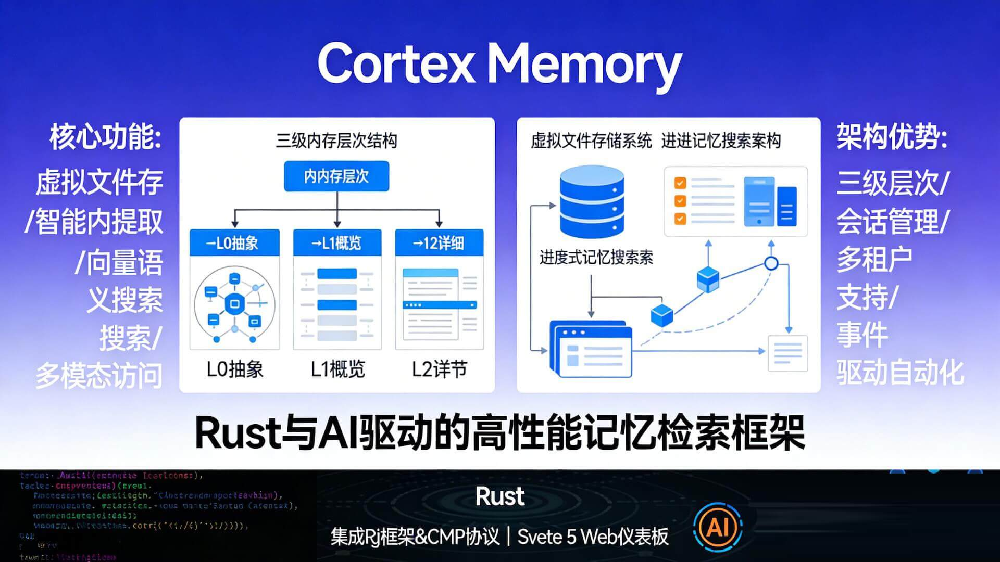
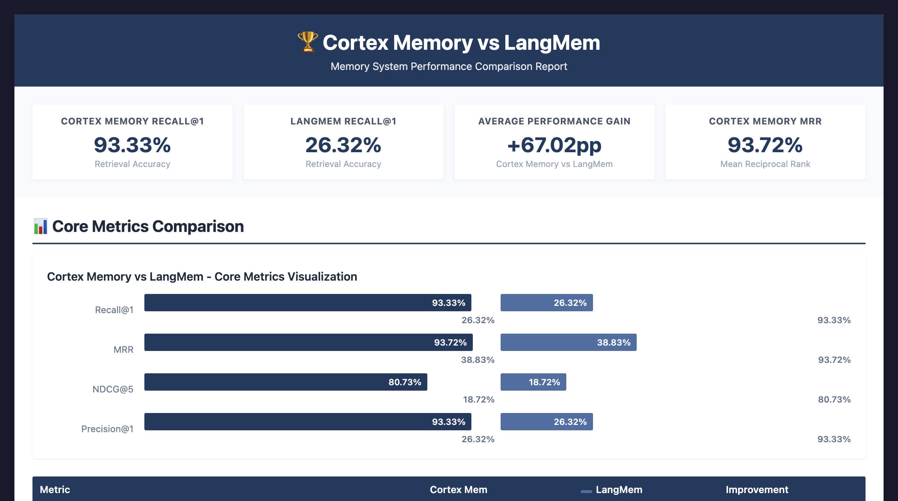
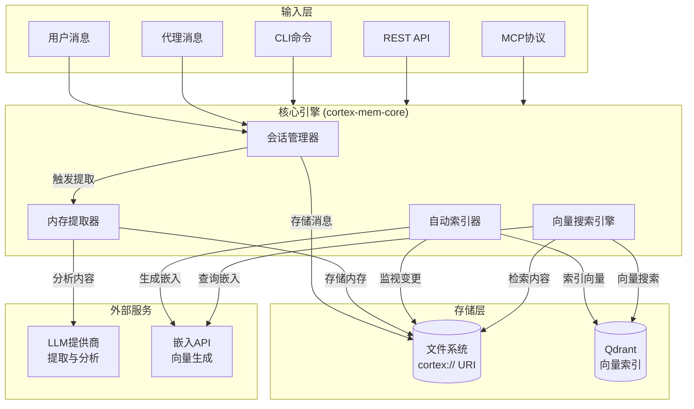
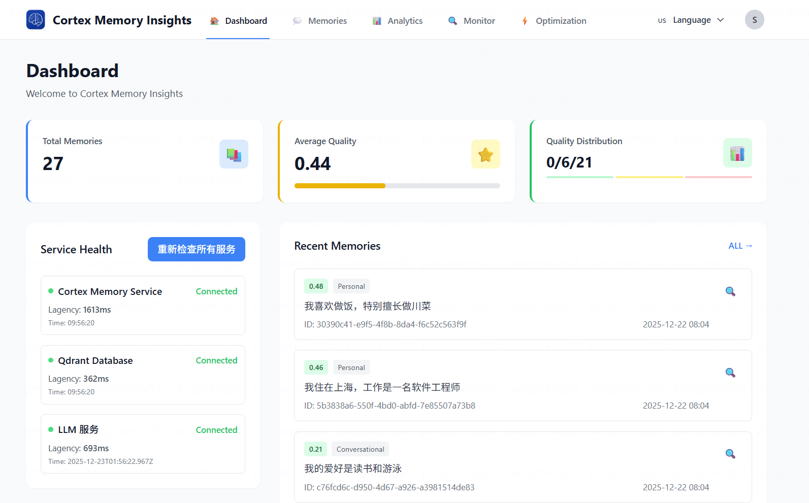
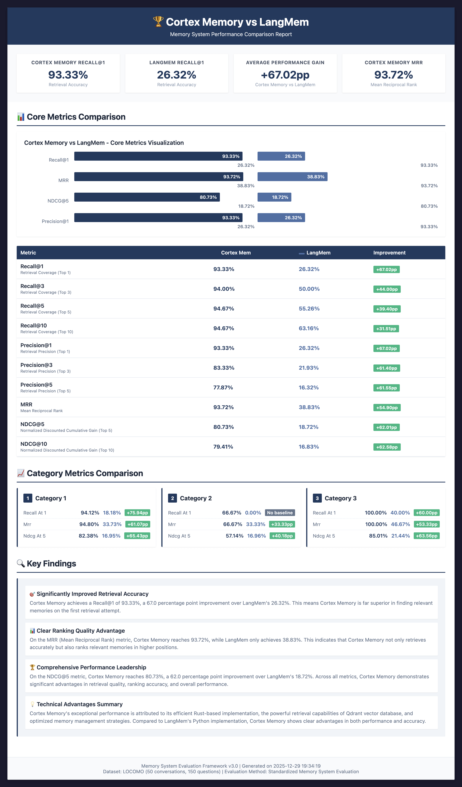
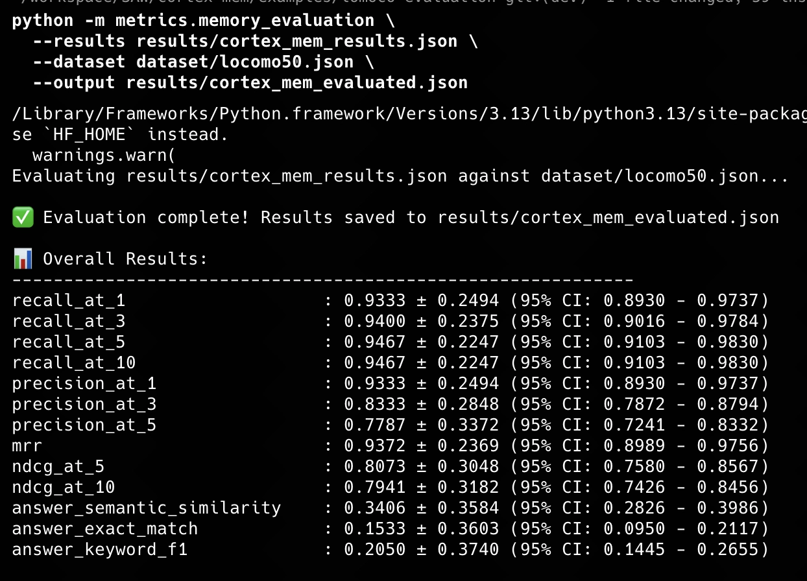
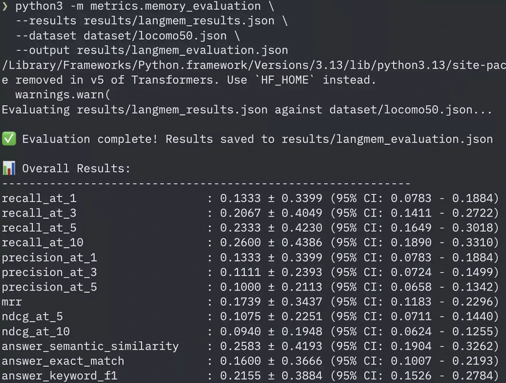

<p align="center">
  
</p>

<h1 align="center">Cortex Memory</h1>

<p align="center">
    <a href="./README.md">English</a>
    |
    <a href="./README_zh.md">中文</a>
</p>

<p align="center">
    <strong>🧠 为构建智能、上下文感知应用而生的AI原生内存框架 🧠</strong>
</p>
<p align="center">基于Rust构建，Cortex Memory是一个高性能、持久化、智能的长期内存系统，赋予您的AI代理跨会话记住、学习和个性化交互的能力。</p>

<p align="center">
    <a href="https://github.com/sopaco/cortex-mem/tree/main/litho.docs/en"></a>
    <a href="https://github.com/sopaco/cortex-mem/tree/main/litho.docs/zh"></a>
  <a href="https://raw.githubusercontent.com/sopaco/cortex-mem/refs/heads/main/assets/benchmark/cortex_mem_vs_langmem.png"></a>
  <a href="https://github.com/sopaco/cortex-mem/actions/workflows/rust.yml"></a>
  <a href="./LICENSE"></a>
</p>

<hr />

# 👋 什么是 Cortex Memory？

**Cortex Memory** 是一个完整的、生产就绪的框架，为您的AI应用程序提供长期记忆能力。它超越了简单的聊天历史，提供了一个具有**分层三级内存架构**(L0 抽象层 → L1 概览层 → L2 详细层)的智能内存系统，能够自动提取、组织和优化信息，使您的AI代理更智能、更具个性化。

Cortex Memory 使用复杂的流水线来处理和管理内存，核心是**混合存储架构**，结合了**虚拟文件系统**的持久性和基于向量的**语义搜索**。

| 高效能 **渐进式记忆披露** 搜索架构 | 基于 **虚拟文件系统** 的记忆架构 |  **高精准** 记忆检索召回能力 |
| :--- | :--- | :--- |
|  | |  |

**Cortex Memory** 使用**虚拟文件系统**方法组织数据,采用 `cortex://` URI 方案：

```
# 基本结构
cortex://{维度}/{路径}

# 维度说明
session/    - 会话记忆（对话历史、时间线）
user/       - 用户记忆（偏好、实体、事件）
agent/      - Agent记忆（案例、技能）
resources/  - 知识库资源

# 示例
cortex://session/{session_id}/timeline/{date}/{time}.md
cortex://user/preferences/{name}.md
cortex://agent/cases/{case_id}.md
cortex://resources/{resource_name}/
```

<hr />

# 😺 为什么使用 Cortex Memory？

<p align="center">
  <strong>将您的无状态AI转变为智能的、上下文感知的合作伙伴。</strong>
</p>

<div style="text-align: center; margin: 30px 0;">
  <table style="width: 100%; border-collapse: collapse; margin: 0 auto;">
    <tr>
      <th style="width: 50%; padding: 15px; background-color: #f8f9fa; border: 1px solid #e9ecef; text-align: center; font-weight: bold; color: #495057;">使用 Cortex Memory 之前</th>
      <th style="width: 50%; padding: 15px; background-color: #f8f9fa; border: 1px solid #e9ecef; text-align: center; font-weight: bold; color: #495057;">使用 Cortex Memory 之后</th>
    </tr>
    <tr>
      <td style="padding: 15px; border: 1px solid #e9ecef; vertical-align: top;">
        <p style="font-size: 14px; color: #6c757d; margin-bottom: 10px;"><strong>无状态 AI</strong></p>
        <ul style="font-size: 13px; color: #6c757d; line-height: 1.6;">
          <li>每次会话后遗忘用户详情</li>
          <li>缺乏个性化和上下文</li>
          <li>重复提问和建议</li>
          <li>仅限于短期对话历史</li>
          <li>感觉机械且缺乏个性</li>
        </ul>
      </td>
      <td style="padding: 15px; border: 1px solid #e9ecef; vertical-align: top;">
        <p style="font-size: 14px; color: #6c757d; margin-bottom: 10px;"><strong>带有 Cortex Memory 的智能AI</strong></p>
        <ul style="font-size: 13px; color: #6c757d; line-height: 1.6;">
          <li>记住用户偏好和历史</li>
          <li>提供深度个性化交互</li>
          <li>随时间学习和适应</li>
          <li>跨多个对话维持上下文</li>
          <li>建立融洽关系，感觉像真正的助手</li>
        </ul>
      </td>
    </tr>
  </table>
</div>

🌟 <strong>适用于：</strong>
- 构建LLM驱动的聊天机器人和代理的开发者。
- 创建个性化AI助手的团队。
- 需要内存骨干的开源项目。
- 任何想构建真正智能AI应用的人！

❤️ 喜欢 <strong>Cortex Memory</strong>？给它点个星 🌟 或 [赞助我](https://github.com/sponsors/sopaco)！❤️

# 🌠 功能与能力

- <strong>基于文件系统的存储：</strong> 内存内容使用`cortex://`虚拟URI方案存储为markdown文件，支持版本控制兼容性和可移植性。
- <strong>智能内存提取：</strong> 使用LLM驱动分析和置信度评分，自动从对话中提取结构化内存（事实、决策、实体）。
- <strong>基于向量的语义搜索：</strong> 通过Qdrant进行高性能相似性搜索，跨维度（用户/代理/会话）进行元数据过滤，使用加权评分。
- <strong>多模态访问：</strong> 通过REST API、CLI、MCP协议或直接Rust库集成进行交互。
- <strong>三级内存层次结构：</strong> 渐进式披露系统（L0 抽象 → L1 概览 → L2 详细）通过懒生成优化LLM上下文窗口使用。
- <strong>会话管理：</strong> 跟踪对话时间线、参与者和消息历史，具有自动索引和事件驱动处理。
- <strong>多租户支持：</strong> 通过租户感知集合命名，在单个部署中为不同用户和代理提供隔离的内存空间。
- <strong>事件驱动自动化：</strong> 文件监视器和自动索引器用于后台处理、同步和配置文件丰富。
- <strong>代理框架集成：</strong> 内置支持Rig框架和模型上下文协议（MCP）。
- <strong>Web仪表板：</strong> Svelte 5 SPA（Insights）用于监控、租户管理和语义搜索可视化。

# 🧠 工作原理

Cortex Memory使用复杂的流水线来处理和管理内存，核心是**混合存储架构**，结合了**虚拟文件系统**的持久性和基于向量的**语义搜索**。



## 内存架构

Cortex Memory使用**虚拟文件系统**方法组织数据，采用`cortex://` URI方案：

```
cortex://{维度}/{范围}/{类别}/{ID}
```

- **维度**：`user`、`agent`、`session`或`resources`

- **范围**：租户或标识符
- **类别**：`memories`、`profiles`、`entities`、`sessions`等
- **ID**：唯一内存标识符

## 三级内存层次结构

Cortex Memory实现了带有三个抽象层的**渐进式披露**系统：

| 层级 | 目的 | 令牌使用 | 用例 |
|-------|---------|-------------|----------|
| **L0 (抽象层)** | 快速定位，粗粒度候选选择 | ~100 令牌 | 初步筛选（20%权重） |
| **L1 (概览层)** | 带有关键点和实体的结构化摘要 | ~500-2000 令牌 | 上下文细化（30%权重） |
| **L2 (详细层)** | 完整对话内容 | 可变 | 精确匹配（50%权重） |

这种分层方法通过仅加载必要的细节级别来优化LLM上下文窗口使用。搜索引擎使用**加权评分**结合所有三个层次`L0/L1/L2`。

# 🌐 Cortex Memory 生态系统

Cortex Memory是一个由多个crate组成的模块化系统，每个crate都有特定用途。这种设计提供了灵活性和关注点分离。


- <strong>`cortex-mem-core`</strong>：系统的核心。包含文件系统抽象（`cortex://` URI）、LLM客户端包装器、嵌入生成、Qdrant集成、会话管理、层生成（L0/L1/L2）、提取引擎、搜索引擎和自动化编排器的业务逻辑。
- <strong>`cortex-mem-service`</strong>：高性能REST API服务器（基于Axum），通过`/api/v2/*`端点暴露所有内存操作。
- <strong>`cortex-mem-cli`</strong>：供开发和管理员直接与内存存储交互的命令行工具。
- <strong>`cortex-mem-insights`</strong>：纯前端Svelte 5 SPA，用于通过Web界面进行监控、分析和内存管理。
- <strong>`cortex-mem-mcp`</strong>：模型上下文协议服务器，用于与AI助手（Claude Desktop、Cursor等）集成。
- <strong>`cortex-mem-rig`</strong>：与rig-core代理框架的集成层，用于工具注册。
- <strong>`cortex-mem-tools`</strong>：用于代理集成的MCP工具模式和操作包装器。
- <strong>`cortex-mem-config`</strong>：配置管理模块，处理TOML加载、环境变量解析和租户特定覆盖。

# 🖼️ 可观察性仪表板

Cortex Memory包含一个强大的基于Web的仪表板（`cortex-mem-insights`），提供实时监控、分析和管理能力。该仪表板是一个纯前端Svelte 5 SPA，连接到`cortex-mem-service` REST API。


<p align="center">
  
</p>

<p align="center">
  <em><strong>交互式仪表板：</strong> 租户概览、系统健康和存储统计一目了然</em>
</p>

### 主要功能

- **租户管理**：查看和切换多个具有隔离内存空间的租户
- **内存浏览器**：导航`cortex://`文件系统以查看和管理内存文件
- **语义搜索**：在内存存储中执行自然语言查询
- **健康监控**：实时服务状态和LLM可用性检查

### 运行仪表板

```bash
# 首先启动后端服务
cortex-mem-service --data-dir ./cortex-data --port 8085

# 在另一个终端中，启动insights仪表板
cd cortex-mem-insights
bun install
bun run dev
```

仪表板将在`http://localhost:5173`上可用，并将API请求代理到后端服务。

# 🌟 社区展示：Cortex TARS

认识**Cortex TARS** - 一个生产就绪的AI原生TUI（终端用户界面）应用程序，展示了Cortex Memory的真正强大功能。作为"第二大脑"同伴构建，Cortex TARS为您的AI体验带来**听觉存在感**，可以在现实世界中真正听到并记住您的声音，展示了持久内存如何将AI交互从短暂的聊天转变为持久的、智能的伙伴关系。

## Cortex TARS 有何特别之处？

Cortex TARS不仅仅是一个聊天机器人 - 它是一个全面的AI助手平台，利用了Cortex Memory的先进功能：

### 🎭 多代理管理
创建和管理多个AI角色，每个角色都有独特的个性、系统提示和专业知识领域。无论您需要编码助手、创意写作伙伴还是生产力教练，Cortex TARS都能让您同时运行所有这些角色，并保持完全分离。

### 💾 持久角色内存
每个代理都保持自己的长期记忆，从随时间的交互中学习。您的编码助手会记住您的编码风格和偏好；您的写作教练会适应您的声音和目标。无需重复自己 - 每个代理通过每次对话变得更聪明。

### 🔒 内存隔离
先进的内存架构确保代理和用户之间的完全隔离。每个代理的知识库是独立的，防止交叉污染，同时在不同的上下文和用例中实现个性化体验。

### 🎤 实时音频到内存（游戏规则改变者）
**这是Cortex TARS真正发光的地方。** 通过实时设备音频捕获，Cortex TARS可以监听您的对话、会议或讲座，并自动将它们转换为结构化的、可搜索的内存。想象一下，在参加会议时，Cortex TARS静静地捕捉关键见解、决策和行动项 - 全部存储并准备随时检索。不再需要慌乱记笔记或忘记细节！

## 为什么 Cortex TARS 重要

Cortex TARS不仅仅是一个例子 - 它是一个功能齐全的应用程序，展示了：

- **实际生产就绪性**：使用Rust构建，快速、可靠和内存安全
- **无缝Cortex Memory集成**：展示利用内存框架的最佳实践
- **实用的AI工作流程**：从多代理对话到音频捕获和内存提取
- **以用户为中心的设计**：美观的TUI界面，具有直观控制和丰富功能

## 探索 Cortex TARS

准备看到Cortex Memory的实际应用？深入了解Cortex TARS项目：

```bash
cd examples/cortex-mem-tars
cargo build --release
cargo run --release
```

查看[Cortex TARS README](examples/cortex-mem-tars/README.md)获取详细的设置说明、配置指南和使用示例。

**Cortex TARS证明Cortex Memory不仅仅是一个框架 - 它是构建智能、内存感知应用的基础，这些应用能够真正理解和记忆。**

# 🏆 基准测试

Cortex Memory已使用**LOCOMO数据集**（50个对话，150个问题）通过标准化内存系统评估框架对LangMem进行了严格评估。结果表明Cortex Memory在多个维度上表现出色。

## 性能比较

<p align="center">
  
</p>

<p align="center">
  <em><strong>整体性能：</strong> Cortex Memory在所有关键指标上显著优于LangMem</em>
</p>

### 关键指标

| 指标 | Cortex Memory | LangMem | 提升 |
|--------|---------------|---------|-------------|
| **Recall@1** | 93.33% | 26.32% | **+67.02pp** |
| **Recall@3** | 94.00% | 50.00% | +44.00pp |
| **Recall@5** | 94.67% | 55.26% | +39.40pp |
| **Recall@10** | 94.67% | 63.16% | +31.51pp |
| **Precision@1** | 93.33% | 26.32% | +67.02pp |
| **MRR** | 93.72% | 38.83% | **+54.90pp** |
| **NDCG@5** | 80.73% | 18.72% | **+62.01pp** |
| **NDCG@10** | 79.41% | 16.83% | **+62.58pp** |

### 详细结果

<div style="text-align: center;">
  <table style="width: 100%; margin: 0 auto;">
    <tr>
        <th style="width: 50%;"><strong>Cortex Memory评估：</strong> 出色的检索性能，93.33% Recall@1和93.72% MRR</td>
        <th style="width: 50%;"><strong>LangMem评估：</strong> 适中的性能，26.32% Recall@1和38.83% MRR</td>
    </tr>
    <tr>
      <td style="width: 50%;"></td>
      <td style="width: 50%;"></td>
    </tr>
  </table>
</div>

### 主要发现

1. **显著提高检索准确性**：Cortex Memory实现**93.33% Recall@1**，比LangMem的26.32%**提高了67.02个百分点**。这表明Cortex在第一次尝试时就检索相关内存方面远胜于LangMem。

2. **明显的排序质量优势**：Cortex Memory的**MRR为93.72%**，而LangMem为**38.83%**，表明它不仅检索准确，而且在结果列表中更高效地排列相关内存。

3. **全面的性能领先**：在所有指标上 - 特别是**NDCG@5（80.73% vs 18.72%）** - Cortex在检索质量、排序准确性和整体性能上显示出持续的、显著的优势。

4. **技术优势**：Cortex Memory的性能归因于：
   - 高效的**基于Rust的实现**
   - **Qdrant向量数据库**的强大检索能力
   - **三级内存层次结构**（L0/L1/L2）与加权评分
   - 优化的内存管理策略

### 评估框架

基准测试使用位于`examples/lomoco-evaluation`的专业内存系统评估框架，包括：

- **专业指标**：Recall@K、Precision@K、MRR、NDCG和答案质量指标
- **增强数据集**：50个对话，150个问题，涵盖各种场景
- **统计分析**：95%置信区间、标准差和基于类别的统计
- **多系统支持**：支持Cortex Memory、LangMem和简单RAG基线之间的比较

有关运行评估的更多详细信息，请参阅[lomoco-evaluation README](examples/lomoco-evaluation/README.md)。

# 🖥 入门指南

### 先决条件
- [**Rust**](https://www.rust-lang.org)（版本1.86或更高）
- [**Qdrant**](https://qdrant.tech/)向量数据库（版本1.7+）
- 一个**OpenAI兼容**的LLM API端点（用于内存提取和分析）
- 一个**OpenAI兼容**的嵌入API端点（用于向量搜索）

### 安装
最简单的入门方法是使用CLI和Service二进制文件，可以通过`cargo`安装。
```sh
# 安装CLI用于命令行管理
cargo install --path cortex-mem-cli

# 安装REST API服务用于应用集成
cargo install --path cortex-mem-service

# 安装MCP服务器用于AI助手集成
cargo install --path cortex-mem-mcp
```

### 配置
Cortex Memory应用程序（`cortex-mem-cli`、`cortex-mem-service`、`cortex-mem-mcp`）通过`config.toml`文件进行配置。CLI默认在当前目录中查找此文件，或者您可以使用`-c`或`--config`标志传递路径。

这是一个带有解释的示例`config.toml`：

```toml
# -----------------------------------------------------------------------------
# Qdrant向量数据库配置
# -----------------------------------------------------------------------------
[qdrant]
url = "http://localhost:6334"     # 您的Qdrant实例的URL（gRPC端口）
http_url = "http://localhost:6333" # REST API的HTTP URL
collection_name = "cortex-memory"  # 集合的基本名称（添加租户后缀）
timeout_secs = 5                  # Qdrant操作的超时时间
embedding_dim = 1536              # 嵌入维度（例如，text-embedding-3-small为1536）

# -----------------------------------------------------------------------------
# LLM（大语言模型）配置（用于推理、提取）
# -----------------------------------------------------------------------------
[llm]
api_base_url = "https://api.openai.com/v1" # 您的LLM提供商的基本URL
api_key = "${OPENAI_API_KEY}"              # API密钥（支持环境变量）
model_efficient = "gpt-5-mini"            # 用于提取和分类的模型
model_reasoning = "o1-preview"             # 用于复杂推理的模型（可选）
temperature = 0.7                          # LLM响应的采样温度
max_tokens = 8192                          # LLM生成的最大令牌数
timeout_secs = 60                           # LLM请求的超时时间

# -----------------------------------------------------------------------------
# 嵌入服务配置
# -----------------------------------------------------------------------------
[embedding]
api_base_url = "https://api.openai.com/v1" # 您的嵌入提供商的基本URL
api_key = "${OPENAI_API_KEY}"              # API密钥（支持环境变量）
model_name = "text-embedding-3-small"      # 要使用的嵌入模型的名称
batch_size = 32                            # 在单个批次中嵌入的文本数量
timeout_secs = 30                          # 嵌入请求的超时时间

# -----------------------------------------------------------------------------
# Cortex数据目录配置
# -----------------------------------------------------------------------------
[cortex]
data_dir = "./cortex-data"  # 用于存储内存文件和会话的目录

# -----------------------------------------------------------------------------
# 自动化配置
# -----------------------------------------------------------------------------
[automation]
auto_index = true           # 在文件更改时启用自动索引
auto_extract = true         # 在会话关闭时启用自动提取
index_interval_secs = 5     # 文件监视器的轮询间隔
batch_delay_secs = 2       # 处理批量更改前的延迟
```

# 🚀 使用方法

### CLI (`cortex-mem-cli`)

CLI提供了直接与内存系统交互的强大界面。所有命令都需要`config.toml`文件，可以使用`--config <path>`指定。`--tenant`标志允许多租户隔离。

#### 添加内存
向会话线程添加新消息，自动存储在内存系统中。

```sh
cortex-mem-cli --config config.toml --tenant acme add --thread thread-123 --role user --content "用户对Rust编程感兴趣。"
```
- `--thread <id>`：（必需）线程/会话ID。
- `--role <role>`：消息角色（user/assistant/system）。默认："user"
- `--content <text>`：消息的文本内容。

#### 搜索内存
在内存存储中执行带有加权L0/L1/L2评分的语义向量搜索。

```sh
cortex-mem-cli --config config.toml --tenant acme search "用户的爱好是什么？" --thread thread-123 --limit 10
```
- `query`：搜索的自然语言查询。
- `--thread <id>`：按线程ID过滤内存。
- `--limit <n>`：最大结果数。默认：10
- `--min-score <score>`：最小相关性分数（0.0-1.0）。默认：0.3
- `--scope <scope>`：搜索范围："session"、"user"或"agent"。默认："session"

#### 列出内存
从特定URI路径检索内存列表。

```sh
cortex-mem-cli --config config.toml --tenant acme list --uri "cortex://session" --include-abstracts
```
- `--uri <path>`：要列出的URI路径（例如，"cortex://session"或"cortex://user/preferences"）。
- `--include-abstracts`：在结果中包含L0摘要。

#### 获取特定内存
按其URI检索特定内存。

```sh
cortex-mem-cli --config config.toml --tenant acme get "cortex://session/thread-123/memory-456.md"
```
- `uri`：内存URI。
- `--abstract-only`：显示L0摘要而不是完整内容。

#### 删除内存
按其URI从存储中删除内存。

```sh
cortex-mem-cli --config config.toml --tenant acme delete "cortex://session/thread-123/memory-456.md"
```

#### 会话管理
管理对话会话。

```sh
# 列出所有会话
cortex-mem-cli --config config.toml --tenant acme session list

# 创建新会话
cortex-mem-cli --config config.toml --tenant acme session create thread-456 --title "我的会话"

# 关闭会话（触发提取）
cortex-mem-cli --config config.toml --tenant acme session close thread-456
```

#### 层级管理和统计
管理层级文件并显示系统统计信息。

```sh
# 显示系统统计信息
cortex-mem-cli --config config.toml --tenant acme stats

# 列出可用租户
cortex-mem-cli --config config.toml tenant list

# 显示L0/L1层级文件覆盖状态
cortex-mem-cli --config config.toml --tenant acme layers status

# 生成缺失的L0/L1层级文件
cortex-mem-cli --config config.toml --tenant acme layers ensure-all
```

### REST API (`cortex-mem-service`)

REST API允许您将Cortex Memory集成到任何应用程序中，无论编程语言如何。服务默认在端口8085上运行。

#### 启动服务
```sh
# 使用默认设置启动API服务器
cortex-mem-service --data-dir ./cortex-data --host 127.0.0.1 --port 8085

# 启用详细日志记录
cortex-mem-service -d ./cortex-data -h 127.0.0.1 -p 8085 --verbose
```

#### API端点

**健康检查**
- `GET /health`：服务存活检查
- `GET /health/ready`：就绪检查（Qdrant、LLM连接性）

**文件系统操作**
- `GET /api/v2/filesystem/list?uri=<path>`：列出目录内容。
- `GET /api/v2/filesystem/read/<path>`：读取文件内容。
- `POST /api/v2/filesystem/write`：将内容写入文件。
- `GET /api/v2/filesystem/stats?uri=<path>`：获取目录统计信息。

**会话管理**
- `GET /api/v2/sessions`：列出所有会话。
- `POST /api/v2/sessions`：创建新会话。
- `POST /api/v2/sessions/:thread_id/messages`：向会话添加消息。
- `POST /api/v2/sessions/:thread_id/close`：关闭会话并触发内存提取。

**语义搜索**
- `POST /api/v2/search`：在内存中执行带有加权L0/L1/L2评分的语义搜索。

**自动化**
- `POST /api/v2/automation/extract/:thread_id`：为线程触发内存提取。
- `POST /api/v2/automation/index/:thread_id`：为线程触发向量索引。
- `POST /api/v2/automation/index-all`：索引所有线程。
- `POST /api/v2/automation/sync`：手动触发文件系统与向量存储之间的同步。

**租户管理**
- `GET /api/v2/tenants/tenants`：列出所有可用租户。
- `POST /api/v2/tenants/tenants/switch`：切换活动租户上下文。
- `GET /api/v2/tenants/{id}/stats`：获取每租户存储指标。

#### 示例：创建会话和添加消息

```bash
# 创建新会话
curl -X POST http://localhost:8085/api/v2/sessions \
  -H "Content-Type: application/json" \
  -d '{
    "thread_id": "thread-123",
    "title": "支持对话"
  }'

# 向会话添加消息
curl -X POST http://localhost:8085/api/v2/sessions/thread-123/messages \
  -H "Content-Type: application/json" \
  -d '{
    "role": "user",
    "content": "我刚升级到高级计划。"
  }'
```

#### 示例：语义搜索

```bash
curl -X POST http://localhost:8085/api/v2/search \
  -H "Content-Type: application/json" \
  -H "X-Tenant-ID: acme" \
  -d '{
    "query": "用户当前的订阅状态是什么？",
    "thread": "thread-123",
    "scope": "session",
    "limit": 5,
    "min_score": 0.5
  }'
```

#### 示例：触发内存提取

```bash
# 从会话中提取内存（通常在会话关闭时调用）
curl -X POST http://localhost:8085/api/v2/automation/extract/thread-123 \
  -H "Content-Type: application/json" \
  -d '{ "auto_save": true }'
```

### 模型上下文协议（MCP）服务器（`cortex-mem-mcp`）

Cortex Memory提供了MCP服务器，用于与Claude Desktop、Cursor或GitHub Copilot等AI助手集成。MCP服务器通过stdio传输暴露内存工具。

```sh
# 使用配置运行MCP服务器
cortex-mem-mcp --config config.toml --tenant acme
```

MCP服务器暴露以下工具：
- **store_memory**：存储新事实或对话摘要
- **query_memory**：使用自然语言搜索内存
- **list_memories**：按URI前缀枚举可用内存
- **get_memory**：按URI检索特定内存
- **delete_memory**：按URI删除内存

通过将其添加到助手的配置中来配置AI助手使用MCP服务器：

# 🤝 贡献
我们欢迎所有形式的贡献！通过[GitHub Issues](https://github.com/sopaco/cortex-mem/issues)报告错误或提交功能请求。

### 开发过程
1. Fork这个项目
2. 创建功能分支（`git checkout -b feature/amazing-feature`）
3. 提交您的更改（`git commit -m '添加一些很棒的功能'`）
4. 推送到分支（`git push origin feature/amazing-feature`）
5. 创建Pull Request

# 🪪 许可证
本项目根据**MIT许可证**获得许可。详见[LICENSE](LICENSE)文件。
