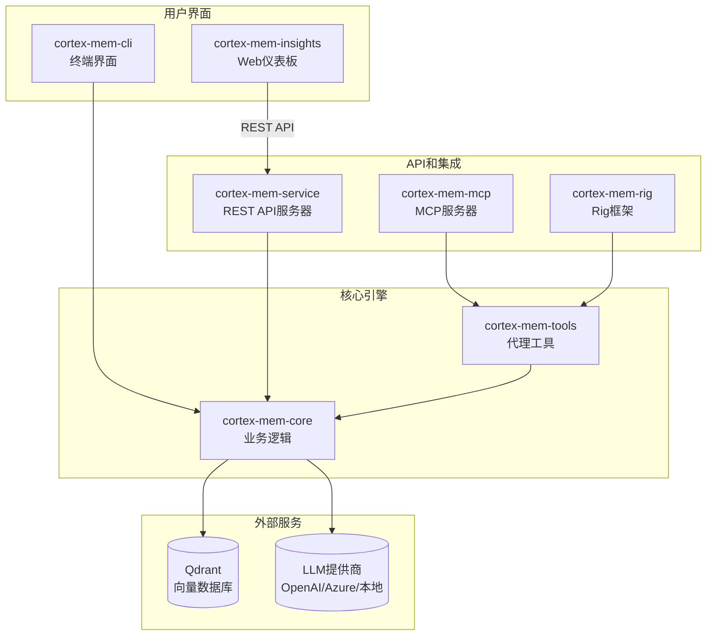

<p align="center">
  
</p>

<h1 align="center">Cortex Memory</h1>

<p align="center">
    <strong>🧠 为构建智能、上下文感知应用程序而设计的AI原生内存框架 🧠</strong>
</p>
<p align="center">使用Rust构建，Cortex Memory是一个高性能、持久化和智能的长期内存系统，赋予你的AI代理跨会话记忆、学习和个性化交互的能力。</p>

<p align="center">
    <a href="https://github.com/sopaco/cortex-mem/tree/main/litho.docs/en"></a>
    <a href="https://github.com/sopaco/cortex-mem/tree/main/litho.docs/zh"></a>
  <a href="https://raw.githubusercontent.com/sopaco/cortex-mem/refs/heads/main/assets/benchmark/cortex_mem_vs_langmem.png"></a>
  <a href="https://github.com/sopaco/cortex-mem/actions/workflows/rust.yml"></a>
  <a href="./LICENSE"></a>
</p>

<hr />

# 👋 什么是Cortex Memory？

**Cortex Memory**是一个完整的、生产就绪的框架，为你的AI应用程序提供长期记忆。它超越了简单的聊天历史，提供具有**分层三层内存架构**(L0抽象→L1概述→L2细节)的智能内存系统，自动提取、组织和优化信息，使你的AI代理更加智能和个性化。

由Rust和LLM驱动，Cortex Memory分析对话，推理事实，并使用**Qdrant向量数据库**将它们存储在结构化、可搜索的知识库中进行语义搜索。这使你的代理能够记住用户偏好、过去的交互和关键细节，从而实现更自然和上下文感知的对话。

<p align="center">
  <strong>将你的无状态AI转变为智能、上下文感知的伙伴。</strong>
</p>

<div style="text-align: center; margin: 30px 0;">
  <table style="width: 100%; border-collapse: collapse; margin: 0 auto;">
    <tr>
      <th style="width: 50%; padding: 15px; background-color: #f8f9fa; border: 1px solid #e9ecef; text-align: center; font-weight: bold; color: #495057;">使用Cortex Memory之前</th>
      <th style="width: 50%; padding: 15px; background-color: #f8f9fa; border: 1px solid #e9ecef; text-align: center; font-weight: bold; color: #495057;">使用Cortex Memory之后</th>
    </tr>
    <tr>
      <td style="padding: 15px; border: 1px solid #e9ecef; vertical-align: top;">
        <p style="font-size: 14px; color: #6c757d; margin-bottom: 10px;"><strong>无状态AI</strong></p>
        <ul style="font-size: 13px; color: #6c757d; line-height: 1.6;">
          <li>每次会话后忘记用户详细信息</li>
          <li>缺乏个性化和上下文</li>
          <li>重复问题和建议</li>
          <li>仅限于短期对话历史</li>
          <li>感觉机器人化和不个性化</li>
        </ul>
      </td>
      <td style="padding: 15px; border: 1px solid #e9ecef; vertical-align: top;">
        <p style="font-size: 14px; color: #6c757d; margin-bottom: 10px;"><strong>具有Cortex Memory的智能AI</strong></p>
        <ul style="font-size: 13px; color: #6c757d; line-height: 1.6;">
          <li>记住用户偏好和历史</li>
          <li>提供深度个性化的交互</li>
          <li>随时间学习和适应</li>
          <li>在多个对话中保持上下文</li>
          <li>建立融洽关系，感觉像一个真正的助手</li>
        </ul>
      </td>
    </tr>
  </table>
</div>

<hr />

# 😺 为什么使用Cortex Memory？

- <strong>构建更智能的代理：</strong> 赋予你的AI学习和记忆的能力，实现更智能和有用的交互。
- <strong>增强用户体验：</strong> 创建个性化、上下文感知的体验，让用户满意并建立长期参与度。
- <strong>自动化内存管理：</strong> 让系统处理提取、存储和优化记忆的复杂性。无需更多手动数据管理。
- <strong>高性能和可扩展性：</strong> 使用Rust构建，Cortex Memory快速、内存安全，并准备与你的应用程序一起扩展。
- <strong>灵活和可扩展：</strong> 通过REST API、CLI或直接库使用与你的现有系统集成。
- <strong>富有洞察力的分析：</strong> 使用提供的Web仪表板可视化和理解你代理的记忆。

🌟 <strong>适用于：</strong>
- 构建LLM驱动的聊天机器人和代理的开发人员。
- 创建个性化AI助手的团队。
- 需要内存骨干的开源项目。
- 任何想要构建真正智能AI应用程序的人！

❤️ 喜欢<strong>Cortex Memory</strong>？给它🌟或[赞助我](https://github.com/sponsors/sopaco)！❤️

# 🌠 功能和特性

- <strong>基于文件系统的存储：</strong> 内存内容使用`cortex://`虚拟URI方案存储为markdown文件，启用版本控制兼容性和可移植性。
- <strong>智能内存提取：</strong> 使用LLM驱动的分析和置信度评分，自动从对话中提取结构化记忆（事实、决定、实体）。
- <strong>基于向量的语义搜索：</strong> 通过Qdrant进行高性能相似性搜索，具有跨维度（用户/代理/会话）的元数据过滤，使用加权评分。
- <strong>多模态访问：</strong> 通过REST API、CLI、MCP协议或直接Rust库集成进行交互。
- <strong>三层内存层次结构：</strong> 渐进披露系统（L0抽象→L1概述→L2细节）通过惰性生成优化LLM上下文窗口使用。
- <strong>会话管理：</strong> 跟踪对话时间线、参与者和消息历史，具有自动索引和事件驱动处理。
- <strong>多租户支持：</strong> 通过租户感知的集合命名，在单个部署中为不同用户和代理提供隔离的内存空间。
- <strong>事件驱动自动化：</strong> 文件监视器和自动索引器，用于后台处理、同步和配置文件丰富。
- <strong>代理框架集成：</strong> 对Rig框架和模型上下文协议（MCP）的内置支持。
- <strong>Web仪表板：</strong> 用于监控、租户管理和语义搜索可视化的Svelte 5 SPA（Insights）。

# 🌐 Cortex Memory生态系统

Cortex Memory是一个由几个crate组成的模块化系统，每个crate都有特定的用途。这种设计提供了灵活性和关注点分离。



- <strong>`cortex-mem-core`</strong>: 系统的核心。包含文件系统抽象（`cortex://` URI）、LLM客户端包装器、嵌入生成、Qdrant集成、会话管理、层生成（L0/L1/L2）、提取引擎、搜索引擎和自动化编排器的业务逻辑。
- <strong>`cortex-mem-service`</strong>: 高性能REST API服务器（基于Axum），通过`/api/v2/*`端点暴露所有内存操作。
- <strong>`cortex-mem-cli`</strong>: 供开发人员和管理员直接与内存存储交互的命令行工具。
- <strong>`cortex-mem-insights`</strong>: 纯前端Svelte 5 SPA，用于通过Web界面进行监控、分析和内存管理。
- <strong>`cortex-mem-mcp`</strong>: 用于与AI助手（Claude Desktop、Cursor等）集成的模型上下文协议服务器。
- <strong>`cortex-mem-rig`</strong>: 与rig-core代理框架的集成层，用于工具注册。
- <strong>`cortex-mem-tools`</strong>: 用于代理集成的MCP工具模式和操作包装器。
- <strong>`cortex-mem-config`</strong>: 配置管理模块，处理TOML加载、环境变量解析和租户特定覆盖。

# 🖼️ 可观测性仪表板

Cortex Memory包括一个强大的基于Web的仪表板（`cortex-mem-insights`），提供实时监控、分析和管理功能。该仪表板是一个纯前端Svelte 5 SPA，连接到`cortex-mem-service` REST API。

<p align="center">
  
</p>

<p align="center">
  <em><strong>交互式仪表板：</strong> 租户概览、系统健康状况和存储统计一览无余</em>
</p>

### 关键功能

- **租户管理**: 查看和切换具有隔离内存空间的多个租户
- **内存浏览器**: 浏览`cortex://`文件系统以查看和管理内存文件
- **语义搜索**: 在内存存储中执行自然语言查询
- **健康监控**: 实时服务状态和LLM可用性检查

### 运行仪表板

```bash
# 首先启动后端服务
cortex-mem-service --data-dir ./cortex-data --port 8085

# 在另一个终端中，启动insights仪表板
cd cortex-mem-insights
bun install
bun run dev
```

仪表板将在`http://localhost:5173`上可用，并将API请求代理到后端服务。

# 🌟 社区展示：Cortex TARS

认识**Cortex TARS**——一个生产就绪的AI原生TUI（终端用户界面）应用程序，展示了Cortex Memory的真正力量。作为"第二大脑"伙伴构建，Cortex TARS将**听觉存在**带给你的AI体验，并且能真正听到并在现实世界中记住你的声音，展示了持久记忆如何将AI交互从短暂的聊天转变为持久的、智能的伙伴关系。

### 🎤 实时音频到内存（游戏规则改变者）
**这是Cortex TARS真正闪耀的地方。** 通过实时设备音频捕获，Cortex TARS可以监听你的对话、会议或讲座，并自动将它们转换为结构化、可搜索的记忆。想象一下参加会议时，Cortex TARS静默捕获关键见解、决定和行动项——全部存储并准备好以后立即检索。不再有疯狂的笔记记录或忘记细节！

## 为什么Cortex TARS重要

Cortex TARS不仅仅是一个例子——它是一个完全功能的应用程序，展示了：

- **真实世界的生产就绪性**：使用Rust构建，它快速、可靠且内存安全
- **无缝Cortex Memory集成**：展示利用内存框架的最佳实践
- **实用的AI工作流**：从多代理对话到音频捕获和内存提取
- **以用户为中心的设计**：美观的TUI界面，具有直观的控制和丰富的功能

## 探索Cortex TARS

准备看到Cortex Memory的实际应用？深入了解Cortex TARS项目：

```bash
cd examples/cortex-mem-tars
cargo build --release
cargo run --release
```

查看[Cortex TARS README](examples/cortex-mem-tars/README.md)获取详细的设置说明、配置指南和使用示例。

**Cortex TARS证明Cortex Memory不仅仅是一个框架——它是构建真正理解并记住的智能、内存感知应用程序的基础。**

# 🏆 基准测试

Cortex Memory已使用**LOCOMO数据集**（50个对话，150个问题）通过标准化的内存系统评估框架对LangMem进行了严格评估。结果显示Cortex Memory在多个维度上具有优异的性能。

## 性能比较

<p align="center">
  
</p>

<p align="center">
  <em><strong>整体性能：</strong> Cortex Memory在所有关键指标上显著优于LangMem</em>
</p>

### 关键指标

| 指标 | Cortex Memory | LangMem | 提升 |
|--------|---------------|---------|-------------|
| **Recall@1** | 93.33% | 26.32% | **+67.02pp** |
| **Recall@3** | 94.00% | 50.00% | +44.00pp |
| **Recall@5** | 94.67% | 55.26% | +39.40pp |
| **Recall@10** | 94.67% | 63.16% | +31.51pp |
| **Precision@1** | 93.33% | 26.32% | +67.02pp |
| **MRR** | 93.72% | 38.83% | **+54.90pp** |
| **NDCG@5** | 80.73% | 18.72% | **+62.01pp** |
| **NDCG@10** | 79.41% | 16.83% | **+62.58pp** |

### 详细结果

<div style="text-align: center;">
  <table style="width: 100%; margin: 0 auto;">
    <tr>
        <th style="width: 50%;"><strong>Cortex Memory评估：</strong> 优秀的检索性能，Recall@1达到93.33%，MRR达到93.72%</td>
        <th style="width: 50%;"><strong>LangMem评估：</strong> 适中性能，Recall@1为26.32%，MRR为38.83%</td>
    </tr>
    <tr>
      <td style="width: 50%;"></td>
      <td style="width: 50%;"></td>
    </tr>
  </table>
</div>

### 关键发现

1. **显著提高的检索准确性**：Cortex Memory达到**93.33% Recall@1**，比LangMem的26.32%**提高了67.02个百分点**。这表明Cortex在第一次尝试检索相关记忆方面远超LangMem。

2. **明显的排序质量优势**：Cortex Memory的**MRR为93.72%**，而LangMem为**38.83%**，表明它不仅检索准确，而且在结果列表中将相关记忆排名更高。

3. **全面的性能领导地位**：在所有指标上——尤其是**NDCG@5（80.73% vs 18.72%）**——Cortex展示了在检索质量、排序准确性和整体性能上的一致性、显著优势。

4. **技术优势**：Cortex Memory的性能归因于：
   - 高效的**基于Rust的实现**
   - **Qdrant向量数据库**的强大检索能力
   - **三层内存层次结构**（L0/L1/L2）与加权评分
   - 优化的内存管理策略

### 评估框架

基准测试使用位于`examples/lomoco-evaluation`的专业内存系统评估框架，其中包括：

- **专业指标**：Recall@K、Precision@K、MRR、NDCG和答案质量指标
- **增强数据集**：50个对话和150个问题，涵盖各种场景
- **统计分析**：95%置信区间、标准偏差和基于类别的统计
- **多系统支持**：支持Cortex Memory、LangMem和Simple RAG基线之间的比较

有关运行评估的更多详细信息，请参阅[lomoco-evaluation README](examples/lomoco-evaluation/README.md)。

# 🧠 工作原理

Cortex Memory使用复杂的管道来处理和管理记忆，围绕结合**虚拟文件系统**持久性与基于向量的**语义搜索**的**混合存储架构**。


## 内存架构

Cortex Memory使用**虚拟文件系统**方法和`cortex://` URI方案组织数据：

```
cortex://{dimension}/{scope}/{category}/{id}
```

- **维度**: `user`(用户)、`agent`(代理)、`session`(会话)或`resources`(资源)
- **范围**: 租户或标识符
- **类别**: `memories`(记忆)、`profiles`(配置文件)、`entities`(实体)、`sessions`(会话)等
- **ID**: 唯一记忆标识符

## 三层内存层次结构

Cortex Memory实现了具有三个抽象层的**渐进披露**系统：

| 层 | 目的 | 令牌使用 | 用例 |
|-------|---------|-------------|----------|
| **L0 (抽象)** | 快速定位，粗粒度候选选择 | ~100个令牌 | 初始筛选（20%权重） |
| **L1 (概述)** | 结构化摘要，包含关键点和实体 | ~500-2000个令牌 | 上下文精炼（30%权重） |
| **L2 (细节)** | 完整对话内容 | 可变 | 精确匹配（50%权重） |

这种分层方法通过只加载必要的细节级别来优化LLM上下文窗口使用。搜索引擎使用结合所有三个层L0/L1/L2的**加权评分**。

# 🖥 入门指南

### 先决条件
- [**Rust**](https://www.rust-lang.org) (版本1.86或更高版本)
- [**Qdrant**](https://qdrant.tech/) 向量数据库 (版本1.7+)
- 与**OpenAI兼容**的LLM API端点（用于内存提取和分析）
- 与**OpenAI兼容**的嵌入API端点（用于向量搜索）

### 安装
入门的最简单方法是使用CLI和服务二进制文件，可以通过`cargo`安装。
```sh
# 安装CLI以进行命令行管理
cargo install --path cortex-mem-cli

# 安装REST API服务以进行应用程序集成
cargo install --path cortex-mem-service

# 安装MCP服务器用于AI助手集成
cargo install --path cortex-mem-mcp
```

### 配置
Cortex Memory应用程序（`cortex-mem-cli`、`cortex-mem-service`、`cortex-mem-mcp`）通过`config.toml`文件进行配置。默认情况下，CLI将在当前目录中查找此文件，或者您可以使用`-c`或`--config`标志传递路径。

这是一个附带解释的示例`config.toml`：

```toml
# -----------------------------------------------------------------------------
# Qdrant向量数据库配置
# -----------------------------------------------------------------------------
[qdrant]
url = "http://localhost:6334"     # 你的Qdrant实例的URL（gRPC端口）
http_url = "http://localhost:6333" # REST API的HTTP URL
collection_name = "cortex-memory"  # 集合的基本名称（添加租户后缀）
timeout_secs = 5                  # Qdrant操作的超时时间
embedding_dim = 1536              # 嵌入维度（例如，text-embedding-3-small为1536）

# -----------------------------------------------------------------------------
# LLM（大语言模型）配置（用于推理、提取）
# -----------------------------------------------------------------------------
[llm]
api_base_url = "https://api.openai.com/v1" # 你的LLM提供商的基本URL
api_key = "${OPENAI_API_KEY}"              # API密钥（支持环境变量）
model_efficient = "gpt-5-mini"            # 用于提取和分类的模型
model_reasoning = "o1-preview"             # 用于复杂推理的模型（可选）
temperature = 0.7                          # LLM响应的采样温度
max_tokens = 8192                          # LLM生成的最大令牌数
timeout_secs = 60                           # LLM请求的超时时间

# -----------------------------------------------------------------------------
# 嵌入服务配置
# -----------------------------------------------------------------------------
[embedding]
api_base_url = "https://api.openai.com/v1" # 你的嵌入提供商的基本URL
api_key = "${OPENAI_API_KEY}"              # API密钥（支持环境变量）
model_name = "text-embedding-3-small"      # 要使用的嵌入模型的名称
batch_size = 32                            # 在单个批次中嵌入的文本数量
timeout_secs = 30                          # 嵌入请求的超时时间

# -----------------------------------------------------------------------------
# Cortex数据目录配置
# -----------------------------------------------------------------------------
[cortex]
data_dir = "./cortex-data"  # 用于存储记忆文件和会话的目录

# -----------------------------------------------------------------------------
# 自动化配置
# -----------------------------------------------------------------------------
[automation]
auto_index = true           # 在文件更改时启用自动索引
auto_extract = true         # 在会话关闭时启用自动提取
index_interval_secs = 5     # 文件监视器的轮询间隔
batch_delay_secs = 2       # 处理批量更改之前的延迟
```

# 🚀 使用方法

### CLI (`cortex-mem-cli`)

CLI提供了一个强大的接口，用于直接与内存系统交互。所有命令都需要一个`config.toml`文件，可以使用`--config <path>`指定。`--tenant`标志允许多租户隔离。

#### 添加记忆
将新消息添加到会话线程，自动将其存储在内存系统中。

```sh
cortex-mem-cli --config config.toml --tenant acme add --thread thread-123 --role user --content "用户对Rust编程感兴趣。"
```
- `--thread <id>`: (必需) 线程/会话ID。
- `--role <role>`: 消息角色（user/assistant/system）。默认："user"
- `--content <text>`: 消息的文本内容。

#### 搜索记忆
在内存存储中执行语义向量搜索，使用加权L0/L1/L2评分。

```sh
cortex-mem-cli --config config.toml --tenant acme search "用户的爱好是什么？" --thread thread-123 --limit 10
```
- `query`: 搜索的自然语言查询。
- `--thread <id>`: 按线程ID过滤记忆。
- `--limit <n>`: 最大结果数。默认：10
- `--min-score <score>`: 最小相关性得分（0.0-1.0）。默认：0.3
- `--scope <scope>`: 搜索范围："session"、"user"或"agent"。默认："session"

#### 列出记忆
从特定URI路径检索记忆列表。

```sh
cortex-mem-cli --config config.toml --tenant acme list --uri "cortex://session" --include-abstracts
```
- `--uri <path>`: 要列出的URI路径（例如，"cortex://session"或"cortex://user/preferences"）。
- `--include-abstracts`: 在结果中包含L0摘要。

#### 获取特定记忆
按URI检索特定记忆。

```sh
cortex-mem-cli --config config.toml --tenant acme get "cortex://session/thread-123/memory-456.md"
```
- `uri`: 记忆URI。
- `--abstract-only`: 显示L0摘要而不是完整内容。

#### 删除记忆
按URI从存储中删除记忆。

```sh
cortex-mem-cli --config config.toml --tenant acme delete "cortex://session/thread-123/memory-456.md"
```

#### 会话管理
管理对话会话。

```sh
# 列出所有会话
cortex-mem-cli --config config.toml --tenant acme session list

# 创建新会话
cortex-mem-cli --config config.toml --tenant acme session create thread-456 --title "我的会话"

# 关闭会话（触发提取）
cortex-mem-cli --config config.toml --tenant acme session close thread-456
```

#### 同步和统计
同步文件系统与向量存储并显示系统统计信息。

```sh
# 文件系统与向量存储之间的手动同步
cortex-mem-cli --config config.toml --tenant acme sync

# 显示系统统计信息
cortex-mem-cli --config config.toml --tenant acme stats
```

### REST API (`cortex-mem-service`)

REST API允许你将Cortex Memory集成到任何应用程序中，无论使用何种编程语言。服务默认运行在端口8085上。

#### 启动服务
```sh
# 使用默认设置启动API服务器
cortex-mem-service --data-dir ./cortex-data --host 127.0.0.1 --port 8085

# 启用详细日志记录
cortex-mem-service -d ./cortex-data -h 127.0.0.1 -p 8085 --verbose
```

#### API端点

**健康检查**
- `GET /health`: 服务存活检查
- `GET /health/ready`: 准备就绪检查（Qdrant、LLM连接性）

**文件系统操作**
- `GET /api/v2/filesystem/list?uri=<path>`: 列出目录内容。
- `GET /api/v2/filesystem/read/<path>`: 读取文件内容。
- `POST /api/v2/filesystem/write`: 向文件写入内容。
- `GET /api/v2/filesystem/stats?uri=<path>`: 获取目录统计信息。

**会话管理**
- `GET /api/v2/sessions`: 列出所有会话。
- `POST /api/v2/sessions`: 创建新会话。
- `POST /api/v2/sessions/:thread_id/messages`: 向会话添加消息。
- `POST /api/v2/sessions/:thread_id/close`: 关闭会话并触发内存提取。

**语义搜索**
- `POST /api/v2/search`: 在记忆中执行语义搜索，使用加权L0/L1/L2评分。

**自动化**
- `POST /api/v2/automation/extract/:thread_id`: 为线程触发内存提取。
- `POST /api/v2/automation/index/:thread_id`: 为线程触发向量索引。
- `POST /api/v2/automation/index-all`: 索引所有线程。
- `POST /api/v2/automation/sync`: 手动触发文件系统与向量存储之间的同步。

**租户管理**
- `GET /api/v2/tenants/tenants`: 列出所有可用租户。
- `POST /api/v2/tenants/tenants/switch`: 切换活动租户上下文。
- `GET /api/v2/tenants/{id}/stats`: 获取每个租户的存储指标。

#### 示例：创建会话并添加消息

```bash
# 创建新会话
curl -X POST http://localhost:8085/api/v2/sessions \
  -H "Content-Type: application/json" \
  -d '{
    "thread_id": "thread-123",
    "title": "支持对话"
  }'

# 向会话添加消息
curl -X POST http://localhost:8085/api/v2/sessions/thread-123/messages \
  -H "Content-Type: application/json" \
  -d '{
    "role": "user",
    "content": "我刚升级到高级计划。"
  }'
```

#### 示例：触发内存提取

```bash
# 从会话中提取记忆（通常在会话关闭时调用）
curl -X POST http://localhost:8085/api/v2/automation/extract/thread-123 \
  -H "Content-Type: application/json" \
  -d '{ "auto_save": true }'
```

### 模型上下文协议(MCP)服务器 (`cortex-mem-mcp`)

Cortex Memory提供了一个MCP服务器，用于与Claude Desktop、Cursor或GitHub Copilot等AI助手集成。MCP服务器通过stdio传输暴露内存工具。

```sh
# 运行带有配置的MCP服务器
cortex-mem-mcp --config config.toml --tenant acme
```

MCP服务器提供以下工具：
- **store_memory**: 存储新的事实或对话摘要
- **query_memory**: 使用自然语言搜索记忆
- **list_memories**: 按URI前缀枚举可用记忆
- **get_memory**: 按URI检索特定记忆
- **delete_memory**: 按URI删除记忆

通过将MCP服务器添加到助手配置中，可以配置AI助手使用MCP服务器。

# 🤝 贡献
我们欢迎所有形式的贡献！通过[GitHub Issues](https://github.com/sopaco/cortex-mem/issues)报告错误或提交功能请求。

### 开发流程
1. Fork此项目
2. 创建功能分支(`git checkout -b feature/amazing-feature`)
3. 提交你的更改(`git commit -m '添加一些很棒的功能'`)
4. 推送到分支(`git push origin feature/amazing-feature`)
5. 创建拉取请求

# 🪪 许可证
本项目根据**MIT许可证**授权。详情请参见[LICENSE](LICENSE)文件。