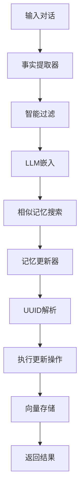
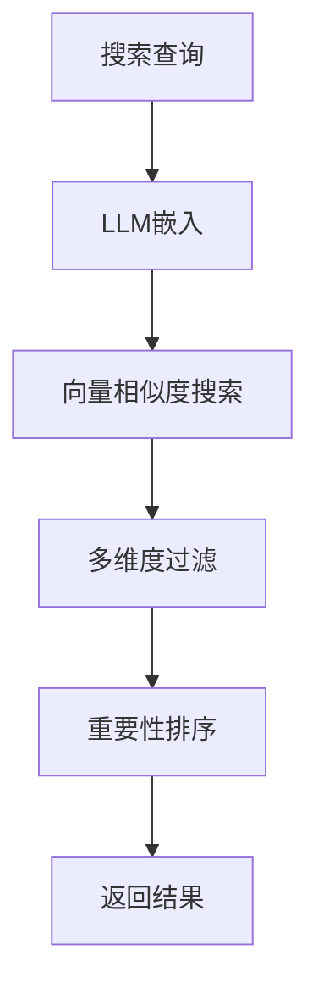

# 架构概览

## 总体架构

Memo-RS采用分层架构设计，从上到下分为应用层、服务层、核心层和数据层四个层次。各层之间通过明确的接口进行交互，确保系统的模块化和可扩展性。

```
┌─────────────────────────────────────────────────────────────┐
│                      应用层 (Application Layer)               │
├─────────────────────────────────────────────────────────────┤
│  CLI工具  │  HTTP API  │  Rig集成  │  第三方应用              │
└─────────────────────────────────────────────────────────────┘
                            │
                            ▼
┌─────────────────────────────────────────────────────────────┐
│                      服务层 (Service Layer)                  │
├─────────────────────────────────────────────────────────────┤
│                ConversationProcessor                        │
│                  (对话处理器)                                │
└─────────────────────────────────────────────────────────────┘
                            │
                            ▼
┌─────────────────────────────────────────────────────────────┐
│                      核心层 (Core Layer)                     │
├─────────────────────────────────────────────────────────────┤
│  MemoryManager  │  FactExtractor  │  MemoryUpdater          │
│   (记忆管理器)      (事实提取器)       (记忆更新器)            │
│                                                             │
│  ImportanceEvaluator  │  DuplicateDetector  │  Classifier   │
│    (重要性评估器)        (去重检测器)             (分类器)      │
└─────────────────────────────────────────────────────────────┘
                            │
                            ▼
┌─────────────────────────────────────────────────────────────┐
│                      数据层 (Data Layer)                     │
├─────────────────────────────────────────────────────────────┤
│  LLMClient  │  VectorStore  │  EmbeddingService  │  Storage │
│   (LLM客户端)   (向量存储)        (嵌入服务)          (存储)   │
└─────────────────────────────────────────────────────────────┘
```

## 核心组件详解

### 1. 记忆管理器 (MemoryManager)

记忆管理器是整个系统的核心组件，负责协调各个子组件的工作，提供统一的记忆操作接口。

#### 核心职责
- **记忆生命周期管理**: 创建、更新、删除记忆
- **工作流编排**: 协调事实提取、相似度搜索、记忆更新等流程
- **配置管理**: 加载和管理系统配置参数
- **错误处理**: 统一处理各组件的错误并提供恢复机制

#### 关键接口
```rust
pub struct MemoryManager {
    vector_store: Box<dyn VectorStore>,
    llm_client: Box<dyn LLMClient>,
    config: MemoryConfig,
    fact_extractor: Box<dyn FactExtractor>,
    memory_updater: Box<dyn MemoryUpdater>,
    importance_evaluator: Box<dyn ImportanceEvaluator>,
    duplicate_detector: Box<dyn DuplicateDetector>,
    memory_classifier: Box<dyn MemoryClassifier>,
}

impl MemoryManager {
    // 添加对话记忆
    pub async fn add_memory(&self, messages: &[Message], metadata: MemoryMetadata) -> Result<Vec<MemoryResult>>;
    
    // 搜索记忆
    pub async fn search(&self, query: &str, filters: &Filters, limit: usize) -> Result<Vec<ScoredMemory>>;
    
    // 获取记忆
    pub async fn get(&self, id: &str) -> Result<Option<Memory>>;
    
    // 更新记忆
    pub async fn update(&self, id: &str, content: String) -> Result<()>;
}
```

#### 设计模式
- **外观模式**: 为复杂的记忆操作提供简化的接口
- **策略模式**: 支持不同的提取、更新策略
- **工厂模式**: 动态创建各种子组件实例

### 2. 事实提取器 (FactExtractor)

事实提取器负责从原始对话中提取结构化的关键信息，是实现智能记忆的关键组件。

#### 工作流程
```
原始对话 → 内容解析 → 事实提取 → 结构化处理 → 去重过滤 → 输出结果
```

#### 提取策略
- **用户事实提取**: 提取用户明确陈述的信息
- **助手事实提取**: 提取助手响应中的用户相关信息
- **对话事实提取**: 提取对话整体的结构化信息
- **程序型记忆提取**: 提取步骤化的操作信息

#### 核心技术
```rust
#[async_trait]
pub trait FactExtractor: Send + Sync {
    async fn extract_facts(&self, messages: &[Message]) -> Result<Vec<ExtractedFact>>;
    async fn extract_user_facts(&self, messages: &[Message]) -> Result<Vec<ExtractedFact>>;
    async fn extract_assistant_facts(&self, messages: &[Message]) -> Result<Vec<ExtractedFact>>;
}

#[derive(Debug, Clone, Serialize, Deserialize)]
pub struct ExtractedFact {
    pub content: String,           // 事实内容
    pub importance: f32,           // 重要性评分
    pub category: FactCategory,    // 事实分类
    pub entities: Vec<String>,     // 实体信息
    pub language: Option<LanguageInfo>, // 语言信息
    pub source_role: String,       // 来源角色
}
```

#### 智能过滤机制
- **语义去重**: 识别和过滤语义相似的事实
- **重要性筛选**: 根据重要性评分过滤低价值信息
- **类别过滤**: 排除技术说明、建议等非用户信息
- **实体识别**: 自动提取关键实体和概念

### 3. 记忆更新器 (MemoryUpdater)

记忆更新器负责决定新提取的事实如何与现有记忆交互，包括更新、合并、忽略等操作。

#### 更新决策流程
```
新事实 → 相似度计算 → 现有记忆检索 → LLM决策 → 执行操作 → 更新结果
```

#### 更新策略
- **IGNORE**: 忽略冗余或已覆盖的事实
- **MERGE**: 与现有记忆合并相关信息
- **UPDATE**: 更新现有记忆添加新信息
- **CREATE**: 创建全新的记忆记录

#### UUID映射系统
为了解决LLM可能产生的UUID幻觉问题，系统实现了智能的UUID映射：

```rust
struct UuidMapping {
    temp_to_real: HashMap<String, String>, // 临时UUID到真实UUID的映射
    real_to_temp: HashMap<String, String>, // 真实UUID到临时UUID的映射
}
```

### 4. 向量存储 (VectorStore)

向量存储层抽象了底层存储实现的差异，提供了统一的向量操作接口。

#### 抽象接口
```rust
#[async_trait]
pub trait VectorStore: Send + Sync + dyn_clone::DynClone {
    async fn insert(&self, memory: &Memory) -> Result<()>;
    async fn search(&self, query_vector: &[f32], filters: &Filters, limit: usize) -> Result<Vec<ScoredMemory>>;
    async fn search_with_threshold(&self, query_vector: &[f32], filters: &Filters, limit: usize, score_threshold: Option<f32>) -> Result<Vec<ScoredMemory>>;
    async fn update(&self, memory: &Memory) -> Result<()>;
    async fn delete(&self, id: &str) -> Result<()>;
}
```

#### Qdrant实现
当前默认使用Qdrant作为向量存储后端：
- **高性能**: 专为相似性搜索优化
- **分布式**: 支持水平扩展
- **持久化**: 可靠的数据持久化
- **索引优化**: 自动维护向量索引

### 5. LLM客户端 (LLMClient)

LLM客户端抽象层屏蔽了不同LLM提供商的差异，提供统一的能力接口。

#### 能力接口
```rust
#[async_trait]
pub trait LLMClient: Send + Sync + dyn_clone::DynClone {
    async fn complete(&self, prompt: &str) -> Result<String>;           // 文本生成
    async fn embed(&self, text: &str) -> Result<Vec<f32>>;               // 单文本嵌入
    async fn embed_batch(&self, texts: &[String]) -> Result<Vec<Vec<f32>>>; // 批量嵌入
    async fn extract_keywords(&self, content: &str) -> Result<Vec<String>>; // 关键词提取
    async fn summarize(&self, content: &str, max_length: Option<usize>) -> Result<String>; // 摘要生成
}
```

#### Rig框架集成
使用Rig框架实现与OpenAI API的集成：
- **异步操作**: 完整的异步操作支持
- **错误处理**: 完善的错误处理和重试机制
- **配置灵活**: 支持多种模型和参数配置

## 数据流架构

### 记忆写入流程


### 记忆检索流程


## 配置架构

### 配置层次结构
```
应用配置 (Application)
    ├── LLM配置 (LLMConfig)
    ├── 记忆配置 (MemoryConfig)
    ├── Qdrant配置 (QdrantConfig)
    ├── 服务器配置 (ServerConfig)
    └── 嵌入配置 (EmbeddingConfig)
```

### 配置加载机制
```rust
impl Config {
    // 从环境变量加载配置
    pub fn from_env() -> Result<Self> {
        Ok(Config {
            qdrant: QdrantConfig::from_env()?,
            llm: LLMConfig::from_env()?,
            server: ServerConfig::from_env()?,
            embedding: EmbeddingConfig::from_env()?,
            memory: MemoryConfig::from_env()?,
        })
    }
}
```

## 扩展性设计

### 模块化架构
- **松耦合设计**: 各模块通过明确接口交互
- **插件化组件**: 支持动态替换和扩展组件
- **策略模式**: 不同场景使用不同处理策略
- **工厂模式**: 动态创建组件实例

### 多后端支持
- **向量存储**: 可插拔的向量存储后端
- **LLM提供商**: 支持多种LLM API提供商
- **存储后端**: 灵活的存储配置选项
- **部署方式**: 支持单机和分布式部署

## 性能优化策略

### 内存优化
- **对象池**: 重用内存对象减少分配
- **懒加载**: 延迟加载非关键组件
- **内存映射**: 大数据集的内存映射访问
- **垃圾回收**: 最小化内存分配和回收

### 计算优化
- **异步并发**: 充分利用异步IO
- **批量操作**: 批量处理提高效率
- **缓存策略**: 缓存热点数据和计算结果
- **算法优化**: 高效的相似度计算算法

### 存储优化
- **向量化**: 利用SIMD指令加速计算
- **索引优化**: 智能的向量索引策略
- **分片存储**: 数据分片提高并发性
- **压缩存储**: 压缩向量和元数据

---

**架构设计原则**: 简单、可靠、高性能、可扩展、易维护