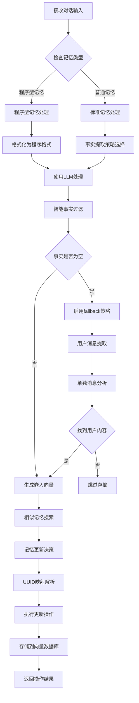
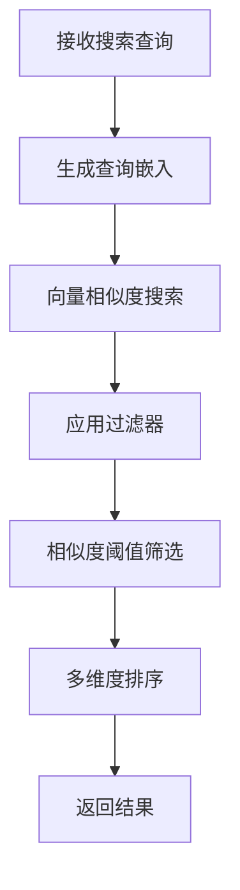
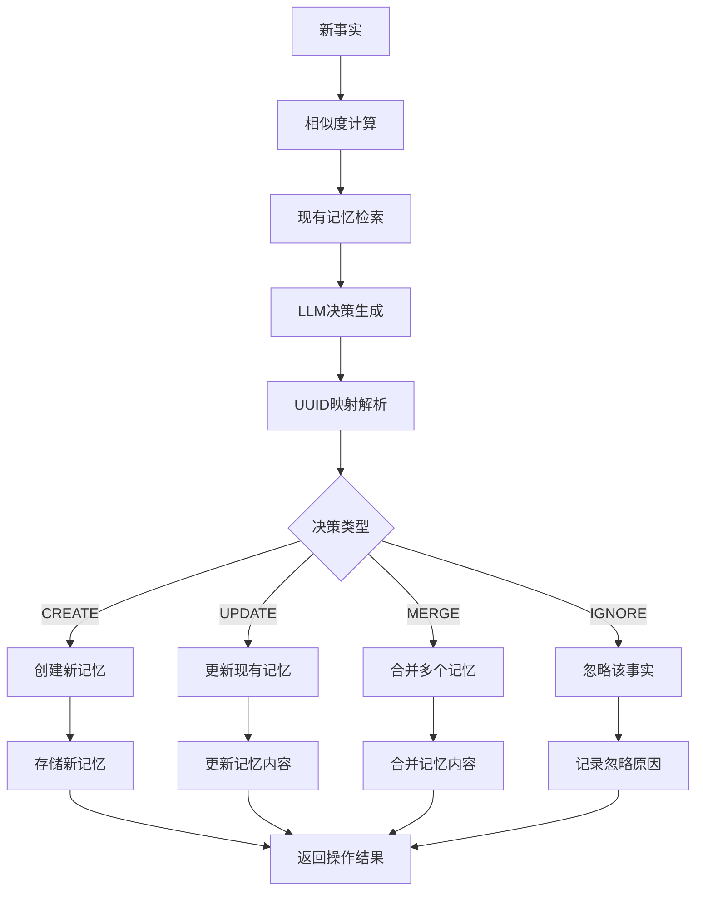

# 核心流程

本文档详细描述Memo-RS系统的核心工作流程，包括记忆存储、检索、更新和管理的主要流程。

## 1. 记忆存储流程

记忆存储是系统的核心功能，涉及从原始对话到结构化记忆的完整转换过程。

### 1.1 总体流程图



### 1.2 详细步骤说明

#### 步骤1: 输入预处理
```rust
pub async fn add_memory(
    &self,
    messages: &[Message],
    metadata: MemoryMetadata,
) -> Result<Vec<MemoryResult>> {
    if messages.is_empty() {
        return Ok(vec![]);
    }

    // 检查是否为程序型记忆
    if metadata.agent_id.is_some() && metadata.memory_type == MemoryType::Procedural {
        return self.create_procedural_memory(messages, metadata).await;
    }
    // ... 其他处理逻辑
}
```

#### 步骤2: 智能策略选择
系统根据对话内容自动选择最佳提取策略：
- **DualChannel**: 双通道提取（用户+助手信息）
- **UserOnly**: 仅提取用户信息
- **AssistantOnly**: 仅提取助手信息
- **ProceduralMemory**: 程序型记忆提取

```rust
fn analyze_conversation_context(&self, messages: &[Message]) -> ExtractionStrategy {
    let mut has_user = false;
    let mut has_assistant = false;
    
    for msg in messages {
        match msg.role.as_str() {
            "user" => has_user = true,
            "assistant" => has_assistant = true,
            _ => {}
        }
    }
    
    if has_user && has_assistant {
        ExtractionStrategy::DualChannel
    } else if has_user {
        ExtractionStrategy::UserOnly
    } else if has_assistant {
        ExtractionStrategy::AssistantOnly
    } else {
        ExtractionStrategy::UserOnly
    }
}
```

#### 步骤3: 事实提取
采用LLM驱动的智能事实提取：
```rust
async fn extract_facts(&self, messages: &[Message]) -> Result<Vec<ExtractedFact>> {
    let extraction_strategy = self.analyze_conversation_context(messages);
    
    match extraction_strategy {
        ExtractionStrategy::DualChannel => {
            let user_facts = self.extract_user_facts(messages).await?;
            let assistant_facts = self.extract_meaningful_assistant_facts(messages).await?;
            [user_facts, assistant_facts].concat()
        }
        // ... 其他策略
    }
}
```

#### 步骤4: 智能过滤
实现多层次的事实过滤机制：
```rust
async fn intelligent_fact_filtering(&self, facts: Vec<ExtractedFact>) -> Result<Vec<ExtractedFact>> {
    let mut filtered_facts = Vec::new();
    let mut seen_contents = std::collections::HashSet::new();

    for fact in &facts {
        // 语义去重检查
        if !seen_contents.contains(&fact.content.to_lowercase()) {
            // 重要性阈值过滤
            if fact.importance >= 0.5 {
                seen_contents.insert(fact.content.to_lowercase());
                filtered_facts.push(fact.clone());
            }
        }
    }
    Ok(filtered_facts)
}
```

#### 步骤5: 相似记忆搜索
为每个事实搜索相似的现有记忆：
```rust
for fact in &final_extracted_facts {
    let query_embedding = self.llm_client.embed(&fact.content).await?;
    let existing_memories = self
        .vector_store
        .search(&query_embedding, &filters, 5)
        .await?;
    // ... 后续处理
}
```

#### 步骤6: 智能更新决策
使用LLM决定最佳更新策略：
```rust
async fn update_memories(
    &self,
    facts: &[ExtractedFact],
    existing_memories: &[ScoredMemory],
    metadata: &MemoryMetadata,
) -> Result<UpdateResult> {
    let prompt = self.build_update_prompt(facts, existing_memories);
    let response = self.llm_client.complete(&prompt).await?;
    let decisions = self.parse_update_decisions(&response)?;
    // ... 执行决策
}
```

## 2. 记忆检索流程

### 2.1 搜索流程图



### 2.2 搜索实现

#### 基础搜索
```rust
pub async fn search(
    &self,
    query: &str,
    filters: &Filters,
    limit: usize,
) -> Result<Vec<ScoredMemory>> {
    let query_embedding = self.llm_client.embed(query).await?;
    let results = self
        .vector_store
        .search(&query_embedding, filters, limit)
        .await?;
    Ok(results)
}
```

#### 带阈值的搜索
```rust
pub async fn search_with_threshold(
    &self,
    query: &str,
    filters: &Filters,
    limit: usize,
    similarity_threshold: Option<f32>,
) -> Result<Vec<ScoredMemory>> {
    let threshold = similarity_threshold.or(self.config.search_similarity_threshold);
    let query_embedding = self.llm_client.embed(query).await?;
    
    let mut results = self
        .vector_store
        .search_with_threshold(&query_embedding, filters, limit, threshold)
        .await?;
    
    // 重要性加权排序
    results.sort_by(|a, b| {
        let score_a = a.score * 0.7 + a.memory.metadata.importance_score * 0.3;
        let score_b = b.score * 0.7 + b.memory.metadata.importance_score * 0.3;
        score_b.partial_cmp(&score_a).unwrap_or(std::cmp::Ordering::Equal)
    });
    
    Ok(results)
}
```

## 3. 记忆更新流程

### 3.1 更新决策流程



### 3.2 更新策略优化

#### 优先级策略
更新策略按以下优先级执行：
1. **IGNORE**: 优先忽略冗余信息
2. **MERGE**: 合并相关但重复的信息  
3. **UPDATE**: 仅在添加实质性新信息时更新
4. **CREATE**: 仅在信息完全新颖且有价值时创建

```rust
For each fact, decide one of the following actions (in order of preference):
3. IGNORE - Ignore the fact if it's redundant, already covered, or not user-specific information
2. MERGE - Merge with existing memories if the fact contains related or complementary information  
1. UPDATE - Update an existing memory ONLY if the fact adds genuinely new, substantial information
0. CREATE - Create a new memory ONLY if the fact is completely novel and not related to existing content
```

#### UUID映射解决
为了解决LLM可能产生的UUID幻觉问题：
```rust
fn resolve_memory_ids(&self, llm_ids: &[String]) -> Vec<String> {
    llm_ids.iter()
        .filter_map(|llm_id| self.temp_to_real.get(llm_id).cloned())
        .collect()
}
```

## 4. 程序型记忆处理流程

### 4.1 程序型记忆特点
- 专注于操作步骤和过程
- 强调动作-结果的结构
- 适用于工具使用、API调用等场景

### 4.2 处理流程
```rust
pub async fn create_procedural_memory(
    &self,
    messages: &[Message],
    metadata: MemoryMetadata,
) -> Result<Vec<MemoryResult>> {
    // 格式化对话为程序格式
    let formatted_messages = self.format_conversation_for_procedural_memory(messages);
    
    // 使用专门的程序型记忆提示
    let prompt = format!(
        "{}\n\n对话记录:\n{}",
        PROCEDURAL_MEMORY_SYSTEM_PROMPT, 
        formatted_messages
    );
    
    // 生成程序型记忆
    let response = self.llm_client.complete(&prompt).await?;
    let memory_id = self.store(response.clone(), metadata).await?;
    
    Ok(vec![MemoryResult {
        id: memory_id.clone(),
        memory: response,
        event: MemoryEvent::Add,
        actor_id: messages.last().and_then(|msg| msg.name.clone()),
        role: messages.last().map(|msg| msg.role.clone()),
        previous_memory: None,
    }])
}
```

## 5. 错误处理与恢复机制

### 5.1 错误分类
- **提取失败**: 事实提取器无法提取有效信息
- **存储失败**: 向量存储操作失败
- **网络错误**: LLM API调用失败
- **配置错误**: 环境配置不正确

### 5.2 恢复策略

#### 事实提取失败处理
```rust
let mut final_extracted_facts = extracted_facts;
if final_extracted_facts.is_empty() {
    debug!("No facts extracted, trying alternative extraction methods");
    
    // 尝试仅用户消息提取
    let user_messages: Vec<_> = messages.iter()
        .filter(|msg| msg.role == "user")
        .cloned()
        .collect();
    
    if !user_messages.is_empty() {
        if let Ok(user_facts) = self.fact_extractor.extract_user_facts(&user_messages).await {
            final_extracted_facts = user_facts;
        }
    }
    
    // 如果仍然失败，使用最终fallback
    if final_extracted_facts.is_empty() {
        let user_content = messages
            .iter()
            .filter(|msg| msg.role == "user")
            .map(|msg| format!("用户: {}", msg.content))
            .collect::<Vec<_>>()
            .join("\n");
            
        if !user_content.trim().is_empty() {
            let memory_id = self.store(user_content.clone(), metadata).await?;
            return Ok(vec![MemoryResult {
                id: memory_id.clone(),
                memory: user_content,
                event: MemoryEvent::Add,
                actor_id: messages.last().and_then(|msg| msg.name.clone()),
                role: messages.last().map(|msg| msg.role.clone()),
                previous_memory: None,
            }]);
        }
    }
}
```

#### LLM服务失败处理
```rust
async fn complete(&self, prompt: &str) -> Result<String> {
    let max_retries = 3;
    let mut last_error = None;
    
    for attempt in 0..max_retries {
        match self.client.completion(prompt).await {
            Ok(response) => return Ok(response),
            Err(e) => {
                last_error = Some(e);
                if attempt < max_retries - 1 {
                    tokio::time::sleep(tokio::time::Duration::from_millis(1000 * (attempt + 1))).await;
                }
            }
        }
    }
    
    Err(MemoryError::LLM(format!("Failed after {} attempts: {:?}", max_retries, last_error)))
}
```

## 6. 性能优化流程

### 6.1 缓存策略
- **嵌入向量缓存**: 缓存重复内容的嵌入向量
- **搜索结果缓存**: 缓存热门搜索查询结果
- **配置缓存**: 缓存系统配置信息

### 6.2 批处理优化
```rust
async fn embed_batch(&self, texts: &[String]) -> Result<Vec<Vec<f32>>> {
    // 批量调用嵌入API
    let mut results = Vec::new();
    for chunk in texts.chunks(100) {
        let chunk_results = self.embedding_client.embed_batch(chunk).await?;
        results.extend(chunk_results);
    }
    Ok(results)
}
```

### 6.3 异步并发
- **并行事实提取**: 多个事实并行处理
- **并发搜索**: 同时进行多个搜索查询
- **异步IO**: 所有外部调用均为异步操作

## 7. 监控与诊断

### 7.1 性能指标
- **提取成功率**: 成功提取事实的比例
- **平均响应时间**: 各操作的平均耗时
- **相似度分布**: 搜索结果相似度分布
- **内存使用情况**: 系统内存使用监控

### 7.2 健康检查
```rust
pub async fn health_check(&self) -> Result<HealthStatus> {
    let vector_store_healthy = self.vector_store.health_check().await?;
    let llm_healthy = self.llm_client.health_check().await?;

    Ok(HealthStatus {
        vector_store: vector_store_healthy,
        llm_service: llm_healthy,
        overall: vector_store_healthy && llm_healthy,
    })
}
```

---

**核心流程设计原则**: 简单可靠、智能高效、可扩展、可监控