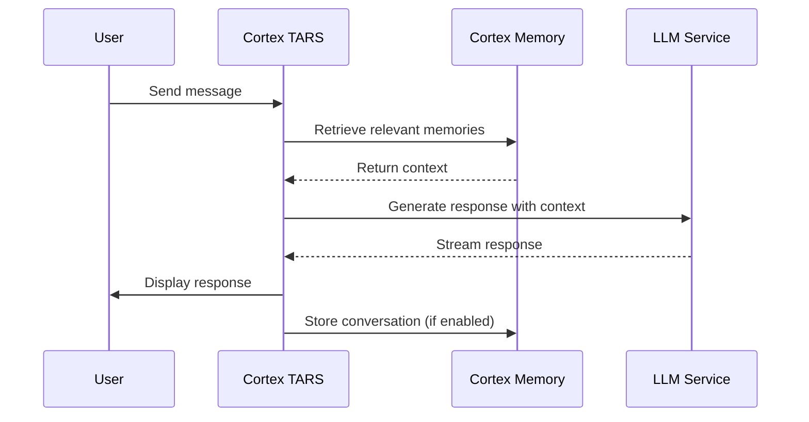

# Cortex TARS

<p align="center">
  <strong>🎧 Share Your Auditory Presence with AI — A Next-Gen Personal Agent Powered by Cortex Memory</strong>
</p>

Cortex TARS is a production-ready TUI (Terminal User Interface) application that brings **auditory presence** to your AI experience. Built on **Cortex Memory**, it's not just a chatbot — it's an intelligent AI assistant platform that can truly hear and remember your voice in the real world. Cortex TARS maintains deep links with your memory, capturing and preserving your auditory experiences through its extensible API capabilities.

## ✨ Key Features

### 🎭 Multi-Agent Management
Create and manage multiple AI personas, each with distinct personalities, system prompts, and specialized knowledge areas. Whether you need a coding assistant, a creative writing partner, or a productivity coach, Cortex TARS lets you run them all simultaneously.

### 💾 Persistent Role Memory
Every agent maintains its own long-term memory, learning from interactions over time. Your coding assistant remembers your coding style and preferences; your writing coach adapts to your voice and goals. Powered by Cortex Memory's intelligent memory management.

### 🔒 Memory Isolation
Advanced memory architecture ensures complete isolation between agents and users. Each agent's knowledge base is separate, preventing cross-contamination while enabling personalized experiences across different contexts.

### 🎨 Modern TUI Experience
- **Beautiful Interface**: Built with ratatui for a polished, responsive terminal experience
- **Multiple Themes**: Choose from 5 pre-built themes (Default, Dark, Forest, Ocean, Sunset)
- **Markdown Support**: Rich text rendering with full Markdown syntax
- **Stream Responses**: Real-time streaming AI responses for smooth conversations
- **Message Export**: Export conversations to clipboard with a single command

### 🔌 Extensible API Integration
Cortex TARS provides a REST API server that enables external services to interact with the memory system:

- **Store Mode**: External services can store information directly to the memory system
- **Chat Mode**: External messages can be injected as user input for AI processing
- **Health Check**: Monitor API service status
- **Memory Retrieval**: Query and list stored memories programmatically

## 📋 Prerequisites

- **Rust** 1.70 or later
- **Qdrant** vector database (for memory functionality)
- **OpenAI-compatible** LLM API endpoint

## 🚀 Installation

### Clone and Build

```bash
cd examples/cortex-mem-tars
cargo build --release
```

The compiled binary will be available at `target/release/cortex-mem-tars`.

## ⚙️ Configuration

### 1. Create Configuration File

Copy the example configuration:

```bash
cp config.example.toml config.toml
```

### 2. Edit Configuration

Edit `config.toml` with your settings:

```toml
[qdrant]
url = "http://localhost:6334"
collection_name = "cortex_mem"
timeout_secs = 30

[llm]
api_base_url = "https://api.openai.com/v1"
api_key = "your-api-key-here"
model_efficient = "gpt-4o-mini"
temperature = 0.7
max_tokens = 2000

[embedding]
api_base_url = "https://api.openai.com/v1"
api_key = "your-api-key-here"
model_name = "text-embedding-3-small"
batch_size = 100

[memory]
max_memories = 10000
similarity_threshold = 0.65
max_search_results = 50
auto_enhance = true
deduplicate = true

[api]
port = 8080
api_key = "ANYTHING_YOU_LIKE"
enable_cors = true
```

### 3. Start Qdrant

```bash
# Using Docker
docker run -p 6334:6334 qdrant/qdrant

# Or use local installation
qdrant
```

## 🎮 Usage

### Basic Commands

```bash
# Run with enhanced memory saving (saves conversations on exit)
cortex-mem-tars --enhance-memory-saver

# Run with API server enabled for external integrations
cortex-mem-tars --enable-audio-connect --audio-connect-mode store

# Chat mode: external messages are treated as user input
cortex-mem-tars --enable-audio-connect --audio-connect-mode chat
```

### Keyboard Shortcuts

| Key | Action |
|-----|--------|
| `Enter` | Send message |
| `Shift+Enter` | New line in input |
| `Ctrl+C` | Clear current session |
| `Ctrl+D` | Export conversation to clipboard |
| `Ctrl+H` | Show help modal |
| `Ctrl+T` | Open theme selector |
| `Ctrl+B` | Open bot management |
| `q` | Quit application (in bot selection) |
| `Esc` | Close modal / Return to previous state |

### Bot Management

Cortex TARS supports multiple AI bots with different personalities:

1. **Create a New Bot**: Press `Ctrl+B` → Select "Create Bot"
2. **Set Bot Properties**:
   - **Name**: Display name for the bot
   - **System Prompt**: The bot's personality and behavior instructions
   - **Password**: Optional access password for security
3. **Edit/Delete Bots**: Manage existing bots through the bot management interface

Each bot maintains its own independent memory, ensuring complete separation of knowledge and context.

## 🔌 API Integration

Cortex TARS provides a REST API for external services to interact with the memory system.

### API Endpoints

#### Health Check
```bash
GET http://localhost:8080/api/memory/health
```

#### Store Memory (Store Mode)
```bash
POST http://localhost:8080/api/memory/store
Content-Type: application/json

{
  "content": "The user mentioned they prefer Rust over Python",
  "source": "audio_listener",
  "timestamp": "2024-01-07T10:30:00Z",
  "speaker_type": "user",
  "speaker_confidence": 0.95
}
```

#### Retrieve Memories
```bash
GET http://localhost:8080/api/memory/retrieve?query=user%20preferences&limit=5
```

#### List Memories
```bash
GET http://localhost:8080/api/memory/list?speaker_type=user&limit=10
```

### Request/Response Models

**StoreMemoryRequest**:
- `content` (string): Text content to store
- `source` (string): Source identifier (e.g., "audio_listener")
- `timestamp` (string): ISO 8601 timestamp
- `speaker_type` (string): "user" or "other"
- `speaker_confidence` (float): 0-1 confidence score

**MemoryItem**:
- `id` (string): Unique memory ID
- `content` (string): Stored content
- `timestamp` (string): When it was stored
- `speaker_type` (string): Speaker identifier
- `relevance` (float): Search relevance score

## 🏗️ Architecture

```
cortex-mem-tars/
├── src/
│   ├── main.rs          # Application entry point
│   ├── app.rs           # Core application logic
│   ├── agent.rs         # AI agent with Cortex Memory integration
│   ├── config.rs        # Configuration management
│   ├── infrastructure.rs # LLM, vector store, memory manager setup
│   ├── api_server.rs    # REST API server
│   ├── api_models.rs    # API request/response models
│   ├── logger.rs        # Logging system
│   ├── ui.rs            # TUI interface and rendering
│   └── lib.rs           # Library exports
├── config.example.toml  # Configuration template
└── README.md           # This file
```

## 🧠 How Memory Works

Cortex TARS leverages Cortex Memory's intelligent memory system:

1. **Automatic Extraction**: The system automatically extracts key facts and insights from conversations
2. **Semantic Storage**: Memories are stored as vectors for intelligent retrieval
3. **Context Awareness**: The agent retrieves relevant memories before generating responses
4. **Memory Optimization**: Periodic optimization consolidates and refines memories
5. **Agent Isolation**: Each agent's memory is completely separate from others

### Memory Flow



## 🔍 Advanced Features

### Memory Enhancement

Enable enhanced memory saving to automatically store conversations:

```bash
cortex-mem-tars --enhance-memory-saver
```

This feature:
- Saves entire conversation history to memory on exit
- Preserves context across sessions
- Enables long-term learning and personalization

### External Integration

The API server enables external services to:

1. **Store Information**: External services can push data to memory
2. **Inject Messages**: Send messages as if typed by the user
3. **Query Memory**: Retrieve stored information programmatically

Example use cases:
- Voice recognition services storing transcribed conversations
- Meeting assistants capturing action items
- Automation tools logging system events
- IoT devices storing sensor data with context

### Service Status Monitoring

Cortex TARS continuously monitors LLM service availability and displays status in the UI:
- 🟢 **Active**: Service is responding normally
- 🔴 **Inactive**: Service is unavailable
- 🟡 **Initing**: Service is initializing

## 🛠️ Development

### Run Tests

```bash
cargo test
```

### Check Code

```bash
cargo check
```

### Format Code

```bash
cargo fmt
```

### Build with Optimizations

```bash
cargo build --release
```

## 🐛 Troubleshooting

### Qdrant Connection Issues

Verify Qdrant is running:

```bash
curl http://localhost:6334/health
```

Check your `config.toml` Qdrant URL configuration.

### LLM API Errors

- Verify API key is correct in `config.toml`
- Check API endpoint URL
- Ensure you have sufficient API credits
- Review logs for detailed error messages

### Memory Not Working

- Ensure Qdrant is running and accessible
- Verify API keys for both LLM and embedding services
- Check memory configuration thresholds
- Enable logging for detailed diagnostics

### Bot Configuration Issues

Bot configurations are stored in:
- Current directory: `./bots.json`
- System config: `~/.config/cortex/mem-tars/bots.json`

Check file permissions and JSON syntax if bots don't load.

## 📚 Resources

- [Cortex Memory Documentation](https://github.com/sopaco/cortex-mem/tree/main/litho.docs)
- [Cortex Memory Core](../../cortex-mem-core)
- [Cortex Memory Rig Integration](../../cortex-mem-rig)
- [RatATUI Framework](https://github.com/ratatui-org/ratatui)
- [Rig Agent Framework](https://github.com/0xPlaygrounds/rig)

## 📄 License

MIT License - see [LICENSE](../../LICENSE) for details.

## 🙏 Acknowledgments

- **Cortex Memory**: The intelligent memory framework powering persistent AI memory
- **RatATUI**: Beautiful terminal UI framework
- **Rig**: LLM agent framework for building intelligent systems
- **Qdrant**: High-performance vector database for semantic search

---

**Cortex TARS** - Where AI meets persistent memory in the terminal. 🚀
