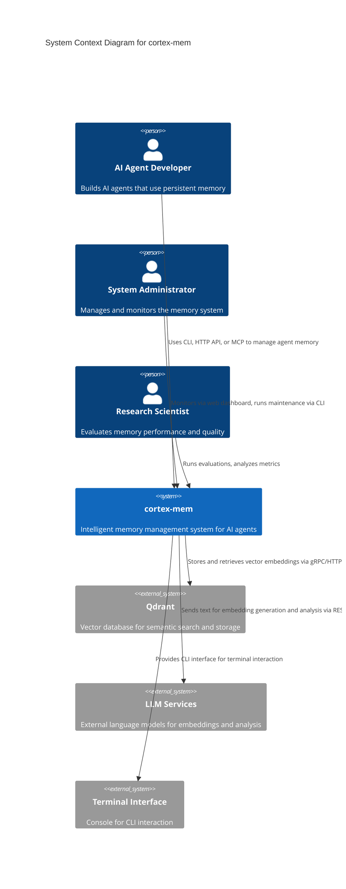

# System Context Overview

**Generated on:** 2025-12-15 12:05:10 (UTC)  
**Timestamp:** 1765800310

---

## 1. Project Introduction

### Project Name
**cortex-mem**

### Project Description
**cortex-mem** is a full-stack intelligent memory management system designed to enable AI agents to store, retrieve, optimize, and analyze memories using vector embeddings and large language models (LLMs). It provides a persistent, context-aware memory layer that enhances the continuity, intelligence, and adaptability of AI agents across interactions.

The system supports multiple access methods—command-line interface (CLI), HTTP API, MCP (Memory Control Protocol) server, and a web-based dashboard—making it suitable for developers, system administrators, and researchers. At its core, **cortex-mem** leverages semantic search via vector databases and integrates with external LLMs to generate embeddings, classify content, and assess memory quality.

### Core Functionality
- **Memory Lifecycle Management**: Create, read, update, and delete (CRUD) memory entries with rich metadata.
- **Semantic Search**: Retrieve relevant memories using vector similarity search powered by Qdrant.
- **Memory Optimization**: Automatically deduplicate, filter, and improve memory quality using LLM-driven analysis.
- **Monitoring & Analytics**: Visualize system health, memory usage, and optimization history via a web dashboard.
- **Evaluation Framework**: Benchmark memory performance with precision, recall, and F1 metrics using synthetic and real-world datasets.
- **Multi-Agent Support**: Serve memory needs for multiple AI agents via the MCP protocol.

### Business Value
cortex-mem enables AI systems to maintain long-term, structured knowledge across sessions, significantly improving contextual awareness and decision-making. It reduces cognitive load on AI agents by offloading memory management to a dedicated, scalable service. The system also ensures memory quality through automated optimization and provides observability for operational and research use cases.

### Technical Characteristics
- **Modular, Service-Oriented Architecture**: Clear separation of concerns across domains.
- **Vector-Based Memory Storage**: Uses Qdrant for high-performance semantic retrieval.
- **LLM-Driven Intelligence**: Integrates with external LLMs for embedding generation and content analysis.
- **Extensible Interfaces**: Supports CLI, REST API, MCP, and web UI for diverse integration scenarios.
- **Evaluation-First Design**: Built-in framework for continuous performance validation.

---

## 2. Target Users

### 2.1 AI Agent Developers
- **Description**: Software engineers building AI agents (e.g., chatbots, autonomous agents) that require persistent memory.
- **Usage Scenarios**:
  - Integrate memory storage into agent workflows via HTTP API or MCP.
  - Retrieve contextually relevant memories before agent responses.
  - Optimize memory footprint to reduce latency and cost.
- **Key Needs**:
  - Easy-to-use APIs for memory operations.
  - Low-latency semantic search.
  - Support for agent-specific memory isolation.
  - Configurable optimization strategies.

### 2.2 System Administrators
- **Description**: Operators responsible for deploying, monitoring, and maintaining the memory infrastructure.
- **Usage Scenarios**:
  - Monitor system health and resource utilization.
  - Perform maintenance tasks (e.g., memory optimization, backups).
  - Analyze memory usage trends and performance bottlenecks.
- **Key Needs**:
  - Real-time monitoring dashboard.
  - CLI tools for administrative operations.
  - Health check endpoints and alerting capabilities.
  - Audit logs and optimization history.

### 2.3 Research Scientists
- **Description**: Researchers evaluating memory system performance, recall effectiveness, and AI cognition models.
- **Usage Scenarios**:
  - Run controlled experiments using synthetic datasets.
  - Measure precision, recall, and F1 scores under varying conditions.
  - Visualize evaluation results and compare configurations.
- **Key Needs**:
  - Reproducible evaluation framework.
  - Dataset generation tools.
  - Detailed metrics and reporting.
  - Support for A/B testing of memory strategies.

---

## 3. System Boundaries

### 3.1 System Scope
The **cortex-mem** system provides a complete platform for AI agent memory lifecycle management, including:

- Persistent storage and retrieval of memories using vector embeddings.
- Semantic search capabilities via vector similarity.
- Memory optimization (deduplication, relevance filtering, quality scoring).
- Multiple user and programmatic interfaces (CLI, HTTP, MCP, Web UI).
- Monitoring, analytics, and visualization of memory system behavior.
- Evaluation framework for performance benchmarking and quality assurance.

### 3.2 Included Components
| Component | Description |
|--------|-------------|
| **Memory Core Engine** | Central logic for managing memory operations, optimization, and classification. |
| **CLI Interface** | Command-line tool for developers and administrators. |
| **HTTP API Service** | RESTful interface for programmatic access. |
| **MCP Server** | Protocol-compliant server for AI agent memory control. |
| **Web Dashboard** | Svelte-based UI for monitoring and managing memories. |
| **Vector Store Adapter** | Integration with Qdrant for embedding storage and retrieval. |
| **LLM Client** | Interface to external LLMs for embeddings and content analysis. |
| **Configuration Manager** | Handles environment-specific settings and secrets. |
| **Evaluation Framework** | Tools for generating datasets, running experiments, and analyzing results. |

### 3.3 Excluded Components
| Component | Reason for Exclusion |
|--------|------------------------|
| **Core LLM Model Training** | LLMs are external services; cortex-mem only consumes their APIs. |
| **Vector Database Implementation** | Qdrant is an external, managed service; cortex-mem integrates with it. |
| **Operating System Resources** | OS-level concerns (e.g., memory, CPU) are outside the application boundary. |
| **Network Infrastructure Management** | Networking (e.g., load balancing, firewalls) is handled externally. |

> **Boundary Note**: cortex-mem assumes Qdrant and LLM services are available and accessible via network. It does not manage their deployment or scaling.

---

## 4. External System Interactions

### 4.1 External Systems

| System | Interaction Type | Description |
|-------|------------------|-------------|
| **Qdrant** | Data Storage | Vector database used to store memory embeddings and metadata. cortex-mem writes vectors during memory creation and performs approximate nearest neighbor (ANN) searches during retrieval. |
| **LLM Services** | API Integration | External language models (e.g., OpenAI, Anthropic, local LLMs) used to generate embeddings, classify content, extract keywords, and assess memory quality. |
| **Terminal Interface** | User Interface | Console-based interaction for developers and administrators using the CLI. Not a separate system, but a user access point. |

### 4.2 Interaction Details

#### Qdrant Integration
- **Protocol**: gRPC/HTTP
- **Operations**:
  - `upsert`: Store or update memory vectors with metadata.
  - `search`: Perform semantic similarity search using query embeddings.
  - `delete`: Remove vectors by ID.
  - `create_collection`: Initialize memory collections with specific vector dimensions.
- **Dependency**: Required for all memory storage and retrieval operations.

#### LLM Services Integration
- **Protocol**: REST API (typically JSON over HTTPS)
- **Operations**:
  - `embed`: Generate embeddings for memory content.
  - `classify`: Determine memory type, importance, or sentiment.
  - `extract`: Identify entities, topics, or summaries from raw text.
- **Dependency**: Required for embedding generation and AI-driven memory analysis.

#### Terminal Interface
- **Access Method**: Local or remote shell.
- **Usage**: Users run `cortex-mem-cli` commands to interact with the system.
- **Authentication**: Optional API key or token-based auth when connecting to remote services.

---

## 5. System Context Diagram

### 5.1 C4 Model – System Context Diagram (Mermaid)

### 5.2 Key Interaction Flows

#### Flow 1: Memory Creation (via CLI)
1. Developer runs `cortex-mem add "Meeting with team about project timeline"`.
2. CLI parses command and loads configuration.
3. Memory Core generates embedding via LLM Client.
4. Vector Store Adapter upserts vector into Qdrant.
5. Confirmation returned to CLI.

#### Flow 2: Semantic Search (via HTTP API)
1. AI agent sends `GET /memories/search?q=project%20timeline` to HTTP API Service.
2. Service routes to Memory Manager.
3. Memory Manager queries LLM for embedding of query.
4. Vector Store Adapter searches Qdrant for similar vectors.
5. Results returned as JSON to agent.

#### Flow 3: Memory Optimization (via Web Dashboard)
1. Admin navigates to Optimization tab in Web Dashboard.
2. Selects strategy (e.g., deduplication, low-importance cleanup).
3. Dashboard calls System API → Optimization Engine.
4. Engine analyzes memories, uses LLM to assess similarity.
5. Optimizer removes duplicates; results displayed in UI.

#### Flow 4: Evaluation Run (via Research Script)
1. Researcher runs `cargo run --bin evaluation-runner --config lab-config.toml`.
2. Dataset Generator creates test memories and queries.
3. Experiment Runner executes search and retrieval tasks.
4. Metrics Analyzer computes precision, recall, F1.
5. Report generated and visualized.

---

## 6. Technical Architecture Overview

### 6.1 Main Technology Stack

| Layer | Technology | Purpose |
|------|-----------|--------|
| **Core Logic** | Rust (`cortex-mem-core`) | High-performance, memory-safe implementation of business logic |
| **CLI Interface** | Rust + Clap | Command-line parsing and execution |
| **HTTP API** | Rust + Axum | RESTful service with async support |
| **MCP Server** | Rust + Tokio | Async protocol server for AI agent integration |
| **Web Dashboard** | SvelteKit + Tailwind CSS | Reactive frontend with real-time updates |
| **Vector Storage** | Qdrant (external) | Scalable vector database with ANN search |
| **LLM Integration** | REST/gRPC clients | Connect to OpenAI, Anthropic, Ollama, etc. |
| **Configuration** | TOML + Environment Variables | Flexible, environment-aware settings |
| **Evaluation** | Rust + Criterion-like framework | Reproducible performance testing |

### 6.2 Architecture Patterns

#### Modular Service-Oriented Design
- **Domain-Driven Structure**: Clear separation into domains (Core, UI, Service, Storage, AI, Evaluation).
- **Loose Coupling**: Domains interact via well-defined interfaces (e.g., `MemoryManager` trait).
- **High Cohesion**: Each module focuses on a single responsibility (e.g., `OptimizationEngine` handles only optimization logic).

#### Layered Abstraction
- **User Interface Layer**: CLI, Web Dashboard, MCP Server.
- **Service Layer**: HTTP API, System API (aggregation layer).
- **Business Logic Layer**: Memory Core Domain (orchestration).
- **Integration Layer**: Vector Store Adapter, LLM Client.
- **External Dependencies**: Qdrant, LLM Services.

#### Configuration-Driven Behavior
- All services and core components depend on a centralized configuration system.
- Supports multiple sources: TOML files, environment variables, secrets management.
- Enables environment-specific tuning (dev, staging, prod).

### 6.3 Key Design Decisions

| Decision | Rationale |
|--------|---------|
| **Rust as Primary Language** | Ensures memory safety, performance, and concurrency without garbage collection. Critical for high-throughput memory operations. |
| **Qdrant as Vector Store** | Offers high-performance ANN search, rich filtering, and scalability. Well-documented API and active community. |
| **LLM Client Abstraction** | Allows pluggable LLM providers (OpenAI, local models) without changing core logic. |
| **Evaluation Framework as First-Class Citizen** | Enables continuous validation of memory quality and recall—critical for research and production trust. |
| **Multiple Access Points (CLI, HTTP, MCP, Web)** | Supports diverse user needs: automation (CLI), integration (HTTP/MCP), monitoring (Web). |
| **Separation of Optimization from Core CRUD** | Allows independent evolution of optimization strategies without affecting basic memory operations. |

---

## Conclusion

The **cortex-mem** system provides a robust, extensible, and observable memory layer for AI agents. Its modular architecture, support for semantic search, and integration with LLMs make it a powerful tool for enhancing AI cognition. The system clearly defines its boundaries, integrates with essential external services, and serves a diverse set of users—from developers to researchers.

By adhering to C4 SystemContext principles, this document provides a comprehensive view of the system’s purpose, scope, interactions, and architecture—enabling informed decision-making for development, deployment, and evolution.

--- 

**End of Document**