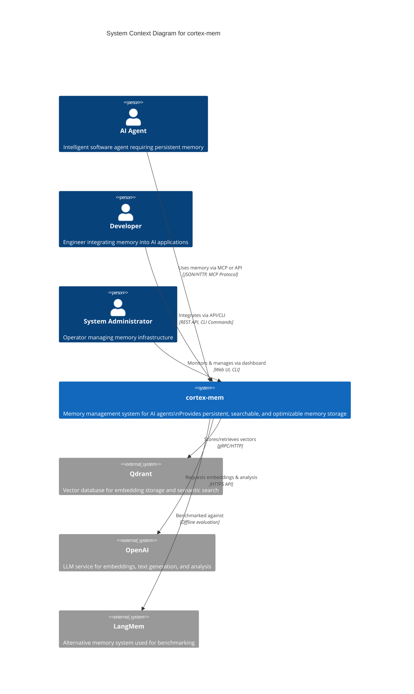
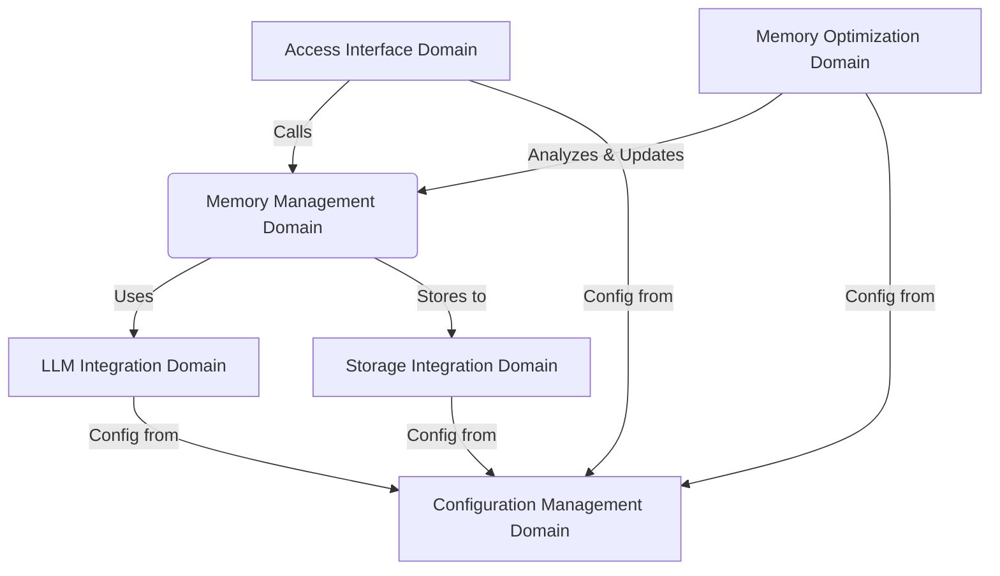

# System Context Overview

**Generated on:** 2025-12-30 11:17:28 (UTC)  
**Timestamp:** 1767093448

---

## 1. Project Introduction

### Project Name
**cortex-mem**

### Project Description
*cortex-mem* is a full-stack memory management system designed to provide AI agents with persistent, searchable, and optimizable memory storage. It enables intelligent agents to retain context across interactions by storing conversation history, procedural knowledge, and factual information in a structured and semantically accessible format.

The system supports multiple access interfaces—including CLI, HTTP API, MCP (Memory Control Protocol), and a web-based dashboard—allowing seamless integration into diverse AI agent architectures and operational workflows. By leveraging vector embeddings and Large Language Models (LLMs), *cortex-mem* delivers advanced semantic search, intelligent memory classification, and automated optimization capabilities.

### Core Functionality
- **Persistent Memory Storage**: Long-term retention of agent memories with metadata and semantic context.
- **Semantic Search**: Retrieve relevant memories using natural language queries via vector similarity.
- **Memory Optimization**: Automatically detect and resolve issues such as duplication, irrelevance, or redundancy.
- **Multi-Interface Access**: Support for developers, agents, and operators through CLI, REST API, MCP, and web UI.
- **Configurable & Extensible**: Centralized configuration enables consistent behavior across deployment environments.

### Business Value
*cortex-mem* enhances the intelligence and continuity of AI agents by enabling them to:
- Maintain contextual awareness across extended conversations and tasks.
- Recall relevant past experiences efficiently.
- Operate more autonomously through self-maintained memory quality.

This results in improved user experience, higher task success rates, and reduced cognitive load on both agents and their human operators.

### Technical Characteristics
- **Architecture Style**: Modular microservices with domain-driven design principles.
- **Primary Languages**: Rust (backend/core logic), TypeScript (frontend/dashboard).
- **Integration Model**: API-first, service-oriented with external dependencies on LLMs and vector databases.
- **Deployment Target**: Cloud-native, containerizable services with minimal infrastructure coupling.

---

## 2. Target Users

The *cortex-mem* system serves three primary user roles, each with distinct needs and interaction patterns:

| User Role | Description | Key Needs |
|---------|-------------|-----------|
| **AI Agents** | Intelligent software agents requiring persistent memory to maintain context across interactions. | <ul><li>Store conversation history</li><li>Retrieve relevant memories based on current context</li><li>Optimize memory usage for performance and relevance</li></ul> |
| **Developers** | Software engineers integrating *cortex-mem* into AI applications or agent frameworks. | <ul><li>Programmatic access via API or MCP</li><li>Flexible configuration options</li><li>Clear integration patterns with existing systems</li></ul> |
| **System Administrators** | Operators responsible for monitoring, maintaining, and tuning the memory infrastructure. | <ul><li>Real-time monitoring via dashboard</li><li>Tools for memory optimization and maintenance</li><li>Logging, alerting, and configuration management</li></ul> |

### Usage Scenarios
- An AI customer support agent recalls previous interactions with a user to provide personalized responses.
- A developer integrates *cortex-mem* into an autonomous agent framework using the HTTP API for memory persistence.
- An operator runs a nightly optimization job via CLI to deduplicate and clean memory entries.
- A research team evaluates *cortex-mem* against alternative memory systems like *LangMem* for benchmarking purposes.

---

## 3. System Boundaries

### System Scope
*cortex-mem* provides a dedicated memory management layer for AI agents. It handles the full lifecycle of memory data—including creation, retrieval, search, update, deletion, and optimization—through multiple standardized interfaces.

The system acts as a **middleware service**, decoupling memory logic from core agent intelligence, allowing it to be reused across different agent implementations.

### Included Components
The following capabilities are within the scope of *cortex-mem*:

| Component | Description |
|--------|-------------|
| **Memory Storage & Retrieval** | CRUD operations for memory entries with rich metadata. |
| **Semantic Search** | Vector-based similarity search using embeddings generated by LLMs. |
| **Memory Optimization Engine** | Automated analysis and improvement of memory quality (e.g., deduplication, relevance filtering). |
| **Multiple Access Interfaces** | <ul><li>CLI: For administrative and batch operations</li><li>HTTP API: For programmatic integration</li><li>MCP: For direct AI agent tool invocation</li><li>Web Dashboard: For monitoring and visualization</li></ul> |
| **Web-Based Monitoring Dashboard** | Real-time insights into memory usage, performance metrics, and optimization results. |
| **Configuration Management** | Centralized configuration system for all components (e.g., LLM endpoints, Qdrant settings). |

### Excluded Components
The following are explicitly **outside** the scope of *cortex-mem*:

| Component | Reason for Exclusion |
|--------|------------------------|
| **Core AI Agent Logic** | *cortex-mem* does not implement agent reasoning, planning, or decision-making. It only provides memory services. |
| **Application-Specific Business Rules** | Domain-specific logic (e.g., "remember user preferences only after consent") is handled by the agent, not *cortex-mem*. |
| **User Interface Design for End Applications** | While a monitoring dashboard is provided, end-user UIs (e.g., chat interfaces) are outside scope. |
| **Network Infrastructure Management** | Deployment, scaling, networking, and security of underlying infrastructure are managed externally. |

> ✅ **Boundary Principle**: *cortex-mem* focuses on **what** is remembered and **how** it is accessed, not **why** or **when** it should be used.

---

## 4. External System Interactions

*cortex-mem* integrates with several external systems to deliver its functionality. These interactions are essential for core operations such as embedding generation, vector storage, and benchmarking.

### External Systems

| System Name | Interaction Type | Description | Direction |
|------------|------------------|-------------|----------|
| **Qdrant** | Database Storage | Vector database used to store and retrieve memory embeddings. Enables high-performance semantic search through approximate nearest neighbor (ANN) indexing. | *cortex-mem* → Qdrant |
| **OpenAI** | API Integration | LLM service used for:<ul><li>Generating text embeddings</li><li>Extracting structured facts/entities</li><li>Analyzing memory content for optimization</li></ul> | *cortex-mem* → OpenAI |
| **LangMem** | Benchmarking | Alternative memory system used for comparative evaluation and performance testing. Not integrated at runtime. | One-way analysis (no runtime dependency) |

### Interaction Details

#### Qdrant Integration
- **Purpose**: Persistent storage of vector embeddings and metadata.
- **Protocol**: gRPC/HTTP (via Qdrant client SDK).
- **Data Flow**:
  - On memory creation: embedding vector + metadata → stored in Qdrant collection.
  - On search: query embedding → similarity search → top-k results returned.
- **Failure Impact**: Loss of semantic search capability; memory metadata may still be accessible via fallback mechanisms.

#### OpenAI Integration
- **Purpose**: Enable intelligent memory processing via LLM capabilities.
- **Usage Patterns**:
  - Embedding generation (`text-embedding-ada-002` or equivalent).
  - Structured extraction (e.g., "extract entities from this conversation").
  - Memory analysis (e.g., "are these two memories duplicates?").
- **Protocol**: HTTPS REST API.
- **Failure Impact**: Degraded functionality in memory creation, search, and optimization; system may fall back to cached embeddings or skip enrichment.

#### LangMem (Benchmarking)
- **Purpose**: Used in evaluation workflows to compare *cortex-mem*’s performance (latency, recall, precision) against alternative memory systems.
- **Interaction**: Offline comparison scripts; no runtime coupling.
- **Impact**: No operational dependency; used solely for R&D and validation.

---

## 5. System Context Diagram

Below is a **C4 Model - Level 1: System Context** diagram representing *cortex-mem* and its relationships with users and external systems.

### Mermaid Diagram (System Context)

### Key Interaction Flows

1. **Memory Creation Flow**
   - User/AI agent → CLI/API/MCP → *cortex-mem* → OpenAI (embedding) → Qdrant (storage)
   - Metadata and extracted facts are stored alongside the vector.

2. **Memory Retrieval Flow**
   - Query → *cortex-mem* → OpenAI (query embedding) → Qdrant (similarity search) → Ranked results → User/Agent

3. **Memory Optimization Flow**
   - Admin triggers optimization → *cortex-mem* analyzes memory collection → Uses OpenAI to assess similarity → Executes merge/delete → Reports via dashboard

4. **Monitoring & Configuration**
   - Admin uses web dashboard to view memory stats, run optimizations, and adjust configuration.
   - All components read from centralized config (e.g., `config.toml`).

---

## 6. Technical Architecture Overview

### Main Technology Stack

| Layer | Technology | Rationale |
|------|-----------|---------|
| **Backend Core** | Rust | High performance, memory safety, ideal for systems-level logic and LLM integration. |
| **Frontend Dashboard** | TypeScript (SvelteKit) | Reactive UI framework for real-time monitoring and interaction. |
| **Vector Database** | Qdrant | Efficient ANN search, strong filtering support, gRPC/HTTP API. |
| **LLM Provider** | OpenAI | Industry-standard embeddings and structured output capabilities. |
| **Configuration** | TOML + Environment Variables | Human-readable, hierarchical, and deployable across environments. |
| **Interfaces** | <ul><li>CLI: Rust (Clap)</li><li>HTTP API: Axum (Rust)</li><li>MCP: Custom protocol over JSON-RPC</li><li>Web: Svelte + REST</li></ul> | Multiple entry points for different user types and integration needs. |

### Architecture Patterns

#### Modular Microservices Architecture
- **Separation of Concerns**: Each domain (e.g., Memory Management, LLM Integration) is encapsulated with clear responsibilities.
- **Shared Core Library**: `cortex-mem-core` contains business logic reused across CLI, API, MCP, and dashboard services.
- **Frontend-Backend Decoupling**: Web dashboard communicates via RESTful APIs to backend services.

#### Domain-Driven Design (DDD)
The system is organized into well-defined domains:

| Domain | Type | Responsibility |
|-------|------|----------------|
| **Memory Management Domain** | Core Business | Memory lifecycle, search, classification |
| **Memory Optimization Domain** | Core Business | Quality analysis, deduplication, plan execution |
| **LLM Integration Domain** | Core Business | Embedding generation, content extraction, intelligence |
| **Storage Integration Domain** | Infrastructure | Qdrant interaction, vector persistence |
| **Access Interface Domain** | Tool Support | CLI, API, MCP, Web UI |
| **Configuration Management Domain** | Infrastructure | Centralized settings for all components |

#### Key Design Decisions

| Decision | Rationale | Impact |
|--------|---------|--------|
| **Rust for Core Logic** | Ensures performance, safety, and concurrency for high-throughput memory operations. | Enables low-latency responses even under heavy load. |
| **Multiple Access Interfaces** | Supports diverse use cases: agents (MCP), developers (API), operators (CLI/Web). | Increases adoption and integration flexibility. |
| **Centralized Configuration** | Single source of truth for LLM keys, Qdrant URLs, optimization thresholds. | Simplifies deployment and reduces misconfiguration risk. |
| **Vector + Metadata Hybrid Storage** | Combines semantic search (vector) with precise filtering (metadata). | Delivers accurate and contextually relevant results. |
| **LLM-Driven Intelligence** | Leverages LLMs not just for embeddings but also for fact extraction and decision logic. | Enables smarter memory management beyond keyword matching. |

### Cross-Domain Dependencies

> 🔗 **Dependency Strength Summary**:
> - Strongest: Access Interface → Memory Management (9.5)
> - Critical: Memory Management → Storage Integration (9.0)
> - Important: All domains → Configuration Management (7.0–8.5)

---

## Conclusion

The *cortex-mem* system establishes a robust, extensible foundation for AI agent memory management. By clearly defining its boundaries, user roles, and external integrations, it serves as a reliable middleware component in modern AI architectures.

Its modular design, multi-interface support, and intelligent use of LLMs and vector databases make it suitable for both research and production environments. The system enables AI agents to evolve from stateless responders to context-aware, learning entities—paving the way for more autonomous and effective artificial intelligence.

This C4 System Context document provides a comprehensive view of *cortex-mem*’s role in the ecosystem, serving as a reference for architects, developers, and operators involved in its deployment and extension.