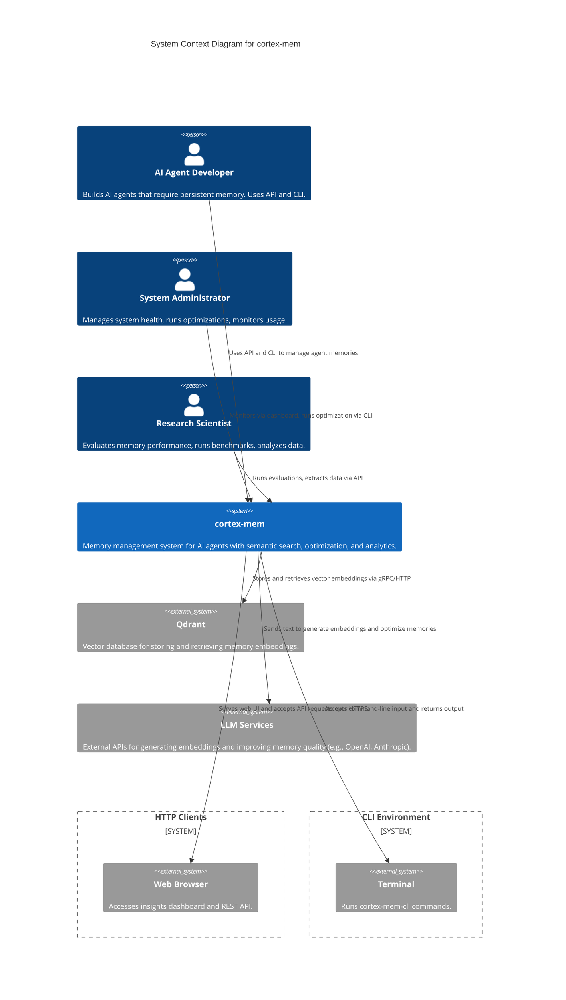

# System Context Overview

**Document Generated on:** 2025-12-18 03:27:26 (UTC) (UTC)  
**Timestamp:** 1766028446  
**System:** `cortex-mem` – AI Agent Memory Management System  
**Architecture Level:** C4 Model – System Context (Level 1)

---

## 1. Project Introduction

### Project Name
**cortex-mem**

### Project Description
`cortex-mem` is a full-stack memory management system designed specifically for AI agents. It enables persistent, semantically searchable, and optimizable storage of experiential knowledge (referred to as "memories") that AI agents accumulate during interactions. The system supports long-term context retention, enhancing agent consistency, reasoning, and intelligence across sessions.

At its core, `cortex-mem` leverages vector embeddings and large language models (LLMs) to store, retrieve, and refine memories based on semantic meaning rather than exact keyword matches. It provides advanced capabilities such as deduplication, relevance scoring, memory optimization, and analytics through a modular architecture.

### Core Functionality
- **Memory CRUD Operations**: Create, read, update, and delete memories with rich metadata.
- **Semantic Search**: Retrieve relevant memories using natural language queries via vector similarity search.
- **Memory Optimization**: Automatically detect and resolve issues like redundancy, low quality, or irrelevance using LLM-driven analysis.
- **Analytics & Insights**: Visualize memory usage patterns, performance metrics, and optimization outcomes via a dashboard.
- **Multi-Interface Access**: Support for REST API, CLI, and MCP protocol for integration flexibility.
- **Evaluation Framework**: Built-in tools for benchmarking recall accuracy, search effectiveness, and system performance.

### Business Value
`cortex-mem` significantly enhances the cognitive capabilities of AI agents by providing reliable, scalable, and intelligent memory infrastructure. This enables:
- Improved continuity and personalization in agent-user interactions.
- Higher fidelity in decision-making through access to historical context.
- Operational visibility into agent memory health and evolution.
- Accelerated development and evaluation of memory-augmented AI systems.

### Technical Characteristics
- **Modular & Layered Architecture**: Clear separation between core logic, interfaces, and external dependencies.
- **Vector-First Design**: Memories are stored and retrieved using high-dimensional embeddings in a dedicated vector database.
- **LLM-Integrated Processing**: External LLM services are used for embedding generation and semantic understanding.
- **Configurable & Extensible**: Supports TOML-based configuration and pluggable components for storage and LLM providers.
- **Evaluation-Driven Development**: Includes tools for testing, benchmarking, and validating memory system behavior.

---

## 2. Target Users

| User Role | Description | Key Needs | Usage Scenarios |
|---------|-------------|-----------|----------------|
| **AI Agent Developers** | Software engineers building AI-powered applications requiring persistent memory. | <ul><li>Integrate memory into agents via APIs</li><li>Manage memories programmatically</li><li>Ensure high recall and low latency in retrieval</li></ul> | <ul><li>Building chatbots with long-term user context</li><li>Developing autonomous agents that learn from experience</li><li>Testing memory recall under various query conditions</li></ul> |
| **System Administrators** | Operations personnel managing AI infrastructure and monitoring system health. | <ul><li>Monitor memory usage and system performance</li><li>Run optimization routines</li><li>Inspect memory trends and anomalies</li></ul> | <ul><li>Scheduling nightly memory deduplication</li><li>Reviewing dashboard insights for capacity planning</li><li>Responding to alerts about memory bloat or degradation</li></ul> |
| **Research Scientists** | Academics and researchers studying AI memory systems and agent cognition. | <ul><li>Benchmark memory retrieval accuracy</li><li>Evaluate optimization efficacy</li><li>Generate synthetic datasets for validation</li></ul> | <ul><li>Comparing `cortex-mem` against other memory systems</li><li>Studying the impact of memory quality on agent performance</li><li>Designing experiments with controlled memory inputs</li></ul> |

These user roles interact with the system through different entry points:
- **Developers** use the REST API and CLI.
- **Administrators** use the CLI and Insights Dashboard.
- **Researchers** use the evaluation framework and API for data collection.

---

## 3. System Boundaries

### System Scope
The `cortex-mem` system provides a complete, end-to-end solution for managing AI agent memories. It encompasses all aspects of memory lifecycle management, from ingestion and storage to search, optimization, and analysis.

> **Scope Statement**:  
> *The cortex-mem system provides a complete memory management solution for AI agents, including storage, retrieval, optimization, and analysis capabilities.*

### Included Components
The following core components are within the system boundary:

| Component | Description |
|--------|-------------|
| **Memory CRUD Operations** | Full support for creating, reading, updating, and deleting memories with metadata tagging. |
| **Semantic Search Engine** | Enables natural language search over stored memories using vector embeddings. |
| **Memory Optimization Engine** | Detects duplicates, improves memory quality, and removes irrelevant entries using LLMs. |
| **Insights & Analytics Dashboard** | Web-based UI for visualizing memory usage, trends, and optimization reports. |
| **REST API Service** (`cortex-mem-service`) | HTTP interface for programmatic access to memory operations and system controls. |
| **Command-Line Interface** (`cortex-mem-cli`) | Tool for local interaction, scripting, and administrative tasks. |
| **MCP Protocol Adapter** (`cortex-mem-mcp`) | Enables integration with agent frameworks using the Memory Consistency Protocol. |
| **Evaluation Framework** | Tools for testing recall, precision, latency, and optimization effectiveness. |
| **Core Memory Engine** (`cortex-mem-core`) | Central module handling memory logic, vector integration, and LLM coordination. |
| **Configuration Management** | Centralized configuration via TOML files supporting environment-specific settings. |

### Excluded Components
The following are explicitly outside the scope of `cortex-mem`:

| Component | Reason for Exclusion |
|--------|------------------------|
| **Core LLM Model Training** | The system consumes LLM APIs but does not train or fine-tune foundation models. |
| **Vector Embedding Model Development** | Relies on external LLM services for embeddings; does not develop embedding models. |
| **Operating System Resource Management** | Does not manage CPU, memory, or disk at the OS level. |
| **Network Infrastructure Provisioning** | Assumes network connectivity is provided; does not handle networking setup or scaling. |

This boundary ensures focus on memory-specific functionality while leveraging best-of-breed external services for AI processing and infrastructure.

---

## 4. External System Interactions

The `cortex-mem` system interacts with several external systems to deliver its functionality. These interactions are essential for storage, AI processing, and user access.

### External Systems List

| External System | Interaction Type | Description | Direction |
|----------------|------------------|-------------|----------|
| **Qdrant** | Database Storage | Vector database used to store memory embeddings and enable semantic search. Memories are indexed by their vector representations for fast similarity lookup. | System → Qdrant (Write/Read) |
| **LLM Services** (e.g., OpenAI, Anthropic, etc.) | API Integration | External language model APIs used to generate embeddings for memory content and queries. Also used during optimization to assess and rewrite memories. | System → LLM (Request/Response) |
| **HTTP Clients** | User Interface | Web browsers and HTTP clients that access the Insights Dashboard and REST API. Includes developer tools, monitoring systems, and agent integrations. | Client → System |
| **Command Line Interface (CLI)** | User Interface | Terminal applications used by developers and administrators to interact with the system via shell commands. | User → System |

### Dependency Analysis

| From | To | Type | Strength | Description |
|------|----|------|----------|-------------|
| `cortex-mem` → Qdrant | Service Dependency | 9.5 | Core persistence layer; all memory data is stored and retrieved via Qdrant’s vector search capabilities. |
| `cortex-mem` → LLM Services | Service Call | 9.0 | Critical for embedding generation and memory optimization. System cannot function without access to LLM APIs. |
| HTTP Clients → `cortex-mem` | User Interaction | 8.5 | Primary means for users to view analytics and trigger operations via dashboard or API. |
| CLI Users → `cortex-mem` | User Interaction | 8.0 | Used for scripting, debugging, and administrative control. |

> **Note**: All external dependencies are abstracted behind interfaces in `cortex-mem-core`, allowing for future pluggability (e.g., switching from Qdrant to Pinecone or Weaviate).

---

## 5. System Context Diagram

### C4 Model – System Context (Level 1)

Below is a Mermaid-formatted diagram representing the **System Context** view of `cortex-mem`. This diagram illustrates the system as a single container and its relationships with external entities.

### Key Interaction Flows

1. **Memory Creation Flow**
   - Developer sends `POST /memories` via HTTP client.
   - `cortex-mem` uses LLM service to generate embedding.
   - Stores memory + embedding in Qdrant.
   - Returns memory ID.

2. **Semantic Search Flow**
   - User submits natural language query via API or CLI.
   - Query is embedded using LLM service.
   - Vector search performed in Qdrant.
   - Results filtered and ranked by `cortex-mem-core`, returned to user.

3. **Optimization Flow**
   - Admin triggers `/optimization/start`.
   - System analyzes memories for duplicates and quality issues.
   - LLM rewrites or merges low-quality entries.
   - Updated memories stored back in Qdrant.
   - Report generated and accessible via dashboard.

4. **Insights Access Flow**
   - Browser requests dashboard page.
   - `cortex-mem-insights` fetches memory statistics and optimization history.
   - Renders charts and tables showing memory growth, search success rate, etc.

### Architecture Decisions Reflected
- **Single System Boundary**: All components (`core`, `service`, `cli`, `insights`) are treated as one cohesive system.
- **Externalized AI & Storage**: LLMs and vector DBs are external systems, emphasizing cloud-native integration.
- **Multi-Channel Access**: Supports both machine (API) and human (CLI, UI) interaction patterns.
- **No Direct User-to-Database Access**: All data flows through `cortex-mem`, ensuring consistency and security.

---

## 6. Technical Architecture Overview

### Main Technology Stack

| Layer | Technology | Purpose |
|------|-----------|--------|
| **Core Engine** | Rust (`cortex-mem-core`) | High-performance, memory-safe implementation of memory logic. |
| **API Service** | Rust + Axum (`cortex-mem-service`) | RESTful HTTP server with async support. |
| **CLI Tool** | Rust + Clap (`cortex-mem-cli`) | Cross-platform command-line interface. |
| **Vector Database** | Qdrant | Persistent, scalable vector storage with semantic search. |
| **LLM Integration** | OpenAI API, Anthropic, or compatible | Embedding generation and memory refinement. |
| **Frontend (Insights)** | TypeScript + React | Interactive dashboard for analytics and reporting. |
| **Configuration** | TOML | Human-readable, version-controllable config files. |
| **Protocol Support** | MCP (Memory Consistency Protocol) | Standardized interface for agent memory synchronization. |

### Architecture Patterns

| Pattern | Application in `cortex-mem` |
|--------|----------------------------|
| **Layered Architecture** | Clear separation: Core Logic → Service Layer → Interface Layer (API/CLI/Dashboard). |
| **Plugin Abstraction** | LLM clients and vector stores implement traits/interfaces for easy swapping. |
| **Event-Driven Orchestration** | Optimization workflows are triggered and progress asynchronously. |
| **Configuration-Driven Behavior** | System behavior (e.g., embedding model, thresholds) is defined in TOML. |
| **Evaluation-First Design** | Built-in tools allow continuous validation of memory recall and quality. |

### Key Design Decisions

1. **Rust as Primary Language**
   - Chosen for memory safety, performance, and concurrency—critical for systems handling large-scale data and real-time queries.

2. **Vector Database Abstraction**
   - The `vector_store` module abstracts Qdrant behind a trait, enabling future support for alternative backends (e.g., Chroma, FAISS).

3. **LLM as a Service**
   - Avoids coupling to any single provider; supports multiple LLM APIs through a unified client interface.

4. **Unified Core Module**
   - `cortex-mem-core` encapsulates all business logic, ensuring consistent behavior across API, CLI, and dashboard.

5. **Separation of Concerns**
   - Each domain (Memory Management, Storage, Optimization, Insights) has well-defined responsibilities and minimal overlap.

6. **Extensible Evaluation Framework**
   - Allows developers and researchers to define custom test suites for memory recall, search accuracy, and optimization impact.

7. **TOML-Based Configuration**
   - Enables declarative setup of system parameters (e.g., embedding dimensions, optimization thresholds, API keys).

---

## Conclusion

The `cortex-mem` system represents a robust, production-ready memory management platform tailored for AI agents. Its **System Context** clearly defines its role within the broader ecosystem: a centralized, intelligent memory store that integrates with vector databases and LLMs to provide persistent, searchable, and self-improving knowledge retention.

By adhering to the C4 model’s System Context level, this document establishes a shared understanding across stakeholders—developers, operators, and researchers—of what the system does, who uses it, how it interacts with the outside world, and what lies within its architectural boundaries.

This foundation enables informed decision-making for future development, integration, and operational planning.

--- 

**End of Document**