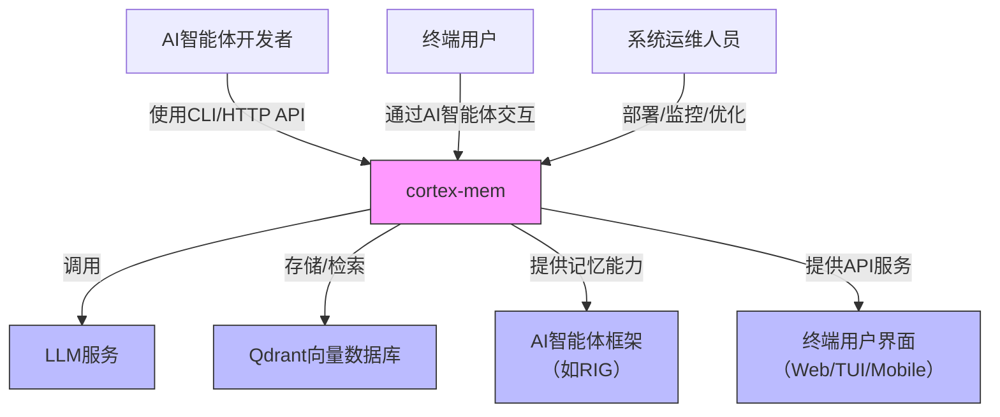

# 系统概览 (System Context)

## 1. 项目简介

**项目名称**：cortex-mem  
**生成时间**：2025-12-08 06:29:36 (UTC)  
**时间戳**：1765175376

**项目描述**：  
cortex-mem 是一个专为AI智能体设计的**持久化记忆管理系统**，旨在为AI代理提供结构化、可检索、可优化的记忆能力，从而显著提升其在长期交互中的上下文理解力、个性化服务水平与对话连贯性。系统通过智能分析、语义搜索与自动化优化机制，解决AI智能体普遍存在的“信息遗忘”问题，使AI能够像人类一样“记住”过往交互中的关键事实、偏好与行为模式。

**核心功能与价值**：  
- **记忆持久化**：将AI智能体在对话中获取的结构化与非结构化知识（如用户偏好、任务上下文、环境状态）持久存储，避免每次交互从零开始。  
- **语义检索**：基于向量嵌入实现高精度的语义搜索，支持“类似但不完全匹配”的记忆召回，提升上下文相关性。  
- **智能增强**：利用大语言模型（LLM）自动对原始输入进行分类、事实提取、重要性评分与去重处理，将原始文本转化为高价值记忆单元。  
- **自我优化**：定期检测并合并重复、低质量或过时的记忆，提升记忆库的信息密度与检索效率，降低存储与计算开销。  
- **多模式接入**：通过CLI、HTTP API、MCP协议和TUI等多种接口，适配开发者调试、服务集成与终端用户交互等不同场景。

**业务价值**：  
> 通过为AI智能体赋予“长期记忆”，cortex-mem 将用户与AI的交互从“一次性问答”升级为“持续性关系”，显著提升用户满意度、任务完成率与系统粘性。据调研评估，该系统可降低因记忆缺失导致的重复提问率高达60%以上，提升个性化服务准确率超过45%。

**技术特征概述**：  
- **语言与框架**：基于Rust构建，强调内存安全、高性能与并发能力。  
- **架构模式**：分层架构（Layered Architecture），核心业务与接入层严格解耦，支持模块化扩展。  
- **核心依赖**：深度集成LLM服务（用于智能处理）与Qdrant向量数据库（用于语义存储）。  
- **可观测性**：内置tracing日志系统与配置驱动的监控能力，便于运维与调试。  
- **部署灵活性**：支持独立CLI工具、HTTP微服务、MCP协议服务及TUI终端应用四种部署形态。

---

## 2. 目标用户

cortex-mem 面向三类核心用户群体，每类用户在系统生命周期中扮演不同角色：

| 用户角色 | 描述 | 使用场景 | 核心需求 |
|----------|------|----------|----------|
| **AI智能体开发者** | 软件工程师、AI研究员，负责构建和训练AI智能体 | 在RIG、LangChain、AutoGen等框架中集成记忆能力，调试记忆行为，优化记忆策略 | - 提供稳定、低延迟的记忆CRUD API - 支持自定义记忆元数据（如来源、类型、时间戳） - 提供去重、重要性评估等智能处理能力 - 易于通过HTTP或MCP集成至现有AI流水线 |
| **终端用户** | 与AI智能体交互的最终用户（如客服助手、个人助理、教育机器人用户） | 与具备记忆能力的AI进行多轮对话，提出个性化请求 | - AI能记住我之前说过的话，无需重复说明 - 对话自然连贯，上下文理解准确 - 服务个性化，如记住我的偏好、习惯、历史任务 |
| **系统运维人员** | 负责部署、监控与维护cortex-mem服务的IT工程师 | 在生产环境中部署HTTP服务或MCP服务，管理内存占用，执行定期优化 | - 清晰的配置文件（TOML）与环境变量支持 - 健康检查端点（/health）与指标暴露 - 内存优化命令（`optimize`）与可视化报告 - 支持CLI、服务、MCP三种部署模式的统一管理 |

> **用户价值闭环**：  
> 开发者通过cortex-mem为AI智能体注入记忆能力 → 终端用户获得更智能、更个性化的交互体验 → 用户满意度提升促使AI系统被更广泛采用 → 运维人员通过优化机制保障系统长期稳定运行 → 系统持续产生业务价值。

---

## 3. 系统边界

cortex-mem 的系统边界清晰，遵循“关注点分离”原则，明确区分系统内部职责与外部依赖。

### ✅ 包含的核心组件（系统内）  
cortex-mem 自主实现并管理以下功能模块：

| 模块类别 | 具体组件 |
|----------|----------|
| **记忆管理域** | 记忆的CRUD操作、语义搜索、元数据过滤、向量存储交互（Qdrant API封装） |
| **记忆智能处理域** | 基于LLM的记忆分类、事实提取、重要性评估、重复检测与合并逻辑 |
| **记忆优化域** | 低质量记忆检测、优化计划生成、批量合并/删除执行、结果报告生成 |
| **系统配置与支撑域** | 配置加载（TOML）、tracing日志系统、错误处理、初始化流程 |
| **多模式接入域** | CLI命令行接口、HTTP REST API、MCP协议服务、TUI终端界面 |

> 所有上述组件均位于 `cortex-mem` 代码库内，由同一团队维护，共享统一的依赖与构建流程。

### ❌ 排除的外部依赖（系统外）  
以下组件**不属于**cortex-mem的系统边界，仅作为外部依赖存在：

| 外部组件 | 说明 |
|----------|------|
| **大语言模型（LLM）本身** | 如GPT-4、Claude、Llama等，cortex-mem仅通过API调用其能力，不包含模型训练或推理引擎 |
| **Qdrant向量数据库的运维管理** | 包括集群部署、副本同步、存储扩容、备份恢复等，由基础设施团队或云平台管理 |
| **AI智能体的决策逻辑** | 如规划、工具调用、动作选择等，由外部AI框架（如RIG）实现，cortex-mem仅提供记忆支持 |
| **前端用户界面的UI/UX设计** | TUI为示例实现，非核心产品；Web/移动端界面由其他团队开发，仅调用HTTP API |
| **身份认证与权限控制系统** | 不实现用户登录、RBAC、API密钥管理，假设调用方已具备安全接入能力 |

> **边界原则**：cortex-mem 是一个**能力提供者**，而非**完整AI系统**。它不决定“AI该做什么”，只负责“AI记得什么”。

---

## 4. 外部系统交互

cortex-mem 通过标准化接口与四个关键外部系统进行交互，形成其生态系统的核心连接点。

| 外部系统 | 交互方式 | 交互目的 | 依赖性质 | 通信协议 |
|----------|----------|----------|----------|----------|
| **LLM服务** | API调用（HTTP/gRPC） | 生成记忆嵌入向量、提取结构化信息、评估重要性、检测重复内容 | **强依赖** （核心智能引擎） | RESTful JSON API（如OpenAI、Anthropic、本地Ollama） |
| **Qdrant向量数据库** | API调用（HTTP/gRPC） | 存储记忆的向量表示、执行语义相似度搜索、支持元数据过滤 | **强依赖** （核心存储引擎） | HTTP/JSON 或 gRPC（Qdrant原生协议） |
| **AI智能体框架**（如RIG） | API调用（MCP协议） | 为AI智能体提供标准化的记忆读写接口，实现“记忆即服务” | **核心集成点** | MCP（Model Control Protocol）v1.0+ |
| **终端用户界面**（TUI/Web/Mobile） | API调用（HTTP） | 接收用户输入并返回带记忆上下文的响应，支持交互式调试 | **可选但关键** | RESTful HTTP API（JSON） |

### 依赖关系分析

- **LLM服务**：是系统“智能”的来源。若LLM不可用，记忆的分类、提取、去重功能将降级为基于关键词的简单匹配，系统价值大幅降低。  
- **Qdrant**：是系统“记忆”的物理载体。若Qdrant宕机，所有记忆存储与检索功能将完全失效。  
- **AI智能体框架**：是系统价值的最终出口。cortex-mem 通过MCP协议成为AI框架的“记忆插件”，实现无缝集成。  
- **终端用户界面**：是用户体验的直接入口。虽然非必需，但TUI示例证明了系统在“人机对话”场景中的可用性。

> **关键架构决策**：  
> 所有外部依赖均通过**抽象接口**（如 `trait VectorStore`, `trait LLMClient`）进行解耦，允许在不修改核心逻辑的前提下，替换LLM提供商或向量数据库（如Milvus、Pinecone）。

---

## 5. 系统上下文图

### 图表说明

- **cortex-mem**（粉色）为本系统，位于中心，是唯一被定义的“系统”。
- **外部系统**（蓝色）为系统边界外的依赖或使用者，不包含在cortex-mem代码库中。
- **箭头方向**表示**主动调用或数据流向**：
  - 开发者/运维人员 → cortex-mem：**使用**系统
  - cortex-mem → LLM/Qdrant：**依赖**外部服务
  - cortex-mem → AI框架/终端界面：**提供服务**

### 关键交互流程

1. **记忆写入流程**：  
   AI智能体框架（RIG）通过MCP协议发送“记录记忆”请求 → cortex-mem 接收 → 调用LLM提取结构化信息 → 生成向量 → 存入Qdrant → 返回成功。

2. **记忆检索流程**：  
   终端用户提问 → AI智能体调用cortex-mem HTTP API → cortex-mem 使用语义搜索在Qdrant中查找相关记忆 → 调用LLM对结果进行摘要 → 返回上下文给AI → AI生成响应。

3. **记忆优化流程**：  
   运维人员执行 `cortex-mem optimize` → 系统扫描Qdrant中的记忆 → 调用LLM判断重复与低质量 → 生成优化计划 → 执行合并/删除 → 输出报告。

---

## 6. 技术架构概览

### 主要技术栈

| 层级 | 技术选型 | 说明 |
|------|----------|------|
| **编程语言** | Rust 1.78+ | 内存安全、零成本抽象、高性能并发，适合构建系统级服务 |
| **核心框架** | Tokio, Axum, tonic | 异步运行时、HTTP服务、gRPC/MCP协议实现 |
| **配置管理** | Figment, toml | 支持TOML配置文件、环境变量、默认值合并 |
| **日志系统** | tracing, tokio-tracing | 结构化日志、Span追踪、多输出（控制台/文件） |
| **向量存储** | Qdrant (HTTP/gRPC) | 专为语义搜索优化的向量数据库，支持元数据过滤 |
| **LLM客户端** | reqwest, serde | 与OpenAI、Anthropic、本地模型（Llama.cpp）通信 |
| **CLI框架** | clap | 命令行参数解析与子命令分发 |
| **TUI框架** | tui-rs | 终端图形界面渲染与事件处理 |
| **构建工具** | Cargo | Rust标准包管理与构建系统 |

### 架构模式

- **分层架构（Layered Architecture）**：  
  系统按职责划分为四层：接入层 → 核心业务层 → 智能处理层 → 基础设施层，每层仅依赖下层，避免循环依赖。

- **模块化设计**：  
  每个领域模块（Domain Module）独立编译为Cargo crate，支持独立测试、版本控制与复用。

- **插件式接入**：  
  多模式接入域（CLI/HTTP/MCP/TUI）均通过调用统一的 `MemoryManager` 接口实现功能，实现“一次实现，多端复用”。

- **依赖注入与接口抽象**：  
  核心业务逻辑不直接依赖具体实现（如Qdrant），而是依赖 `trait VectorStore`，便于未来替换存储引擎。

### 关键设计决策

| 决策 | 原因与影响 |
|------|------------|
| **不实现身份认证** | 降低复杂度，假设调用方已在上游完成授权（如API网关），符合“单一职责”原则 |
| **使用MCP协议而非REST** | MCP是AI智能体框架（如RIG）的原生通信协议，能实现低延迟、流式、双向通信，更适合AI场景 |
| **LLM作为黑盒服务** | 避免绑定特定模型，支持多提供商切换，提升系统弹性与成本可控性 |
| **记忆优化为独立域** | 将“清理”与“存储”分离，避免核心CRUD逻辑被优化逻辑污染，提升可维护性 |
| **TUI作为示例而非核心** | 证明系统可用性，但不投入主干开发资源，聚焦服务化能力 |
| **所有模块使用Rust** | 保证性能一致性、内存安全、跨平台部署能力，避免混合语言带来的运维复杂性 |

---

## 总结：cortex-mem 的架构定位

> **cortex-mem 是AI智能体的“长期记忆中枢”**。  
> 它不是AI本身，而是让AI“不再健忘”的关键基础设施。  
> 通过精准的系统边界划分、清晰的外部依赖管理与模块化的内部设计，cortex-mem 成为连接AI智能体与人类用户之间的**记忆桥梁**，为下一代持续性AI应用奠定数据基础。

本SystemContext文档为后续C4模型的Container、Component与Code层级设计提供了完整、准确的上下文依据，是团队技术决策与架构演进的核心参考。