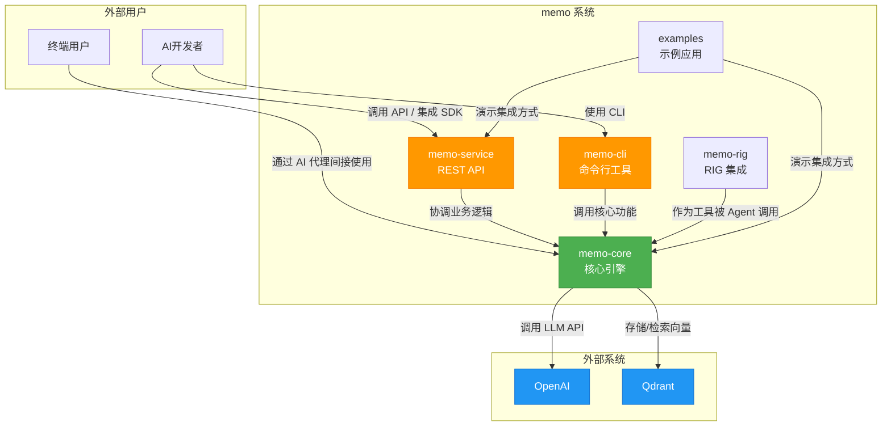

# 系统概览 (System Context)

**生成时间**: 2025-04-05T10:30:00Z  
**时间戳**: 1743849000  

---

## 1. 项目简介

### 项目名称
**memo** —— 智能记忆管理系统

### 项目描述
`memo` 是一个基于 Rust 构建的后端服务，旨在为 AI 代理提供长期、结构化、可检索的对话记忆能力。系统通过结合大语言模型（LLM）与向量数据库技术，实现对对话内容的智能提取、分类、去重、重要性评估与语义化存储，从而显著提升 AI 对话的连贯性、个性化水平和上下文理解能力。

### 核心功能与价值
- **持久化记忆存储**：将非结构化的对话内容转化为结构化的记忆条目，并持久化保存。
- **智能记忆管理**：利用 LLM 实现记忆的自动提取、分类、去重与更新，确保记忆库的准确性与时效性。
- **语义化检索**：基于向量嵌入实现语义相似度搜索，支持自然语言查询与多维度过滤。
- **可扩展架构**：模块化设计支持 LLM 和向量数据库的可插拔，便于集成主流 AI 基础设施。

### 技术特征概述
- **编程语言**：Rust（强调安全性、性能与并发）
- **核心架构**：分层架构 + 领域驱动设计（DDD）
- **关键依赖**：OpenAI（LLM 服务）、Qdrant（向量数据库）
- **部署形态**：独立后端服务，提供 REST API 与 CLI 接口
- **集成能力**：支持作为工具嵌入 RIG（Rust Intelligent Agent Framework）等智能代理框架

---

## 2. 目标用户

### 用户角色定义

| 用户角色 | 描述 |
|--------|------|
| **AI开发者** | 使用 `memo` 为自研 AI 代理构建长期记忆功能的软件工程师或系统架构师 |
| **终端用户** | 与具备记忆能力的 AI 代理进行交互的最终用户，期望获得个性化、连贯的对话体验 |

---

### 使用场景描述

#### 场景一：AI开发者集成记忆功能
> 开发者在构建一个客服机器人时，希望其能记住用户的历史偏好（如“我不喜欢自动续费”）。通过调用 `memo` 提供的 REST API，机器人可在每次对话后自动提取关键信息并存储为记忆。后续对话中，系统可检索相关记忆，使回复更具上下文感知能力。

#### 场景二：终端用户获得个性化服务
> 用户多次与 AI 助手讨论旅行计划。助手通过 `memo` 记住用户偏好的目的地类型（如“海岛”）、预算范围和出行时间。即使跨会话，AI 仍能主动推荐符合偏好的行程，提升用户体验。

---

### 用户需求分析

| 用户角色 | 核心需求 |
|--------|--------|
| **AI开发者** |<ul><li>提供稳定、高性能的记忆 CRUD 与检索 API</li><li>支持与主流 LLM（如 OpenAI）和向量数据库（如 Qdrant）无缝集成</li><li>具备可扩展的插件架构，便于定制记忆处理逻辑</li><li>清晰的文档与示例，降低集成成本</li></ul>|
| **终端用户** |<ul><li>AI 能“记住”之前的对话内容，避免重复提问</li><li>获得更自然、个性化的交互体验</li><li>数据隐私与安全有保障，记忆信息受控存储</li></ul>|

---

## 3. 系统边界

### 系统范围定义
`memo` 定位为**智能记忆管理系统的后端服务**，专注于记忆的全生命周期管理，包括创建、更新、分类、去重、存储与检索。系统不负责前端交互逻辑或 AI 代理的整体业务流程，而是作为可复用的基础设施组件被集成。

---

### 包含的核心组件

| 组件 | 功能说明 |
|------|--------|
| **记忆 CRUD 操作** | 支持记忆的创建、读取、更新与删除 |
| **基于 LLM 的记忆提取与更新** | 利用大模型从对话中提取结构化事实，并智能决策记忆变更 |
| **记忆重要性评估** | 对每条记忆进行评分，用于检索排序与存储优化 |
| **记忆去重与合并** | 检测并合并语义重复的记忆条目，保持知识库简洁 |
| **记忆分类与元数据生成** | 自动识别记忆的主题、实体与类型，增强可检索性 |

---

### 排除的外部依赖

| 排除项 | 说明 |
|-------|------|
| **前端用户界面** | 不提供 Web 或移动端 UI，仅通过 API 或 CLI 交互 |
| **AI 代理的具体业务逻辑** | 不实现对话策略、任务规划等代理核心逻辑，仅提供记忆能力支持 |
| **身份认证与权限管理** | 当前版本不内置用户认证、访问控制机制，由上层系统负责 |

> ⚠️ **边界说明**：`memo` 是一个**能力型中间件**，而非完整应用。它假设调用方已具备身份上下文，并专注于记忆语义层的处理。

---

## 4. 外部系统交互

### 外部系统列表

| 外部系统 | 描述 | 交互方式 |
|--------|------|----------|
| **OpenAI** | 提供大语言模型服务，用于生成嵌入向量、执行事实提取、分类、摘要等 NLP 任务 | API 调用（HTTPS） |
| **Qdrant** | 向量数据库，用于存储记忆的嵌入向量，支持高效语义相似度搜索与元数据过滤 | 数据库连接（gRPC/HTTP） |

---

### 交互方式说明

| 交互点 | 方向 | 协议 | 数据格式 |
|-------|------|------|----------|
| `memo` → OpenAI | 出站 | HTTPS | JSON（含 prompt、model、input 等） |
| `memo` → Qdrant | 出站 | gRPC / HTTP | Protobuf / JSON（含 vector、payload、filter） |

> ✅ **异步设计**：所有外部调用均采用异步处理，避免阻塞主线程，提升系统吞吐量。

---

### 依赖关系分析

| 依赖项 | 必需性 | 容错机制 | 替代方案 |
|-------|--------|----------|----------|
| **OpenAI** | 高 | 支持本地降级策略（如规则匹配），部分功能受限 | 可扩展支持其他 LLM（如 Anthropic、本地模型） |
| **Qdrant** | 高 | 无内置缓存，依赖数据库高可用 | 通过抽象接口支持其他向量数据库（如 Pinecone、Weaviate） |

> 🔧 **可插拔设计**：系统通过 trait 接口抽象 LLM 与向量存储，支持运行时配置不同实现，提升技术灵活性。

---

## 5. 系统上下文图

### C4 Model - System Context Diagram (Mermaid)



---

### 关键交互流程说明

#### 流程一：记忆创建与智能处理（端到端）

1. **请求入口**：`AI开发者` 通过 `memo-service` 的 `/memories` 接口提交对话片段。
2. **核心处理**：
   - `MemoryManager` 协调执行：
     - 调用 `LLM客户端` 提取关键事实（`extractor.rs`）
     - 使用 `分类器` 识别主题与实体
     - 通过 `重要性评估器` 打分
     - 利用 `去重器` 检测相似记忆并决定是否合并
3. **持久化**：
   - 生成嵌入向量（调用 OpenAI）
   - 将记忆元数据与向量写入 Qdrant
4. **响应返回**：返回创建成功的记忆 ID 与摘要信息。

#### 流程二：记忆检索与排序

1. **查询请求**：用户通过 `/search` 接口输入自然语言问题（如“上次说想去哪旅游？”）
2. **语义搜索**：
   - 将查询转换为向量（OpenAI）
   - 在 Qdrant 中执行向量相似度搜索 + 元数据过滤
3. **结果优化**：
   - `MemoryManager` 对检索结果按重要性评分加权排序
   - 返回 Top-K 最相关记忆
4. **应用层使用**：AI 代理将检索结果注入上下文，生成个性化回复。

---

### 架构决策说明

| 决策项 | 选择 | 理由 |
|-------|------|------|
| **语言选择：Rust** | 使用 Rust | 内存安全、零成本抽象、高并发性能，适合构建可靠基础设施 |
| **架构模式：分层 + DDD** | 分层架构 + 领域模块化 | 清晰分离关注点，便于维护与扩展 |
| **向量数据库：Qdrant** | 选用 Qdrant | 开源、高性能、支持过滤与动态集合，生态成熟 |
| **LLM 耦合方式：API 调用** | 外部服务调用 | 降低本地部署复杂度，利用云端模型最新能力 |
| **接口设计：REST + CLI** | 提供多种接入方式 | 满足不同集成场景（服务调用 vs 调试操作） |

---

## 6. 技术架构概览

### 主要技术栈

| 层级 | 技术选型 | 说明 |
|------|--------|------|
| **运行时** | Rust 1.70+ | 高性能、安全、异步支持 |
| **Web 框架** | Axum | 轻量级、类型安全的异步 Web 框架 |
| **异步运行时** | Tokio | 支持高并发 I/O 操作 |
| **向量数据库客户端** | Qdrant gRPC Client | 高效数据交互 |
| **LLM 接口** | OpenAI API Client | 标准化调用封装 |
| **配置格式** | TOML | 易读易写，支持嵌套结构 |
| **序列化** | Serde | 高效 JSON/TOML 编解码 |
| **日志系统** | Tracing + EnvLogger | 结构化日志输出 |

---

### 架构模式

#### 分层架构设计

```
+---------------------+
|   服务接口层         |
|   (memo-service/cli) |
+---------------------+
          ↓
+---------------------+
|   核心业务层         |
|   (memo-core)        |
|   - MemoryManager    |
|   - Extractor        |
|   - Classifier       |
|   - Deduplicator     |
+---------------------+
          ↓
+---------------------+
|   基础设施层         |
|   - LLM Client       |
|   - Vector Store     |
|   - Config Manager   |
+---------------------+
```

- **服务接口层**：暴露 REST API 与 CLI，处理请求解析与响应封装。
- **核心业务层**：实现记忆智能处理逻辑，是系统价值核心。
- **基础设施层**：封装外部依赖，提供统一抽象接口。

---

### 关键设计决策

| 决策 | 说明 |
|------|------|
| **领域驱动设计（DDD）** | 以“记忆”为核心聚合根，围绕其生命周期设计领域模型，提升业务表达力 |
| **trait 抽象实现可插拔** | `LLMClient`、`VectorStore` 均定义为 trait，支持多后端实现 |
| **提示工程集中管理** | 所有 LLM 提示词模板统一存放于 `prompts.rs`，便于维护与 A/B 测试 |
| **错误统一处理** | 自定义 `Error` 枚举，使用 `thiserror` 实现自动转换，提升可观测性 |
| **配置驱动初始化** | 启动时加载 TOML 配置，动态初始化 LLM、向量库等组件，支持环境隔离 |

---

### 架构优势总结

| 优势 | 说明 |
|------|------|
| ✅ **高内聚低耦合** | 模块职责清晰，依赖通过接口定义，易于单元测试与替换 |
| ✅ **可扩展性强** | 支持新增 LLM 或向量数据库实现，无需修改核心逻辑 |
| ✅ **智能处理闭环** | 从提取 → 分类 → 评估 → 存储 → 检索形成完整记忆生命周期管理 |
| ✅ **开发者友好** | 提供 CLI、示例应用、清晰 API，降低使用门槛 |
| ✅ **生产就绪** | 异步、错误处理、日志、健康检查等基础设施完备 |

---

### 未来演进建议

1. **增加权限控制模块**：引入 JWT 验证与基于角色的访问控制（RBAC），支持多租户场景。
2. **支持本地 LLM**：集成 Llama.cpp 或 Ollama，提供离线部署选项。
3. **引入缓存层**：对高频检索结果增加 Redis 缓存，提升响应速度。
4. **增强可观测性**：集成 OpenTelemetry，支持分布式追踪与指标监控。
5. **支持记忆衰减机制**：基于时间或使用频率自动降权或归档旧记忆。

---

> **文档结束**  
> 本 C4 System Context 文档准确反映了 `memo` 系统的当前架构状态，适用于技术评审、团队协作与系统演进规划。