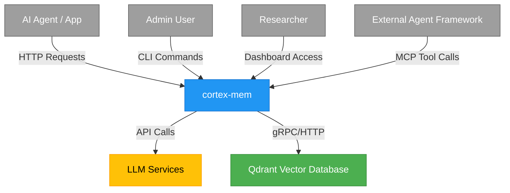
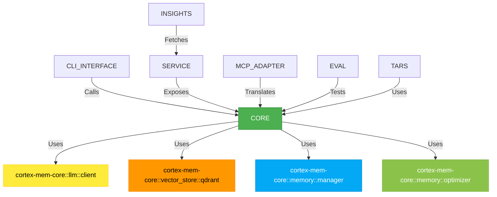
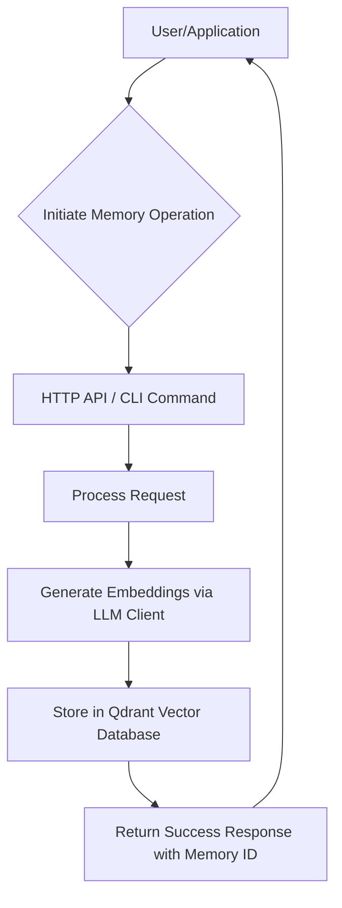
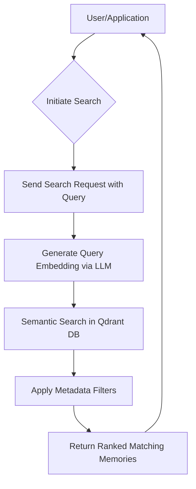
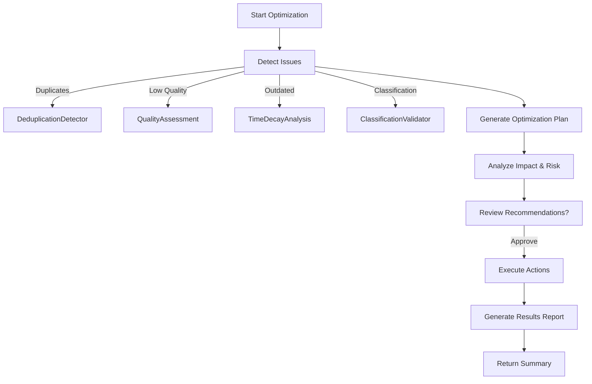

# System Architecture Documentation  
**Project:** `cortex-mem`  
**Generated at:** 2025-12-18 03:29:11 (UTC) (UTC)  
**Timestamp:** 1766028551  

---

## 1. Architecture Overview

### Architecture Design Philosophy

The **cortex-mem** system is designed around the principles of **modularity**, **extensibility**, and **intelligent automation**, with a strong emphasis on enabling **AI agents to maintain persistent, searchable, and optimizable knowledge** across interactions. The architecture follows a **layered, domain-driven design (DDD)** approach, where core business logic is encapsulated in a central engine (`cortex-mem-core`), while multiple interface layers provide flexible access for developers, operators, and researchers.

The system embraces **separation of concerns** through well-defined boundaries between:
- **Core memory processing**
- **Storage and retrieval**
- **User-facing interfaces**
- **Analytics and evaluation**

This modular structure ensures that each component can evolve independently, supporting both research experimentation and production deployment.

---

### Core Architecture Patterns

| Pattern | Application | Benefit |
|-------|------------|--------|
| **Modular Monolith / Plugin Architecture** | Core engine exposes pluggable traits (`VectorStore`, `LLMClient`, etc.) | Enables extensibility without tight coupling |
| **Strategy Pattern** | Used for detectors, evaluators, and optimizers | Allows runtime selection of algorithms based on configuration |
| **Shared State Pattern** | `Arc<MemoryManager>` shared across API handlers | Thread-safe access to core engine in async environment |
| **Command-Query Responsibility Segregation (CQRS)** | Separation of write (CRUD) and read (search/analysis) paths | Optimized data flow for different use cases |
| **Event-Driven Orchestration (Implicit)** | Optimization workflows trigger analysis → planning → execution | Supports complex, multi-stage processes |

---

### Technology Stack Overview

| Layer | Technology | Rationale |
|------|-----------|---------|
| **Core Engine** | Rust | Memory safety, performance, async support, trait-based abstraction |
| **REST API** | Axum (Rust) | Lightweight, type-safe, integrates seamlessly with Tokio |
| **CLI Interface** | Clap (Rust) | Declarative argument parsing, rich CLI experience |
| **Web Dashboard** | SvelteKit + Elysia.js | Fast frontend, minimal boilerplate, TypeScript safety |
| **Vector Database** | Qdrant | High-performance semantic search, metadata filtering, cloud-native |
| **LLM Integration** | OpenAI-compatible APIs via RIG | Flexibility to use various LLM providers (OpenAI, Anthropic, local models) |
| **Configuration** | TOML | Human-readable, hierarchical, widely supported |
| **Runtime** | Tokio | Asynchronous execution model for high concurrency |

> ✅ **Key Insight**: The choice of **Rust** as the primary language reflects a focus on **performance, reliability, and safety**—critical for systems handling persistent agent memory where data integrity and low-latency operations are essential.

---

## 2. System Context

### System Positioning and Value

**cortex-mem** is a **full-stack memory management platform** designed specifically for **AI agents**. It enables agents to:
- Retain context across conversations and tasks
- Recall relevant past experiences via semantic search
- Optimize memory quality through deduplication and enhancement
- Visualize and analyze memory patterns

This capability significantly improves agent **consistency**, **effectiveness**, and **long-term intelligence**, making it a foundational component in advanced AI agent architectures.

---

### User Roles and Scenarios

| Role | Description | Key Use Cases |
|------|-----------|-------------|
| **AI Agent Developers** | Engineers integrating memory into AI applications | - Store agent interactions<br>- Retrieve context before responses<br>- Monitor memory usage via API |
| **System Administrators** | Ops teams managing agent infrastructure | - Run memory optimization jobs<br>- Monitor system health<br>- Analyze memory trends and costs |
| **Research Scientists** | Researchers evaluating agent memory systems | - Benchmark recall accuracy<br>- Test optimization strategies<br>- Generate synthetic datasets |

---

### External System Interactions



#### Interaction Types:
- **LLM Services**: Used for embedding generation, classification, keyword extraction, and optimization guidance.
- **Qdrant**: Primary vector database for storing memory embeddings and metadata.
- **HTTP Clients**: Access REST API and web dashboard.
- **CLI Tools**: Direct terminal interaction for scripting and debugging.
- **MCP Clients**: Integration with agent frameworks using Model Context Protocol.

---

### System Boundary Definition

| Included Components | Excluded Components |
|---------------------|---------------------|
| - Memory CRUD operations<br>- Semantic search with vector embeddings<br>- Deduplication and optimization<br>- Analytics dashboard<br>- REST/CLI/MCP interfaces<br>- Evaluation framework | - Training of LLMs or embedding models<br>- Development of vector database engine<br>- OS-level resource management<br>- Network infrastructure provisioning |

> 🔒 **Boundary Clarity**: The system **integrates** with external AI and storage services but does **not own** their underlying models or infrastructure.

---

## 3. Container View

### Domain Module Division

The system is structured into **five primary domains**, each representing a logical grouping of functionality:

| Domain | Type | Responsibility |
|-------|------|----------------|
| **Memory Management Domain** | Core Business | Full lifecycle management of memories (CRUD, retrieval, metadata) |
| **Memory Storage Domain** | Technical | Persistent storage using vector database (Qdrant) |
| **Optimization Domain** | Core Business | Improve memory quality via deduplication, relevance tuning, enhancement |
| **Insights & Analytics Domain** | Support | Visualization, monitoring, and reporting |
| **Evaluation & Tools Domain** | Support | Benchmarking, testing, and example agents |

---

### Domain Module Architecture

```mermaid
graph TD
    subgraph "External Systems"
        LLM[LLM Services]
        QDRANT[Qdrant DB]
        HTTP[HTTP Clients]
        CLI[CLI Users]
        MCP[Agent Frameworks]
    end

    subgraph "cortex-mem System"
        CORE[cortex-mem-core\n(Memory Engine)]
        
        subgraph Interfaces
            SERVICE[cortex-mem-service\n(Rest API)]
            CLI_INTERFACE[cortex-mem-cli\n(Command Line)]
            MCP_ADAPTER[cortex-mem-mcp\n(MCP Adapter)]
            INSIGHTS[cortex-mem-insights\n(Dashboard UI)]
        end

        subgraph Support
            EVAL[cortex-mem-evaluation\n(Benchmarking)]
            TARS[cortex-mem-tars\n(Terminal Agent)]
        end
    end

    SERVICE --> CORE
    CLI_INTERFACE --> CORE
    MCP_ADAPTER --> CORE
    INSIGHTS --> SERVICE
    EVAL --> CORE
    TARS --> CORE

    CORE --> LLM
    CORE --> QDRANT

    HTTP --> SERVICE
    CLI --> CLI_INTERFACE
    MCP --> MCP_ADAPTER

    style CORE fill:#4CAF50,stroke:#388E3C,color:white
    style SERVICE fill:#2196F3,stroke:#1976D2,color:white
    style CLI_INTERFACE fill:#9C27B0,stroke:#7B1FA2,color:white
    style MCP_ADAPTER fill:#FF9800,stroke:#F57C00,color:white
    style INSIGHTS fill:#00BCD4,stroke:#00ACC1,color:white
    style EVAL fill:#795548,stroke:#5D4037,color:white
    style TARS fill:#607D8B,stroke:#455A64,color:white
```

---

### Storage Design

#### Data Model (Qdrant Collection Schema)

```json
{
  "id": "uuid",
  "vector": "float[1536]", // Embedding dimension (auto-detected)
  "payload": {
    "content": "string",
    "metadata": {
      "source": "string",
      "timestamp": "datetime",
      "type": "string",
      "importance": "float",
      "version": "int"
    },
    "keywords": ["string"],
    "embedding_model": "string"
  }
}
```

#### Key Features:
- **Semantic Search**: Enabled via vector similarity (cosine distance)
- **Metadata Filtering**: Supports filtering by `type`, `source`, `timestamp`, etc.
- **Batch Operations**: Efficient bulk insert/update/delete
- **Auto-detection**: Dynamically detects embedding dimensions from LLM

---

### Inter-Domain Module Communication

| From → To | Communication Mechanism | Protocol/Data Format |
|---------|--------------------------|-----------------------|
| Memory Management → Storage | Function call (`upsert_point`, `search`) | Rust trait interface (`VectorStore`) |
| Memory Management → LLM | HTTP API call | JSON over HTTPS |
| Optimization → Memory Management | Direct method invocation | In-process Rust calls |
| Insights → Memory Management | REST API call | JSON over HTTP |
| CLI/API → Core | Shared state (`Arc<MemoryManager>`) | In-memory Rust objects |

> 🔄 **Communication Pattern**: Most inter-module communication occurs **in-process** via function calls or shared state, ensuring low latency. External access (dashboard, evaluation) uses **REST API** as a secure boundary.

---

## 4. Component View

### Core Functional Components

#### `cortex-mem-core` – Memory Engine

**Responsibilities**:
- Orchestrate memory lifecycle
- Generate embeddings and metadata
- Execute optimization plans
- Manage vector store interactions

**Internal Structure**:
```rust
pub struct MemoryManager {
    vector_store: Box<dyn VectorStore>,
    llm_client: Box<dyn LLMClient>,
    fact_extractor: Box<dyn FactExtractor>,
    memory_updater: Box<dyn MemoryUpdater>,
    importance_evaluator: Box<dyn ImportanceEvaluator>,
    duplicate_detector: Box<dyn DuplicateDetector>,
    memory_classifier: Box<dyn MemoryClassifier>,
}
```

**Key Traits**:
| Trait | Purpose | Implementations |
|------|--------|----------------|
| `VectorStore` | Abstracts vector DB operations | `QdrantStore`, `ChromaStore` (planned) |
| `LLMClient` | Standardizes LLM interactions | `OpenAIClient`, `AnthropicClient`, `LocalLlama` |
| `DuplicateDetector` | Detects redundant memories | Rule-based, LLM-based, hybrid |

---

#### `cortex-mem-service` – REST API

- Built with **Axum**
- Endpoints:
  - `POST /memories` – Create memory
  - `GET /memories/{id}` – Retrieve by ID
  - `POST /memories/search` – Semantic search
  - `POST /optimization/start` – Trigger optimization
  - `GET /status` – Health check
- Uses `Arc<MemoryManager>` for thread-safe access
- JSON request/response format

---

#### `cortex-mem-cli` – Command Line Interface

- Built with **Clap**
- Commands:
  - `add "content" --type=event`
  - `search "what did I do yesterday?"`
  - `optimize --strategy=dedupe`
  - `list --filter type=belief`
- Reads config from `config.toml`
- Asynchronous execution via Tokio

---

#### `cortex-mem-mcp` – MCP Protocol Adapter

- Implements **Model Context Protocol (MCP)**
- Exposes tools:
  - `store_memory(content, metadata)`
  - `query_memories(query, filters)`
  - `list_memories(filter)`
  - `get_memory(id)`
- Enables integration with agent frameworks like LangChain, AutoGPT

---

#### `cortex-mem-insights` – Dashboard UI

- **Frontend**: SvelteKit (TypeScript)
- **Backend**: Elysia.js (Bun runtime)
- Features:
  - Memory distribution charts
  - Optimization history timeline
  - Real-time memory stream
  - Search playground
- Pulls data from `cortex-mem-service` API

---

### Technical Support Components

| Component | Purpose | Technology |
|--------|--------|-----------|
| `cortex-mem-evaluation` | Benchmark memory recall and effectiveness | Synthetic dataset generation, accuracy scoring |
| `cortex-mem-tars` | Example terminal agent demonstrating usage | Interactive CLI agent with memory loop |

---

### Component Responsibility Division



---

## 5. Key Processes

### Core Functional Processes

#### Memory Management Process



**Sequence Flow**:
1. Client sends `POST /memories` with content
2. Handler calls `MemoryManager::create_memory()`
3. LLM generates embedding and extracts keywords/classification
4. Memory stored in Qdrant with full payload
5. Response returns `201 Created` with memory ID

---

#### Memory Search Process



**Sequence Flow**:
1. Client sends `POST /memories/search` with query
2. Query embedded using same LLM model
3. Qdrant performs approximate nearest neighbor (ANN) search
4. Results filtered by metadata (e.g., `type=belief`, `timestamp > 2024`)
5. Ranked list returned with relevance scores

---

#### Memory Optimization Process



**Key Stages**:
1. **Detection**: Scan memories for duplicates, low importance, outdated content
2. **Planning**: Propose merge/delete/enhance actions
3. **Approval**: Optional human-in-the-loop review
4. **Execution**: Apply changes via `MemoryUpdater`
5. **Reporting**: Return summary of actions taken

---

### Exception Handling Mechanisms

| Failure Type | Handling Strategy |
|-------------|-------------------|
| **LLM Timeout** | Retry with exponential backoff (3 attempts) |
| **Qdrant Unavailable** | Return 503, log error, retry on next operation |
| **Invalid Request** | Return 400 with validation details |
| **Duplicate Memory** | Auto-merge or return conflict (configurable) |
| **Optimization Risk High** | Block execution unless override flag set |

> ⚠️ **Improvement Suggestion**: Add circuit breaker pattern for external dependencies and implement distributed tracing.

---

## 6. Technical Implementation

### Core Module Implementation

#### `memory/manager.rs` – Orchestration Hub

- Single entry point for all memory operations
- Composes extractors, evaluators, and updaters
- Thread-safe via `Arc<Mutex<>>` or async equivalents

```rust
impl MemoryManager {
    pub async fn create_memory(&self, content: String, metadata: Metadata) -> Result<Memory> {
        let embedding = self.llm_client.embed(&content).await?;
        let keywords = self.llm_client.extract_keywords(&content).await?;
        let memory_type = self.memory_classifier.classify(&content).await?;
        let importance = self.importance_evaluator.score(&content).await?;

        let memory = Memory::new(content, embedding, metadata)
            .with_keywords(keywords)
            .with_type(memory_type)
            .with_importance(importance);

        self.vector_store.upsert(&memory).await?;
        Ok(memory)
    }
}
```

---

### Key Algorithm Design

#### Hybrid Deduplication Algorithm

```rust
fn detect_duplicate(&self, new_memory: &Memory, existing: &[Memory]) -> Option<MemoryId> {
    // Step 1: Fast rule-based filter (same source + similar timestamp)
    let candidates = rule_filter(new_memory, existing);
    
    // Step 2: Semantic similarity (vector distance < threshold)
    let similar = semantic_filter(new_memory.embedding, &candidates);
    
    // Step 3: LLM validation (are they truly duplicates?)
    if let Some(primary) = similar.first() {
        if self.llm_client.confirm_duplicate(new_memory, primary).await? {
            return Some(primary.id);
        }
    }
    None
}
```

> ✅ **Accuracy**: Combines speed (rules) with precision (LLM)

---

### Data Structure Design

#### Memory Object (Rust)

```rust
#[derive(Serialize, Deserialize)]
pub struct Memory {
    pub id: Uuid,
    pub content: String,
    pub embedding: Vec<f32>,
    pub metadata: HashMap<String, Value>,
    pub keywords: Vec<String>,
    pub memory_type: MemoryType,
    pub importance: f32,
    pub created_at: DateTime<Utc>,
    pub updated_at: DateTime<Utc>,
    pub version: u32,
}
```

#### Configuration Model (`config.toml`)

```toml
[server]
host = "127.0.0.1"
port = 8080

[qdrant]
url = "http://localhost:6334"
collection = "memories"

[llm]
provider = "openai"
model = "text-embedding-3-small"
api_key = "sk-..."

[optimization]
deduplication_threshold = 0.92
importance_decay_rate = 0.01
```

---

### Performance Optimization Strategies

| Strategy | Implementation |
|--------|----------------|
| **Embedding Caching** | Cache recent embeddings by content hash (planned) |
| **Batch Processing** | Support bulk insert/search operations |
| **Async I/O** | All LLM and DB calls are non-blocking |
| **Indexing** | Qdrant uses HNSW index for fast ANN search |
| **Connection Pooling** | Reuse HTTP connections to LLM and Qdrant |

> 🚀 **Future Enhancement**: Add Redis cache layer for frequent queries.

---

## 7. Deployment Architecture

### Runtime Environment Requirements

| Component | CPU | Memory | Disk | Network |
|--------|------|--------|------|---------|
| `cortex-mem-core` | 2 vCPU | 4 GB | 1 GB (temp) | Outbound to LLM/Qdrant |
| `cortex-mem-service` | 1 vCPU | 1 GB | - | Inbound HTTP |
| `cortex-mem-insights` | 1 vCPU | 2 GB | - | Inbound HTTP |
| Qdrant | 4 vCPU | 8 GB | SSD | Internal gRPC |
| LLM (external) | N/A | N/A | N/A | Public API |

---

### Deployment Topology Structure

```mermaid
graph LR
    subgraph "Cloud / On-Prem"
        LB[Load Balancer]
        subgraph "Application Layer"
            API[cortex-mem-service\nReplica 1-3]
            CLI[CLI Tools]
        end
        subgraph "Core Layer"
            CORE[cortex-mem-core\nShared Engine]
        end
        subgraph "Data Layer"
            QDRANT[Qdrant Cluster]
            CACHE[(Redis Cache)\nOptional]
        end
        subgraph "External"
            LLM[LLM API\n(OpenAI, etc.)]
            BROWSER[Web Browser]
            AGENT[AI Agent]
        end
    end

    BROWSER --> LB --> API --> CORE
    CLI --> CORE
    AGENT --> API
    CORE --> QDRANT
    CORE --> CACHE
    CORE --> LLM

    style CORE fill:#4CAF50,stroke:#388E3C,color:white
    style API fill:#2196F3,stroke:#1976D2,color:white
    style QDRANT fill:#4CAF50,stroke:#388E3C,color:white
    style LLM fill:#FFC107,stroke:#FFA000,color:black
    style CACHE fill:#9C27B0,stroke:#7B1FA2,color:white
```

---

### Scalability Design

| Aspect | Strategy |
|------|----------|
| **Horizontal Scaling** | Multiple `cortex-mem-service` instances behind load balancer |
| **Vertical Scaling** | Scale Qdrant and core engine with memory/CPU |
| **Data Partitioning** | Future support for sharded collections by agent ID |
| **Streaming Support** | Planned for large search results and long-running optimizations |

---

### Monitoring and Operations

#### Current Capabilities
- Health checks (`GET /status`)
- Logging via `tracing` crate
- Configuration reload (TOML)

#### Recommended Enhancements
| Tool | Purpose |
|------|--------|
| **Prometheus + Grafana** | Metrics: request rate, latency, memory count |
| **OpenTelemetry** | Distributed tracing across components |
| **Sentry** | Error tracking and alerting |
| **Log Aggregation** | ELK or Loki for centralized logs |

> 🔐 **Security Recommendations**:
> - Add JWT authentication for API
> - Rate limiting on public endpoints
> - Encrypt sensitive config (e.g., API keys)
> - Role-based access control (RBAC) for dashboard

---

## Conclusion

The **cortex-mem** architecture presents a **robust, modular, and intelligent** solution for AI agent memory management. Its **Rust-based core** ensures performance and safety, while **multiple access interfaces** (REST, CLI, MCP, Dashboard) provide flexibility for diverse users.

The system effectively combines **vector storage (Qdrant)** with **LLM-powered intelligence** to enable semantic search, automatic metadata enrichment, and proactive optimization. The clear separation of domains and components makes it **easy to extend, maintain, and scale**.

### Final Recommendations
1. **Add Caching Layer** (Redis) to reduce LLM/vector DB load
2. **Implement Authentication** for production use
3. **Enhance Observability** with metrics and tracing
4. **Expand Testing** with unit/integration tests
5. **Support More Vector Stores** (Chroma, Weaviate) via trait implementation

This architecture is well-positioned to serve as a **foundational memory layer** in next-generation AI agent systems.