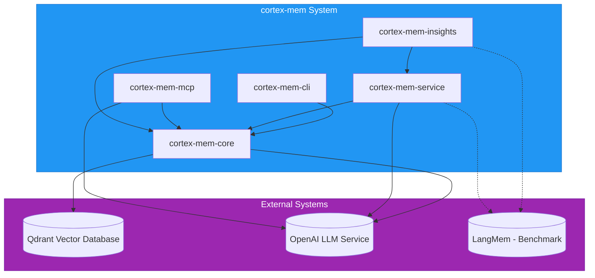
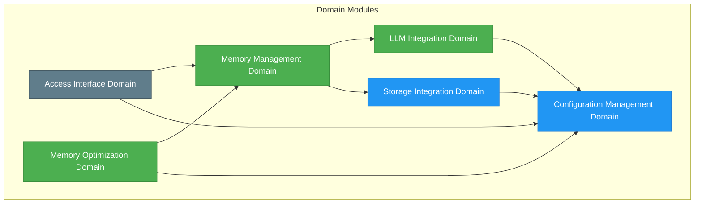
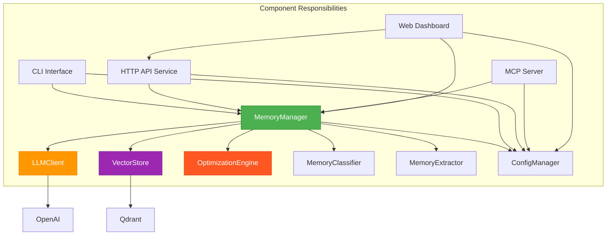
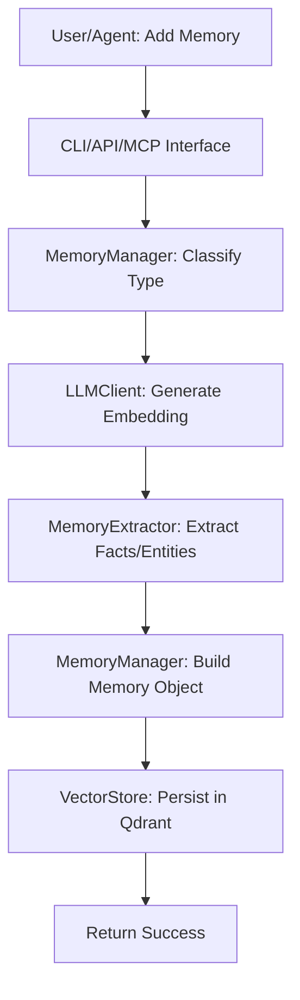
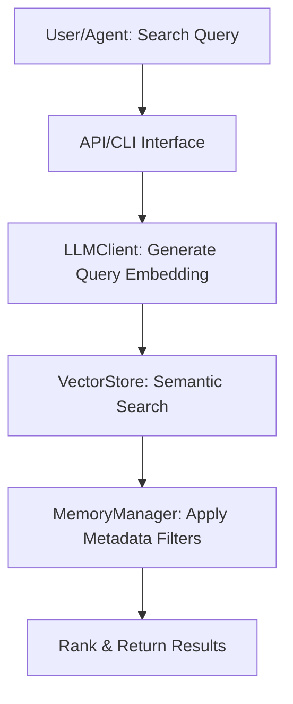
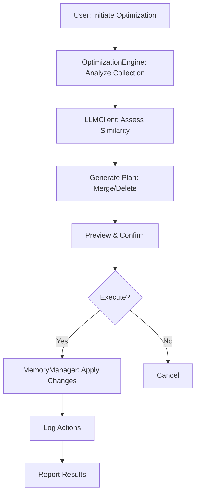
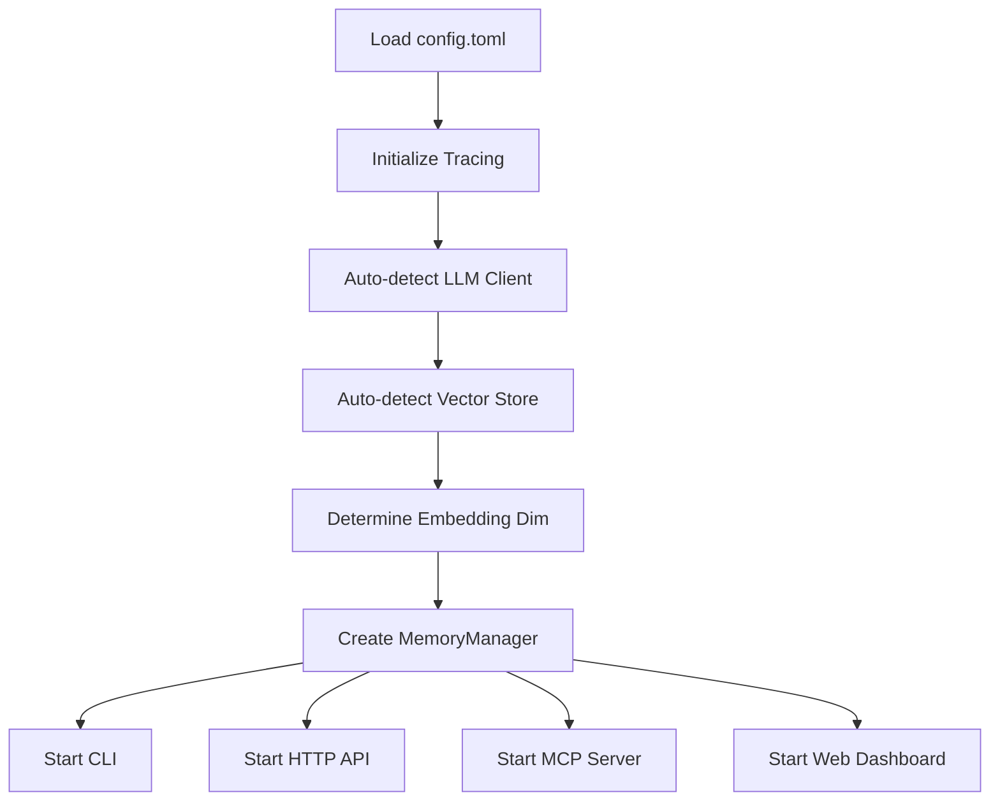
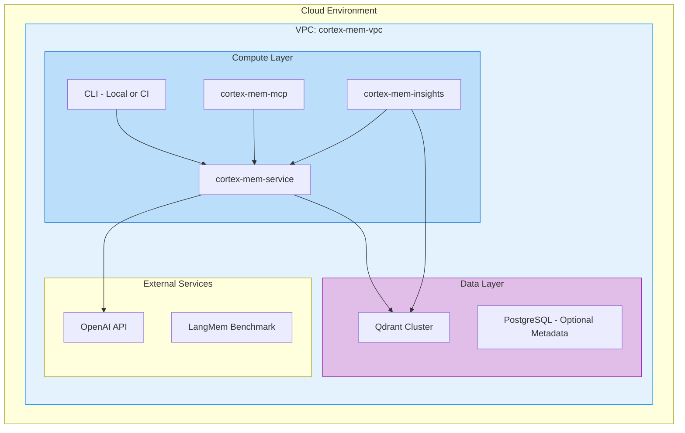

# System Architecture Documentation  
**Project:** `cortex-mem`  
**Generated on:** 2025-12-30 11:19:34 (UTC)  
**Timestamp:** 1767093574  

---

## 1. Architecture Overview

### Architecture Design Philosophy

The `cortex-mem` system is designed around the principle of **persistent, intelligent memory management for AI agents**, enabling them to retain context across interactions and improve decision-making over time. The architecture emphasizes **modularity, extensibility, and interoperability**, ensuring that diverse integration scenarios—from CLI tools to agent frameworks—can coexist seamlessly.

At its core, the system follows a **microservices-inspired modular monolith pattern**, where core business logic is centralized in a shared Rust-based library (`cortex-mem-core`), while multiple access interfaces (CLI, HTTP API, MCP, Web UI) operate as independent but tightly integrated components. This design balances performance and maintainability with flexibility and scalability.

The system leverages **external AI and vector storage services** (OpenAI and Qdrant) to offload computationally intensive tasks such as embedding generation and semantic search, allowing the core engine to focus on orchestration, optimization, and lifecycle management.

### Core Architecture Patterns

- **Layered Architecture**: Clear separation into access, business logic, infrastructure, and support layers.
- **Modular Monolith with Shared Core**: All interfaces share a common core engine, reducing duplication and ensuring consistency.
- **Event-Driven Orchestration**: Workflows are initiated by user or agent requests and orchestrated through a centralized memory manager.
- **Configuration-Driven Behavior**: A centralized configuration system (`cortex-mem-config`) ensures uniform behavior across all components.
- **LLM-Augmented Intelligence**: LLMs are used not just for embeddings, but also for content analysis, fact extraction, and optimization decisions.

### Technology Stack Overview

| Layer | Technology | Purpose |
|------|-----------|--------|
| **Core Engine** | Rust | High-performance, memory-safe backend logic |
| **Interfaces** | Rust (CLI, API, MCP), TypeScript/Svelte (Web UI) | Multi-channel access |
| **Storage** | Qdrant (Vector DB) | Semantic search via embeddings |
| **AI Services** | OpenAI API | Embedding generation, content analysis, structured extraction |
| **Configuration** | TOML | Human-readable, hierarchical configuration |
| **Observability** | Tracing (OpenTelemetry), Logging | Debugging and monitoring |
| **Build & Packaging** | Cargo (Rust), npm/pnpm (Web) | Dependency and build management |

---

## 2. System Context

### System Positioning and Value

`cortex-mem` is a **full-stack memory management system** that provides AI agents with persistent, searchable, and optimizable memory. It enables agents to:

- Retain conversation history and learned knowledge
- Retrieve relevant memories using semantic search
- Optimize memory usage by removing duplicates and low-quality entries
- Integrate seamlessly into agent workflows via multiple protocols

This significantly enhances **agent intelligence, continuity, and user experience** by preventing context loss and enabling long-term learning.

### User Roles and Scenarios

| Role | Needs | Interaction Scenarios |
|------|-------|------------------------|
| **AI Agents** | Store context, retrieve relevant memories, optimize memory usage | Use MCP or API to log interactions and query past experiences |
| **Developers** | Integrate memory into AI apps, configure behavior, debug | Use CLI, API, or SDKs to build agent systems |
| **System Administrators** | Monitor health, optimize performance, manage configurations | Use web dashboard and CLI for maintenance and tuning |

### External System Interactions



- **Qdrant**: Used for storing and retrieving memory embeddings via vector similarity search.
- **OpenAI**: Provides text embeddings, content analysis, and structured extraction (facts, entities).
- **LangMem**: Used for benchmarking and comparative evaluation of memory systems.

### System Boundary Definition

#### Included Components
- Memory storage and retrieval
- Semantic search capabilities
- Memory optimization engine
- Multiple access interfaces (CLI, API, MCP, Web Dashboard)
- Configuration management
- Integration with LLM and vector database services

#### Excluded Components
- Core AI agent logic (e.g., reasoning, planning)
- Application-specific business rules
- End-user UI design for agent applications
- Network infrastructure management (e.g., load balancing, firewalls)

---

## 3. Container View

### Domain Module Division

The system is divided into six primary domain modules, each responsible for a distinct aspect of functionality:

| Domain | Type | Responsibility |
|-------|------|----------------|
| **Memory Management Domain** | Core Business | CRUD, classification, search |
| **Memory Optimization Domain** | Core Business | Deduplication, quality analysis, merging |
| **LLM Integration Domain** | Core Business | Embedding, extraction, intelligence |
| **Storage Integration Domain** | Infrastructure | Qdrant interaction, vector persistence |
| **Access Interface Domain** | Tool Support | CLI, API, MCP, Web UI |
| **Configuration Management Domain** | Infrastructure | Centralized settings |

### Domain Module Architecture



### Storage Design

- **Primary Storage**: Qdrant vector database
  - Stores memory vectors (embeddings), metadata, and structured content
  - Supports similarity search via cosine distance
  - Collections are auto-created based on agent or session context
- **Metadata Schema**:
  ```json
  {
    "id": "uuid",
    "content": "string",
    "embedding": "float[]",
    "type": "conversational|factual|procedural",
    "timestamp": "datetime",
    "source": "agent|user",
    "quality_score": "float",
    "keywords": ["string"],
    "entities": ["string"]
  }
  ```
- **Indexing Strategy**: HNSW index for fast approximate nearest neighbor search
- **Persistence**: All writes are synchronous; reads are cached via in-memory LRU where applicable

### Inter-Domain Module Communication

| From → To | Communication Type | Mechanism |
|---------|---------------------|----------|
| Access Interface → Memory Management | Synchronous Request | Function calls (Rust) / HTTP (Web) |
| Memory Management → LLM Integration | Synchronous API Call | REST to OpenAI |
| Memory Management → Storage Integration | Synchronous DB Call | gRPC to Qdrant |
| Memory Optimization → Memory Management | Synchronous Service Call | In-process method invocation |
| All Domains → Configuration Management | Configuration Pull | TOML file parsing at startup |

---

## 4. Component View

### Core Functional Components

| Component | Responsibility | Key Functions |
|---------|----------------|-------------|
| **MemoryManager** | Central orchestrator | Create, retrieve, update, delete memories; coordinate optimization |
| **LLMClient** | LLM interaction | Generate embeddings, extract facts, analyze content |
| **VectorStore (Qdrant)** | Vector persistence | Store/retrieve embeddings, execute similarity search |
| **OptimizationEngine** | Memory quality control | Detect duplicates, suggest merges, execute cleanup |
| **MemoryClassifier** | Type inference | Classify memory as conversational, factual, procedural |
| **MemoryExtractor** | Structured data extraction | Extract keywords, entities, facts using LLM prompts |

### Technical Support Components

| Component | Responsibility | Key Functions |
|---------|----------------|-------------|
| **ConfigManager** | Configuration loading | Parse `config.toml`, validate, provide defaults |
| **TracingSystem** | Observability | Log spans, metrics, errors via OpenTelemetry |
| **CLI Interface** | Command-line access | Parse commands, execute workflows, display results |
| **HTTP API Service** | RESTful access | Handle JSON requests, validate input, return responses |
| **MCP Server** | Agent protocol interface | Handle MCP tool calls, route to memory functions |
| **Web Dashboard** | Monitoring UI | Visualize memory stats, trigger optimization, view logs |

### Component Responsibility Division



### Component Interaction Relationships

- **Request Flow**:
  1. Interface receives request (e.g., `add memory`)
  2. ConfigManager provides settings
  3. MemoryManager orchestrates:
     - Classify content
     - Generate embedding via LLMClient
     - Extract facts/entities
     - Store in VectorStore
  4. Response returned via interface

- **Optimization Flow**:
  1. User triggers optimization
  2. OptimizationEngine analyzes memory collection
  3. Uses LLMClient to assess similarity
  4. Generates plan (merge/delete)
  5. Executes via MemoryManager
  6. Reports results via Web Dashboard or CLI

---

## 5. Key Processes

### Core Functional Processes

#### Memory Creation Process



#### Memory Retrieval Process



#### Memory Optimization Process



### Technical Processing Workflows

#### System Initialization Workflow



### Data Flow Paths

- **Ingress**: Raw text from user/agent → Interface → Core
- **Processing**: Text → Embedding → Structured data → Metadata enrichment
- **Egress**: Search results, optimization reports, logs
- **Storage**: Vector + metadata → Qdrant → Indexed for search

### Exception Handling Mechanisms

- **LLM Timeout**: Retry with exponential backoff; fallback to cached embeddings if available
- **Qdrant Unavailable**: Queue operations (in-memory buffer); retry on reconnect
- **Invalid Configuration**: Fail fast at startup; provide detailed error messages
- **Memory Corruption**: Validate checksums; isolate and flag corrupted entries
- **Optimization Safety**: Preview mode required; all destructive actions require confirmation

---

## 6. Technical Implementation

### Core Module Implementation

#### MemoryManager (Rust)
- **Location**: `cortex-mem-core/src/memory/manager.rs`
- **Key Traits**:
  ```rust
  trait MemoryStorage {
      fn add(&self, memory: Memory) -> Result<Id>;
      fn search(&self, query: &str, filters: Filters) -> Result<Vec<Memory>>;
      fn update(&self, id: Id, patch: MemoryPatch) -> Result<()>;
  }
  ```

#### LLMClient (Rust)
- Uses OpenAI embeddings API (`text-embedding-3-small`)
- Implements structured extraction via JSON-mode prompting
- Caches embeddings to reduce API cost

#### OptimizationEngine
- **Duplicate Detection**: Uses cosine similarity + LLM semantic comparison
- **Quality Scoring**: Based on length, coherence, relevance, and recency
- **Merge Strategy**: Combines overlapping memories using LLM summarization

### Key Algorithm Design

#### Semantic Search Algorithm
1. Normalize query text
2. Generate embedding via LLM
3. Query Qdrant with `with_payload=true`, `with_vectors=false`
4. Apply metadata filters (date, type, source)
5. Re-rank using hybrid scoring (similarity + quality score)

#### Optimization Plan Generation
```python
def generate_optimization_plan(memories):
    clusters = cluster_by_similarity(memories, threshold=0.92)
    plan = []
    for cluster in clusters:
        if len(cluster) > 1:
            primary = select_highest_quality(cluster)
            for mem in cluster:
                if mem != primary:
                    plan.append(MergeAction(primary.id, mem.id))
    return plan
```

### Data Structure Design

```rust
#[derive(Serialize, Deserialize)]
pub struct Memory {
    pub id: Uuid,
    pub content: String,
    pub embedding: Vec<f32>,
    pub memory_type: MemoryType, // Conversational, Factual, Procedural
    pub timestamp: DateTime<Utc>,
    pub source: String, // Agent ID or User ID
    pub quality_score: f32,
    pub facts: Vec<String>,
    pub entities: Vec<String>,
    pub keywords: Vec<String>,
}
```

### Performance Optimization Strategies

- **Embedding Caching**: Cache embeddings by content hash to avoid redundant LLM calls
- **Batch Processing**: Support bulk insert/search operations
- **Index Partitioning**: Split collections by agent or time window
- **Asynchronous Logging**: Non-blocking trace and metric emission
- **Connection Pooling**: Reuse HTTP and gRPC connections to Qdrant/OpenAI

---

## 7. Deployment Architecture

### Runtime Environment Requirements

| Component | Language | Runtime | Memory | CPU |
|--------|---------|--------|-------|-----|
| Core Engine | Rust | Native binary | 512MB+ | 1 vCPU |
| HTTP API | Rust | Native binary | 256MB+ | 0.5 vCPU |
| Web Dashboard | Node.js + Svelte | Node 18+ | 256MB | 0.5 vCPU |
| Qdrant | Rust | Docker | 2GB+ | 2 vCPU |
| OpenAI | Cloud | N/A | N/A | N/A |

### Deployment Topology Structure



### Scalability Design

- **Horizontal Scaling**: HTTP API and MCP services can be deployed in multiple instances behind a load balancer
- **Vertical Scaling**: Qdrant can scale memory and CPU for larger embedding dimensions or collections
- **Caching Layer**: Optional Redis cache for frequent queries and embeddings
- **Queue-Based Processing**: Long-running optimization jobs can be offloaded to a message queue (e.g., RabbitMQ)

### Monitoring and Operations

- **Metrics**: Prometheus for latency, request rate, error rate
- **Tracing**: OpenTelemetry + Jaeger for request flow visibility
- **Logging**: Structured JSON logs with severity levels
- **Alerting**: Grafana alerts on high error rates or slow LLM responses
- **Health Checks**: `/health` endpoint for liveness and readiness
- **Backup**: Regular snapshots of Qdrant collections

---

## Architecture Insights

### Scalability Design

- **Extension Points**:
  - New interfaces (e.g., WebSocket, gRPC) can be added without modifying core
  - Additional vector databases (Pinecone, Weaviate) can be integrated via adapter pattern
  - Custom optimization strategies can be plugged in via trait implementation

- **Future-Proofing**:
  - Support for multiple LLM providers (Anthropic, Cohere) via abstraction layer
  - Federated memory across agents using sharding

### Performance Considerations

- **Bottlenecks**:
  - LLM API latency (mitigated by caching and batching)
  - Vector search performance at scale (mitigated by HNSW indexing)
  - Memory classification overhead (mitigated by lightweight models)

- **Optimization Roadmap**:
  - On-premise embedding models (e.g., BERT, Sentence Transformers)
  - Incremental optimization (vs. full scans)
  - In-memory vector cache for hot queries

### Security Design

- **Authentication**: API keys for HTTP/MCP interfaces
- **Authorization**: Role-based access (read/write/optimization)
- **Data Encryption**: TLS for all external communications
- **Secrets Management**: API keys stored in environment variables or secret manager
- **Input Sanitization**: All user inputs validated and sanitized

---

## Development & Operations Guidance

### Development Guidance

- **Contribution Workflow**:
  1. Modify `cortex-mem-core` for business logic
  2. Update interfaces as needed
  3. Add tests in `tests/` directory
  4. Run `cargo test --all-features`

- **Best Practices**:
  - Keep core logic in `cortex-mem-core`
  - Use configuration for environment-specific settings
  - Log all LLM and DB interactions for debugging

### Operations Guidance

- **Deployment**:
  - Use Docker Compose for local development
  - Use Kubernetes for production (with HPA and monitoring)

- **Maintenance**:
  - Schedule nightly optimization jobs
  - Monitor embedding API usage and costs
  - Backup Qdrant collections weekly

### Decision Support

- **Why Rust?** Performance, safety, and concurrency for core logic
- **Why Qdrant?** Open-source, high-performance vector DB with rich filtering
- **Why Multiple Interfaces?** Supports diverse integration scenarios
- **Why Centralized Core?** Ensures consistency and reduces duplication

### Knowledge Transfer

New team members should:
1. Read `config.toml` to understand system settings
2. Study `cortex-mem-core/src/memory/manager.rs` for core logic
3. Run CLI commands to see end-to-end flow
4. Explore web dashboard for monitoring capabilities

---

**End of Document**