# System Architecture Documentation

**Generated on**: 2025-12-15 12:07:52 (UTC)  
**Timestamp**: 1765800472

---

## 1. Architecture Overview

### Architecture Design Philosophy

The **cortex-mem** system is designed around the principle of enabling AI agents with persistent, context-aware memory capabilities through intelligent storage, retrieval, and optimization of semantic knowledge. The architecture emphasizes **modularity**, **extensibility**, and **observability**, ensuring that developers, operators, and researchers can seamlessly integrate, manage, and evaluate memory systems in real-world AI agent workflows.

At its core, cortex-mem follows a **service-oriented modular architecture (SOMA)** with clear separation of concerns across domains:
- **User Experience Domain**: Provides multiple access points tailored to different user personas.
- **Service Layer Domain**: Exposes standardized APIs for integration with external systems.
- **Core Business Logic Domain**: Orchestrates all memory operations using vector embeddings and LLMs.
- **Infrastructure & Integration Domains**: Abstracts dependencies on external services like Qdrant and LLM providers.
- **Quality Assurance Domain**: Ensures reliability and performance via an embedded evaluation framework.

This layered design enables independent development, testing, and deployment of components while maintaining strong cohesion within functional boundaries.

---

### Core Architecture Patterns

| Pattern | Description |
|--------|-------------|
| **Modular Monolith / Microservices Hybrid** | While deployed as separate binaries, modules share common libraries (e.g., `cortex-mem-core`) and communicate via well-defined interfaces—blending benefits of modularity without full microservice complexity. |
| **Command Query Responsibility Segregation (CQRS)** | Memory writes (create/update/delete) are processed differently from read-heavy queries (semantic search), allowing optimized paths for each. |
| **Plugin-Based Extensibility** | Storage backends (Qdrant), LLM clients, and evaluators follow plugin patterns, enabling future support for Pinecone, Weaviate, or custom models. |
| **Orchestration Engine Pattern** | The `MemoryManager` acts as a central orchestrator, coordinating between vector store, LLM client, and configuration manager. |
| **Evaluation Feedback Loop** | A closed-loop QA system continuously benchmarks memory quality, informing optimization strategies and architectural improvements. |

---

### Technology Stack Overview

| Layer | Technologies |
|------|--------------|
| **Frontend** | Svelte, Tailwind CSS, Chart.js (for dashboards) |
| **Backend (Rust Services)** | Rust (Tokio, Axum, Tonic), TOML config, Serde |
| **API Protocols** | REST/HTTP, MCP (Memory Control Protocol), gRPC (planned) |
| **Vector Database** | Qdrant (via HTTP/gRPC API) |
| **LLM Integration** | OpenAI, Anthropic, Hugging Face Inference API (abstracted via `LLMClient`) |
| **Build & Packaging** | Cargo, Docker, GitHub Actions CI/CD |
| **Monitoring & Observability** | Prometheus metrics (planned), structured logging (tracing), health checks |
| **Testing Framework** | Custom evaluation runner in Rust with synthetic and lab-integrated datasets |

> 💡 **Why Rust?**  
> Cortex-mem leverages **Rust** for safety, performance, and concurrency—critical when handling high-throughput embedding generation and low-latency semantic searches. Its zero-cost abstractions and fearless concurrency model make it ideal for systems interacting with expensive external AI APIs.

---

## 2. System Context

### System Positioning and Value

**Project Name**: `cortex-mem`  
**Type**: FullStack Application (CLI + Web + API + Agent Interface)  
**Business Value**: Enables AI agents to maintain **persistent, semantically rich memories** across interactions, significantly improving continuity, relevance, and intelligence in long-running conversations or autonomous tasks.

By combining **vector databases** with **large language models**, cortex-mem allows agents to:
- Recall past experiences based on semantic similarity
- Avoid redundant actions by detecting duplicate memories
- Classify and prioritize important information automatically
- Be monitored and evaluated for memory effectiveness

This capability is foundational for next-generation AI assistants, robotics, and agentic workflows where contextual awareness over time is essential.

---

### User Roles and Scenarios

| Role | Needs | Interaction Methods |
|------|-------|---------------------|
| **AI Agent Developers** | Integrate memory into agents, retrieve relevant context efficiently, optimize memory quality | CLI, HTTP API, MCP Server |
| **System Administrators** | Monitor system health, perform maintenance, analyze usage patterns | Web Dashboard, CLI |
| **Research Scientists** | Benchmark recall accuracy, generate test data, visualize metrics | Evaluation Framework, Web Dashboard |

Each role interacts with the system through purpose-built interfaces:
- Developers use **programmatic APIs**
- Operators use **interactive dashboards**
- Researchers use **evaluation scripts and analytics tools**

---

### External System Interactions

```mermaid
graph TD
    subgraph "External Systems"
        Q[Qdrant向量数据库]
        L[LLM服务]
        T[终端接口]
        W[网页浏览器]
    end

    subgraph "cortex-mem System"
        CLI[命令行界面]
        WEB[Web用户界面]
        HTTP[HTTP API服务]
        MCP[MCP服务器]
        CORE[内存引擎]
        EVAL[评估模块]
    end

    T --> CLI
    W --> WEB
    WEB --> HTTP
    CLI --> HTTP
    HTTP --> CORE
    MCP --> CORE
    CORE --> VSTORE[向量存储适配器] --> Q
    CORE --> LLMCLIENT[LLM客户端] --> L
    EVAL --> CORE
    EVAL --> HTTP
    EVAL --> WEB

    classDef ext fill:#f9f,stroke:#333,stroke-width:1px;
    classDef sys fill:#6cf,stroke:#333,stroke-width:2px,color:#fff;
    class Q,L,T,W ext
    class CLI,WEB,HTTP,MCP,CORE,EVAL,VSTORE,LLMCLIENT sys
```



#### Key Interactions:
- **Qdrant**: Used for storing and retrieving memory embeddings via semantic search.
- **LLM Services**: Generate text embeddings and assist in content analysis/classification.
- **Terminal Interface**: Primary interface for CLI-based administration and scripting.
- **Web Browser**: Access point for monitoring dashboard and optimization controls.

---

### System Boundary Definition

#### ✅ Included Components
- Memory creation, retrieval, update, deletion (CRUD)
- Semantic search using vector embeddings
- Memory deduplication and quality optimization
- Classification and importance scoring
- Web-based analytics dashboard
- CLI tool for administration
- HTTP REST API service
- MCP protocol server for agent integration
- Built-in evaluation framework for benchmarking

#### ❌ Excluded Components
- Training of core LLM models
- Implementation of vector database (Qdrant)
- Operating system resource management
- Network infrastructure provisioning
- Authentication/authorization infrastructure (assumes external identity provider)

> 🔒 **Boundary Rationale**: The system focuses on **memory orchestration**, not underlying AI model training or infrastructure management. This ensures focus on value-added logic while leveraging best-of-breed external systems.

---

## 3. Container View

### Domain Module Division

The system is divided into six primary domain modules based on functional responsibility:

| Domain | Type | Purpose |
|-------|------|--------|
| **Memory Core Domain** | Core Business | Central engine for memory lifecycle management |
| **User Interface Domain** | UX | Human-facing interaction points |
| **Service Layer Domain** | Infrastructure | Programmatic access via APIs |
| **Storage Integration Domain** | Infrastructure | Persistence layer abstraction |
| **AI Processing Domain** | Core Business | Embedding generation and content understanding |
| **Evaluation Domain** | Quality Assurance | Testing, benchmarking, reporting |

---

### Domain Module Architecture


---

### Storage Design

#### Vector Database Schema (Qdrant)

| Field | Type | Description |
|------|------|-----------|
| `id` | UUID | Unique identifier for the memory |
| `vector` | float[768] | Embedding vector (e.g., from OpenAI `text-embedding-ada-002`) |
| `payload` | JSON | Metadata including:<br>- `user_id`, `agent_id`<br>- `type`, `importance`, `keywords`<br>- `created_at`, `updated_at`<br>- `content`, `summary` |
| `collection` | string | Logical grouping (e.g., per-agent or environment) |

#### Indexing Strategy
- **HNSW Index** for fast approximate nearest neighbor search
- **Payload Indexing** on `user_id`, `agent_id`, `type`, `created_at` for filtered queries
- Planned support for **quantized vectors** to reduce memory footprint

#### Retention Policy
- Configurable TTL per collection
- Soft-delete flag before physical removal
- Audit log for deletion events

---

### Inter-Domain Module Communication

| From → To | Mechanism | Protocol | Notes |
|---------|----------|--------|-------|
| UI → Service Layer | API Call | HTTP/JSON | Most common path; includes auth |
| UI → Core | Direct Library Use | Rust API | For CLI and examples only |
| Service Layer → Core | Function Call | Internal Rust API | All business logic executed here |
| Core → Storage | Adapter Pattern | HTTP/gRPC | Abstraction over Qdrant |
| Core → AI Processing | Async Request | HTTP/Streaming | Embedding generation |
| Evaluation → All | Test Orchestration | Direct Calls | Runs end-to-end tests |

> ⚠️ **Communication Security Note**: All external API calls should be secured via API keys or OAuth2. Internal module communication assumes trusted execution context.

---

## 4. Component View

### Core Functional Components

#### 🧠 Memory Core Engine (`cortex-mem-core`)
Central orchestrator responsible for all memory operations.

| Sub-component | Responsibility |
|---------------|----------------|
| **MemoryManager** | Entry point for all CRUD operations; coordinates vector store and LLM client |
| **OptimizationEngine** | Analyzes duplicates, irrelevance, and redundancy; generates safe optimization plans |
| **ClassificationSystem** | Automatically tags memories by type, topic, sentiment, and importance |

#### 🔗 Vector Store Adapter
Abstracts vector database operations.

| Feature | Implementation |
|--------|----------------|
| Interface | Trait-based (`VectorStore`) |
| Default Impl | Qdrant (HTTP API) |
| Operations | `upsert()`, `search()`, `retrieve_by_id()`, `delete()` |
| Filters | Supports metadata filtering during search |

#### 🤖 LLM Client
Handles interaction with external LLMs.

| Capability | Method |
|----------|--------|
| Embedding Generation | `generate_embedding(text)` → `Vec<f32>` |
| Content Analysis | `analyze_content(memory)` → `{topics, summary, sentiment}` |
| Relevance Scoring | `score_relevance(query, memory)` → `f32` |
| Retry & Fallback | Built-in exponential backoff and circuit breaker |

---

### Technical Support Components

| Component | Role | Key Features |
|--------|------|-------------|
| **Config Loader** | Loads `config.toml`, validates schema, applies defaults | Environment variable overrides, secret masking |
| **System API** | Backend for web dashboard | Aggregates metrics from HTTP, MCP, Qdrant, LLM services |
| **Experiment Runner** | Drives evaluation workflows | Parallel test execution, result aggregation |
| **Metrics Analyzer** | Calculates precision, recall, F1, MAP, NDCG | Outputs JSON, Markdown, visualization-ready data |

---

### Component Responsibility Division


---

### Component Interaction Relationships


> ✅ **Interaction Principles**:
> - All state changes go through `MemoryManager`
> - Read-only queries may bypass service layers in direct-use scenarios
> - Configuration is injected at startup; hot reload planned
> - Errors propagate up with structured error codes

---

## 5. Key Processes

### Core Functional Process: Memory Management


#### Steps:
1. User selects interface (CLI/API/Web).
2. Request routed to `MemoryManager`.
3. If new memory: LLM generates embedding.
4. Vector + metadata stored in Qdrant.
5. On query: embedding generated, nearest neighbors retrieved.
6. Results returned with metadata.

> 🔍 **Semantic Search Example**:  
> Query: *"What did I discuss about project timelines?"*  
> → Embedding generated → Find top-5 similar stored memories → Return with confidence scores.

---

### Technical Workflow: Memory Optimization


#### Dry-Run Mode:
Before applying optimizations, users can preview:
- Number of memories to delete
- Estimated storage savings
- Confidence scores for each candidate

Ensures **safe, auditable optimization**.

---

### Data Flow Paths

#### Normal Operation Path
```
User → Interface → Service Layer → Core Engine → [LLM + Vector Store] → Response
```

#### Direct Access Path (CLI/Examples)
```
CLI → Core Engine → [LLM + Vector Store] → Result
```

#### Monitoring Path
```
Dashboard → System API → Aggregate Metrics → Health Checks → Visualization
```

#### Evaluation Path
```
Researcher → Experiment Runner → Load Dataset → Execute Queries → Collect Metrics → Report
```

---

### Exception Handling Mechanisms

| Failure Type | Strategy |
|-------------|----------|
| **LLM Timeout** | Retry with exponential backoff; fallback to cached embedding if available |
| **Qdrant Unavailable** | Circuit breaker pattern; return partial results or fail gracefully |
| **Invalid Configuration** | Validate at startup; provide detailed error messages |
| **Duplicate Memory Insertion** | Idempotent write via content hash check |
| **Low-Quality Retrieval** | Return confidence scores; allow threshold filtering |

> 🛡️ **Resilience Features**:
> - Structured error types with codes (e.g., `E001_LLM_TIMEOUT`)
> - Comprehensive logging with trace IDs
> - Graceful degradation mode (read-only when LLM down)

---

## 6. Technical Implementation

### Core Module Implementation

#### MemoryManager (`memory/manager.rs`)
```rust
pub struct MemoryManager {
    vector_store: Box<dyn VectorStore>,
    llm_client: Arc<LLMClient>,
    config: Arc<Config>,
}

impl MemoryManager {
    pub async fn create_memory(&self, content: String) -> Result<Uuid> {
        let embedding = self.llm_client.generate_embedding(&content).await?;
        let payload = self.build_payload(&content, &embedding);
        self.vector_store.upsert(payload).await?;
        Ok(payload.id)
    }

    pub async fn search_memories(&self, query: String, filters: Filter) -> Result<Vec<Memory>> {
        let query_vec = self.llm_client.generate_embedding(&query).await?;
        let results = self.vector_store.search(query_vec, filters).await?;
        Ok(self.map_results_to_memories(results))
    }
}
```

> ✅ **Design Notes**:
> - Uses trait objects for dependency injection
> - Async-first design for non-blocking I/O
> - Immutable returns; no shared mutable state

---

### Key Algorithm Design

#### Deduplication Algorithm
```python
def find_duplicates(memories, threshold=0.95):
    embeddings = [llm.encode(m.content) for m in memories]
    similarity_matrix = cosine_similarity(embeddings)
    
    duplicates = []
    for i in range(len(memories)):
        for j in range(i+1, len(memories)):
            if similarity_matrix[i][j] > threshold:
                # Prefer newer, higher-importance memory
                keep = select_better_memory(memories[i], memories[j])
                remove = the_other_one
                duplicates.append((keep, remove))
    return group_into_clusters(duplicates)
```

#### Relevance Filtering
Uses LLM to score how well a memory matches a query:
```rust
async fn score_relevance(&self, query: &str, memory: &Memory) -> f32 {
    let prompt = format!(
        "On a scale of 0-1, how relevant is this memory to the query?\n\nQuery: {}\nMemory: {}",
        query, memory.summary
    );
    self.llm_client.ask_float(&prompt).await
}
```

---

### Data Structure Design

#### Memory Object
```json
{
  "id": "a1b2c3d4-...",
  "content": "Discussed quarterly goals with team",
  "summary": "Team meeting about Q3 objectives",
  "embedding": [0.1, -0.3, ...],
  "metadata": {
    "user_id": "usr_123",
    "agent_id": "agt_456",
    "type": "conversation",
    "importance": 0.8,
    "keywords": ["goals", "quarterly", "team"],
    "created_at": "2025-04-05T10:00:00Z",
    "version": 1
  }
}
```

#### Optimization Plan
```json
{
  "plan_id": "opt_789",
  "strategy": "deduplication",
  "candidates": [
    {
      "memory_id": "mem_x",
      "action": "merge_into",
      "target_id": "mem_y",
      "reason": "98% content similarity",
      "confidence": 0.99
    }
  ],
  "impact": {
    "memories_removed": 12,
    "storage_saved_kb": 45,
    "estimated_recall_impact": "+2%"
  }
}
```

---

### Performance Optimization Strategies

| Area | Strategy |
|------|--------|
| **Latency** | Pre-warm LLM connections; cache frequent queries |
| **Throughput** | Batch embedding requests; parallelize search |
| **Memory Efficiency** | Use quantized vectors (int8); compress payloads |
| **Search Speed** | Tune HNSW parameters (ef_search, M); index frequently filtered fields |
| **Cost Control** | Cache embeddings; rate-limit LLM calls; use cheaper models for classification |

> 📈 **Benchmark Target**: <100ms p95 latency for search under 10K memories.

---

## 7. Deployment Architecture

### Runtime Environment Requirements

| Component | CPU | RAM | Disk | Network |
|--------|-----|-----|------|--------|
| `cortex-mem-service` | 1 vCPU | 512MB | Minimal | Outbound to LLM/Qdrant |
| `cortex-mem-core` (library) | Shared | Shared | — | — |
| `cortex-mem-insights` (web) | 1 vCPU | 1GB | 100MB | Inbound HTTP |
| `cortex-mem-mcp` | 1 vCPU | 512MB | Minimal | Inbound TCP |
| Qdrant (external) | 2+ vCPU | 4GB+ | SSD | High bandwidth |
| LLM Provider | — | — | — | Internet access required |

> 💾 **Storage Note**: Qdrant requires sufficient RAM for vector index caching. For 1M vectors (768-dim), expect ~3GB RAM usage.

---

### Deployment Topology Structure


> 🔐 **Security Zones**:
> - Public zone: HTTP API, Web Dashboard
> - Private zone: MCP Server (optional firewall)
> - Data zone: Qdrant (internal network only)

---

### Scalability Design

| Component | Scaling Strategy |
|--------|------------------|
| `cortex-mem-service` | Horizontal scaling behind load balancer |
| `cortex-mem-mcp` | Scale per-agent or per-tenant basis |
| `cortex-mem-insights` | Stateless frontend; scales horizontally |
| Qdrant | Sharded collections; replica sets for HA |
| LLM Client | Connection pooling; request batching |

> 🔄 **Auto-scaling Trigger**: Based on request rate, error rate, or LLM queue length.

---

### Monitoring and Operations

#### Health Check Endpoints
- `/health`: Returns 200 if service responsive
- `/ready`: Checks dependencies (Qdrant, LLM)
- `/metrics`: Prometheus-compatible metrics (planned)

#### Key Metrics Tracked
| Metric | Purpose |
|-------|--------|
| `memory_count_total` | Total stored memories |
| `search_latency_ms` | P50/P95/P99 search times |
| `llm_request_duration_seconds` | LLM call performance |
| `qdrant_connection_status` | Storage availability |
| `optimization_success_rate` | Job completion rate |

#### Alerting Rules
- LLM timeout rate > 10%
- Qdrant unreachable for >30s
- Memory growth > 50% in 1h (possible leak)
- Optimization job failure count > 3

#### Logging
- Structured JSON logs with correlation IDs
- Levels: DEBUG (dev), INFO (normal), WARN/ERROR (alerts)
- Log retention: 30 days (configurable)

---

## ✅ Summary & Architecture Insights

### ✅ Strengths of the Architecture

1. **High Cohesion, Low Coupling**: Clear domain boundaries enable independent evolution.
2. **Multiple Access Modes**: Supports CLI, API, agent protocols, and GUI for diverse users.
3. **Observability First**: Built-in evaluation framework ensures continuous quality assurance.
4. **Extensible Foundation**: Plugin architecture allows adding new storage backends or LLMs.
5. **Safe Optimization**: Dry-run and impact preview prevent accidental data loss.

---

### 🔮 Scalability Design

- **Horizontal Scaling**: Statelessness of services allows easy replication.
- **Sharding Potential**: Future support for sharded memory stores by `user_id` or `agent_id`.
- **Async Processing Queue**: Planned addition of message queue (e.g., Redis/RabbitMQ) for background optimization jobs.

---

### ⚙️ Performance Considerations

| Bottleneck | Mitigation |
|----------|-----------|
| LLM Latency | Caching, pre-fetching, batch processing |
| Vector Search | Optimize HNSW params, increase RAM |
| Metadata Filtering | Index payload fields in Qdrant |
| High Concurrency | Tokio runtime with connection pooling |

---

### 🔒 Security Design

| Threat | Protection |
|------|-----------|
| Unauthorized Access | API key authentication, CORS restrictions |
| Data Leakage | Encrypt sensitive fields at rest (future) |
| LLM Prompt Injection | Input sanitization, sandboxed prompts |
| Denial of Service | Rate limiting, circuit breakers |
| Configuration Exposure | Secret masking in logs, env var isolation |

> 🔐 **Recommended Hardening**:
> - Rotate LLM API keys regularly
> - Isolate Qdrant from public internet
> - Enable audit logging for all delete operations

---

## 🛠 Development & Operations Guidance

### For Development Teams
- Start with `cortex-mem-cli` for rapid prototyping
- Use `examples/cortex-mem-evaluation` to validate changes
- Follow trait-based design when extending storage or LLM clients
- Write integration tests covering both success and failure cases

### For Operations Teams
- Monitor `/health` and `/ready` endpoints
- Set up alerts on LLM error rates and search latency
- Backup Qdrant snapshots regularly
- Use dry-run mode before running optimizations in production

### For Technical Decision Makers
- Invest in caching layer early (Redis) to reduce LLM costs
- Plan for multi-region deployment if global agent coverage needed
- Consider hybrid embedding strategy (local small model + cloud large model)
- Evaluate migration to gRPC for internal service communication

---

## 📚 Knowledge Transfer

New team members should:
1. Run `cortex-mem-cli --help` to explore commands
2. Study `Domain Modules Research Report` for component mapping
3. Review sequence diagrams to understand data flow
4. Execute one evaluation run to see full system behavior
5. Modify a simple feature (e.g., add log line) and observe effects

> 🎯 **Onboarding Task**: Implement a new memory type classifier using LLMClient.

---

This architecture positions **cortex-mem** as a robust, observable, and extensible foundation for AI agent memory systems—balancing innovation with operational maturity.