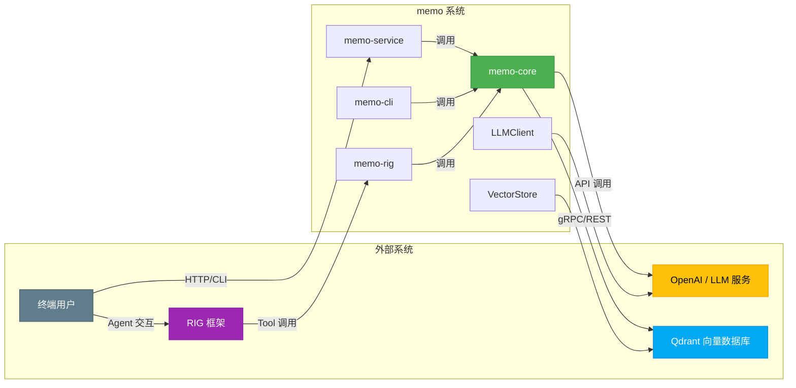
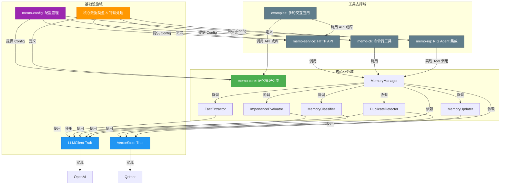
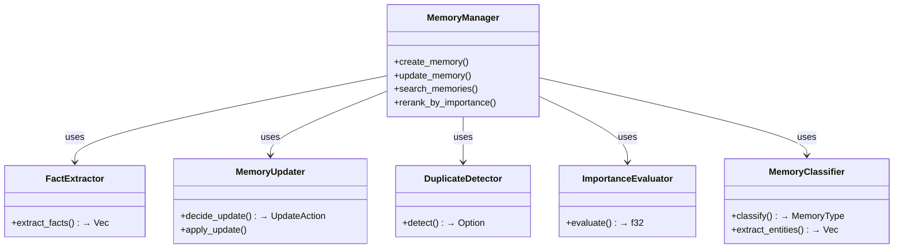
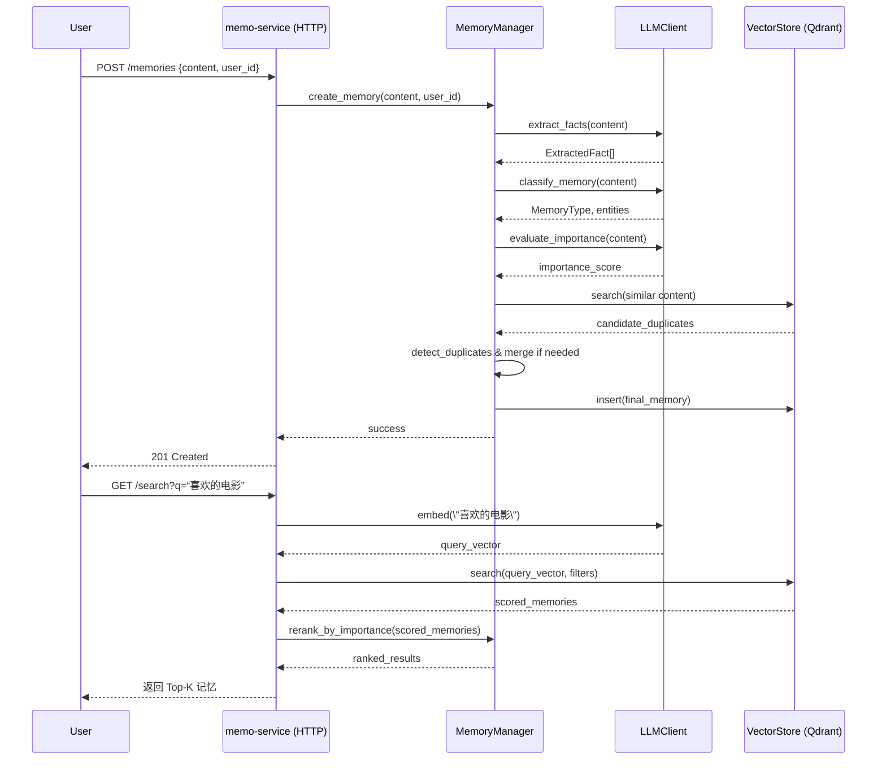
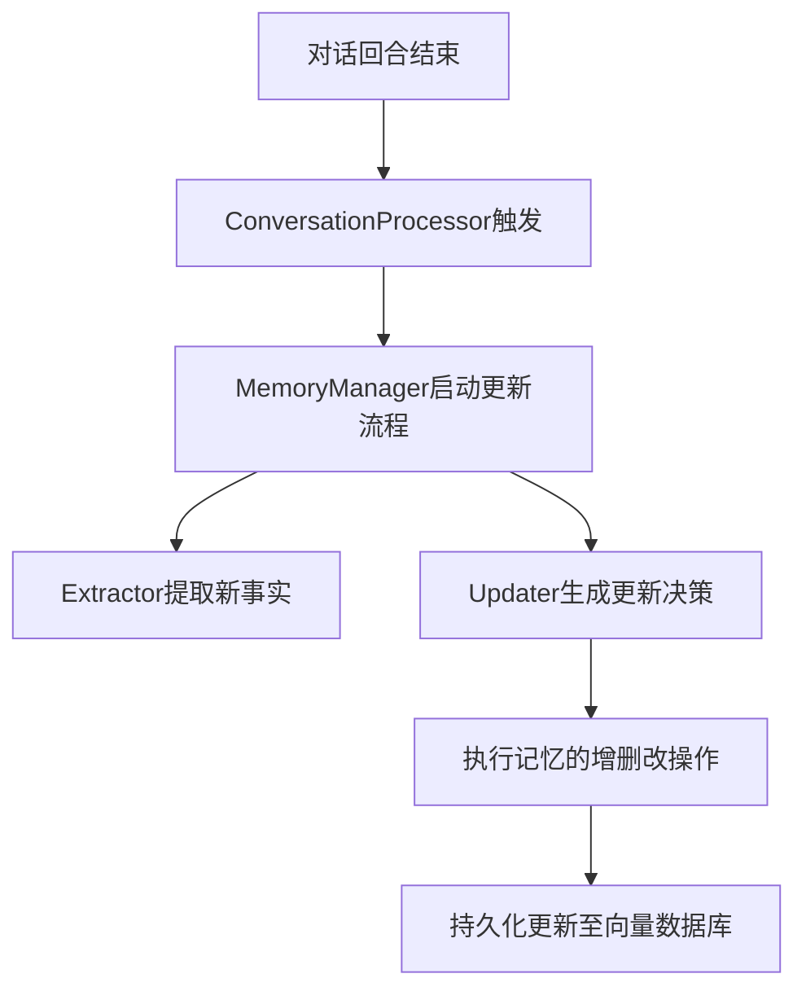
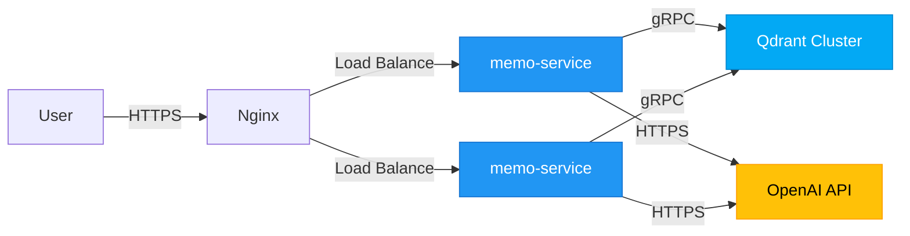

# 系统架构文档

**项目名称**：memo  
**文档生成时间**：2025-11-30 13:21:31 (UTC)  
**时间戳**：1764508891  
**版本**：1.0  
**作者**：系统架构分析团队  

---

## 1. 架构概览 (Architecture Overview)

### 1.1 架构设计理念

`memo` 是一个为 AI 代理提供**长期记忆能力**的后端服务系统，其核心设计理念是：**以结构化、智能化的方式管理对话记忆，增强 AI 对话的连贯性、个性化与上下文感知能力**。

系统通过融合大语言模型（LLM）与向量数据库技术，构建了一个“**语义级记忆引擎**”，实现了从原始对话内容到结构化、可检索、可演进的记忆知识库的完整闭环。架构设计遵循以下核心原则：

- **领域驱动设计（DDD）**：以 `memo-core` 为核心业务领域，围绕“记忆”这一核心概念进行建模与分层。
- **高内聚低耦合**：各模块职责清晰，通过 trait 接口解耦，支持插件式扩展。
- **可配置性与可移植性**：所有关键参数（如 LLM 模型、向量维度、相似度阈值）均通过配置文件控制。
- **可观测性与健壮性**：集成结构化日志（`tracing`），支持优雅降级与错误传播。

### 1.2 核心架构模式

系统采用 **分层架构 + 领域驱动设计（DDD）** 的复合架构模式，具体表现为：

| 架构模式 | 体现方式 |
|--------|--------|
| **分层架构** | 分为：工具支撑层（API/CLI）、核心业务层（`memo-core`）、基础设施层（LLM/VectorStore） |
| **领域驱动设计** | 以“记忆”为核心领域，划分出记忆管理、分类、提取、评估等子域 |
| **门面模式（Facade）** | `MemoryManager` 作为统一入口，封装复杂内部逻辑 |
| **适配器模式** | `LLMClient` 和 `VectorStore` 通过 trait 抽象，支持多实现 |
| **策略模式** | 记忆重要性评估、去重策略等支持多种算法组合 |

### 1.3 技术栈概述

| 类别 | 技术选型 | 说明 |
|------|--------|------|
| **编程语言** | Rust | 高性能、内存安全、异步支持强，适合构建可靠后端服务 |
| **Web 框架** | Axum | 基于 Tokio 的异步 Web 框架，轻量高效 |
| **CLI 框架** | Clap | 命令行参数解析，支持子命令与自动帮助生成 |
| **异步运行时** | Tokio | 提供异步 I/O 支持，提升并发处理能力 |
| **LLM 集成** | OpenAI API（via `rig`） | 支持文本生成、嵌入向量、结构化输出 |
| **向量数据库** | Qdrant | 支持高维向量相似性搜索与元数据过滤 |
| **配置格式** | TOML | 人类可读，支持嵌套结构与默认值 |
| **日志系统** | `tracing` | 结构化日志，支持分布式追踪 |
| **错误处理** | `thiserror` + `anyhow` | 统一错误类型，支持上下文追溯 |

---

## 2. 系统上下文 (System Context)

### 2.1 系统定位与价值

`memo` 是一个**AI 增强型记忆中间件**，其核心价值在于：

- 为 AI 代理提供**持久化、结构化、可检索的长期记忆能力**，突破传统对话系统“无状态”的局限。
- 通过 LLM 实现记忆的**智能提取、分类、去重与重要性评估**，提升记忆质量。
- 支持多模态接入（API、CLI、Agent 工具），可灵活集成至各类智能对话系统中。

> ✅ **业务价值**：提升 AI 对话的个性化、连贯性与上下文理解能力，增强用户体验。

### 2.2 用户角色与场景

| 角色 | 描述 | 使用场景 |
|------|------|--------|
| **AI 开发者** | 构建 AI 代理的工程师 | 集成 `memo` 提供记忆能力，调用 API 或 CLI 管理记忆 |
| **终端用户** | 与 AI 代理交互的用户 | 与具备记忆能力的 AI 对话，获得个性化服务（如记住偏好、历史决策） |
| **智能 Agent** | 自主运行的 AI 实体 | 通过 RIG 框架调用 `memo` 工具，实现“学习”与“回忆”能力 |

### 2.3 外部系统交互



### 2.4 系统边界定义

| 包含功能 | 排除功能 |
|--------|--------|
| 记忆的 CRUD 操作 | 前端用户界面（UI） |
| 基于 LLM 的记忆提取与更新 | AI 代理的具体业务逻辑 |
| 记忆重要性评估与分类 | 身份认证与权限管理（如 JWT） |
| 记忆去重与合并 | 数据加密与合规审计（如 GDPR） |
| 向量相似性检索 | 用户行为分析与统计报表 |

> ✅ **边界说明**：`memo` 聚焦于“记忆管理”这一垂直能力，不承担通用安全、权限、UI 等职责，保持职责单一。

---

## 3. 容器视图 (Container View)

### 3.1 领域模块划分

系统划分为 **5 个核心领域模块**，按职责分层组织：

| 模块 | 类型 | 职责 |
|------|------|------|
| **记忆管理域** | 核心业务域 | 记忆的全生命周期管理，协调智能处理流程 |
| **LLM 交互域** | 基础设施域 | 封装与大语言模型的通信，提供文本生成与嵌入能力 |
| **向量存储域** | 基础设施域 | 实现记忆数据的持久化与语义检索 |
| **配置管理域** | 基础设施域 | 加载与管理全局配置，支持系统参数化 |
| **服务接口域** | 工具支撑域 | 提供 HTTP API、CLI、Agent 集成等外部接入方式 |

### 3.2 领域模块架构



### 3.3 存储设计

- **主存储**：Qdrant 向量数据库
  - 存储 `Memory` 对象的嵌入向量（embedding）
  - 支持按 `user_id`, `agent_id`, `type`, `timestamp` 等元数据过滤
  - 支持高维向量（默认 1536 维）的相似性搜索（余弦相似度）
- **数据结构**：
  ```rust
  struct Memory {
      id: Uuid,
      content: String,
      embedding: Vec<f32>,
      metadata: MemoryMetadata,
      importance: f32,
      created_at: DateTime<Utc>,
      updated_at: DateTime<Utc>,
  }
  ```
- **索引策略**：在 Qdrant 中为 `embedding` 字段建立 HNSW 索引，提升检索性能。

### 3.4 领域模块间通信

| 通信方向 | 通信方式 | 数据格式 |
|--------|--------|--------|
| 服务接口 → 记忆管理域 | 函数调用（Rust API） | `CreateMemoryRequest`, `SearchRequest` |
| 记忆管理域 → LLM 交互域 | 异步 trait 调用 | JSON Schema 控制的结构化输出 |
| 记忆管理域 → 向量存储域 | 异步 trait 调用 | `Memory` + `embedding` |
| 配置管理域 → 所有模块 | 配置注入 | `Config` 结构体（TOML 解析） |

> ✅ **通信原则**：所有跨域调用通过 trait 接口抽象，支持 Mock 与替换。

---

## 4. 组件视图 (Component View)

### 4.1 核心功能组件

| 组件 | 职责 | 关键技术 |
|------|------|--------|
| **MemoryManager** | 核心协调者，提供统一 API，调度提取、分类、去重等流程 | 门面模式、策略组合、加权搜索 |
| **FactExtractor** | 从对话中提取结构化事实（偏好、能力、程序性知识） | LLM 提示工程、JSON Schema 输出控制 |
| **MemoryUpdater** | 决策记忆的增删改，支持 UUID 映射与操作流水线 | 变更检测、LLM 辅助决策 |
| **DuplicateDetector** | 检测语义重复记忆，支持向量相似度 + LLM 判断 | 余弦相似度 + LLM 语义判断 |
| **ImportanceEvaluator** | 评估记忆重要性，支持规则 + LLM 混合评分 | 衰减机制、默认值降级 |
| **MemoryClassifier** | 对记忆分类（个人/偏好/事实），提取实体与主题 | 多标签分类、批量处理 |

### 4.2 技术支撑组件

| 组件 | 职责 | 关键技术 |
|------|------|--------|
| **LLMClient** | 统一 LLM 接口，支持 `complete()` 和 `embed()` | 异步 trait、OpenAI 适配器 |
| **VectorStore** | 统一向量存储接口，支持 `insert`, `search` | 异步 trait、Qdrant 实现 |
| **Config** | 全局配置结构，支持 TOML 加载与默认值 | `serde` 序列化、`config` crate |
| **MemoryError** | 统一错误类型，支持自动转换 | `thiserror`、`Result<T, MemoryError>` |

### 4.3 组件职责划分



### 4.4 组件交互关系

- **同步调用**：服务接口 → `MemoryManager` → 子组件（同步协调）
- **异步调用**：`MemoryManager` → `LLMClient` / `VectorStore`（异步 trait）
- **数据流**：`content` → `embedding` → `search` → `scored results` → `rerank` → `output`

---

## 5. 关键流程 (Key Processes)

### 5.1 核心功能流程：记忆创建与检索



### 5.2 技术处理流程：被动式记忆更新



### 5.3 数据流转路径

1. **输入**：原始对话文本（`String`）
2. **处理**：
   - LLM 生成嵌入向量（`Vec<f32>`）
   - 提取结构化事实（`ExtractedFact`）
   - 分类与评分（`MemoryType`, `importance`）
3. **存储**：`Memory` 对象写入 Qdrant
4. **检索**：查询向量 → 相似记忆 → 重排序 → 返回

### 5.4 异常处理机制

- **统一错误类型**：`Result<T, MemoryError>`，支持上下文追溯
- **优雅降级**：
  - LLM 调用失败 → 使用默认重要性评分
  - 向量数据库不可用 → 返回缓存或错误提示
- **日志记录**：使用 `tracing` 记录关键步骤与错误

---

## 6. 技术实现 (Technical Implementation)

### 6.1 核心模块实现

- **MemoryManager**：作为门面，协调子模块，支持策略组合（如是否启用去重）
- **FactExtractor**：使用 LLM 提示词模板 + JSON Schema 强制输出结构化数据
- **DuplicateDetector**：先向量相似度粗筛，再 LLM 判断是否语义重复
- **ImportanceEvaluator**：混合评分 = `0.7 * LLM_score + 0.3 * rule_score`

### 6.2 关键算法设计

- **加权搜索排序**：
  ```
  final_score = similarity_score × (1 + importance_score)
  ```
- **自动维度检测**：首次启动时调用 LLM 生成测试文本，获取嵌入向量维度
- **去重合并策略**：保留时间较新、重要性较高的记忆，合并内容

### 6.3 数据结构设计

```rust
#[derive(Serialize, Deserialize)]
pub struct Memory {
    pub id: Uuid,
    pub content: String,
    pub embedding: Vec<f32>,
    pub metadata: MemoryMetadata,
    pub importance: f32,
    pub created_at: DateTime<Utc>,
    pub updated_at: DateTime<Utc>,
}

#[derive(Serialize, Deserialize)]
pub struct MemoryMetadata {
    pub user_id: String,
    pub agent_id: String,
    pub memory_type: MemoryType,
    pub entities: Vec<String>,
}
```

### 6.4 性能优化策略

| 优化方向 | 策略 |
|--------|------|
| **减少 LLM 调用** | 缓存嵌入向量（未来可引入 Redis） |
| **批量处理** | 支持批量插入与分类 |
| **异步执行** | 所有 I/O 操作异步化（Tokio） |
| **索引优化** | Qdrant 使用 HNSW 索引加速向量搜索 |

---

## 7. 部署架构 (Deployment Architecture)

### 7.1 运行环境要求

| 组件 | 要求 |
|------|------|
| **memo-service** | Rust 1.70+, Tokio, 2GB RAM, 1 CPU |
| **Qdrant** | Docker, 4GB RAM, SSD 存储 |
| **OpenAI API** | 网络可达，API Key 配置 |
| **网络** | `memo-service` 需访问 Qdrant（6334）和 OpenAI（HTTPS） |

### 7.2 部署拓扑结构



### 7.3 扩展性设计

- **水平扩展**：`memo-service` 可部署多个实例，通过负载均衡分发请求
- **插件化**：支持新增 LLM（如 Anthropic）或向量数据库（如 Weaviate）
- **配置驱动**：所有行为通过 `config.toml` 控制，无需代码变更

### 7.4 监控与运维

| 指标 | 监控方式 |
|------|--------|
| **API 延迟** | Prometheus + Grafana |
| **LLM 调用次数** | 日志分析 + 计费监控 |
| **向量搜索性能** | Qdrant 内置指标 |
| **错误率** | Sentry / 日志告警 |
| **系统健康** | `/health` 端点，Kubernetes Liveness Probe |

> ✅ **建议**：集成 OpenTelemetry 实现分布式追踪，提升可观测性。

---

**文档结束**  
`memo` 项目架构清晰、职责分明、扩展性强，已具备作为 AI 记忆基础设施的核心能力。后续建议聚焦于**安全性增强**（如 JWT 认证）、**性能优化**（缓存层）与**多租户支持**，推动其成为通用记忆中间件。