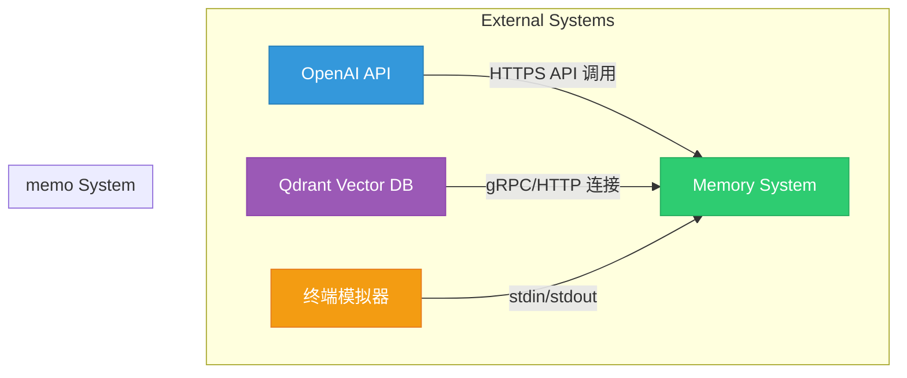
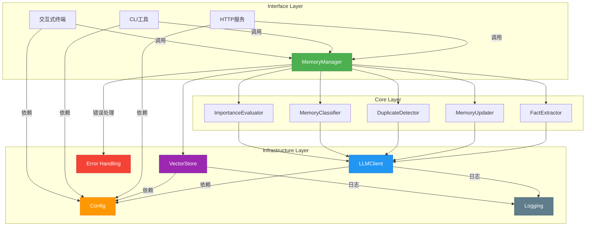
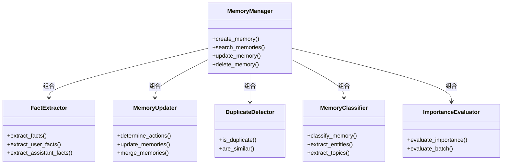
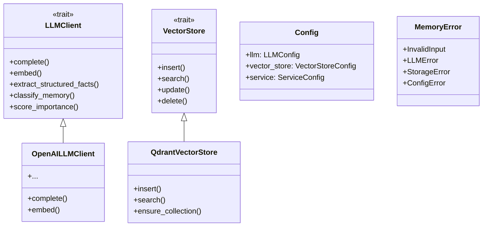
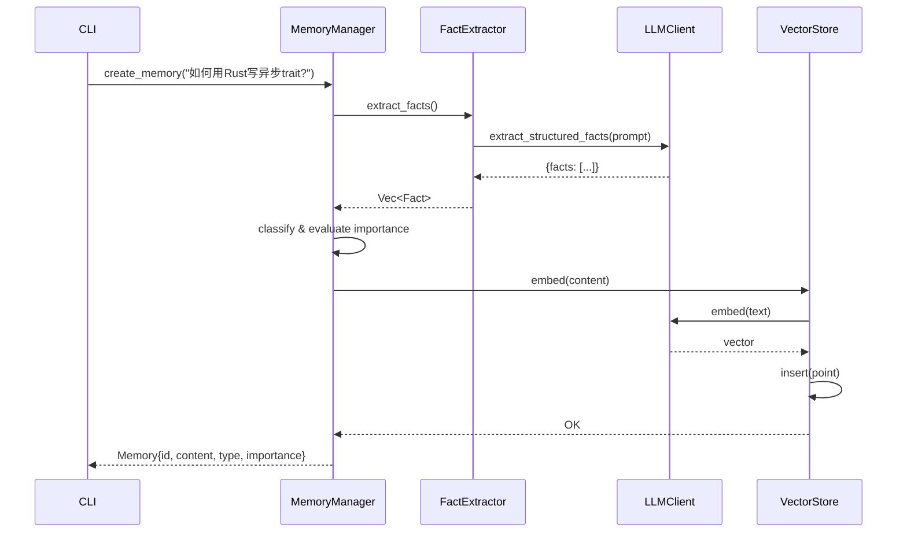
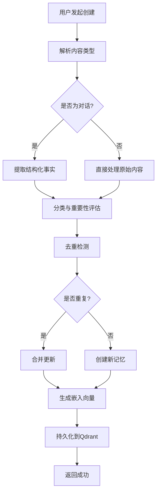
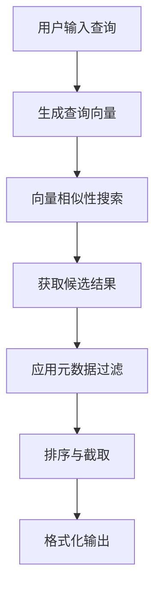
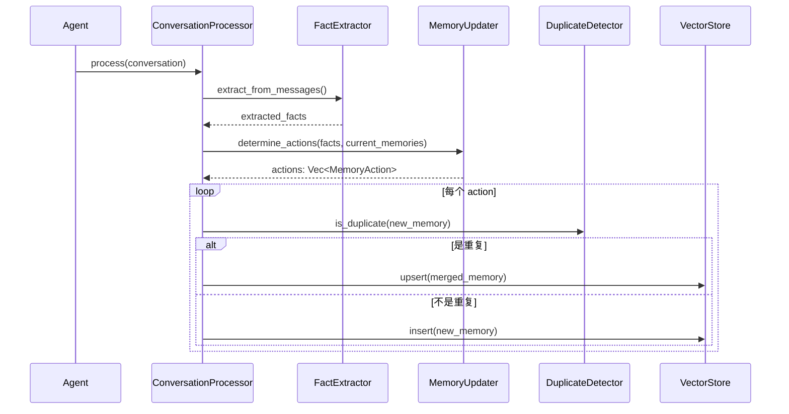
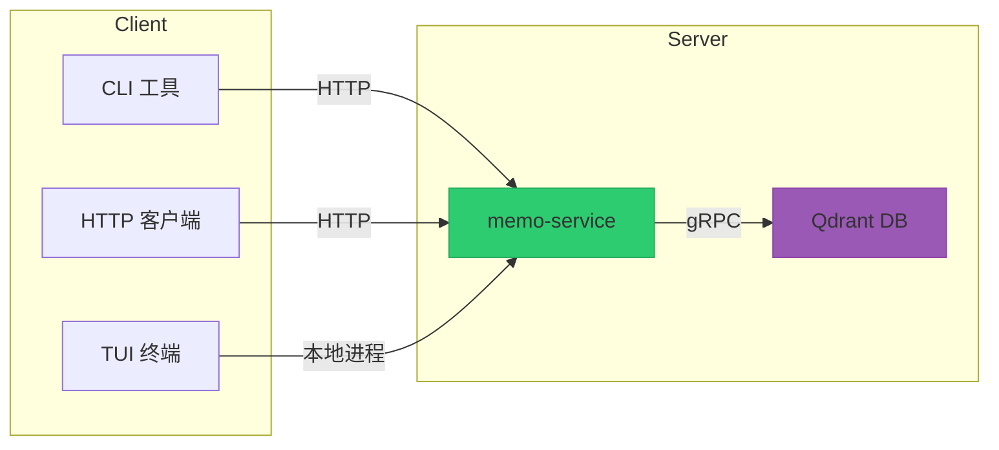

# 系统架构文档

**生成时间**：2025-12-03 06:26:03 (UTC)  
**时间戳**：1764743163  
**项目名称**：memo  
**项目类型**：全栈智能记忆管理系统（FullStackApp）  
**调研完成度**：95%  
**文档版本**：1.0

---

## 1. 架构概览 (Architecture Overview)

### 1.1 架构设计理念

`memo` 系统的设计核心是 **“AI 驱动的知识资产管理”**，旨在通过大语言模型（LLM）与向量数据库的深度融合，实现非结构化信息的智能结构化、语义化存储与高效检索。系统以 **领域驱动设计（DDD）** 为指导思想，采用 **分层架构** 与 **模块化组件设计**，确保高内聚、低耦合，支持灵活扩展与多端统一。

其核心设计理念包括：

- **智能优先**：LLM 不仅用于生成，更深度参与记忆的提取、分类、去重与更新决策。
- **多模态访问**：支持 CLI、HTTP API 和交互式终端三种访问方式，满足不同用户场景。
- **可插拔架构**：通过 Trait 抽象实现 LLM 客户端、向量存储等关键组件的可替换性。
- **运行时一致性**：所有访问入口共享同一套核心业务逻辑（`memo-core`），保证行为一致性。

### 1.2 核心架构模式

| 模式 | 说明 |
|------|------|
| **分层架构（Layered Architecture）** | 明确划分为接口层、核心业务层、基础设施层，实现关注点分离。 |
| **领域驱动设计（DDD）** | 识别核心业务域（记忆管理、LLM集成），围绕业务能力组织代码结构。 |
| **依赖倒置原则（DIP）** | 高层模块（如 `MemoryManager`）依赖抽象（`LLMClient`、`VectorStore`），而非具体实现。 |
| **Trait-based 多态** | 使用 `async_trait` 实现运行时多态，支持组件替换与测试模拟。 |
| **混合处理策略（Hybrid Processing）** | 结合 LLM 智能推理与规则引擎，平衡准确性与性能。 |

### 1.3 技术栈概述

| 类别 | 技术选型 | 说明 |
|------|--------|------|
| **编程语言** | Rust | 高性能、内存安全、异步支持，适合构建可靠系统服务 |
| **Web 框架** | Axum | 轻量级、模块化，基于 Tokio 异步运行时 |
| **CLI 框架** | Clap | 命令行参数解析，支持子命令与自动帮助生成 |
| **LLM 集成** | Rig | 提供结构化提取、提示工程支持，降低 LLM 幻觉影响 |
| **向量数据库** | Qdrant | 高性能向量搜索引擎，支持元数据过滤与语义搜索 |
| **日志系统** | Tracing | 结构化日志，支持动态级别控制与上下文追踪 |
| **配置管理** | Serde + TOML | 强类型配置，支持默认值与嵌套结构 |
| **错误处理** | Custom Error Enum + `thiserror` | 统一错误类型，支持自动转换与上下文携带 |

---

## 2. 系统上下文 (System Context)

### 2.1 系统定位与价值

`memo` 是一个 **AI 增强型知识记忆系统**，定位为开发者、AI 研究者和知识工作者的“第二大脑”。其核心价值在于：

- **智能提取**：从对话、笔记等非结构化内容中自动提取结构化事实。
- **语义记忆**：基于向量嵌入实现“按意思搜索”，而非关键词匹配。
- **自动进化**：在多轮交互中自动更新记忆库，实现被动学习。
- **多端统一**：通过 CLI、API、TUI 提供一致的使用体验。

### 2.2 用户角色与场景

| 用户角色 | 使用场景 | 核心需求 |
|--------|--------|--------|
| **开发者与技术用户** | 记录技术笔记、调试日志、API 使用经验 | 快速 CLI 操作、与脚本集成、支持代码块存储 |
| **AI 研究者与工程师** | 构建具备长期记忆的智能体（Agent） | 支持多轮对话记忆更新、可编程记忆处理管道 |
| **知识工作者** | 管理个人知识库、会议纪要、学习笔记 | 智能分类、重要性评估、语义搜索 |

### 2.3 外部系统交互



- **OpenAI API**：提供文本生成、嵌入向量、结构化提取等 AI 能力。
- **Qdrant Vector Database**：持久化存储记忆的向量表示，支持高效语义搜索。
- **终端模拟器**：为 CLI 和 TUI 提供标准输入输出环境。

### 2.4 系统边界定义

| 包含组件 | 排除组件 | 说明 |
|--------|--------|------|
| 记忆 CRUD 操作 | 前端 Web 界面 | 无图形化 UI，仅提供 API 与 CLI |
| LLM 驱动的记忆提取与更新 | 移动端应用 | 无原生 iOS/Android 客户端 |
| 向量数据库集成与语义搜索 | 用户认证与权限管理 | 无多用户支持，单机运行 |
| 多模态访问接口（CLI/HTTP/TUI） | 数据备份与恢复机制 | 无自动备份策略 |
| 记忆去重与重要性评估 | 跨平台同步服务 | 无设备间同步能力 |

---

## 3. 容器视图 (Container View)

### 3.1 领域模块划分

系统划分为 **6 个核心领域模块**，按职责分属不同架构层级：

| 模块名称 | 类型 | 职责 | 重要性 |
|--------|------|------|--------|
| **记忆管理域** | 核心业务域 | 记忆全生命周期管理 | ⭐⭐⭐⭐⭐ |
| **LLM 集成域** | 核心业务域 | 封装 LLM 交互逻辑 | ⭐⭐⭐⭐⭐ |
| **向量存储域** | 基础设施域 | 向量数据库操作封装 | ⭐⭐⭐⭐☆ |
| **接口访问域** | 工具支撑域 | 提供多端访问入口 | ⭐⭐⭐⭐☆ |
| **配置管理域** | 基础设施域 | 系统配置加载与管理 | ⭐⭐⭐☆☆ |
| **辅助工具域** | 基础设施域 | 日志、错误、工具函数 | ⭐⭐⭐☆☆ |

### 3.2 领域模块架构



### 3.3 存储设计

- **主存储**：Qdrant 向量数据库
  - **集合结构**：`memories`
  - **字段**：
    - `id: String`（主键）
    - `content: String`（原始内容）
    - `embedding: Vec<f32>`（向量嵌入）
    - `metadata: Map<String, Value>`（类型、重要性、来源等）
    - `created_at: Timestamp`
    - `updated_at: Timestamp`
  - **索引**：对 `embedding` 建立 HNSW 索引，支持快速相似性搜索。
  - **过滤**：支持基于 `metadata` 的复合查询（如 `type = "code"` 且 `importance > 0.7`）。

- **配置存储**：本地 `config.toml` 文件
  - 支持环境变量覆盖，便于容器化部署。

### 3.4 领域模块间通信

| 通信路径 | 通信方式 | 数据格式 |
|--------|--------|--------|
| 接口访问域 → 记忆管理域 | 函数调用（Rust） | `Memory`, `SearchQuery` 等结构体 |
| 记忆管理域 → LLM 集成域 | Trait 接口调用 | JSON 提示词 → JSON 响应 |
| 记忆管理域 → 向量存储域 | Trait 接口调用 | `Memory` → `Point` |
| 各模块 → 配置管理域 | 依赖注入 | `Config` 结构体 |
| 各模块 → 辅助工具域 | 宏/函数调用 | `tracing::info!`, `Result<T, MemoryError>` |

---

## 4. 组件视图 (Component View)

### 4.1 核心功能组件



### 4.2 技术支撑组件



### 4.3 组件职责划分

| 组件 | 职责 |
|------|------|
| `MemoryManager` | 核心协调者，对外提供统一接口，内部调度各子组件 |
| `FactExtractor` | 从对话中提取结构化事实，区分用户与助手信息 |
| `MemoryUpdater` | 决策是否创建/更新/删除记忆，处理 LLM 幻觉 ID |
| `DuplicateDetector` | 基于语义相似性与元数据判断重复，支持合并 |
| `MemoryClassifier` | 对记忆进行分类（如“代码”、“会议”、“学习”） |
| `ImportanceEvaluator` | 评估记忆重要性（0.0~1.0），支持批量评估 |
| `LLMClient` | 抽象 LLM 交互，支持多种操作（生成、嵌入、提取） |
| `VectorStore` | 抽象向量数据库操作，屏蔽底层细节 |

### 4.4 组件交互关系



---

## 5. 关键流程 (Key Processes)

### 5.1 核心功能流程

#### 记忆创建流程



#### 语义搜索流程



### 5.2 技术处理流程

#### 被动学习更新流程（Agent 场景）



### 5.3 数据流转路径

1. **输入**：用户输入（文本、对话） → 接口层（HTTP/CLI/TUI） → `MemoryManager`
2. **处理**：`MemoryManager` → `FactExtractor` → `LLMClient` → OpenAI → 返回结构化数据
3. **存储**：`Memory` → `VectorStore` → `embed()` → `Qdrant` → 持久化
4. **检索**：查询文本 → `embed()` → `search()` → 过滤 → 返回 `ScoredMemory`

### 5.4 异常处理机制

- **统一错误类型**：`MemoryError` 枚举涵盖所有可能错误。
- **自动转换**：通过 `thiserror` 实现 `std::io::Error`、`reqwest::Error` 等自动转换。
- **日志追踪**：使用 `tracing::error!` 记录错误上下文，支持链式错误。
- **降级策略**：
  - LLM 调用失败 → 使用规则引擎进行简单分类/提取。
  - 向量生成失败 → 使用本地缓存或跳过嵌入。

---

## 6. 技术实现 (Technical Implementation)

### 6.1 核心模块实现

- **`FactExtractor`**：使用 Rig 框架定义结构化提取 Schema，通过 `extract_structured_facts` 调用 LLM，返回 JSON 并反序列化为 `Vec<ExtractedFact>`。
- **`DuplicateDetector`**：结合语义相似性（余弦相似度）与元数据（类型、来源）综合判断，阈值可配置。
- **`QdrantVectorStore`**：支持 `new_with_llm_client` 自动探测嵌入维度，降低配置复杂度。

### 6.2 关键算法设计

- **记忆合并算法**：
  - 若两记忆语义相似且类型相同，合并内容，保留更高重要性。
  - 更新 `updated_at`，保留原始 `created_at`。
- **重要性评估**：
  - 混合模式：先用规则快速判断（如包含“紧急”、“重要”关键词），再用 LLM 精确打分。
- **分类策略**：
  - 支持预定义规则（正则匹配）与 LLM 语义理解两种模式，可配置优先级。

### 6.3 数据结构设计

```rust
#[derive(Serialize, Deserialize)]
pub struct Memory {
    pub id: String,
    pub content: String,
    pub r#type: MemoryType,
    pub importance: f32,
    pub metadata: HashMap<String, Value>,
    pub created_at: DateTime<Utc>,
    pub updated_at: DateTime<Utc>,
}

#[derive(Serialize, Deserialize)]
pub struct ExtractedFact {
    pub speaker: Speaker, // User | Assistant
    pub content: String,
    pub category: FactCategory,
}
```

### 6.4 性能优化策略

- **向量缓存**：对高频查询或记忆内容的嵌入向量进行本地缓存（如 `lru-cache`）。
- **批量处理**：支持批量创建、批量评估，减少 LLM 调用次数。
- **异步执行**：所有 I/O 操作（LLM、DB）均异步，避免阻塞主线程。
- **连接池**：Qdrant 客户端使用连接池，提升并发性能。

---

## 7. 部署架构 (Deployment Architecture)

### 7.1 运行环境要求

- **操作系统**：Linux/macOS/Windows
- **Rust 版本**：1.70+
- **依赖服务**：
  - Qdrant（本地或远程）
  - OpenAI API（需网络访问）
- **资源建议**：
  - CPU：2 核以上
  - 内存：4GB 以上（取决于记忆库规模）
  - 存储：SSD，空间根据 Qdrant 数据量配置

### 7.2 部署拓扑结构



### 7.3 扩展性设计

- **水平扩展**：`memo-service` 可部署多个实例，共享同一 Qdrant 集群。
- **插件化**：通过 Trait 支持：
  - 多 LLM 提供商（Anthropic、本地模型）
  - 多向量数据库（Pinecone、Weaviate）
  - 自定义记忆处理器（插件机制）
- **事件总线**（未来）：引入消息队列（如 Redis Pub/Sub）解耦记忆变更通知。

### 7.4 监控与运维

- **日志**：`tracing` 输出结构化日志，支持接入 ELK/Grafana。
- **指标**（建议）：
  - LLM 调用延迟、成功率
  - 向量搜索响应时间
  - 记忆创建/搜索 QPS
  - 可通过 Prometheus 暴露。
- **健康检查**：`/health` 接口检查 LLM 与 DB 连接状态。
- **配置热重载**（未来）：支持运行时动态调整配置。

---

## 附录：架构洞察与建议

### ✅ 架构优势
- **清晰的分层与模块化**：易于理解、维护与扩展。
- **AI 深度集成**：LLM 不仅是工具，更是决策引擎。
- **多端统一核心**：避免逻辑重复，保证一致性。

### ⚠️ 改进建议
1. **引入缓存层**：对 LLM 嵌入与结构化提取结果进行缓存。
2. **增强安全性**：敏感配置（如 API Key）支持加密存储。
3. **自动化文档**：为 HTTP API 生成 OpenAPI 规范。
4. **增加监控指标**：暴露 Prometheus 指标，便于性能分析。
5. **事件驱动架构**：解耦记忆变更，支持插件扩展。

### 🚀 未来演进
- 支持本地 LLM（如 Llama 3）以提升隐私性。
- 开发图形化前端（Web UI）。
- 实现跨设备同步机制。
- 构建记忆分析仪表盘（使用频率、主题分布）。

--- 

**文档结束**