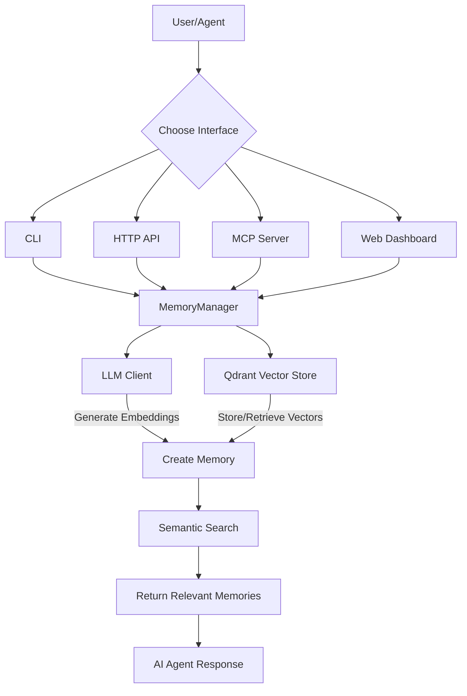
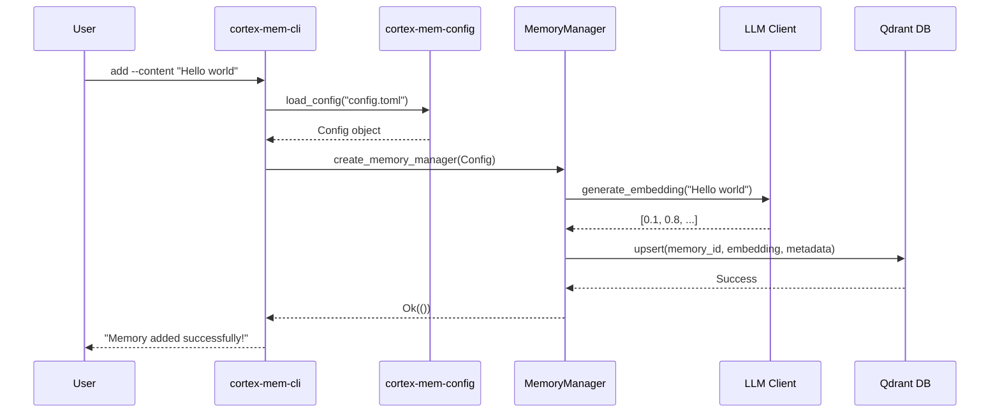
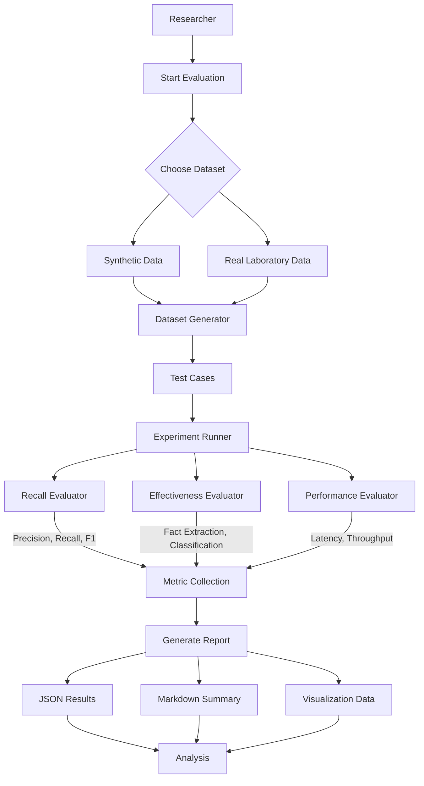

# Core Workflows

## 1. Workflow Overview

The **cortex-mem** system is a sophisticated, modular platform designed to provide persistent, context-aware memory capabilities for AI agents. Its core workflows revolve around the lifecycle management of "memories"—structured data points containing content, metadata, and semantic embeddings that enable intelligent retrieval and optimization.

### System Main Workflows
The system orchestrates four primary workflows:
1.  **Memory Management Process**: The fundamental CRUD (Create, Read, Update, Delete) and search operations for memories.
2.  **Memory Optimization Process**: A quality assurance workflow for deduplicating, filtering irrelevant, and enhancing the overall quality of stored memories.
3.  **System Monitoring Process**: A visibility and observability workflow for tracking the health and performance of the entire system and its dependencies.
4.  **Evaluation Framework Process**: A comprehensive testing and benchmarking workflow for quantitatively assessing the system's recall, effectiveness, and performance.

### Core Execution Paths
All user interactions converge on the `MemoryManager` component in the **Memory Core Domain**. This central orchestrator receives requests from various entry points, processes them using configurations from the **Configuration Management Domain**, leverages the **AI Processing Domain** (LLM Client) to generate semantic understanding, and persists data via the **Storage Integration Domain** (Qdrant Vector Store). The execution path is inherently asynchronous, built on Rust's `tokio` runtime, ensuring non-blocking I/O operations for high throughput.

*Figure 1: High-Level Memory Management Flow*

### Key Process Nodes
-   **Entry Points**: CLI (`cortex-mem-cli`), HTTP Service (`cortex-mem-service`), MCP Server (`cortex-mem-mcp`), and Web Dashboard (`cortex-mem-insights`) act as gateways.
-   **Orchestrator**: The `MemoryManager` is the central nervous system, coordinating all operations.
-   **Intelligence Engine**: The `LLM Client` generates embeddings and performs content analysis, providing the "intelligence" for semantic search and optimization.
-   **Persistence Layer**: The `Qdrant Vector Store Adapter` handles all data storage and retrieval, enabling fast, similarity-based queries.
-   **Evaluator**: The `Experiment Runner` coordinates the assessment of the system's own capabilities.

### Process Coordination Mechanisms
The system employs a clean separation of concerns with well-defined interfaces between domains:
-   **Service Call**: User Interfaces primarily interact with the Service Layer (e.g., HTTP API calls).
-   **Direct Usage**: Some example applications (like `cortex-mem-tars`) directly use the `MemoryManager`, bypassing intermediate services for tighter integration.
-   **Composition**: The `MemoryManager` internally composes the `VectorStore` and `LLMClient` components, treating them as essential parts of its implementation.
-   **Configuration Dependency**: All major components depend on the `Config` module for initialization parameters like connection strings and API keys.

This layered architecture ensures flexibility, allowing different frontends to coexist while sharing the same robust backend logic.

---

## 2. Main Workflows

### 2.1 Memory Management Process
This is the foundational workflow for creating, retrieving, updating, and deleting memories.

#### Detailed Process Description
1.  **Initiation**: A user or agent initiates an operation (e.g., `add`, `search`) through a chosen interface (CLI, API, etc.).
2.  **Command Parsing & Configuration Loading**: The entry point application (e.g., `cortex-mem-cli/src/main.rs`) parses command-line arguments and loads the system configuration from a TOML file using `cortex-mem-config`.
3.  **MemoryManager Initialization**: The `create_memory_manager` function uses the loaded config to initialize a `MemoryManager` instance. This involves creating an `LLMClient` and a `QdrantVectorStore` based on the configuration.
4.  **Operation Dispatch**: The parsed command is dispatched to the appropriate handler (e.g., `AddCommand::execute`). This handler uses the `MemoryManager` to perform the requested operation.
5.  **Core Operation Execution**:
    *   For **Adding**: The `MemoryManager` sends the memory content to the `LLMClient` to generate an embedding. It then instructs the `QdrantVectorStore` to upsert the memory record (content, metadata, embedding).
    *   For **Searching**: The `MemoryManager` can handle two types of searches. For a semantic query, it first generates an embedding for the query text via the `LLMClient`, then performs a vector similarity search in Qdrant. For a metadata filter, it directly queries Qdrant for matching metadata fields.
6.  **Result Handling**: The results from the `MemoryManager` are formatted and presented back to the user via the original interface (e.g., printed to the console for CLI, returned as JSON for HTTP).

#### Process Dependencies and Data Flow

*Figure 2: Sequence Diagram for Adding a Memory*

The key dependency chain is `Interface -> Config -> MemoryManager -> (LLMClient + VectorStore)`.

### 2.2 Memory Optimization Process
This workflow proactively improves the quality and efficiency of the memory store.

#### Detailed Process Description
1.  **Initiation**: A user triggers optimization via the CLI (`optimize` command) or the web dashboard's optimization panel.
2.  **Strategy Selection**: The user selects an optimization strategy (e.g., full, deduplication, quality) and optional parameters (preview mode, filters).
3.  **Analysis Phase**: The `OptimizationAnalyzer` within the `MemoryManager` retrieves a set of candidate memories based on the provided filters.
4.  **AI-Powered Assessment**: The analyzer uses the `LLMClient` to compare the content of these memories. For deduplication, it calculates semantic similarity scores. For quality assessment, it may evaluate importance or relevance.
5.  **Plan Generation**: Based on the LLM's analysis, the `OptimizationEngine` generates a plan identifying which memories should be merged, updated, or deleted.
6.  **Preview & Confirmation**: If in preview mode, the plan is shown to the user for review. The user must confirm before execution proceeds.
7.  **Execution Phase**: The `Optimizer` component executes the confirmed plan by issuing delete and update commands to the `MemoryManager`, which in turn communicates with the `QdrantVectorStore`.
8.  **Reporting**: Upon completion, a detailed report of the actions taken (e.g., "2 duplicates removed") is generated and displayed.

#### Process Dependencies and Data Flow
The process relies heavily on the AI Processing Domain to make intelligent decisions about data quality, demonstrating a higher-level business logic built upon the core storage and intelligence primitives.

### 2.3 System Monitoring Process
This workflow provides real-time observability into the system's operational health.

#### Detailed Process Description
1.  **Dashboard Access**: A user navigates to the `/monitor` page of the `cortex-mem-insights` web dashboard.
2.  **API Request**: The frontend Svelte app makes HTTP requests to the internal `System API` endpoints (e.g., `/api/system/status`, `/api/system/metrics`).
3.  **Health Check Aggregation**: The `System API` service concurrently checks the status of three critical external systems:
    *   **cortex-mem-service**: By calling its `/health` endpoint.
    *   **Qdrant DB**: By attempting to connect to its admin API.
    *   **LLM Service**: By making a simple request to the configured LLM provider.
4.  **Metric Collection**: The API also collects performance metrics such as CPU usage, memory consumption, and request latency from the local host and the connected services.
5.  **Data Transformation & Fallback**: The collected raw data is transformed into a unified format. If one service is unresponsive, the API uses fallback logic to prevent a single point of failure from breaking the entire dashboard.
6.  **Visualization**: The transformed data is sent back to the frontend, where Svelte stores manage the state and render charts, gauges, and status indicators.

#### Process Dependencies and Data Flow
This workflow highlights the system's resilience design, using redundant checks and graceful degradation to ensure monitoring reliability even under partial failure conditions.

### 2.4 Evaluation Framework Process
This workflow enables systematic, quantitative assessment of the system's capabilities.

#### Detailed Process Description
1.  **Test Initiation**: A researcher runs the `cortex-mem-evaluation` binary with a specific subcommand (e.g., `full`, `recall`).
2.  **Dataset Preparation**: The `DatasetGenerator` creates a synthetic test dataset or the `LabDataIntegration` module loads a real-world dataset. This includes a "memory library" of known facts and a set of "test cases" with expected answers.
3.  **Experiment Orchestration**: The `ExperimentRunner` takes control, loading the prepared dataset and initializing the `MemoryManager` with a fresh, isolated memory store.
4.  **Test Execution**: The runner populates the memory store with the test library, then executes each test case.
    *   A **Recall Evaluator** issues search queries and compares the retrieved memories against the expected results to calculate precision, recall, and F1-score.
    *   An **Effectiveness Evaluator** might ask the system to extract facts or classify memories, grading the accuracy of the output.
    *   A **Performance Evaluator** measures the time taken for operations under various loads.
5.  **Metrics Calculation**: The `Metrics Analyzer` aggregates the results from individual tests into comprehensive metrics.
6.  **Reporting**: The framework generates multiple outputs: a detailed JSON file with raw results, a human-readable Markdown summary report, and data for visualizations.

#### Process Dependencies and Data Flow

*Figure 3: Evaluation Framework Workflow*

This closed-loop process is crucial for continuous improvement, allowing developers to measure the impact of code changes and validate system performance against defined benchmarks.

---

## 3. Flow Coordination and Control

### Multi-module Coordination Mechanisms
The system achieves coordination through a combination of architectural patterns and explicit interfaces:

1.  **Centralized Orchestration (MemoryManager)**: The `MemoryManager` acts as a facade, hiding the complexity of interacting with both the `LLMClient` and `VectorStore`. Other modules only need to know how to call the `MemoryManager`, not the intricacies of vector databases or LLM APIs.
2.  **Event-Driven Communication (TUI Example)**: In interactive applications like `cortex-mem-tars`, a message-passing pattern is used. The UI (`ui.rs`) renders the state, input handlers (`events.rs`) capture keystrokes, and an `App` state manager coordinates updates. Async channels (`mpsc::UnboundedSender`) allow different parts of the system (e.g., the AI agent) to send messages (like new log entries) to the main loop for processing.
3.  **API-Based Integration**: The primary coordination mechanism between the frontend (`cortex-mem-insights`) and backend services is RESTful HTTP APIs. The frontend makes predictable requests to well-defined endpoints, receiving structured JSON responses.

### State Management and Synchronization
State is managed differently depending on the context:
-   **Application State (TUI)**: The `App` struct in `examples/cortex-mem-tars/src/app.rs` holds mutable state (conversation history, logs, current input) in a single location, ensuring consistency. Changes are made through controlled methods.
-   **Frontend State (Web)**: The `cortex-mem-insights` frontend uses Svelte stores (`writable`, `derived`) to manage reactive state. Stores like `memoryStore` and `optimizationStore` hold data fetched from the API, and any component can subscribe to changes, ensuring the UI stays in sync.
-   **Backend State (Services)**: Services like `cortex-mem-service` use `Arc<MemoryManager>` to share immutable references to the `MemoryManager` across multiple async request handlers. This allows concurrent access without data races, as the `MemoryManager` itself manages its internal state and synchronizes access to the underlying database.

### Data Passing and Sharing
-   **Structured Data Transfer**: Data is passed between components using well-defined structs and enums (e.g., `MemoryRecord`, `Filters`, `OptimizationPlan`). These types are often serialized to JSON for transport over HTTP or CLI boundaries.
-   **Shared Configuration**: The `Config` object, once loaded, is passed down the call stack to all components that require it, ensuring consistent settings throughout the application.
-   **External Service Integration**: The web dashboard integrates with the CLI tool programmatically. The `CortexMemCliClient` class in `cortex-mem-insights/src/server/integrations/cortex-mem-cli.ts` spawns child processes to execute CLI commands and parses their output, effectively sharing functionality between the Node.js and Rust codebases.

### Execution Control and Scheduling
-   **Async/Await Runtime**: The entire system is built on Rust's `tokio` async runtime. This allows for efficient scheduling of I/O-bound tasks (network calls, file I/O) without blocking threads. Operations like generating an embedding or querying Qdrant are awaited asynchronously.
-   **Sequential vs. Concurrent**: While user-facing commands are typically executed sequentially for clarity, internal operations can be parallelized. For example, the evaluation framework can run multiple test cases concurrently to speed up benchmarking.
-   **Graceful Shutdown**: Applications like `cortex-mem-tars` implement a sophisticated shutdown process. They exit the TUI immediately for responsiveness but continue running background tasks (like persisting the final conversation) in a separate thread, ensuring no data loss.

---

## 4. Exception Handling and Recovery

### Error Detection and Handling
The system employs a multi-layered approach to error handling:
-   **Structured Logging**: The `tracing` crate is used universally across Rust components. Errors are logged with rich context (level, target, span) using `tracing::error!()`, making debugging straightforward.
-   **Domain-Specific Error Types**: Each module defines its own error enum (e.g., `MemoryToolsError` in `cortex-mem-mcp`). These are then converted to more general errors (using `anyhow`) at the application level for easier propagation.
-   **User-Friendly Feedback**: CLI commands and web APIs do not expose raw technical errors to end-users. Instead, they present clear, actionable messages (e.g., "Memory not found" or "Failed to connect to Qdrant").
-   **Fallback Strategies**: The monitoring system exemplifies proactive error detection. If the primary method to check a service's health fails, it attempts alternative methods (e.g., checking if the port is open) before declaring it down.

### Exception Recovery Mechanisms
-   **Retry Logic**: While not explicitly detailed in the provided code, the use of async/await and the nature of network calls imply that retry mechanisms (potentially with exponential backoff) would be implemented for transient failures when communicating with LLM services or Qdrant.
-   **Safe Defaults**: The `Config` module implements the `Default` trait, providing sensible default values. This allows the system to start even if some configuration options are missing, preventing startup failures due to minor misconfigurations.
-   **Transaction Safety**: Although not a traditional database transaction, the `MemoryManager`'s operations are designed to be atomic where possible. For instance, adding a memory involves a single `upsert` operation to Qdrant, reducing the chance of partial writes.

### Fault Tolerance Strategy Design
-   **Modular Isolation**: The separation of the Evaluation Domain means that running intensive benchmarks does not interfere with the core memory service used by production agents.
-   **Resilient Monitoring**: The monitoring dashboard is designed to remain functional even if one of the services it monitors is down. It degrades gracefully, showing the failed service as offline while still displaying data for the others.
-   **Interactive Confirmation**: Critical destructive operations, like optimization, require explicit user confirmation after a preview. This prevents accidental data loss due to user error.

### Failure Retry and Degradation
-   **API Rate Limiting Gracefulness**: The `optimize` command specifically mentions "API frequency limits" and "elegant degradation." When rate-limited by an LLM provider, the system likely falls back to a simpler, less accurate mode of operation (e.g., using keyword matching instead of deep semantic analysis) rather than failing completely.
-   **Dry-Run Mode**: The optimization process supports a preview/dry-run mode. This allows users to see the potential impact of an operation before committing, acting as a powerful safeguard against unintended consequences.

---

## 5. Key Process Implementation

### 5.1 Core Algorithm Processes
-   **Semantic Search**: The core algorithm involves converting a natural language query into a high-dimensional vector using an LLM's embedding model. This query vector is then compared against all stored memory vectors in Qdrant using a distance metric (like cosine similarity). The top-K most similar vectors are retrieved, and their corresponding memory records are returned to the user.
-   **Deduplication Algorithm**: The `OptimizationAnalyzer` retrieves a batch of candidate memories. The `LLMClient` is used to generate embeddings for each. The system then computes pairwise similarity scores. Memories with a score above a certain threshold are flagged as potential duplicates. A secondary analysis might involve prompting the LLM to summarize or compare the content directly for a more nuanced decision.
-   **Classification & Importance Scoring**: The `Classification System` uses the `LLMClient` to analyze the content of a new memory. It prompts the LLM with instructions like "Classify this text as 'conversational', 'factual', 'personal', or 'procedural'" and "On a scale of 1-5, how important is this information?". The LLM's response is parsed to populate the memory's metadata.

### 5.2 Data Processing Pipelines
A typical pipeline for adding a memory is:
1.  **Input**: Raw text content from the user.
2.  **Preprocessing**: The `AddCommand` parses the input, potentially detecting conversation roles ("User:", "Assistant:").
3.  **Embedding Generation**: The content is sent to the `LLMClient` to generate a fixed-length numerical vector.
4.  **Metadata Enrichment**: The `Classification System` and `Content Extractor` analyze the content to auto-populate fields like `topics`, `keywords`, `memory_type`, and `importance`.
5.  **Persistence**: The fully formed `MemoryRecord` (content, metadata, embedding) is sent to the `QdrantVectorStore` for storage.
6.  **Output**: A success/failure status is returned to the user.

### 5.3 Business Rule Execution
Key business rules are enforced within the `MemoryManager`:
-   **Access Control**: Operations can be filtered by `user_id` and `agent_id`, ensuring users only access their own data.
-   **Quality Gate**: During optimization, a rule might state "Remove memories with an importance score below 2 unless they are marked as 'critical'."
-   **Resource Limits**: The system could enforce limits on the number of memories per user or the total size of the store.

### 5.4 Technical Implementation Details
-   **Asynchronous Architecture**: All I/O operations (CLI argument parsing, file reading, HTTP requests, database queries) are performed asynchronously using `async`/`await`, maximizing throughput and responsiveness.
-   **Dependency Injection**: The `MemoryManager` is constructed with its dependencies (`LLMClient`, `VectorStore`) passed in, making it easy to test with mocks.
-   **Configuration-Driven**: The system's behavior (which LLM to use, Qdrant URL, logging level) is entirely controlled by the TOML configuration file, promoting environment-specific deployments.
-   **Cross-Platform Integration**: The `cortex-mem-insights` project demonstrates a polyglot architecture, using TypeScript/Node.js for the web frontend and integrating with Rust binaries via CLI subprocesses, showcasing a practical approach to leveraging the right tool for each job.