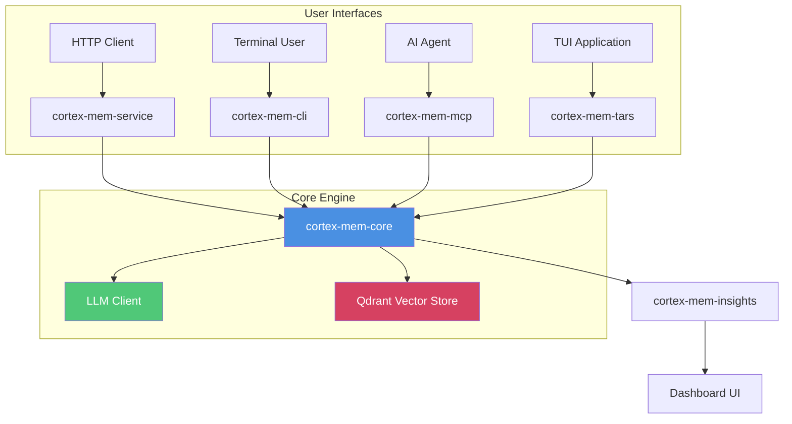
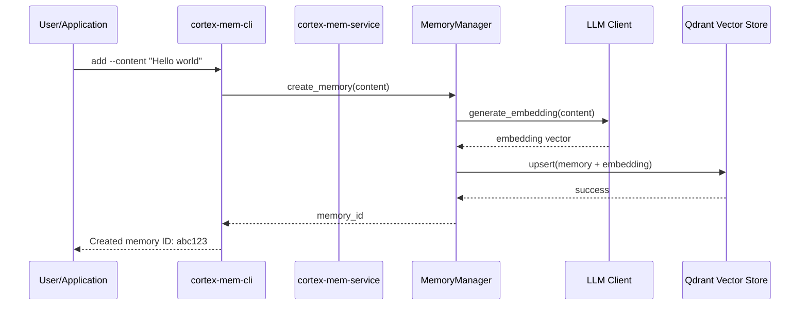
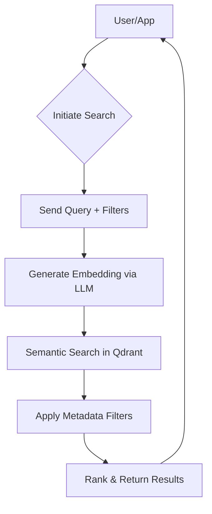
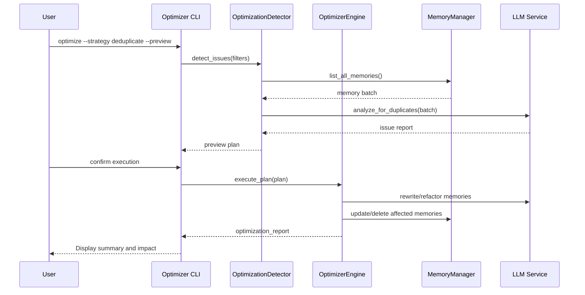
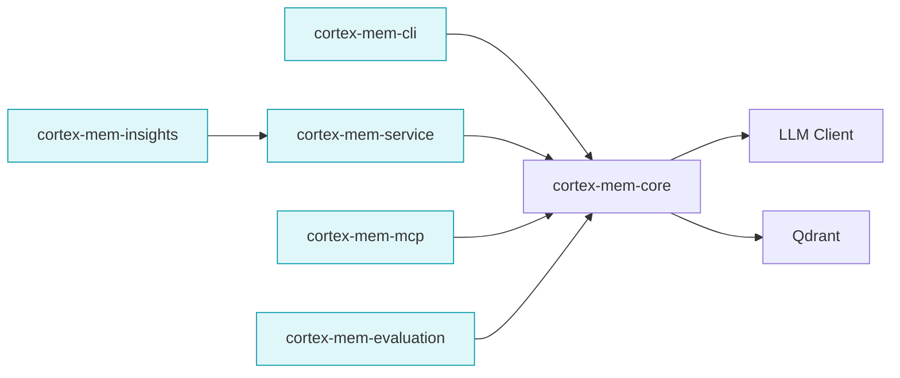
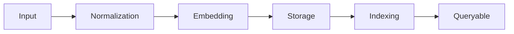
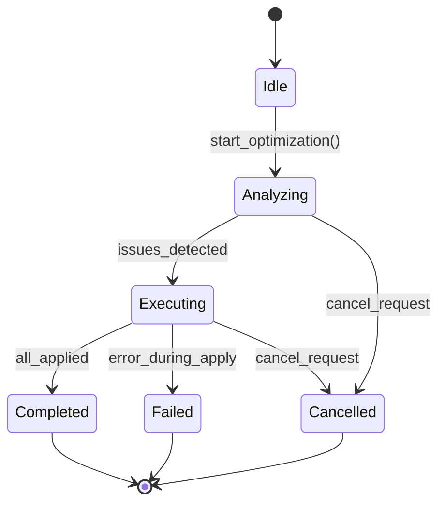
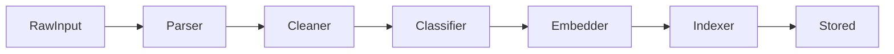

# Core Workflows

**Document Generated On:** 2025-12-18 11:29:14 UTC  
**System Name:** `cortex-mem` – A Comprehensive Memory Management System for AI Agents  

---

## 1. Workflow Overview

The **cortex-mem** system is a full-stack memory management platform designed to enable AI agents with persistent, searchable, and optimizable long-term memory. It supports multiple interaction modes—via HTTP API, CLI, MCP protocol, and interactive TUI applications—and provides advanced capabilities such as semantic search, deduplication, quality optimization, and analytics.

### Main Workflows
The system revolves around three core workflows:
1. **Memory Management Process (CRUD)** – Creation, retrieval, update, and deletion of memories.
2. **Memory Search Process** – Semantic and metadata-based querying of stored memories.
3. **Memory Optimization Process** – Quality improvement through deduplication, relevance tuning, and structural refinement.

These workflows are orchestrated across modular domains including **Memory Management**, **Memory Storage**, **Optimization**, and **Insights & Analytics**, all coordinated via shared state, configuration, and asynchronous execution.

### Core Execution Paths
| Workflow | Entry Point(s) | Key Output |
|--------|----------------|-----------|
| Memory Management | `/memories` (API), `add`, `delete` (CLI) | Memory ID or operation status |
| Memory Search | `/search`, `list`, `search` commands | Ranked list of matching memories |
| Memory Optimization | `/optimization/start`, `optimize` command | Optimization report with impact metrics |

### Key Process Nodes
- **Request Initiation**: User or agent triggers an action via CLI, API, or UI.
- **Embedding Generation**: LLM client generates vector embeddings from text content.
- **Vector Storage/Retrieval**: Qdrant database stores and retrieves embeddings using approximate nearest neighbor (ANN) search.
- **Filtering & Scoring**: Metadata filters applied post-semantic search; results ranked by relevance score.
- **Optimization Orchestration**: Detection of duplicates, low-quality entries, and relevance issues followed by LLM-driven cleanup.
- **Response Delivery**: Structured response returned to client with success/failure status and data.

### Process Coordination Mechanisms
- **Asynchronous Communication**: All operations use async/await patterns via Tokio runtime for non-blocking I/O.
- **Shared State via Arc/Mutex**: In CLI and TUI apps, `Arc<MemoryManager>` enables thread-safe access.
- **Configuration-Driven Initialization**: TOML-based config (`config.toml`) controls subsystem behavior (LLM, Qdrant, logging).
- **Event Loop Architecture**: Interactive tools like `cortex-mem-tars` use message-passing loops for input handling and rendering.



> **Figure 1: High-Level System Architecture and Workflow Coordination**

---

## 2. Main Workflows

### 2.1 Memory Management Process

This is the foundational CRUD workflow enabling creation, reading, updating, and deletion of memory records.

#### Execution Path


#### Detailed Steps
| Step | Component | Operation | Input | Output |
|------|---------|----------|-------|--------|
| 1 | `cortex-mem-cli/src/main.rs` | Parse CLI args, dispatch to `add` command | Command-line arguments | `AddCommand` struct |
| 2 | `cortex-mem-cli/src/commands/add.rs` | Extract content, detect conversation format | Raw string input | Parsed `MemoryContent` |
| 3 | `cortex-mem-core/src/memory/manager.rs` | Call `create_memory()` | Content, user/agent IDs | Memory object |
| 4 | `cortex-mem-core/src/llm/client.rs` | Generate embedding via LLM API | Text content | `[f32; 384]` vector |
| 5 | `cortex-mem-core/src/vector_store/qdrant.rs` | Upsert into Qdrant collection | Memory + embedding | Success/Failure |
| 6 | `cortex-mem-cli/src/commands/add.rs` | Print result to console | Memory ID | Human-readable output |

#### Business Value
- Enables AI agents to persist context across sessions.
- Supports structured metadata tagging (topics, keywords, type).
- Provides reliable storage with unique identifiers for future reference.

#### Technical Characteristics
- **Idempotent Operations**: Duplicate inserts return existing ID if detected.
- **Batch Support**: Bulk operations supported via `/batch` endpoints.
- **Async I/O**: All steps executed asynchronously using Tokio.

---

### 2.2 Memory Search Process

Enables users and agents to retrieve relevant memories based on semantic similarity or metadata filtering.

#### Execution Path


#### Detailed Steps
| Step | Module | Function | Description |
|------|--------|--------|-------------|
| 1 | `handlers.rs::search_memories` | Receive `/search` request | Accepts query string and optional filters (user_id, agent_id, topics) |
| 2 | `llm/client.rs::generate_embedding` | Encode query into vector | Uses configured LLM (e.g., OpenAI, Ollama) to embed query |
| 3 | `qdrant.rs::semantic_search` | Perform ANN search | Retrieve top-K nearest neighbors above threshold |
| 4 | `memory/manager.rs::apply_filters` | Filter by metadata | Apply user, agent, topic, keyword constraints |
| 5 | `memory/manager.rs::rank_results` | Re-rank by composite score | Combine semantic score with importance, recency, relevance |
| 6 | `handlers.rs` | Return JSON response | Paginated list with scores, metadata, and snippets |

#### Supported Query Modes
- **Semantic Only**: Free-text search ("What did I say about planning?")
- **Metadata Filtered**: List all memories for a given agent/topic
- **Hybrid**: "Find conversations about goals" → semantic + filter on `type=conversation`

#### Performance Notes
- Default limit: 20 results
- Configurable scoring weights: `relevance_weight`, `importance_weight`, `recency_decay`
- Caching layer planned but not yet implemented

---

### 2.3 Memory Optimization Process

A high-value workflow that improves memory quality by detecting and resolving issues such as duplication, redundancy, and poor structure.

#### Execution Path


#### Key Subprocesses
1. **Issue Detection**
   - Scan memories for:
     - Exact or near-duplicate content
     - Low-importance scores (< 0.3)
     - Poorly structured entries
     - Redundant information across related memories
   - Implemented in `optimization_detector.rs`

2. **Plan Generation**
   - Build safe transformation plan:
     - Merge duplicates
     - Rewrite unclear entries
     - Archive obsolete memories
   - Preview mode shows proposed changes before execution

3. **Execution Engine**
   - Apply transformations using LLM rewriting prompts
   - Batch updates to minimize API calls
   - Track version history for rollback capability

4. **Reporting**
   - Generate JSON and Markdown reports
   - Include statistics: # resolved, # deleted, # updated, estimated quality gain

#### Configuration Options
| Parameter | Default | Purpose |
|---------|--------|--------|
| `--strategy` | `full` | One of: `deduplicate`, `quality`, `relevance`, `full` |
| `--filter-user` | all | Restrict scope to specific user |
| `--dry-run` | false | Show what would be done without applying changes |
| `--aggressive` | false | Enable deeper restructuring (riskier) |

#### Business Value
- Prevents memory bloat and degradation over time.
- Maintains high signal-to-noise ratio in agent knowledge base.
- Enables trustworthiness of retrieved context.

---

## 3. Flow Coordination and Control

### 3.1 Multi-Module Coordination Mechanisms

The system uses a layered architecture where higher-level interfaces delegate to a unified core engine.

#### Inter-Module Dependencies


> **Figure 2: Module Interaction Diagram**

Each interface module acts as a facade:
- **CLI**: Terminal-first UX with rich formatting and interactivity
- **API**: RESTful interface for integration with external systems
- **MCP**: Protocol adapter for AI tool calling (e.g., LangChain, AutoGPT)
- **Insights**: Visualization dashboard built on top of API

All route through `MemoryManager`, ensuring consistent business logic enforcement.

### 3.2 State Management and Synchronization

#### Shared State Patterns
| Context | Mechanism | Example |
|-------|----------|--------|
| CLI App | `Arc<MemoryManager>` | Thread-safe sharing between event loop and background tasks |
| TUI App | Message Passing (`mpsc::UnboundedSender`) | Decouple UI rendering from memory persistence |
| Web Server | `AppState` with `Arc<Mutex<...>>` | Share manager across Axum handlers |
| Frontend | Svelte Stores (`writable`, `derived`) | Reactive state for dashboards |

#### Lifecycle Coordination
In `cortex-mem-tars`, graceful shutdown ensures:
1. Exit TUI immediately on `/quit`
2. Continue processing pending memory saves in background
3. Log final session summary after persistence completes

Implemented via Tokio task spawning and join handles.

### 3.3 Data Passing and Sharing

#### Internal Data Flow


Data transformations include:
- UTF-8 normalization and truncation (max 16k tokens)
- Automatic topic extraction from content
- Importance scoring via LLM classification
- Vector indexing within Qdrant

#### Cross-Layer Contracts
Defined via:
- Rust structs (`MemoryRecord`, `Filters`, `OptimizationPlan`)
- TypeScript interfaces (`ApiMemory`, `OptimizationJobStatus`)
- Serde serialization for inter-process communication

Ensures consistency between CLI, API, and frontend layers.

### 3.4 Execution Control and Scheduling

#### Asynchronous Processing Model
All heavy operations run asynchronously:
- Embedding generation
- Vector search
- Optimization jobs
- Batch imports

Using **Tokio** runtime with:
- Task spawning for long-running operations
- Timeouts enforced per operation (configurable)
- Backpressure via bounded channels

#### Job Tracking
Optimization jobs tracked in-memory (future: persistent store):
- Job ID generation
- Status polling endpoint (`GET /optimization/status/:id`)
- Cancellation support via cancellation tokens

Example job lifecycle:


---

## 4. Exception Handling and Recovery

### 4.1 Error Detection and Handling

#### Common Failure Points
| Layer | Potential Errors | Handling Strategy |
|------|------------------|-------------------|
| CLI Parsing | Invalid args | Clap validation + help display |
| LLM Call | Rate limiting, timeout, auth failure | Retry with exponential backoff; fallback to cached embedding if available |
| Qdrant DB | Connection loss, index corruption | Graceful degradation; log warning, retry on next attempt |
| Memory Write | Duplicate key, schema mismatch | Idempotent insert; deduplicate before write |
| Optimization | Invalid plan, partial failure | Atomic transaction simulation; roll back failed batches |

#### Centralized Logging
Uses `tracing_subscriber` with structured logs:
```rust
tracing::error!(error = ?e, memory_id, "Failed to delete memory");
```
Log levels: INFO (default), DEBUG (verbose), ERROR (critical)

### 4.2 Exception Recovery Mechanisms

#### Resilience Features
- **Retry Logic**: For transient failures (network, rate limits)
- **Fallback Embeddings**: Use last-known-good embedding during outages
- **Safe Mode**: Disable optimization when LLM unavailable
- **Data Validation**: Validate memory integrity before and after operations

#### Rollback Capabilities
- Memory updates preserve previous versions (soft-delete model)
- Optimization plans can be reverted using audit trail
- Backup export via `cortex-mem-cli list --format=json > backup.json`

### 4.3 Fault Tolerance Strategy Design

| Risk | Mitigation |
|------|----------|
| Single Point of Failure | Stateless services; Qdrant supports clustering |
| Data Loss | Regular backups encouraged; WAL enabled in Qdrant |
| LLM Outage | Cache recent embeddings; degrade to keyword-only search |
| High Load | Request throttling; queue large jobs |
| Misconfiguration | Schema validation on config load; defaults provided |

### 4.4 Failure Retry and Degradation

#### Retry Policy
Configurable in `config.toml`:
```toml
[llm.retry]
max_attempts = 3
initial_backoff_ms = 500
max_backoff_ms = 5000
jitter_factor = 0.1
```

Applied automatically in `client.rs`.

#### Degradation Modes
When LLM service is unreachable:
- **Search**: Fall back to metadata-only filtering
- **Add**: Skip embedding, mark as "pending embedding"
- **Optimize**: Disable LLM-dependent strategies, allow manual cleanup only

Indicated in system status dashboard.

---

## 5. Key Process Implementation

### 5.1 Core Algorithm Processes

#### Embedding Pipeline
```rust
async fn create_memory(&self, content: String) -> Result<Uuid> {
    let embedding = self.llm_client.generate_embedding(&content).await?;
    let memory = MemoryRecord::new(content, embedding, self.user_id);
    self.vector_store.upsert(memory).await?;
    Ok(memory.id)
}
```
- Uses sentence-transformers or OpenAI models
- Dimension: typically 384–1536 floats
- Distance metric: Cosine similarity

#### Deduplication Algorithm
1. Group memories by user + agent
2. Compute pairwise cosine distances
3. Cluster similar vectors (threshold: 0.92)
4. Select representative memory (highest importance + recency)
5. Rewrite others to link or merge

Uses hierarchical agglomerative clustering (HAC).

#### Importance Scoring
Uses few-shot prompting:
```text
Rate this memory's importance from 0.0 to 1.0:
- Is it actionable?
- Does it contain personal facts?
- Will it be useful later?

Content: "{content}"
→ Score:
```
Score normalized and combined with length, source, and frequency.

### 5.2 Data Processing Pipelines

#### Ingestion Pipeline


Steps:
1. **Parse**: Detect conversation turns (`User:` / `Assistant:`)
2. **Clean**: Remove noise, normalize whitespace
3. **Classify**: Assign `type` (fact, conversation, goal, etc.)
4. **Extract Topics**: Keyword extraction via TF-IDF + LLM suggestion
5. **Generate Embedding**
6. **Index**: Insert into Qdrant with payload (metadata)

#### Search Pipeline


Post-processing includes:
- Snippet generation (context window around match)
- Highlighting query terms
- Recency boost: `score *= exp(-λ * age_in_days)`

### 5.3 Business Rule Execution

#### Memory Retention Policies
| Type | Default TTL | Configurable |
|------|------------|-------------|
| Conversation | 90 days | Yes |
| Fact | Permanent | Yes |
| Temporary Note | 7 days | Yes |
| Goal | Until completion | Auto-archive |

Enforced via scheduled cleanup job.

#### Access Control Rules
Currently based on:
- `user_id` (required)
- `agent_id` (optional filter)
- Future: RBAC roles (planned)

All queries implicitly scoped to requester’s identity.

### 5.4 Technical Implementation Details

#### Core Components
| File | Responsibility |
|------|----------------|
| `memory/manager.rs` | Primary orchestrator; exposes public API |
| `llm/client.rs` | Handles authentication, retries, batching |
| `vector_store/qdrant.rs` | Implements Qdrant gRPC client bindings |
| `optimization_detector.rs` | Analyzes memory corpus for issues |
| `optimizer.rs` | Executes refactoring plans |

#### Concurrency Model
- **Tokio Runtime**: Multi-threaded, work-stealing scheduler
- **No Global Mutexes**: Per-operation locking
- **Channel-Based Communication**: Between UI and worker threads

#### Configuration System
Built with:
- `serde` for deserialization
- `config.toml` as primary source
- Environment variable overrides
- Defaults via `impl Default` trait

Supports hot-reload in development mode.

#### Performance Optimization Strategies
| Area | Technique |
|------|----------|
| Latency | Async I/O, connection pooling |
| Throughput | Batch operations, bulk indexing |
| Scalability | Stateless services, horizontal scaling |
| Efficiency | Embedding caching, lazy loading |
| Observability | Tracing spans, metrics export |

Planned enhancements:
- Redis cache layer for frequent queries
- Background embedding queue
- Incremental optimization (vs full scan)

---

## Conclusion

The **cortex-mem** system delivers a robust, extensible framework for AI agent memory management. Its core workflows—memory management, search, and optimization—are deeply integrated, consistently implemented, and resilient to failure. The architecture promotes reuse through a shared core engine while supporting diverse frontends and integration points.

This document serves as a complete guide for developers, operators, and researchers working with the system, providing both high-level understanding and deep technical insight into its operation.

For further exploration:
- Run `examples/memory-tools-refactor` for a usage walkthrough
- Use `cortex-mem-evaluation` to benchmark performance
- Monitor health via `cortex-mem-insights` dashboard

**Generated from research materials as of 2025-12-18 11:29:14 UTC**