# Core Workflows

## 1. Workflow Overview

The **Cortex-Mem** system is a comprehensive memory management platform designed to enable AI agents and human operators to store, retrieve, analyze, and optimize persistent memories across multiple interaction modalities. The system supports diverse access patterns through CLI, HTTP API, MCP (Memory Control Protocol), and a web-based dashboard, all unified under a shared core logic layer.

### System Main Workflows
- **Memory Management Workflow**: End-to-end lifecycle of creating, storing, retrieving, and optimizing memories.
- **System Initialization Workflow**: Bootstrapping process that loads configuration, initializes services, and exposes interfaces.
- **Optimization Execution Workflow**: Intelligent analysis and improvement of memory collections for quality, relevance, and efficiency.

### Core Execution Paths
1. **User-initiated Memory Operations** (via CLI or Web UI)
2. **Agent-initiated Memory Access** (via MCP or API)
3. **Automated Optimization & Maintenance**
4. **Monitoring & Diagnostic Queries**

### Key Process Nodes
| Node | Description |
|------|-------------|
| `Configuration Load` | Parses TOML config with fallback paths; sets up logging, LLM, vector DB, and service parameters |
| `MemoryManager Init` | Central orchestrator that binds storage, LLM, and optimization logic |
| `Content Analysis` | Uses LLM to extract facts, entities, keywords, and classify memory type |
| `Embedding Generation` | Converts text into vector representations using OpenAI or compatible models |
| `Vector Storage` | Persists embeddings in Qdrant with metadata indexing |
| `Semantic Search` | Matches queries via cosine similarity on vectors |
| `Optimization Engine` | Detects duplicates, low-quality entries, and suggests merging strategies |
| `State Reporting` | Aggregates health metrics from backend services for monitoring |

### Process Coordination Mechanisms
- **Shared State via `Arc<MemoryManager>`**: Ensures thread-safe access across async handlers in Rust components.
- **Event-Driven Communication**: Message passing between UI and background tasks using channels (`mpsc::UnboundedSender`) in TUI applications.
- **API Abstraction Layer**: TypeScript client encapsulates REST interactions, enabling consistent frontend-backend communication.
- **Reactive Stores (Svelte)**: Frontend state managed via writable/derived stores for real-time updates.
- **Tracing Integration**: Unified logging across modules using `tracing` crate for observability.

---

## 2. Main Workflows

### 2.1 Memory Management Workflow

This is the primary business workflow, governing how memories are created, stored, retrieved, and optimized.


#### Execution Order and Dependencies
1. **Input Reception** → Command parsing (CLI) or route dispatch (HTTP/MCP)
2. **Preprocessing** → Content classification, role detection (e.g., "User:", "Assistant:")
3. **LLM Interaction** → Fact extraction, embedding generation
4. **Storage Operation** → Vector write to Qdrant + metadata persistence
5. **Indexing & Retrieval** → Semantic search using vector similarity
6. **Post-processing** → Filtering by user_id, agent_id, topics, etc.
7. **Output Formatting** → Structured console output or JSON response

#### Input/Output Data Flows
| Step | Input | Output | Source Module | Target Module |
|------|-------|--------|---------------|----------------|
| Create | Raw text/conversation | Classified content | CLI/API | Memory Types System |
| Extract | Text content | Facts, entities, keywords | Information Extraction | Memory CRUD |
| Embed | Text | Vector embedding | LLM Client | Vector Store |
| Store | Memory object | Stored ID | Memory Manager | Qdrant |
| Search | Query string/filters | List of scored memories | Semantic Search | Access Interface |
| Optimize | Strategy + filters | Optimization plan | Optimization Engine | Memory Manager |

> ✅ **Business Value**: Enables contextual continuity in AI agents by preserving conversational history and derived insights.

---

### 2.2 System Initialization Workflow

Handles bootstrapping of the entire system across all entry points.


#### Technical Details
- **Config Loading Path Resolution**:
  - Current directory → Home directory → System-wide locations
  - Supports default values via `Default` trait (e.g., log level = INFO)
- **Auto-Detection Logic**:
  - If embedding dimension not specified, infers from LLM model or tests dynamically
  - Falls back to common dimensions (e.g., 1536 for OpenAI)
- **Service Binding**:
  - All interfaces share the same `MemoryManager` instance wrapped in `Arc<Mutex<T>>`
  - Tokio runtime manages concurrent access

> ⚙️ **Operational Insight**: This modular initialization enables deployment flexibility—developers can run only needed interfaces (e.g., just MCP server).

---

### 2.3 Optimization Execution Workflow

Enables intelligent cleanup and enhancement of memory collections.


#### Supported Strategies
| Strategy | Purpose |
|--------|---------|
| Full | Comprehensive scan and optimization |
| Incremental | Only recent memories |
| Deduplication | Find and merge near-duplicate entries |
| Quality | Remove low-importance or irrelevant memories |
| Relevance | Filter based on topic alignment |
| Space | Maximize storage efficiency |

#### Preview Mode Safety
- Shows estimated impact before execution
- Requires explicit confirmation
- Supports dry-run analysis without modification

> 🔐 **Security Note**: Interactive confirmation prevents accidental data loss during bulk operations.

---

## 3. Flow Coordination and Control

### 3.1 Multi-Module Coordination Mechanisms

| Relationship | Mechanism | Example |
|------------|-----------|--------|
| **Access Interface → Memory Management** | Direct function call via `MemoryManager` | CLI calls `.add_memory()` |
| **Memory Management → LLM Integration** | Async method invocation | `llm_client.generate_embedding()` |
| **Memory Management → Storage Integration** | Vector store abstraction | `QdrantStore.store_embedding()` |
| **Frontend → Backend** | RESTful API over HTTP | `/api/memory/search` |
| **Agent → System** | MCP protocol over stdio | `store_memory`, `query_memory` tools |

#### Inter-Process Communication Diagram


### 3.2 State Management and Synchronization

#### Backend (Rust)
- **Thread Safety**: Shared state protected via `Arc<Mutex<T>>` or `Arc<RwLock<T>>`
- **Async Runtime**: Tokio handles concurrency with non-blocking I/O
- **Global Config**: Immutable after load, cloned where needed

#### Frontend (Svelte)
- **Reactive Stores**:
  - `memoryStore`: Holds list of memories with filters
  - `optimizationStore`: Tracks job status and history
  - `systemStore`: Monitors backend health
- **Derived Stores**:
  ```ts
  export const optimizationStatus = derived(
    optimizationStore,
    ($store) => $store.job?.status || 'idle'
  );
  ```

### 3.3 Data Passing and Sharing

| Layer | Mechanism | Format |
|------|----------|--------|
| Internal (Rust) | Function arguments, structs | Native types (`Memory`, `Filters`) |
| External (API) | JSON over HTTP | Defined in `types.ts` |
| CLI ↔ Core | In-process calls | Strongly-typed Rust structs |
| Agent ↔ MCP | JSON-RPC over stdio | MCP-compliant tool schema |

### 3.4 Execution Control and Scheduling

- **Manual Triggering**: User commands via CLI or Web UI
- **Scheduled Jobs**: Planned via external schedulers (not built-in yet)
- **Concurrent Processing**:
  - Multiple CLI/API requests handled concurrently via Tokio
  - Batch operations use rate limiting (1s delay between batches)

> 🔄 **Performance Tip**: Use batch operations for large-scale imports to reduce overhead.

---

## 4. Exception Handling and Recovery

### 4.1 Error Detection and Handling

| Component | Strategy |
|---------|----------|
| **CLI** | Structured tracing logs + user-friendly messages |
| **HTTP API** | Centralized error handler returns `{success: false, error: {...}}` |
| **MCP Server** | Translates domain errors to `ErrorData` per MCP spec |
| **Frontend** | Try-catch blocks with fallback rendering |

#### Common Errors and Responses
| Error Type | Handling |
|----------|---------|
| `Memory Not Found` | Return 404; suggest alternatives if similar exist |
| `LLM Rate Limit` | Retry with exponential backoff; fall back to cached embeddings |
| `Qdrant Unavailable` | Log error; return cached results if possible |
| `Invalid Configuration` | Fail fast at startup with descriptive message |
| `JSON Parse Failure` | Graceful degradation; use defaults or skip item |

### 4.2 Exception Recovery Mechanisms

- **Graceful Degradation**:
  - When LLM fails, use basic keyword matching instead of semantic search
  - On API failure, show last known good state
- **Retry Logic**:
  - Python evaluation scripts include retry loops
  - HTTP clients implement automatic retries (configurable)
- **Fallback Modes**:
  - CLI optimization has “preview” mode to avoid unintended changes
  - Web UI shows mock data when backend is unreachable

### 4.3 Fault Tolerance Strategy Design

| Aspect | Strategy |
|------|----------|
| **Data Loss Prevention** | Final shutdown phase ensures pending writes complete |
| **Service Isolation** | Each interface runs independently; one crash doesn’t affect others |
| **Idempotent Operations** | Add operations check for duplicates before insertion |
| **Backup Support** | Optimization includes optional backup creation before major changes |

### 4.4 Failure Retry and Degradation

- **Rate Limit Handling**:
  - Detected via HTTP 429 or LLM client feedback
  - Automatically switches to lower-frequency mode
  - Delays next request using jittered exponential backoff
- **Degraded Mode Features**:
  - Disable advanced features (e.g., deduplication) when LLM unavailable
  - Fall back to exact match search when embedding generation fails

> 💡 **Best Practice**: Always validate configuration early using `validate_config()` utilities to prevent runtime failures.

---

## 5. Key Process Implementation

### 5.1 Core Algorithm Processes

#### Memory Creation Pipeline
```rust
async fn create_memory(content: &str) -> Result<Uuid> {
    let memory_type = classify_content(content);
    let facts = extractor.extract_facts(content).await?;
    let embedding = llm_client.embed(content).await?;
    let metadata = MemoryMetadata::new(user_id, agent_id, memory_type);

    let memory = Memory::builder()
        .content(content)
        .embedding(embedding)
        .metadata(metadata)
        .facts(facts)
        .build();

    memory_manager.store(memory).await
}
```

#### Optimization Decision Hierarchy
```text
Preference Order:
IGNORE > MERGE > UPDATE > CREATE

Rules:
1. If new fact matches existing closely → IGNORE
2. If related but complementary → MERGE (summarize)
3. If outdated/incomplete → UPDATE
4. Otherwise → CREATE new memory
```

### 5.2 Data Processing Pipelines

#### Ingestion Flow

```mermaid
flowchart LR
    RawInput --> Parser{是否为对话}
    Parser -->|"是"| RoleSplit[拆分为用户和助手]
    Parser -->|"否"| DirectStore
    RoleSplit --> BatchProcessor
    BatchProcessor --> Embedder
    Embedder --> Extractor
    Extractor --> Classifier
    Classifier --> Storage
```


#### Search Flow


### 5.3 Business Rule Execution

| Rule | Enforcement Point |
|------|-------------------|
| No duplicate memories within 5 minutes | At ingestion time via timestamp + hash check |
| Maximum 100 characters in preview | During formatting in frontend/backend |
| Importance score decay over time | Applied during search ranking |
| Only owner can delete memory | Checked in `MemoryManager.delete()` using `user_id` |
| Confirmation required for bulk delete | Enforced in CLI command logic |

### 5.4 Technical Implementation Details

#### Asynchronous Architecture
- All critical operations are `async fn`
- Tokio runtime powers CLI, API, and MCP servers
- Non-blocking I/O ensures responsiveness even under load

#### Memory Intelligence Loop
Uses LLM-driven updater to decide actions:
```rust
let decision = llm_client.prompt_with_schema::<MemoryAction>(
    "Given these existing memories and new input, what should we do?",
    context
).await?;
```

#### Internationalization (i18n)
- Built with Svelte stores and reactive `$t` function
- Supports English, Chinese, Japanese
- Fallback to English on missing keys
- Language preference persisted in `localStorage`

#### Terminal UI (TARS Example)
- Built with `ratatui` + `crossterm`
- Three-panel layout: conversation (75%), input (25%), logs (right sidebar)
- Real-time streaming responses with cursor animation
- Sophisticated UTF-8 handling for cursor positioning

#### Shutdown Sequence (Critical Reliability Feature)
In `examples/cortex-mem-tars/src/main.rs`:
```rust
// After UI exits, continue processing memory saves
drop(ui_tx); // Signal UI shutdown
while let Ok(log) = log_rx.try_recv() {
    process_log_for_memory_storage(&log);
}
// Ensure all pending memory operations complete
```

> ✅ **Reliability Insight**: This design guarantees no memory loss due to premature termination.

---

## Conclusion

The **Cortex-Mem** system delivers a robust, extensible framework for managing AI agent memories across diverse usage scenarios. Its architecture emphasizes:

- **Modularity**: Clear separation between access interfaces and core logic
- **Resilience**: Comprehensive error handling, graceful degradation, and safe shutdown
- **Intelligence**: LLM-powered content understanding and autonomous optimization
- **Observability**: Rich logging, monitoring endpoints, and interactive dashboards

This documentation provides full operational visibility into the system’s workflows, enabling developers, operators, and integrators to effectively deploy, maintain, and extend its capabilities.

**Generated on**: 2025-12-30 19:19:37 UTC  
**Documentation Version**: 1.0  
**System Name**: Cortex-Mem  
**Primary Users**: AI Agents, Developers, System Administrators