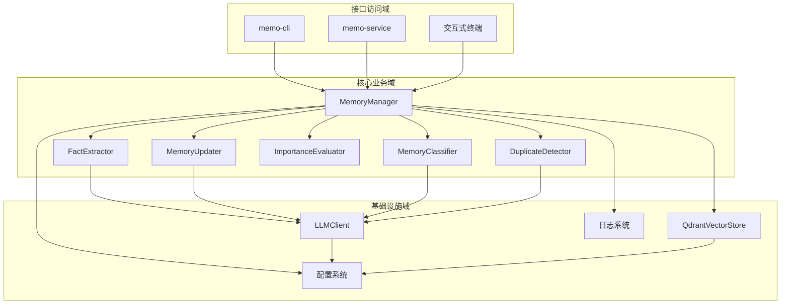
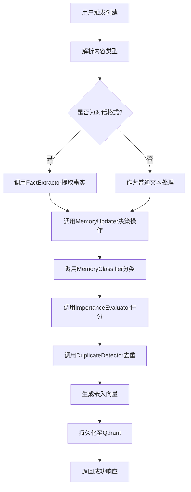
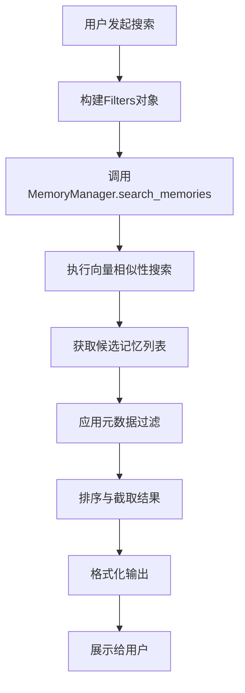
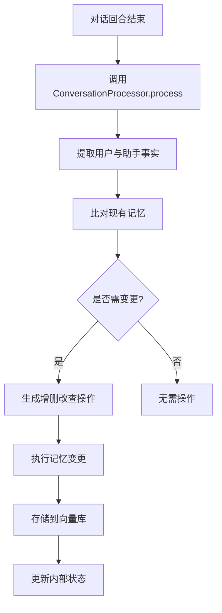
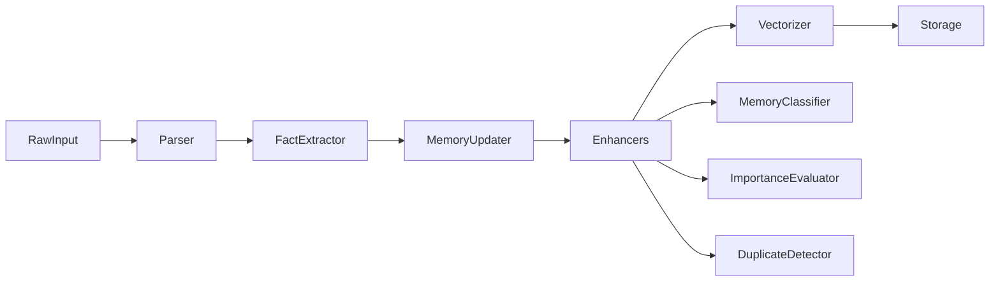

# 核心工作流程

## 1. 工作流程概览 (Workflow Overview)

### 系统主干工作流程

本系统是一个基于 Rust 构建的智能记忆管理系统（`memo`），其核心价值在于通过大语言模型（LLM）与向量数据库（Qdrant）的深度集成，实现对非结构化信息的智能化存储、检索、更新与增强。系统支持多种访问方式（CLI、HTTP API、TUI），为开发者、AI 研究者和知识工作者提供高效的知识管理能力。

系统的主干工作流程围绕“记忆”的全生命周期展开，涵盖从创建、智能处理、持久化存储到语义化检索与自动更新的完整闭环。该流程贯穿多个功能域，体现了 AI 驱动的知识管理系统的典型架构特征。

### 核心执行路径

系统的核心执行路径可归纳为以下三大主线：

1. **记忆创建与智能增强路径**：用户或系统触发记忆创建 → 内容解析与类型识别 → 结构化事实提取 → 智能分类与重要性评估 → 去重检测与合并 → 生成嵌入向量 → 持久化存储。
2. **语义化检索路径**：用户发起自然语言查询 → 查询向量化 → 向量数据库相似性搜索 → 应用层元数据过滤 → 排序与截取 → 格式化输出。
3. **被动学习更新路径**：对话回合结束 → 提取用户与助手事实 → 比对现有记忆 → 决策增删改查操作 → 执行记忆变更 → 持久化更新。

这三条路径共同构成了系统的核心业务能力，实现了“记忆即服务”（Memory-as-a-Service）的设计理念。

### 关键流程节点

| 节点 | 描述 | 所属模块 |
|------|------|---------|
| `MemoryManager` | 核心协调器，聚合所有记忆处理组件，对外提供统一接口 | 记忆管理域 |
| `FactExtractor` | 从对话文本中提取结构化事实信息，支持双通道（用户/助手）提取 | 记忆管理域 |
| `MemoryUpdater` | 基于 LLM 决策是否创建、更新、删除或合并记忆条目 | 记忆管理域 |
| `MemoryClassifier` | 对记忆内容进行智能分类（如对话型、程序型、事实型） | 记忆管理域 |
| `ImportanceEvaluator` | 评估记忆条目的重要性，支持混合模式评估 | 记忆管理域 |
| `DuplicateDetector` | 检测并处理重复记忆，支持规则与语义双重机制 | 记忆管理域 |
| `QdrantVectorStore` | 实现记忆数据的向量存储与高效检索 | 向量存储域 |
| `LLMClient` | 封装与 OpenAI 等 LLM 服务的交互逻辑 | LLM 集成域 |

### 流程协调机制

系统采用**分层架构 + 组件聚合**的协调机制：

- **接口访问层**（CLI/HTTP/TUI）通过调用 `MemoryManager` 实例触发业务流程。
- `MemoryManager` 作为核心控制器，组合多个策略组件（分类器、评估器、去重器等），根据配置动态启用不同策略（如 LLM 或规则驱动）。
- 各组件通过统一的 trait 接口（如 `VectorStore`, `LLMClient`）进行协作，确保松耦合与可扩展性。
- 数据流转通过 `Memory`、`Filters`、`ScoredMemory` 等核心数据模型完成，确保类型安全与序列化兼容。



---

## 2. 主要工作流程 (Main Workflows)

### 核心业务流程详解

#### 2.1 记忆创建流程（Create Memory Workflow）

该流程是系统最核心的业务流程之一，负责将原始输入转化为结构化、可检索的记忆条目。

**流程图：**



**执行顺序与依赖关系：**

1. **入口点**：由 `memo-service/src/handlers.rs::create_memory` 或 `memo-cli/src/commands/add.rs::add_command` 触发。
2. **内容解析**：根据内容是否包含 `User:`/`Assistant:` 前缀或换行符判断是否为对话格式。
3. **事实提取**：若为对话，使用 `FactExtractor::extract_from_messages` 提取结构化事实（如偏好、计划、错误等）。
4. **更新决策**：`MemoryUpdater` 分析新事实与现有记忆的关系，生成 JSON 格式的操作指令（Add/Update/Delete/Merge）。
5. **智能增强**：
   - `MemoryClassifier` 判断记忆类型（`MemoryType` 枚举）。
   - `ImportanceEvaluator` 打分（0.0~1.0），支持混合模式（规则快速评估 + LLM 精确打分）。
6. **去重检测**：`DuplicateDetector` 计算语义相似度，若超过阈值则触发合并逻辑。
7. **向量化与存储**：调用 `LLMClient::embed` 生成嵌入向量，通过 `QdrantVectorStore::insert` 持久化。
8. **响应返回**：封装 `MemoryResponse` 模型，返回 JSON 响应。

**输入输出数据流转：**

| 阶段 | 输入 | 输出 | 数据模型 |
|------|------|------|----------|
| 请求接收 | JSON 请求体 | `CreateMemoryRequest` | `models.rs` |
| 内容解析 | 原始字符串 | `Vec<Message>` 或 `String` | `types.rs::Message` |
| 事实提取 | 消息列表 | `Vec<ExtractedFact>` | `extractor_types.rs` |
| 更新决策 | 事实 + 现有记忆 | `Vec<MemoryAction>` | `updater.rs` |
| 分类评估 | 内容文本 | `MemoryType`, `f64` 评分 | `classification.rs`, `importance.rs` |
| 存储 | `Memory` 实例 | `PointId` | `types.rs::Memory`, `qdrant.rs` |

---

#### 2.2 语义搜索流程（Semantic Search Workflow）

该流程支持用户通过自然语言查询快速定位相关记忆，是知识复用的关键路径。

**流程图：**



**执行顺序与依赖关系：**

1. **入口点**：由 CLI `search` 命令、HTTP `/memories/search` 接口或 TUI 搜索框触发。
2. **参数解析**：解析查询字符串、用户ID、AgentID、主题、关键词等，构建 `Filters` 结构体。
3. **向量搜索**：若存在查询文本，调用 `LLMClient::embed` 生成嵌入向量，传入 `QdrantVectorStore::search` 执行近似最近邻（ANN）搜索。
4. **元数据过滤**：对搜索结果应用 `Filters` 中的条件（如时间范围、记忆类型）进行二次过滤。
5. **结果处理**：按相似度评分排序，截取前 N 条（默认 10），填充元数据。
6. **输出格式化**：CLI 输出表格，HTTP 返回 JSON 数组，TUI 渲染为带高亮的文本。

**输入输出数据流转：**

| 阶段 | 输入 | 输出 | 数据模型 |
|------|------|------|----------|
| 参数解析 | 命令行参数 / 查询参数 | `Filters` | `types.rs::Filters` |
| 向量搜索 | 查询文本 | `Vec<ScoredMemory>` | `types.rs::ScoredMemory` |
| 元数据过滤 | 候选列表 + Filters | 过滤后列表 | `MemoryManager::apply_filters` |
| 输出 | 结果列表 | 格式化文本 / JSON | `SearchResponse` |

---

#### 2.3 被动学习更新流程（Passive Learning Update Workflow）

该流程在多轮对话场景中自动运行，实现 AI 系统的持续自我进化。

**流程图：**



**执行顺序与依赖关系：**

1. **触发条件**：`examples/multi-round-interactive/src/agent.rs` 在每次 `Agent` 生成回复后调用 `ConversationProcessor::process`。
2. **事实提取**：使用 `FactExtractor` 从完整对话历史中提取用户偏好、助手能力等信息。
3. **记忆比对**：`MemoryUpdater` 将新事实与现有记忆进行语义比对。
4. **操作决策**：生成 `MemoryAction` 列表（如更新用户职业、删除过时计划）。
5. **执行变更**：调用 `MemoryManager` 的 `create_memory`、`update_memory`、`delete_memory` 方法。
6. **持久化**：变更同步至 Qdrant 向量库。

此流程实现了“记忆即上下文”的设计理念，使 AI 能够长期记住用户信息并动态调整行为。

---

## 3. 流程协调与控制 (Flow Coordination)

### 多模块协调机制

系统通过以下机制实现跨模块协调：

- **依赖注入**：`MemoryManager` 在初始化时接收 `VectorStore` 和 `LLMClient` 实例，形成组件依赖树。
- **配置驱动**：`MemoryConfig` 控制是否启用自动增强、摘要生成、LLM 分类等功能，实现行为可配置。
- **事件驱动**：TUI 应用通过 `mpsc` 通道传递用户输入与 Agent 响应，实现异步解耦。
- **统一接口抽象**：
  - `VectorStore` trait 定义 CRUD 操作，支持未来扩展其他向量数据库。
  - `LLMClient` trait 抽象 LLM 服务差异，便于替换模型提供商。

### 状态管理和同步

- **应用状态**：TUI 应用通过 `App` 结构体集中管理对话历史、输入框内容、滚动偏移、焦点区域等状态。
- **记忆状态**：每条记忆通过 `Memory` 结构体维护其内容、嵌入向量、元数据（`MemoryMetadata`）、创建/更新时间戳。
- **会话状态**：多轮对话通过 `Message` 列表维护上下文，支持流式响应生成。

### 数据传递和共享

- **数据模型共享**：`memo-core/src/types.rs` 定义所有核心数据结构，被各模块引用。
- **配置共享**：`memo-config` 模块提供强类型配置结构，通过 `pub use memo_core::config::*` 统一导出。
- **错误类型共享**：`MemoryError` 枚举贯穿整个系统，确保错误处理一致性。

### 执行控制和调度

- **异步运行时**：使用 `tokio` 运行时调度 I/O 密集型任务（如 HTTP 请求、数据库操作）。
- **命令模式**：CLI 采用命令模式分发子命令（add/list/search/delete），提高可维护性。
- **工厂模式**：`create_*` 系列函数（如 `create_memory_classifier`）根据配置动态创建组件实例。
- **提示词工程**：`prompts.rs` 中的系统提示词严格定义 LLM 行为，确保输出格式一致。

---

## 4. 异常处理与恢复 (Exception Handling)

### 错误检测和处理

系统定义了统一的错误类型 `MemoryError`（位于 `memo-core/src/error.rs`），涵盖以下类别：

```rust
pub enum MemoryError {
    VectorStoreError(String),
    LLMCallError(String),
    ValidationError(String),
    SerializationError(String),
    ConfigError(String),
    HttpError(reqwest::StatusCode, String),
    IoError(std::io::Error),
}
```

所有函数返回 `Result<T, MemoryError>` 类型，便于链式处理。

### 异常恢复机制

- **LLM 调用降级**：在结构化提取失败时，回退到正则表达式或字符串解析方式。
- **自动维度检测**：若未配置嵌入维度，系统自动调用 `LLMClient::embed` 生成测试向量以推断维度。
- **ID 映射容错**：`MemoryUpdater` 使用 UUID 映射机制处理 LLM 可能生成的“幻觉 ID”，避免更新失败。
- **优雅关闭**：TUI 应用在退出时批量保存未持久化的对话历史，防止数据丢失。

### 容错策略设计

| 场景 | 容错策略 |
|------|----------|
| Qdrant 连接失败 | 重试机制（指数退避），记录错误日志，返回 503 状态码 |
| LLM 超时 | 设置请求超时（如 30s），捕获超时异常并降级处理 |
| 配置缺失 | 提供合理的默认值（如 `LoggingConfig` 默认日志级别为 `info`） |
| 向量维度不匹配 | 自动检测或抛出配置错误，阻止系统启动 |

### 失败重试和降级

- **重试机制**：在 `QdrantVectorStore` 中对关键操作（如插入、搜索）实现有限次重试。
- **降级策略**：
  - 当 LLM 不可用时，使用规则-based 分类器和重要性评估器。
  - 当向量搜索失败时，回退到基于关键词的全文检索（未来可扩展）。
- **监控告警**：通过 `tracing` 日志系统记录关键操作，支持外部监控系统接入。

---

## 5. 关键流程实现 (Key Process Implementation)

### 核心算法流程

#### 5.1 记忆更新决策算法

`MemoryUpdater::determine_actions` 的核心逻辑如下：

1. 对每个提取出的 `ExtractedFact`：
   - 在 Qdrant 中搜索相似记忆（相似度 > `similarity_threshold`）。
   - 若找到候选记忆，构建包含新旧事实的提示词，发送给 LLM。
   - LLM 返回 JSON 格式的操作指令（Add/Update/Delete/NoChange）。
2. 解析 JSON 响应，生成 `MemoryAction` 列表。
3. 若 UPDATE 失败（如 ID 不存在），自动转为 CREATE 操作。
4. 若多个记忆高度相似（> `merge_threshold`），触发合并流程。

**提示词示例（MEMORY_UPDATE_PROMPT）：**
> “根据新事实与现有记忆的关系，决定是否添加、更新、删除或忽略。返回标准化 JSON。”

#### 5.2 智能去重与合并算法

`AdvancedDuplicateDetector` 实现多维度相似性计算：

```rust
fn calculate_similarity(&self, m1: &Memory, m2: &Memory) -> f64 {
    let semantic = cosine_similarity(&m1.embedding, &m2.embedding);
    let content = jaccard_similarity(&m1.content, &m2.content);
    let metadata = metadata_overlap_score(&m1.metadata, &m2.metadata);
    0.6 * semantic + 0.3 * content + 0.1 * metadata
}
```

若相似度 > `merge_threshold`，调用 LLM 生成合并后的内容摘要。

### 数据处理管道

系统构建了清晰的数据处理管道：



每个阶段职责单一，支持独立测试与替换。

### 业务规则执行

关键业务规则包括：

- **自动增强开关**：`config.auto_enhance` 控制是否启用 LLM 驱动的分类、评分、去重。
- **混合评估阈值**：`HybridImportanceEvaluator` 在内容长度 > 100 字符时启用 LLM 评估。
- **安全输出处理**：`utils.rs` 提供 `sanitize_for_cypher` 函数，防止 Cypher 查询注入。

### 技术实现细节

- **异步 trait**：使用 `async-trait` 宏实现异步接口，兼容 `tokio` 运行时。
- **trait 对象克隆**：通过 `dyn_clone` 库支持 `Box<dyn Trait>` 的克隆，满足组件工厂需求。
- **日志系统**：使用 `tracing_subscriber` 初始化日志，输出到带时间戳的文件，不打印到控制台。
- **配置热加载**：虽当前未实现，但架构支持未来扩展配置热更新功能。

---

**生成时间**: 2025-12-03 14:26:06  
**时间戳**: 1764743166