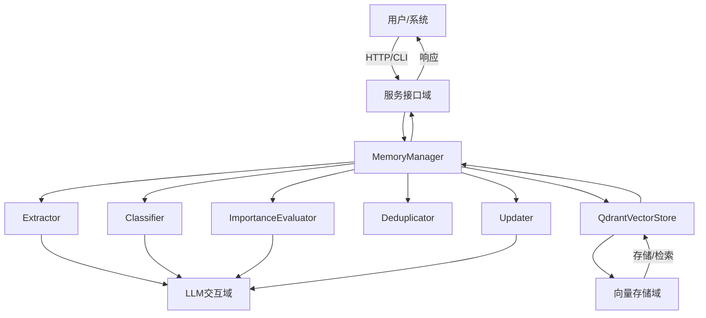
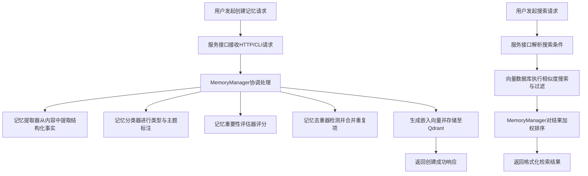
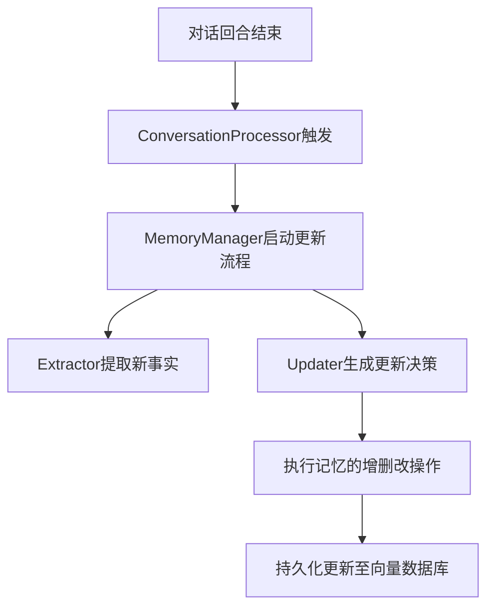
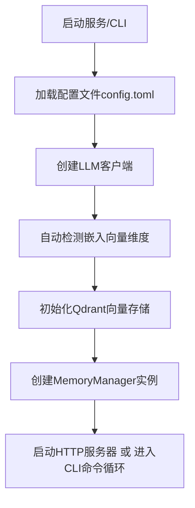

# 核心工作流程

## 1. 工作流程概览 (Workflow Overview)

本系统是一个基于 Rust 构建的智能记忆管理系统，其核心价值在于为 AI 代理提供持久化、结构化且具备智能演进能力的长期记忆。系统通过整合大语言模型（LLM）与向量数据库（Qdrant），实现了从记忆的创建、智能处理、持久化存储到高效检索与自动更新的完整生命周期管理。

### 系统主干工作流程
系统的核心主干工作流程是 **“记忆创建与检索流程”**。该流程始于用户或外部系统通过 HTTP API 或命令行接口（CLI）提交记忆内容，经过一系列由 LLM 驱动的智能处理（如事实提取、分类、重要性评估、去重），最终将富含元数据的记忆条目以嵌入向量的形式存储于 Qdrant 数据库。当需要检索时，系统通过语义相似度搜索结合元数据过滤，快速召回相关记忆，并根据重要性评分进行加权排序，返回最相关的结果。此流程构成了系统价值的核心闭环。

### 核心执行路径
1.  **入口层**：请求通过 `memo-service`（HTTP）或 `memo-cli`（CLI）进入系统。
2.  **协调层**：`MemoryManager` 作为核心协调者，接收请求并调度下游组件。
3.  **智能处理层**：`Extractor`、`Classifier`、`ImportanceEvaluator`、`Deduplicator` 等组件并行或串行工作，利用 LLM 对记忆内容进行深度加工。
4.  **持久化层**：处理后的记忆数据通过 `QdrantVectorStore` 写入数据库。
5.  **检索层**：`QdrantVectorStore` 执行向量搜索，`MemoryManager` 对结果进行后处理。
6.  **响应层**：`handlers` 或 `commands` 模块将结果格式化并返回给客户端。

### 关键流程节点
- **请求接收**：由 `handlers.rs` 或 `commands` 模块解析输入。
- **事实提取**：`Extractor` 从原始文本（尤其是对话）中抽取出结构化的事实信息。
- **智能决策**：`Updater` 基于新信息，通过 LLM 决策现有记忆的增、删、改操作。
- **向量生成与存储**：`LLMClient` 生成嵌入向量，`QdrantVectorStore` 完成数据持久化。
- **相似度搜索**：`QdrantVectorStore` 执行基于嵌入向量的语义搜索。
- **结果排序**：`MemoryManager` 结合相似度得分和重要性评分对检索结果进行加权。

### 流程协调机制
系统采用 **“中心协调器 + 策略组件”** 的模式进行流程协调。`MemoryManager` 是中心协调器，它不直接实现复杂的业务逻辑，而是持有并协调多个策略组件（如 `Extractor`、`Classifier` 等）。这些策略组件通过 trait 定义接口，实现了高内聚、低耦合的设计。`MemoryManager` 根据配置和上下文，决定调用哪些策略组件以及调用的顺序，从而实现了灵活、可配置的工作流。



## 2. 主要工作流程 (Main Workflows)

### 核心业务流程详解

#### 2.1 记忆创建与检索流程
这是系统最核心的端到端业务流程，体现了从数据输入到知识输出的完整价值。

**流程执行顺序和依赖**：
1.  **请求发起**：用户通过 `memo-cli add` 命令或向 `memo-service` 发送 POST 请求 `/memories`。
2.  **请求处理**：`handlers.rs` 或 `add.rs` 接收请求，解析 `CreateMemoryRequest` 模型。
3.  **内容识别**：系统智能识别内容类型。若为对话格式（含 `User:`/`Assistant:`），则解析为 `Message` 序列；否则作为普通文本处理。
4.  **协调处理**：`MemoryManager::add_memory` 或 `store` 方法被调用，启动处理管道。
5.  **事实提取**：`Extractor` 被调用，根据内容类型选择策略（如 `USER_MEMORY_EXTRACTION_PROMPT`），调用 LLM 提取结构化事实。
6.  **智能分类**：`Classifier` 被调用，为记忆分配 `MemoryType`（如 `Conversation`、`Procedural`），并提取主题和实体。
7.  **重要性评估**：`ImportanceEvaluator` 被调用，通过 LLM 或规则为记忆打分。
8.  **去重检测**：`Deduplicator` 被调用，计算新记忆与现有记忆的相似度，决定是创建新条目还是合并到现有条目。
9.  **向量生成**：`LLMClient::embed` 被调用，为记忆内容生成嵌入向量。
10. **持久化存储**：`QdrantVectorStore::insert` 被调用，将 `Memory` 对象（含向量、元数据）写入数据库。
11. **响应返回**：服务返回 `MemoryResponse`，包含新创建记忆的 ID 和元数据。

**检索流程**：
1.  **搜索请求**：用户通过 `memo-cli search` 或调用 `/memories/search` API。
2.  **条件解析**：`SearchMemoryRequest` 被解析为 `Filters` 对象。
3.  **向量搜索**：`QdrantVectorStore::search` 被调用，执行向量相似度搜索，并应用元数据过滤。
4.  **结果排序**：`MemoryManager` 对检索结果进行后处理，结合相似度得分和重要性评分进行加权排序。
5.  **响应返回**：返回 `SearchResponse`，包含排序后的记忆列表。

**输入输出数据流转**：
- **输入**：原始文本/对话、用户ID、代理ID、主题、关键词等元数据。
- **处理中**：`Message` 序列、`Fact` 列表、`MemoryMetadata`、嵌入向量。
- **输出**：`MemoryResponse`、`SearchResponse`（JSON 格式）。



#### 2.2 被动式记忆更新流程
此流程实现了 AI 代理的“被动学习”能力，是系统智能化的体现。

**流程执行顺序和依赖**：
1.  **触发事件**：在多轮对话应用中，当一个对话回合结束时，`ConversationProcessor` 被触发。
2.  **启动更新**：`ConversationProcessor::process` 调用 `MemoryManager::update_memories`。
3.  **事实提取**：`Extractor` 分析本次对话的 `Message` 序列，提取出新的事实。
4.  **更新决策**：`Updater` 构建提示词（`MEMORY_UPDATE_PROMPT`），调用 LLM 分析新事实与现有记忆的关系，生成决策（Add, Update, Delete, No Change）。
5.  **执行操作**：`Updater` 解析 LLM 的 JSON 响应，执行相应的 CRUD 操作。
6.  **持久化**：所有变更通过 `QdrantVectorStore` 持久化。

**输入输出数据流转**：
- **输入**：对话历史 `Vec<Message>`、用户ID、代理ID。
- **处理中**：`Fact` 列表、`MemoryUpdateDecision`（JSON）。
- **输出**：对记忆库的增删改操作。



#### 2.3 系统初始化流程
此流程是系统启动的基石，确保了各组件的正确配置与连接。

**流程执行顺序和依赖**：
1.  **启动**：`memo-service/src/main.rs` 或 `memo-cli/src/main.rs` 的 `main` 函数执行。
2.  **加载配置**：调用 `memo-config` 从 `config.toml` 文件加载 `Config` 结构体。
3.  **初始化日志**：根据配置初始化 `tracing` 日志系统。
4.  **创建LLM客户端**：`initialize_memory_system` 调用 `create_llm_client`，根据配置创建 `OpenAILLMClient`。
5.  **自动检测维度**：若配置中未指定嵌入维度，则调用 `LLMClient::embed` 生成测试向量以自动检测维度。
6.  **初始化向量存储**：使用 LLM 客户端和检测到的维度，创建 `QdrantVectorStore` 实例，并确保集合存在。
7.  **创建MemoryManager**：将 `QdrantVectorStore` 和 `LLMClient` 注入 `MemoryManager`。
8.  **启动服务**：`memo-service` 启动 Axum HTTP 服务器；`memo-cli` 进入命令分发循环。



## 3. 流程协调与控制 (Flow Coordination)

### 多模块协调机制
系统通过 **依赖注入（Dependency Injection）** 和 **trait 接口** 实现模块间的松耦合协调。
- **依赖注入**：`MemoryManager` 在初始化时接收 `VectorStore` 和 `LLMClient` 的实例，而非自行创建。这使得 `MemoryManager` 可以独立于具体实现进行测试和替换。
- **Trait 接口**：`VectorStore`、`LLMClient`、`MemoryExtractor` 等均定义为 trait。这允许系统支持多种实现（如未来支持 Pinecone 或 Hugging Face），并通过配置动态选择。

### 状态管理和同步
- **无状态服务**：`memo-service` 的 HTTP 服务是无状态的，所有状态（记忆数据）均存储在 Qdrant 数据库中。
- **共享状态**：`MemoryManager` 实例在应用生命周期内是共享的，通常通过 Axum 的 `State` 或 CLI 的 `Arc<Mutex<>>` 进行共享，确保所有请求操作的是同一份逻辑。
- **异步同步**：系统大量使用 `tokio` 异步运行时，通过 `async/await` 语法处理 I/O 操作（如网络请求、数据库读写），保证了高并发下的性能。

### 数据传递和共享
- **数据模型**：`types.rs` 中定义的 `Memory`、`Message`、`Filters` 等结构体是各模块间数据传递的契约。
- **序列化**：所有数据模型均实现 `Serialize` 和 `Deserialize`，便于在 HTTP API 中传输和在数据库中持久化。
- **消息通道**：在 `examples/multi-round-interactive` 中，使用 `tokio::sync::mpsc` 通道在 UI 线程和后台任务线程间安全地传递消息。

### 执行控制和调度
- **中心化调度**：`MemoryManager` 是执行控制的核心。它决定了在 `add_memory` 或 `update_memories` 等操作中，哪些子流程需要被执行。
- **条件执行**：流程的执行是条件化的。例如，只有当内容被识别为对话时，才会调用 `Extractor`；只有当配置启用了重要性评估时，才会调用 `ImportanceEvaluator`。
- **工厂模式**：`create_importance_evaluator`、`create_memory_classifier` 等工厂函数根据配置动态创建具体的策略组件实例，实现了运行时的流程定制。

## 4. 异常处理与恢复 (Exception Handling)

### 错误检测和处理
系统定义了统一的错误处理机制。
- **错误类型**：`error.rs` 中的 `MemoryError` 枚举类型覆盖了所有可能的错误场景，如 `VectorStoreError`、`LLMError`、`ConfigError`、`ValidationError` 等。
- **错误传播**：使用 `thiserror` 库，错误可以在不同模块间自动转换和传播，保持了错误信息的完整性和上下文。
- **日志记录**：所有关键操作和错误都通过 `tracing` 宏（如 `tracing::error!`）进行记录，便于监控和排查。

### 异常恢复机制
- **优雅降级**：在 `LLMClient` 中，当结构化数据提取失败时，会回退到传统的文本解析方法，确保核心功能不中断。
- **重试机制**：虽然代码中未显式实现，但基于 `reqwest` 的 HTTP 客户端和 `qdrant-client` 通常具备内置的重试逻辑。对于关键操作，可在 `MemoryManager` 层面实现指数退避重试。
- **数据一致性**：在 `Updater` 中，通过 UUID 映射机制处理 LLM 可能产生的 ID 幻觉问题，确保更新操作的准确性，维护了数据的一致性。

### 容错策略设计
- **配置默认值**：`Config` 结构体为 `MemoryConfig` 和 `LoggingConfig` 提供了合理的默认值，即使配置文件缺失或不完整，系统也能启动。
- **健康检查**：`LLMClient` 实现了健康检查机制，可以在服务启动时或运行时验证 LLM 服务的可用性。
- **输入验证**：`handlers.rs` 在接收请求时会对输入数据进行验证，防止无效或恶意数据进入处理流程。

### 失败重试和降级
- **失败重试**：对于临时性故障（如网络抖动），系统依赖底层库的重试机制。对于业务逻辑层面的失败（如 LLM 返回格式错误），`Updater` 和 `Extractor` 会记录错误并向上抛出，由调用层（如 `ConversationProcessor`）决定是否重试。
- **功能降级**：系统支持混合策略（Hybrid Strategy）。例如，`HybridImportanceEvaluator` 在 LLM 服务不可用时，会自动降级为使用规则基础的评估器，确保重要性评估功能依然可用。

## 5. 关键流程实现 (Key Process Implementation)

### 核心算法流程

#### 5.1 记忆提取算法
- **输入**：`Vec<Message>` 或 `String`。
- **策略选择**：
  - 若消息来自用户，使用 `USER_MEMORY_EXTRACTION_PROMPT`。
  - 若消息来自助手，使用 `AGENT_MEMORY_EXTRACTION_PROMPT`。
  - 若为完整对话，使用双通道或多策略综合。
- **执行**：将选定的提示词和消息内容发送给 LLM，要求其返回 JSON 格式的 `Fact` 列表。
- **输出**：`Vec<Fact>`，包含从对话中提取的结构化信息。

#### 5.2 记忆更新决策算法
- **输入**：新提取的 `Vec<Fact>` 和用户/代理上下文。
- **提示词构建**：使用 `MEMORY_UPDATE_PROMPT`，将现有记忆列表（通过检索获得）和新事实作为上下文提供给 LLM。
- **决策生成**：LLM 分析新旧信息的差异，生成一个包含 `Add`、`Update`、`Delete` 操作的 JSON 数组。
- **执行**：`Updater` 解析 JSON，对每个操作执行相应的 `MemoryManager` 方法。

### 数据处理管道
系统构建了一个清晰的数据处理管道，尤其在记忆创建流程中：
```
Raw Input (Text/Dialog)
        ↓
[Content Parser] → Message Sequence
        ↓
[Extractor] → Structured Facts
        ↓
[Classifier] → Memory Type, Topics, Entities
        ↓
[ImportanceEvaluator] → Importance Score
        ↓
[Deduplicator] → Similarity Check & Merge
        ↓
[LLMClient] → Embedding Vector
        ↓
[QdrantVectorStore] → Persistent Storage
```
每个环节的输出都是下一个环节的输入，形成了一个单向、可组合的数据流。

### 业务规则执行
- **记忆类型规则**：`MemoryType` 枚举定义了 `Conversation`、`Procedural`、`Factual` 等类型，影响后续的处理逻辑（如 `PROCEDURAL_MEMORY_SYSTEM_PROMPT` 专门用于程序性记忆）。
- **去重规则**：`AdvancedDuplicateDetector` 使用加权公式：`similarity_score = (vector_weight * vector_sim) + (content_weight * content_overlap) + (metadata_weight * metadata_sim)`，综合评估重复性。
- **搜索规则**：检索时，系统支持基于 `Filters` 的精确匹配（如 `user_id`、`agent_id`）和基于向量的模糊匹配，两者结合使用。

### 技术实现细节
- **异步编程**：整个系统基于 `tokio` 异步运行时，所有 I/O 密集型操作（网络、数据库）均为 `async`，保证了高吞吐量。
- **零成本抽象**：使用 `async-trait` 和 `dyn_clone` 实现 trait 对象，虽然引入了动态分发，但设计上追求最小化性能开销。
- **配置驱动**：系统行为高度依赖 `config.toml`，如启用/禁用某个评估器、选择分类器策略、设置向量维度等。
- **模块化设计**：`memo-core` 作为独立的库，被 `memo-service`、`memo-cli`、`memo-rig` 等上层应用所依赖，实现了代码复用和关注点分离。