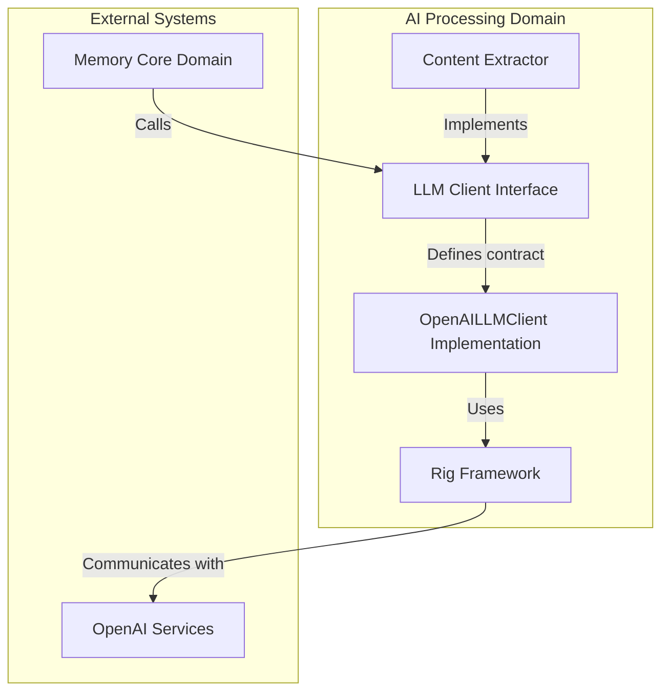
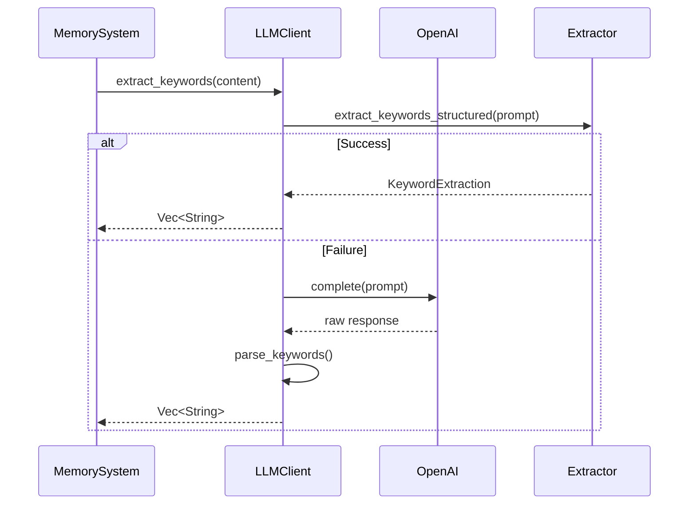

# AI Processing Domain Technical Documentation

## 1. Overview

The AI Processing Domain is a core component of the cortex-mem system, responsible for leveraging artificial intelligence models to process and analyze memory content. This domain enables intelligent operations such as embedding generation, content extraction, semantic analysis, and natural language understanding through integration with Large Language Models (LLMs).

The domain follows a modular architecture centered around the LLM Client interface, which provides standardized access to various AI capabilities while maintaining flexibility for different LLM providers. The system implements robust fallback mechanisms and structured data extraction patterns to ensure reliability and consistency in AI processing operations.

## 2. Architecture Diagram



## 3. Core Components

### 3.1 LLM Client (Primary Component)

**Module**: `cortex-mem-core/src/llm/client.rs`
**Description**: The central interface for all AI processing operations, providing a unified API for text generation, embedding creation, and structured data extraction.

#### Key Features:

- **Async Trait-Based Design**: Implements an async trait pattern (`LLMClient`) that enables non-blocking operations and supports multiple implementations.
- **Structured Extractors**: Utilizes the Rig framework to perform structured data extraction with JSON schema validation.
- **Fallback Mechanisms**: Implements graceful degradation from structured extraction to traditional text completion when needed.
- **Comprehensive Capabilities**: Supports text completion, embedding generation, keyword extraction, summarization, classification, and more.

#### Interface Definition:
```rust
#[async_trait]
pub trait LLMClient: Send + Sync + dyn_clone::DynClone {
    // Primary methods
    async fn complete(&self, prompt: &str) -> Result<String>;
    async fn embed(&self, text: &str) -> Result<Vec<f32>>;
    async fn embed_batch(&self, texts: &[String]) -> Result<Vec<Vec<f32>>>;
    
    // Content extraction methods
    async fn extract_keywords(&self, content: &str) -> Result<Vec<String>>;
    async fn summarize(&self, content: &str, max_length: Option<usize>) -> Result<String>;
    
    // Structured extraction methods
    async fn extract_structured_facts(&self, prompt: &str) -> Result<StructuredFactExtraction>;
    async fn extract_detailed_facts(&self, prompt: &str) -> Result<DetailedFactExtraction>;
    async fn classify_memory(&self, prompt: &str) -> Result<MemoryClassification>;
    async fn score_importance(&self, prompt: &str) -> Result<ImportanceScore>;
}
```

### 3.2 OpenAI Implementation

**Component**: `OpenAILLMClient`
**Implementation**: `cortex-mem-core/src/llm/client.rs`

The concrete implementation of the LLMClient trait using OpenAI services through the Rig framework. This component handles the actual communication with external LLM providers.

#### Key Characteristics:
- Uses OpenAI's GPT models for text completion tasks
- Employs specialized embedding models (e.g., text-embedding-ada-002)
- Implements connection pooling and rate limiting considerations
- Provides health checking capability via embedding requests

#### Configuration Parameters:
- `api_key`: Authentication token for OpenAI services
- `api_base_url`: Endpoint URL (supports standard and custom deployments)
- `model_efficient`: Model name for text completion
- `temperature`: Controls randomness in generated output
- `max_tokens`: Maximum response length

### 3.3 Content Extractor

**Module**: `cortex-mem-core/src/memory/extractor.rs`
**Description**: A higher-level component that uses the LLM Client to extract meaningful information from conversations and text content.

#### Functionality:
- **Fact Extraction**: Identifies important facts from dialogues
- **Entity Recognition**: Detects people, organizations, dates, and technical terms
- **Language Detection**: Automatically identifies input language
- **Sentiment Analysis**: Determines emotional tone of content
- **Conversation Analysis**: Understands context and intent

#### Extraction Strategies:
1. **DualChannel**: Extracts facts from both user and assistant messages
2. **UserOnly**: Focuses exclusively on user-provided information
3. **AssistantOnly**: Processes only assistant responses
4. **ProceduralMemory**: Specialized for step-by-step processes

## 4. Data Flow and Interaction Patterns

### 4.1 Keyword Extraction Flow



### 4.2 Fact Extraction Process

1. **Input Reception**: Receive conversation messages or text content
2. **Strategy Selection**: Analyze context to determine optimal extraction approach
3. **Prompt Construction**: Build specialized prompts based on extraction strategy
4. **Structured Extraction**: Use Rig extractors to obtain formatted results
5. **Fallback Handling**: If structured extraction fails, use traditional completion
6. **Post-processing**: Apply filtering, deduplication, and normalization
7. **Output Delivery**: Return extracted facts with metadata

## 5. Implementation Details

### 5.1 Structured Data Extraction

The system leverages Rust's type system and Serde for schema-based data extraction:

```rust
#[derive(Debug, Clone, Serialize, Deserialize, JsonSchema)]
pub struct KeywordExtraction {
    pub keywords: Vec<String>,
}

#[derive(Debug, Clone, Serialize, Deserialize, JsonSchema)]
pub struct MemoryClassification {
    pub memory_type: String,
    pub confidence: f32,
    pub reasoning: String,
}
```

This approach ensures type safety and automatic JSON schema generation for validation.

### 5.2 Fallback Mechanism

The implementation includes a sophisticated fallback strategy:

```rust
async fn extract_keywords(&self, content: &str) -> Result<Vec<String>> {
    let prompt = self.build_keyword_prompt(content);
    
    match self.extract_keywords_structured(&prompt).await {
        Ok(keyword_extraction) => {
            debug!("Extracted {} keywords using rig extractor", 
                   keyword_extraction.keywords.len());
            Ok(keyword_extraction.keywords)
        }
        Err(e) => {
            debug!("Rig extractor failed, falling back: {}", e);
            let response = self.complete(&prompt).await?;
            let keywords = self.parse_keywords(&response);
            Ok(keywords)
        }
    }
}
```

### 5.3 Intelligent Prompt Engineering

The system employs carefully crafted prompts for different extraction scenarios:

- **User Memory Extraction**: Focuses on personal preferences, background, and intentions
- **Assistant Memory Extraction**: Captures capabilities, personality traits, and knowledge areas
- **Procedural Memory Extraction**: Designed for step-by-step processes and actions
- **Conversational Analysis**: Identifies topics, sentiment, and user intent

## 6. Integration with Other Domains

### 6.1 Memory Core Domain
The AI Processing Domain integrates closely with the Memory Core Domain by:
- Providing embedding vectors for semantic search
- Enabling content classification and tagging
- Supporting memory optimization through duplicate detection
- Facilitating importance scoring for memory prioritization

### 6.2 Storage Integration Domain
While not directly interacting with storage systems, the AI Processing Domain influences storage through:
- Generating embeddings stored in Qdrant vector database
- Creating metadata used for indexing and retrieval
- Producing processed content that informs storage strategies

### 6.3 Evaluation Domain
The AI Processing Domain is extensively tested by the evaluation framework:
- Precision and recall measurements for fact extraction
- Latency benchmarks for AI processing operations
- Accuracy assessments for classification tasks
- Robustness testing of fallback mechanisms

## 7. Performance Considerations

### 7.1 Rate Limiting and Throttling
- Batch processing for multiple embedding requests
- Configurable delays in debug mode to prevent rate limits
- Connection reuse and efficient session management

### 7.2 Error Handling
- Comprehensive error types including network failures, parsing errors, and service unavailability
- Retry logic for transient failures
- Graceful degradation to alternative methods
- Detailed logging for debugging and monitoring

### 7.3 Caching Strategy
Although not explicitly implemented in the current code, potential caching opportunities include:
- Embedding cache for frequently accessed content
- Result cache for repeated queries
- Pattern recognition cache for common extraction scenarios

## 8. Security and Privacy

### 8.1 Data Protection
- API keys handled through configuration management
- Sensitive content filtered from logs in production
- Secure transmission to external LLM providers
- Optional local processing for sensitive data

### 8.2 Compliance Considerations
- Support for data anonymization before AI processing
- Audit trails for AI-assisted operations
- Consent mechanisms for processing personal information
- Data retention policies aligned with privacy requirements

## 9. Extensibility Points

### 9.1 Additional LLM Providers
The trait-based design allows easy integration of other LLM services:
- Anthropic Claude
- Google Gemini
- Local LLMs (Llama, Mistral, etc.)
- Custom enterprise models

### 9.2 New Extraction Types
The system can be extended to support additional structured extractions:
- Code snippet extraction
- Mathematical formula recognition
- Multimedia content description
- Cross-document relationship mapping

### 9.3 Enhanced Processing Capabilities
Future extensions could include:
- Multimodal processing (text + images)
- Real-time stream processing
- Collaborative filtering across multiple agents
- Adaptive learning from feedback loops

## 10. Best Practices and Recommendations

### 10.1 Configuration Guidelines
- Set appropriate temperature values based on use case (0.3-0.7 typical range)
- Configure timeouts based on expected response times
- Monitor token usage to manage costs
- Implement circuit breakers for unreliable external services

### 10.2 Monitoring and Observability
- Track success/failure rates for structured vs. fallback extraction
- Monitor latency percentiles for AI operations
- Log key metrics without exposing sensitive content
- Set up alerts for service degradation

### 10.3 Testing Strategies
- Unit tests for prompt templates and parsing logic
- Integration tests with mock LLM services
- End-to-end evaluations using synthetic datasets
- A/B testing of different extraction strategies

## 11. Known Limitations and Future Improvements

### Current Limitations:
- Single LLM provider implementation (OpenAI only)
- Limited support for non-English languages
- No built-in caching mechanism
- Fixed prompt templates with limited customization

### Recommended Enhancements:
1. **Multi-provider Support**: Implement additional LLM clients
2. **Dynamic Prompt Optimization**: Machine learning-based prompt tuning
3. **Edge Processing**: Local model options for low-latency scenarios
4. **Feedback Loop**: Incorporate user corrections to improve future extractions
5. **Cost Optimization**: Smart routing based on cost/performance trade-offs

## 12. Conclusion

The AI Processing Domain forms a critical part of the cortex-mem system, enabling intelligent understanding and manipulation of memory content through advanced language models. Its well-designed architecture balances flexibility with robustness, providing reliable AI capabilities while maintaining clean separation from other system components.

The combination of structured extraction with fallback mechanisms ensures high availability and accuracy, making it suitable for production environments where consistent performance is essential. As AI technology evolves, this domain provides a solid foundation for incorporating new capabilities while maintaining backward compatibility with existing integrations.