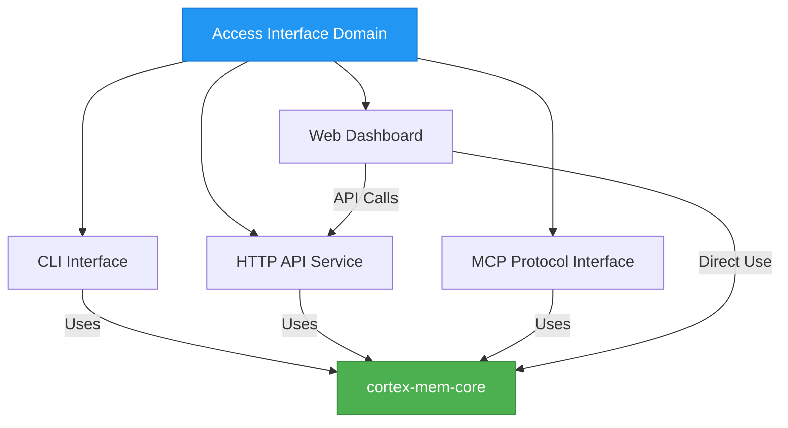
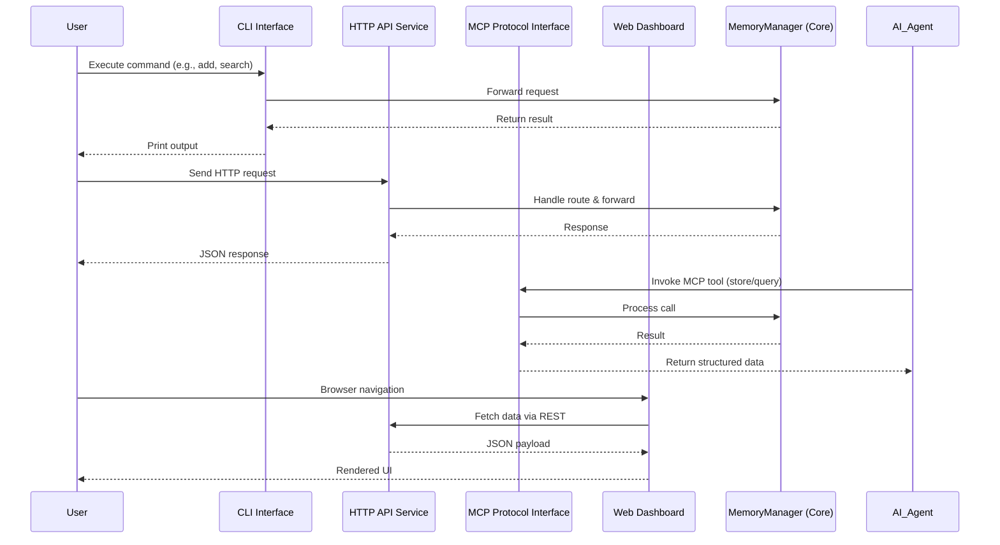

# Technical Documentation: Access Interface Domain

**Generation Time:** 2025-12-30 11:26:39 (UTC)  
**Document Version:** 1.0  
**System:** Cortex-Mem – AI Agent Memory Management System  

---

## 1. Introduction

The **Access Interface Domain** in the `cortex-mem` system provides multiple entry points for interacting with the persistent memory management capabilities of AI agents. It enables diverse user types—including developers, system administrators, and intelligent software agents—to store, retrieve, search, and optimize memories through tailored interfaces.

This domain serves as the primary interaction layer between end users/agents and the core memory engine (`cortex-mem-core`), abstracting complex operations into accessible protocols while maintaining consistency across different access methods.

### Key Objectives
- Support heterogeneous integration scenarios (CLI, API, agent tools, UI)
- Provide consistent behavior via centralized configuration
- Enable both human and machine-driven interactions
- Facilitate monitoring, debugging, and operational control

---

## 2. Architecture Overview

The Access Interface Domain follows a **multi-interface facade pattern**, where each sub-interface acts as a specialized gateway to the shared business logic implemented in `cortex-mem-core`. All interfaces depend directly on the `MemoryManager` for executing memory operations.



> **Note**: The Web Dashboard primarily communicates via the HTTP API but may also use direct core access for advanced features.

### Interaction Flow Pattern


---

## 3. Submodules and Implementation Details

The Access Interface Domain consists of four distinct submodules, each designed for specific usage patterns and target audiences.

### 3.1 CLI Interface

#### Purpose
Provides a command-line tool for direct interaction by developers and operators. Ideal for scripting, batch operations, and local development.

#### Entry Point
- **File**: `cortex-mem-cli/src/main.rs`
- **Framework**: [Clap](https://crates.io/crates/clap) for declarative argument parsing

#### Supported Commands
| Command | Functionality |
|--------|---------------|
| `add` | Store new memory with metadata |
| `search` | Semantic + metadata-filtered retrieval |
| `list` | List memories with filters |
| `delete` | Remove memory by ID |
| `optimize` | Trigger optimization workflows |
| `optimize-status` | Check ongoing job status |

#### Code Structure
```rust
// Example: AddCommand execution flow
pub async fn execute(
    &self,
    content: String,
    user_id: Option<String>,
    agent_id: Option<String>,
    memory_type: String,
) -> Result<(), Box<dyn std::error::Error>> {
    let metadata = build_metadata(user_id, agent_id, memory_type);
    
    if is_conversation(&content) {
        let messages = parse_conversation_content(&content, &user_id, &agent_id);
        self.memory_manager.add_memory(&messages, metadata).await?;
    } else {
        self.memory_manager.store(content, metadata).await?;
    }
}
```

#### Conversation Parsing Logic
Handles multi-turn dialogues from CLI input:
- Detects lines starting with `User:` or `Assistant:`
- Splits content into role-based messages
- Falls back to single-user message if no roles detected

> **Example Input**:
```
User: What's the capital of France?
Assistant: The capital of France is Paris.
```

Parsed into two `Message` objects with appropriate roles.

#### Initialization Sequence
1. Initialize tracing (`tracing_subscriber`)
2. Parse CLI arguments using Clap
3. Load config from `config.toml`
4. Auto-detect vector store and LLM client
5. Create `MemoryManager`
6. Route command to handler

---

### 3.2 HTTP API Service

#### Purpose
Exposes RESTful endpoints for programmatic access. Enables integration with external applications, microservices, and web clients.

#### Entry Point
- **File**: `cortex-mem-service/src/main.rs`
- **Framework**: [Axum](https://crates.io/crates/axum) for routing and middleware

#### Endpoint Summary
| Method | Path | Description |
|-------|------|-------------|
| GET | `/health` | System health check |
| POST | `/memories` | Create memory |
| GET | `/memories` | List memories |
| POST | `/memories/search` | Search memories (semantic + filters) |
| GET | `/memories/{id}` | Retrieve specific memory |
| PUT | `/memories/{id}` | Update memory |
| DELETE | `/memories/{id}` | Delete memory |
| POST | `/optimization` | Start optimization job |
| GET | `/optimization/{job_id}` | Get optimization status |
| GET | `/llm/status` | LLM service status |

#### Request Handling Pattern
```rust
pub async fn create_memory(
    State(state): State<AppState>,
    Json(request): Json<CreateMemoryRequest>,
) -> Result<Json<SuccessResponse>, (StatusCode, Json<ErrorResponse>)> {
    let metadata = build_metadata_from_request(&request);
    
    if is_conversation_request(&request.content) {
        let messages = parse_conversation_content(
            &request.content, 
            &request.user_id, 
            &request.agent_id
        );
        match state.memory_manager.add_memory(&messages, metadata).await { ... }
    } else {
        match state.memory_manager.store(request.content, metadata).await { ... }
    }
}
```

#### Shared State Model
```rust
#[derive(Clone)]
pub struct AppState {
    pub memory_manager: Arc<MemoryManager>,
    pub optimization_jobs: Arc<RwLock<HashMap<String, OptimizationJobState>>>,
}
```

All routes receive this state via Axum’s dependency injection mechanism.

#### Middleware
- CORS enabled permissively during development
- Structured error handling with standardized responses
- Tracing integration for observability

---

### 3.3 MCP Protocol Interface

#### Purpose
Implements the **Memory Control Protocol (MCP)** for seamless integration with AI agents. Allows agents to treat memory operations as callable tools.

#### Entry Point
- **Binary**: `cortex-mem-mcp/src/main.rs`
- **Library**: `cortex-mem-mcp/src/lib.rs`
- **Transport**: Standard I/O (stdio) for compatibility with agent frameworks

#### Implemented Tools
| Tool Name | Function |
|----------|---------|
| `store_memory` | Save a new memory |
| `query_memory` | Search memories semantically |
| `list_memories` | List memories with filters |
| `get_memory` | Retrieve memory by ID |

#### Server Handler Implementation
```rust
impl MemoryMcpService {
    async fn store_memory(
        &self,
        arguments: &Map<String, Value>,
    ) -> Result<CallToolResult, ErrorData> {
        let payload = map_mcp_arguments_to_payload(arguments, &self.agent_id);
        match self.operations.store_memory(payload).await {
            Ok(response) => Ok(CallToolResult::success(vec![Content::text(
                serde_json::to_string_pretty(&response).unwrap()
            )])),
            Err(e) => Err(self.tools_error_to_mcp_error(e))
        }
    }

    // Similar implementations for query_memory, list_memories, get_memory
}
```

#### Initialization
- Loads configuration from default or specified path
- Initializes `MemoryManager` with auto-detected components
- Sets up `MemoryOperations` wrapper
- Serves over stdio using `rmcp::transport::stdio`

#### Integration Example (Agent Side)
An AI agent can invoke:
```json
{
  "tool": "store_memory",
  "arguments": {
    "content": "The user prefers vegan meals.",
    "user_id": "usr_123",
    "memory_type": "factual"
  }
}
```

And receive confirmation of successful storage.

---

### 3.4 Web Dashboard

#### Purpose
Provides a visual interface for monitoring, managing, and analyzing memory collections. Designed for system administrators and developers needing insight into memory quality and performance.

#### Stack
- **Frontend Framework**: [Svelte](https://svelte.dev/)
- **Backend Server**: [Elysia](https://elysiajs.com/) (TypeScript)
- **Routing**: File-based SvelteKit routing
- **Styling**: Tailwind CSS

#### Entry Points
- **Server**: `cortex-mem-insights/src/server/index.ts`
- **Layout**: `cortex-mem-insights/src/routes/+layout.svelte`

#### Layout Component (`+layout.svelte`)
```svelte
<script lang="ts">
  import '../app.css';
  import { page } from '$app/stores';
  import Navigation from '$lib/components/Navigation.svelte';
  import { t } from '$lib/i18n';

  $: currentPath = $page.url?.pathname || '/';
</script>

<div class="min-h-screen bg-gray-50 dark:bg-gray-900">
  <Navigation {currentPath} />
  <main class="max-w-7xl mx-auto px-4 sm:px-6 lg:px-8 py-8">
    <slot />
  </main>
  <footer>
    <!-- Footer content -->
  </footer>
</div>
```

#### Features
- Real-time system health visualization
- Memory search and browsing
- Optimization job tracking
- Statistics dashboard (duplicates, retention, usage trends)
- Internationalization support via `$lib/i18n`

#### API Integration
Communicates with the backend via:
- `/api/memory/*` – CRUD and search operations
- `/api/optimization/*` – Optimization lifecycle
- `/api/system/*` – Health and configuration

Built using modular Elysia plugins:
```ts
.use(memoryRoutes)
.use(optimizationRoutes)
.use(systemRoutes)
```

---

## 4. Cross-Cutting Concerns

### 4.1 Configuration Management
All interfaces share a common configuration model defined in `cortex-mem-config`, loaded from `config.toml`.

Key settings include:
- Qdrant connection details
- LLM provider (OpenAI) credentials
- Server host/port (for HTTP/MCP services)
- Logging level
- Memory retention policies

Each interface reads the same config file, ensuring uniform behavior.

### 4.2 Error Handling and Logging
- Unified logging via `tracing` crate
- Structured JSON logs for machine readability
- Human-friendly CLI output formatting
- HTTP error codes and standardized error payloads
- MCP-compliant error reporting

### 4.3 Security Considerations
- No built-in authentication in current version (assumes trusted environment)
- Sensitive data protection relies on transport-level security
- Future roadmap likely includes API keys and RBAC

---

## 5. Integration with Core Domains

The Access Interface Domain depends heavily on other domains:

| From | To | Type | Purpose |
|------|----|------|--------|
| Access Interface | Memory Management | Service Call | Execute CRUD, search, optimization |
| Access Interface | Configuration Management | Configuration Dependency | Load runtime settings |
| Access Interface | LLM Integration | Indirect | Embedding generation, analysis |
| Access Interface | Storage Integration | Indirect | Vector persistence |

> **Dependency Strength**: 9.5 (Very Strong)

All interfaces delegate actual memory processing to `MemoryManager`, adhering to the principle of separation of concerns.

---

## 6. Usage Scenarios

| User Type | Preferred Interface | Use Case |
|---------|---------------------|----------|
| Developer | CLI / HTTP API | Scripting, testing, integration |
| AI Agent | MCP Protocol | Contextual memory access during reasoning |
| Operator | Web Dashboard | Monitoring, maintenance, optimization |
| Application | HTTP API | Embedded agent memory layer |

---

## 7. Development and Extension Guide

### Adding a New Command (CLI)
1. Define command struct in `commands/mod.rs`
2. Implement `execute()` method calling `MemoryManager`
3. Add variant to `Commands` enum in `main.rs`
4. Wire up in `main()` match block

### Adding a New API Endpoint
1. Define handler function in `handlers.rs`
2. Add route in `main.rs` router
3. Define request/response models in `models.rs`
4. Ensure proper error mapping

### Extending MCP Tools
1. Add new method to `MemoryMcpService`
2. Register in `ServerHandler` trait implementation
3. Update tool definitions via `get_mcp_tool_definitions()`

---

## 8. Conclusion

The **Access Interface Domain** is a critical component of the `cortex-mem` architecture, enabling flexible and secure interaction with AI agent memory systems. By providing four complementary interfaces—CLI, HTTP API, MCP, and Web Dashboard—it supports a wide range of use cases from automated agent workflows to human-operated administration.

Its design emphasizes:
- **Consistency**: Shared core logic ensures uniform behavior
- **Extensibility**: Modular structure allows adding new interfaces
- **Interoperability**: Supports both human and machine consumers
- **Observability**: Rich logging and monitoring capabilities

Future enhancements could include:
- Authentication and authorization layers
- WebSockets for real-time updates
- gRPC interface for high-performance integrations
- Plugin system for custom interface extensions

This domain exemplifies modern API-first design principles applied to AI infrastructure, making persistent memory accessible, reliable, and maintainable.