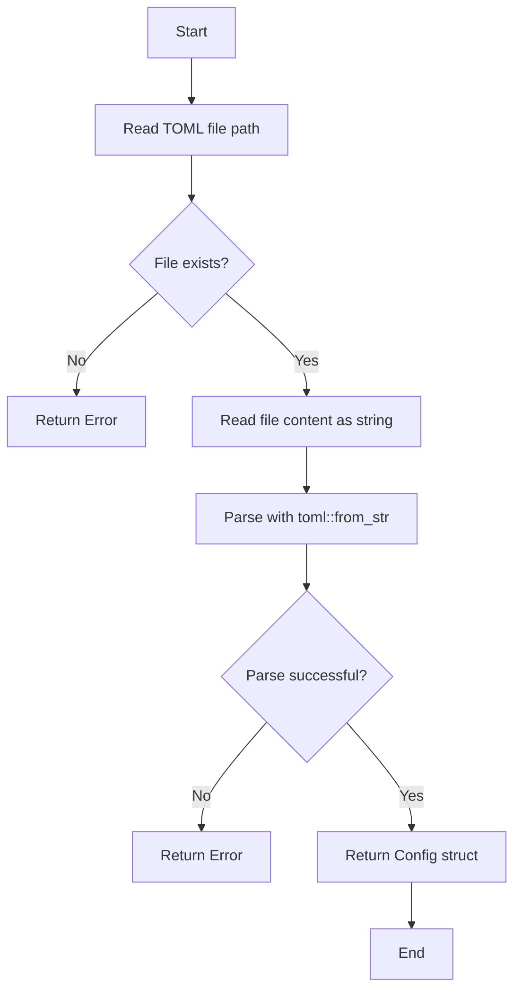
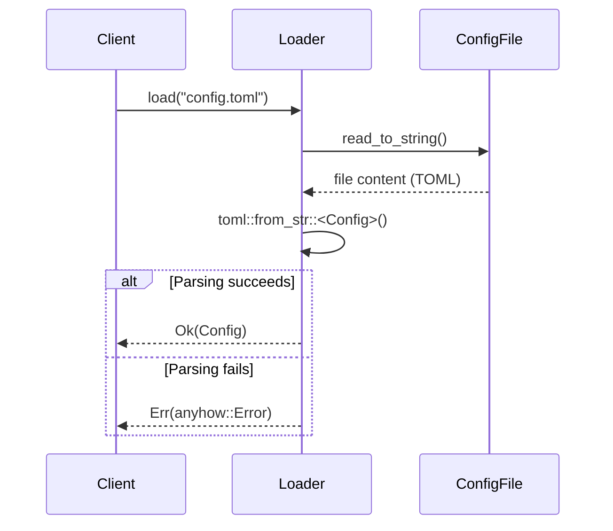
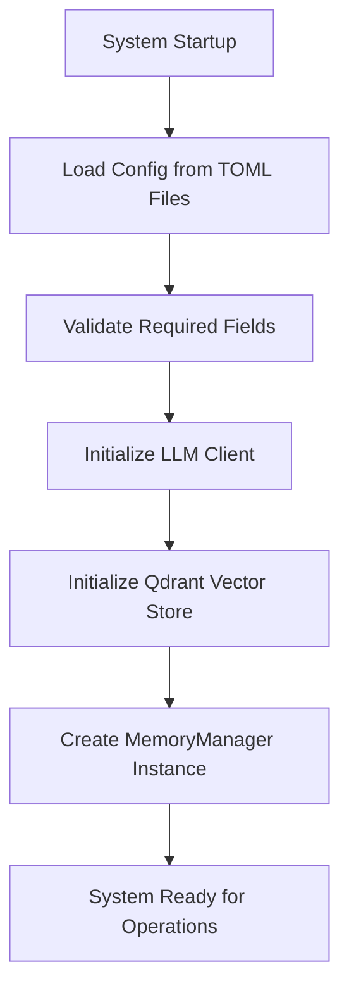

# Technical Documentation: Configuration Domain in Cortex-Mem

**Generation Time:** 2026-01-04 09:39:29 (UTC)  
**Document Version:** 1.0  
**System:** Cortex-Mem – Cognitive Memory System for AI Agents  

---

## 1. Overview

The **Configuration Domain** in the **Cortex-Mem** system is responsible for managing, loading, validating, and providing access to configuration settings across all components of the platform. It ensures consistent behavior across interfaces (CLI, HTTP API, MCP, Web Dashboard) by centralizing configuration logic and enabling environment-specific tuning through TOML-based configuration files.

This domain plays a foundational role during system initialization, serving as the source of truth for subsystem parameters including:
- Qdrant vector database connectivity
- OpenAI LLM integration
- Embedding service settings
- Memory management policies
- Logging and server configurations

It supports both file-based (`config.toml`) and programmatic configuration, with fallback mechanisms and default values to reduce deployment complexity.

---

## 2. Key Components

### 2.1 Central Configuration Loader

#### Module: `cortex-mem-config/src/lib.rs`

The **Central Configuration Loader** is the core component of the Configuration Domain. Implemented in Rust using `serde` for serialization and `anyhow` for error handling, it parses structured configuration from TOML files into a unified `Config` struct.

#### Core Features:
- **TOML-based parsing**: Uses `toml::from_str()` to deserialize configuration.
- **Hierarchical structure**: Aggregates multiple subsystem configurations into one root object.
- **Error resilience**: Returns descriptive errors via `anyhow::Result<Config>`.
- **Extensibility**: New subsystems can be added without modifying loader logic.

#### Data Model (`Config` Struct):
```rust
#[derive(Debug, Clone, Serialize, Deserialize)]
pub struct Config {
    pub qdrant: QdrantConfig,
    pub llm: LLMConfig,
    pub server: ServerConfig,
    pub embedding: EmbeddingConfig,
    pub memory: MemoryConfig,
    pub logging: LoggingConfig,
    pub api: TarsApiConfig,  // Cortex TARS specific configuration
}
```

Each nested struct corresponds to a subsystem:

| Subsystem | Purpose |
|---------|--------|
| `QdrantConfig` | Vector store connection URL, collection name, timeout, optional embedding dimension |
| `LLMConfig` | OpenAI API base URL, key, model selection, temperature, token limits |
| `ServerConfig` | Host/IP and port for HTTP/MCP services, CORS policy |
| `EmbeddingConfig` | Embedding model endpoint, batch size, request timeout |
| `MemoryConfig` | Memory retention rules, deduplication thresholds, search limits |
| `LoggingConfig` | Log output directory, verbosity level, enable/disable flag |
| `TarsApiConfig` | Cortex TARS API server settings including port, API key, and CORS configuration |

#### Cortex TARS Configuration Example

Cortex TARS uses an extended configuration structure that includes all Cortex-Mem settings plus TARS-specific options:

```toml
# Cortex TARS configuration file example (config.toml)

[qdrant]
url = "http://localhost:6334"
collection_name = "cortex_mem"
embedding_dim = 1536
timeout_secs = 30

[llm]
api_base_url = "https://api.openai.com/v1"
api_key = "your-api-key-here"
model_efficient = "gpt-4o-mini"
temperature = 0.7
max_tokens = 2000

[embedding]
api_base_url = "https://api.openai.com/v1"
api_key = "your-api-key-here"
model_name = "text-embedding-3-small"
batch_size = 100
timeout_secs = 30

[memory]
max_memories = 10000
similarity_threshold = 0.65
max_search_results = 50
auto_summary_threshold = 32768
auto_enhance = true
deduplicate = true
merge_threshold = 0.75
search_similarity_threshold = 0.70

[server]
host = "localhost"
port = 8080
cors_origins = ["*"]

[api]
# Cortex TARS API server configuration
port = 8080
api_key = "ANYTHING_YOU_LIKE"
enable_cors = true

[logging]
enabled = true
log_directory = "logs"
level = "info"
```

#### Default Implementations:
To simplify deployment, two structs implement `Default`:

##### `impl Default for MemoryConfig`
```rust
max_memories: 10000,
similarity_threshold: 0.65,
max_search_results: 50,
auto_summary_threshold: 32768,
auto_enhance: true,
deduplicate: true,
merge_threshold: 0.75,
search_similarity_threshold: Some(0.70),
```

##### `impl Default for LoggingConfig`
```rust
enabled: false,
log_directory: "logs".to_string(),
level: "info".to_string(),
```

These defaults allow minimal configuration while supporting advanced tuning when needed.

#### Loading Workflow:


#### Sequence Diagram:


---

### 2.2 Configuration Validator

#### Module: `examples/lomoco-evaluation/src/cortex_mem/config_utils.py`

A Python utility used primarily in evaluation scripts to validate the presence and correctness of required fields before running benchmarks.

#### Key Functions:
- `validate_config(config_path)`  
  Checks that:
  - File exists
  - Required sections exist: `[llm]`, `[embedding]`, `[qdrant]`, `[memory]`
  - Critical keys are present within each section

- `get_config_value(config_path, section, key, default=None)`  
  Safely retrieves individual configuration values with fallback support.

- `check_openai_config(config_path)`  
  Validates that both LLM and embedding services have valid API keys and endpoints set.

#### Use Case:
Used in automated testing pipelines to prevent execution with incomplete or misconfigured setups.

---

### 2.3 Agent Profile Manager

#### Module: `examples/cortex-mem-tars/src/config.rs`

Manages persistent storage of agent profiles (bots), implemented as a separate configuration manager that integrates with the main `cortex-mem-config`.

#### Key Structures:
- `BotConfig`: Stores metadata about an AI agent (ID, name, system prompt, password, creation timestamp).
- `ConfigManager`: Handles persistence of bots in `bots.json` and manages lifecycle operations.

#### Integration with Central Config:
The `ConfigManager` loads the global `Config` from `cortex-mem-config`, applying fallback logic:
1. First attempts to load `config.toml` from current working directory
2. Falls back to system-wide config directory (e.g., `~/.config/cortex/mem-tars/`)
3. If no config exists, creates a default one with sensible values (e.g., local Qdrant at `http://localhost:6334`, OpenAI defaults)

#### Example Default Values:
```toml
[qdrant]
url = "http://localhost:6334"
collection_name = "cortex_mem"
embedding_dim = 1536
timeout_secs = 30

[llm]
api_base_url = "https://api.openai.com/v1"
api_key = ""
model_efficient = "gpt-4o-mini"
temperature = 0.7
max_tokens = 2000

[embedding]
api_base_url = "https://api.openai.com/v1"
model_name = "text-embedding-3-small"
api_key = ""
batch_size = 100
timeout_secs = 30
```

When created, this default config is written to disk using `toml::to_string_pretty()` for readability.

---

## 3. Interaction with Other Domains

### 3.1 Dependency Flow
The Configuration Domain provides essential setup data to other domains during initialization:

| From → To | Interaction Type | Description |
|----------|------------------|-------------|
| **Configuration Domain → Core Memory Domain** | Configuration Injection | Supplies validated `Config` to initialize LLM client, Qdrant adapter, and memory policies |
| **Configuration Domain → Tool Support Domain** | Shared Initialization | CLI, HTTP server, MCP handler, and dashboard use config to connect to core services |
| **Tool Support Domain → Configuration Domain** | Validation & Access | Evaluation tools and CLI commands independently validate or read config files |

### 3.2 Initialization Process
As part of the **Configuration and Initialization Process**, the workflow proceeds as follows:



All interface layers (CLI, HTTP, MCP) invoke this process on startup to ensure alignment with the same configuration state.

---

## 4. Practical Implementation Details

### 4.1 File Location and Search Order
Cortex-Mem searches for `config.toml` in the following order:
1. Current working directory
2. System configuration directory (via `directories` crate):
   - Linux: `~/.config/cortex/mem-tars/`
   - macOS: `~/Library/Application Support/com.cortex.mem-tars/`
   - Windows: `%APPDATA%\com.cortex\mem-tars\`

This allows per-project overrides while maintaining user-level defaults.

### 4.2 Environment-Specific Configuration
While not explicitly shown in current code, the architecture supports:
- Multiple config profiles (e.g., `config.dev.toml`, `config.prod.toml`)
- Environment variable overrides (planned enhancement)
- Programmatic configuration injection (used in test suites)

### 4.3 Extensibility Guidelines
New subsystems can integrate with the configuration system by:
1. Defining a new config struct with `Serialize + Deserialize` traits
2. Adding it as a field in the root `Config` struct
3. Optionally implementing `Default` if fallback values are appropriate
4. Updating documentation and validation utilities accordingly

Example:
```rust
#[derive(Debug, Clone, Serialize, Deserialize)]
pub struct CacheConfig {
    pub enabled: bool,
    pub ttl_minutes: u32,
    pub max_entries: usize,
}

// In Config:
pub cache: CacheConfig,
```

---

## 5. Best Practices and Recommendations

### ✅ Recommended Usage Patterns
- **Always validate config early**: Use `validate_config()` in entry points to fail fast.
- **Use defaults wisely**: Leverage `Default` impls to reduce boilerplate in development.
- **Secure sensitive data**: Never commit API keys; rely on runtime input or secrets management.
- **Version control structure only**: Commit sample or schema files (e.g., `config.example.toml`), not actual keys.

### ⚠️ Known Limitations
- No support for environment variables yet (hardcoded file paths only)
- Limited dynamic reloading (config is loaded once at startup)
- Python validator duplicates some logic already handled in Rust (potential refactoring opportunity)

### 🔧 Suggested Improvements
1. **Add `.env` file support** for overriding TOML values
2. **Implement hot-reload capability** for long-running services
3. **Unify validation logic** in Rust and expose via FFI or CLI tool
4. **Support JSON/YAML formats** alongside TOML for broader compatibility

---

## 6. Summary

The **Configuration Domain** in Cortex-Mem provides a robust, type-safe foundation for managing system-wide settings. Built around a centralized TOML loader in Rust, it enables reliable initialization of all components and promotes consistency across deployment environments.

Its modular design supports extensibility, with clear separation between:
- **Loading** (`cortex-mem-config`)
- **Validation** (Python/Rust utilities)
- **Application-specific extensions** (Agent Profile Manager)

By combining strong defaults with flexible override mechanisms, the domain balances ease of use with production-grade configurability—making it a critical enabler of Cortex-Mem’s adaptability across diverse AI agent deployments.

--- 

*End of Document*