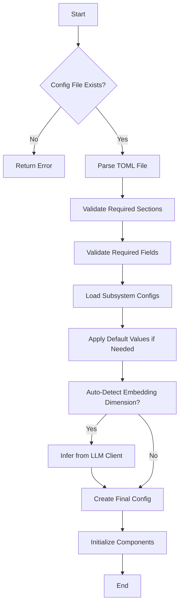
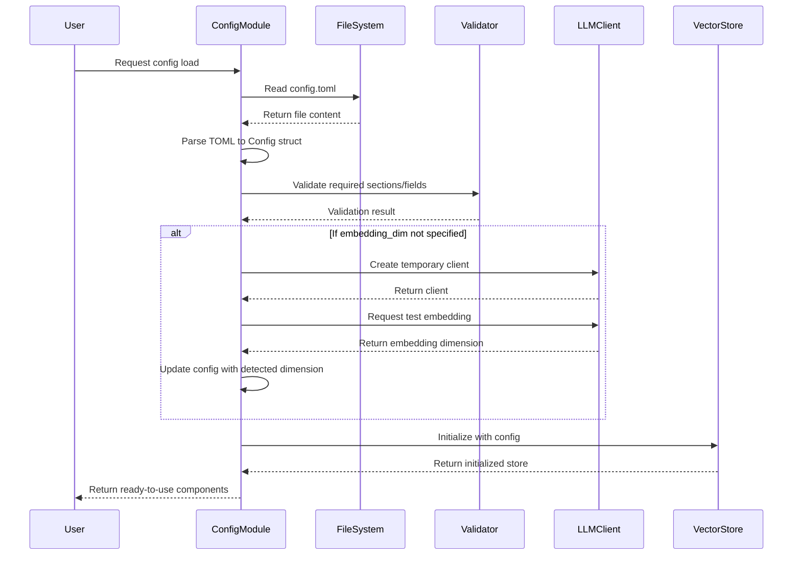
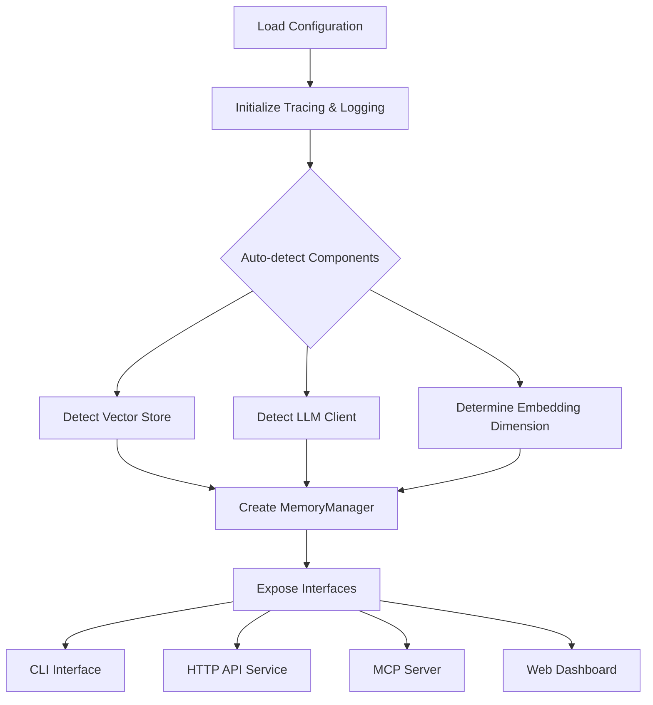

# Configuration Management Domain Technical Documentation

## 1. Overview

The Configuration Management Domain serves as the centralized configuration system for the Cortex-Mem platform, providing a unified approach to manage application settings across all components. This domain ensures consistent behavior and proper initialization of the memory management system by defining comprehensive configuration schemas and implementing robust loading, validation, and auto-detection mechanisms.

As an Infrastructure Domain with high importance (8.0/10), the Configuration Management system acts as the single source of truth for settings that govern various subsystems including vector database connectivity, LLM integration, HTTP server parameters, embedding services, and memory management policies. The system is implemented primarily in Rust with supporting Python utilities for validation, following a modular design that enables extensibility while maintaining type safety.

## 2. Architecture and Design

### 2.1 Component Structure

The Configuration Management Domain consists of three primary components:

- **Config Structure**: Defines the schema and data types for configuration through Rust structs with serde serialization
- **Config Loading**: Handles file parsing and error propagation using TOML format
- **Config Validation**: Ensures configuration integrity through both structural and content validation

The core implementation resides in `cortex-mem-config/src/lib.rs`, which exports a comprehensive set of configuration structs that are consumed by other components during initialization.

### 2.2 Key Data Structures

The configuration system is built around a hierarchical structure of Rust structs that represent different subsystem configurations:

```rust
#[derive(Debug, Clone, Serialize, Deserialize)]
pub struct Config {
    pub qdrant: QdrantConfig,
    pub llm: LLMConfig,
    pub server: ServerConfig,
    pub embedding: EmbeddingConfig,
    pub memory: MemoryConfig,
    pub logging: LoggingConfig,
}
```

Each subsystem has its own dedicated configuration struct with specific fields relevant to its operation:

- **QdrantConfig**: Manages vector database connection parameters
- **LLMConfig**: Handles language model service credentials and behavior
- **ServerConfig**: Controls HTTP server binding and CORS policies
- **EmbeddingConfig**: Configures embedding generation service
- **MemoryConfig**: Defines memory management policies and thresholds
- **LoggingConfig**: Specifies logging behavior and output destinations

### 2.3 Design Principles

The configuration system adheres to several key design principles:

1. **Type Safety**: Leverages Rust's strong typing system to prevent invalid configurations at compile time
2. **Default Values**: Implements sensible defaults through the `Default` trait for optional parameters
3. **Extensibility**: Supports adding new configuration sections without breaking existing code
4. **Validation**: Provides multi-layered validation to ensure configuration correctness
5. **Auto-detection**: Includes intelligent features like automatic embedding dimension detection

## 3. Implementation Details

### 3.1 Configuration Schema

The configuration schema is defined using Rust's derive macros for Serde, enabling seamless serialization between TOML files and in-memory data structures. The main `Config` struct composes multiple subsystem configurations, creating a comprehensive hierarchy that covers all aspects of the system.

Key implementation features include:

- **Serde Integration**: Uses `#[derive(Serialize, Deserialize)]` for automatic TOML parsing
- **Error Handling**: Employs `anyhow::Result` for rich error propagation with context
- **Path Abstraction**: Accepts generic path types through `AsRef<Path>` for flexibility
- **Clone Support**: Implements `Clone` trait to enable configuration sharing across components

### 3.2 Default Values Implementation

The system implements default values for optional parameters through Rust's `Default` trait, ensuring that required functionality works even when users don't specify all settings:

```rust
impl Default for MemoryConfig {
    fn default() -> Self {
        MemoryConfig {
            max_memories: 10000,
            similarity_threshold: 0.65,
            max_search_results: 50,
            memory_ttl_hours: None,
            auto_summary_threshold: 32768,
            auto_enhance: true,
            deduplicate: true,
            merge_threshold: 0.75,
            search_similarity_threshold: Some(0.70),
        }
    }
}

impl Default for LoggingConfig {
    fn default() -> Self {
        LoggingConfig {
            enabled: false,
            log_directory: "logs".to_string(),
            level: "info".to_string(),
        }
    }
}
```

This approach provides sensible defaults while still allowing users to override them through the configuration file.

### 3.3 Auto-detection Mechanism

One of the advanced features of the configuration system is the ability to auto-detect embedding dimensions when not explicitly specified. This is particularly valuable because embedding dimensions vary between different LLM models and services.

The auto-detection workflow is implemented in `cortex-mem-core/src/init/mod.rs`:

1. When `embedding_dim` is not specified in the Qdrant configuration
2. A temporary LLM client is created using the provided API credentials
3. A test embedding is generated for a sample text ("test")
4. The dimension of the resulting embedding vector is detected
5. The configuration is updated with the detected dimension

```rust
pub async fn create_auto_config(
    base_config: &QdrantConfig,
    llm_client: &dyn LLMClient,
) -> Result<QdrantConfig> {
    let mut config = base_config.clone();
    
    if config.embedding_dim.is_none() {
        info!("Auto-detecting embedding dimension for configuration...");
        let test_embedding = llm_client.embed(\"test\").await?;
        let detected_dim = test_embedding.len();
        info!(\"Detected embedding dimension: {}\", detected_dim);
        config.embedding_dim = Some(detected_dim);
    }
    
    Ok(config)
}
```

This feature eliminates configuration errors related to mismatched embedding dimensions and improves user experience by reducing setup complexity.

## 4. Configuration Workflow

### 4.1 Configuration Loading Process

The configuration loading process follows a well-defined sequence:



### 4.2 Sequence of Operations

The detailed sequence of operations during configuration loading:



## 5. Configuration File Format

### 5.1 TOML Configuration Structure

The system uses TOML (Tom's Obvious, Minimal Language) as the configuration file format due to its readability and support for complex data structures. The main configuration file (`config.toml`) contains the following sections:

```toml
# Main configuration for the cortex-mem system

[qdrant]
url = "http://localhost:6334"
collection_name = "cortex-mem-hewlett_drawn"
# embedding_dim = 1024 # Optional, will be auto-detected if not specified
timeout_secs = 30

[llm]
api_base_url = "https://wanqing-api.corp.kuaishou.com/api/gateway/v1/endpoints"
api_key = "fs2wzco3o7haz38df1jo4vavnvauxtuz3f0b"
model_efficient = "ep-i4abhq-1764595896785685523"
temperature = 0.1
max_tokens = 4096

[server]
host = "0.0.0.0"
port = 3000
cors_origins = ["*"]

[embedding]
api_base_url = "https://wanqing-api.corp.kuaishou.com/api/gateway/v1/endpoints"
api_key = "fs2wzco3o7haz38df1jo4vavnvauxtuz3f0b"
model_name = "ep-9kf01g-1762237999831608613"
batch_size = 10
timeout_secs = 30

[memory]
max_memories = 10000
max_search_results = 50
# memory_ttl_hours = 24 # Optional
auto_summary_threshold = 4096
auto_enhance = true
deduplicate = true
similarity_threshold = 0.65
merge_threshold = 0.75
search_similarity_threshold = 0.5

[logging]
enabled = true
log_directory = "logs"
level = "debug"
```

### 5.2 Required vs. Optional Parameters

The configuration system distinguishes between required and optional parameters:

**Required Parameters:**
- `qdrant.url`: Vector database endpoint URL
- `qdrant.collection_name`: Name of the collection in Qdrant
- `llm.api_base_url`: LLM service API endpoint
- `llm.api_key`: Authentication key for LLM service
- `llm.model_efficient`: Model identifier for efficient operations
- `embedding.api_base_url`: Embedding service API endpoint
- `embedding.api_key`: Authentication key for embedding service
- `embedding.model_name`: Model identifier for embeddings

**Optional Parameters with Defaults:**
- `qdrant.embedding_dim`: Auto-detected if not specified
- `memory.memory_ttl_hours`: No expiration if not specified
- `memory.search_similarity_threshold`: Defaults to 0.70
- `logging.enabled`: Defaults to false
- `logging.level`: Defaults to "info"

## 6. Validation System

### 6.1 Multi-Layered Validation Approach

The configuration system employs a multi-layered validation strategy to ensure configuration integrity:

1. **Structural Validation**: Performed automatically by Serde during TOML deserialization
2. **Content Validation**: Implemented through custom Python utilities in `examples/lomoco-evaluation/src/cortex_mem/config_utils.py`
3. **Runtime Validation**: Conducted during component initialization

### 6.2 Validation Implementation

The Python-based validation utilities provide comprehensive checking of configuration completeness:

```python
def validate_config(config_path: str) -> bool:
    """Validate that config file exists and has required settings."""
    if not os.path.exists(config_path):
        print(f"Config file not found: {config_path}")
        return False
    
    try:
        with open(config_path, 'r') as f:
            content = f.read()
        
        # Check for required sections
        required_sections = ["llm", "embedding", "qdrant", "memory"]
        missing_sections = []
        
        for section in required_sections:
            if f"[{section}]" not in content:
                missing_sections.append(section)
        
        if missing_sections:
            print(f"Missing required sections in config: {missing_sections}")
            return False
        
        # Check for required fields in each section
        import toml
        config_data = toml.load(config_path)
        
        # Check llm section
        if "llm" in config_data:
            llm = config_data["llm"]
            required_llm_fields = ["api_key", "api_base_url", "model_efficient"]
            missing_llm = [field for field in required_llm_fields if field not in llm]
            if missing_llm:
                print(f"Missing fields in [llm] section: {missing_llm}")
                return False
        
        # Similar checks for embedding, qdrant, and other sections
        return True
        
    except Exception as e:
        print(f"Error validating config: {e}")
        return False
```

The validation system checks for:
- Existence of the configuration file
- Presence of required sections (`[llm]`, `[embedding]`, `[qdrant]`, `[memory]`)
- Required fields within each section
- Valid data types and formats

### 6.3 OpenAI-Specific Validation

A specialized validation function checks OpenAI configuration specifically:

```python
def check_openai_config(config_path: str) -> bool:
    """Check if OpenAI configuration is properly set."""
    try:
        import toml
        config_data = toml.load(config_path)
        
        # Check llm section
        if "llm" not in config_data:
            print("Missing [llm] section in config")
            return False
        
        llm = config_data["llm"]
        if "api_key" not in llm or not llm["api_key"]:
            print("OpenAI API key not set in [llm] section")
            return False
        
        if "api_base_url" not in llm or not llm["api_base_url"]:
            print("OpenAI API base URL not set in [llm] section")
            return False
        
        # Check embedding section
        if "embedding" not in config_data:
            print("Missing [embedding] section in config")
            return False
        
        embedding = config_data["embedding"]
        if "api_key" not in embedding or not embedding["api_key"]:
            print("OpenAI API key not set in [embedding] section")
            return False
        
        return True
        
    except Exception as e:
        print(f"Error checking OpenAI config: {e}")
        return False
```

## 7. Integration with Other Domains

### 7.1 Configuration Dependencies

The Configuration Management Domain serves as a foundational component that other domains depend on for their operation:

| Dependent Domain | Configuration Usage |
|------------------|----------------------|
| **Storage Integration Domain** | Uses Qdrant configuration for vector database connectivity |
| **LLM Integration Domain** | Uses LLM and embedding configurations for service authentication and behavior |
| **Memory Optimization Domain** | Uses memory configuration for optimization thresholds and strategies |
| **Access Interface Domain** | Uses server and logging configurations for interface behavior |

### 7.2 Initialization Flow

During system startup, the configuration system plays a critical role in the initialization workflow:



The configuration is loaded first, then used to initialize tracing and logging systems, followed by auto-detection of components based on the provided settings.

## 8. Best Practices and Recommendations

### 8.1 Configuration Management Best Practices

1. **Environment-Specific Configuration**: Use different configuration files for development, testing, and production environments
2. **Secret Management**: Never commit API keys to version control; use environment variables or secret management tools
3. **Version Control**: Keep configuration files under version control (without secrets) to track changes
4. **Documentation**: Document all configuration options and their effects
5. **Testing**: Validate configuration changes in non-production environments before deployment

### 8.2 Security Considerations

1. **API Key Protection**: Ensure API keys are stored securely and have appropriate access controls
2. **Network Security**: Use HTTPS for all external service communications
3. **Input Validation**: Validate all configuration inputs to prevent injection attacks
4. **Least Privilege**: Configure API keys with minimal required permissions
5. **Audit Logging**: Enable logging to monitor configuration changes and access patterns

### 8.3 Performance Optimization

1. **Caching**: Cache configuration data in memory to avoid repeated file I/O
2. **Connection Pooling**: Use connection pooling for database and API connections
3. **Batch Processing**: Configure appropriate batch sizes for embedding generation
4. **Timeout Settings**: Set reasonable timeouts to prevent hanging operations
5. **Resource Limits**: Configure memory limits to prevent resource exhaustion

## 9. Future Enhancements

Potential improvements to the Configuration Management Domain include:

1. **Dynamic Reloading**: Support for reloading configuration without restarting the system
2. **Remote Configuration**: Integration with configuration servers for centralized management
3. **Configuration Versioning**: Support for versioned configurations and rollback capabilities
4. **Schema Validation**: JSON Schema-based validation for additional integrity checks
5. **Environment Variables**: Enhanced support for environment variable overrides
6. **Configuration Templates**: Support for template-based configuration generation
7. **Validation Rules Engine**: More sophisticated validation rules based on inter-parameter dependencies

These enhancements would further improve the flexibility, security, and maintainability of the configuration system while supporting more complex deployment scenarios.