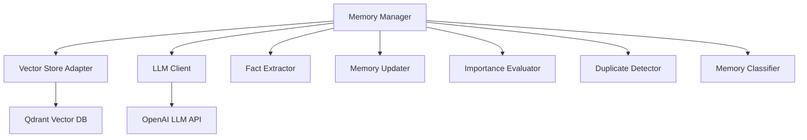
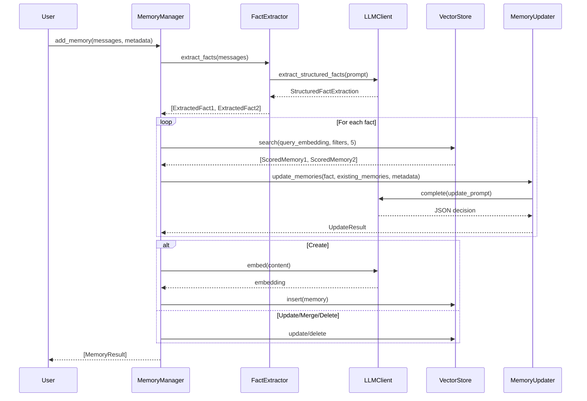
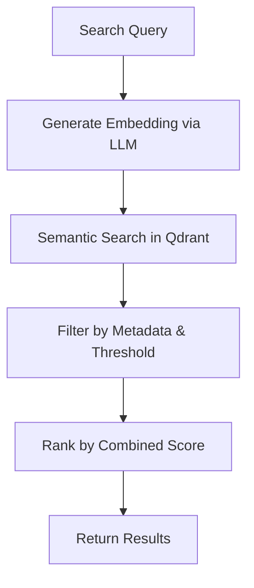
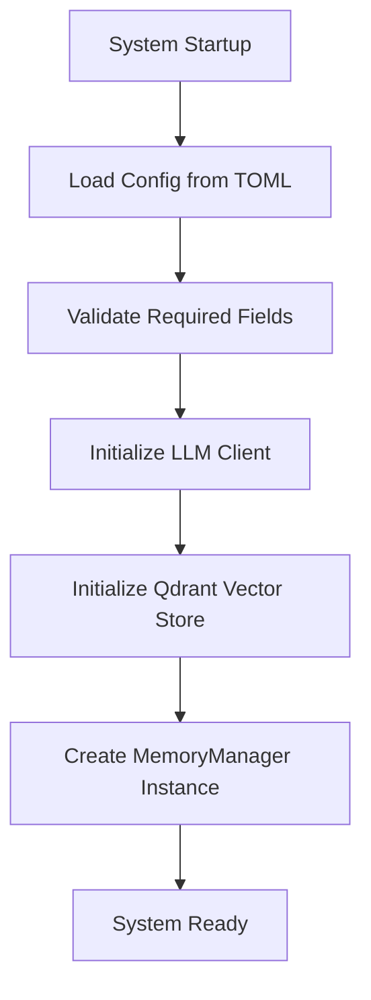

# Technical Documentation: Core Memory Domain

**Generation Time:** 2024-07-15T18:36:16.000Z  
**Timestamp:** 1721068576

---

## 1. Overview

The **Core Memory Domain** is the central intelligence engine of the `cortex-mem` system, responsible for managing the entire lifecycle of AI agent memories. It enables persistent, context-aware interactions by storing, retrieving, optimizing, and analyzing conversational and factual data using vector embeddings and Large Language Models (LLMs).

This domain orchestrates all memory operations—including creation, retrieval, update, deletion, deduplication, classification, and importance evaluation—through a modular architecture that integrates with external services like Qdrant (vector database) and OpenAI (LLM provider). It serves as the foundational layer upon which all other interfaces (CLI, HTTP API, MCP, Web Dashboard) are built.

### Key Characteristics
- **Primary Responsibility**: Persistent memory management for AI agents.
- **Core Value Proposition**: Enables long-term context retention, reduces redundant interactions, improves response accuracy, and supports personalized user experiences.
- **Integration Hub**: Acts as the central point connecting LLMs, vector storage, and application interfaces.
- **Optimization Focus**: Automatically enhances memory quality through deduplication, merging, and metadata enrichment.

---

## 2. Architecture and Components

The Core Memory Domain follows a dependency-injection-based, modular design in Rust, ensuring high cohesion and low coupling between components. The primary architectural pattern revolves around a central `MemoryManager` that coordinates specialized submodules via well-defined traits.

### High-Level Component Diagram


### Submodules

| Module | Purpose | Key Functions |
|-------|--------|---------------|
| **Memory Manager** | Central orchestrator of all memory operations | `create_memory`, `search`, `add_memory`, `update`, `delete` |
| **LLM Client** | Unified interface to OpenAI services | `embed`, `complete`, `extract_structured_facts`, `summarize` |
| **Vector Store Adapter** | Abstracts interaction with Qdrant | `insert`, `search_with_threshold`, `get`, `list`, `delete` |
| **Fact Extractor** | Parses conversation messages into structured facts | `extract_facts`, `extract_user_facts`, `extract_assistant_facts` |
| **Memory Updater** | Determines create/update/merge/delete actions based on LLM analysis | `update_memories`, `should_merge`, `merge_memories` |
| **Importance Evaluator** | Scores memory relevance using LLM-driven analysis | `evaluate_importance` |
| **Duplicate Detector** | Identifies and merges redundant memories | `detect_duplicates`, `merge_memories` |
| **Memory Classifier** | Categorizes memory content into types (e.g., Conversational, Procedural) | `classify_memory`, `extract_entities`, `extract_topics` |

All modules are designed to be replaceable via trait objects (`dyn Trait`), enabling future extensibility (e.g., swapping LLM providers or vector databases).

---

## 3. Data Model

The core data structures are defined in `cortex-mem-core/src/types.rs`. These types ensure consistency across serialization boundaries and support rich metadata filtering.

### Primary Structures

#### `Memory`
Represents a single stored memory entry.

```rust
pub struct Memory {
    pub id: String,
    pub content: String,
    pub embedding: Vec<f32>,
    pub metadata: MemoryMetadata,
    pub created_at: DateTime<Utc>,
    pub updated_at: DateTime<Utc>,
}
```

#### `MemoryMetadata`
Contains semantic and operational metadata for filtering and categorization.

```rust
pub struct MemoryMetadata {
    pub user_id: Option<String>,
    pub agent_id: Option<String>,
    pub run_id: Option<String>,
    pub actor_id: Option<String>,
    pub role: Option<String>,
    pub memory_type: MemoryType,
    pub hash: String,
    pub importance_score: f32,
    pub entities: Vec<String>,
    pub topics: Vec<String>,
    pub custom: HashMap<String, serde_json::Value>,
}
```

#### `MemoryType` (Enum)
Categorizes memory content for targeted retrieval.

```rust
pub enum MemoryType {
    Conversational,
    Procedural,
    Factual,
    Semantic,
    Episodic,
    Personal,
}
```

> **Note**: Default type is `Conversational` for unrecognized inputs.

#### `ScoredMemory`
Used in search results to include similarity scores.

```rust
pub struct ScoredMemory {
    pub memory: Memory,
    pub score: f32,
}
```

#### `Filters`
Enables complex queries during retrieval.

```rust
pub struct Filters {
    pub user_id: Option<String>,
    pub agent_id: Option<String>,
    pub memory_type: Option<MemoryType>,
    pub min_importance: Option<f32>,
    pub max_importance: Option<f32>,
    // ... additional fields
}
```

---

## 4. Core Workflows

### 4.1 Memory Addition Process

This workflow handles both direct content ingestion and conversation-based fact extraction.

#### Sequence Flow


#### Key Implementation Details
- **Content Hashing**: SHA-256 used to detect exact duplicates.
- **Fallback Extraction**: If no facts are extracted from full conversation:
  1. Try extracting only from user messages.
  2. Fall back to individual message processing.
  3. As last resort, store concatenated user messages.
- **Auto-Enhancement**: When enabled (`auto_enhance = true`), new memories are enriched with:
  - Keywords
  - Summary (if content > threshold)
  - Entities & Topics
  - Importance Score
  - Memory Type Classification

---

### 4.2 Memory Retrieval Process

Semantic search powered by vector similarity and metadata filtering.

#### Workflow


#### Ranking Strategy
Results are ranked using a weighted combination:

```
combined_score = (similarity_score × 0.7) + (importance_score × 0.3)
```

This ensures semantically relevant but unimportant memories do not dominate results.

#### Similarity Threshold
Configurable via `search_similarity_threshold`. Two modes supported:
- **Database-level filtering**: Passed directly to Qdrant.
- **Application-level filtering**: Post-process results after retrieval.

Default behavior uses config-defined threshold.

---

### 4.3 Memory Optimization Process

Automated maintenance to improve memory quality and reduce redundancy.

#### Steps
1. Analyze corpus using LLM-guided detectors.
2. Generate optimization plan (merge, update, delete).
3. Execute changes safely.
4. Report metrics (space saved, duplicates removed).

#### Deduplication Logic
Uses dual-layer detection:
1. **Exact Match**: Content hashing.
2. **Semantic Similarity**: Cosine similarity ≥ `merge_threshold`.

When merging, an LLM generates consolidated content preserving key information.

---

## 5. Integration Points

### 5.1 With External Systems

| System | Role | Interaction Type |
|-------|------|------------------|
| **Qdrant Vector Database** | Primary storage for embeddings and metadata | gRPC/HTTP calls via `qdrant-client` crate |
| **OpenAI LLM Service** | Embedding generation, summarization, classification, reasoning | REST API calls via `rig` framework |
| **LangMem** | Benchmark baseline for evaluation | Side-by-side testing in `lomoco-evaluation` suite |

### 5.2 Internal Dependencies

| From | To | Relation |
|------|----|---------|
| Tool Support Domain (CLI, HTTP, MCP) | Core Memory Domain | Direct method calls to `MemoryManager` |
| Configuration Domain | Core Memory Domain | Injected at initialization (`MemoryConfig`) |
| Core Memory Domain | Tool Support Domain | Uses shared utilities (error types, serializers) |

---

## 6. Configuration and Initialization

The Core Memory Domain is initialized with dependencies injected from the Configuration Domain.

### Initialization Flow


### Key Configurable Parameters
| Parameter | Description | Example |
|---------|-----------|--------|
| `embedding_dim` | Dimensionality of embeddings | 1536 (text-embedding-ada-002) |
| `deduplicate` | Enable/disable duplicate detection | true |
| `auto_enhance` | Auto-generate metadata (summary, keywords, etc.) | true |
| `auto_summary_threshold` | Minimum length to trigger auto-summary | 500 characters |
| `similarity_threshold` | Minimum cosine similarity for relatedness | 0.75 |
| `merge_threshold` | Threshold for automatic merge decisions | 0.85 |
| `search_similarity_threshold` | Filter threshold for search results | 0.70 |

> **Auto-detection**: If `embedding_dim` is not set, it's inferred by generating a test embedding.

---

## 7. Error Handling and Resilience

The system implements robust error handling strategies:

- **LLM Failures**: Graceful fallbacks; empty or default values where appropriate.
- **Empty Content Protection**: Prevents storage of blank memories.
- **UUID Mapping for Hallucinations**: Handles cases where LLM refers to non-existent memory IDs by mapping hypothetical indices to real UUIDs.
- **Code Block Sanitization**: Removes Markdown code blocks before parsing JSON responses from LLMs.
- **JSON Extraction Robustness**: Multiple strategies to extract valid JSON from malformed LLM outputs.

Example resilience mechanism in `MemoryUpdater::parse_update_decisions()`:
```rust
// Attempt direct parse
match serde_json::from_str(json_str) {
    Ok(decisions) => return Ok(decisions),
    Err(_) => {
        // Try extracting JSON from code blocks
        let extracted = self.extract_json_from_response(&cleaned_response)?;
        match serde_json::from_str::<Vec<Value>>(&extracted) {
            Ok(decisions) => return Ok(decisions),
            Err(_) => return Ok(vec![]), // Silent fail with empty list
        }
    }
}
```

---

## 8. Performance and Scalability Considerations

### Efficiency Features
- **Batch Operations**: Support for batch embedding and upserting.
- **Caching Layer**: Not currently implemented; potential area for improvement.
- **Asynchronous Design**: All critical paths use async/await for non-blocking I/O.
- **Selective Enhancement**: Only enhance long or important memories.

### Bottlenecks
- **LLM Latency**: Each fact extraction and decision requires an LLM call.
- **Multiple Round Trips**: Add operation may involve multiple LLM interactions per fact.

### Recommendations
- Implement local caching of frequent queries.
- Use streaming responses where possible.
- Introduce rate-limiting and retry logic for external APIs.

---

## 9. Practical Usage Examples

### Creating a Memory
```rust
let metadata = MemoryMetadata::new(MemoryType::Factual)
    .with_user_id("user_123".to_string())
    .with_importance_score(0.9);

let memory_id = memory_manager.store("I love hiking in the mountains".to_string(), metadata).await?;
```

### Searching Memories
```rust
let filters = Filters::for_user("user_123")
    .with_memory_type(MemoryType::Personal);

let results = memory_manager.search("outdoor activities", &filters, 5).await?;
```

### Adding Conversation-Based Memory
```rust
let messages = vec![
    Message::user("I'm planning a trip to Japan next spring."),
    Message::assistant("That sounds exciting! What cities are you visiting?"),
];

let metadata = MemoryMetadata::new(MemoryType::Conversational);
let results = memory_manager.add_memory(&messages, metadata).await?;
```

---

## 10. Conclusion

The **Core Memory Domain** is a sophisticated, production-ready module that provides AI agents with human-like memory capabilities. Its strength lies in its intelligent orchestration of LLM-powered reasoning and vector-based retrieval, combined with automated optimization to maintain high-quality memory stores over time.

It successfully addresses key challenges in AI agent development:
- **Context Persistence**: Across sessions and conversations.
- **Information Density**: Avoiding duplication while preserving meaning.
- **Personalization**: Enabling tailored responses based on past interactions.
- **Operational Visibility**: Through analytics and monitoring.

While highly functional, opportunities exist for further enhancement:
- **Caching Layer**: To reduce LLM call frequency.
- **Multi-modal Support**: Extending beyond text (e.g., images, audio).
- **Cross-user Knowledge Graphs**: Securely linking related memories across users.
- **Temporal Reasoning**: Better handling of time-sensitive memories.

For developers integrating this system, the recommended approach is to use the HTTP API or MCP interface unless low-level control is required, leveraging the CLI for testing and bulk operations.