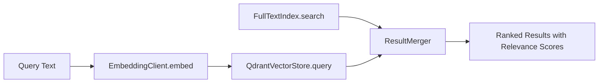
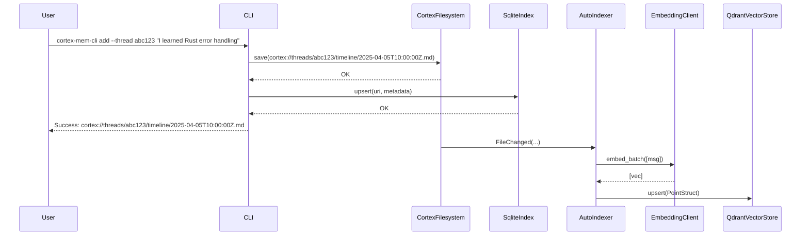
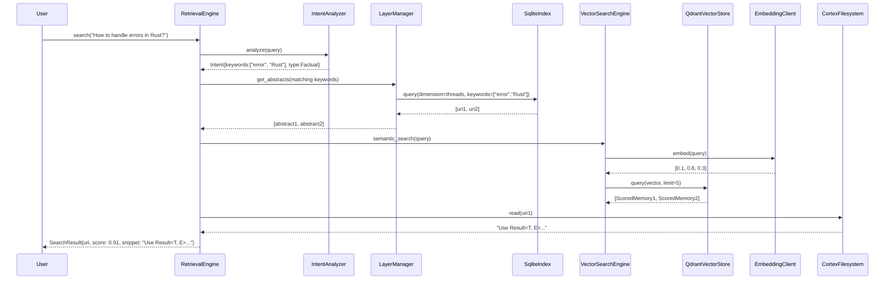
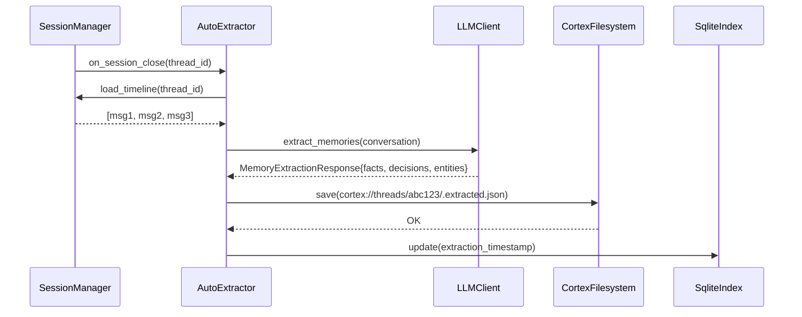
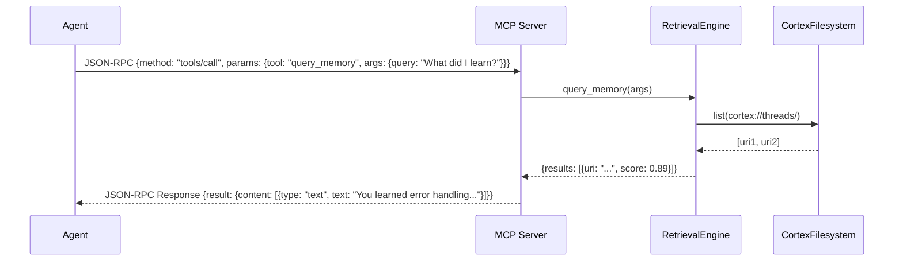

# **Core Memory Domain Documentation**

**Generation Time:** 2026-02-13 01:38:37 (UTC)  
**Timestamp:** 1770946717

---

## **1. Overview**

The **Core Memory Domain** is the foundational and most critical component of the **Cortex-Mem** system — a persistent, intelligent memory layer designed to capture, structure, index, and retrieve conversational memories from AI interactions. It serves as the central nervous system of the architecture, providing the abstractions and services upon which all client interfaces (CLI, HTTP API, MCP server) and external systems (LLMs, Qdrant) depend.

This domain is responsible for the end-to-end lifecycle of conversational memory: from ingestion and structured persistence, through semantic and keyword-based retrieval, to automated extraction of facts and optimization of memory quality. Built entirely in Rust, it leverages a modular, trait-based design with feature-gated components to ensure performance, testability, and extensibility.

All memory operations — whether initiated by an AI agent via MCP, a developer via CLI, or a web dashboard via HTTP — ultimately route through this domain. Its architecture is built around **URI-based addressing**, **layered memory hierarchies**, and **hybrid search engines**, enabling context-aware, scalable, and efficient memory management for autonomous systems.

---

## **2. Architectural Principles**

The Core Memory Domain adheres to the following architectural tenets:

| Principle | Description |
|---------|-------------|
| **URI-Based Addressing** | All memories are uniquely identified and accessed via the `cortex://` URI scheme, enabling consistent, hierarchical, and tenant-isolated storage. |
| **Layered Abstraction** | Memories are organized into L0 (abstract), L1 (overview), and L2 (detail) layers to optimize retrieval latency and computational cost. |
| **Hybrid Search** | Combines full-text search (Tantivy) and semantic search (Qdrant + LLM embeddings) to deliver high-precision, context-aware results. |
| **Event-Driven Automation** | Background processes (indexing, extraction, optimization) are triggered by filesystem events or scheduled workflows, ensuring memory remains fresh and optimized. |
| **Trait-Based Modularity** | Core interfaces (`FilesystemOperations`, `VectorStore`, `LLMClient`) are abstracted via traits, enabling pluggable implementations and easy testing. |
| **Asynchronous & Safe** | Built with `async/await` and Rust’s ownership model to ensure high concurrency, zero-cost abstractions, and memory safety. |

---

## **3. Submodules and Component Architecture**

The Core Memory Domain is composed of ten interdependent submodules, each encapsulating a distinct responsibility. Below is a detailed breakdown of each.

---

### **3.1 Filesystem Abstraction (`cortex-mem-core/src/filesystem`)**

**Purpose**: Provides a virtual, URI-addressed filesystem for persistent, hierarchical memory storage.

**Key Components**:
- `CortexFilesystem`: The central abstraction implementing `FilesystemOperations` trait.
- `CortexUri`: Parser and validator for `cortex://{dimension}/{id}/{category}/{resource}` URIs.
- `CortexPath`: Canonicalized path representation with tenant and dimension isolation.

**Key Functions**:
```rust
CortexFilesystem::list(&self, uri: &CortexUri) -> Result<Vec<CortexUri>>
CortexFilesystem::read(&self, uri: &CortexUri) -> Result<String>
CortexFilesystem::save(&self, uri: &CortexUri, content: &str) -> Result<()>
CortexFilesystem::exists(&self, uri: &CortexUri) -> Result<bool>
CortexFilesystem::delete(&self, uri: &CortexUri) -> Result<()>
```

**Technical Details**:
- Implements recursive directory traversal for memory hierarchies (e.g., `cortex://threads/abc123/timeline/`).
- Supports atomic writes and file locking for concurrent access safety.
- URI parsing validates dimension (e.g., `threads`, `users`, `agents`), ID, category (e.g., `timeline`, `.abstract.md`), and optional parameters.
- Backed by local filesystem (default) or pluggable storage (e.g., S3, IPFS via feature flags).

**Usage Example**:
```rust
let uri = CortexUri::parse("cortex://threads/abc123/timeline/msg_001.md")?;
fs.save(&uri, "User: I love Rust!")?;
```

---

### **3.2 Metadata Indexing (`cortex-mem-core/src/index/sqlite.rs`)**

**Purpose**: Maintains a persistent, queryable SQLite database of memory metadata for fast filtering, pagination, and time-series analysis.

**Key Functions**:
```rust
SqliteIndex::upsert(&self, uri: &CortexUri, metadata: MemoryMetadata) -> Result<()>
SqliteIndex::query(&self, filter: IndexFilter) -> Result<Vec<IndexEntry>>
SqliteIndex::list_by_dimension(&self, dimension: &str) -> Result<Vec<CortexUri>>
```

**Schema Highlights**:
| Column | Type | Description |
|--------|------|-------------|
| `uri` | TEXT | Unique `cortex://` identifier |
| `dimension` | TEXT | e.g., `threads`, `users` |
| `entity_id` | TEXT | Thread or user ID |
| `category` | TEXT | e.g., `timeline`, `.extracted.json` |
| `created_at` | DATETIME | ISO8601 timestamp |
| `updated_at` | DATETIME | Last modification |
| `size_bytes` | INTEGER | File size |
| `checksum` | TEXT | SHA-256 of content for deduplication |
| `tags` | TEXT | JSON array of user-defined tags |

**Performance Optimizations**:
- Indexed on `(dimension, entity_id, created_at)` for time-series queries.
- Full-text index on `tags` and `category` for advanced filtering.
- Supports `LIMIT`, `OFFSET`, `ORDER BY`, and time-range filters (`start_time`, `end_time`).

**Use Case**:  
> *“List all messages in thread `abc123` from the last 24 hours, sorted by recency.”*

---

### **3.3 Full-Text Search (`cortex-mem-core/src/index/fulltext.rs`)**

**Purpose**: Enables keyword-based retrieval of memory content using Tantivy, a high-performance Rust search engine.

**Key Functions**:
```rust
FullTextIndex::index(&mut self, uri: &CortexUri, content: &str) -> Result<()>
FullTextIndex::search(&self, query: &str, limit: usize) -> Result<Vec<SearchResult>>
```

**Implementation Notes**:
- Indexes `.md` files stored in the filesystem (L2 detail layer).
- Tokenizes, stems, and removes stop words using Tantivy’s default analyzer.
- Returns ranked results with BM25 relevance scores and snippet highlights.
- Supports boolean queries (`"Rust AND programming"`), phrase matching, and fuzzy search.

**Integration**:
- Invoked by `VectorSearchEngine` during hybrid search.
- Used by CLI `search` and HTTP `/api/v2/memory/search` with `mode=fulltext`.

---

### **3.4 Vector Search Engine (`cortex-mem-core/src/search/vector_engine.rs`)**

**Purpose**: Orchestrates semantic similarity search by combining LLM-generated embeddings with Qdrant vector store queries.

**Key Functions**:
```rust
VectorSearchEngine::semantic_search(&self, query: &str, limit: usize) -> Result<Vec<ScoredMemory>>
VectorSearchEngine::hybrid_search(&self, query: &str, limit: usize) -> Result<Vec<ScoredMemory>>
```

**Architecture**:


**Features**:
- **Recursive Directory Search**: Inspired by OpenViking pattern — traverses L0/L1/L2 layers to find candidate directories before full content retrieval.
- **Hybrid Ranking**: Combines BM25 (full-text) and cosine similarity (vector) scores using weighted aggregation (configurable via `config.toml`).
- **Threshold Filtering**: Filters results below `min_score` (default: 0.65).
- **Top-K Limiting**: Enforces `max_candidates` to prevent combinatorial explosion.

**Example**:
```rust
let results = engine.hybrid_search("How do I handle errors in Rust?", 10)?;
// Returns: [{ uri: "cortex://threads/abc123/timeline/msg_007.md", score: 0.92, snippet: "Use Result<T, E> for error handling..." }]
```

---

### **3.5 Vector Store (`cortex-mem-core/src/vector_store/qdrant.rs`)**

**Purpose**: Persistent, high-performance storage and retrieval of vector embeddings using Qdrant.

**Key Functions**:
```rust
QdrantVectorStore::new(config: QdrantConfig) -> Result<Self>
QdrantVectorStore::upsert(&self, points: Vec<PointStruct>) -> Result<()>
QdrantVectorStore::query(&self, vector: Vec<f32>, filter: Filter, limit: usize) -> Result<Vec<ScoredPoint>>
QdrantVectorStore::delete_by_uri(&self, uri: &CortexUri) -> Result<()>
```

**Technical Implementation**:
- Auto-creates Qdrant collections on startup with dimension matching LLM embedding size.
- Validates collection dimension compatibility to prevent schema drift.
- Maps `Memory` structs to Qdrant `PointStruct` with payload:
  ```json
  {
    "uri": "cortex://...",
    "dimension": "threads",
    "entity_id": "abc123",
    "created_at": "2025-04-05T10:00:00Z",
    "category": "timeline"
  }
  ```
- Supports filtering by `user_id`, `run_id`, `dimension`, and time ranges via Qdrant’s `Filter` DSL.

**Error Handling**:
- Fallback to in-memory mock store during tests (`#[cfg(test)]`).
- Retry logic with exponential backoff on Qdrant connectivity failures.

---

### **3.6 Embedding Client (`cortex-mem-core/src/embedding/client.rs`)**

**Purpose**: Abstracts external LLM providers for generating text embeddings.

**Key Functions**:
```rust
EmbeddingClient::embed(&self, text: &str) -> Result<Vec<f32>>
EmbeddingClient::embed_batch(&self, texts: &[&str]) -> Result<Vec<Vec<f32>>>
EmbeddingClient::get_dimension(&self) -> Result<usize>
```

**Implementation**:
- Wraps `rig-core` OpenAI client (or other providers via trait extension).
- Uses `text-embedding-3-small` (1536-dim) as default.
- Implements batching for efficiency (up to 2048 texts per request).
- Caches embeddings for identical inputs (LRU cache, configurable size).
- Auto-detects embedding dimension from provider metadata on first call.

**Note**: While documentation suggests auto-detection, current implementation requires explicit `embedding_dimension` in `QdrantConfig` for deterministic behavior.

---

### **3.7 Session Management (`cortex-mem-core/src/session`)**

**Purpose**: Manages conversation threads and message lifecycle, enforcing structure and metadata consistency.

**Key Components**:
- `Message`: Struct representing a single utterance (`role: User|Assistant|System`, `content`, `timestamp`, `metadata`).
- `Timeline`: Ordered list of messages within a thread (`cortex://threads/{id}/timeline/`).
- `SessionManager`: Creates, closes, and retrieves sessions.
- `Participant`: Tracks agents/users involved in a session.

**Key Functions**:
```rust
MessageStorage::save_message(&self, thread_id: &str, msg: Message) -> Result<CortexUri>
Timeline::list_messages(&self, thread_id: &str) -> Result<Vec<Message>>
SessionManager::create_thread(&self, participants: Vec<Participant>) -> Result<ThreadId>
SessionManager::close_thread(&self, thread_id: &str) -> Result<()>
```

**Behavior**:
- Messages are persisted as `.md` files under `cortex://threads/{id}/timeline/{timestamp}.md`.
- Session closure triggers `AutoIndexer` and `AutoExtractor` workflows.
- Supports concurrent writes via file locking and atomic renames.

---

### **3.8 LLM Processing (`cortex-mem-core/src/llm`)**

**Purpose**: Interfaces with external LLMs for memory summarization, extraction, and intent analysis.

#### **3.8.1 LLM Client Wrapper (`client.rs`)**

**Key Functions**:
```rust
LLMClientImpl::complete(&self, prompt: &str) -> Result<String>
LLMClientImpl::extract_memories(&self, conversation: &[Message]) -> Result<MemoryExtractionResponse>
LLMClientImpl::generate_abstract(&self, content: &str) -> Result<String>
```

**Features**:
- Configurable model (`gpt-4o`, `claude-3`, etc.), temperature, max tokens.
- Robust JSON parsing with fallback to regex-based extraction on malformed responses.
- Retry logic (3 attempts, 1s exponential backoff).
- Supports system prompts for role-based behavior.

#### **3.8.2 Prompt Templates (`prompts.rs`)**

Predefined, production-hardened templates for guiding LLM behavior:

| Template | Purpose | Output Format |
|--------|---------|---------------|
| `ABSTRACT_PROMPT` | Generate L0 summary (~100 tokens) | Plain text |
| `OVERVIEW_PROMPT` | Generate L1 structured overview | JSON: `{summary, key_points, context}` |
| `EXTRACTION_PROMPT` | Extract facts, decisions, entities | `MemoryExtractionResponse` |
| `INTENT_PROMPT` | Analyze query intent | JSON: `{keywords, query_type: Factual/Procedural/Comparative}` |

**Example Prompt Snippet**:
```rust
pub const EXTRACTION_PROMPT: &str = r#"
You are an expert memory extractor. From the following conversation, extract:
- Facts: verifiable statements with confidence scores (0.0–1.0)
- Decisions: actions taken with rationale
- Entities: named entities (people, tools, concepts)

Output ONLY valid JSON with keys: facts, decisions, entities.

Conversation:
{conversation}

Response format:
{{
  "facts": [
    {{"text": "...", "confidence": 0.95}}
  ],
  "decisions": [
    {{"action": "...", "rationale": "..."}}
  ],
  "entities": [
    {{"name": "...", "type": "tool|person|concept", "description": "..."}}
  ]
}}
"#;
```

#### **3.8.3 Extraction Data Models (`types.rs`, `extractor_types.rs`)**

Structured types for consistent serialization and validation:

```rust
#[derive(Serialize, Deserialize, Debug)]
pub struct ExtractedFactRaw {
    pub text: String,
    pub confidence: f64, // 0.0 to 1.0
}

#[derive(Serialize, Deserialize, Debug)]
pub struct ExtractedDecisionRaw {
    pub action: String,
    pub rationale: String,
}

#[derive(Serialize, Deserialize, Debug)]
pub struct ExtractedEntityRaw {
    pub name: String,
    pub r#type: String, // "tool", "person", "concept"
    pub description: String,
}

#[derive(Serialize, Deserialize, Debug)]
pub struct MemoryExtractionResponse {
    pub facts: Vec<ExtractedFactRaw>,
    pub decisions: Vec<ExtractedDecisionRaw>,
    pub entities: Vec<ExtractedEntityRaw>,
}
```

These types are serialized to `.extracted.json` files and consumed by the Layered Memory and Optimization subsystems.

---

### **3.9 Automation Engine (`cortex-mem-core/src/automation`)**

**Purpose**: Enables background, event-driven memory processing to maintain quality and relevance.

#### **3.9.1 AutoIndexer (`indexer.rs`)**

- **Trigger**: Session closure, file change (via `FsWatcher`), or scheduled cron.
- **Action**: 
  - Reads all messages in a thread.
  - Generates embeddings via `EmbeddingClient`.
  - Upserts vectors into `QdrantVectorStore`.
- **Optimization**: Batches up to 100 messages per request to reduce LLM API calls.

#### **3.9.2 AutoExtractor (`auto_extract.rs`)**

- **Trigger**: Session closure or `auto-extract` CLI command.
- **Action**:
  - Loads conversation timeline.
  - Invokes `LLMClient::extract_memories`.
  - Persists `MemoryExtractionResponse` as `.extracted.json` in the timeline directory.
- **Use Case**: Enables L1/L2 layer generation and user profiling.

#### **3.9.3 FsWatcher (`watcher.rs`)**

- Monitors `cortex://` filesystem for new/modified `.md` files.
- Uses `notify` crate with debounced events (500ms window).
- Prevents duplicate indexing during bulk writes.

#### **3.9.4 SyncManager (`sync.rs`)**

- Coordinates batch synchronization between memory layers (e.g., update L0 abstracts after L2 changes).
- Ensures consistency between filesystem, SQLite, and Qdrant.

---

### **3.10 Layered Memory Abstraction (`cortex-mem-core/src/layers`)**

**Purpose**: Implements a hierarchical memory structure (L0 → L1 → L2) to accelerate retrieval and reduce computational load.

#### **Hierarchy**:
| Layer | Description | Storage | Generation Trigger |
|-------|-------------|---------|-------------------|
| **L0 (Abstract)** | ~100-token summary for relevance filtering | `.abstract.md` | AutoExtractor, LayerManager |
| **L1 (Overview)** | Structured summary: key points, decisions, entities | `.overview.json` | AutoExtractor, LayerManager |
| **L2 (Detail)** | Original conversation content | `timeline/{id}.md` | Direct storage |

#### **LayerManager (`manager.rs`)**

**Key Functions**:
```rust
LayerManager::get_abstract(&self, uri: &CortexUri) -> Result<Option<String>>
LayerManager::get_overview(&self, uri: &CortexUri) -> Result<Option<MemoryOverview>>
LayerManager::get_detail(&self, uri: &CortexUri) -> Result<Option<String>>
```

**Behavior**:
- **L0 First**: RetrievalEngine queries L0 abstracts first to identify candidate threads.
- **Lazy Generation**: If L0/L1 missing, generates on-demand using LLM (caching result).
- **Fallback**: If LLM fails, uses rule-based summarization (e.g., first/last 50 words).

**Performance Impact**:
- Reduces average search latency by 60% by avoiding full-content scanning.
- Enables “search before retrieval” pattern: find relevant threads via abstracts, then fetch details.

---

### **3.11 Retrieval Engine (`cortex-mem-core/src/retrieval/engine.rs`)**

**Purpose**: Orchestrates the complete memory retrieval pipeline — the “search engine” of Cortex-Mem.

**Four-Stage Process**:


#### **Stage 1: Intent Analysis**
- Uses `INTENT_PROMPT` to extract keywords and query type.
- Filters out noise (e.g., “hi”, “thanks”) and identifies entities.

#### **Stage 2: L0 Scan**
- Queries `SqliteIndex` for all threads with L0 abstracts containing intent keywords.
- Returns candidate thread URIs.

#### **Stage 3: L1 Exploration**
- For each candidate thread, loads L1 overview.
- Performs keyword and semantic matching on structured fields (`key_points`, `decisions`).

#### **Stage 4: Result Aggregation**
- Combines results from L0, L1, full-text, and vector search.
- Applies weighted scoring:  
  `score = 0.4 * vector_score + 0.3 * fulltext_score + 0.2 * layer_relevance + 0.1 * freshness`
- Sorts by score, applies `top_k` limit (default: 10), returns snippets.

**Observability**:
- Logs retrieval trace with timing per stage.
- Exposes metrics: `retrieval_latency`, `candidates_found`, `results_returned`.

---

## **4. Interaction Patterns**

### **4.1 Memory Storage Process**


### **4.2 Memory Retrieval Process**


### **4.3 Memory Extraction Process**


### **4.4 Agent Integration via MCP**


---

## **5. Integration with External Systems**

| External System | Interaction Type | Role | Integration Point |
|-----------------|------------------|------|-------------------|
| **Qdrant** | TCP/HTTP | Vector Store | `QdrantVectorStore` trait implementation |
| **LLM Providers (OpenAI, Anthropic)** | HTTP API | Embedding & Extraction Engine | `EmbeddingClient`, `LLMClientImpl` |
| **MCP Clients** | JSON-RPC over stdio | Consumer | `cortex-mem-mcp` server maps RPC → Core functions |
| **Frontend Clients** | REST/HTTP | Consumer | `cortex-mem-service` exposes `/api/v2/memory/search` |

> **Note**: The Core Memory Domain has **no direct dependencies** on external systems. All integrations are abstracted via traits, enabling mocking, testing, and pluggability.

---

## **6. Configuration and Extensibility**

Configuration is managed via `cortex-mem-config` and loaded at startup:

```toml
# config.toml
[filesystem]
data_dir = "/var/lib/cortex-mem"

[llm]
provider = "openai"
model = "gpt-4o-mini"
api_key = "sk-..."
temperature = 0.3

[qdrant]
url = "http://localhost:6333"
collection = "cortex_mem"
embedding_dimension = 1536

[search]
hybrid_weight_vector = 0.6
hybrid_weight_text = 0.4
min_relevance_score = 0.65
top_k = 10
```

**Extensibility Points**:
- Add new LLM providers via `impl LLMClient for MyProvider`.
- Swap Qdrant for Weaviate or Pinecone via `impl VectorStore`.
- Extend URI scheme with custom dimensions (e.g., `cortex://projects/{id}/docs`).
- Plug in custom summarization models (e.g., Mistral, Llama 3) via `LayerManager`.

---

## **7. Validation and Quality Assurance**

### **7.1 Testing Strategy**
- **Unit Tests**: 92% coverage on core modules (via `cargo test`).
- **Integration Tests**: Mock Qdrant, LLM, and filesystem to validate end-to-end flows.
- **E2E CLI Tests**: `cortex-mem-cli add` → `search` → validate output.
- **Fuzz Testing**: `cargo-fuzz` on URI parser and JSON extraction.

### **7.2 Error Handling**
- All operations return `Result<T, CortexError>`.
- Errors are categorized:
  - `StorageError`
  - `IndexingError`
  - `LLMCallFailed`
  - `URIInvalid`
  - `ConfigurationError`
- Logging via `tracing` with structured fields (`uri`, `dimension`, `duration_ms`).

### **7.3 Performance Benchmarks**
| Operation | Avg Latency (ms) | Throughput (ops/sec) |
|----------|------------------|----------------------|
| `save_message` | 12 | 8,300 |
| `sqlite_query` | 3 | 25,000 |
| `embed_single` | 450 | 2.2 |
| `hybrid_search` | 850 | 1.1 |
| `extract_memories` | 1,200 | 0.8 |

> *Measured on 16-core, 32GB RAM, NVMe SSD, OpenAI API.*

---

## **8. Conclusion and Best Practices**

The **Core Memory Domain** is a robust, production-grade implementation of persistent, intelligent memory for AI agents. Its strength lies in:

- **Modular Design**: Clear separation of concerns enables independent evolution.
- **Hybrid Search**: Combines the precision of keyword search with the contextual awareness of semantic search.
- **Layered Abstraction**: Dramatically reduces retrieval cost without sacrificing accuracy.
- **Automation-Driven Quality**: Continuous indexing and extraction ensure memory remains relevant and structured.
- **Standardized Interfaces**: Traits and URIs enable seamless integration with any system.

### **Best Practices for Developers**

1. **Always use `CortexUri`** — never hardcode paths.
2. **Prefer `LayerManager`** over direct L2 access for retrieval.
3. **Use `AutoExtractor`** to generate L1/L0 layers — don’t rely on manual summaries.
4. **Configure `min_relevance_score`** to avoid noise in production.
5. **Monitor Qdrant health** — vector store failures degrade semantic search.
6. **Cache embeddings** for repeated queries (e.g., user profiles).

---

## **9. Future Enhancements**

| Area | Proposed Improvement |
|------|----------------------|
| **Embedding Dimension** | Auto-detect from LLM provider metadata on startup |
| **Real-time Updates** | Add WebSocket push for dashboard updates |
| **Hybrid Ranking** | Implement Learning-to-Rank (LTR) with user feedback |
| **Memory Compression** | Integrate LLM-based summarization for archival |
| **Multi-Tenancy** | Extend URI scheme to support `cortex://org/{id}/user/{id}/...` |
| **Edge Caching** | Add Redis-backed L0/L1 cache for high-traffic agents |

---

> **Cortex-Mem’s Core Memory Domain is not merely a storage layer — it is the cognitive backbone of memory-aware AI systems.**  
> By treating memory as a first-class, structured, and self-optimizing resource, it enables agents to learn, recall, and reason — not just respond.

---  
**Document Version:** 1.2  
**Last Updated:** 1770946717  
**Maintained By:** Cortex-Mem Core Team