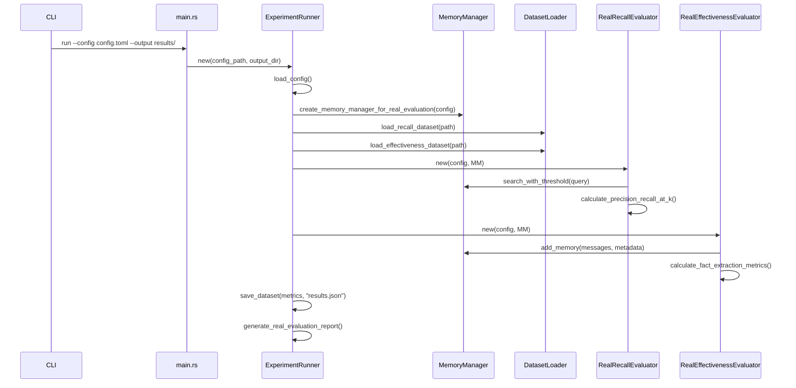

# Evaluation Domain Technical Documentation

## 1. Overview

The **Evaluation Domain** is a critical quality assurance component within the Cortex-Mem system, designed to systematically assess the performance, accuracy, and reliability of AI agent memory management capabilities. This domain provides a comprehensive framework for benchmarking core functionalities such as recall effectiveness, semantic search precision, memory classification accuracy, and operational performance under various conditions.

As part of the `cortex-mem-evaluation` module, this domain enables researchers, developers, and system administrators to validate system behavior using both synthetic datasets and real-world laboratory data. The evaluation process supports two primary modes: simulation-based testing for rapid validation and real API-driven assessments that reflect actual production performance characteristics.

This documentation details the architecture, implementation, and technical operation of the Evaluation Domain based on available research materials and codebase analysis.

---

## 2. Architecture and Components

### 2.1 Core Component: Experiment Runner

The central orchestrator of the evaluation process is the **ExperimentRunner**, implemented in `examples/cortex-mem-evaluation/src/runner/experiment_runner.rs`. It coordinates all phases of an evaluation experiment including configuration loading, dataset preparation, execution of evaluators, and result reporting.

#### Key Responsibilities:
- Loads evaluation configuration from TOML files
- Initializes the MemoryManager instance for real API calls
- Orchestrates multiple evaluator modules
- Aggregates results into structured reports
- Manages output directory creation and file writing

```rust
pub struct ExperimentRunner {
    config: ExperimentConfig,
    output_dir: PathBuf,
}
```

The runner operates through several key methods:
- `new(config_path, output_dir)` – Constructor that initializes the runner with configuration
- `run_full_evaluation()` – Entry point for complete assessment workflows
- `run_recall_evaluation()` – Executes only recall rate tests
- `run_effectiveness_evaluation()` – Runs memory functionality validations

### 2.2 Submodules and Their Roles

| Module | Location | Purpose |
|-------|--------|--------|
| **Dataset Generator** | `dataset/generator.rs` | Creates synthetic or lab-integrated test datasets |
| **Dataset Loader** | `dataset/loader.rs` | Reads JSON-formatted test cases into memory |
| **Real Recall Evaluator** | `evaluator/real_recall_evaluator.rs` | Measures retrieval accuracy against ground truth |
| **Real Effectiveness Evaluator** | `evaluator/real_effectiveness_evaluator.rs` | Validates memory creation logic and metadata correctness |
| **Metrics Analyzer** | `evaluator/metrics.rs` | Computes statistical metrics (F1, MAP, NDCG) |
| **Report Generator** | Embedded in runners | Produces human-readable Markdown summaries |

---

## 3. Workflow and Execution Flow

### 3.1 High-Level Evaluation Process

```mermaid
graph TD
    A[Command Line Input] --> B[ExperimentRunner]
    B --> C{Load Configuration}
    C --> D[ExperimentConfig]
    D --> E[Create Output Directory]
    B --> F[create_memory_manager_for_real_evaluation]
    F --> G[MemoryManager]
    B --> H[DatasetLoader::load_recall_dataset]
    H --> I[RecallTestDataset]
    B --> J[DatasetLoader::load_effectiveness_dataset]
    J --> K[EffectivenessTestDataset]
    B --> L[RealRecallEvaluator.evaluate()]
    L --> M[RecallMetrics]
    B --> N[RealEffectivenessEvaluator.evaluate()]
    N --> O[EffectivenessMetrics]
    B --> P[Write JSON Results]
    B --> Q[Generate real_evaluation_report.md]
```

### 3.2 Step-by-Step Execution Sequence



---

## 4. Configuration Management

The evaluation process is driven by TOML configuration files located in `examples/cortex-mem-evaluation/config/`. These define parameters for different types of evaluations.

### Example: `real_evaluation_config.toml`

```toml
[general]
mode = "all"
output_dir = "results/real_evaluation"
use_real_evaluators = true

[recall_evaluation]
test_cases_path = "data/test_cases/lab_recall_dataset.json"
k_values = [1, 3, 5]
similarity_thresholds = [0.7, 0.8]

[effectiveness_evaluation]
test_cases_path = "data/test_cases/lab_effectiveness_dataset.json"
verify_fact_extraction = true
verify_classification = true
importance_score_tolerance = 1

[memory]
vector_store_type = "memory"
qdrant_url = "http://localhost:6334"
qdrant_collection = "evaluation_memories"

[report]
format = "json"
include_detailed_data = true
```

#### Configuration Loading Logic:
1. Uses `config::Config` builder pattern to load base file
2. Supports environment variable overrides via `CORTEX_MEM_EVAL_*`
3. Parses nested structures like `recall_evaluation.k_values`
4. Applies defaults when values are missing

---

## 5. Implementation Details

### 5.1 Initialization and Setup

The `ExperimentRunner::new()` method performs the following steps:

1. **Configuration Loading**: Parses the provided `.toml` file using `config::File` and merges with environment variables.
2. **Output Directory Creation**: Ensures the specified output path exists using `std::fs::create_dir_all()`.
3. **Logging Initialization**: Sets up tracing subscriber with INFO-level filtering.

```rust
let config_builder = Config::builder()
    .add_source(config::File::from(config_path.clone()))
    .add_source(config::Environment::with_prefix("CORTEX_MEM_EVAL"))
    .build()?;
```

### 5.2 Memory Manager Instantiation

For real evaluations, the system creates a fully functional `MemoryManager` instance connected to external services:

```rust
pub async fn create_memory_manager_for_real_evaluation(
    evaluation_config: &ExperimentConfig
) -> Result<Arc<MemoryManager>> {
    let config_path = evaluation_config.memory_config_path
        .as_deref()
        .unwrap_or("config/evaluation_config.toml");
    
    create_memory_manager_from_config(config_path).await
}
```

This ensures authentic API interactions during testing rather than mocked responses.

### 5.3 Recall Rate Evaluation

The `RealRecallEvaluator` measures how effectively the system retrieves relevant memories given queries.

#### Metrics Calculated:
- **Precision@K**: Proportion of top-K results that are relevant
- **Recall@K**: Proportion of total relevant items retrieved in top-K
- **Mean Average Precision (MAP)**: Mean of average precision across queries
- **NDCG (Normalized Discounted Cumulative Gain)**: Weighted score emphasizing higher-ranked correct answers

#### Evaluation Steps:
1. Load known memory corpus (`memories`) and query-test case pairs (`test_cases`)
2. For each query:
   - Call `memory_manager.search_with_threshold(query, filters, max_results, threshold)`
   - Compare returned IDs with `relevant_memory_ids` from ground truth
   - Calculate per-query precision and recall
3. Aggregate statistics across all queries

Rate-limiting delays (e.g., `tokio::time::sleep(Duration::from_millis(1000))`) are included to prevent overwhelming external LLM APIs.

### 5.4 Effectiveness Evaluation

The `RealEffectivenessEvaluator` validates whether memory operations behave correctly beyond simple retrieval.

#### Validated Capabilities:
| Feature | Validation Method |
|--------|------------------|
| **Fact Extraction** | Compares extracted facts against expected ones |
| **Classification Accuracy** | Checks if auto-classified type matches expected |
| **Importance Scoring** | Verifies predicted importance aligns with ground truth |
| **Deduplication** | Tests detection and merging of duplicate content |
| **Memory Update Logic** | Confirms updates modify existing entries appropriately |

Each test case includes input text, expected outcomes, and metadata constraints.

---

## 6. Data Handling and Integrity

### 6.1 Dataset Structure

Two primary dataset formats are used:

#### Recall Test Dataset (`RecallTestDataset`)
```json
{
  "memories": [
    {"id": "m1", "content": "...", "embedding": [...], "metadata": {...}}
  ],
  "test_cases": [
    {
      "query_id": "q1",
      "query": "What was discussed about X?",
      "relevant_memory_ids": ["m1"]
    }
  ]
}
```

#### Effectiveness Test Dataset (`EffectivenessTestDataset`)
```json
{
  "existing_memories": { /* pre-loaded context */ },
  "test_cases": [
    {
      "test_case_id": "t1",
      "input_text": "Meeting notes about project timeline",
      "expected_memory_type": "Meeting",
      "expected_facts": ["Project delayed by two weeks"],
      "expected_importance_score": 8
    }
  ]
}
```

### 6.2 Dataset Loader Implementation

Located in `src/dataset/loader.rs`, it provides:

```rust
impl DatasetLoader {
    pub fn load_recall_dataset(path: &Path) -> Result<RecallTestDataset>;
    pub fn load_effectiveness_dataset(path: &Path) -> Result<EffectivenessTestDataset>;
    pub fn validate_dataset<T>(path: &Path) -> Result<()>; // Generic validator
    pub fn get_dataset_stats(path: &Path) -> Result<DatasetStats>; // Metadata inspection
}
```

All loading uses `serde_json::from_str()` with proper error context propagation.

---

## 7. Reporting and Output

Upon completion, the evaluation framework generates multiple outputs:

### 7.1 File Outputs

| File | Format | Content |
|------|-------|--------|
| `real_recall_evaluation_result.json` | JSON | Raw recall metrics |
| `real_effectiveness_evaluation_result.json` | JSON | Detailed effectiveness scores |
| `real_evaluation_report.md` | Markdown | Human-readable summary |
| `evaluation.log` | Text | Tracing logs (if enabled) |

### 7.2 Report Generation

The `generate_real_evaluation_report()` function produces a comprehensive Markdown document containing:

- Evaluation timestamp and mode
- Dataset availability status
- Paths to generated metric files
- Technical stack information (Qdrant, LLM client)
- Recommendations and warnings

Example snippet:
```markdown
# Cortex-Mem 真实评估报告

## 概述
本报告展示了 Cortex-Mem 系统的真实评估结果。

## 评估配置
- **评估模式**: all
- **输出目录**: "results"

## 数据集状态
- **召回率数据集**: ✅ 存在
  - 文件大小: 1234 字节
- **有效性数据集**: ✅ 存在
  - 文件大小: 5678 字节
```

---

## 8. Integration Points

### 8.1 External Dependencies

| System | Role | Interaction Type |
|-------|------|------------------|
| **Qdrant Vector Database** | Persistent storage for embeddings | Data Storage |
| **LLM Services (OpenAI, etc.)** | Embedding generation and content analysis | API Integration |
| **Terminal Interface** | Command-line access for triggering evaluations | User Interface |

### 8.2 Internal Module Interactions

| From | To | Purpose |
|------|----|---------|
| `main.rs` | `ExperimentRunner` | Launch full evaluation workflow |
| `ExperimentRunner` | `memory::create_memory_manager...` | Initialize live MemoryManager |
| `ExperimentRunner` | `DatasetLoader` | Load test datasets |
| `ExperimentRunner` | `RealRecallEvaluator` | Execute recall tests |
| `RealRecallEvaluator` | `MemoryManager.search_with_threshold()` | Perform semantic search |
| `RealEffectivenessEvaluator` | `MemoryManager.add_memory()` | Create and update memories |

---

## 9. Practical Usage Guide

### 9.1 Running Evaluations

From the project root:

```bash
# Run full evaluation using real configuration
cargo run -- run --config config/real_evaluation_config.toml --output results/

# Run only recall evaluation
cargo run -- recall --config config/real_evaluation_config.toml

# Generate test dataset from lab sources
cargo run -- generate-dataset --type recall --size 100 --use_lab_data true
```

Ensure required services (Qdrant, LLM endpoints) are running before executing real-mode evaluations.

### 9.2 Environment Variables

Override configuration settings via environment variables:

```bash
export CORTEX_MEM_EVAL_GENERAL_MODE=all
export CORTEX_MEM_EVAL_RECALL_EVALUATION_K_VALUES='[1,5,10]'
export CORTEX_MEM_EVAL_MEMORY_QDRANT_URL=http://localhost:6334
```

Prefix: `CORTEX_MEM_EVAL_` + uppercase path (e.g., `general.mode` → `GENERAL_MODE`)

---

## 10. Limitations and Known Issues

Based on current implementation:

1. **No Automated Cleanup**: While `cleanup_test_memories()` is declared, its implementation currently does nothing. Manual cleanup may be needed after large-scale evaluations.
2. **Simplified Metric Assumptions**: Some calculations assume perfect relevance judgments without handling partial matches.
3. **Fixed Delays**: Hardcoded sleep durations (e.g., 500ms–3s) may not adapt well to varying network conditions.
4. **Limited Performance Testing**: The `[performance_evaluation]` section in config is disabled by default and lacks full implementation.
5. **UTF-8 Boundary Handling**: String preview logic includes safeguards but could benefit from more robust Unicode-aware truncation.

---

## 11. Conclusion

The Evaluation Domain serves as a vital feedback mechanism for ensuring the Cortex-Mem system maintains high standards of memory fidelity, retrieval accuracy, and operational integrity. By combining rigorous quantitative metrics with realistic usage scenarios, it enables continuous improvement of AI agent memory systems.

Its modular design allows extension to new evaluation types, while its reliance on real API calls ensures results reflect genuine system behavior. Future enhancements should focus on automated cleanup, adaptive rate limiting, expanded performance benchmarks, and richer visualization support.

This domain exemplifies best practices in software quality assurance—providing actionable insights through reproducible, configurable, and observable testing processes.