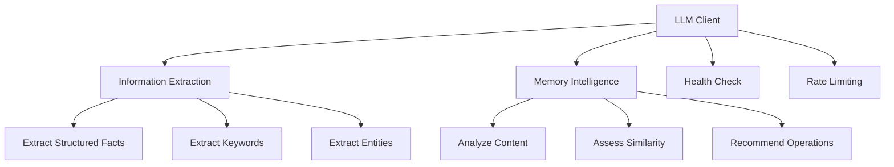
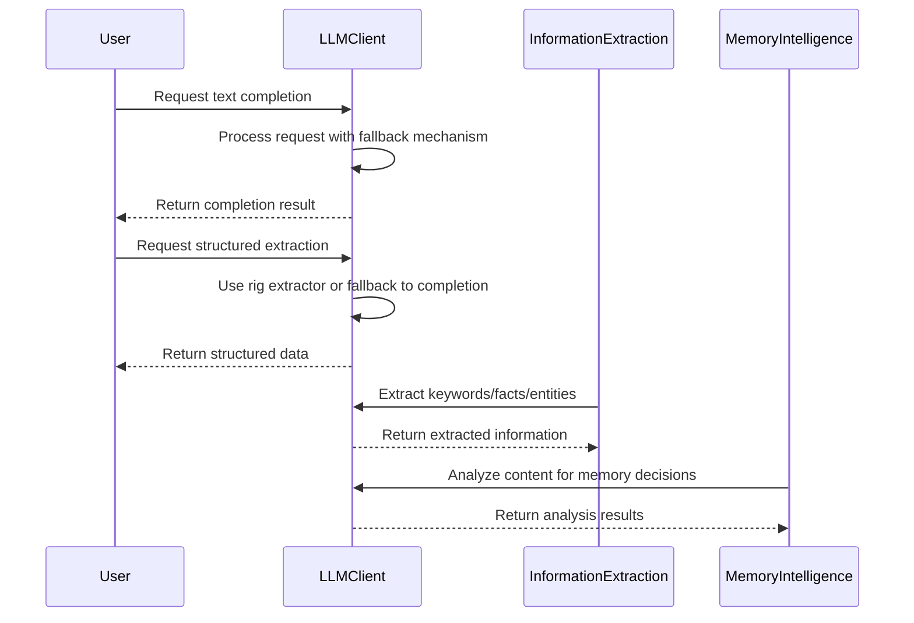

# LLM Integration Domain Technical Documentation

## 1. Overview

The **LLM Integration Domain** is a core component of the Cortex-Mem system responsible for managing interactions with Large Language Models (LLMs) to extract insights from content and enable intelligent decision-making for memory operations. This domain serves as the cognitive engine that transforms unstructured text into structured knowledge, enabling advanced memory management capabilities.

This documentation provides comprehensive technical details about the architecture, implementation, and functionality of the LLM Integration Domain based on the analysis of source code and system research materials.

### Key Characteristics
- **Domain Type**: Core Business Domain
- **Importance Score**: 9.0/10.0
- **Complexity Level**: High (8.5/10.0)
- **Primary Responsibility**: Enabling intelligent processing of memory content through LLM-powered analysis, extraction, and decision-making



## 2. Architecture and Components

The LLM Integration Domain consists of three primary sub-modules that work together to provide comprehensive LLM capabilities:

### 2.1 LLM Client Module

The `LLMClient` is the foundational component that manages communication with external LLM services, primarily OpenAI. It implements a robust client interface with support for both traditional text completion and modern structured extraction capabilities.

#### Key Features:
- **Multi-capability Interface**: Supports text completion, embedding generation, and structured data extraction
- **Fallback Mechanisms**: Implements graceful degradation when structured extraction fails
- **Rate Limiting**: Includes built-in rate limiting (1 second delay between batch operations)
- **Health Monitoring**: Provides health checking through embedding requests
- **Concurrent Operation**: Designed to be cloned and used concurrently in asynchronous contexts

#### Trait Definition:
```rust
#[async_trait]
pub trait LLMClient: Send + Sync + dyn_clone::DynClone {
    // Core capabilities
    async fn complete(&self, prompt: &str) -> Result<String>;
    async fn embed(&self, text: &str) -> Result<Vec<f32>>;
    async fn embed_batch(&self, texts: &[String]) -> Result<Vec<Vec<f32>>>;
    
    // Information extraction
    async fn extract_keywords(&self, content: &str) -> Result<Vec<String>>;
    async fn summarize(&self, content: &str, max_length: Option<usize>) -> Result<String>;
    
    // Health and monitoring
    async fn health_check(&self) -> Result<bool>;
    
    // Structured extraction methods
    async fn extract_structured_facts(&self, prompt: &str) -> Result<StructuredFactExtraction>;
    async fn extract_detailed_facts(&self, prompt: &str) -> Result<DetailedFactExtraction>;
    async fn classify_memory(&self, prompt: &str) -> Result<MemoryClassification>;
    async fn score_importance(&self, prompt: &str) -> Result<ImportanceScore>;
}
```

#### Implementation Details:
The `OpenAILLMClient` implementation uses the RIG framework to interact with OpenAI services, providing both completion and embedding models. The client is configured through centralized configuration (`LLMConfig` and `EmbeddingConfig`) which specifies API keys, endpoints, model names, temperature settings, and token limits.

Key architectural decisions include:
- **Separation of Concerns**: Different models are used for completion vs. embedding tasks
- **Error Resilience**: Comprehensive error handling with fallback mechanisms
- **Performance Optimization**: Batch processing with controlled rate limiting
- **Debug Support**: Conditional sleep statements in debug builds to prevent rate limiting issues during development

### 2.2 Information Extraction Module

The Information Extraction module leverages the LLM Client to transform unstructured content into structured knowledge representations. This module focuses on extracting specific types of information from memory content.

#### Primary Capabilities:
- **Fact Extraction**: Identifies and extracts important facts from conversations
- **Keyword Identification**: Extracts key terms and phrases from content
- **Entity Recognition**: Detects named entities such as people, organizations, and locations
- **Language Detection**: Automatically detects the language of input content
- **Conversation Analysis**: Analyzes conversation dynamics including topics, sentiment, and user intent

#### Data Structures:
The module defines several structured response types using Serde serialization and JSON Schema generation:

```rust
#[derive(Debug, Clone, Serialize, Deserialize, JsonSchema)]
pub struct StructuredFactExtraction {
    pub facts: Vec<String>,
}

#[derive(Debug, Clone, Serialize, Deserialize, JsonSchema)]
pub struct DetailedFactExtraction {
    pub facts: Vec<StructuredFact>,
}

#[derive(Debug, Clone, Serialize, Deserialize, JsonSchema)]
pub struct KeywordExtraction {
    pub keywords: Vec<String>,
}

#[derive(Debug, Clone, Serialize, Deserialize, JsonSchema)]
pub struct EntityExtraction {
    pub entities: Vec<Entity>,
}
```

#### Processing Workflow:
1. **Prompt Construction**: Builds specialized prompts for different extraction tasks
2. **Structured Extraction**: Uses RIG's extractor_completions_api for reliable structured output
3. **Fallback Processing**: Falls back to traditional completion if structured extraction fails
4. **Response Parsing**: Parses and validates the structured responses
5. **Result Normalization**: Standardizes the extracted information for downstream use

The module implements sophisticated prompt engineering techniques, including:
- Role-specific prompts for user vs. assistant messages
- Context-aware extraction strategies
- Language-preserving extraction (facts are returned in the same language as input)

### 2.3 Memory Intelligence Module

The Memory Intelligence module applies LLM analysis to make strategic decisions about memory operations. This module represents the highest level of cognitive processing in the system, using LLM insights to guide memory lifecycle management.

#### Key Functions:
- **Content Analysis**: Evaluates memory content for importance, relevance, and quality
- **Similarity Assessment**: Determines semantic similarity between memories for deduplication
- **Operation Recommendation**: Recommends optimal actions (create, update, merge, delete) for memory management
- **Optimization Planning**: Generates plans for memory collection improvement

#### Decision-Making Process:
The module implements a sophisticated decision framework that considers multiple factors when recommending memory operations:



## 3. Integration Patterns

### 3.1 Configuration Integration

The LLM Integration Domain depends on the Configuration Management Domain for critical settings:

```rust
pub struct OpenAILLMClient {
    completion_model: Agent<CompletionModel>,
    completion_model_name: String,
    embedding_model: OpenAIEmbeddingModel,
    client: Client,
}

impl OpenAILLMClient {
    pub fn new(llm_config: &LLMConfig, embedding_config: &EmbeddingConfig) -> Result<Self> {
        let client = Client::builder(&llm_config.api_key)
            .base_url(&llm_config.api_base_url)
            .build();
        
        // Configuration-driven model selection
        let completion_model: Agent<CompletionModel> = client
            .completion_model(&llm_config.model_efficient)
            .completions_api()
            .into_agent_builder()
            .temperature(llm_config.temperature as f64)
            .max_tokens(llm_config.max_tokens as u64)
            .build();
    }
}
```

Configuration parameters include:
- API keys and base URLs
- Model selection (efficient vs. powerful)
- Temperature and token limits
- Embedding model specifications

### 3.2 Interaction with Other Domains

The LLM Integration Domain interacts with several other domains in the system:

#### With Memory Management Domain:
- Provides embedding generation for semantic search
- Enables content analysis for memory classification
- Supports intelligent retrieval through semantic understanding

#### With Memory Optimization Domain:
- Powers duplicate detection through similarity assessment
- Enables quality scoring for optimization decisions
- Supports merging recommendations based on content analysis

#### With Access Interface Domain:
- Processes natural language queries from CLI
- Interprets search requests from HTTP API
- Handles agent commands through MCP interface

## 4. Technical Implementation Details

### 4.1 Error Handling and Resilience

The implementation includes comprehensive error handling strategies:

```rust
async fn extract_keywords(&self, content: &str) -> Result<Vec<String>> {
    let prompt = self.build_keyword_prompt(content);
    
    match self.extract_keywords_structured(&prompt).await {
        Ok(keyword_extraction) => {
            debug!("Extracted {} keywords using rig extractor", 
                   keyword_extraction.keywords.len());
            Ok(keyword_extraction.keywords)
        }
        Err(e) => {
            // Fallback to traditional method if extractor fails
            debug!("Rig extractor failed, falling back: {}", e);
            
            #[cfg(debug_assertions)]
            tokio::time::sleep(std::time::Duration::from_secs(1)).await;
            
            let response = self.complete(&prompt).await?;
            let keywords = self.parse_keywords(&response);
            Ok(keywords)
        }
    }
}
```

Key resilience features:
- **Graceful Degradation**: Falls back to traditional completion when structured extraction fails
- **Rate Limiting**: Implements 1-second delays between batch operations
- **Comprehensive Logging**: Detailed debug logging for troubleshooting
- **Input Validation**: Validates inputs before processing

### 4.2 Performance Considerations

The implementation addresses performance through several mechanisms:

1. **Batch Processing**: Efficient handling of multiple embedding requests
2. **Caching Strategy**: While not explicitly implemented, the design supports future caching layers
3. **Asynchronous Operations**: Fully async implementation for non-blocking operation
4. **Resource Management**: Proper cleanup of resources and connections

### 4.3 Security and Privacy

The implementation includes security considerations:

- **API Key Protection**: Keys are passed through secure configuration
- **Input Sanitization**: Removes code blocks and potentially harmful content
- **Data Minimization**: Only extracts necessary information
- **Privacy Awareness**: Prompts emphasize not revealing model information

## 5. Usage Examples

### 5.1 Creating an LLM Client

```rust
let llm_client = create_llm_client(&llm_config, &embedding_config)?;
```

### 5.2 Extracting Information from Content

```rust
// Extract keywords
let keywords = llm_client.extract_keywords("I love hiking in the mountains").await?;

// Generate embeddings
let embedding = llm_client.embed("memory content").await?;

// Extract structured facts
let facts = llm_client.extract_structured_facts(&prompt).await?;
```

### 5.3 Using in Memory Processing Workflow

```rust
// In memory creation process
let embedding = llm_client.embed(&content).await?;
let keywords = llm_client.extract_keywords(&content).await?;
let entities = llm_client.extract_entities(&prompt).await?;
```

## 6. Best Practices and Recommendations

### 6.1 Configuration Guidelines

1. **Model Selection**: Use efficient models for high-volume operations
2. **Temperature Settings**: Lower temperatures for more consistent extraction
3. **Token Limits**: Set appropriate limits based on expected content length
4. **Rate Limiting**: Configure according to your LLM provider's limits

### 6.2 Performance Optimization

1. **Batch Requests**: Group embedding requests when possible
2. **Connection Pooling**: Reuse client instances across operations
3. **Caching**: Implement caching for frequently accessed content
4. **Monitoring**: Track API usage and costs

### 6.3 Error Handling

1. **Implement Retry Logic**: For transient failures
2. **Monitor Health**: Regularly check service availability
3. **Graceful Degradation**: Provide fallback behavior when LLM services are unavailable
4. **Detailed Logging**: Capture sufficient context for debugging

## 7. Future Enhancements

Potential improvements to the LLM Integration Domain:

1. **Multiple Provider Support**: Extend beyond OpenAI to include other LLM providers
2. **Advanced Caching**: Implement intelligent caching of embeddings and extractions
3. **Adaptive Prompting**: Dynamically adjust prompts based on content characteristics
4. **Cost Optimization**: Implement strategies to minimize API costs
5. **Enhanced Security**: Add encryption for sensitive content processing

The LLM Integration Domain represents a sophisticated implementation of LLM-powered intelligence in a memory management system, providing the cognitive capabilities that enable advanced AI agent functionality.