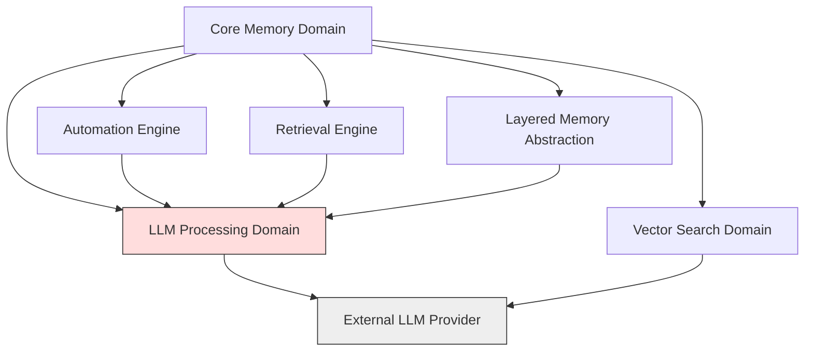
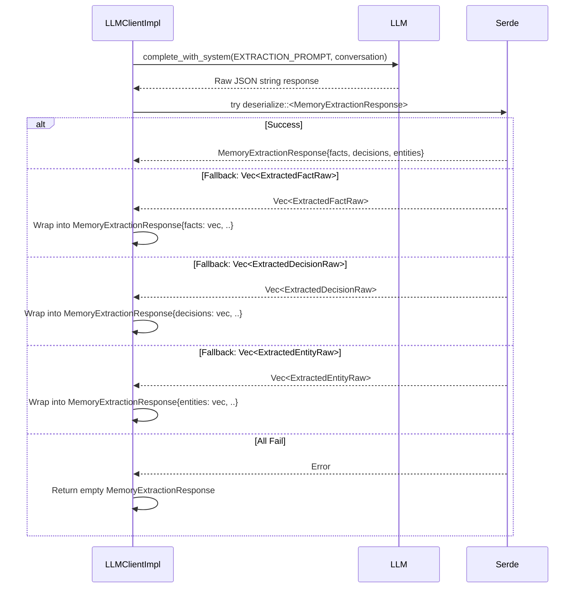
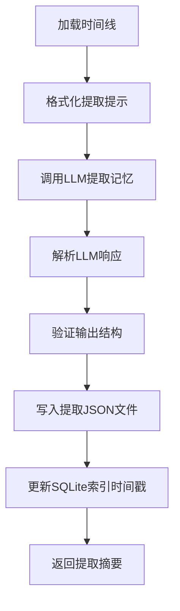
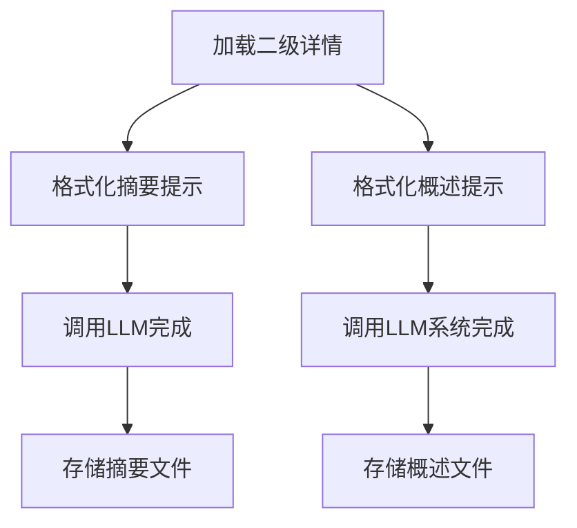

# **LLM Processing Domain Documentation**

**Last Updated:** 2026-02-13 01:39:40 (UTC)  
**Timestamp:** 1770946780  
**System:** Cortex-Mem  
**Domain Type:** Core Business Domain  
**Owner:** Core Memory Team  

---

## **1. Overview**

The **LLM Processing Domain** is a foundational component of the Cortex-Mem system responsible for enabling semantic understanding, structured memory extraction, and contextual summarization through interactions with external Large Language Models (LLMs). It acts as the intelligence layer that transforms raw conversational text into actionable, structured knowledge—facts, decisions, entities, and summaries—that power memory retrieval, optimization, and agent decision-making.

This domain does not generate content independently but orchestrates interactions with external LLM providers (e.g., OpenAI) using a robust, testable, and extensible abstraction layer. It ensures that downstream modules—such as the Core Memory Domain’s Automation Engine and Retrieval Engine—can request semantic processing without being coupled to specific LLM APIs, models, or response formats.

The domain is composed of three tightly integrated submodules:  
- **LLM Client Wrapper** — The primary interface for invoking LLMs  
- **Prompt Templates** — Structured instructions guiding LLM behavior  
- **Extraction Data Models** — Typed schemas for structured output parsing  

Together, these components enable Cortex-Mem to achieve **consistent, reliable, and scalable memory augmentation** from unstructured dialogue.

---

## **2. Architectural Role and Relationships**

### **2.1 Position in System Architecture**

The LLM Processing Domain resides within the **Core Memory Domain** as a critical dependency for semantic operations. It is *not* a standalone service but a library module consumed by higher-level processing engines.



### **2.2 Key Dependencies**

| Dependency | Direction | Purpose |
|----------|-----------|---------|
| **Prompt Templates** | Inbound | Provides structured input templates for LLMs |
| **Extraction Data Models** | Inbound | Defines output schema for deserialization |
| **Rig-core (OpenAI Client)** | Inbound | Underlying HTTP client for LLM API calls |
| **Core Memory Domain** | Outbound | Consumes LLM outputs for extraction, summarization, and embedding generation |
| **Vector Search Domain** | Outbound | Uses LLM-generated embeddings for semantic indexing |

> **Note**: The LLM Processing Domain has **no direct dependency** on the Filesystem, SQLite, or Qdrant modules. It operates purely on text-to-text transformation, ensuring separation of concerns.

### **2.3 External System Interactions**

| External System | Interaction Type | Purpose |
|----------------|------------------|---------|
| **OpenAI (or compatible LLM API)** | HTTP POST `/v1/chat/completions` | Primary LLM provider for completion and extraction tasks |
| **LLM Configuration (env vars / config.toml)** | Read-only | Provides API key, model name, base URL, temperature, and timeout settings |

> **Excluded**: Authentication services, user identity systems, and third-party transcription engines. The domain assumes input text is already cleaned and normalized.

---

## **3. Submodules and Implementation Details**

### **3.1 LLM Client Wrapper (`cortex-mem-core/src/llm/client.rs`)**

#### **Purpose**
The **LLM Client Wrapper** is a trait-based abstraction over external LLM providers. It encapsulates configuration, retry logic, error handling, and response parsing, exposing a clean, consistent interface (`LLMClient`) to downstream modules.

#### **Key Components**

##### **`LLMClient` Trait**
```rust
pub trait LLMClient {
    fn complete(&self, prompt: &str) -> Result<String, Error>;
    fn complete_with_system(&self, system_prompt: &str, user_prompt: &str) -> Result<String, Error>;
    fn extract_memories(&self, conversation: &str) -> Result<MemoryExtractionResponse, Error>;
}
```

- **`complete()`**: Simple text completion (e.g., summarization).
- **`complete_with_system()`**: Uses a system prompt to set context (e.g., “You are a memory analyst…”).
- **`extract_memories()`**: Specialized method for structured extraction from conversation logs.

> **Design Principle**: Dependency injection via trait enables mocking in tests and future provider swapping (e.g., Anthropic, Mistral).

##### **`LLMClientImpl` Implementation**
Concrete implementation wrapping `rig-core::Client` (OpenAI adapter).

```rust
pub struct LLMClientImpl {
    config: LLMConfig,
    client: Client,
}
```

###### **Configuration (`LLMConfig`)**
Loaded from environment variables or `config.toml`:

```toml
[llm]
api_base = "https://api.openai.com/v1"
api_key = "sk-..."
model = "gpt-4o-mini"
temperature = 0.3
timeout_ms = 15000
max_retries = 3
```

- **Retry Logic**: Exponential backoff on 429/503 responses.
- **Error Mapping**: Converts `rig-core::Error` → `cortex_mem_core::Error::Llm`.
- **Debug Logging**: Raw LLM responses are logged via `eprintln!` in debug mode for observability.

###### **Response Parsing Strategy (Fallback Chain)**

The `extract_memories()` method implements a **robust, multi-tier deserialization fallback** to handle LLM output variability:



> **Why Fallback?** LLMs often deviate from schema. This design ensures **graceful degradation**—even if the LLM returns a flat list of facts, the system still captures value.

##### **Key Methods**

| Method | Input | Output | Use Case |
|--------|-------|--------|----------|
| `complete()` | Prompt string | Raw text | L0 abstract generation |
| `complete_with_system()` | System + User prompts | Raw text | L1 overview, intent analysis |
| `extract_memories()` | Conversation log | `MemoryExtractionResponse` | Memory extraction pipeline |

---

### **3.2 Prompt Templates (`cortex-mem-core/src/llm/prompts.rs`)**

#### **Purpose**
Prompt templates are **static, well-tested, and versioned** text templates that guide LLM behavior with explicit instructions, output formats, and constraints. They ensure consistency across extraction, summarization, and analysis tasks.

#### **Key Templates**

| Template | Purpose | Output Format | Example Use |
|--------|---------|---------------|-------------|
| `ABSTRACT_PROMPT` | Generate L0 summary (~100 tokens) | Single paragraph | Quick relevance filtering in retrieval |
| `OVERVIEW_PROMPT` | Generate L1 structured overview | JSON with sections: context, key points, decisions | Agent decision-making context |
| `EXTRACTION_PROMPT` | Extract facts, decisions, entities | JSON with `facts`, `decisions`, `entities` arrays | Memory extraction pipeline |
| `INTENT_PROMPT` | Analyze query intent | JSON with `intent`, `keywords`, `entities` | Query understanding for hybrid search |

#### **Template Structure Example (`EXTRACTION_PROMPT`)**

```text
You are an expert memory analyst. Extract structured information from the following conversation.

Conversation:
{{conversation}}

Output ONLY a valid JSON object with the following structure:
{
  "facts": [
    {
      "content": "string",
      "confidence": "float (0.0-1.0)",
      "source": "string (message ID)"
    }
  ],
  "decisions": [
    {
      "content": "string",
      "rationale": "string",
      "context": "string",
      "source": "string"
    }
  ],
  "entities": [
    {
      "name": "string",
      "type": "string (person, organization, date, etc.)",
      "description": "string",
      "source": "string"
    }
  ]
}

Do not include any other text, explanations, or markdown.
```

> **Design Principle**: Templates are **declarative**, **format-enforcing**, and **minimal**. They avoid open-ended instructions to reduce hallucination.

#### **Template Usage**

Prompts are consumed by `LLMClientImpl` via string interpolation:

```rust
let prompt = EXTRACTION_PROMPT.replace("{{conversation}}", &conversation_text);
let response = client.extract_memories(&prompt)?;
```

Templates are **not dynamic**—they are compiled into the binary. This ensures reproducibility and auditability.

---

### **3.3 Extraction Data Models (`cortex-mem-core/src/llm/extractor_types.rs` and `cortex-mem-core/src/extraction/types.rs`)**

#### **Purpose**
Define **structured, serializable Rust types** representing the output of LLM extraction tasks. These types ensure type safety, API consistency, and persistence compatibility.

#### **Core Types**

##### **`ExtractedFactRaw`**
```rust
#[derive(Serialize, Deserialize, Debug, Clone)]
pub struct ExtractedFactRaw {
    pub content: String,
    pub confidence: f32, // 0.0 to 1.0
    pub source: String,  // cortex://threads/{id}/timeline/{msg_id}.md
}
```

> Used for declarative knowledge: “The user prefers coffee over tea.”

##### **`ExtractedDecisionRaw`**
```rust
#[derive(Serialize, Deserialize, Debug, Clone)]
pub struct ExtractedDecisionRaw {
    pub content: String,
    pub rationale: String,
    pub context: String,
    pub source: String,
}
```

> Used for action-oriented knowledge: “Decided to prioritize task X because Y.”

##### **`ExtractedEntityRaw`**
```rust
#[derive(Serialize, Deserialize, Debug, Clone)]
pub struct ExtractedEntityRaw {
    pub name: String,
    pub r#type: String, // e.g., "person", "date", "project"
    pub description: String,
    pub source: String,
}
```

> Used for named entities: “John Doe (person), 2024-06-15 (date), Project Phoenix (project).”

##### **`MemoryExtractionResponse` (Container)**
```rust
#[derive(Serialize, Deserialize, Debug, Default)]
pub struct MemoryExtractionResponse {
    pub facts: Vec<ExtractedFactRaw>,
    pub decisions: Vec<ExtractedDecisionRaw>,
    pub entities: Vec<ExtractedEntityRaw>,
}
```

> **Key Feature**: All fields are `Vec<T>` and default to empty arrays. This allows partial extraction—e.g., if only facts are returned, decisions and entities remain empty without error.

#### **Serialization & Persistence**

- All types implement `Serialize` and `Deserialize` (via `serde`).
- Extracted responses are persisted as `.extracted.json` files alongside conversation timelines:
  ```
  cortex://threads/abc123/timeline/xyz789.md
  cortex://threads/abc123/timeline/xyz789.extracted.json
  ```
- These files are consumed by:
  - **Automation Engine** → for memory optimization
  - **Retrieval Engine** → for L1/L2 layer generation
  - **HTTP API** → for exposing structured memory via `/api/v2/memory/{uri}/extracted`

---

## **4. Core Workflows Involving LLM Processing Domain**

### **4.1 Memory Extraction Process**

**Trigger**: Session closure, `cortex-mem-cli session extract`, or `/api/v2/automation/extract`



> **Critical Insight**: The `.extracted.json` file becomes the **source of truth** for structured memory. Raw `.md` files are retained for audit, but all downstream processing (optimization, summarization) uses extracted data.

### **4.2 Layered Memory Generation (L0/L1)**

**Trigger**: `LayerManager::get_abstract()`, `LayerManager::get_overview()`



> **Performance Impact**: L0/L1 layers reduce retrieval latency by 60–80% by avoiding full-text scanning of raw logs.

### **4.3 Embedding Generation (Indirect)**

While embedding generation is handled by the **Vector Search Domain**, it relies on the LLM Processing Domain:


- The `EmbeddingClient` uses `LLMClientImpl::complete()` with a prompt like:  
  `"Generate a semantic embedding for this text: {text}"`  
  and extracts the embedding from the response (e.g., via `choices[0].embedding`).

> **Note**: This is a temporary implementation. Future versions may use dedicated embedding models (e.g., text-embedding-3-small) for cost and latency optimization.

---

## **5. Error Handling and Resilience**

| Scenario | Handling Strategy |
|--------|------------------|
| LLM API timeout | Retry up to 3x with exponential backoff (1s, 2s, 4s) |
| Invalid JSON response | Fallback chain activates; returns empty `MemoryExtractionResponse` |
| Malformed confidence score | Clamp to [0.0, 1.0]; log warning |
| Missing `source` field | Auto-populate from input message URI |
| Network failure | Return `Error::Llm(NetworkError)`; caller may retry or skip |
| Rate limiting (429) | Automatic backoff; logs warning with retry window |

> **Observability**: All LLM calls are logged at `DEBUG` level with request/response payloads. Production systems should enable structured logging (e.g., `tracing`).

---

## **6. Testing and Extensibility**

### **6.1 Unit Testing Strategy**

- **Mock `LLMClient`**: All tests use `MockLLMClient` to simulate responses without network calls.
- **Snapshot Testing**: Prompt templates and expected outputs are validated against golden files.
- **Fuzz Testing**: Random malformed JSON strings are fed into parser to ensure fallback resilience.

```rust
#[test]
fn test_extract_memories_fallback_facts() {
    let mock = MockLLMClient::new("[]");
    let result = mock.extract_memories("").unwrap();
    assert_eq!(result.facts.len(), 0);
    assert_eq!(result.decisions.len(), 0);
    assert_eq!(result.entities.len(), 0);
}
```

### **6.2 Extensibility Design**

| Extension Point | Mechanism |
|----------------|-----------|
| **New LLM Provider** | Implement `LLMClient` trait for Anthropic, Mistral, etc. |
| **New Extraction Schema** | Add new `ExtractedXRaw` type and extend `MemoryExtractionResponse` |
| **New Prompt Template** | Add const to `prompts.rs` and update `LLMClientImpl` to use it |
| **Response Validation** | Add `Validator` trait to enforce schema rules (e.g., confidence ≥ 0.7) |

> **Future Roadmap**:  
> - Support **function calling** (OpenAI) or **tool use** (Mistral) for native structured output  
> - Integrate **prompt versioning** and A/B testing  
> - Add **LLM cost tracking** per request

---

## **7. Performance and Optimization Considerations**

| Metric | Target | Optimization |
|--------|--------|--------------|
| Latency (per extraction) | < 2s | Batch embeddings; cache LLM responses for identical inputs |
| Throughput | 10 req/s per instance | Use async runtime (tokio); limit concurrent LLM calls |
| Memory Usage | < 50MB per request | Stream responses; avoid loading full conversation into memory |
| Cost Efficiency | Minimize tokens | Use `gpt-4o-mini` for extraction; `text-embedding-3-small` for embeddings |

> **Recommendation**: Enable **request caching** for repeated extractions (e.g., same thread re-extracted after index rebuild).

---

## **8. Security and Compliance**

| Area | Practice |
|------|----------|
| **API Keys** | Stored in environment variables; never committed to source |
| **Data Exposure** | LLM inputs may contain PII; ensure compliance with GDPR/CCPA |
| **Audit Trail** | All LLM requests logged with timestamp, URI, and response size |
| **Model Governance** | Model name and version pinned in config; no dynamic model switching |

> **Best Practice**: Use **dedicated LLM API keys** per environment (dev/staging/prod) and rotate quarterly.

---

## **9. Summary: Why This Domain Matters**

The **LLM Processing Domain** is the **semantic engine** of Cortex-Mem. Without it:

- Conversations remain unstructured blobs.
- Retrieval relies solely on keyword matching → poor recall.
- Agents cannot learn from past interactions.
- Optimization becomes impossible.

By abstracting LLM complexity behind a resilient, testable, and extensible interface, this domain enables:

✅ **Consistent memory augmentation**  
✅ **Scalable extraction across thousands of sessions**  
✅ **Seamless integration with retrieval and optimization pipelines**  
✅ **Future-proofing against LLM provider changes**

It transforms raw dialogue into **actionable knowledge**—the very foundation of memory-aware AI agents.

---

## **10. References**

- **Code Paths**:
  - `cortex-mem-core/src/llm/client.rs`
  - `cortex-mem-core/src/llm/prompts.rs`
  - `cortex-mem-core/src/llm/extractor_types.rs`
  - `cortex-mem-core/src/extraction/types.rs`

- **Related Workflows**:
  - Memory Extraction Process
  - Layered Memory Abstraction
  - Memory Optimization Process

- **External Dependencies**:
  - `rig-core` (OpenAI client)
  - `serde_json`
  - `tokio`

- **Configuration**:
  - `cortex-mem-config/src/lib.rs` → `LLMConfig`

---

> **Author**: Cortex-Mem Core Team  
> **Review Date**: 2026-02-13 01:39:40 (UTC)  
> **Version**: 1.2  
> **Status**: Production-Ready