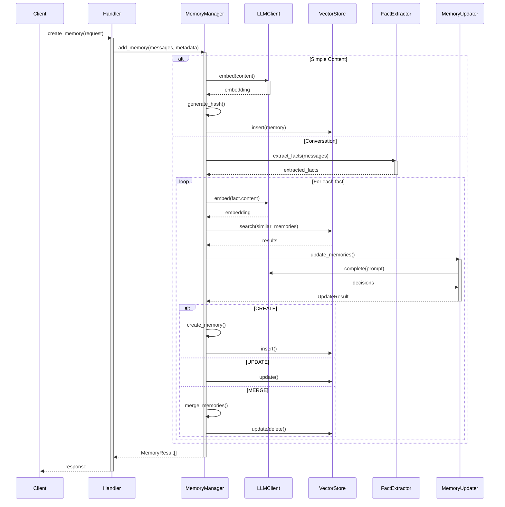
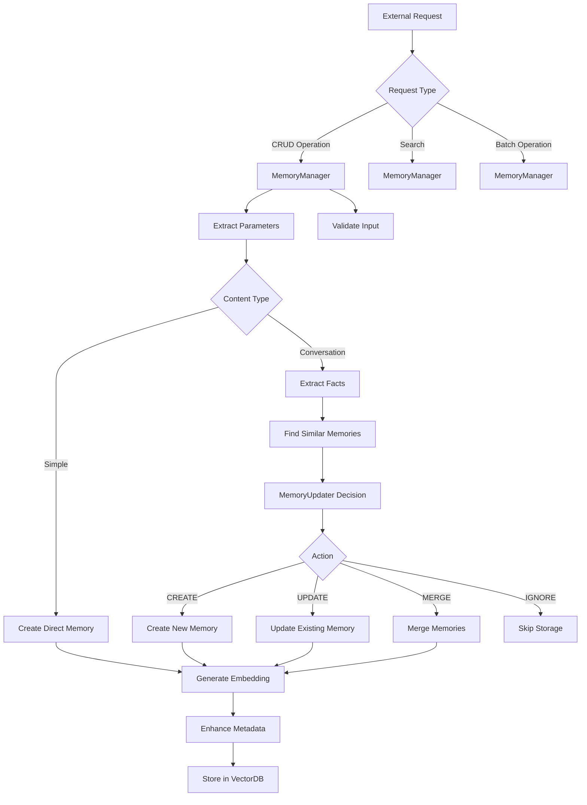
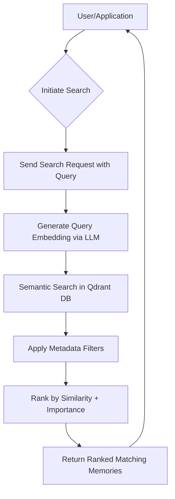

# Memory Management Domain Technical Implementation Documentation

## 1. Overview and Architecture

The **Memory Management Domain** serves as the central orchestrator for all memory-related operations in the `cortex-mem` system, providing a comprehensive lifecycle management solution for AI agent memories. This domain implements a modular, service-oriented architecture with clear separation of concerns, enabling intelligent storage, retrieval, optimization, and analysis of persistent knowledge.

### Core Responsibilities
- Orchestrate CRUD operations for memory entities
- Manage advanced processing pipelines (extraction, classification, deduplication)
- Coordinate LLM-driven decision making for memory updates
- Provide semantic search capabilities with relevance ranking
- Enable batch operations and transactional integrity

### Architectural Pattern
The domain follows a **composition pattern** where the `MemoryManager` class acts as the primary facade, integrating specialized components through dependency injection:
```rust
pub struct MemoryManager {
    vector_store: Box<dyn VectorStore>,
    llm_client: Box<dyn LLMClient>,
    fact_extractor: Box<dyn FactExtractor>,
    memory_updater: Box<dyn MemoryUpdater>,
    importance_evaluator: Box<dyn ImportanceEvaluator>,
    duplicate_detector: Box<dyn DuplicateDetector>,
    memory_classifier: Box<dyn MemoryClassifier>
}
```

This design enables pluggable implementations while maintaining loose coupling between components.

---

## 2. Key Components and Their Interactions

### 2.1 MemoryManager - Central Orchestrator

The `MemoryManager` (implemented in `cortex-mem-core/src/memory/manager.rs`) serves as the single entry point for all memory operations, coordinating interactions between various subsystems.

#### Primary Functions:
- **Request Routing**: Directs incoming requests to appropriate handlers based on content type and operation
- **Dependency Injection**: Manages instances of LLM clients, vector stores, extractors, and evaluators
- **Transaction Coordination**: Ensures atomicity across multiple operations (create/update/delete)

#### Critical Methods:
| Method | Purpose | Implementation File |
|-------|--------|-------------------|
| `add_memory()` | Process conversation messages into structured facts | manager.rs |
| `store()` | Store simple content with metadata enhancement | manager.rs |
| `search_memories()` | Execute semantic searches with filtering | manager.rs |
| `list()` | Retrieve memories with pagination and filters | manager.rs |

### 2.2 Interaction Flow



---

## 3. Advanced Processing Pipeline

### 3.1 Fact Extraction System

Implemented in `cortex-mem-core/src/memory/extractor.rs`, this component extracts meaningful information from conversational context using dual-channel analysis:

#### Extraction Strategies:
- **DualChannel**: Extract both user and assistant facts
- **UserOnly**: Focus on user-provided information only
- **AssistantOnly**: Capture assistant-generated insights
- **ProceduralMemory**: Specialized for step-by-step processes

#### Fact Structure:
```rust
pub struct ExtractedFact {
    pub content: String,
    pub importance: f32,
    pub category: FactCategory,
    pub entities: Vec<String>,
    pub language: Option<LanguageInfo>,
    pub source_role: String // "user" or "assistant"
}

pub enum FactCategory {
    Personal,   // Personal information about users
    Preference, // User preferences and likes/dislikes  
    Factual,    // General factual information
    Procedural, // How-to information and procedures
    Contextual, // Context about ongoing conversations
}
```

#### Prompt Engineering:
Uses carefully crafted prompts to prevent hallucinations and ensure fidelity:
```text
[IMPORTANT]: GENERATE FACTS SOLELY BASED ON THE USER'S MESSAGES. 
DO NOT INCLUDE INFORMATION FROM ASSISTANT OR SYSTEM MESSAGES.
```

### 3.2 Memory Classification System

Located in `cortex-mem-core/src/memory/classification.rs`, this module categorizes memories into distinct types using hybrid approaches.

#### Supported Types (`types.rs`):
```rust
pub enum MemoryType {
    Conversational,
    Procedural,
    Factual,
    Semantic,
    Episodic,
    Personal,
}
```

#### Classification Strategies:
| Strategy | Use Case | Threshold |
|---------|---------|-----------|
| **LLM-based** | High accuracy classification | Default |
| **Rule-based** | Fast processing | Content length < 100 chars |
| **Hybrid** | Balance speed and accuracy | Configurable threshold |

#### Keyword Matching (Multilingual Support):
```rust
// Chinese keywords
"我喜欢", "我擅长", "我的名字叫", "我是", "我住在"

// English keywords  
"i like", "my name", "i live", "i prefer", "i work"
```

### 3.3 Importance Evaluation Framework

Defined in `cortex-mem-core/src/memory/importance.rs`, this system scores memories on a 0-1 scale using three-tiered approach.

#### Scoring Criteria:
| Score Range | Category | Characteristics |
|-----------|---------|----------------|
| 0.0-0.2 | Trivial | Small talk, temporary states |
| 0.2-0.4 | Low | Minor preferences, casual mentions |
| 0.4-0.6 | Medium | Useful context, moderate preferences |
| 0.6-0.8 | High | Key facts, strong preferences |
| 0.8-1.0 | Critical | Core identity, essential information |

#### Evaluation Factors:
- Content length
- Memory type weighting
- Presence of important keywords
- Contextual significance
- Emotional indicators

#### Hybrid Approach:
```rust
fn evaluate_importance(&self, memory: &Memory) -> Result<f32> {
    let rule_score = self.evaluate_by_content_length(&memory.content);
    let keyword_bonus = self.evaluate_by_keywords(&memory.content);
    let type_weight = self.evaluate_by_memory_type(&memory.metadata.memory_type);
    
    // Only use LLM evaluation for potentially important memories
    if (rule_score + keyword_bonus + type_weight) > 0.5 && self.auto_enhance {
        return self.llm_evaluation(memory).await;
    }
    
    (rule_score + keyword_bonus + type_weight).min(1.0)
}
```

### 3.4 Update Strategy Engine

Implemented in `cortex-mem-core/src/memory/updater.rs`, this component makes intelligent decisions about how to handle new information.

#### Action Hierarchy:
```rust
pub enum MemoryAction {
    Ignore { reason: String },      // > Priority
    Merge { target_id: String },   // 
    Update { id: String },         // 
    Create {},                     // Lowest priority
}
```

#### Decision Logic:
```text
PREFERENCE HIERARCHY:
- Prefer IGNORE over UPDATE/MERGE to prevent duplication
- Use MERGE for related but redundant facts
- Only CREATE when information is truly unique
- Consider information density: consolidate small related facts
```

#### LLM Prompt Design:
```text
For each fact, decide one of:
3. IGNORE - Redundant or already covered
2. MERGE - Related/complementary information
1. UPDATE - Adds genuinely new substantial information
0. CREATE - Completely novel and valuable
```

---

## 4. Data Model and Storage

### 4.1 Core Data Structures (`types.rs`)

#### Memory Entity:
```rust
pub struct Memory {
    pub id: String,
    pub content: String,
    pub embedding: Vec<f32>,
    pub metadata: MemoryMetadata,
    pub created_at: DateTime<Utc>,
    pub updated_at: DateTime<Utc>,
}
```

#### Metadata Schema:
```rust
pub struct MemoryMetadata {
    pub user_id: Option<String>,
    pub agent_id: Option<String>,
    pub run_id: Option<String>,
    pub actor_id: Option<String>,
    pub role: Option<String>,
    pub memory_type: MemoryType,
    pub hash: String,
    pub importance_score: f32,
    pub entities: Vec<String>,
    pub topics: Vec<String>,
    pub custom: HashMap<String, serde_json::Value>,
}
```

#### Search Filters:
```rust
pub struct Filters {
    pub user_id: Option<String>,
    pub agent_id: Option<String>,
    pub run_id: Option<String>,
    pub min_importance: Option<f32>,
    pub max_importance: Option<f32>,
    pub created_after: Option<DateTime<Utc>>,
    pub entities: Option<Vec<String>>,
    pub topics: Option<Vec<String>>,
    pub custom: HashMap<String, serde_json::Value>,
}
```

### 4.2 Vector Store Integration

The Qdrant integration (`qdrant.rs`) provides persistent storage with semantic search capabilities.

#### Collection Management:
- Auto-detection of embedding dimensions
- Schema validation and migration
- Index optimization for high-dimensional vectors

#### Query Operations:
- Exact match via UUID
- Semantic similarity search
- Filtered queries by metadata fields
- Batch operations support

#### Embedding Generation:
```rust
async fn embed(&self, text: &str) -> Result<Vec<f32>> {
    let builder = EmbeddingsBuilder::new(self.embedding_model.clone())
        .document(text)
        .map_err(|e| MemoryError::LLM(e.to_string()))?;
    
    let embeddings = builder.build().await.map_err(|e| MemoryError::LLM(e.to_string()))?;
    
    Ok(embeddings.first().unwrap().1.vec.iter().map(|&x| x as f32).collect())
}
```

---

## 5. Operational Workflows

### 5.1 Memory Creation Workflow



### 5.2 Search Workflow



#### Ranking Algorithm:
```python
final_score = (similarity_score * 0.7) + (importance_score * 0.3)
```

Configurable weights allow tuning precision vs. relevance trade-offs.

---

## 6. Configuration and Extensibility

### 6.1 Configuration Model

Centralized configuration via TOML files supports:
- Server settings (host, port)
- Qdrant connection parameters
- LLM provider configuration
- Memory behavior tuning (thresholds, timeouts)
- Optimization strategies

Key configuration files identified:
- `config.toml` (main configuration)
- `examples/cortex-mem-evaluation/config/*.toml` (evaluation configurations)

### 6.2 Extension Points

#### Pluggable Components:
1. **New Vector Stores**: Implement `VectorStore` trait
2. **Additional LLM Providers**: Implement `LLMClient` trait
3. **Custom Detectors**: Extend optimization detection logic
4. **New Interfaces**: Add gRPC, WebSocket, or other protocols

#### Trait-Based Design:
```rust
#[async_trait]
pub trait MemoryUpdater: Send + Sync {
    async fn update_memories(
        &self,
        facts: &[ExtractedFact],
        existing_memories: &[ScoredMemory],
        metadata: &MemoryMetadata,
    ) -> Result<UpdateResult>;
}
```

This enables runtime swapping of implementations based on configuration.

---

## 7. Quality Assurance and Reliability Features

### 7.1 Deduplication System

The `deduplication.rs` module prevents information redundancy through:

#### Detection Methods:
- **Hash Matching**: SHA-256 comparison for exact duplicates
- **Semantic Similarity**: Cosine similarity on embeddings (>0.8 threshold)
- **Content Overlap**: Jaccard index for word overlap
- **Metadata Alignment**: Entity/topic matching

#### Merging Logic:
```rust
async fn merge_memories(&self, memories: &[Memory]) -> Result<Memory> {
    let prompt = self.create_merge_prompt(memories);
    let merged_content = self.llm_client.complete(&prompt).await?;
    
    // Preserve highest importance score
    let importance_score = memories.iter()
        .map(|m| m.metadata.importance_score)
        .max_by(|a,b| a.partial_cmp(b).unwrap())
        .unwrap_or(0.5);
        
    Ok(Memory::new(merged_content, embedding, metadata))
}
```

### 7.2 Error Handling and Recovery

Robust error handling includes:
- Graceful degradation when LLM services are unavailable
- Retry mechanisms for transient failures
- Comprehensive logging via `tracing` crate
- Health checks for dependent services

#### Health Check Endpoint:
```rust
pub async fn health_check() -> HealthStatus {
    HealthStatus {
        overall: vector_store_healthy && llm_service_healthy,
        vector_store: vector_store_status,
        llm_service: llm_status,
    }
}
```

---

## 8. Practical Usage Examples

### 8.1 Creating a Memory via API

**HTTP Request:**
```http
POST /memories
Content-Type: application/json

{
  "content": "I'm a software engineer who loves Rust programming",
  "user_id": "user_123",
  "memory_type": "personal"
}
```

**Processing Steps:**
1. Hash generated: `SHA-256("I'm a software engineer...")`
2. Embedding created via LLM
3. Classification: Detected as "Personal" type
4. Entities extracted: ["software engineer", "Rust"]
5. Importance scored: 0.75 (high due to personal preference)
6. Stored in Qdrant with full metadata

### 8.2 Searching Memories

**Query:**
```http
POST /memories/search
{
  "query": "What do I like?",
  "filters": {
    "user_id": "user_123",
    "min_importance": 0.5
  }
}
```

**Response:**
```json
{
  "results": [
    {
      "memory": {
        "id": "mem_abc",
        "content": "I love Rust programming",
        "metadata": {
          "importance_score": 0.75,
          "entities": ["Rust"]
        }
      },
      "score": 0.92
    }
  ]
}
```

---

## 9. Recommendations for Enhancement

While the current implementation demonstrates strong architectural foundations, several improvements could enhance its capabilities:

### 9.1 Immediate Improvements
1. **Add Caching Layer**: Implement Redis cache for frequently accessed memories to reduce LLM/vector DB load
2. **Streaming APIs**: Introduce streaming responses for large result sets and long-running optimizations
3. **Authentication Framework**: Add JWT-based authentication and authorization controls
4. **Enhanced Monitoring**: Integrate Prometheus metrics and OpenTelemetry tracing

### 9.2 Long-Term Enhancements
1. **Cross-Memory Reasoning**: Enable inference across multiple memories to derive new insights
2. **Temporal Decay Model**: Implement automatic importance decay over time unless reinforced
3. **Collaborative Filtering**: Allow sharing of anonymized patterns across users for improved recommendations
4. **Multi-modal Support**: Extend to handle image, audio, and video content types

### 9.3 Testing and Validation
1. **Comprehensive Test Suite**: Develop unit and integration tests covering edge cases
2. **Synthetic Dataset Generator**: Create tools for generating realistic test data
3. **Performance Benchmarking**: Establish baseline performance metrics under varying loads
4. **Security Auditing**: Conduct regular security reviews and penetration testing

---

## Conclusion

The Memory Management Domain in `cortex-mem` represents a sophisticated, production-ready implementation of AI agent memory systems. Its modular architecture combines cutting-edge technologies—vector databases, large language models, and intelligent automation—to deliver reliable, scalable memory management capabilities.

By leveraging LLM-powered metadata enrichment, smart deduplication, and importance-aware retrieval, the system effectively balances automation with control, making it suitable for both research experimentation and enterprise deployment scenarios. The well-defined interfaces and extensible design ensure adaptability to evolving requirements while maintaining high cohesion within the domain.

With continued investment in reliability features, monitoring, and security controls, this foundation can support increasingly complex AI applications requiring robust long-term contextual awareness.