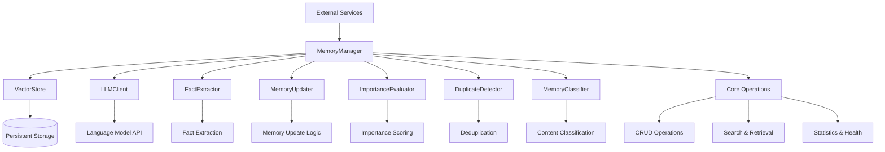
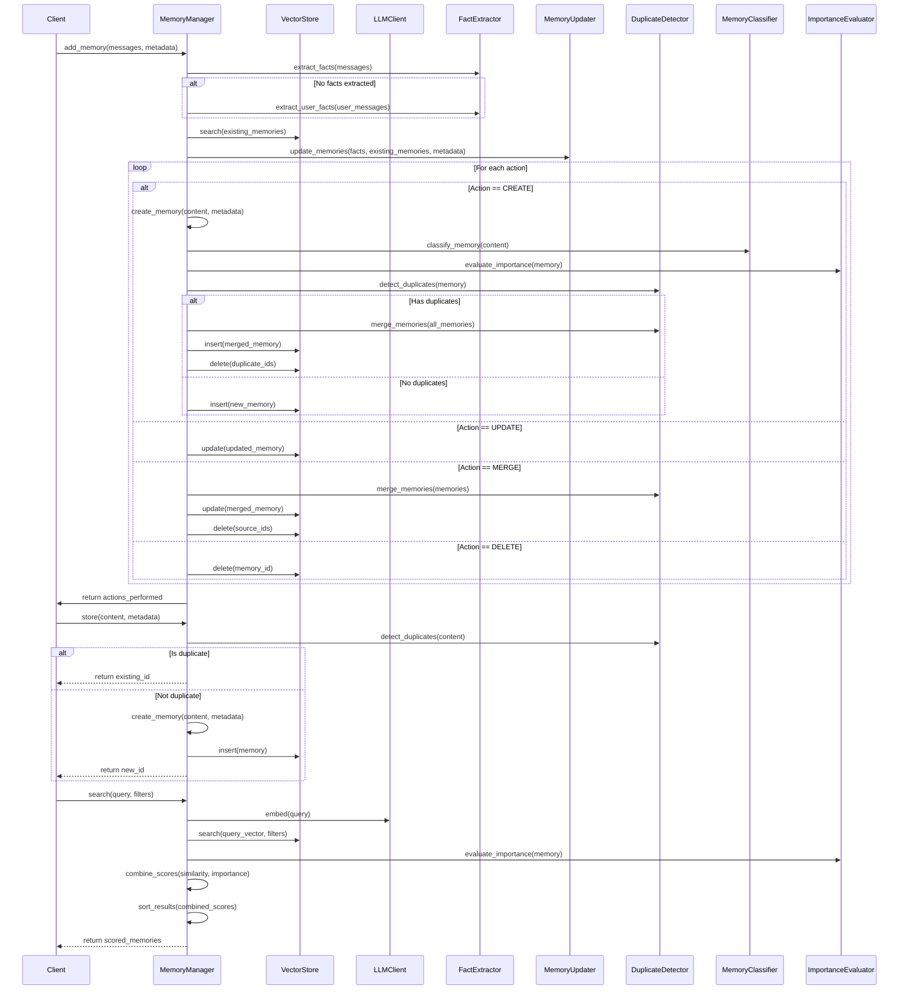

# Memory Management Domain Technical Documentation

## 1. Overview

The **Memory Management Domain** serves as the central orchestrator for all memory operations within the Cortex-Mem system, providing a comprehensive solution for AI agent memory persistence, retrieval, and optimization. This domain enables intelligent software agents to maintain context across interactions by managing structured knowledge through advanced processing pipelines that leverage large language models (LLMs) and vector-based storage.

At its core, the Memory Manager integrates multiple specialized components including vector storage, LLM services, fact extraction, importance evaluation, duplicate detection, and content classification. The architecture follows a dependency injection pattern where external services are provided at construction time, enabling flexible composition and testability while maintaining separation of concerns.

### Key Characteristics
- **Modular Design**: Clear separation between core logic and supporting processors
- **LLM-Augmented Processing**: Intelligent metadata generation using language models
- **Semantic Capabilities**: Vector-based similarity search with hybrid scoring
- **Lifecycle Management**: Full CRUD operations with automated enhancement
- **Optimization Ready**: Built-in support for deduplication and quality improvement

## 2. Architecture Diagram



## 3. Core Components and Interfaces

### 3.1 MemoryManager

The `MemoryManager` struct is the primary entry point for all memory operations, coordinating interactions between various subsystems:

```rust
pub struct MemoryManager {
    vector_store: Box<dyn VectorStore>,
    llm_client: Box<dyn LLMClient>,
    config: MemoryConfig,
    fact_extractor: Box<dyn FactExtractor + 'static>,
    memory_updater: Box<dyn MemoryUpdater + 'static>,
    importance_evaluator: Box<dyn ImportanceEvaluator + 'static>,
    duplicate_detector: Box<dyn DuplicateDetector + 'static>,
    memory_classifier: Box<dyn MemoryClassifier + 'static>,
}
```

#### Construction Pattern
The manager uses dependency injection to receive essential services:
```rust
impl MemoryManager {
    pub fn new(
        vector_store: Box<dyn VectorStore>,
        llm_client: Box<dyn LLMClient>,
        config: MemoryConfig,
    ) -> Self { /* ... */ }
}
```

This approach allows for flexible configuration and testing, with internal processors created from cloned references to the injected dependencies.

### 3.2 Key Interfaces

#### VectorStore Interface
Provides persistent storage capabilities:
- `insert(&self, memory: &Memory) -> Result<()>`: Store a memory record
- `search(&self, query_vector: &[f32], filters: &Filters, limit: usize) -> Result<Vec<ScoredMemory>>`: Semantic similarity search
- `get(&self, id: &str) -> Result<Option<Memory>>`: Retrieve by ID
- `update(&self, memory: &Memory) -> Result<()>`: Update existing record
- `delete(&self, id: &str) -> Result<()>`: Remove from storage
- `list(&self, filters: &Filters, limit: Option<usize>) -> Result<Vec<Memory>>`: Filtered retrieval
- `health_check(&self) -> Result<bool>`: Database connectivity check

#### LLMClient Interface
Enables interaction with language model services:
- `complete(&self, prompt: &str) -> Result<String>`: Text generation
- `embed(&self, text: &str) -> Result<Vec<f32>>`: Generate embeddings
- `classify_memory(&self, prompt: &str) -> Result<ClassificationResult>`: Content categorization
- `extract_keywords(&self, content: &str) -> Result<Vec<String>>`: Keyword extraction
- `summarize(&self, content: &str, max_length: Option<usize>) -> Result<String>`: Content summarization
- `health_check(&self) -> Result<bool>`: Service availability check

#### Specialized Processors
| Processor | Purpose |
|---------|--------|
| **FactExtractor** | Extract structured facts from conversations |
| **MemoryUpdater** | Determine optimal actions (CREATE/UPDATE/MERGE/DELETE) |
| **ImportanceEvaluator** | Score memory value on 0-1 scale |
| **DuplicateDetector** | Identify and merge redundant memories |
| **MemoryClassifier** | Categorize content type and extract entities/topics |

## 4. Core Functionalities

### 4.1 Enhanced Memory Creation

The `enhance_memory` method adds rich metadata through LLM-powered analysis:

```rust
async fn enhance_memory(&self, memory: &mut Memory) -> Result<()> {
    // Extract keywords
    if let Ok(keywords) = self.llm_client.extract_keywords(&memory.content).await {
        memory.metadata.custom.insert("keywords", serde_json::Value::Array(
            keywords.into_iter().map(serde_json::Value::String).collect()
        ));
    }

    // Generate summary for long content
    if memory.content.len() > self.config.auto_summary_threshold {
        if let Ok(summary) = self.llm_client.summarize(&memory.content, Some(200)).await {
            memory.metadata.custom.insert("summary", serde_json::Value::String(summary));
        }
    }

    // Classify memory type and extract metadata
    if let Ok(memory_type) = self.memory_classifier.classify_memory(&memory.content).await {
        memory.metadata.memory_type = memory_type;
    }

    // Extract entities and topics
    if let Ok(entities) = self.memory_classifier.extract_entities(&memory.content).await {
        memory.metadata.entities = entities;
    }

    if let Ok(topics) = self.memory_classifier.extract_topics(&memory.content).await {
        memory.metadata.topics = topics;
    }

    // Evaluate importance
    if let Ok(importance) = self.importance_evaluator.evaluate_importance(memory).await {
        memory.metadata.importance_score = importance;
    }

    // Check for duplicates and merge if necessary
    if let Ok(duplicates) = self.duplicate_detector.detect_duplicates(memory).await {
        if !duplicates.is_empty() {
            let mut all_memories = vec![memory.clone()];
            all_memories.extend(duplicates);
            
            if let Ok(merged_memory) = self.duplicate_detector.merge_memories(&all_memories).await {
                *memory = merged_memory;
                
                // Remove old duplicates
                for duplicate in &all_memories[1..] {
                    let _ = self.vector_store.delete(&duplicate.id).await;
                }
            }
        }
    }
}
```

Key features include:
- Automatic keyword extraction and summarization
- Content classification into six types: Conversational, Procedural, Factual, Semantic, Episodic, Personal
- Entity and topic recognition
- Importance scoring using hybrid rule-based and LLM approaches
- Duplicate detection and automatic merging

### 4.2 Conversation-Based Memory Processing

The `add_memory` method handles conversation inputs through a sophisticated pipeline:

```rust
pub async fn add_memory(
    &self,
    messages: &[Message],
    metadata: MemoryMetadata,
) -> Result<Vec<MemoryResult>> {
    // Handle procedural memory special case
    if metadata.agent_id.is_some() && metadata.memory_type == MemoryType::Procedural {
        return self.create_procedural_memory(messages, metadata).await;
    }

    // Primary fact extraction
    let extracted_facts = self.fact_extractor.extract_facts(messages).await?;
    let mut final_extracted_facts = extracted_facts;

    // Fallback strategies
    if final_extracted_facts.is_empty() {
        // Try user-focused extraction
        let user_messages: Vec<_> = messages.iter().filter(|msg| msg.role == "user").cloned().collect();
        
        if !user_messages.is_empty() {
            if let Ok(user_facts) = self.fact_extractor.extract_user_facts(&user_messages).await {
                if !user_facts.is_empty() {
                    final_extracted_facts = user_facts;
                }
            }
        }

        // Individual message extraction
        if final_extracted_facts.is_empty() {
            let mut single_message_facts = Vec::new();
            for message in messages {
                if let Ok(mut facts) = self.fact_extractor.extract_facts_from_text(&message.content).await {
                    for fact in &mut facts {
                        fact.source_role = message.role.clone();
                    }
                    single_message_facts.extend(facts);
                }
            }
            if !single_message_facts.is_empty() {
                final_extracted_facts = single_message_facts;
            }
        }

        // Ultimate fallback - store raw user content
        if final_extracted_facts.is_empty() {
            let user_content = messages
                .iter()
                .filter(|msg| msg.role == "user")
                .map(|msg| format!("用户: {}", msg.content))
                .collect::<Vec<_>>()
                .join("\n");

            if !user_content.trim().is_empty() {
                let memory_id = self.store(user_content.clone(), metadata).await?;
                return Ok(vec![/* ... */]);
            }
        }
    }

    // Process each fact through update pipeline
    for fact in &final_extracted_facts {
        let query_embedding = self.llm_client.embed(&fact.content).await?;
        let existing_memories = self.vector_store.search_with_threshold(
            &query_embedding,
            &filters,
            5,
            self.config.search_similarity_threshold,
        ).await?;

        let update_result = self.memory_updater.update_memories(
            &[fact.clone()],
            &existing_memories,
            &metadata
        ).await?;

        // Apply resulting actions
        for action in &update_result.actions_performed {
            match action {
                MemoryAction::Create { content, metadata } => {
                    let memory_id = self.store(content.clone(), metadata.clone()).await?;
                    // Record result
                }
                MemoryAction::Update { id, content } => {
                    self.update(id, content.clone()).await?;
                    // Record result
                }
                MemoryAction::Merge { target_id, source_ids, merged_content } => {
                    self.update(target_id, merged_content.clone()).await?;
                    for source_id in source_ids {
                        self.vector_store.delete(source_id).await?;
                    }
                    // Record result
                }
                MemoryAction::Delete { id } => {
                    self.vector_store.delete(id).await?;
                    // Record result
                }
            }
        }
    }
}
```

Processing includes multiple fallback strategies:
1. Primary fact extraction using dual-channel analysis
2. User-focused extraction as first fallback
3. Individual message processing as second fallback
4. Raw user content storage as ultimate fallback

### 4.3 Search Optimization

The search functionality combines semantic similarity with importance weighting:

```rust
// In implementation...
async fn search_with_threshold(
    &self,
    query: &str,
    filters: &Filters,
    limit: usize,
    threshold: f32
) -> Result<Vec<ScoredMemory>> {
    let query_embedding = self.llm_client.embed(query).await?;
    let similar_memories = self.vector_store.search(&query_embedding, filters, limit).await?;
    
    // Apply threshold filtering
    let filtered_memories: Vec<ScoredMemory> = similar_memories
        .into_iter()
        .filter(|scored_memory| scored_memory.score >= threshold)
        .collect();

    // Enhance with importance scores
    let mut enhanced_results = Vec::new();
    for mut scored_memory in filtered_memories {
        let combined_score = self.combine_scores(
            scored_memory.score,
            scored_memory.memory.metadata.importance_score
        );
        scored_memory.score = combined_score;
        enhanced_results.push(scored_memory);
    }

    // Sort by combined score
    enhanced_results.sort_by(|a, b| b.score.partial_cmp(&a.score).unwrap());
    Ok(enhanced_results)
}
```

Search features:
- Configurable similarity thresholds
- Hybrid scoring combining embedding similarity and importance
- Metadata filtering capabilities
- Ranked results presentation

### 4.4 Procedural Memory Support

Special handling exists for procedural memories that preserve action-result sequences:

```rust
async fn create_procedural_memory(
    &self,
    messages: &[Message],
    metadata: MemoryMetadata
) -> Result<Vec<MemoryResult>> {
    // Use specialized system prompt for procedural memory
    let prompt = format!(
        "{}\n\n{}", 
        PROCEDURAL_MEMORY_SYSTEM_PROMPT,
        parse_messages(messages)
    );

    // Extract procedural facts
    let procedural_facts = self.fact_extractor.extract_facts_filtered(
        messages,
        &["user", "assistant"]
    ).await?;

    // Create sequential memory entries
    let mut results = Vec::new();
    for (i, fact) in procedural_facts.iter().enumerate() {
        let mut fact_metadata = metadata.clone();
        fact_metadata.custom.insert(
            "sequence_position".to_string(),
            serde_json::Value::Number(i.into())
        );

        let memory_id = self.store(fact.content.clone(), fact_metadata).await?;
        results.push(/* ... */);
    }

    Ok(results)
}
```

### 4.5 Comprehensive Statistics

Detailed analytics are available through the `get_stats` method:

```rust
pub async fn get_stats(&self) -> Result<MemoryStats> {
    let all_memories = self.vector_store.list(&Filters::default(), None).await?;
    
    let stats = MemoryStats {
        total_count: all_memories.len(),
        by_type: all_memories.iter().fold(HashMap::new(), |mut acc, mem| {
            *acc.entry(format!("{:?}", mem.metadata.memory_type)).or_insert(0) += 1;
            acc
        }),
        by_user: all_memories.iter().fold(HashMap::new(), |mut acc, mem| {
            if let Some(ref user_id) = mem.metadata.user_id {
                *acc.entry(user_id.clone()).or_insert(0) += 1;
            }
            acc
        }),
        by_agent: all_memories.iter().fold(HashMap::new(), |mut acc, mem| {
            if let Some(ref agent_id) = mem.metadata.agent_id {
                *acc.entry(agent_id.clone()).or_insert(0) += 1;
            }
            acc
        }),
        average_importance: all_memories.iter()
            .map(|m| m.metadata.importance_score)
            .sum::<f32>() / all_memories.len() as f32,
        date_range: if !all_memories.is_empty() {
            let mut timestamps: Vec<_> = all_memories.iter()
                .map(|m| m.created_at.timestamp())
                .collect();
            timestamps.sort();
            Some((timestamps[0], timestamps[timestamps.len()-1]))
        } else {
            None
        },
    };

    Ok(stats)
}
```

## 5. Data Structures

### 5.1 Memory Structure

```rust
#[derive(Debug, Clone, Serialize, Deserialize, PartialEq)]
pub struct Memory {
    pub id: String,
    pub content: String,
    pub embedding: Vec<f32>,
    pub metadata: MemoryMetadata,
    pub created_at: DateTime<Utc>,
    pub updated_at: DateTime<Utc>,
}
```

### 5.2 Memory Metadata

```rust
#[derive(Debug, Clone, Serialize, Deserialize, PartialEq)]
pub struct MemoryMetadata {
    pub user_id: Option<String>,
    pub agent_id: Option<String>,
    pub run_id: Option<String>,
    pub actor_id: Option<String>,
    pub role: Option<String>,
    pub memory_type: MemoryType,
    pub hash: String,
    pub importance_score: f32,
    pub entities: Vec<String>,
    pub topics: Vec<String>,
    pub custom: HashMap<String, serde_json::Value>,
}
```

### 5.3 Memory Types

```rust
#[derive(Debug, Clone, Serialize, Deserialize, PartialEq, Eq, Hash)]
pub enum MemoryType {
    Conversational,
    Procedural,
    Factual,
    Semantic,
    Episodic,
    Personal,
}
```

### 5.4 Search Filters

```rust
#[derive(Debug, Clone, Default, Serialize, Deserialize)]
pub struct Filters {
    pub user_id: Option<String>,
    pub agent_id: Option<String>,
    pub run_id: Option<String>,
    pub actor_id: Option<String>,
    pub memory_type: Option<MemoryType>,
    pub min_importance: Option<f32>,
    pub max_importance: Option<f32>,
    pub created_after: Option<DateTime<Utc>>,
    pub created_before: Option<DateTime<Utc>>,
    pub updated_after: Option<DateTime<Utc>>,
    pub updated_before: Option<DateTime<Utc>>,
    pub entities: Option<Vec<String>>,
    pub topics: Option<Vec<String>>,
    pub custom: HashMap<String, serde_json::Value>,
}
```

## 6. Implementation Details

### 6.1 Dependency Injection Pattern

The system employs a clean dependency injection pattern where the `MemoryManager` receives external services at construction time and creates specialized processors:

```rust
impl MemoryManager {
    pub fn new(
        vector_store: Box<dyn VectorStore>,
        llm_client: Box<dyn LLMClient>,
        config: MemoryConfig,
    ) -> Self {
        let fact_extractor = create_fact_extractor(dyn_clone::clone_box(llm_client.as_ref()));
        let memory_updater = create_memory_updater(
            dyn_clone::clone_box(llm_client.as_ref()),
            dyn_clone::clone_box(vector_store.as_ref()),
            config.similarity_threshold,
            config.merge_threshold,
        );
        let importance_evaluator = create_importance_evaluator(
            dyn_clone::clone_box(llm_client.as_ref()),
            config.auto_enhance,
            Some(0.5),
        );
        let duplicate_detector = create_duplicate_detector(
            dyn_clone::clone_box(vector_store.as_ref()),
            dyn_clone::clone_box(llm_client.as_ref()),
            config.auto_enhance,
            config.similarity_threshold,
            config.merge_threshold,
        );
        let memory_classifier = create_memory_classifier(
            dyn_clone::clone_box(llm_client.as_ref()),
            config.auto_enhance,
            Some(100),
        );

        Self {
            vector_store,
            llm_client,
            config,
            fact_extractor,
            memory_updater,
            importance_evaluator,
            duplicate_detector,
            memory_classifier,
        }
    }
}
```

### 6.2 Factory Functions

Processor creation is handled through factory functions that select appropriate implementations based on configuration:

```rust
// Example from importance.rs
pub fn create_importance_evaluator(
    llm_client: Box<dyn LLMClient>,
    use_llm: bool,
    hybrid_threshold: Option<f32>,
) -> Box<dyn ImportanceEvaluator> {
    match (use_llm, hybrid_threshold) {
        (true, Some(threshold)) => Box::new(HybridImportanceEvaluator::new(llm_client, threshold)),
        (true, None) => Box::new(LLMImportanceEvaluator::new(llm_client)),
        (false, _) => Box::new(RuleBasedImportanceEvaluator::new()),
    }
}
```

Similar patterns exist for other processors, allowing runtime selection between LLM-enhanced and rule-based approaches.

### 6.3 Error Handling Strategy

The system implements comprehensive error handling throughout:

```rust
pub async fn create_memory(&self, content: String, metadata: MemoryMetadata) -> Result<Memory> {
    if content.trim().is_empty() {
        return Err(MemoryError::Validation(
            "Content cannot be empty when creating memory".to_string(),
        ));
    }
    
    // ... rest of implementation
}
```

Error types include:
- `MemoryError::Validation` - Input validation failures
- `MemoryError::Storage` - Persistent storage issues
- `MemoryError::LLM` - Language model service errors
- `MemoryError::Parse` - Data parsing/formatting errors
- `MemoryError::NotFound` - Resource not found

## 7. Sequence Diagrams

### 7.1 Memory Addition Flow



## 8. Configuration Options

The system supports extensive configuration through `MemoryConfig`:

```rust
pub struct MemoryConfig {
    pub auto_enhance: bool,
    pub auto_summary_threshold: usize,
    pub similarity_threshold: f32,
    pub merge_threshold: f32,
    pub search_similarity_threshold: f32,
    // Additional configuration fields...
}
```

Key parameters:
- `auto_enhance`: Enable/disable LLM-powered metadata enhancement
- `auto_summary_threshold`: Minimum content length for automatic summarization
- `similarity_threshold`: Base threshold for determining memory similarity
- `merge_threshold`: Threshold for automatic memory merging
- `search_similarity_threshold`: Minimum similarity for search results

## 9. Best Practices and Recommendations

### 9.1 Usage Patterns

#### Direct Memory Storage
For simple content storage without conversation analysis:
```rust
let memory_id = memory_manager.store("User prefers dark mode interface".to_string(), metadata).await?;
```

#### Conversation Processing
For extracting meaningful information from dialogues:
```rust
let messages = vec![
    Message { role: "user".to_string(), content: "I really like hiking in the mountains".to_string(), name: None },
    Message { role: "assistant".to_string(), content: "That sounds like a great outdoor activity!".to_string(), name: None },
];

let results = memory_manager.add_memory(&messages, metadata).await?;
```

#### Semantic Search
For finding relevant memories:
```rust
let filters = Filters {
    user_id: Some("user123".to_string()),
    min_importance: Some(0.5),
    ..Default::default()
};

let results = memory_manager.search("outdoor activities", &filters, 5).await?;
```

### 9.2 Performance Considerations

1. **Batch Operations**: Process multiple facts together when possible
2. **Filter Early**: Use metadata filters to reduce search scope
3. **Threshold Tuning**: Adjust similarity thresholds based on use case requirements
4. **Caching**: Consider caching frequent queries or expensive LLM operations
5. **Asynchronous Processing**: Use async methods to avoid blocking

### 9.3 Integration Guidelines

1. **Error Handling**: Always handle potential `Result` returns appropriately
2. **Resource Management**: Ensure proper cleanup of connections and resources
3. **Configuration Validation**: Validate configuration settings before initialization
4. **Monitoring**: Implement logging and monitoring for critical operations
5. **Testing**: Use mock implementations for unit testing

## 10. Conclusion

The Memory Management Domain provides a robust foundation for AI agent memory systems, combining traditional CRUD operations with advanced LLM-powered intelligence. Its modular architecture enables both direct memory manipulation and sophisticated conversation-based knowledge extraction, making it suitable for complex agent workflows.

Key strengths include:
- **Intelligent Enhancement**: Automatic metadata generation improves searchability
- **Quality Control**: Built-in deduplication maintains memory collection integrity
- **Flexible Access**: Multiple interfaces accommodate different use cases
- **Extensible Design**: Clean abstractions allow for future enhancements
- **Production Ready**: Comprehensive error handling and monitoring capabilities

The implementation demonstrates best practices in Rust development, leveraging traits for abstraction, async/await for concurrency, and proper error handling throughout. By following the documented patterns and recommendations, developers can effectively integrate this memory management system into their AI applications.