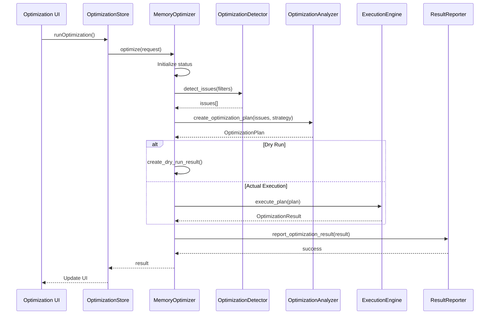
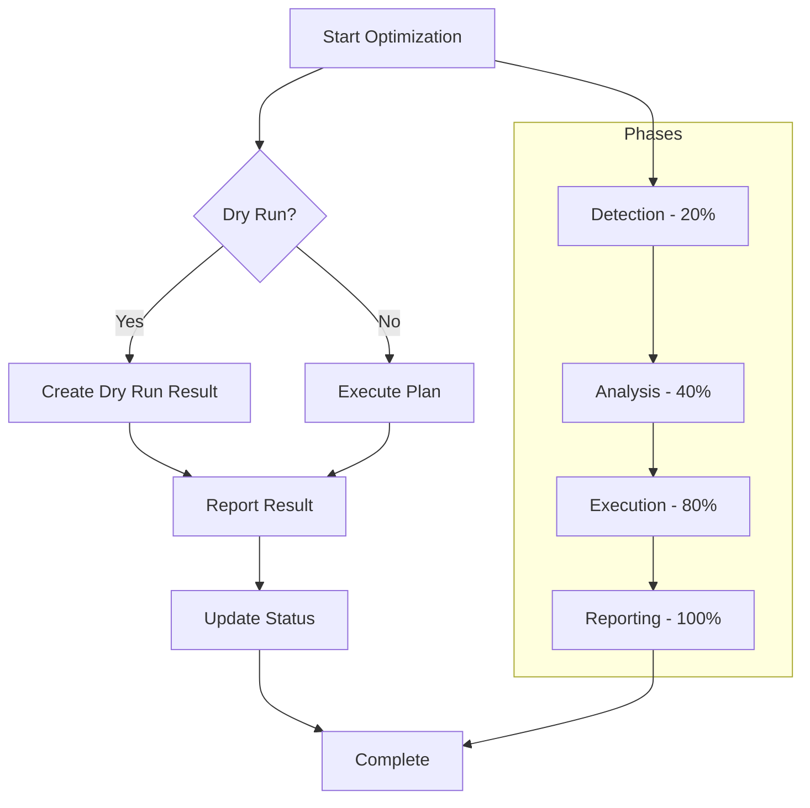

# Memory Optimization Domain Technical Documentation

**Generation Time**: 2024-12-15 09:36:16 UTC  
**System Version**: cortex-mem v1.0.0

## 1. Overview

The **Memory Optimization Domain** is a core component of the Cortex-Mem system responsible for maintaining memory quality, efficiency, and relevance through systematic analysis and improvement processes. This domain enables AI agents to maintain high-quality contextual memory by identifying and resolving issues such as duplicates, low-quality entries, outdated information, and inefficient storage patterns.

The optimization engine follows a comprehensive four-phase process (Detection → Analysis → Execution → Reporting) with progressive status updates from 0% to 100%. It supports both actual execution and dry-run preview modes, ensuring safe operation while providing detailed insights into potential improvements.

## 2. Architecture Components

### 2.1 Core Components

#### 2.1.1 DefaultMemoryOptimizer
The central coordinator implementing the `MemoryOptimizer` trait, responsible for managing the complete optimization workflow:

```rust
pub struct DefaultMemoryOptimizer {
    memory_manager: Arc<MemoryManager>,
    config: OptimizationConfig,
    detector: Arc<OptimizationDetector>,
    analyzer: Arc<OptimizationAnalyzer>,
    executor: Arc<ExecutionEngine>,
    reporter: Arc<ResultReporter>,
    running_optimizations: tokio::sync::RwLock<HashMap<String, OptimizationStatus>>,
}
```

This component orchestrates interactions between specialized sub-components using async/await patterns and maintains concurrent optimization task tracking via `RwLock<HashMap<String, OptimizationStatus>>`.

#### 2.1.2 OptimizationDetector
Responsible for identifying memory issues based on configurable thresholds:
- **Duplicate detection**: Uses vector similarity threshold (default: 0.85)
- **Quality assessment**: Identifies low-quality memories (threshold: 0.4)
- **Time decay analysis**: Flags potentially outdated entries (>180 days)
- **Classification issues**: Detects poorly categorized memories

#### 2.1.3 OptimizationAnalyzer
Analyzes detected issues and formulates optimization strategies:
- Evaluates issue severity (Low/Medium/High)
- Generates actionable recommendations
- Creates comprehensive optimization plans
- Supports conservative mode for risk-averse operations

#### 2.1.4 ExecutionEngine
Executes optimization actions with robust error handling:
- Batch processing support (configurable batch size)
- Concurrent task execution (max_concurrent_tasks: 4)
- Retry mechanism (up to 3 attempts)
- Transactional integrity for memory operations

#### 2.1.5 ResultReporter
Generates detailed reports and metrics:
- Comprehensive logging with tracing integration
- Performance metrics collection
- Structured result formatting
- Optional file-based logging

## 3. Key Data Structures

### 3.1 OptimizationRequest
Defines parameters for optimization operations:

| Field | Type | Description |
|-------|------|-------------|
| `optimization_id` | Option<String> | Unique identifier for tracking |
| `strategy` | OptimizationStrategy | Selected optimization approach |
| `filters` | OptimizationFilters | Scope constraints |
| `aggressive` | bool | Risk tolerance level |
| `dry_run` | bool | Preview mode flag |
| `timeout_minutes` | Option<u64> | Execution time limit |

### 3.2 OptimizationStrategy
Enumeration of available optimization approaches:

```rust
enum OptimizationStrategy {
    Full,           // Comprehensive optimization
    Incremental,    // Recent changes only
    Deduplication,  // Focus on duplicate removal
    Relevance,      // Improve relevance scoring
    Quality,        // Enhance content quality
    Space,          // Optimize storage efficiency
}
```

### 3.3 OptimizationPlan
Structured representation of proposed optimizations:

| Field | Description |
|-------|-------------|
| `optimization_id` | Unique plan identifier |
| `strategy` | Applied optimization strategy |
| `created_at` | Timestamp of plan creation |
| `estimated_duration_minutes` | Predicted execution time |
| `issues` | Detected problems list |
| `actions` | Recommended operations |
| `filters` | Applied scope filters |

### 3.4 OptimizationAction
Available action types in optimization plans:

- `Merge`: Combine related memories
- `Delete`: Remove redundant entries
- `Update`: Modify existing memory
- `Reclassify`: Change memory type
- `Archive`: Move to archive storage

## 4. Workflow Process

### 4.1 Sequence Diagram


### 4.2 Flowchart


## 5. Implementation Details

### 5.1 Trait-Based Architecture
The system implements a clean separation of concerns through Rust traits:

```rust
#[async_trait]
pub trait MemoryOptimizer: Send + Sync {
    async fn optimize(&self, request: &OptimizationRequest) -> Result<OptimizationResult>;
    async fn create_optimization_plan(&self, strategy: OptimizationStrategy) -> Result<OptimizationPlan>;
    async fn get_optimization_status(&self) -> Result<Vec<OptimizationStatus>>;
    async fn cancel_optimization(&self, optimization_id: &str) -> Result<()>;
}
```

### 5.2 Configuration Management
Components use builder patterns with default configurations:

```rust
// Example configuration structure
struct OptimizationDetectorConfig {
    duplicate_threshold: f32,     // Default: 0.85
    quality_threshold: f32,       // Default: 0.4
    time_decay_days: u32,         // Default: 180
    max_issues_per_type: usize,   // Default: 1000
}
```

### 5.3 Error Handling and Logging
Comprehensive error handling with structured logging:

- Custom `Result` types for domain-specific errors
- Tracing integration for detailed diagnostics
- Graceful degradation for partial failures
- Detailed error messages in results

### 5.4 Concurrency Model
Thread-safe design using Arc-wrapped components:

```rust
running_optimizations: tokio::sync::RwLock<HashMap<String, OptimizationStatus>>
```

Supports multiple concurrent optimization jobs with proper synchronization.

## 6. Integration Points

### 6.1 Internal Dependencies
- **MemoryManager**: Primary interface for memory CRUD operations
- **LLM Integration**: For semantic analysis and similarity assessment
- **Vector Store**: Access to embedding data for duplicate detection

### 6.2 External Interfaces
- **CLI Interface**: Direct command-line access
- **HTTP API Service**: RESTful programmatic access
- **Web Dashboard**: Visual monitoring and control
- **MCP Protocol**: Agent-to-agent optimization coordination

## 7. Usage Patterns

### 7.1 Basic Optimization
```bash
cortex-mem optimize --strategy full --user-id user123 --dry-run
```

### 7.2 Programmatic Access
```typescript
const store = createOptimizationStore();
await store.runOptimization({
  strategy: 'deduplication',
  filters: { user_id: 'user123' },
  dry_run: true
});
```

### 7.3 Monitoring Progress
```rust
let status = optimizer.get_optimization_status().await?;
for s in status {
    println!("Job {}: {}%", s.id, s.progress);
}
```

## 8. Best Practices

### 8.1 Safety Considerations
- Always use `dry_run` mode first to preview changes
- Implement appropriate backup procedures before major optimizations
- Monitor system performance during intensive operations
- Use incremental strategies for production environments

### 8.2 Performance Optimization
- Schedule heavy optimizations during off-peak hours
- Use targeted filters to reduce scope
- Adjust batch sizes based on system resources
- Monitor memory usage during execution

### 8.3 Configuration Guidelines
- Tune duplicate threshold based on use case (0.7-0.9 typical range)
- Adjust quality thresholds according to content standards
- Set appropriate timeout values for long-running operations
- Enable detailed logging for troubleshooting

## 9. Metrics and Monitoring

The system provides comprehensive metrics including:
- Issues found by type and severity
- Actions performed count
- Execution duration
- Success/failure rates
- Resource utilization statistics

These metrics are accessible through both API endpoints and the web dashboard, enabling continuous monitoring of memory health and optimization effectiveness.