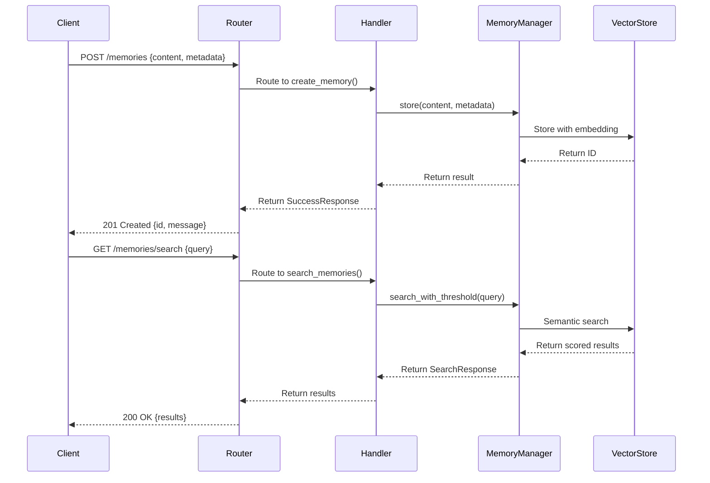
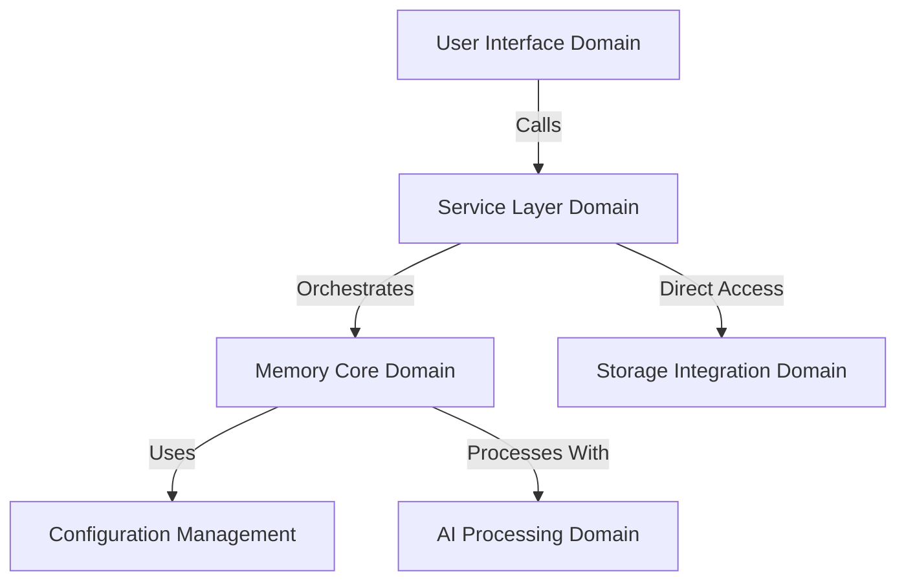

# Service Layer Domain Technical Documentation

**Generation Time:** 2025-12-15 20:13:27 UTC  
**Document Version:** 1.0  
**System:** cortex-mem (Intelligent Memory Management System)

---

## 1. Overview

The **Service Layer Domain** in the `cortex-mem` system serves as the primary interface between external clients and the internal core memory engine. It exposes standardized APIs that enable programmatic access to memory management capabilities, supporting integration with AI agents, web dashboards, CLI tools, and third-party systems.

This domain implements a service-oriented architecture pattern, providing abstraction, security, monitoring, and protocol translation while orchestrating operations through the underlying `Memory Core Domain`. The service layer ensures consistent behavior across different interaction channels and enables scalable, secure, and observable access to memory functionality.

### Key Characteristics
- **Modular Design**: Composed of three distinct sub-modules serving different client types
- **Protocol Diversity**: Supports HTTP/REST, MCP (Memory Control Protocol), and internal aggregation APIs
- **Stateless Operation**: Services are stateless and horizontally scalable
- **Thread-Safe Architecture**: Uses `Arc<MemoryManager>` for concurrent access
- **Error Resilience**: Comprehensive error handling and fallback mechanisms

---

## 2. Sub-Modules

The Service Layer Domain consists of three main sub-modules, each tailored for specific use cases and client requirements.

### 2.1 HTTP API Service

#### Description
The `HTTP API Service` provides a RESTful interface implemented in Rust using the **Axum** framework. It allows external applications to perform CRUD operations on agent memories via standard HTTP methods and JSON payloads.

#### Implementation Details
- **Framework**: [Axum](https://github.com/tokio-rs/axum) (Rust)
- **Language**: Rust
- **Concurrency Model**: Async/Await with Tokio runtime
- **Shared State**: `AppState` struct containing `Arc<MemoryManager>` for thread-safe sharing across handlers

```rust
#[derive(Clone)]
pub struct AppState {
    pub memory_manager: Arc<MemoryManager>,
}
```

#### Code Structure
| File | Purpose |
|------|--------|
| `src/main.rs` | Entry point, router configuration, service initialization |
| `src/handlers.rs` | Request handler functions for each endpoint |
| `src/models.rs` | Data transfer objects (DTOs) using Serde serialization |

#### Endpoints
| Method | Path | Handler | Functionality |
|-------|------|---------|---------------|
| `GET` | `/health` | `health_check()` | System health check |
| `POST` | `/memories` | `create_memory()` | Create new memory entry |
| `GET` | `/memories` | `list_memories()` | List stored memories |
| `POST` | `/memories/search` | `search_memories()` | Semantic search across memories |
| `GET` | `/memories/{id}` | `get_memory()` | Retrieve memory by ID |
| `PUT` | `/memories/{id}` | `update_memory()` | Update existing memory |
| `DELETE` | `/memories/{id}` | `delete_memory()` | Delete memory |
| `POST` | `/memories/batch/delete` | `batch_delete_memories()` | Bulk delete operation |
| `POST` | `/memories/batch/update` | `batch_update_memories()` | Bulk update operation |

#### Data Flow Sequence


#### Key Features
- **CORS Support**: Permissive CORS policy enabled via `CorsLayer::permissive()`
- **Authentication Ready**: Designed for future auth integration
- **Structured Error Handling**: Standardized error responses with codes
- **Request Validation**: Input validation through typed models
- **Logging & Tracing**: Integrated with `tracing_subscriber` for observability

#### Example Request
```json
POST /memories
{
  "content": "User asked about quantum computing basics",
  "user_id": "usr_123",
  "agent_id": "agt_456",
  "memory_type": "conversational"
}
```

#### Example Response
```json
{
  "message": "Memory created successfully",
  "id": "mem_789"
}
```

---

### 2.2 MCP Server

#### Description
The `MCP Server` implements the **Memory Control Protocol (MCP)** standard, enabling AI agents to control their memory lifecycle programmatically. This module follows the RMCP (Rust Memory Control Protocol) specification and communicates via STDIO transport.

#### Implementation Details
- **Framework**: [rmcp](https://crates.io/crates/rmcp) (Rust)
- **Transport**: STDIO-based communication
- **Architecture**: Implements `RoleServer` trait from RMCP library
- **Configuration**: Loads settings from `config.toml`, supports multiple config locations

#### Code Structure
| File | Purpose |
|------|--------|
| `src/main.rs` | Server entry point, CLI argument parsing |
| `src/lib.rs` | Core service logic, tool implementations |

#### Tool Functions
| Tool Name | Purpose |
|---------|--------|
| `store_memory` | Persist new memory entries |
| `query_memory` | Perform semantic queries |
| `list_memories` | Enumerate stored memories |
| `get_memory` | Retrieve specific memory by ID |

#### Initialization Flow
```rust
MemoryMcpService::with_config_path_and_agent(path, agent_id).await?;
```

Supports configuration discovery in order:
1. Current directory (`./config.toml`)
2. User home directory (`~/.config/memo/config.toml`)
3. System directories (`/etc/memo/config.toml` or platform equivalents)

#### Agent Context Management
The server maintains optional agent context:
```rust
pub struct MemoryMcpService {
    memory_manager: Arc<MemoryManager>,
    operations: MemoryOperations,
    agent_id: Option<String>,
}
```

All memory operations can be scoped to a specific agent when provided.

#### Integration Pattern
Designed for direct integration into AI agent runtimes where the MCP server runs as a subprocess and communicates via stdin/stdout.

---

### 2.3 System API

#### Description
The `System API` is an internal service layer built with **Elysia.js** (TypeScript) that aggregates data from multiple backend services for consumption by the web dashboard. It acts as a Backend-for-Frontend (BFF) pattern implementation.

#### Implementation Details
- **Framework**: [Elysia.js](https://elysiajs.com/) (TypeScript)
- **Purpose**: Data aggregation and transformation layer
- **Clients**: Web Dashboard (Svelte frontend)
- **Data Sources**: 
  - `cortex-mem-service` (HTTP API)
  - Qdrant vector database
  - LLM services
  - Internal metrics stores

#### Modules
| Module | File | Function |
|-------|------|----------|
| System Status | `system.ts` | Health checks, status reporting |
| Memory Operations | `memory.ts` | Aggregated memory data access |
| Optimization Interface | `optimization.ts` | Optimization job management |
| Type Definitions | `types.ts` | Shared interfaces |

#### Key Responsibilities
1. **Aggregation**: Combines metrics from multiple services
2. **Transformation**: Formats data for frontend consumption
3. **Caching**: Implements response caching for performance
4. **Fallback Handling**: Gracefully degrades when dependencies fail
5. **Real-time Updates**: Provides near real-time monitoring data

#### Example Endpoint: `/api/system/status`
```ts
.get('/status', () => {
  return {
    success: true,
    data: mockSystemStatus,
    timestamp: new Date().toISOString(),
  };
})
```

Returns composite health status including:
- API service availability
- Vector store connectivity
- LLM service responsiveness
- Overall system status

#### Frontend Integration
Consumed by Svelte components via `client.ts`:

```ts
// src/lib/api/client.ts
export const memoryApi = {
  list: (params?) => request(`/api/memories${queryParams}`),
  search: (query, params) => request('/api/memories/search', { method: 'POST', body }),
  get: (id) => request(`/api/memories/${id}`),
  // ... other methods
};
```

Supports full CRUD operations and batch processing.

---

## 3. Cross-Cutting Concerns

### 3.1 Configuration Management
All service layer components depend on the `Configuration Management Domain`:

```rust
#[derive(Parser)]
struct Cli {
    #[arg(short, long, default_value = "config.toml")]
    config: PathBuf,
}
```

Configuration includes:
- Server host/port bindings
- Qdrant connection parameters
- LLM provider settings
- Memory storage policies
- Security configurations

### 3.2 Error Handling Strategy
Consistent error patterns across all services:

| Layer | Error Format |
|------|-------------|
| HTTP API | `{ error: string, code: string }` |
| MCP Server | `ErrorData` with RMCP error codes |
| System API | `{ success: boolean, error?: string }` |

All errors are logged using structured logging (`tracing` in Rust, `console.error` in TS).

### 3.3 Security Considerations
- **Input Validation**: All inputs validated before processing
- **Rate Limiting Ready**: Architecture supports middleware insertion
- **Authentication Framework**: Designed for JWT/OAuth integration
- **CORS Policy**: Configurable origin policies
- **Sensitive Data**: Environment variable support for secrets

### 3.4 Observability
Integrated with comprehensive monitoring:
- Structured logging via `tracing_subscriber`
- Health check endpoints (`/health`)
- Performance metrics collection
- Request tracing capabilities
- Log aggregation ready

---

## 4. Interaction Patterns

### 4.1 Dependency Relationships


### 4.2 Typical Workflows

#### Memory Creation Flow
1. Client sends POST request to `/memories`
2. HTTP API parses and validates input
3. Calls `MemoryManager::store()` with content and metadata
4. Core generates embedding via LLM client
5. Stores vector + metadata in Qdrant
6. Returns success response with memory ID

#### Semantic Search Flow
1. Client posts query to `/memories/search`
2. API extracts filters and similarity threshold
3. MemoryManager performs semantic search
4. Vector store returns scored matches
5. Results returned as ranked list with scores

#### Agent Memory Control (MCP)
1. AI agent makes MCP tool call
2. MCP server translates to internal operation
3. Executes against shared MemoryManager
4. Returns structured response back to agent
5. Agent uses result for reasoning/context

---

## 5. Best Practices for Extension

### 5.1 Adding New Endpoints (HTTP API)
1. Define request/response models in `models.rs`
2. Implement handler function in `handlers.rs`
3. Register route in `main.rs` router
4. Add appropriate error handling and logging
5. Include test coverage

### 5.2 Extending MCP Capabilities
1. Add new tool method in `MemoryMcpService`
2. Implement business logic using `MemoryOperations`
3. Register tool definition in capabilities
4. Test with MCP client simulator
5. Document in protocol specification

### 5.3 Performance Optimization
- **Caching**: Add Redis cache for frequent queries
- **Pagination**: Implement cursor-based pagination
- **Compression**: Enable gzip compression for large responses
- **Connection Pooling**: Optimize database connections
- **Batch Processing**: Enhance bulk operation efficiency

### 5.4 Security Enhancement Roadmap
1. Implement authentication middleware
2. Add rate limiting per client/IP
3. Introduce role-based access control (RBAC)
4. Add audit logging for sensitive operations
5. Implement request signing for MCP

---

## 6. Summary

The **Service Layer Domain** in `cortex-mem` provides a robust, extensible foundation for accessing intelligent memory management capabilities. By implementing three complementary service types—HTTP API, MCP Server, and System API—it supports diverse integration scenarios while maintaining architectural consistency.

Key strengths include:
- **Clean Separation of Concerns**: Clear boundaries between interface, orchestration, and business logic
- **Technology Appropriateness**: Rust for high-performance services, TypeScript for flexible aggregation
- **Standard Protocols**: REST and MCP ensure interoperability
- **Observability First**: Built-in logging, health checks, and monitoring
- **Extensibility**: Modular design enables easy enhancement

This domain plays a critical role in enabling AI agents to maintain persistent, context-aware memory while providing operators with comprehensive monitoring and control capabilities.

--- 

*Documentation generated based on code analysis and architectural research as of 2025-12-15 20:13:27 UTC.*