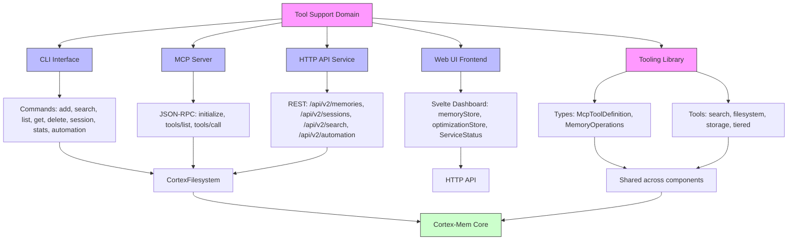
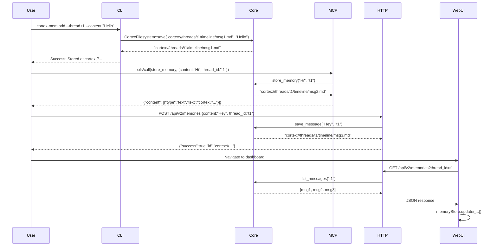
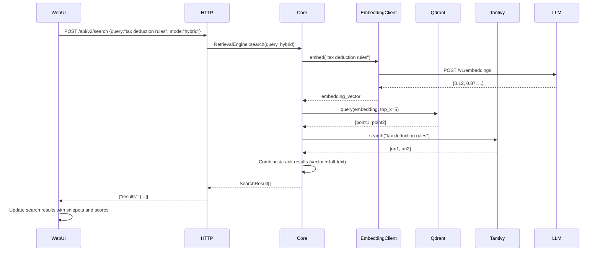

# Tool Support Domain Documentation

## Overview

The **Tool Support Domain** in Cortex-Mem serves as the primary interface layer between the core memory system and its users—whether human operators, autonomous AI agents, or external applications. It does not implement business logic or memory persistence itself but acts as a protocol adapter, transport enabler, and user-facing gateway to the capabilities of the **Core Memory Domain** (`cortex-mem-core`). 

This domain is intentionally decoupled from the underlying storage, indexing, and extraction mechanisms to ensure modularity, testability, and scalability. It supports multiple interaction paradigms—including command-line, JSON-RPC, RESTful HTTP, and web-based UI—each tailored to specific user roles: developers, AI agents, and end users.

The Tool Support Domain is implemented as a multi-crate Rust ecosystem with shared type definitions and consistent interfaces, ensuring interoperability across all endpoints. It leverages feature-gated compilation (e.g., `vector-search`) to enable optional capabilities without bloating minimal deployments.

---

## Architecture and Component Structure

The Tool Support Domain comprises five core submodules, each responsible for a distinct mode of interaction. All components depend on `cortex-mem-core` for memory operations and `cortex-mem-tools` for shared type definitions, forming a unified, consistent interface layer.



### 1. CLI Interface (`cortex-mem-cli`)

#### Purpose
The Command-Line Interface (CLI) provides direct, manual control over memory operations for developers and system administrators. It is the primary tool for debugging, testing, and scripting memory workflows in non-interactive environments.

#### Implementation Details
- **Framework**: Built with [`clap`](https://docs.rs/clap/latest/clap/) for robust argument parsing and subcommand structure.
- **Core Operations**:
  - `add`: Persists a new memory message via `CortexFilesystem::save`
  - `search`: Executes hybrid or vector-based retrieval via `RetrievalEngine::search`
  - `list`: Enumerates memory directories using `CortexFilesystem::list`
  - `get`: Retrieves raw content by URI
  - `delete`: Removes memory files and metadata
  - `session`: Manages conversation threads (create, close, extract)
  - `automation`: Triggers `AutoIndexer` and `AutoExtractor` workflows
  - `stats`: Aggregates system metrics from SQLite and filesystem
- **Configuration**: Loads `Config` from `cortex-mem-config` via TOML or environment variables (`CORTXMEM_DATA_DIR`, `CORTXMEM_LOG_LEVEL`)
- **Logging**: Uses `tracing_subscriber` with structured logging for audit trails
- **Error Handling**: Wraps core errors in `AppError` with user-friendly messages and exit codes

#### Example Usage
```bash
# Add a memory message
cortex-mem add --thread threads/agent-123 --role user --content "I need help with my tax return"

# Search for relevant memories using vector embedding
cortex-mem search --query "tax deduction rules" --mode vector --top-k 5

# Extract structured facts from a session
cortex-mem session extract --thread threads/agent-123

# View system statistics
cortex-mem stats
```

#### Key Advantages
- **Offline-first**: No network dependency; ideal for local development and CI/CD pipelines
- **Scriptable**: Output is JSON-formatted for pipeline integration
- **Verbose Mode**: Enables debug tracing (`-v`) to inspect internal retrieval steps

---

### 2. MCP Server (`cortex-mem-mcp`)

#### Purpose
The Model Context Protocol (MCP) Server enables seamless integration of Cortex-Mem with external AI agents (e.g., LLM-based agents using LangChain, AutoGen, or custom frameworks). It abstracts direct filesystem access, providing a standardized, secure, and agent-friendly interface for memory storage and retrieval.

#### Implementation Details
- **Protocol**: Implements [Model Context Protocol (MCP)](https://github.com/anthropics/mcp) via `rmcp` library for stdio-based JSON-RPC communication.
- **Methods Exposed**:
  - `store_memory`: Persists a message with optional metadata
  - `query_memory`: Searches memories using natural language queries
  - `list_memories`: Lists memory URIs by dimension or thread
  - `get_memory`: Retrieves raw content by URI
- **Input Validation**: Uses `cortex-mem-tools`-defined schemas (`StoreMemoryArgs`, `QueryMemoryArgs`) for type-safe deserialization
- **Agent Context**: Automatically infers `user_id` and `agent_id` from environment or request headers
- **Response Format**: Returns MCP-compliant JSON with `content` array of type `text`, `json`, or `file`
- **Security**: No authentication layer (assumes trusted agent environment); can be extended with TLS or token-based auth

#### Example Agent Interaction
```json
// Agent sends:
{
  "method": "tools/call",
  "params": {
    "tool": "store_memory",
    "args": {
      "content": "The user asked about tax deductions for home office.",
      "thread_id": "threads/agent-123",
      "role": "user"
    }
  }
}

// Server responds:
{
  "result": {
    "content": [
      {
        "type": "text",
        "text": "cortex://threads/agent-123/timeline/msg-abc123.md"
      }
    ]
  }
}
```

#### Key Advantages
- **Agent-Native**: Designed for LLM agents; no need for HTTP clients or SDKs
- **Low Latency**: Stdio-based communication avoids network overhead
- **Schema-Driven**: Tool definitions are auto-generated and versioned via `cortex-mem-tools`
- **Interoperable**: Compatible with any MCP-compliant agent framework

---

### 3. HTTP API Service (`cortex-mem-service`)

#### Purpose
The HTTP API Service exposes Cortex-Mem as a RESTful microservice, enabling integration with web applications, cloud-native systems, and third-party tools. It is the primary interface for the Web UI Frontend and external services requiring programmatic access.

#### Implementation Details
- **Framework**: Built with [`Axum`](https://docs.rs/axum/latest/axum/) for high-performance, type-safe routing
- **Endpoints**:
  - `GET /health` — Health check (returns 200 if core services are responsive)
  - `POST /api/v2/memories` — Store a new memory (JSON body: `content`, `role`, `thread_id`)
  - `GET /api/v2/memories?thread_id=...` — List memories by thread
  - `DELETE /api/v2/memories/{uri}` — Delete memory by URI
  - `POST /api/v2/search` — Hybrid search (JSON body: `query`, `mode: filesystem|vector|hybrid`, `top_k`, `min_score`)
  - `POST /api/v2/sessions/{id}/extract` — Trigger memory extraction
  - `POST /api/v2/automation/index` — Trigger auto-indexing
  - `GET /api/system/status` — System metrics and health summary
- **State Management**: Uses `Arc<RwLock<AppState>>` to share thread-safe references to:
  - `CortexFilesystem`
  - `SqliteIndex`
  - `EmbeddingClient`
  - `QdrantVectorStore`
  - `RetrievalEngine`
- **Feature Gating**: Vector search and hybrid modes are enabled via `vector-search` feature flag
- **CORS**: Enabled for frontend integration (`Access-Control-Allow-Origin: *`)
- **Middleware**: Includes tracing, request logging, and rate limiting (configurable)
- **Response Format**: Standardized `ApiResponse<T>` with `success: bool`, `data: T`, `error: Option<String>`

#### Example Request
```http
POST /api/v2/search HTTP/1.1
Content-Type: application/json

{
  "query": "What did the user say about tax deductions?",
  "mode": "hybrid",
  "top_k": 3,
  "min_score": 0.7
}
```

#### Example Response
```json
{
  "success": true,
  "data": [
    {
      "uri": "cortex://threads/agent-123/timeline/msg-abc123.md",
      "score": 0.94,
      "snippet": "The user asked about tax deductions for home office... they mentioned working 30+ hours per week.",
      "metadata": {
        "created_at": "2024-06-15T10:23:45Z",
        "role": "user",
        "dimension": "threads"
      }
    }
  ],
  "error": null
}
```

#### Key Advantages
- **Standardized API**: RESTful, JSON-based, and well-documented
- **Scalable**: Stateless design allows horizontal scaling behind load balancers
- **Observability**: Full tracing via OpenTelemetry integration
- **Extensible**: Easy to add new endpoints (e.g., `/api/v2/optimization`)

---

### 4. Web UI Frontend (`cortex-mem-insights`)

#### Purpose
The Web UI Frontend provides a real-time, interactive dashboard for monitoring, analyzing, and managing memory systems. It targets developers and operators who need visibility into memory volume, quality trends, and system health.

#### Implementation Details
- **Framework**: SvelteKit with Vite (frontend) and Elysia (backend API client)
- **Architecture**: Single-page application (SPA) with reactive stores
- **Key Components**:
  - `memoryStore`: Reactive store for memory listings (loaded via `/api/v2/memories`)
  - `optimizationStore`: Tracks deduplication, pruning, and merging operations
  - `systemStore`: Monitors service health (Qdrant, LLM, filesystem)
  - `navigationStore`: Manages UI state (active tab, search filters)
- **Visualization**:
  - **Chart.js**: Renders memory volume over time, extraction success rates, storage usage
  - **Status Cards**: Real-time indicators for LLM latency, Qdrant connectivity, disk space
  - **Search Interface**: Hybrid query builder with mode toggle and score threshold slider
- **Internationalization**: Supports `en.json`, `ja.json`, `zh.json` via `svelte-i18n`
- **Styling**: Tailwind CSS with responsive, mobile-first components
- **Communication**: Typed client (`client.ts`) generated from OpenAPI spec of `cortex-mem-service`

#### Example Reactive Store (Svelte)
```ts
// stores/memory.ts
import { writable } from 'svelte/store';

export const memoryStore = writable<{
  items: MemoryItem[];
  loading: boolean;
  error: string | null;
}>({
  items: [],
  loading: false,
  error: null
});

// Fetches data from API and updates store reactively
export async function loadMemories(threadId: string) {
  memoryStore.update(s => ({ ...s, loading: true }));
  try {
    const res = await fetch(`/api/v2/memories?thread_id=${threadId}`);
    const data = await res.json();
    memoryStore.update(s => ({ ...s, items: data.data, loading: false }));
  } catch (err) {
    memoryStore.update(s => ({ ...s, error: err instanceof Error ? err.message : 'Unknown error', loading: false }));
  }
}
```

#### Key Advantages
- **Real-Time Updates**: Polling every 5s for metrics; WebSocket support planned
- **User-Centric Design**: Intuitive filters, visual scoring, and drill-down navigation
- **Operational Insight**: Enables proactive optimization and anomaly detection
- **Extensible UI**: Modular components allow custom dashboards for enterprise deployments

---

### 5. Tooling Library (`cortex-mem-tools`)

#### Purpose
The Tooling Library is a shared Rust crate that defines the **contract** between all Tool Support Domain components. It ensures consistency in data models, tool schemas, and operation semantics across CLI, MCP, HTTP, and frontend.

#### Implementation Details
- **Core Types**:
  - `McpToolDefinition`: Structured schema for MCP tools (name, description, parameters)
  - `MemoryOperations`: Trait defining common memory operations (`store`, `query`, `list`, `delete`)
  - `MemoryItem`: Unified model for memory fragments (URI, content, metadata, timestamp)
  - `SearchRequest`, `SearchResponse`: Typed request/response envelopes for API and MCP
- **Tool Definitions**:
  - `search`: Defines parameters for hybrid search (query, mode, top_k)
  - `filesystem`: Defines file operations (list, read, save, delete)
  - `storage`: Abstracts persistence layer
  - `tiered`: Manages L0/L1/L2 memory hierarchy access
- **Code Generation**:
  - Auto-generates OpenAPI spec from Axum routes
  - Generates TypeScript client from OpenAPI
  - Generates MCP JSON schema for agent consumption
- **Usage**:
  - Imported by `cortex-mem-mcp` for tool schema validation
  - Imported by `cortex-mem-service` for request validation
  - Imported by `cortex-mem-insights` for typed API clients

#### Example Tool Definition
```rust
// cortex-mem-tools/src/tools/search.rs

pub struct SearchTool;

impl McpToolDefinition for SearchTool {
    fn name(&self) -> &'static str { "search" }
    fn description(&self) -> &'static str { "Search memories using natural language or keywords" }
    fn parameters(&self) -> serde_json::Value {
        serde_json::json!({
            "type": "object",
            "properties": {
                "query": { "type": "string", "description": "Natural language query" },
                "mode": { "type": "string", "enum": ["filesystem", "vector", "hybrid"] },
                "top_k": { "type": "integer", "minimum": 1, "maximum": 100 },
                "min_score": { "type": "number", "minimum": 0.0, "maximum": 1.0 }
            },
            "required": ["query"]
        })
    }
}
```

#### Key Advantages
- **Single Source of Truth**: Eliminates drift between interfaces
- **Automated Documentation**: Tool schemas auto-documented in API specs and agent UIs
- **Type Safety**: Prevents runtime errors due to malformed requests
- **Cross-Platform Consistency**: CLI, MCP, and HTTP all use identical data models

---

## Interaction Patterns and Data Flow

### End-to-End Memory Storage Flow


### Memory Retrieval Flow (Hybrid Search)


---

## Configuration and Environment Management

All Tool Support Domain components load configuration from `cortex-mem-config`, ensuring consistency across interfaces.

### Configuration Sources (in order of precedence):
1. **Environment Variables** (highest priority)
   - `CORTXMEM_DATA_DIR`
   - `CORTXMEM_QDRANT_URL`
   - `CORTXMEM_LLM_API_KEY`
   - `CORTXMEM_LOG_LEVEL`
2. **TOML File**: `config.toml` in working directory or `~/.cortex-mem/`
3. **Default Values**: Hardcoded fallbacks (e.g., `localhost:6334` for Qdrant)

### Example `config.toml`
```toml
[filesystem]
data_dir = "/var/lib/cortex-mem"

[llm]
provider = "openai"
api_key = "sk-..."
model = "text-embedding-3-small"
temperature = 0.3

[qdrant]
url = "http://localhost:6334"
collection = "cortex_mem_vectors"
dimension = 1536

[logging]
level = "info"
format = "json"
```

> **Note**: The `vector-search` feature flag must be enabled in `Cargo.toml` to activate Qdrant and embedding dependencies.

---

## Error Handling and Observability

### Error Types
- **Application Errors**: `AppError` enum wrapping core errors (`FilesystemError`, `IndexError`, `LLMError`, `MCPError`)
- **HTTP Errors**: Standardized 4xx/5xx responses with structured bodies
- **MCP Errors**: Return `{"error": {"type": "invalid_args", "message": "..."}}`

### Logging and Tracing
- **Tracing**: Uses `tracing` crate with `tracing-subscriber` for structured logs
- **Span Context**: All operations are traced with `span!` for request correlation
- **Log Output**: JSON format in production; human-readable in development
- **Metrics**: Exposes Prometheus-compatible metrics via `/metrics` endpoint (planned)

### Health Checks
- `/health`: Returns 200 if:
  - Filesystem is writable
  - SQLite index is accessible
  - LLM client can reach provider
  - Qdrant is reachable (if vector-search enabled)

---

## Security Considerations

| Component | Security Notes |
|---------|----------------|
| **CLI** | No authentication; assumes trusted local access |
| **MCP** | Stdio-based; assume trusted agent environment; no network exposure |
| **HTTP API** | CORS enabled; rate limiting recommended; TLS required in production |
| **Web UI** | No user auth; integrate with external auth (e.g., OAuth2) via reverse proxy |
| **Tooling Library** | Schema validation prevents injection attacks |

> **Recommendation**: Deploy HTTP API behind a reverse proxy (e.g., Nginx, Traefik) with TLS termination, rate limiting, and IP whitelisting.

---

## Deployment and Scaling

### Single-Node Deployment
```bash
# Start all services
cortex-mem-service --port 8080 &
cortex-mem-mcp &
cortex-mem-insights dev
```

### Production Scaling
- **HTTP API**: Deploy multiple instances behind load balancer (stateless)
- **Qdrant**: Scale independently as vector database
- **Filesystem**: Use shared storage (NFS, S3-compatible) for multi-node access
- **CLI/MCP**: Run per-agent or per-node; no scaling needed
- **Web UI**: Static assets served via CDN; API calls routed to HTTP service

### Containerization
```dockerfile
# cortex-mem-service Dockerfile
FROM rust:1.78 AS builder
WORKDIR /app
COPY . .
RUN cargo build --release --features vector-search

FROM alpine:latest
COPY --from=builder /app/target/release/cortex-mem-service /usr/bin/cortex-mem-service
EXPOSE 8080
CMD ["cortex-mem-service", "--config", "/etc/cortex-mem/config.toml"]
```

---

## Best Practices and Recommendations

### For Developers
- ✅ Use `cortex-mem-tools` for all new tool definitions
- ✅ Always validate input via `MemoryOperations` trait
- ✅ Prefer `hybrid` search mode for production queries
- ✅ Enable `vector-search` feature only if Qdrant is available

### For Operators
- ✅ Monitor `/api/system/status` for memory growth and LLM latency
- ✅ Schedule `cortex-mem optimize` weekly to reduce redundancy
- ✅ Back up `cortex-mem-data/` directory regularly
- ✅ Use environment variables for secrets (never hardcode in config files)

### For AI Agent Integrators
- ✅ Use MCP for low-latency, agent-native access
- ✅ Cache `tools/list` responses to avoid repeated schema queries
- ✅ Handle `429 Too Many Requests` and exponential backoff
- ✅ Validate URIs before attempting `get_memory`

---

## Future Enhancements

| Area | Proposed Enhancement |
|------|----------------------|
| **Real-Time Updates** | Add WebSocket support for live memory notifications |
| **Authentication** | Integrate JWT/OAuth2 for HTTP API and Web UI |
| **Export/Import** | Add `export`/`import` CLI commands for backup/restore |
| **Batch Operations** | Support bulk memory deletion and indexing |
| **Plugin System** | Allow dynamic loading of custom tools via `.so` or WASM |
| **API Versioning** | Implement `/api/v3/` with backward compatibility |

---

## Conclusion

The **Tool Support Domain** is the critical bridge between Cortex-Mem’s powerful core memory engine and its diverse user base. By providing standardized, type-safe, and protocol-agnostic interfaces—CLI, MCP, HTTP, and Web UI—it ensures that memory capabilities are accessible, reliable, and scalable across environments.

Its modular design, shared tooling library, and strict separation from business logic make it a model of clean architecture. Whether you’re an AI agent needing low-latency memory access, a developer scripting automation, or an operator monitoring system health, the Tool Support Domain delivers a consistent, professional, and production-ready experience.

With its foundation in Rust’s safety and performance, combined with modern web and RPC standards, Cortex-Mem’s Tool Support Domain is engineered not just to function—but to *scale*.