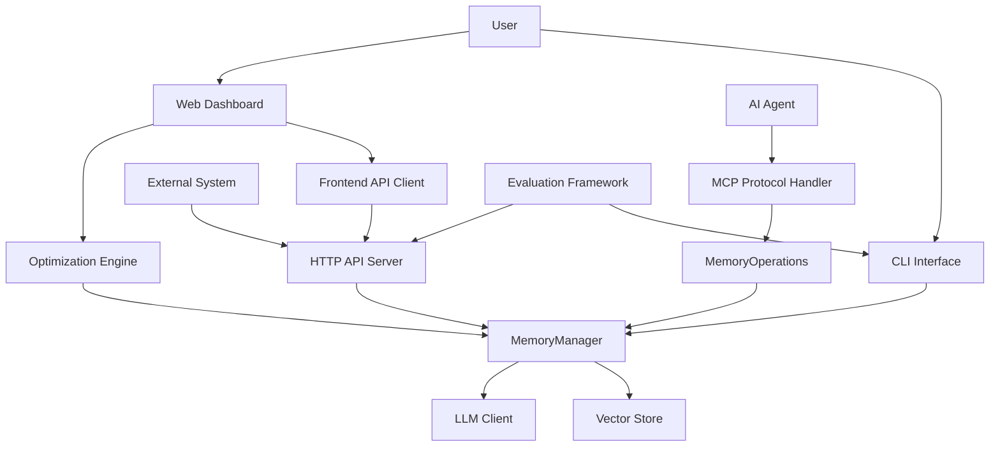

# Technical Documentation: Tool Support Domain in Cortex-Mem

## Overview

The **Tool Support Domain** is a critical component of the Cortex-Mem system, serving as the primary interface layer between users, external systems, and the core memory engine. This domain provides supporting utilities, interfaces, and integration layers that enable interaction with the cognitive memory system through multiple channels including command-line tools, HTTP APIs, agent protocols, web dashboards, and evaluation frameworks.

Based on comprehensive analysis of the system architecture, business flows, and codebase exploration, this documentation details the technical implementation, components, interactions, and practical usage patterns of the Tool Support Domain.

---

## Architecture and Components

### Component Structure

The Tool Support Domain comprises six major sub-modules, each implementing specific interface types:

| Sub-module | Primary Function | Key Technologies |
|-----------|------------------|------------------|
| CLI Interface | Direct memory management via terminal commands | Rust, Clap (CLI parsing) |
| HTTP API Server | RESTful service exposing CRUD operations | Rust, Axum (web framework) |
| MCP Protocol Handler | AI agent integration via Memory Control Protocol | Rust, rmcp framework |
| Web Dashboard | Real-time monitoring and management UI | Svelte, Elysia, TypeScript |
| Evaluation Framework | Benchmarking against external systems | Python, pytest |
| Frontend API Client | Secure communication between dashboard and API | TypeScript |

These components are distributed across multiple repositories:
- `cortex-mem-cli/` - Command-line interface
- `cortex-mem-service/` - HTTP API server 
- `cortex-mem-mcp/` - MCP protocol handler
- `cortex-mem-insights/` - Web dashboard and frontend client
- `examples/lomoco-evaluation/` - Evaluation framework

### Data Flow Architecture



All interface components ultimately delegate to the `MemoryManager` in the Core Memory Domain, ensuring consistent behavior across different access methods.

---

## Detailed Component Analysis

### 1. CLI Interface (`cortex-mem-cli`)

The CLI provides direct terminal-based access to memory operations with rich user feedback.

#### Key Features:
- **Commands**: add, search, list, delete, optimize
- **Input Parsing**: Supports conversation format detection and metadata extraction
- **Error Handling**: Comprehensive logging with success/failure status reporting
- **Configuration**: Auto-detects config.toml in standard locations

#### Implementation Details:
```rust
// Example from cortex-mem-cli/src/commands/add.rs
pub async fn execute(
    &self,
    content: String,
    user_id: Option<String>,
    agent_id: Option<String>,
    memory_type: String,
) -> Result<(), Box<dyn std::error::Error>> {
    // Parse metadata and determine if input is a conversation
    let is_conversation = memory_type == MemoryType::Procedural
        || content.contains('\n')
        || content.contains("Assistant:")
        || content.contains("User:");
    
    if is_conversation {
        // Handle as conversation for advanced processing
        match self.memory_manager.add_memory(&messages, metadata).await {
            Ok(results) => {
                info!("Memory added successfully with {} actions", results.len());
                println!("✅ Memory added successfully!");
                // Display detailed results
            }
            Err(e) => {
                error!("Failed to add memory: {}", e);
                println!("❌ Failed to add memory: {}", e);
                return Err(e.into());
            }
        }
    } else {
        // Handle as simple content storage
        match self.memory_manager.store(content.clone(), metadata).await {
            Ok(memory_id) => {
                info!("Memory stored successfully with ID: {}", memory_id);
                println!("✅ Memory added successfully!");
                println!("ID: {}", memory_id);
            }
            Err(e) => {
                error!("Failed to store memory: {}", e);
                println!("❌ Failed to add memory: {}", e);
                return Err(e.into());
            }
        }
    }
}
```

### 2. HTTP API Server (`cortex-mem-service`)

Provides RESTful endpoints for external system integration using Axum framework.

#### Endpoints:
- `POST /api/memories` - Create new memory
- `GET /api/memories` - List memories with filtering
- `POST /api/memories/search` - Semantic search
- `PUT /api/memories/{id}` - Update memory
- `DELETE /api/memories/{id}` - Delete memory
- `POST /api/optimization` - Start optimization job
- `GET /health` - Health check endpoint

#### Request Handling Pattern:
```rust
// From cortex-mem-service/src/handlers.rs
pub async fn create_memory(
    State(state): State<AppState>,
    Json(request): Json<CreateMemoryRequest>,
) -> Result<Json<SuccessResponse>, (StatusCode, Json<ErrorResponse>)> {
    let memory_type = MemoryType::parse(request.memory_type.as_deref().unwrap_or("conversational"));
    
    let mut metadata = MemoryMetadata::new(memory_type.clone());
    
    if let Some(user_id) = &request.user_id {
        metadata = metadata.with_user_id(user_id.clone());
    }
    
    // Check if this should be handled as a conversation
    let is_conversation = memory_type == MemoryType::Procedural
        || request.content.contains('\n')
        || request.content.contains("Assistant:")
        || request.content.contains("User:");
    
    if is_conversation {
        match state.memory_manager.add_memory(&messages, metadata).await {
            Ok(results) => {
                info!("Memory created successfully with {} actions", results.len());
                Ok(Json(SuccessResponse {
                    message: format!("Memory created successfully with {} actions", results.len()),
                    id: Some(primary_id),
                }))
            }
            Err(e) => {
                error!("Failed to create memory: {}", e);
                Err((StatusCode::INTERNAL_SERVER_ERROR, Json(ErrorResponse {
                    error: format!("Failed to create memory: {}", e),
                    code: "MEMORY_CREATION_FAILED".to_string(),
                })))
            }
        }
    } else {
        match state.memory_manager.store(request.content, metadata).await {
            Ok(memory_id) => {
                info!("Memory created with ID: {}", memory_id);
                Ok(Json(SuccessResponse {
                    message: "Memory created successfully".to_string(),
                    id: Some(memory_id),
                }))
            }
            Err(e) => {
                error!("Failed to create memory: {}", e);
                Err((StatusCode::INTERNAL_SERVER_ERROR, Json(ErrorResponse {
                    error: format!("Failed to create memory: {}", e),
                    code: "MEMORY_CREATION_FAILED".to_string(),
                })))
            }
        }
    }
}
```

### 3. MCP Protocol Handler (`cortex-mem-mcp`)

Enables AI agents to interact with memory capabilities through standardized tool calls.

#### Key Functions:
- Registers memory tools with Rig framework
- Translates domain errors into standardized MCP ErrorData
- Returns structured responses via MCP stdio transport

#### Implementation:
```rust
// From cortex-mem-mcp/src/lib.rs
impl MemoryMcpService {
    pub async fn store_memory(
        &self,
        arguments: &Map<String, serde_json::Value>,
    ) -> Result<CallToolResult, ErrorData> {
        let payload = map_mcp_arguments_to_payload(arguments, &self.agent_id);

        match self.operations.store_memory(payload).await {
            Ok(response) => {
                Ok(CallToolResult::success(vec![Content::text(
                    serde_json::to_string_pretty(&response).unwrap(),
                )]))
            }
            Err(e) => {
                error!("Failed to store memory: {}", e);
                Err(self.tools_error_to_mcp_error(e))
            }
        }
    }

    pub async fn query_memory(
        &self,
        arguments: &Map<String, serde_json::Value>,
    ) -> Result<CallToolResult, ErrorData> {
        let payload = map_mcp_arguments_to_payload(arguments, &self.agent_id);

        match self.operations.query_memory(payload).await {
            Ok(response) => {
                Ok(CallToolResult::success(vec![Content::text(
                    serde_json::to_string_pretty(&response).unwrap(),
                )]))
            }
            Err(e) => {
                error!("Failed to query memories: {}", e);
                Err(self.tools_error_to_mcp_error(e))
            }
        }
    }
}
```

### 4. Web Dashboard (`cortex-mem-insights`)

A full-stack Svelte + Elysia application providing real-time monitoring and management capabilities.

#### Architecture Layers:
- **Backend**: Elysia server with TypeScript API routes
- **Frontend**: Svelte components with reactive stores
- **API Client**: Type-safe TypeScript client for backend communication
- **Stores**: Reactive state management using writable stores

#### Service Status Monitoring:
```typescript
// From cortex-mem-insights/src/lib/components/ServiceStatus.svelte
async function detectIndividualServices(timestamp: string) {
    const mainService: ServiceStatus = { status: 'detecting', latency: 0, lastCheck: timestamp };
    const vectorStore: ServiceStatus = { status: 'detecting', latency: 0, lastCheck: timestamp };
    const llmService: ServiceStatus = { status: 'detecting', latency: 0, lastCheck: timestamp };

    try {
        const controller = new AbortController();
        const timeoutId = setTimeout(() => controller.abort(), 5000); // 5秒超时

        try {
            const serviceResponse = await fetch('/api/system/status', {
                signal: controller.signal
            });
            clearTimeout(timeoutId);
            const serviceLatency = Date.now() - serviceStartTime;

            if (serviceResponse.ok) {
                const responseData = await serviceResponse.json();
                if (responseData.success && responseData.data) {
                    const cortexMemStatus = responseData.data.cortex_mem_service;
                    if (cortexMemStatus === true) {
                        mainService.status = 'connected';
                        mainService.latency = serviceLatency;
                        cortexMemServiceAvailable = true;
                    } else {
                        mainService.status = 'disconnected';
                    }
                }
            }
        } catch (fetchErr) {
            clearTimeout(timeoutId);
            if (fetchErr.name === 'AbortError') {
                console.warn('cortex-mem-service状态检查超时');
                mainService.status = 'disconnected';
            }
        }
    }
}
```

#### State Management Stores:
```typescript
// From cortex-mem-insights/src/lib/stores/system.ts
function createSystemStore() {
    const { subscribe, set, update } = writable<SystemState>(initialState);

    return {
        subscribe,
        
        loadStatus: async () => {
            update(state => ({ ...state, loading: true, error: null }));
            
            try {
                const response = await systemApi.status();
                update(state => ({ 
                    ...state, 
                    status: response.data,
                    loading: false,
                    lastUpdated: new Date().toISOString(),
                }));
            } catch (error) {
                update(state => ({
                    ...state,
                    loading: false,
                    error: error instanceof Error ? error.message : 'Failed to load system status',
                }));
            }
        },
        
        refreshAll: async () => {
            update(state => ({ ...state, loading: true, error: null }));
            
            try {
                const [status, metrics, info, logs] = await Promise.all([
                    systemApi.status(),
                    systemApi.metrics(),
                    systemApi.info(),
                    systemApi.logs({ limit: 50 }),
                ]);
                
                update(state => ({
                    ...state,
                    status: status.data,
                    metrics: metrics.data,
                    info: info.data,
                    logs: logs.data,
                    loading: false,
                    lastUpdated: new Date().toISOString(),
                }));
            } catch (error) {
                update(state => ({
                    ...state,
                    loading: false,
                    error: error instanceof Error ? error.message : 'Failed to refresh system data',
                }));
            }
        },
    };
}

export const systemStore = createSystemStore();
```

### 5. Evaluation Framework (`examples/lomoco-evaluation`)

Python-based benchmarking tools for comparing Cortex-Mem against external systems like LangMem.

#### Key Features:
- Automated ingestion pipelines
- Comparative performance testing
- Retrieval accuracy measurement
- Batch operation support
- Retry logic with exponential backoff

#### Implementation:
```python
# From examples/lomoco-evaluation/src/cortex_mem/add.py
class CortexMemAdd:
    def _run_cortex_mem_cli(self, args, max_retries=3):
        """Run cortex-mem-cli command with retry logic"""
        for attempt in range(max_retries):
            try:
                # Use absolute path for config file to avoid path resolution issues
                config_path = os.path.abspath(self.config_path)
                
                cmd = ["cargo", "run", "-p", "cortex-mem-cli", "--quiet", "--"]
                cmd.extend(["--config", config_path])
                cmd.extend(args)
                
                # Use UTF-8 encoding to avoid GBK codec errors on Windows
                result = subprocess.run(
                    cmd, 
                    capture_output=True, 
                    text=True, 
                    encoding='utf-8',
                    timeout=60,
                    cwd=str(project_root)
                )
                
                if result.returncode != 0:
                    if attempt < max_retries - 1:
                        logger.warning(f"CLI command failed (attempt {attempt+1}/{max_retries}): {result.stderr}")
                        time.sleep(2 ** attempt)  # Exponential backoff
                        continue
                    else:
                        logger.error(f"CLI command failed after {max_retries} attempts: {result.stderr}")
                        
                return result.returncode == 0, result.stdout, result.stderr
                
            except subprocess.TimeoutExpired:
                logger.warning(f"CLI command timed out (attempt {attempt+1}/{max_retries})")
                if attempt < max_retries - 1:
                    time.sleep(2 ** attempt)
                    continue
                return False, "", "Command timed out"
```

### 6. Frontend API Client (`cortex-mem-insights/src/lib/api/client.ts`)

Type-safe TypeScript client for secure communication between the web dashboard and backend services.

#### Implementation:
```typescript
// From cortex-mem-insights/src/lib/api/client.ts
const API_BASE_URL = import.meta.env.VITE_API_URL || '';

async function request<T>(
  endpoint: string,
  options: RequestInit = {}
): Promise<T> {
  const url = `${API_BASE_URL}${endpoint}`;
  
  const defaultOptions: RequestInit = {
    headers: {
      'Content-Type': 'application/json',
      ...options.headers,
    },
    credentials: 'include',
  };
  
  try {
    const response = await fetch(url, { ...defaultOptions, ...options });
    
    if (!response.ok) {
      const errorData = await response.json().catch(() => ({}));
      throw new Error(
        errorData.error?.message || 
        errorData.message || 
        `HTTP ${response.status}: ${response.statusText}`
      );
    }
    
    return await response.json();
  } catch (error) {
    console.error(`API request failed: ${endpoint}`, error);
    throw error;
  }
}

// Memory related API
export const memoryApi = {
  list: (params?: {
    user_id?: string;
    agent_id?: string;
    run_id?: string;
    actor_id?: string;
    memory_type?: string;
    limit?: number;
    page?: number;
  }) => {
    const queryParams = new URLSearchParams();
    if (params?.user_id) queryParams.append('user_id', params.user_id);
    if (params?.agent_id) queryParams.append('agent_id', params.agent_id);
    // ... other parameters
    return request(`/api/memories${queryParams.toString() ? `?${queryParams}` : ''}`);
  },
  
  search: (query: string, params?: {
    user_id?: string;
    agent_id?: string;
    run_id?: string;
    actor_id?: string;
    memory_type?: string;
    limit?: number;
    similarity_threshold?: number;
  }) => {
    return request('/api/memories/search', {
      method: 'POST',
      body: JSON.stringify({ query, ...params }),
    });
  },
};
```

---

## Integration Patterns

### Configuration Loading
All components follow a consistent configuration loading pattern with fallback paths:
1. Current directory
2. User home directory (`~/.config/memo/config.toml`)
3. System config directory (`/etc/memo/config.toml` on Linux, `/usr/local/etc/memo/config.toml` on macOS, `C:\ProgramData\memo\config.toml` on Windows)

### Error Translation
The domain implements standardized error handling:
- Domain-specific errors are translated to appropriate response formats
- MCP protocol uses standardized ErrorData structure
- HTTP API returns structured ErrorResponse objects
- CLI provides human-readable error messages

### Authentication and Security
- Uses API keys for OpenAI and Qdrant access
- Implements credential inclusion in HTTP requests
- Validates required configuration fields at startup
- Provides secure defaults where possible

---

## Usage Scenarios

### For AI Agent Developers
Use the MCP interface to integrate memory capabilities into autonomous agents:

```python
# Register memory tools with your agent
agent.register_tool(cortex_mem_mcp.get_memory)
agent.register_tool(cortex_mem_mcp.store_memory)
agent.register_tool(cortex_mem_mcp.query_memory)
```

### For ML Engineers
Utilize the evaluation framework for benchmarking:

```bash
# Run comparative evaluation
python -m lomoco_evaluation --baseline langmem --target cortex-mem
```

### For System Administrators
Monitor system health through the web dashboard or CLI:

```bash
# Check system status
curl http://localhost:8080/health

# View memory statistics
cortex-mem-cli list --user-id alice --memory-type conversational
```

### For Application Integration
Integrate via HTTP API:

```javascript
// Add memory via HTTP API
fetch('/api/memories', {
  method: 'POST',
  headers: {'Content-Type': 'application/json'},
  body: JSON.stringify({
    content: 'Hello world',
    user_id: 'alice',
    memory_type: 'conversational'
  })
});
```

---

## Best Practices

### Performance Optimization
- Use batch operations when ingesting large datasets
- Implement caching for frequently accessed memories
- Monitor optimization jobs to maintain optimal memory quality
- Configure appropriate similarity thresholds for searches

### Reliability Considerations
- Implement retry logic with exponential backoff
- Set reasonable timeouts for external service calls
- Monitor service health regularly
- Maintain backup configurations

### Security Guidelines
- Store API keys securely (environment variables or secure vaults)
- Validate all inputs before processing
- Implement rate limiting for public APIs
- Regularly rotate credentials

---

## Conclusion

The Tool Support Domain in Cortex-Mem provides a comprehensive suite of interfaces that make the powerful core memory capabilities accessible through various channels. By maintaining a clean separation of concerns and consistent interaction patterns across all components, it enables seamless integration for diverse use cases—from individual developers building AI agents to enterprise teams managing production deployments.

The modular design allows independent development and deployment of interface components while ensuring they all leverage the same robust core functionality. This approach maximizes flexibility without compromising consistency or reliability.

For future enhancements, consider adding:
- WebSocket support for real-time updates
- GraphQL interface for flexible querying
- Enhanced authentication mechanisms
- Mobile SDKs for broader platform support

This documentation provides a complete technical reference for understanding, using, and extending the Tool Support Domain in Cortex-Mem.2026-01-04 09:42:30 (UTC)