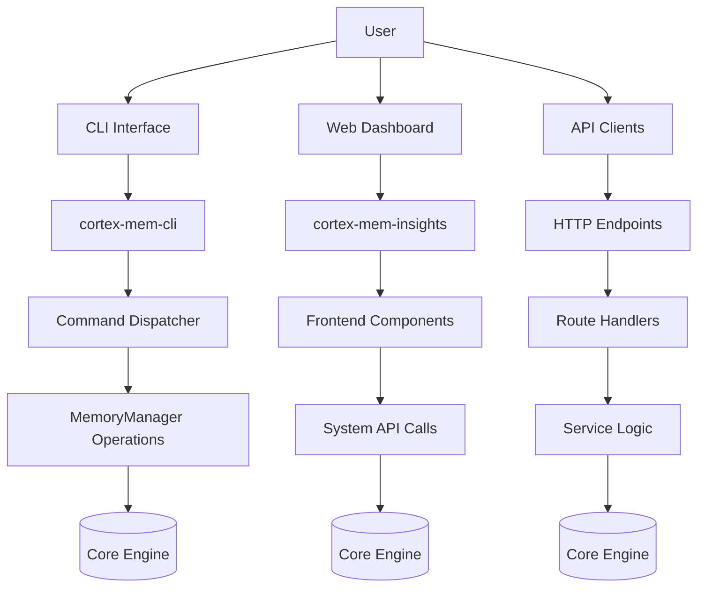
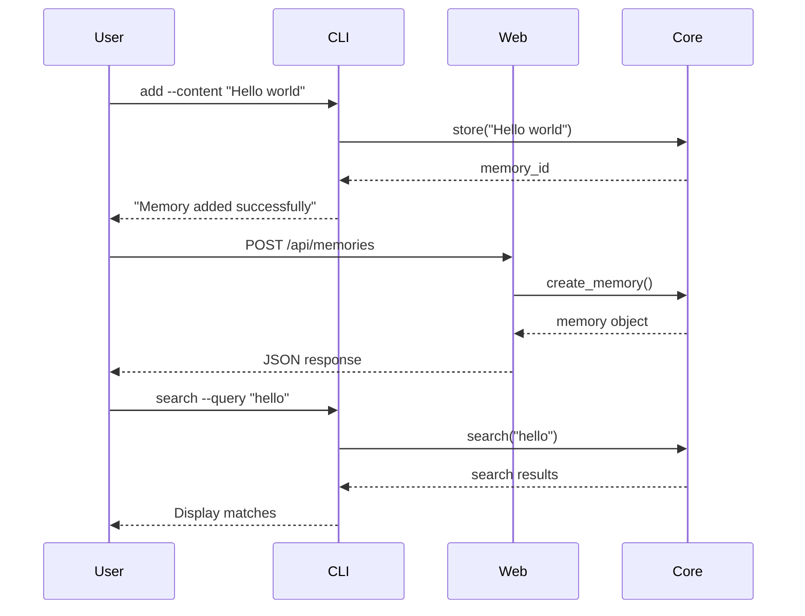
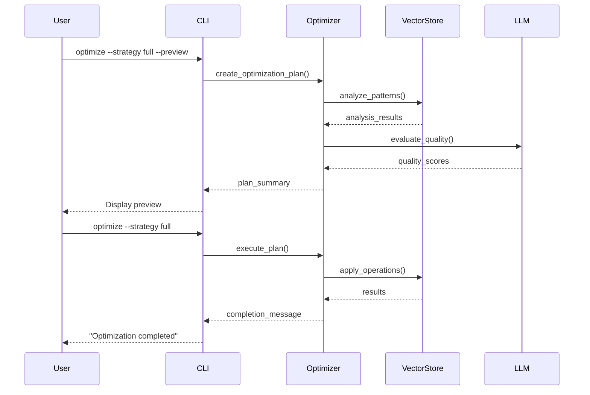
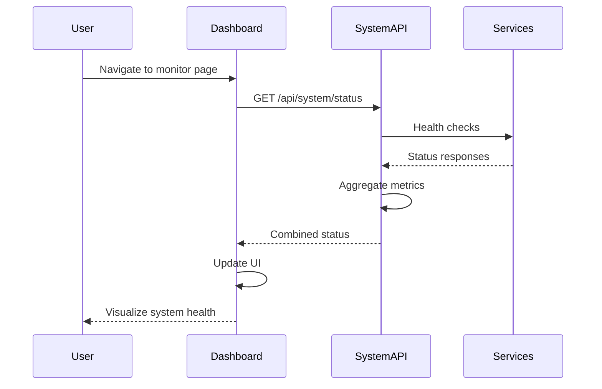

# User Interface Domain Technical Documentation

## 1. Overview

The **User Interface Domain** in the cortex-mem system provides multiple access points for users to interact with the intelligent memory management platform. It serves as the primary interaction layer between end-users (including developers, administrators, and researchers) and the core memory engine, enabling comprehensive control over memory operations, optimization, monitoring, and analysis.

This domain implements a multi-modal interface strategy with three main components:
- **Command Line Interface (CLI)**: For programmatic and script-based interactions
- **Web Dashboard**: For visual monitoring and interactive management
- **HTTP API Service**: For integration with external systems and applications

The interfaces are designed following separation of concerns principles, with clear boundaries between presentation logic, business orchestration, and data access layers.

---

## 2. Architecture and Components

### 2.1 Component Structure



### 2.2 Sub-modules

#### 2.2.1 Command Line Interface (CLI)
- **Primary Path**: `cortex-mem-cli/src/main.rs`
- **Purpose**: Provides text-based interface for advanced users, automation scripts, and administrative tasks
- **Key Features**:
  - Argument parsing using Clap framework
  - Asynchronous execution with Tokio runtime
  - Comprehensive command set for all memory operations
  - Rich output formatting with status indicators
  - Error handling with detailed diagnostics

#### 2.2.2 Web Dashboard
- **Primary Paths**: 
  - Frontend: `cortex-mem-insights/src/routes/`
  - Backend API: `cortex-mem-insights/src/server/api/`
- **Purpose**: Graphical interface for real-time monitoring, visualization, and batch operations
- **Key Features**:
  - Svelte-based frontend with responsive design
  - Real-time metrics visualization
  - Interactive optimization controls
  - Memory browsing and filtering capabilities
  - System health monitoring

#### 2.2.3 Optimization Interface
- **Shared Components**:
  - CLI: `cortex-mem-cli/src/commands/optimize.rs`
  - Web: `cortex-mem-insights/src/routes/optimization/+page.svelte`
- **Purpose**: Specialized interface for configuring and executing memory optimization workflows
- **Key Features**:
  - Strategy selection (full, deduplication, quality, relevance)
  - Preview/dry-run mode
  - Progress tracking and cancellation
  - Impact estimation
  - Historical results review

---

## 3. Implementation Details

### 3.1 Command Line Interface Implementation

The CLI follows a command pattern architecture implemented in Rust:

```rust
// Main entry point with argument parsing
#[derive(Parser)]
pub struct Cli {
    #[command(subcommand)]
    pub command: Commands,
    
    /// Configuration file path
    #[arg(short, long, default_value = "config.toml")]
    pub config: PathBuf,
}

#[derive(Subcommand)]
pub enum Commands {
    Add { content: String, user_id: Option<String>, ... },
    Search { query: Option<String>, user_id: Option<String>, ... },
    List { user_id: Option<String>, agent_id: Option<String>, ... },
    Delete { id: String },
    Optimize { cmd: OptimizeCommand },
    // Additional commands...
}
```

**Execution Flow**:
1. Parse command-line arguments using Clap
2. Load configuration from specified file
3. Initialize memory manager with vector store and LLM client
4. Dispatch to appropriate command handler
5. Execute operation through MemoryManager
6. Present formatted results to user

**Example Command Execution**:
```bash
# Add a new memory
cortex-mem-cli add --content "Meeting notes about project timeline" --user-id "user123"

# Search memories
cortex-mem-cli search --query "project timeline" --user-id "user123"

# Optimize database
cortex-mem-cli optimize --strategy full --preview
```

### 3.2 Web Dashboard Implementation

The web dashboard uses a modern TypeScript/Svelte stack with Elysia.js backend:

#### Frontend Architecture (`+page.svelte` files):
- **Memories Page**: Memory browsing, searching, and filtering
- **Optimization Page**: Strategy selection, preview, execution control
- **Monitoring Page**: System health, performance metrics, logs

#### Backend API Routes (`src/server/api/*.ts`):
- `/api/memories`: CRUD operations for memories
- `/api/optimization`: Optimization job management
- `/api/system`: Monitoring and health checks

**API Request Example**:
```typescript
// Get list of memories
GET /api/memories?user_id=user123&limit=20

// Search memories
POST /api/memories/search
{
  "query": "project timeline",
  "user_id": "user123"
}

// Start optimization
POST /api/optimization
{
  "strategy": "full",
  "user_id": "user123",
  "dry_run": true
}
```

### 3.3 Key Implementation Patterns

#### 3.3.1 Command Pattern (CLI)
Each CLI command is implemented as a separate struct implementing common patterns:

```rust
pub struct AddCommand {
    memory_manager: MemoryManager,
}

impl AddCommand {
    pub fn execute(&self, content: String, ...) -> Result<(), Error> {
        // Business logic implementation
        self.memory_manager.store(content, metadata).await?;
        Ok(())
    }
}
```

#### 3.3.2 Reactive State Management (Web)
The web interface uses reactive programming patterns:

```svelte
<script lang="ts">
  let isLoading = true;
  let memories: Memory[] = [];
  
  $: filteredMemories = filterAndSort(memories);
  
  onMount(async () => {
    await loadMemories();
    isLoading = false;
  });
</script>
```

#### 3.3.3 Async/Await Pattern
Both interfaces use asynchronous programming extensively:

```rust
pub async fn execute(&self, ...) -> Result<(), Box<dyn std::error::Error>> {
    let response = self.memory_manager.search(query, &filters, limit).await?;
    // Process results
    Ok(())
}
```

---

## 4. Interaction Workflows

### 4.1 Memory Management Workflow



### 4.2 Optimization Workflow



### 4.3 Monitoring Workflow



---

## 5. Integration Points

### 5.1 Internal Dependencies

| Dependency | Purpose | Strength |
|----------|-------|--------|
| Memory Core Domain | Execute memory operations | 7.0 (Direct Usage) |
| Service Layer Domain | Access HTTP APIs | 9.0 (Service Call) |
| Configuration Management | Load connection settings | 7.0 (Configuration Dependency) |

### 5.2 External Interfaces

#### 5.2.1 CLI-to-Core Integration
```rust
// In main.rs
let memory_manager = create_memory_manager(&config).await?;
match cli.command {
    Commands::Add { content, user_id, ... } => {
        let cmd = AddCommand::new(memory_manager);
        cmd.execute(content, user_id, ...).await?;
    }
    // Other commands...
}
```

#### 5.2.2 Web-to-API Integration
```typescript
// In +page.svelte
const response = await api.memory.list({ 
    user_id: 'user123', 
    limit: 20 
});
memories = response.memories;
```

#### 5.2.3 API Route Implementation
```typescript
// In memory.ts
export const memoryRoutes = new Elysia({ prefix: '/api/memories' })
  .get('/', async ({ query }) => {
    const response = await cortexMemService.listMemories(query);
    return response;
  })
```

---

## 6. Best Practices and Recommendations

### 6.1 Design Principles Followed

1. **Separation of Concerns**: Clear division between UI, business logic, and data access
2. **Consistent Error Handling**: Structured error reporting across interfaces
3. **Asynchronous Operations**: Non-blocking execution for better responsiveness
4. **Type Safety**: Strong typing throughout both Rust and TypeScript codebases
5. **Progressive Disclosure**: Complex features hidden behind simple interfaces initially

### 6.2 Performance Considerations

- **CLI**: Direct access to core components minimizes latency
- **Web**: API layer includes caching and aggregation for efficiency
- **Optimization Jobs**: Long-running operations handled asynchronously
- **Large Result Sets**: Support for pagination and streaming responses

### 6.3 Security Aspects

- **Input Validation**: All inputs validated before processing
- **Authentication**: API endpoints support authentication (implementation details not visible)
- **Rate Limiting**: Protection against excessive requests
- **Secure Defaults**: Safe default configurations

### 6.4 Extensibility Guidelines

1. **Adding New Commands (CLI)**:
   - Create new command module in `commands/` directory
   - Add variant to `Commands` enum
   - Implement command execution logic
   - Register in main dispatcher

2. **Extending Web Interface**:
   - Create new route in `src/routes/`
   - Implement Svelte component
   - Add corresponding API endpoint
   - Connect via service layer

3. **Enhancing Optimization Strategies**:
   - Extend `OptimizationStrategy` enum
   - Implement new analyzer logic
   - Update CLI and web interfaces
   - Add configuration options

---

## 7. Conclusion

The User Interface Domain in cortex-mem provides a robust, multi-faceted approach to interacting with the memory management system. By offering complementary interfaces—CLI for power users and automation, web dashboard for monitoring and visualization, and HTTP API for integrations—the system caters to diverse user needs while maintaining architectural consistency.

The implementation demonstrates strong software engineering practices including modular design, type safety, asynchronous programming, and clean separation of concerns. The interfaces effectively abstract the complexity of the underlying AI-powered memory system while providing sufficient depth for advanced use cases.

For future development, considerations include enhancing accessibility features, improving real-time collaboration capabilities, and expanding mobile device support while preserving the current architectural strengths.