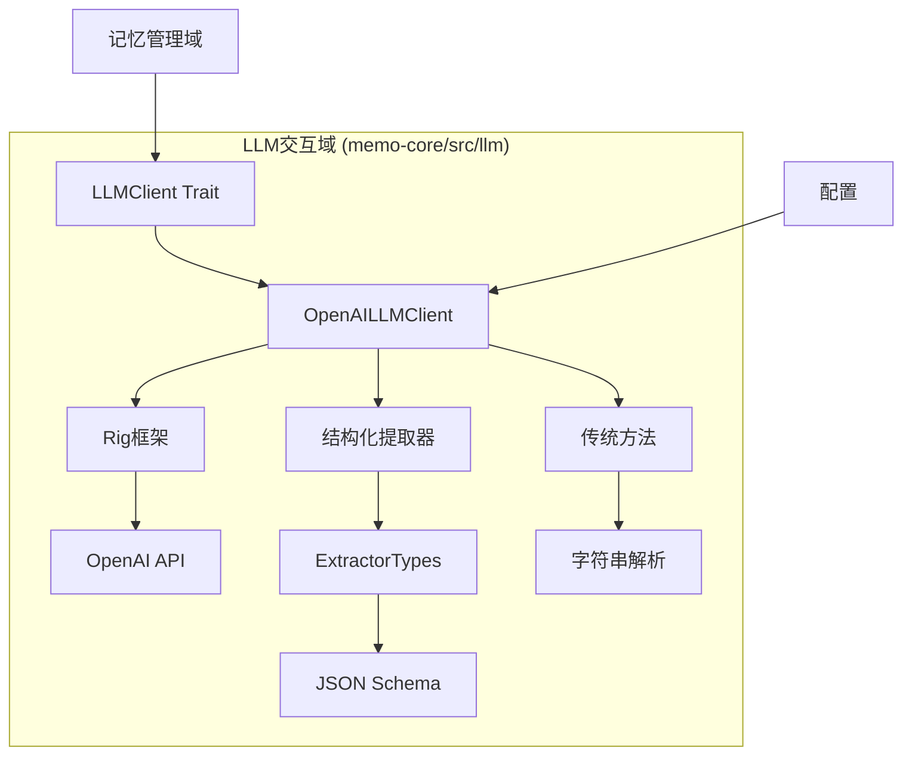
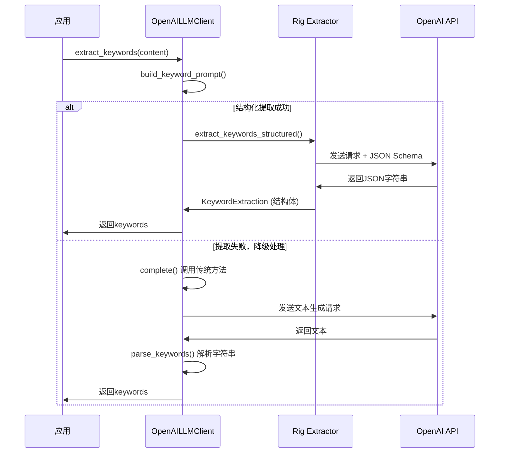

# LLM交互域技术实现文档

**生成时间**：2025-11-30 21:25:07 +08:00  
**时间戳**：1764509107  
**文档版本**：1.0  
**项目名称**：`memo`  
**模块名称**：LLM交互域（`LLM Interaction Domain`）

---

## 1. 模块概述

### 1.1 模块定位与核心价值

**LLM交互域**是 `memo` 项目中负责与大语言模型（Large Language Model, LLM）进行通信的核心基础设施模块。该模块封装了所有与外部LLM服务（如OpenAI）的交互逻辑，为上层业务模块（如记忆提取、分类、重要性评估等）提供统一、可靠、高性能的AI能力调用接口。

其核心价值在于：
- **能力抽象化**：将复杂的LLM API调用封装为简洁的Rust trait接口，屏蔽底层实现细节。
- **功能标准化**：统一支持文本生成、嵌入向量生成、结构化信息提取等关键AI任务。
- **系统健壮性**：通过优雅降级、错误处理和健康检查机制，保障系统在LLM服务不稳定时仍能正常运行。
- **可扩展性**：基于trait的抽象设计，支持未来无缝切换至其他LLM提供商（如Anthropic、Google Gemini等）。

该模块位于系统架构的**基础设施层**，是连接“记忆智能处理”与“外部AI能力”的关键桥梁。

---

## 2. 模块架构与组成

### 2.1 整体架构图



### 2.2 核心组件说明

| 组件 | 路径 | 类型 | 职责 |
|------|------|------|------|
| `LLMClient` | `client.rs` | Trait | 定义与LLM交互的统一接口 |
| `OpenAILLMClient` | `client.rs` | 结构体 | OpenAI服务的具体实现 |
| `extractor_types` | `extractor_types.rs` | 模块 | 定义结构化提取的数据模型 |
| `mod.rs` | `mod.rs` | 模块声明 | 导出公共接口 |

---

## 3. 核心接口与实现

### 3.1 `LLMClient` Trait 接口定义

`LLMClient` 是本模块的核心抽象，定义了所有LLM操作的异步接口，确保上层模块无需关心具体实现。

```rust
#[async_trait]
pub trait LLMClient: Send + Sync + dyn_clone::DynClone {
    // 基础功能
    async fn complete(&self, prompt: &str) -> Result<String>;
    async fn embed(&self, text: &str) -> Result<Vec<f32>>;
    async fn embed_batch(&self, texts: &[String]) -> Result<Vec<Vec<f32>>>;
    async fn health_check(&self) -> Result<bool>;

    // 高级结构化提取功能
    async fn extract_keywords(&self, content: &str) -> Result<Vec<String>>;
    async fn summarize(&self, content: &str, max_length: Option<usize>) -> Result<String>;
    async fn extract_structured_facts(&self, prompt: &str) -> Result<StructuredFactExtraction>;
    async fn classify_memory(&self, prompt: &str) -> Result<MemoryClassification>;
    async fn score_importance(&self, prompt: &str) -> Result<ImportanceScore>;
    async fn check_duplicates(&self, prompt: &str) -> Result<DeduplicationResult>;
    // ... 其他结构化提取方法
}
```

> **设计说明**：
> - 使用 `async_trait` 实现异步 trait，符合Rust异步生态。
> - 继承 `Send + Sync + DynClone`，确保可在多线程环境中安全传递和克隆。
> - 返回统一的 `Result<T, MemoryError>`，便于错误传播与处理。

---

### 3.2 `OpenAILLMClient` 实现细节

`OpenAILLMClient` 是 `LLMClient` 的具体实现，基于 `rig` 框架与 OpenAI API 进行交互。

#### 3.2.1 构造函数

```rust
impl OpenAILLMClient {
    pub fn new(llm_config: &LLMConfig, embedding_config: &EmbeddingConfig) -> Result<Self> {
        let client = Client::builder(&llm_config.api_key)
            .base_url(&llm_config.api_base_url)
            .build();

        let completion_model = client
            .completion_model(&llm_config.model_efficient)
            .completions_api()
            .into_agent_builder()
            .temperature(llm_config.temperature as f64)
            .max_tokens(llm_config.max_tokens as u64)
            .build();

        let embedding_model = client.embedding_model(&embedding_config.model_name);

        Ok(Self {
            completion_model,
            completion_model_name: llm_config.model_efficient.clone(),
            embedding_model,
            client,
        })
    }
}
```

> **关键配置参数**：
> - `api_key`：OpenAI API密钥
> - `api_base_url`：API基础URL（支持自定义部署）
> - `model_efficient`：用于文本生成的模型（如 `gpt-3.5-turbo`）
> - `model_name`：用于嵌入的模型（如 `text-embedding-ada-002`）
> - `temperature`, `max_tokens`：生成参数

#### 3.2.2 嵌入向量生成

```rust
async fn embed(&self, text: &str) -> Result<Vec<f32>> {
    let builder = EmbeddingsBuilder::new(self.embedding_model.clone())
        .document(text)
        .map_err(|e| MemoryError::LLM(e.to_string()))?;

    let embeddings = builder.build().await
        .map_err(|e| MemoryError::LLM(e.to_string()))?;

    if let Some((_, embedding)) = embeddings.first() {
        Ok(embedding.first().vec.iter().map(|&x| x as f32).collect())
    } else {
        Err(MemoryError::LLM("No embedding generated".to_string()))
    }
}
```

> **特性**：
> - 支持单条文本嵌入。
> - 支持批量嵌入（`embed_batch`），内部按条处理以避免速率限制。

---

### 3.3 结构化数据提取机制

本模块的核心优势在于支持**结构化数据提取**，避免传统LLM调用中“字符串解析”的脆弱性。

#### 3.3.1 提取器数据模型（`extractor_types.rs`）

定义了所有结构化输出的Rust数据结构，并通过 `schemars::JsonSchema` 自动生成JSON Schema，供LLM遵循。

```rust
#[derive(Debug, Clone, Serialize, Deserialize, JsonSchema)]
pub struct KeywordExtraction {
    pub keywords: Vec<String>,
}

#[derive(Debug, Clone, Serialize, Deserialize, JsonSchema)]
pub struct MemoryClassification {
    pub memory_type: String,
    pub confidence: f32,
    pub reasoning: String,
}

#[derive(Debug, Clone, Serialize, Deserialize, JsonSchema)]
pub struct ImportanceScore {
    pub score: f32,
    pub reasoning: String,
}
// ... 其他结构体
```

#### 3.3.2 结构化提取实现

使用 `rig` 框架的 `extractor_completions_api` 实现类型安全的提取：

```rust
async fn extract_keywords_structured(&self, prompt: &str) -> Result<KeywordExtraction> {
    let extractor = self
        .client
        .extractor_completions_api::<KeywordExtraction>(&self.completion_model_name)
        .preamble(prompt)
        .max_tokens(500)
        .build();

    extractor.extract("").await
        .map_err(|e| MemoryError::LLM(e.to_string()))
}
```

> **工作流程**：
> 1. 将目标结构体（如 `KeywordExtraction`）的JSON Schema作为系统提示。
> 2. LLM生成符合Schema的JSON输出。
> 3. 框架自动解析为Rust结构体，确保类型安全。

---

### 3.4 优雅降级策略

为保障系统健壮性，模块实现了**优雅降级**机制：当结构化提取失败时，自动回退到传统字符串解析。

以 `extract_keywords` 为例：

```rust
async fn extract_keywords(&self, content: &str) -> Result<Vec<String>> {
    let prompt = self.build_keyword_prompt(content);

    match self.extract_keywords_structured(&prompt).await {
        Ok(keyword_extraction) => {
            debug!("Extracted {} keywords using rig extractor", keyword_extraction.keywords.len());
            Ok(keyword_extraction.keywords)
        }
        Err(e) => {
            debug!("Rig extractor failed, falling back: {}", e);
            let response = self.complete(&prompt).await?;
            let keywords = self.parse_keywords(&response);
            debug!("Extracted {} keywords using fallback method", keywords.len());
            Ok(keywords)
        }
    }
}
```

> **降级路径**：
> `结构化提取` → 失败 → `传统文本生成` → `字符串解析（split(',')）` → 返回结果

此机制确保即使LLM返回非标准JSON，系统仍能提取出可用信息。

---

## 4. 与其他模块的交互

### 4.1 与记忆管理域的交互

`LLM交互域` 被 `记忆管理域` 中的多个子模块直接调用：

| 记忆管理子模块 | 调用的LLM方法 | 用途 |
|----------------|----------------|------|
| `记忆提取器` | `extract_structured_facts` | 从对话中提取结构化事实 |
| `记忆分类器` | `classify_memory` | 对记忆内容进行分类 |
| `重要性评估器` | `score_importance` | 评估记忆的重要性分数 |
| `记忆去重器` | `check_duplicates` | 检测语义重复 |
| `记忆更新器` | `extract_detailed_facts` | 决策记忆变更 |

**示例：重要性评估器调用LLM**

```rust
// 在 importance.rs 中
async fn evaluate_importance(&self, memory: &Memory) -> Result<f32> {
    let prompt = self.create_importance_prompt(memory);
    
    match self.llm_client.score_importance(&prompt).await {
        Ok(importance_score) => Ok(importance_score.score.clamp(0.0, 1.0)),
        Err(e) => {
            // 降级处理
            let response = self.llm_client.complete(&prompt).await?;
            let importance = response.trim().parse::<f32>().unwrap_or(0.5);
            Ok(importance.clamp(0.0, 1.0))
        }
    }
}
```

### 4.2 与配置管理域的交互

`OpenAILLMClient` 的创建依赖 `LLMConfig` 和 `EmbeddingConfig`，这些配置从 `config.toml` 加载：

```toml
[llm]
provider = "openai"
api_key = "sk-..."
api_base_url = "https://api.openai.com/v1"
model_efficient = "gpt-3.5-turbo"
temperature = 0.7
max_tokens = 512

[vector_store]
provider = "qdrant"
url = "http://localhost:6334"
collection_name = "memories"
# dimension 可选，若未设置则自动检测
```

---

## 5. 关键工作流程

### 5.1 结构化关键词提取序列图



---

## 6. 设计亮点与优势

| 优势 | 说明 |
|------|------|
| **统一接口** | 通过 `LLMClient` trait 抽象，实现高内聚低耦合。 |
| **类型安全** | 结构化提取确保LLM输出可直接映射为Rust结构体，避免解析错误。 |
| **健壮可靠** | 优雅降级机制保障系统在异常情况下仍能提供基本功能。 |
| **易于测试** | 可通过Mock实现 `LLMClient` trait，实现单元测试隔离。 |
| **可扩展性强** | 未来可轻松实现 `AnthropicLLMClient` 或 `LocalLLMClient`。 |
| **可观测性好** | 使用 `tracing` 输出详细日志，便于调试与监控。 |

---

## 7. 总结

`LLM交互域` 作为 `memo` 项目的核心基础设施，成功实现了对大语言模型能力的**安全、可靠、高效**封装。其设计充分体现了现代Rust系统的工程化水平：

- 以 **trait抽象** 实现解耦与可扩展性。
- 以 **结构化提取** 提升数据处理的准确性与稳定性。
- 以 **优雅降级** 保障系统的健壮性与可用性。

该模块为上层记忆智能处理提供了坚实可靠的AI能力底座，是 `memo` 系统实现“语义级”记忆管理的关键支撑。未来可进一步优化性能（如LLM调用缓存）、增强安全性（API密钥加密）和提升可观测性（集成Metrics与Trace），使其成为通用的AI交互中间件。