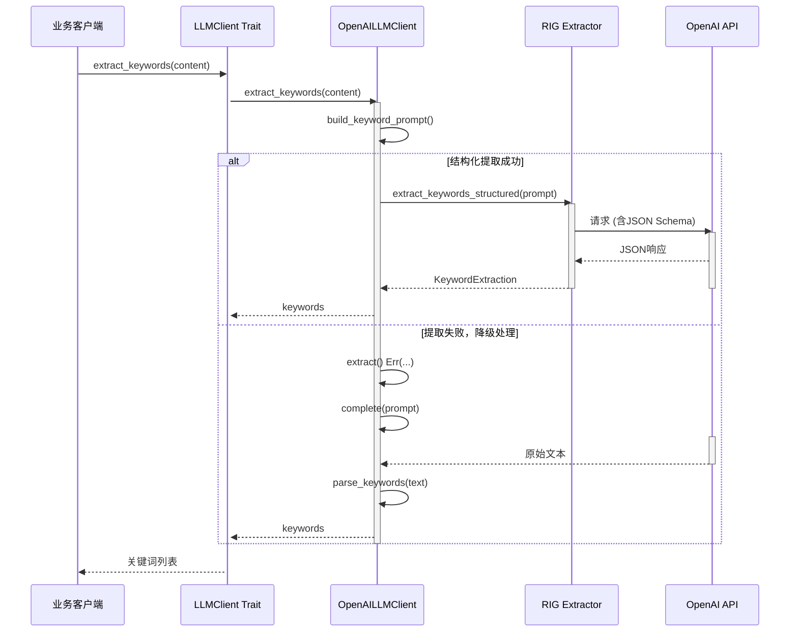

# LLM集成域技术实现文档

**生成时间**：2025-12-03 14:32:30 +08:00  
**时间戳**：1764743550  

---

## 1. 模块概述

### 1.1 模块名称
**LLM集成域（LLM Integration Domain）**

### 1.2 模块定位
LLM集成域是系统的核心业务支撑模块之一，负责封装与大语言模型（Large Language Model, LLM）的交互逻辑。该模块通过统一的抽象接口，为上层业务逻辑提供文本生成、嵌入向量生成、结构化信息提取等AI能力，屏蔽底层LLM提供商的技术差异，提升系统的可维护性与扩展性。

### 1.3 核心价值
- **统一接口抽象**：通过`LLMClient` trait定义标准化异步接口，支持未来多LLM提供商的无缝切换。
- **结构化数据提取**：利用RIG框架实现类型安全的结构化输出解析，显著降低LLM“幻觉”风险。
- **智能降级机制**：在结构化提取失败时自动回退到字符串解析，保障服务可用性。
- **配置驱动设计**：所有模型参数、API密钥等均通过外部配置注入，支持灵活部署与多环境适配。

---

## 2. 架构设计

### 2.1 整体架构图
```mermaid
graph TD
    A[业务逻辑] -->|调用| B[LLMClient Trait]
    B --> C[OpenAILLMClient 实现]
    C --> D[RIG Client & Agent]
    D --> E[OpenAI API]
    C --> F[结构化提取器]
    F --> G[extractor_types.rs 定义的结构]
    C --> H[降级处理]
    H --> I[complete() + 字符串解析]
    J[LLMConfig / EmbeddingConfig] --> C
    K[prompts.rs 定义的提示词] --> C
```

### 2.2 分层结构说明

| 层级 | 组件 | 职责 |
|------|------|------|
| **接口层** | `LLMClient` trait | 定义统一异步接口，供上层调用 |
| **实现层** | `OpenAILLMClient` | 基于RIG框架的具体实现 |
| **工具层** | `RIG Extractor` | 提供结构化数据提取能力 |
| **数据层** | `extractor_types.rs` | 定义结构化响应的数据模型 |
| **配置层** | `LLMConfig`, `EmbeddingConfig` | 提供运行时参数配置 |
| **提示工程层** | `prompts.rs` | 管理各类系统级提示词 |

---

## 3. 核心组件详解

### 3.1 接口定义：`LLMClient` Trait

位于 `memo-core/src/llm/client.rs`，采用 `async_trait` 实现异步接口抽象：

```rust
#[async_trait]
pub trait LLMClient: Send + Sync + dyn_clone::DynClone {
    async fn complete(&self, prompt: &str) -> Result<String>;
    async fn embed(&self, text: &str) -> Result<Vec<f32>>;
    async fn embed_batch(&self, texts: &[String]) -> Result<Vec<Vec<f32>>>;
    async fn extract_keywords(&self, content: &str) -> Result<Vec<String>>;
    async fn summarize(&self, content: &str, max_length: Option<usize>) -> Result<String>;
    async fn health_check(&self) -> Result<bool>;

    // 结构化提取方法
    async fn extract_structured_facts(&self, prompt: &str) -> Result<StructuredFactExtraction>;
    async fn extract_detailed_facts(&self, prompt: &str) -> Result<DetailedFactExtraction>;
    async fn extract_keywords_structured(&self, prompt: &str) -> Result<KeywordExtraction>;
    async fn classify_memory(&self, prompt: &str) -> Result<MemoryClassification>;
    async fn score_importance(&self, prompt: &str) -> Result<ImportanceScore>;
    async fn detect_duplicate(&self, prompt: &str) -> Result<DeduplicationResult>;
    async fn generate_summary(&self, prompt: &str) -> Result<SummaryResult>;
    async fn detect_language(&self, prompt: &str) -> Result<LanguageDetection>;
    async fn extract_entities(&self, prompt: &str) -> Result<EntityExtraction>;
    async fn analyze_conversation(&self, prompt: &str) -> Result<ConversationAnalysis>;
}
```

> **设计亮点**：
> - 所有方法均为异步，适应高延迟网络调用场景
> - 继承 `Send + Sync + DynClone`，支持跨线程传递与克隆
> - 提供基础能力（`complete`, `embed`）与高级语义功能（`summarize`, `extract_keywords`）双接口

---

### 3.2 实现类：`OpenAILLMClient`

#### 3.2.1 构造函数
```rust
impl OpenAILLMClient {
    pub fn new(llm_config: &LLMConfig, embedding_config: &EmbeddingConfig) -> Result<Self> {
        let client = Client::new(&llm_config.api_key, &llm_config.base_url);
        let completion_model = client.completion_model(&llm_config.model_efficient);
        let embedding_model = client.embedding_model(&embedding_config.model_name);

        Ok(Self {
            completion_model,
            completion_model_name: llm_config.model_efficient.clone(),
            embedding_model,
            client,
        })
    }
}
```

> **依赖注入**：通过 `LLMConfig` 和 `EmbeddingConfig` 注入API密钥、模型名称、基础URL等参数。

#### 3.2.2 核心方法实现

##### （1）文本生成：`complete`
```rust
async fn complete(&self, prompt: &str) -> Result<String> {
    let response = self.completion_model.prompt(prompt).await?;
    debug!("Generated completion for prompt length: {}", prompt.len());
    Ok(response)
}
```

##### （2）嵌入向量生成：`embed`
```rust
async fn embed(&self, text: &str) -> Result<Vec<f32>> {
    let builder = EmbeddingsBuilder::new(self.embedding_model.clone())
        .document(text)
        .map_err(|e| MemoryError::LLM(e.to_string()))?;

    let embeddings = builder.build().await?;
    if let Some((_, embedding)) = embeddings.first() {
        Ok(embedding.first().vec.iter().map(|&x| x as f32).collect())
    } else {
        Err(MemoryError::LLM("No embedding generated".to_string()))
    }
}
```

##### （3）关键词提取：`extract_keywords`（含降级机制）
```rust
async fn extract_keywords(&self, content: &str) -> Result<Vec<String>> {
    let prompt = self.build_keyword_prompt(content);

    match self.extract_keywords_structured(&prompt).await {
        Ok(keyword_extraction) => {
            debug!("Extracted {} keywords using rig extractor", keyword_extraction.keywords.len());
            Ok(keyword_extraction.keywords)
        }
        Err(e) => {
            debug!("Rig extractor failed, falling back: {}", e);
            let response = self.complete(&prompt).await?;
            let keywords = self.parse_keywords(&response); // split by comma
            Ok(keywords)
        }
    }
}
```

> **降级策略**：优先使用结构化提取，失败后回退至传统字符串解析，确保服务韧性。

##### （4）摘要生成：`summarize`
```rust
async fn summarize(&self, content: &str, max_length: Option<usize>) -> Result<String> {
    let prompt = self.build_summary_prompt(content, max_length);

    match self.generate_summary(&prompt).await {
        Ok(summary_result) => Ok(summary_result.summary.trim().to_string()),
        Err(e) => {
            debug!("Fallback to complete due to: {}", e);
            let summary = self.complete(&prompt).await?;
            Ok(summary.trim().to_string())
        }
    }
}
```

---

### 3.3 结构化数据模型：`extractor_types.rs`

位于 `memo-core/src/llm/extractor_types.rs`，定义了所有结构化提取的目标类型，使用 `serde` 与 `schemars` 实现序列化与JSON Schema生成。

#### 关键类型示例：

| 类型 | 字段 | 说明 |
|------|------|------|
| `StructuredFactExtraction` | `facts: Vec<String>` | 提取的原始事实列表 |
| `DetailedFactExtraction` | `facts: Vec<StructuredFact>` | 带元数据的事实 |
| `StructuredFact` | `content`, `importance`, `category`, `entities`, `source_role` | 单条结构化事实 |
| `MemoryClassification` | `memory_type`, `confidence`, `reasoning` | 记忆分类结果 |
| `ImportanceScore` | `score`, `reasoning` | 重要性评分 |
| `DeduplicationResult` | `is_duplicate`, `similarity_score`, `original_memory_id` | 去重判断结果 |
| `SummaryResult` | `summary`, `key_points` | 摘要与要点 |
| `EntityExtraction` | `entities: Vec<Entity>` | 实体识别结果 |
| `Entity` | `text`, `label`, `confidence` | 单个实体 |

> **优势**：强类型保障 + JSON Schema自动生成，提升LLM输出稳定性。

---

### 3.4 提示词管理：`prompts.rs`

位于 `memo-core/src/memory/prompts.rs`，集中管理所有系统级提示词，确保一致性与可维护性。

#### 核心提示词：

| 提示词常量 | 用途 | 特点 |
|----------|------|------|
| `PROCEDURAL_MEMORY_SYSTEM_PROMPT` | 程序性记忆总结 | 强调逐字记录、保留原始输出 |
| `USER_MEMORY_EXTRACTION_PROMPT` | 用户事实提取 | 仅基于用户消息，避免污染 |
| `AGENT_MEMORY_EXTRACTION_PROMPT` | 助手事实提取 | 仅基于助手消息，角色隔离 |
| `MEMORY_UPDATE_PROMPT` | 记忆更新决策 | 定义增删改查四种操作规则 |

> **设计原则**：
> - 明确角色边界（用户 vs 助手）
> - 包含few-shot示例提升准确性
> - 强调输出格式（JSON）与禁止行为（如释义）

---

## 4. 工作流程分析

### 4.1 结构化提取流程（以关键词提取为例）



> **流程特点**：
> - 优先使用结构化提取保障准确性
> - 失败后自动降级保障可用性
> - 全程日志记录便于调试

---

## 5. 配置与初始化

### 5.1 配置项（`LLMConfig` 与 `EmbeddingConfig`）

| 配置项 | 示例值 | 说明 |
|--------|--------|------|
| `api_key` | `sk-...` | OpenAI API密钥 |
| `base_url` | `https://api.openai.com/v1` | API基础地址 |
| `model_efficient` | `gpt-3.5-turbo` | 通用模型 |
| `model_reasoning` | `gpt-4` | 推理模型 |
| `temperature` | `0.7` | 生成随机性 |
| `max_tokens` | `1024` | 最大输出长度 |

### 5.2 工厂函数：`create_llm_client`

```rust
pub fn create_llm_client(
    llm_config: &LLMConfig,
    embedding_config: &EmbeddingConfig,
) -> Result<Box<dyn LLMClient>> {
    let client = OpenAILLMClient::new(llm_config, embedding_config)?;
    Ok(Box::new(client))
}
```

> **扩展性**：预留接口支持未来添加Anthropic、本地模型等其他LLM提供商。

---

## 6. 与其他模块的交互关系

| 交互方向 | 被调用方 | 调用方式 | 说明 |
|--------|--------|--------|------|
| **记忆管理域 → LLM集成域** | `LLMClient` | 服务调用 | 提取事实、分类、评估重要性、去重等 |
| **配置管理域 → LLM集成域** | `LLMConfig` | 配置依赖 | 注入API密钥、模型参数等 |
| **辅助工具域 → LLM集成域** | `MemoryError` | 错误处理 | 统一异常传播机制 |

> **依赖强度**：10.0（满分10.0），为系统AI能力的核心提供者。

---

## 7. 最佳实践与改进建议

### 7.1 当前优势
- ✅ 接口抽象清晰，支持未来扩展
- ✅ 结构化提取 + 降级机制保障稳定性
- ✅ 提示词集中管理，易于维护
- ✅ 强类型数据模型减少解析错误

### 7.2 改进建议
1. **增加缓存机制**：对频繁调用的嵌入向量、关键词提取结果进行本地缓存，降低API成本。
2. **引入重试策略**：对网络请求增加指数退避重试，提升容错能力。
3. **支持多LLM提供商**：通过工厂模式扩展支持Anthropic、HuggingFace等。
4. **监控与指标暴露**：记录LLM调用延迟、成功率，集成Prometheus。
5. **敏感信息加密**：对配置文件中的API密钥进行加密存储。

---

## 8. 总结

LLM集成域作为系统的“AI引擎”，通过**接口抽象 + 结构化提取 + 智能降级**三位一体的设计，实现了稳定、可靠、可扩展的大语言模型集成能力。其核心价值不仅在于提供基础AI功能，更在于通过工程化手段解决了LLM输出不稳定、难以预测等实际问题，为上层智能记忆管理提供了坚实的技术底座。

该模块的设计充分体现了现代AI系统开发的最佳实践：**抽象化、类型安全、容错设计、配置驱动**，是系统智能化能力的核心支柱。