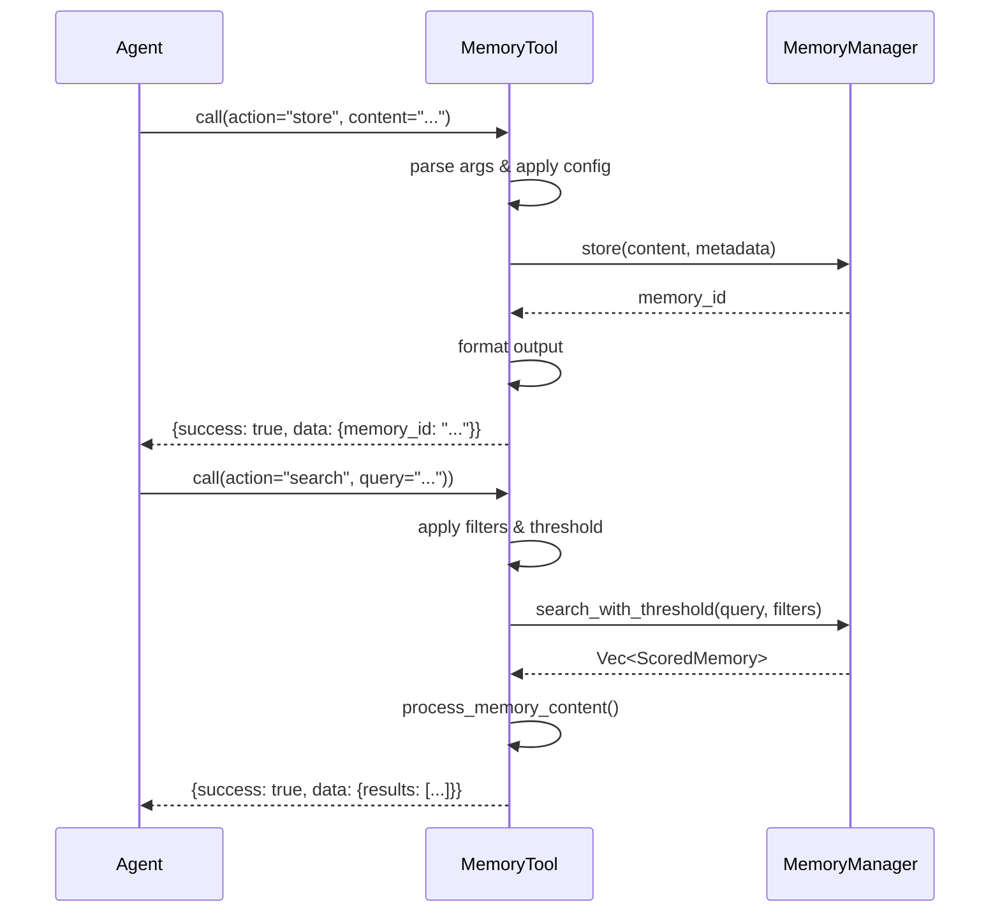
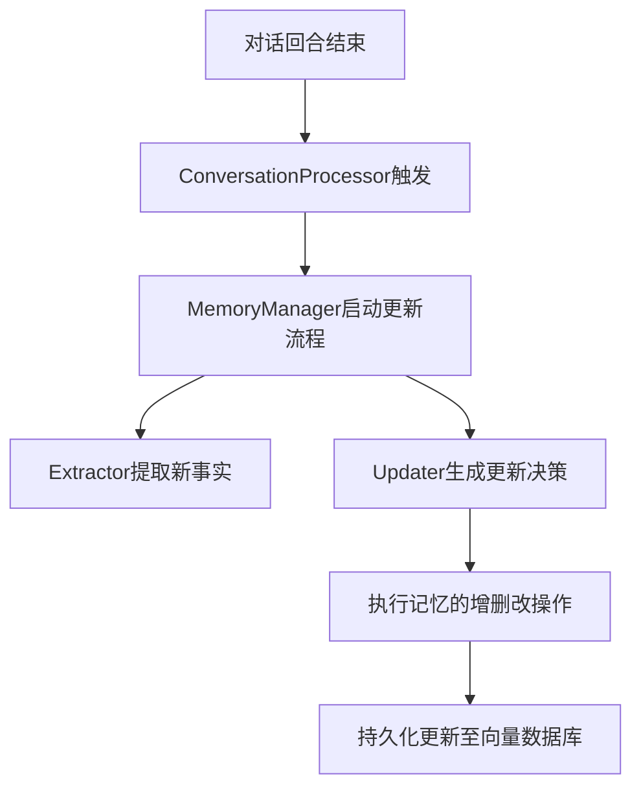

# RIG集成域技术实现文档

**生成时间**：2025-11-30 21:30:24  
**时间戳**：1764509424  

---

## 1. 概述

`RIG集成域`（`memo-rig`）是 `memo` 项目中专为与 **RIG（Retrieval-Augmented Generation Infrastructure）框架** 集成而设计的模块。该模块使 `memo` 的记忆管理能力能够以“工具”（Tool）的形式被外部智能 Agent 发现、调用和集成，从而实现记忆功能的模块化、服务化与自动化。

本技术文档旨在全面阐述 `RIG集成域` 的设计目标、核心组件、技术实现细节、交互流程及最佳实践，为开发者提供清晰的集成与扩展指导。

---

## 2. 设计目标与定位

### 2.1 核心目标
- **Agent 可调用性**：将 `memo` 的记忆管理功能封装为 RIG 框架标准的 `Tool`，使其能被 Agent 自动发现和调用。
- **被动学习支持**：提供在对话结束后自动触发记忆更新的机制，实现 AI 代理的“被动学习”能力。
- **灵活配置**：支持通过配置文件或运行时参数对工具行为进行定制，如默认用户/代理 ID、搜索阈值等。
- **自然语言交互**：确保工具的输入输出符合自然语言处理场景，便于 Agent 理解和用户感知。

### 2.2 模块定位
`RIG集成域` 属于 **工具支撑域**，其主要职责是作为 `memo-core` 与外部 Agent 框架之间的**适配层**。它不包含核心业务逻辑，而是通过调用 `MemoryManager` 来实现功能，确保了核心逻辑的复用性和架构的清晰性。

---

## 3. 核心组件与职责

`RIG集成域` 主要由两个核心组件构成：

| 组件 | 文件路径 | 职责 |
|------|--------|------|
| **记忆工具 (MemoryTool)** | `memo-rig/src/tool.rs` | 实现 RIG 的 `Tool` trait，提供 `store`、`search`、`recall`、`get` 等操作接口，是 Agent 与记忆系统交互的直接入口。 |
| **对话处理器 (ConversationProcessor)** | `memo-rig/src/processor.rs` | 在对话回合结束后自动触发记忆更新流程，实现被动学习，无需用户主动干预。 |

---

## 4. 技术实现细节

### 4.1 记忆工具 (MemoryTool)

#### 4.1.1 核心结构
```rust
pub struct MemoryTool {
    memory_manager: Arc<MemoryManager>,
    config: MemoryToolConfig,
}
```
- **`memory_manager`**：通过 `Arc`（原子引用计数）共享的 `MemoryManager` 实例，确保线程安全，是执行所有记忆操作的核心。
- **`config`**：工具的配置对象，支持行为定制。

#### 4.1.2 配置机制
`MemoryToolConfig` 采用**优先级链配置策略**，确保灵活性与可维护性：
1. **自定义配置**（Custom Config）：由调用者传入，优先级最高。
2. **全局配置**（Global Config）：从 `config.toml` 加载，作为默认值。
3. **硬编码默认值**：作为最终兜底。

```rust
pub struct MemoryToolConfig {
    pub default_user_id: Option<String>,
    pub default_agent_id: Option<String>,
    pub max_search_results: Option<usize>,
    pub auto_enhance: Option<bool>,
    pub search_similarity_threshold: Option<f32>,
}
```

#### 4.1.3 输入与输出
- **输入**：`MemoryArgs` 结构体，通过 `action` 字段分发操作。
  ```rust
  pub struct MemoryArgs {
      pub action: String, // "store", "search", "recall", "get"
      pub content: Option<String>,
      pub query: Option<String>,
      pub memory_id: Option<String>,
      pub user_id: Option<String>,
      pub agent_id: Option<String>,
      // ... 其他过滤参数
  }
  ```
- **输出**：`MemoryOutput` 结构体，标准化返回格式。
  ```rust
  pub struct MemoryOutput {
      pub success: bool,
      pub message: String,
      pub data: Option<Value>, // 序列化为 JSON
  }
  ```

#### 4.1.4 核心操作实现
| 操作 | 方法 | 实现逻辑 |
|------|------|--------|
| **存储记忆** | `store_memory` | 1. 解析 `content` 和 `metadata`。<br>2. 调用 `memory_manager.store()`。<br>3. 返回 `memory_id`。 |
| **搜索记忆** | `search_memory` | 1. 构建 `Filters` 对象。<br>2. 根据配置选择 `search_with_threshold` 或 `search_with_config_threshold`。<br>3. 对结果调用 `process_memory_content` 优化自然语言输出。 |
| **列表查询** | `list_memory_by_filters` | 当 `query` 为空时，执行纯过滤查询，不进行向量搜索。 |

#### 4.1.5 自然语言输出优化
`process_memory_content` 函数用于将原始记忆内容转换为更自然、适合 Agent 呈现的格式。例如，将技术性描述转换为“我记得你之前说过你喜欢科幻电影”。

#### 4.1.6 错误处理
- 自定义错误类型 `MemoryToolError`，区分 `InvalidInput` 和 `Runtime` 错误。
- 使用 `tracing` 进行结构化日志记录，便于调试和监控。

---

### 4.2 对话处理器 (ConversationProcessor)

#### 4.2.1 核心结构
```rust
pub struct ConversationProcessor {
    memory_manager: Arc<MemoryManager>,
}
```

#### 4.2.2 核心方法
```rust
pub async fn process_turn(
    &self,
    messages: &[Message],
    metadata: MemoryMetadata,
) -> Result<Vec<MemoryResult>>
```
- **`messages`**：来自 `memo-core::types::Message` 的对话历史。
- **`metadata`**：包含 `user_id`、`agent_id` 等上下文信息。
- **`add_memory`**：调用 `MemoryManager` 的 `add_memory` 方法，触发“提取-检索-推理-行动”（Extract-Retrieve-Reason-Act）的智能更新流水线。

#### 4.2.3 被动学习流程
1. Agent 完成一轮对话。
2. 应用层调用 `ConversationProcessor::process_turn()`。
3. 系统自动分析对话内容，提取新事实。
4. `MemoryUpdater` 决策是否创建、更新或删除现有记忆。
5. 更新结果持久化至向量数据库。

---

## 5. 交互流程

### 5.1 RIG框架集成流程（序列图）


### 5.2 被动式记忆更新流程（流程图）


---

## 6. 集成与使用示例

### 6.1 初始化 MemoryTool
```rust
use memo_rig::tool::MemoryTool;
use memo_core::MemoryManager;
use memo_config::Config;
use std::sync::Arc;

// 假设已初始化 memory_manager 和 global_config
let memory_manager = Arc::new(MemoryManager::new(...));
let global_config = Config::load("config.toml").unwrap();

let memory_tool = MemoryTool::new(
    memory_manager,
    &global_config,
    None, // 无自定义配置
);
```

### 6.2 作为 RIG Tool 注册
```rust
use rig::tool::Tool;

// RIG 框架将自动发现并调用此工具
let tool_definition = memory_tool.definition();
// Agent 可通过 tool_definition 调用 memory_tool.call()
```

### 6.3 使用 ConversationProcessor
```rust
use memo_rig::processor::ConversationProcessor;
use memo_core::types::{Message, MemoryMetadata};

let processor = ConversationProcessor::new(memory_manager.clone());

let messages = vec![
    Message::user("我喜欢科幻电影，特别是《银翼杀手》。"),
    Message::assistant("那是一部经典的赛博朋克电影。"),
];

let metadata = MemoryMetadata::new(MemoryType::Personal)
    .with_user_id("user-123")
    .with_agent_id("agent-456");

let results = processor.process_turn(&messages, metadata).await;
// 系统将自动创建或更新关于用户偏好的记忆
```

---

## 7. 最佳实践与建议

### 7.1 配置建议
- **设置合理的 `search_similarity_threshold`**（如 0.75），避免返回不相关结果。
- **为不同 Agent 配置独立的 `default_agent_id`**，实现多租户隔离。
- **限制 `max_search_results`**，防止 Agent 处理过多信息。

### 7.2 性能优化
- **缓存高频查询**：对于重复的 `search` 请求，可引入 Redis 缓存。
- **批量处理**：在 `process_turn` 中，对大量对话历史进行分批处理。

### 7.3 安全性
- **输入验证**：在 `MemoryTool` 中严格校验 `MemoryArgs`，防止注入攻击。
- **敏感信息过滤**：在 `process_memory_content` 中实现 PII（个人身份信息）脱敏。

---

## 8. 总结

`RIG集成域` 是 `memo` 项目实现 **Agent 原生集成** 的关键模块。它通过：
- 实现 `Tool` trait 提供标准化接口，
- 支持灵活配置与自然语言交互，
- 提供被动学习机制，

成功地将记忆管理能力无缝嵌入到智能 Agent 的工作流中。该模块设计简洁、职责清晰，充分体现了 Rust 项目在模块化、可扩展性和类型安全方面的优势，是构建 AI 增强型应用的理想记忆基础设施。