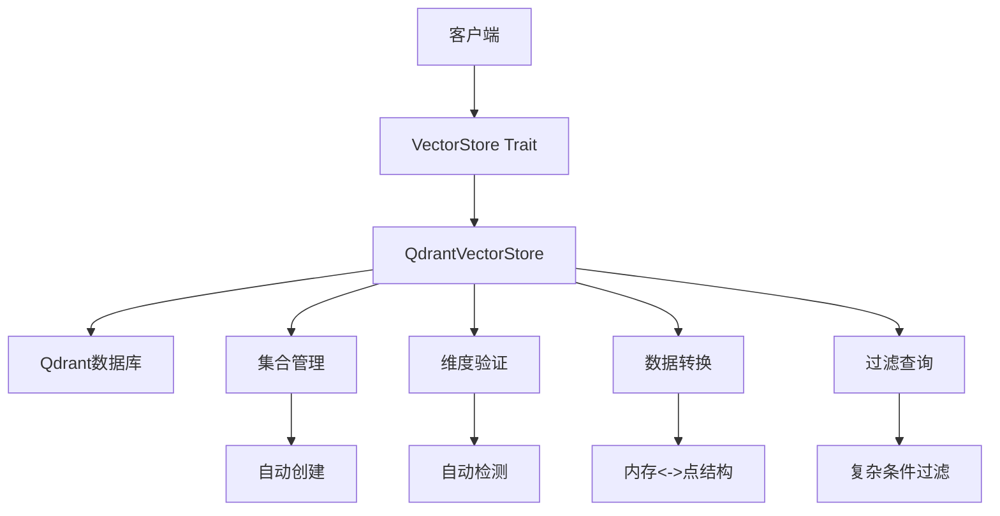
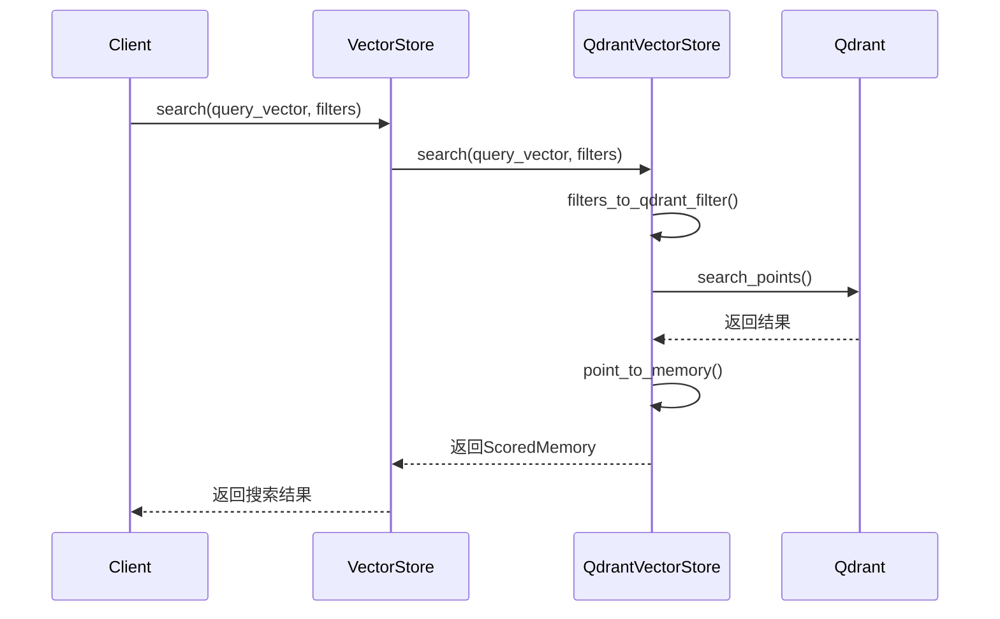

# 向量存储域技术实现文档

**生成时间**：2025-12-03 14:30:25 +08:00  
**时间戳**：1764743425  
**文档版本**：1.0  
**作者**：软件架构专家

---

## 1. 概述

本技术文档详细描述 `memo` 智能记忆管理系统中 **向量存储域**（Vector Storage Domain）的设计与实现。该模块是系统实现语义级知识管理的核心基础设施，负责记忆数据的持久化存储、高效检索与向量相似性搜索，支撑系统的智能记忆管理能力。

向量存储域基于 **Qdrant** 向量数据库构建，通过 Rust 实现了类型安全、异步友好的抽象接口，屏蔽了底层数据库的复杂性，为上层业务逻辑提供统一、可插拔的向量操作能力。

---

## 2. 模块定位与业务价值

### 2.1 模块定位

- **领域类型**：基础设施域（Infrastructure Domain）
- **模块名称**：Qdrant 向量存储
- **核心职责**：
  - 提供记忆数据的持久化存储
  - 支持高维向量的语义相似性搜索
  - 管理向量集合的生命周期
  - 实现内存数据结构与数据库存储格式的双向转换
  - 支持基于元数据的复杂过滤查询

### 2.2 业务价值

- **语义检索**：支持自然语言查询，实现“按意思找记忆”，而非关键词匹配。
- **智能去重与更新**：通过向量相似性检测，辅助系统识别重复或相关记忆，实现自动合并。
- **上下文感知**：在多轮对话中，快速检索历史记忆，增强 AI 助手的上下文理解能力。
- **知识复用**：帮助用户高效复用过往经验、技术笔记和决策过程。

---

## 3. 架构设计

### 3.1 整体架构图



### 3.2 核心组件

| 组件 | 路径 | 说明 |
|------|------|------|
| `VectorStore` Trait | `memo-core/src/vector_store/mod.rs` | 定义统一的向量操作接口，支持异步与运行时多态 |
| `QdrantVectorStore` | `memo-core/src/vector_store/qdrant.rs` | Qdrant 数据库的具体实现 |
| `Filters` | `memo-core/src/types.rs` | 定义查询过滤条件的数据结构 |
| `Memory` / `ScoredMemory` | `memo-core/src/types.rs` | 核心数据模型，表示记忆及其搜索结果 |

---

## 4. 核心接口设计

### 4.1 `VectorStore` Trait

该 trait 定义了向量存储的统一接口，采用 `async_trait` 实现异步方法，支持运行时多态与 trait 对象克隆。

```rust
#[async_trait]
pub trait VectorStore: Send + Sync + dyn_clone::DynClone {
    /// 插入一条记忆
    async fn insert(&self, memory: &Memory) -> Result<()>;

    /// 向量相似性搜索
    async fn search(
        &self,
        query_vector: &[f32],
        filters: &Filters,
        limit: usize,
    ) -> Result<Vec<ScoredMemory>>;

    /// 带相似度阈值的搜索
    async fn search_with_threshold(
        &self,
        query_vector: &[f32],
        filters: &Filters,
        limit: usize,
        score_threshold: Option<f32>,
    ) -> Result<Vec<ScoredMemory>>;

    /// 更新记忆
    async fn update(&self, memory: &Memory) -> Result<()>;

    /// 删除记忆
    async fn delete(&self, id: &str) -> Result<()>;

    /// 根据 ID 获取记忆
    async fn get(&self, id: &str) -> Result<Option<Memory>>;

    /// 列出所有记忆（支持过滤）
    async fn list(&self, filters: &Filters, limit: Option<usize>) -> Result<Vec<Memory>>;

    /// 健康检查
    async fn health_check(&self) -> Result<bool>;
}

// 支持 trait 对象克隆
dyn_clone::clone_trait_object!(VectorStore);
```

---

## 5. Qdrant 实现细节

### 5.1 `QdrantVectorStore` 结构体

```rust
pub struct QdrantVectorStore {
    client: Qdrant,                    // Qdrant 客户端
    collection_name: String,           // 集合名称
    embedding_dim: Option<usize>,      // 嵌入向量维度
}
```

### 5.2 初始化与集合管理

#### 自动维度检测

通过 `new_with_llm_client` 方法，系统可自动探测嵌入模型的输出维度，避免手动配置错误。

```rust
pub async fn new_with_llm_client(
    config: &QdrantConfig,
    llm_client: &dyn LLMClient,
) -> Result<Self> {
    let mut store = Self { /* ... */ };

    // 自动检测维度
    if store.embedding_dim.is_none() {
        let test_embedding = llm_client.embed("test").await?;
        let detected_dim = test_embedding.len();
        store.embedding_dim = Some(detected_dim);
    }

    // 确保集合存在
    store.ensure_collection().await?;

    Ok(store)
}
```

#### 集合生命周期管理

- **自动创建**：若集合不存在，根据配置自动创建。
- **维度验证**：检查现有集合的维度是否与配置一致，防止兼容性问题。
- **距离度量**：使用 **余弦相似度**（Cosine Distance）作为默认距离函数。

```rust
async fn ensure_collection(&self) -> Result<()> {
    let collection_exists = self.collection_exists().await?;

    if !collection_exists {
        let embedding_dim = self.embedding_dim.ok_or_else(|| {
            MemoryError::config("Embedding dimension not set.")
        })?;

        let vectors_config = VectorsConfig {
            config: Some(vectors_config::Config::Params(VectorParams {
                size: embedding_dim as u64,
                distance: Distance::Cosine.into(),
                ..Default::default()
            })),
        };

        self.client.create_collection(CreateCollection {
            collection_name: self.collection_name.clone(),
            vectors_config: Some(vectors_config),
            ..Default::default()
        }).await?;
    } else {
        // 验证维度兼容性
        self.verify_collection_dimension(expected_dim).await?;
    }

    Ok(())
}
```

---

## 6. 数据模型与转换

### 6.1 内存数据模型

```rust
#[derive(Debug, Clone, Serialize, Deserialize)]
pub struct Memory {
    pub id: String,
    pub content: String,
    pub embedding: Vec<f32>,
    pub metadata: MemoryMetadata,
    pub created_at: DateTime<Utc>,
    pub updated_at: DateTime<Utc>,
}

#[derive(Debug, Clone, Serialize, Deserialize)]
pub struct MemoryMetadata {
    pub user_id: Option<String>,
    pub agent_id: Option<String>,
    pub memory_type: MemoryType,
    pub importance_score: f32,
    pub entities: Vec<String>,
    pub topics: Vec<String>,
    pub custom: HashMap<String, serde_json::Value>,
    // ... 其他字段
}
```

### 6.2 内存 ↔ Qdrant 点结构转换

#### `memory_to_point`

将 `Memory` 结构转换为 Qdrant 的 `PointStruct`，其中：

- `id`：使用 UUID
- `vector`：嵌入向量
- `payload`：存储所有元数据（JSON 格式）

```rust
fn memory_to_point(&self, memory: &Memory) -> PointStruct {
    let mut payload = HashMap::new();

    payload.insert("content".to_string(), memory.content.clone().into());
    payload.insert("created_at".to_string(), memory.created_at.to_rfc3339().into());
    payload.insert("memory_type".to_string(), format!("{:?}", memory.metadata.memory_type).into());
    payload.insert("importance_score".to_string(), memory.metadata.importance_score.into());

    // 数组字段序列化为 JSON 字符串
    if !memory.metadata.entities.is_empty() {
        let entities_json = serde_json::to_string(&memory.metadata.entities).unwrap_or_default();
        payload.insert("entities".to_string(), entities_json.into());
    }

    // 自定义字段前缀为 custom_
    for (key, value) in &memory.metadata.custom {
        payload.insert(format!("custom_{}", key), value.to_string().into());
    }

    PointStruct::new(memory.id.clone(), memory.embedding.clone(), payload)
}
```

#### `point_to_memory`

将 Qdrant 的 `ScoredPoint` 反序列化为 `Memory`，处理 payload 中的类型转换与解析。

```rust
fn point_to_memory(&self, point: &ScoredPoint) -> Result<Memory> {
    let payload = &point.payload;

    let content = payload.get("content")
        .and_then(|v| v.as_str())
        .ok_or_else(|| MemoryError::Parse("Missing content field".to_string()))?
        .to_string();

    let memory_type = payload.get("memory_type")
        .and_then(|v| v.as_str())
        .and_then(|s| match s {
            "Conversational" => Some(MemoryType::Conversational),
            "Procedural" => Some(MemoryType::Procedural),
            _ => None,
        })
        .unwrap_or(MemoryType::Conversational);

    // ... 其他字段解析

    Ok(Memory { /* ... */ })
}
```

---

## 7. 查询与过滤机制

### 7.1 过滤条件映射

支持基于 `Filters` 结构的复杂查询，自动转换为 Qdrant 的 `Filter` 条件。

```rust
fn filters_to_qdrant_filter(&self, filters: &Filters) -> Option<Filter> {
    let mut conditions = Vec::new();

    if let Some(user_id) = &filters.user_id {
        conditions.push(Condition::field("user_id", user_id));
    }

    if let Some(topics) = &filters.topics {
        let topic_conditions: Vec<Condition> = topics.iter()
            .map(|topic| Condition::field("topics", topic))
            .collect();
        conditions.push(Condition::should(topic_conditions));
    }

    if let Some(entities) = &filters.entities {
        let entity_conditions: Vec<Condition> = entities.iter()
            .map(|entity| Condition::field("entities", entity))
            .collect();
        conditions.push(Condition::should(entity_conditions));
    }

    // 自定义字段过滤
    for (key, value) in &filters.custom {
        if let Some(keyword) = value.as_str() {
            conditions.push(Condition::field(&format!("custom_{}", key), keyword));
        }
    }

    if conditions.is_empty() {
        None
    } else {
        Some(Filter { must: conditions, ..Default::default() })
    }
}
```

### 7.2 支持的过滤维度

| 过滤字段 | 类型 | 说明 |
|---------|------|------|
| `user_id` | 字符串 | 按用户过滤 |
| `agent_id` | 字符串 | 按智能体过滤 |
| `memory_type` | 枚举 | 按记忆类型过滤 |
| `topics` | 字符串数组 | 包含任一主题 |
| `entities` | 字符串数组 | 包含任一实体 |
| `custom.*` | 任意 | 自定义元数据过滤 |
| `importance_score` | 数值范围 | 按重要性评分过滤 |

---

## 8. 核心工作流程

### 8.1 语义搜索流程



### 8.2 插入流程

1. 调用 `insert(memory)`
2. 调用 `memory_to_point` 转换为 Qdrant 点
3. 发送 `upsert_points` 请求
4. 记录日志并返回结果

---

## 9. 配置管理

### 9.1 配置结构（`QdrantConfig`）

```rust
#[derive(Debug, Clone, Serialize, Deserialize)]
pub struct QdrantConfig {
    pub url: String,                  // Qdrant 服务地址
    pub collection_name: String,      // 集合名称
    pub embedding_dim: Option<usize>, // 嵌入维度（可选，支持自动检测）
    pub timeout_secs: u64,            // 超时时间
}
```

### 9.2 配置文件示例（`config.toml`）

```toml
[qdrant]
url = "http://localhost:6334"
collection_name = "memories"
embedding_dim = 1536
timeout_secs = 30
```

---

## 10. 错误处理

使用统一的 `MemoryError` 枚举处理所有异常：

```rust
#[derive(Error, Debug)]
pub enum MemoryError {
    #[error("Vector store error: {0}")]
    VectorStore(#[from] qdrant_client::QdrantError),

    #[error("Configuration error: {0}")]
    Config(String),

    #[error("Parse error: {0}")]
    Parse(String),
}
```

关键错误场景：

- **维度不匹配**：现有集合维度与配置不符
- **集合不存在**：自动创建失败
- **网络连接失败**：Qdrant 服务不可达
- **数据解析失败**：payload 反序列化错误

---

## 11. 总结与建议

### 11.1 设计优势

- ✅ **可插拔架构**：通过 `VectorStore` trait 支持未来替换为其他向量数据库（如 Pinecone、Weaviate）。
- ✅ **自动配置**：支持嵌入维度自动检测，降低使用门槛。
- ✅ **类型安全**：Rust 强类型系统保障数据一致性。
- ✅ **异步友好**：全异步接口，适合高并发场景。
- ✅ **复杂过滤**：支持多维度元数据组合查询。

### 11.2 改进建议

1. **向量缓存**：对频繁查询的嵌入向量进行本地缓存，减少 LLM 调用。
2. **批量操作优化**：增加 `insert_batch`、`search_batch` 接口，提升性能。
3. **索引策略配置**：暴露 Qdrant 的 HNSW 参数，支持高级用户调优。
4. **监控指标**：集成 Prometheus，暴露查询延迟、成功率等指标。
5. **数据迁移工具**：提供集合迁移与备份恢复工具。

---

**文档结束**