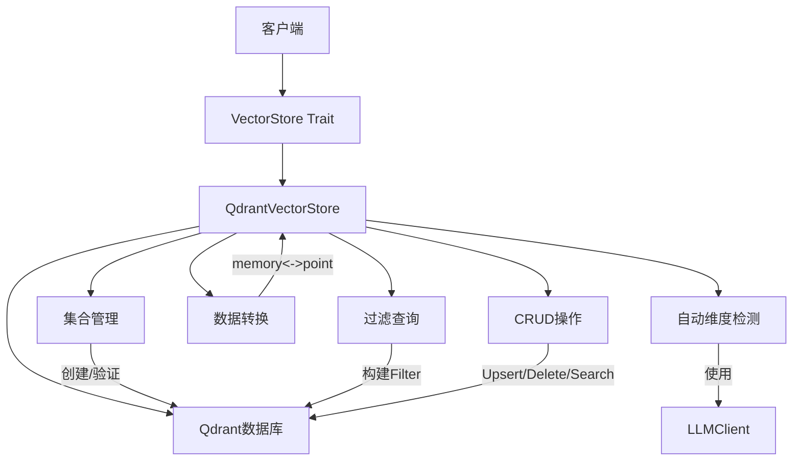
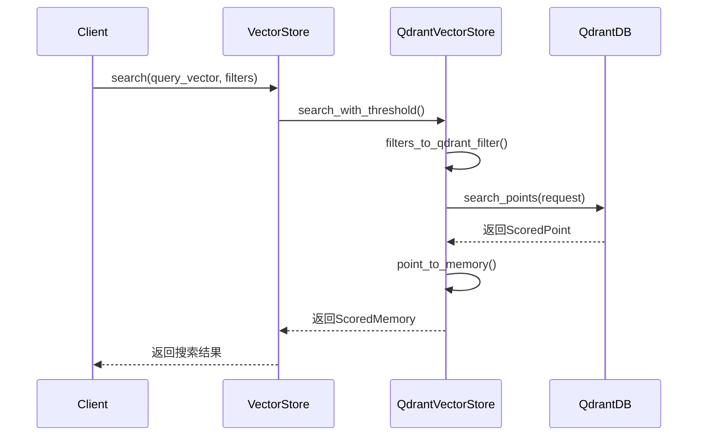
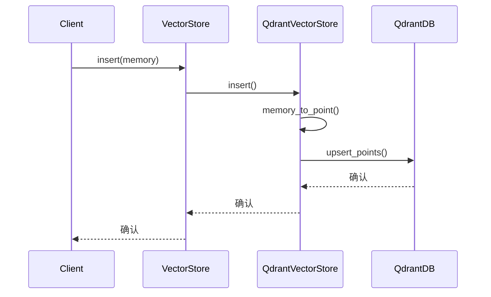

# 向量存储域技术实现文档

**生成时间**：2025-11-30 21:23:21 +08:00  
**时间戳**：1764509001  
**文档版本**：1.0  
**项目名称**：`memo` 智能记忆管理系统

---

## 1. 概述

本技术文档详细阐述 `memo` 项目中 **向量存储域**（Vector Store Domain）的设计与实现。该模块是系统实现语义级记忆管理的核心基础设施，负责记忆数据的持久化存储、高效检索与生命周期管理。其设计遵循高内聚、低耦合、可扩展的架构原则，通过抽象接口与具体实现分离，确保系统对底层向量数据库的解耦。

向量存储域的核心职责包括：
- 提供统一的异步接口，支持记忆数据的增删改查（CRUD）操作。
- 实现与 Qdrant 向量数据库的深度集成，支持向量相似度搜索与元数据联合过滤。
- 支持嵌入向量维度的自动检测，提升系统配置的智能化水平。
- 保证数据结构的完整性与一致性，实现 `Memory` 与 Qdrant `Point` 之间的无缝转换。

---

## 2. 架构设计

### 2.1 整体架构

向量存储域采用 **抽象接口 + 具体实现** 的分层架构，是 `memo` 项目分层架构中“基础设施域”的关键组成部分。



**架构说明**：
- **`VectorStore` Trait**：定义了向量存储操作的统一契约，是上层模块（如 `MemoryManager`）的依赖入口，实现了面向接口编程。
- **`QdrantVectorStore`**：`VectorStore` 的具体实现，封装了与 Qdrant 数据库的交互逻辑。
- **`Qdrant` 客户端**：通过 `qdrant-client` crate 与外部 Qdrant 服务进行通信（gRPC/REST）。
- **LLMClient**：在初始化阶段被用于生成测试嵌入，以实现维度自动检测。

### 2.2 模块职责

| 模块 | 职责 |
|------|------|
| `vector_store::mod` | 定义 `VectorStore` trait 及公共类型，导出 `QdrantVectorStore`。 |
| `vector_store::qdrant` | 实现 `QdrantVectorStore` 结构体，处理所有与 Qdrant 的交互。 |
| `config::QdrantConfig` | 定义向量存储的配置参数，由 `config.toml` 文件加载。 |

---

## 3. 核心组件与实现细节

### 3.1 抽象接口：`VectorStore` Trait

`VectorStore` 是一个异步、可克隆的 trait，定义了向量存储必须支持的核心操作。其设计保证了系统的可插拔性，未来可轻松扩展支持 Weaviate、Pinecone 等其他向量数据库。

**定义位置**：`memo-core/src/vector_store/mod.rs`

```rust
#[async_trait]
pub trait VectorStore: Send + Sync + dyn_clone::DynClone {
    async fn insert(&self, memory: &Memory) -> Result<()>;
    async fn search(&self, query_vector: &[f32], filters: &Filters, limit: usize) -> Result<Vec<ScoredMemory>>;
    async fn search_with_threshold(&self, query_vector: &[f32], filters: &Filters, limit: usize, score_threshold: Option<f32>) -> Result<Vec<ScoredMemory>>;
    async fn update(&self, memory: &Memory) -> Result<()>;
    async fn delete(&self, id: &str) -> Result<()>;
    async fn get(&self, id: &str) -> Result<Option<Memory>>;
    async fn list(&self, filters: &Filters, limit: Option<usize>) -> Result<Vec<Memory>>;
    async fn health_check(&self) -> Result<bool>;
}

dyn_clone::clone_trait_object!(VectorStore);
```

**关键特性**：
- **`#[async_trait]`**：支持异步操作，适应 I/O 密集型的数据库交互。
- **`dyn_clone::DynClone`**：允许 `Box<dyn VectorStore>` 被克隆，满足 Rust 中 trait object 的克隆需求。
- **`Send + Sync`**：确保实现可以在多线程异步运行时中安全使用。

---

### 3.2 具体实现：`QdrantVectorStore`

`QdrantVectorStore` 是 `VectorStore` 的唯一实现，负责与 Qdrant 数据库进行所有交互。

**定义位置**：`memo-core/src/vector_store/qdrant.rs`

#### 3.2.1 结构体定义

```rust
pub struct QdrantVectorStore {
    client: Qdrant,                    // Qdrant 客户端实例
    collection_name: String,           // 存储记忆的集合名称
    embedding_dim: Option<usize>,      // 嵌入向量的维度
}
```

#### 3.2.2 初始化与集合管理

`QdrantVectorStore` 提供了两种创建方式，以支持灵活的配置：

1.  **`new(config: &QdrantConfig)`**：使用配置中指定的维度创建实例。
2.  **`new_with_llm_client(config: &QdrantConfig, llm_client: &dyn LLMClient)`**：**核心特性**。当配置中未指定 `embedding_dim` 时，此方法会调用 `llm_client.embed("test")` 生成一个测试嵌入向量，自动检测其维度，并据此创建集合。

**集合管理逻辑** (`ensure_collection`)：
- 检查目标集合是否存在。
- 若不存在，则使用检测到的维度创建新集合，向量距离度量为 `Cosine`。
- 若存在，则验证现有集合的维度是否与预期一致，不一致则报错，防止数据不兼容。

此设计极大地提升了系统的易用性和健壮性，开发者无需手动配置嵌入模型的维度。

#### 3.2.3 数据结构转换

实现 `Memory` 与 Qdrant `PointStruct` 之间的双向转换是数据持久化的关键。

- **`memory_to_point(&self, memory: &Memory) -> PointStruct`**：
  - **ID**：使用 `Memory.id` 作为 Qdrant 的 `PointId`。
  - **向量**：直接使用 `memory.embedding`。
  - **Payload (元数据)**：将 `MemoryMetadata` 中的字段序列化为 JSON 并存入 Payload。
    - 基础字段：`content`, `created_at`, `updated_at`。
    - 元数据字段：`user_id`, `agent_id`, `memory_type`, `importance_score` 等。
    - 复杂字段：`entities` 和 `topics` 作为字符串数组存储。
    - 自定义字段：`custom` 哈希表中的键值对以 `custom_<key>` 的形式存储。

- **`point_to_memory(&self, point: &ScoredPoint) -> Result<Memory>`**：
  - 从 `PointStruct` 的 `payload` 中反序列化出各个字段。
  - 特别处理 `entities` 和 `topics` 字段，将其从 JSON 字符串解析回 `Vec<String>`。
  - 为 `embedding` 字段提供合理的默认值（使用 `embedding_dim` 或 1024 作为回退）。

#### 3.2.4 查询与过滤

`QdrantVectorStore` 支持强大的联合查询能力，结合向量相似度与结构化元数据过滤。

- **`filters_to_qdrant_filter(&self, filters: &Filters) -> Option<Filter>`**：
  - 将 `memo` 的 `Filters` 结构体转换为 Qdrant 的 `Filter` 对象。
  - 支持的过滤条件包括：
    - `user_id`, `agent_id`, `run_id`
    - `memory_type` (枚举)
    - `topics` 和 `entities` (数组，使用 `should` 逻辑，即“任一匹配”)
    - `custom` 字段 (支持字符串和数组)
  - 所有条件通过 `must` 逻辑组合，即“全部必须满足”。

- **`search_with_threshold`**：
  - 核心搜索方法，支持设置 `score_threshold`。
  - Qdrant 会在搜索时直接过滤掉相似度低于阈值的结果，减少网络传输和后续处理开销，提高搜索精度。

#### 3.2.5 CRUD 操作实现

所有 CRUD 操作均通过 `qdrant-client` 的 API 实现：
- **`insert`**：调用 `upsert_points`，实现“存在则更新，否则插入”。
- **`update`**：复用 `insert` 方法，利用 Qdrant 的 upsert 语义。
- **`delete`**：调用 `delete_points`，通过 `PointId` 删除。
- **`get`**：调用 `get_points`，通过 `PointId` 获取单个点。
- **`list`**：调用 `scroll` API，结合 `Filter` 获取所有匹配的记忆。
- **`health_check`**：调用 `health_check` API，检查 Qdrant 服务的可用性。

---

## 4. 配置管理

向量存储的配置由 `memo-config` 模块统一管理。

**配置结构**：`memo-config/src/lib.rs`

```rust
#[derive(Debug, Clone, Serialize, Deserialize)]
pub struct QdrantConfig {
    pub url: String,                  // Qdrant 服务的 URL
    pub collection_name: String,      // 记忆集合的名称
    pub embedding_dim: Option<usize>, // 嵌入向量维度，None 表示自动检测
    pub timeout_secs: u64,            // 请求超时时间
}
```

**配置加载流程**：
1.  系统启动时，`memo-service` 或 `memo-cli` 加载 `config.toml` 文件。
2.  `Config::load()` 方法解析文件，构建 `Config` 结构体。
3.  `init::initialize_memory_system()` 使用 `config.qdrant` 创建 `QdrantVectorStore` 实例。

**示例配置** (`config.toml`)：
```toml
[vector_store]
url = "http://localhost:6334"
collection_name = "memories"
embedding_dim = 1536 # 可选，不设置则自动检测
timeout_secs = 30
```

---

## 5. 交互流程

### 5.1 搜索操作序列图



### 5.2 插入操作序列图



---

## 6. 关键特性与优势

1.  **可插拔架构**：通过 `VectorStore` trait，系统可以轻松集成其他向量数据库，只需实现该 trait 即可。
2.  **自动维度检测**：创新性地利用 LLM 客户端生成测试嵌入，自动确定向量维度，极大简化了部署和配置流程。
3.  **联合查询能力**：支持向量相似度搜索与结构化元数据过滤的结合，实现精准的语义检索。
4.  **高可靠性**：在集合创建时进行维度验证，防止因配置错误导致的数据不一致。
5.  **完善的错误处理**：所有操作均返回 `Result<T, MemoryError>`，错误信息清晰，便于调试和监控。
6.  **可观测性**：使用 `tracing` 宏记录关键操作（如插入、删除、集合创建），便于系统监控和问题排查。

---

## 7. 总结

`memo` 项目的向量存储域设计精良，实现稳健。它不仅完成了向量数据持久化的基本功能，更通过 **自动维度检测** 和 **可插拔架构** 等设计，显著提升了系统的智能化水平和可维护性。该模块与 `MemoryManager`、`LLMClient` 等核心组件紧密协作，共同构成了一个高效、智能的记忆管理闭环，为 AI 代理提供了强大的长期记忆能力。其清晰的接口定义和模块化设计，为未来的功能扩展和性能优化奠定了坚实的基础。