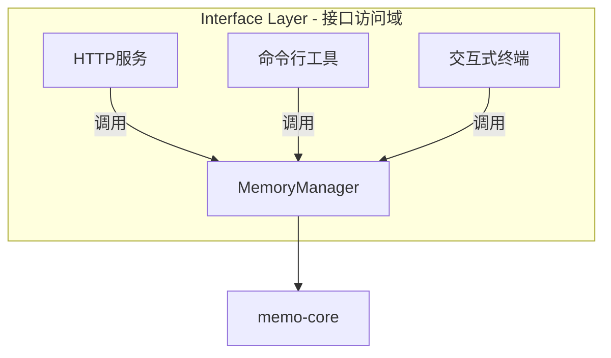
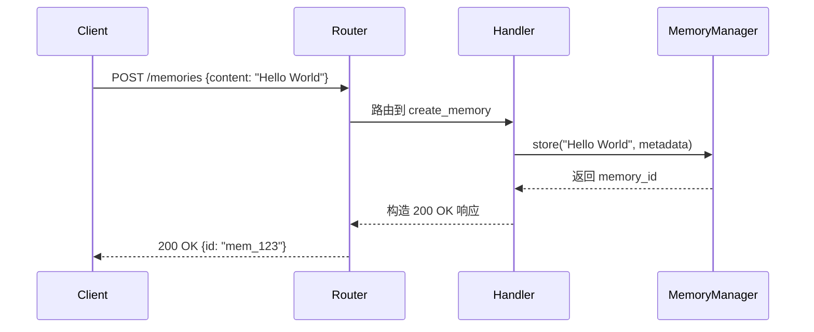
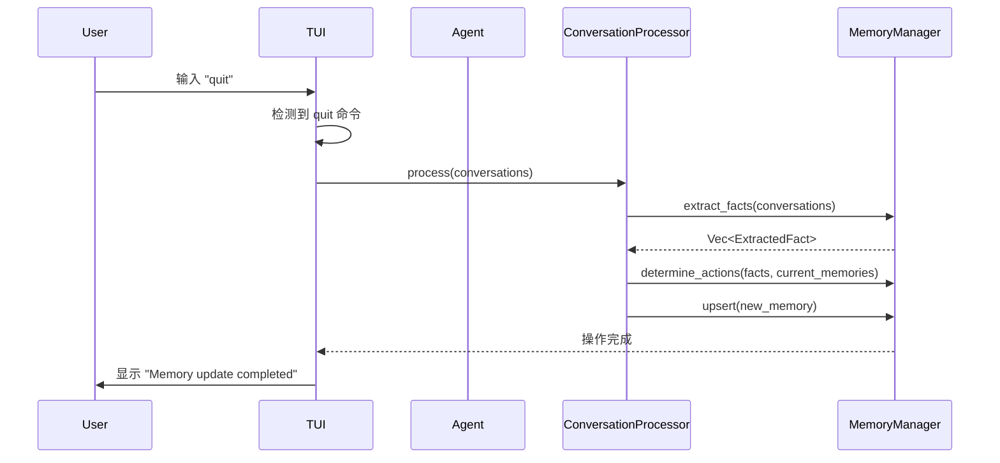

# 接口访问域技术实现文档

**生成时间**：2025-12-03 14:36:09  
**时间戳**：1764743769

## 1. 概述

接口访问域是 `memo` 系统对外提供服务的核心门户，负责将系统的智能记忆管理能力暴露给终端用户和外部系统。该域通过多种访问方式，实现了对核心业务逻辑的统一、安全和高效的调用，是连接用户需求与系统能力的关键桥梁。

本技术文档旨在全面阐述接口访问域的设计理念、核心组件、技术实现细节及工作流程，为开发者、系统维护者和架构师提供一份准确、专业且实用的参考指南。

## 2. 设计理念与目标

接口访问域的设计遵循了清晰的关注点分离原则，其核心目标是：

1.  **统一入口**：为所有外部访问提供一致的、标准化的接口，屏蔽底层核心业务的复杂性。
2.  **多模态支持**：支持不同用户群体和使用场景，提供 HTTP API、命令行工具（CLI）和交互式终端（TUI）三种主要访问模式。
3.  **高内聚低耦合**：各访问方式独立实现，但共享对 `memo-core` 的依赖，确保业务逻辑的一致性，同时允许各自独立演进。
4.  **易用性与可维护性**：通过现代化的框架和清晰的代码结构，降低开发和维护成本，提升用户体验。

## 3. 核心组件与架构

接口访问域由三个主要子模块构成，分别对应不同的访问方式。它们共同构成了系统的“前端”或“接入层”。



### 3.1 HTTP服务 (`memo-service`)

#### 3.1.1 概述
`memo-service` 是一个基于 Rust 的异步 Web 服务，使用 [Axum](https://github.com/tokio-rs/axum) 框架构建。它提供了一套完整的 RESTful API，允许客户端通过标准的 HTTP 方法（GET, POST）对记忆数据进行增删改查（CRUD）和语义搜索。

#### 3.1.2 技术栈
-   **Web 框架**: [Axum](https://github.com/tokio-rs/axum) - 一个用于构建 Web 服务的 Rust 框架，与 Tokio 运行时无缝集成，支持异步处理。
-   **HTTP 服务器**: [Tokio](https://tokio.rs/) - Rust 的异步运行时，提供高性能的网络 I/O。
-   **序列化**: [Serde](https://serde.rs/) - 用于 JSON 的序列化和反序列化。
-   **依赖注入**: 通过 Axum 的 `State` 机制，将共享的应用状态（如 `MemoryManager`）注入到各个请求处理器中。

#### 3.1.3 核心实现

`memo-service` 的实现主要分布在三个文件中：

1.  **`src/main.rs`**: 服务的入口点，负责：
    *   初始化日志系统（使用 `tracing`）。
    *   解析命令行参数（使用 `clap`）以获取配置文件路径。
    *   加载 `config.toml` 配置。
    *   创建 `MemoryManager` 实例（通过 `create_memory_manager` 函数）。
    *   构建 Axum 路由器，并将 `MemoryManager` 封装在 `AppState` 中共享。
    *   启动 HTTP 服务器并监听指定端口。

    ```rust
    // src/main.rs 片段
    #[tokio::main]
    async fn main() -> Result<(), Box<dyn std::error::Error>> {
        tracing_subscriber::fmt::init();

        let cli = Cli::parse();
        let config = Config::load(&cli.config)?; // 加载配置
        let memory_manager = create_memory_manager(&config).await?; // 创建核心管理器

        let app_state = AppState {
            memory_manager: Arc::new(memory_manager),
        };

        let app = Router::new()
            .route("/health", get(health_check))
            .route("/memories", post(create_memory).get(list_memories))
            .route("/memories/search", post(search_memories))
            .route("/memories/:id", get(get_memory))
            .with_state(app_state); // 注入共享状态

        let addr = format!("{}:{}", config.server.host, config.server.port);
        let listener = TcpListener::bind(&addr).await?;
        axum::serve(listener, app).await?; // 启动服务

        Ok(())
    }
    ```

2.  **`src/handlers.rs`**: 定义了所有 HTTP 请求的处理函数（Handlers）。每个函数负责解析请求、调用 `MemoryManager` 的相应方法，并构造 HTTP 响应。
    *   `health_check`: 实现健康检查端点。
    *   `create_memory`: 处理创建记忆的请求，能智能区分普通内容和对话内容。
    *   `list_memories`: 处理列出记忆的请求。
    *   `search_memories`: 处理语义搜索请求。
    *   `get_memory`: 处理获取单个记忆的请求。

3.  **`src/models.rs`**: 定义了 API 的数据传输对象（DTOs），包括请求和响应的结构体。这些结构体使用 `serde` 进行 JSON 序列化/反序列化。
    *   `CreateMemoryRequest`: 定义创建记忆的请求体。
    *   `SearchMemoryRequest`: 定义搜索记忆的请求体。
    *   `MemoryResponse`, `SearchResponse` 等：定义各种响应格式。

#### 3.1.4 API 端点
| 端点 | 方法 | 功能 |
| :--- | :--- | :--- |
| `/health` | GET | 健康检查，返回服务状态 |
| `/memories` | POST | 创建新记忆 |
| `/memories` | GET | 列出符合条件的记忆 |
| `/memories/search` | POST | 执行语义搜索 |
| `/memories/:id` | GET | 获取指定 ID 的记忆 |

### 3.2 命令行工具 (`memo-cli`)

#### 3.2.1 概述
`memo-cli` 是一个轻量级的命令行接口，为开发者和系统管理员提供了一种快速、脚本化的方式来与 `memo` 系统交互。它非常适合集成到自动化工作流、脚本和开发环境中。

#### 3.2.2 技术栈
-   **命令行解析**: [Clap](https://github.com/clap-rs/clap) - 一个功能强大且用户友好的命令行参数解析库。
-   **异步运行时**: [Tokio](https://tokio.rs/) - 用于异步操作。

#### 3.2.3 核心实现

`memo-cli` 的实现结构清晰，遵循了典型的 CLI 应用模式：

1.  **`src/main.rs`**: 应用的主入口。
    *   使用 `clap` 定义命令行接口，包括 `add`, `search`, `list`, `delete` 等子命令及其参数。
    *   解析命令行参数。
    *   加载配置并初始化 `MemoryManager`。
    *   根据用户输入的子命令，调用相应的 `Command` 实例的 `execute` 方法。

2.  **`src/commands/`**: 包含各个命令的具体实现。
    *   **`add.rs`**: 实现 `add` 命令。它能处理普通文本和多行对话（支持 `User:`/`Assistant:` 前缀），并调用 `memory_manager.store()` 或 `memory_manager.add_memory()`。
    *   **`search.rs`**: 实现 `search` 命令。它构建 `Filters` 对象，调用 `memory_manager.search()`，并将结果格式化输出到控制台。
    *   **`list.rs`**: 实现 `list` 命令，用于列出记忆。
    *   **`delete.rs`**: 实现 `delete` 命令，用于删除记忆。

    ```rust
    // src/commands/add.rs 片段
    pub async fn execute(&self, content: String, ...) -> Result<(), Box<dyn std::error::Error>> {
        // ... 构建 metadata
        let is_conversation = ...; // 判断是否为对话

        if is_conversation {
            let messages = parse_conversation_content(&content, &user_id, &agent_id);
            match self.memory_manager.add_memory(&messages, metadata).await {
                Ok(results) => {
                    println!("✅ Memory added successfully!");
                    // ... 打印详细信息
                }
                Err(e) => {
                    println!("❌ Failed to add memory: {}", e);
                    return Err(e.into());
                }
            }
        } else {
            match self.memory_manager.store(content.clone(), metadata).await {
                Ok(memory_id) => {
                    println!("✅ Memory added successfully!");
                    println!("ID: {}", memory_id);
                }
                Err(e) => {
                    println!("❌ Failed to add memory: {}", e);
                    return Err(e.into());
                }
            }
        }
        Ok(())
    }
    ```

### 3.3 交互式终端 (`multi-round-interactive`)

#### 3.3.1 概述
`multi-round-interactive` 是一个基于终端的用户界面（TUI），提供了一个多轮对话的交互式环境。它不仅允许用户与 AI 助手进行自然语言对话，还**在后台自动触发记忆的智能更新流程**，是系统“被动学习”能力的演示和应用。

#### 3.3.2 技术栈
-   **TUI 框架**: [Ratatui](https://github.com/ratatui-org/ratatui) - 一个用于构建终端用户界面的 Rust 库。
-   **终端控制**: [Crossterm](https://github.com/crossterm-rs/crossterm) - 用于跨平台的终端操作（如启用原始模式、处理键盘事件）。
-   **事件处理**: 使用 `tokio::sync::mpsc` 通道在 UI 线程和后台处理线程之间进行异步通信。

#### 3.3.3 核心实现

`multi-round-interactive` 的实现更为复杂，因为它需要管理一个动态的 UI 状态。

1.  **`src/main.rs`**: 主函数，负责：
    *   初始化终端（进入备用屏幕，启用原始模式）。
    *   创建 `Terminal` 实例。
    *   初始化 `MemoryManager` 和 `Agent`（AI 助手）。
    *   创建一个 `App` 实例和一个用于 UI 更新的 `mpsc` 通道。
    *   进入主事件循环，处理用户输入和 UI 渲染。

2.  **`src/app.rs`**: 定义了应用的核心状态 `App` 结构体，包含对话历史、当前输入、日志、焦点区域等。它还定义了 `AppMessage` 枚举，用于在不同组件间传递消息（如日志、新对话、流式响应块）。

3.  **`src/agent.rs`**: 包含与 AI 代理交互的核心逻辑。
    *   `create_memory_agent`: 创建一个集成了 `MemoryTool` 的 `Agent`，使其能够自主调用记忆功能。
    *   `agent_reply_with_memory_retrieval_streaming`: 实现流式回复，将 AI 的逐字输出实时推送到 UI。
    *   `extract_user_basic_info`: 从记忆中提取用户基本信息，用于初始化对话上下文。

4.  **`src/ui.rs`**: 定义了 UI 的布局和渲染逻辑，使用 Ratatui 的组件（如 `Paragraph`, `List`, `Scrollbar`）来绘制对话、输入框和日志区域。

5.  **`src/events.rs`**: 处理键盘事件，如回车键提交输入，Tab 键切换焦点等。

**关键工作流程**：
1.  用户在输入框中输入内容并按回车。
2.  `events.rs` 捕获事件，调用 `process_user_input`。
3.  `main.rs` 的主循环启动一个异步任务，调用 `agent_reply_with_memory_retrieval_streaming`。
4.  AI 代理生成回复，流式内容通过 `mpsc` 通道发送到 `App`。
5.  `App` 接收到 `StreamingChunk` 消息，更新 `current_streaming_response`。
6.  `ui.rs` 在每次循环中调用 `draw_ui`，将最新的流式内容渲染到屏幕上。
7.  当回复完成后，`App` 收到 `StreamingComplete` 消息，将完整的对话记录存入 `conversations`。
8.  **在用户输入 `quit` 命令后**，`main.rs` 会调用 `handle_quit_async`，启动一个后台任务，使用 `ConversationProcessor` 分析整个对话历史，并自动执行记忆的提取、更新和存储。

## 4. 工作流程分析

### 4.1 标准请求流程（以 HTTP 创建记忆为例）



### 4.2 被动学习更新流程（交互式终端）



## 5. 总结

接口访问域是 `memo` 系统不可或缺的一部分，它通过 HTTP、CLI 和 TUI 三种方式，为不同类型的用户提供了灵活、高效且功能强大的访问途径。其设计体现了现代 Rust 应用的优秀实践：使用成熟的异步框架、清晰的模块化结构、以及对用户体验的重视。

-   **HTTP 服务** 为系统集成和自动化提供了标准化的 API。
-   **命令行工具** 为开发者提供了快速、脚本化的操作能力。
-   **交互式终端** 不仅是一个用户界面，更是一个展示系统智能学习能力的完整应用。

这三个组件共同构成了 `memo` 系统的“门面”，将强大的 AI 驱动记忆管理能力，以最符合用户习惯的方式呈现出来。