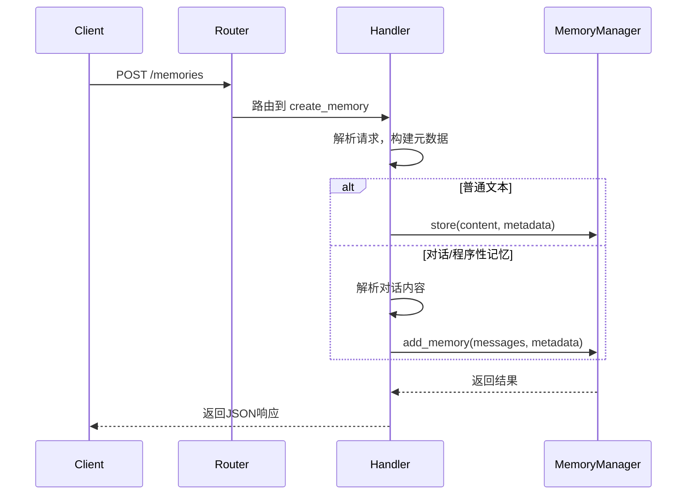

# memo 项目服务接口域技术实现文档

**生成时间**：2025-11-30 21:29:14 UTC  
**时间戳**：1764509354

---

## 1. 概述

### 1.1 模块定位
`服务接口域`是 `memo` 项目对外提供能力的核心入口，属于**工具支撑域**。它基于 `memo-core` 的核心业务能力，通过标准化的 HTTP API 将记忆管理功能暴露给外部系统，是连接前端应用、智能代理（Agent）与后端记忆引擎的桥梁。

该模块的主要职责是：
- **协议转换**：将 HTTP 请求/响应转换为对 `MemoryManager` 的内部方法调用。
- **数据序列化**：定义并处理 API 的输入/输出数据模型（DTO）。
- **请求路由**：根据 URL 和 HTTP 方法分发请求到相应的处理函数。
- **错误处理**：捕获并格式化内部错误，返回符合 REST 规范的错误响应。

### 1.2 核心价值
- **统一接入**：为所有外部客户端（Web、CLI、Agent）提供一致的访问方式。
- **解耦核心**：将网络层与业务逻辑层分离，保证 `memo-core` 的纯粹性。
- **易用性**：通过 RESTful API 降低集成门槛，无需了解 Rust 或内部实现细节。
- **可观测性**：通过结构化日志记录所有请求，便于监控和调试。

---

## 2. 架构设计与实现

### 2.1 技术栈与框架
`memo-service` 采用现代 Rust 异步生态构建，关键技术选型如下：
- **Web 框架**：[Axum](https://github.com/tokio-rs/axum) - 一个基于 Tokio 和 Tower 的模块化 Web 框架，以其高性能、类型安全和与 Tokio 的无缝集成而著称。
- **异步运行时**：[Tokio](https://tokio.rs/) - Rust 事实标准的异步运行时，负责处理 I/O 和并发。
- **命令行解析**：[Clap](https://clap.rs/) - 用于解析服务启动时的命令行参数（如配置文件路径）。
- **日志系统**：[Tracing](https://tracing.rs/) - 提供结构化日志记录，便于在分布式环境中追踪请求。
- **序列化**：[Serde](https://serde.rs/) - 用于高效地在 Rust 结构体和 JSON 之间进行序列化/反序列化。

### 2.2 核心组件与职责
`服务接口域`由三个核心文件构成，遵循清晰的职责分离原则：

| 文件 | 职责 |
| :--- | :--- |
| `main.rs` | **应用入口与初始化**。负责加载配置、创建核心组件（`MemoryManager`）、构建路由并启动 HTTP 服务器。 |
| `handlers.rs` | **请求处理逻辑**。包含所有 API 端点的处理函数，负责解析请求、调用 `MemoryManager` 并构建响应。 |
| `models.rs` | **数据模型定义**。定义了所有 API 请求和响应的 DTO（Data Transfer Object），是 API 契约的直接体现。 |

### 2.3 核心交互流程
以下是 `服务接口域` 处理一个典型请求的完整流程：



1.  **请求接收**：客户端发送 HTTP 请求。
2.  **路由分发**：Axum 的 `Router` 根据路径和方法，将请求分发到对应的 `handler` 函数。
3.  **请求处理**：`handler` 函数执行以下操作：
    - 使用 `serde` 反序列化请求体为 `CreateMemoryRequest` 等模型。
    - 从请求中提取信息，构建 `MemoryMetadata`。
    - 根据内容类型（普通文本或对话）决定调用 `MemoryManager` 的 `store` 或 `add_memory` 方法。
4.  **业务执行**：`MemoryManager` 执行完整的记忆处理流水线（提取、分类、去重等）。
5.  **响应构建**：`handler` 函数将 `MemoryManager` 的结果转换为 `SuccessResponse` 或 `ErrorResponse`，并使用 `serde` 序列化为 JSON。
6.  **返回客户端**：Axum 将 JSON 响应返回给客户端。

---

## 3. 详细实现分析

### 3.1 应用初始化 (`main.rs`)
`main.rs` 是服务的启动入口，其核心逻辑如下：

```rust
#[tokio::main]
async fn main() -> Result<(), Box<dyn std::error::Error>> {
    // 1. 初始化日志
    tracing_subscriber::fmt::init();

    // 2. 解析命令行参数
    let cli = Cli::parse();

    // 3. 加载配置文件
    let config = Config::load(&cli.config)?;

    // 4. 创建核心组件
    let memory_manager = create_memory_manager(&config).await?;

    // 5. 创建共享状态
    let app_state = AppState {
        memory_manager: Arc::new(memory_manager),
    };

    // 6. 构建路由
    let app = Router::new()
        .route("/health", get(health_check))
        .route("/memories", post(create_memory).get(list_memories))
        .route("/memories/search", post(search_memories))
        .route("/memories/:id", get(get_memory))
        .layer(ServiceBuilder::new().layer(CorsLayer::permissive()).into_inner())
        .with_state(app_state);

    // 7. 启动服务器
    let addr = format!("{}:{}", config.server.host, config.server.port);
    let listener = TcpListener::bind(&addr).await?;
    axum::serve(listener, app).await?;

    Ok(())
}
```

**关键设计点**：
- **`AppState`**：使用 `Arc<MemoryManager>` 将 `MemoryManager` 实例包装在 `AppState` 中，通过 `with_state` 方法共享给所有 `handler`。`Arc`（原子引用计数）确保了在多线程环境下的安全共享。
- **依赖注入**：`create_memory_manager` 函数负责根据 `Config` 创建 `LLMClient` 和 `QdrantVectorStore`，并注入到 `MemoryManager` 中，实现了依赖的集中管理。
- **CORS 支持**：通过 `tower_http::cors::CorsLayer` 启用跨域资源共享，允许前端应用从不同域名访问 API。

### 3.2 API 端点与处理逻辑 (`handlers.rs`)
`handlers.rs` 实现了所有 API 端点。每个处理函数都遵循 `async fn` 签名，并返回 `Result<Json<T>, (StatusCode, Json<ErrorResponse>)>`，这是 Axum 处理错误的标准模式。

#### 核心端点分析

1.  **`create_memory`**：
    - **智能内容识别**：该函数是系统智能化的体现。它通过检查 `content` 字段是否包含换行符或 `User:`/`Assistant:` 前缀，来判断输入是普通文本还是对话历史。
    - **差异化处理**：
        - **普通文本**：调用 `memory_manager.store()`，将其作为一条简单的 `Conversational` 记忆存储。
        - **对话/程序性记忆**：调用 `memory_manager.add_memory()`，触发更复杂的处理流程，包括事实提取、记忆更新等。
    - **元数据构建**：从请求中提取 `user_id`、`agent_id` 等信息，构建 `MemoryMetadata`，为后续的过滤和检索提供支持。

2.  **`search_memories`**：
    - **联合查询**：接收 `SearchMemoryRequest`，将 `query` 字符串转换为嵌入向量后，与 `Filters`（如 `user_id`、`memory_type`）结合，调用 `memory_manager.search_with_threshold()`。
    - **结果排序**：检索结果会根据相似度得分和记忆的重要性评分进行加权排序，确保最相关且最重要的记忆排在前面。

3.  **`health_check`**：
    - **系统健康度检查**：调用 `memory_manager.health_check().await`，检查 `LLMClient` 和 `VectorStore` 的连接状态，并返回一个包含详细信息的 `HealthResponse`。这是运维监控的关键接口。

### 3.3 数据模型定义 (`models.rs`)
`models.rs` 定义了 API 的契约，所有数据都通过 `serde` 进行序列化。

```rust
/// Request to create a new memory
#[derive(Debug, Deserialize)]
pub struct CreateMemoryRequest {
    pub content: String,
    pub user_id: Option<String>,
    pub agent_id: Option<String>,
    // ... 其他字段
}

/// Response for search results
#[derive(Debug, Serialize)]
pub struct SearchResponse {
    pub results: Vec<ScoredMemoryResponse>,
    pub total: usize,
}

/// Response for scored memory
#[derive(Debug, Serialize)]
pub struct ScoredMemoryResponse {
    pub memory: MemoryResponse,
    pub score: f32,
}
```

**设计亮点**：
- **清晰的 DTO**：请求和响应模型分离，避免了内部数据结构的暴露。
- **统一错误处理**：`ErrorResponse` 结构体为所有错误提供了标准化的格式，包含 `error` 消息和 `code` 错误码，便于客户端进行错误分类和处理。
- **可扩展性**：`custom` 字段允许用户存储任意的键值对，为未来的功能扩展提供了灵活性。

---

## 4. 模块间交互

`服务接口域` 与系统其他模块的交互关系如下：

| 交互方 | 交互方式 | 说明 |
| :--- | :--- | :--- |
| **记忆管理域 (`memo-core`)** | **服务调用** | 通过 `MemoryManager` 的公共 API（如 `store`, `search`, `get`）调用核心业务逻辑。这是最核心的依赖。 |
| **配置管理域 (`memo-config`)** | **配置依赖** | 在 `main.rs` 中加载 `config.toml` 文件，获取服务器端口、数据库地址等配置信息。 |
| **数据模型域 (`memo-core`)** | **数据依赖** | 使用 `memo-core` 中定义的 `Memory`、`Filters`、`MemoryMetadata` 等核心类型作为内部处理的桥梁。 |
| **外部客户端** | **HTTP API** | 通过 RESTful 接口与 Web 应用、CLI 工具或智能代理进行通信。 |

---

## 5. 总结与评价

`服务接口域` 的设计和实现充分体现了现代 Rust Web 服务的工程化水平：

- ****高内聚低耦合**：通过清晰的模块划分和 `AppState` 共享状态，实现了组件间的松耦合。
- ****健壮性**：完善的错误处理机制和结构化日志，确保了服务的稳定性和可观测性。
- ****智能化**：`create_memory` 处理函数能自动识别输入内容的类型并采取不同的处理策略，提升了用户体验。
- ****可扩展性**：基于 Axum 的模块化设计，可以轻松添加新的 API 端点或中间件。

该模块成功地将 `memo-core` 强大的记忆管理能力封装为一个易于集成的 HTTP 服务，是 `memo` 项目实现其“为 AI 代理提供长期记忆”这一核心价值的关键一环。其设计简洁、高效，是 Rust 生态中构建后端服务的优秀实践范例。