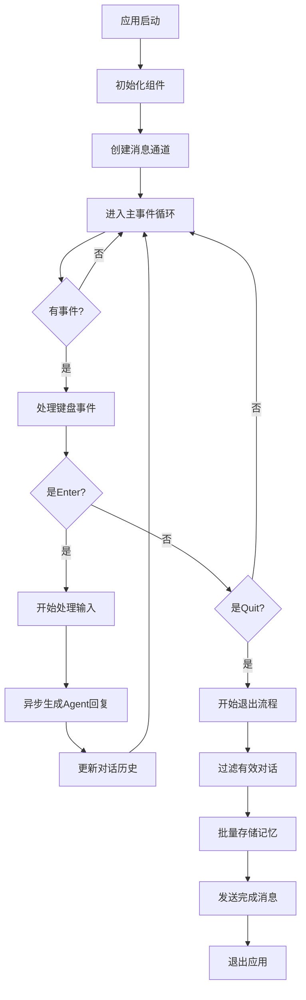
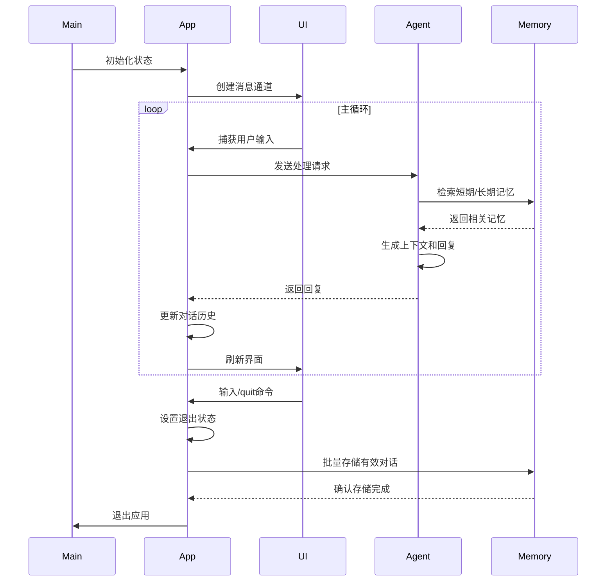

# **示例应用域技术实现文档：多轮交互应用**

**生成时间：2025-11-30 21:30:27 +08:00**  
**时间戳：1764509427**

---

## **1. 模块概述**

### **1.1 模块名称**
**多轮交互应用（multi-round-interactive）**

### **1.2 所属领域**
**示例应用域（Example Application Domain）**

### **1.3 模块定位**
本模块是 `memo` 项目中的一个**端到端示例应用**，旨在展示如何将 `memo-core` 的核心记忆管理能力集成到一个具备长期记忆功能的智能对话代理（AI Agent）中。它通过一个**终端用户界面（TUI）**，为开发者和终端用户提供了一个直观、可交互的演示环境，验证了 `memo` 系统在真实场景下的可用性和价值。

### **1.4 核心价值**
- **功能验证**：完整演示了从用户输入、Agent 回复、记忆检索到记忆持久化的闭环流程。
- **集成示范**：展示了 `memo-core`、`memo-rig`（RIG 集成工具）与第三方框架（如 `rig`、`ratatui`）的集成方式。
- **用户体验**：提供了一个具备记忆能力的、可运行的对话应用，直观体现 AI 代理的个性化和上下文连贯性。
- **开发参考**：为开发者构建基于 `memo` 的自定义应用提供了代码级参考和最佳实践。

---

## **2. 系统架构与设计**

### **2.1 整体架构风格**
本应用采用 **异步事件驱动架构（Asynchronous Event-Driven Architecture）**，结合 **MVC（Model-View-Controller）** 的思想进行组织。

- **事件驱动**：主循环通过 `crossterm` 监听用户输入事件，驱动整个应用流程。
- **异步处理**：使用 `tokio` 异步运行时处理耗时的 LLM 调用和记忆操作，避免阻塞 UI。
- **消息通信**：通过 `mpsc::unbounded_channel` 在 UI 线程和后台任务之间进行非阻塞通信，确保线程安全。

### **2.2 核心组件与职责**

| 组件 | 文件路径 | 主要职责 |
| :--- | :--- | :--- |
| **`main.rs`** | `examples/multi-round-interactive/src/main.rs` | 应用入口，负责初始化配置、组件、内存管理器、Agent，并启动主事件循环。 |
| **`app.rs`** | `examples/multi-round-interactive/src/app.rs` | 定义应用状态 `App` 结构体，管理对话历史、日志、UI 状态等。提供全局日志重定向机制。 |
| **`agent.rs`** | `examples/multi-round-interactive/src/agent.rs` | 封装与 AI Agent 的交互逻辑，包括创建 Agent、检索记忆、生成回复、批量存储对话等。 |
| **`events.rs`** | `examples/multi-round-interactive/src/events.rs` | 处理键盘事件，解析用户输入，并触发相应的业务逻辑（如发送消息、退出）。 |
| **`ui.rs`** | `examples/multi-round-interactive/src/ui.rs` | 使用 `ratatui` 库构建终端用户界面，负责渲染对话、输入框、日志和滚动条。 |
| **`terminal.rs`** | `examples/multi-round-interactive/src/terminal.rs` | 提供终端的初始化和最终清理功能，确保应用退出后终端状态正常。 |

### **2.3 核心数据流与控制流**

#### **2.3.1 主事件循环流程图**


#### **2.3.2 组件间交互时序图**


---

## **3. 核心功能实现细节**

### **3.1 应用状态管理 (`App`)**

`App` 结构体是应用的核心状态容器，定义了所有需要在 UI 和后台任务间共享的数据。

```rust
pub struct App {
    pub conversations: VecDeque<(String, String)>, // 对话历史
    pub current_input: String,                    // 当前输入
    pub logs: VecDeque<String>,                   // 系统日志
    pub is_processing: bool,                      // Agent 是否正在处理
    pub user_info: Option<String>,                // 用户基本信息
    pub should_quit: bool,                        // 是否应退出
    pub is_shutting_down: bool,                   // 是否在关闭流程中
    pub message_sender: Option<mpsc::UnboundedSender<AppMessage>>, // 消息发送器
    // ... 滚动偏移、焦点区域等UI状态
}
```

- **`VecDeque`**：用于高效地在对话和日志的两端进行插入和删除。
- **`FocusArea`**：枚举类型，管理当前焦点（输入框、对话区、日志区），支持 `Tab` 键切换。

### **3.2 异步事件处理与消息通信**

应用通过 `tokio::sync::mpsc::unbounded_channel` 建立了一个无界消息通道，实现 UI 与后台任务的安全通信。

- **消息类型 `AppMessage`**：
  ```rust
  #[derive(Debug)]
  pub enum AppMessage {
      Log(String), // 日志消息
      Conversation { user: String, assistant: String }, // 新的对话条目
      MemoryIterationCompleted, // 记忆化完成
  }
  ```
- **全局日志重定向**：
  通过 `set_global_log_sender` 和 `redirect_log_to_ui` 函数，任何组件（如 `agent.rs`）都可以将日志信息发送到 UI 界面，实现了跨模块的日志可视化。

### **3.3 AI Agent 集成与记忆检索**

`agent.rs` 模块是连接 `memo` 核心功能与应用逻辑的桥梁。

- **Agent 创建**：
  使用 `memo-rig` 提供的 `create_memory_agent` 函数，将 `MemoryManager` 注入到 RIG 框架的 Agent 中，使其具备调用记忆工具的能力。
- **记忆检索**：
  在生成回复前，`agent_reply_with_memory_retrieval` 函数会：
  1.  **从长期记忆中检索**：调用 `MemoryTool` 的 `search` 操作，基于用户 ID 和记忆类型（如 Personal, Factual）查找相关记忆。
  2.  **从短期对话中检索**：使用简单的关键词匹配算法，从最近的对话历史中找出与当前输入最相关的几条记录。
  3.  **构建上下文**：将检索到的长期和短期记忆整合成一个上下文字符串，作为 LLM 生成回复的输入，从而实现“记住”用户偏好和历史。

### **3.4 记忆持久化流程**

记忆的持久化发生在用户主动退出时，这是一个关键的“被动学习”环节。

- **触发条件**：用户输入 `/quit`、`quit`、`/exit` 或 `Esc` 键。
- **处理流程**：
  1.  **过滤对话**：调用 `handle_quit` 函数，遍历所有对话历史，过滤掉退出命令本身。
  2.  **批量存储**：调用 `store_conversations_batch` 函数，将有效的对话记录作为 `Message` 列表，批量提交给 `MemoryManager`。
  3.  **执行记忆化**：`MemoryManager` 会启动完整的记忆处理流水线（提取、分类、去重、评估、存储），将对话内容转化为结构化的长期记忆。
  4.  **状态反馈**：通过消息通道向 UI 发送日志，实时更新用户关于记忆化进度的信息。

### **3.5 终端用户界面 (TUI)**

UI 使用 `ratatui` 库构建，布局清晰，交互友好。

- **布局**：
  - **左侧 70%**：上部为对话历史区，下部为输入框。
  - **右侧 30%**：系统日志区。
- **交互特性**：
  - **`Enter`**：发送输入。
  - **`Tab`**：在输入框、对话区、日志区之间切换焦点。
  - **`↑`/`↓`**：在日志和对话区进行滚动浏览。
  - **`Home`/`End`**：快速跳转到日志或对话的开头/结尾。
  - **`Esc`**：触发退出流程。
- **视觉反馈**：
  - 焦点区域的标题会以**加粗和高亮颜色**显示。
  - 日志根据级别（INFO, WARN, ERROR）显示不同颜色。

---

## **4. 与核心系统的集成**

### **4.1 依赖关系**

`Cargo.toml` 明确了与 `memo` 项目核心组件的依赖：

```toml
[dependencies]
memo-config = { path = "../../memo-config" }
memo-core = { path = "../../memo-core" }
memo-rig = { path = "../../memo-rig" }
```

### **4.2 核心组件初始化**

在 `main.rs` 中，应用直接使用 `memo-core` 的 API 初始化了核心组件：

```rust
let llm_client = OpenAILLMClient::new(&config.llm, &config.embedding)?;
let vector_store = QdrantVectorStore::new(&config.qdrant).await?;
let memory_manager = Arc::new(MemoryManager::new(
    Box::new(vector_store),
    Box::new(llm_client.clone()),
    memory_config,
));
```

- **`Arc`**：使用原子引用计数确保 `memory_manager` 可以在多个异步任务间安全共享。
- **`Box<dyn Trait>`**：通过 trait 对象实现多态，为未来扩展其他 LLM 或向量数据库提供了基础。

---

## **5. 实用性与最佳实践**

### **5.1 开发者价值**
- **快速上手**：开发者可以通过运行此示例，快速理解 `memo` 系统的工作流程。
- **代码参考**：提供了如何在异步环境中安全地使用 `memory_manager`、如何处理 UI 与后台任务通信的范例。
- **集成模式**：展示了两种集成方式：直接调用 `memo-core` 库，以及通过 `memo-rig` 的 `Tool` 接口。

### **5.2 可扩展性建议**
1.  **持久化会话**：当前用户 ID 为硬编码的 `demo_user`。可扩展为支持多用户登录和会话管理。
2.  **实时记忆化**：当前记忆化在退出时触发。可扩展为在对话过程中实时或定期触发，以捕捉更及时的信息。
3.  **配置化 UI**：将 UI 的颜色、布局等配置化，提升用户体验。
4.  **错误处理增强**：对 LLM 调用、数据库连接等关键操作添加更完善的重试和降级机制。

---

## **6. 总结**

**多轮交互应用**是 `memo` 项目不可或缺的组成部分。它不仅是一个功能完整的演示程序，更是一个高质量的**技术参考实现**。它成功地将 `memo-core` 的复杂能力封装成一个直观、易用的终端应用，充分验证了 `memo` 系统在构建具备长期记忆能力的 AI 代理方面的有效性和实用性。其清晰的架构、健壮的异步设计和良好的用户体验，为 `memo` 项目的推广和应用奠定了坚实的基础。