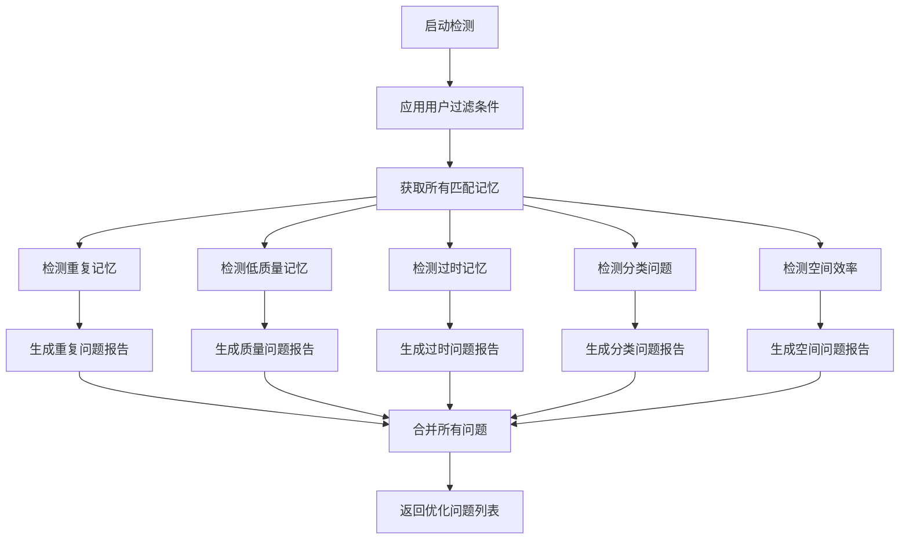
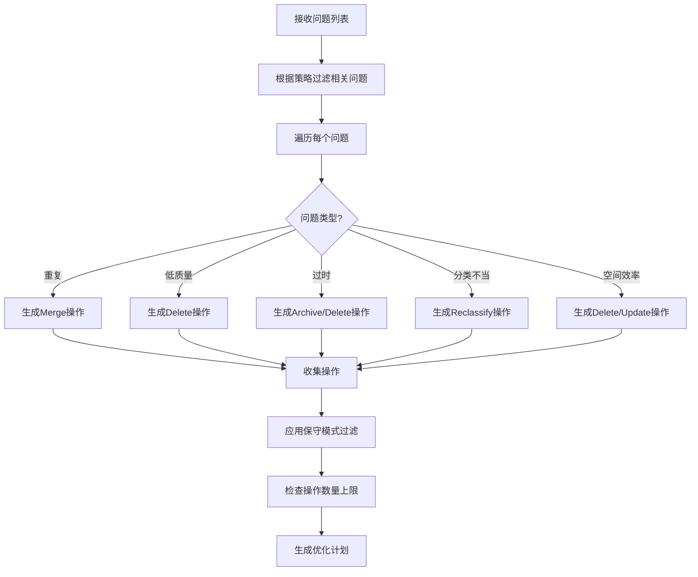
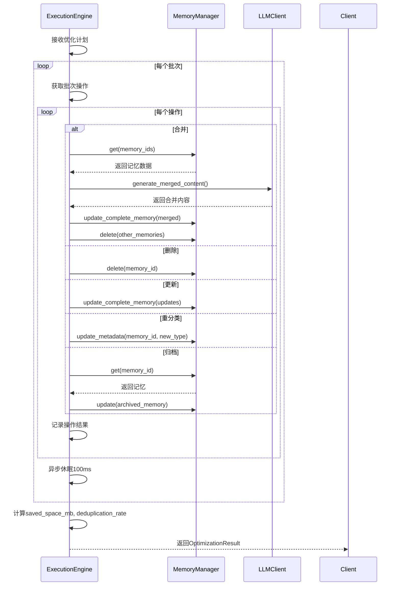

# 记忆优化域技术文档

## 概述

记忆优化域是 `cortex-mem` 系统的核心业务域之一，负责提升AI智能体记忆库的质量、效率和长期健康性。该域通过系统性地检测、分析和执行优化操作，解决记忆库中常见的重复、低质量、过时、分类不当和空间效率低下等问题，确保记忆数据保持高信息密度和语义价值。

记忆优化域采用“检测-分析-执行-报告”四阶段工作流，与记忆管理域、记忆智能处理域深度协同，形成完整的记忆生命周期闭环。其核心目标是降低冗余存储开销、提升语义检索效率、增强记忆内容的准确性与相关性，从而为AI智能体提供更精准、连贯的长期上下文支持。

本域由四个关键组件构成：**优化检测器（OptimizationDetector）**、**优化分析器（OptimizationAnalyzer）**、**优化计划（OptimizationPlan）** 和 **优化执行引擎（ExecutionEngine）**，并由**优化结果报告器（ResultReporter）** 完成闭环反馈。所有组件均采用Rust异步编程模型，支持高并发、高容错的批量操作，确保在大规模记忆库上稳定运行。

## 核心组件详解

### 1. 优化检测器（OptimizationDetector）

优化检测器是记忆优化流程的起点，负责对记忆库进行全面扫描，识别潜在的优化问题。它不直接修改数据，而是生成一份详尽的“问题清单”。

#### 核心功能
- **重复记忆检测**：基于语义相似度（默认阈值0.85）计算记忆内容的向量距离，识别高度相似的记忆组。当一组记忆中存在2个以上相似项时，标记为高严重性问题。
- **低质量记忆识别**：通过评估记忆内容的长度、信息密度、关键词丰富度和LLM生成的“质量评分”（默认阈值0.4），识别内容空洞、无意义或低价值的记忆。
- **过时记忆判断**：根据记忆的创建/更新时间与系统配置的“时间衰减天数”（默认30天）进行比较，识别长期未被引用或更新的“冷记忆”。
- **分类不当检测**：分析记忆的元数据（如`memory_type`）与内容语义的匹配度，识别分类错误（如将对话型记忆误分类为事实型）。
- **空间效率分析**：检测因重复存储、冗余元数据或低效向量表示导致的存储浪费。

#### 设计特点
- **可配置性**：通过 `OptimizationDetectorConfig` 结构体灵活配置检测阈值（如相似度、质量评分、时间衰减天数）和每类问题的最大检测数量。
- **过滤支持**：支持基于用户ID、代理ID、记忆类型、时间范围、重要性分数等复杂条件的过滤，实现按需优化。
- **异步与容错**：所有检测操作均为异步，即使部分记忆无法访问，也不会中断整个检测流程。
- **依赖注入**：必须通过 `with_memory_manager(Arc<MemoryManager>)` 注入 `MemoryManager` 实例，以获取对底层记忆数据的访问权限。

#### 工作流程


### 2. 优化分析器（OptimizationAnalyzer）

优化分析器是记忆优化流程的“大脑”，它接收检测器生成的问题列表，并根据预设的优化策略，生成一份具体的、可执行的“操作指令集”。

#### 核心功能
- **策略驱动决策**：支持五种预定义优化策略：
  - `Full`：全面优化，处理所有类型的问题。
  - `Incremental`：增量优化，仅处理高严重性（High/Critical）问题，适合生产环境高频运行。
  - `Batch`：批量优化，处理中等及以上严重性问题。
  - `Deduplication`：仅去重，专注于合并重复记忆。
  - `Quality`：仅质量优化，专注于删除或更新低质量记忆。
- **操作生成**：为每个识别出的问题生成具体的 `OptimizationAction`。例如：
  - 重复记忆 → `Merge` 操作
  - 低质量记忆 → `Delete` 操作
  - 过时记忆 → `Archive` 或 `Delete` 操作（根据严重性）
  - 分类不当 → `Reclassify` 操作
- **保守模式**：在 `conservative_mode` 模式下，会过滤掉可能影响重要记忆的高风险操作（如删除），优先选择更安全的归档或更新操作。
- **计划规模控制**：通过 `max_actions_per_plan` 限制单次优化计划的最大操作数，防止计划过大导致执行超时或资源耗尽。

#### 设计特点
- **策略模式**：使用Rust的枚举类型 `OptimizationStrategy` 实现策略模式，便于扩展新的优化策略。
- **依赖注入**：同样通过 `with_memory_manager` 注入 `MemoryManager`，用于在生成操作时进行上下文验证。
- **可扩展性**：新增一种问题类型（如“权限过期”）只需在 `IssueKind` 中添加枚举项，并在 `analyze_issue_and_generate_actions` 中添加对应的处理分支。

#### 工作流程


### 3. 优化计划（OptimizationPlan）

优化计划是优化检测与执行之间的“契约”和“蓝图”。它是一个不可变的、序列化的数据结构，完整地描述了本次优化的范围、目标和具体操作。

#### 核心结构
```rust
pub struct OptimizationPlan {
    pub optimization_id: String, // 唯一标识符
    pub strategy: OptimizationStrategy, // 优化策略
    pub created_at: chrono::DateTime<Utc>, // 计划创建时间
    pub estimated_duration_minutes: u64, // 预估执行时间（分钟）
    pub issues: Vec<OptimizationIssue>, // 检测到的所有问题
    pub actions: Vec<OptimizationAction>, // 待执行的具体操作
    pub filters: OptimizationFilters, // 应用的过滤条件
}
```

#### 核心功能
- **计划生成**：由 `OptimizationAnalyzer` 创建，是检测与执行的唯一桥梁。
- **时间估算**：根据策略和问题数量自动估算执行时间，为用户和系统提供预期。
- **统计摘要**：提供 `action_statistics()` 和 `issue_statistics()` 方法，快速获取操作和问题的分布情况，便于报告和监控。
- **序列化支持**：实现 `Serialize` 和 `Deserialize`，支持将计划持久化到数据库或通过网络传输，实现异步优化和任务队列。

#### 设计特点
- **轻量级**：仅包含数据，不包含任何业务逻辑，确保其作为“数据契约”的纯粹性。
- **可追溯性**：`optimization_id` 和 `created_at` 为每次优化提供了完整的审计追踪能力。
- **完整性**：计划中包含了所有必要的上下文（`filters`），确保执行引擎在任何环境下都能复现相同的优化行为。

### 4. 优化执行引擎（ExecutionEngine）

优化执行引擎是记忆优化流程的“执行者”，负责安全、高效地将优化计划中的抽象指令转化为对底层记忆库的实际变更。

#### 核心功能
- **分批处理**：将优化计划中的操作按 `batch_size`（默认100）分批执行，避免单次操作内存占用过高或数据库连接超时。
- **并发控制**：通过 `max_concurrent_tasks`（默认4）限制并发任务数，平衡执行速度与系统负载。
- **错误容忍**：采用“失败继续”（fail-continue）策略。即使某个操作（如合并某条记忆）失败，也会记录错误日志，但继续执行后续操作，确保整体优化过程的鲁棒性。
- **操作执行**：针对每种 `OptimizationAction` 调用 `MemoryManager` 的对应方法：
  - `Merge`：获取所有相关记忆，调用LLM生成合并后的内容，更新一条记忆并删除其余。
  - `Delete`：直接调用 `delete` 方法移除记忆。
  - `Update`：更新记忆的元数据或内容。
  - `Reclassify`：更新记忆的 `memory_type` 元数据。
  - `Archive`：将记忆的 `memory_type` 更新为“已归档”状态。
- **资源休眠**：在批次间插入100毫秒的异步休眠，避免对LLM服务和向量数据库造成瞬时压力。

#### 设计特点
- **依赖注入**：必须通过 `with_memory_manager(Arc<MemoryManager>)` 注入 `MemoryManager` 实例，确保所有操作都通过统一的、安全的接口进行。
- **禁止直接实例化**：`new()` 和 `with_config()` 方法均使用 `panic!`，强制开发者使用正确的依赖注入方式，提升代码安全性。
- **性能指标计算**：在执行完成后，自动计算优化指标，如节省的存储空间（MB）和去重率（Deduplication Rate），为报告器提供数据。

#### 执行流程


### 5. 优化结果报告器（ResultReporter）

优化结果报告器是优化流程的“终点”和“反馈环”，它将执行引擎生成的 `OptimizationResult` 转化为人类和机器可读的报告。

#### 核心功能
- **控制台摘要报告**：输出清晰、结构化的文本摘要，包含优化ID、策略、时长、问题数量、操作数量、成功率和关键指标（节省空间、去重率）。
- **详细日志**：可选地输出每个问题和每个操作的详细信息，便于调试和审计。
- **结构化报告**：提供 `generate_structured_report()` 方法，将 `OptimizationResult` 序列化为JSON格式，便于集成到监控系统或API响应中。
- **文件导出**：支持将摘要报告导出到指定路径的文件，实现持久化存档。
- **指标报告**：专门格式化并输出 `OptimizationMetrics` 中的量化指标。

#### 设计特点
- **配置驱动**：通过 `ResultReporterConfig` 控制是否启用详细日志、指标收集和文件导出，满足不同环境（开发、生产）的需求。
- **多格式输出**：同时支持人类友好的文本报告和机器友好的JSON报告，实现“一报告，多用途”。
- **状态可视化**：在摘要末尾使用 `✅` 和 `❌` 图标直观显示优化是否成功。

## 与其他模块的交互

记忆优化域并非孤立存在，它深度嵌入在 `cortex-mem` 的整体架构中：

1. **与记忆管理域（MemoryManager）**：这是最核心的交互。优化执行引擎通过 `MemoryManager` 的CRUD接口执行所有实际的内存操作。检测器和分析器也依赖它来获取记忆数据。这种依赖关系通过 `Arc<MemoryManager>` 实现，确保了数据访问的统一性和安全性。
2. **与记忆智能处理域（LLMClient）**：在执行“合并”操作时，执行引擎会调用 `LLMClient` 的 `generate_merged_content()` 方法，利用大语言模型的语义理解能力生成高质量的合并后内容。这是实现“智能优化”的关键。
3. **与多模式接入域**：用户通过CLI的 `optimize` 命令、HTTP API的 `/optimize` 端点或MCP协议触发优化流程。接入层负责解析参数、创建优化计划并调用优化域的入口。
4. **与系统配置与支撑域**：优化检测器和分析器的配置（如阈值、超时）均来自 `cortex-mem-config` 加载的全局配置文件（`config.toml`），实现了配置的集中化管理。

## 总结与最佳实践

记忆优化域是 `cortex-mem` 系统实现“智能记忆”愿景的核心引擎。其设计体现了以下最佳实践：

- **分层解耦**：检测、分析、执行、报告职责分离，模块间通过清晰的接口通信。
- **安全第一**：强制依赖注入，禁止直接实例化，确保所有操作都经过 `MemoryManager` 的安全层。
- **健壮性**：分批处理、错误容忍、资源休眠等机制确保在生产环境中稳定运行。
- **可观察性**：完善的日志记录和报告功能，为系统运维和问题排查提供强大支持。
- **可扩展性**：策略模式和枚举类型的设计，使得新增优化策略或问题类型变得简单。

**建议**：在生产环境中，应优先使用 `Incremental` 策略进行定期（如每日）优化，以最小化对系统性能的影响。对于大型记忆库，建议将优化任务作为后台异步任务执行，并通过消息队列或定时任务触发，避免阻塞用户请求。