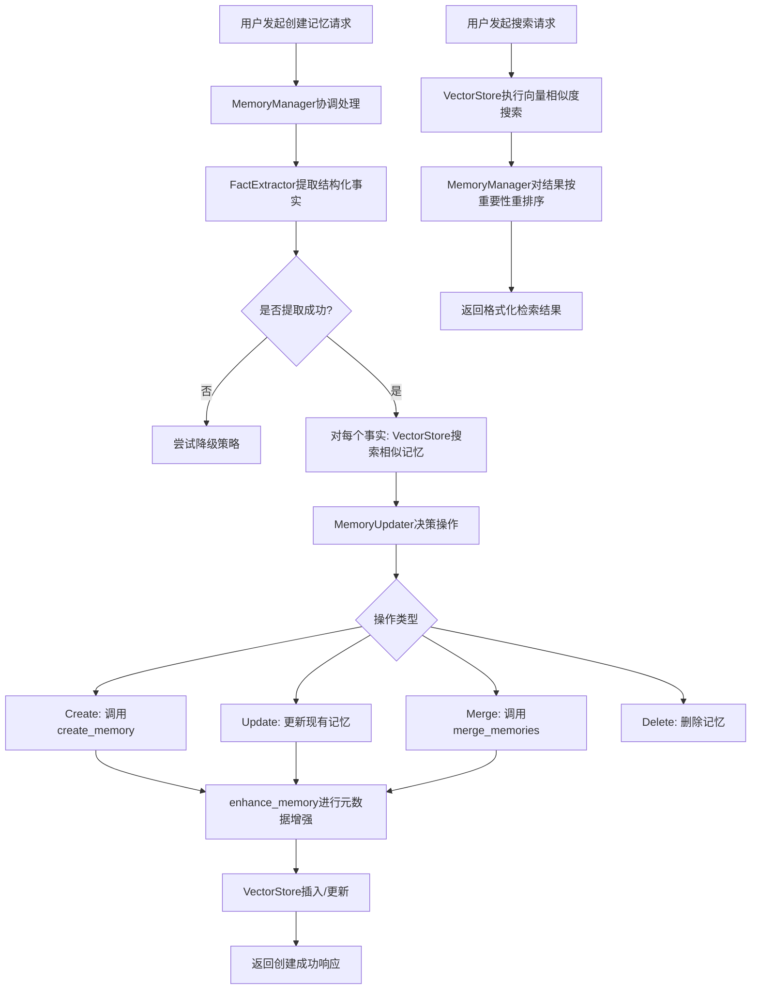

# memo 项目记忆管理域技术实现文档

**生成时间**：2025-11-30 21:23:21 +08:00  
**时间戳**：1764509001  

---

## 1. 概述

本技术文档详细阐述了 `memo` 项目中**记忆管理域**（Memory Management Domain）的设计与实现。该域是 `memo-core` 模块的核心，负责实现 AI 代理长期记忆的全生命周期管理。它通过协调多个智能子模块，利用大语言模型（LLM）和向量数据库的能力，将非结构化的对话内容转化为结构化、可检索、可演进的记忆知识库。

记忆管理域的设计遵循领域驱动设计（DDD）原则，以 `MemoryManager` 为核心协调者，通过清晰的 trait 接口与 LLM 交互域、向量存储域等基础设施解耦，确保了系统的高内聚、低耦合与可扩展性。

---

## 2. 核心职责与功能

记忆管理域的核心职责是实现记忆的**智能生命周期管理**，具体功能包括：

1.  **记忆提取**：从对话历史中智能识别并提取关键事实。
2.  **记忆更新**：基于新信息，决策对现有记忆库的增、删、改、合并操作。
3.  **记忆分类**：对记忆内容进行智能分类，并提取实体与主题。
4.  **重要性评估**：量化每条记忆的价值，用于排序与保留策略。
5.  **去重与合并**：检测并合并语义重复的记忆，保证知识库的简洁性。
6.  **元数据增强**：利用 LLM 为记忆生成摘要、关键词等辅助信息。
7.  **加权检索**：结合向量相似度与重要性评分，返回最优的检索结果。

---

## 3. 核心组件与实现细节

### 3.1 记忆管理器（MemoryManager）

`MemoryManager` 是记忆管理域的**控制中心**与**门面**（Facade），对外提供统一的 API，对内协调所有子模块。

#### 3.1.1 核心结构
`MemoryManager` 结构体通过依赖注入的方式，持有了所有策略组件的 trait 对象：
```rust
pub struct MemoryManager {
    vector_store: Box<dyn VectorStore>,
    llm_client: Box<dyn LLMClient>,
    config: MemoryConfig,
    fact_extractor: Box<dyn FactExtractor + 'static>,
    memory_updater: Box<dyn MemoryUpdater + 'static>,
    importance_evaluator: Box<dyn ImportanceEvaluator + 'static>,
    duplicate_detector: Box<dyn DuplicateDetector + 'static>,
    memory_classifier: Box<dyn MemoryClassifier + 'static>,
}
```
这种设计实现了**松耦合**，便于在测试中进行 Mock，也支持未来替换不同的实现。

#### 3.1.2 核心方法 `add_memory`
`add_memory` 方法是记忆创建流程的入口，其执行流程如下：

1.  **策略判断**：首先检查是否为程序性记忆（`Procedural`），若是则调用专用流程。
2.  **事实提取**：调用 `FactExtractor` 从对话消息中提取结构化事实。
3.  **降级处理**：若首次提取失败，会尝试多种降级策略（如仅提取用户消息、逐条消息提取）。
4.  **记忆决策**：对每个提取出的事实，执行以下子流程：
    *   **相似性搜索**：在向量数据库中搜索与该事实相似的现有记忆。
    *   **更新决策**：将事实和候选记忆列表交给 `MemoryUpdater`，由 LLM 决策执行 `Create`、`Update`、`Merge` 或 `Delete` 操作。
    *   **执行操作**：根据决策结果，执行相应的数据库操作。
5.  **返回结果**：返回一个包含所有操作结果的 `Vec<MemoryResult>`。

#### 3.1.3 核心方法 `enhance_memory`
`enhance_memory` 方法负责对新创建或更新的记忆进行**元数据增强**，使其更易于管理和检索。增强过程包括：
*   **关键词提取**：调用 LLM 提取记忆内容的关键词。
*   **摘要生成**：对于长文本，生成简短摘要。
*   **分类与实体提取**：调用 `MemoryClassifier` 进行类型分类、实体和主题提取。
*   **重要性评估**：调用 `ImportanceEvaluator` 为记忆打分。
*   **去重合并**：调用 `DuplicateDetector` 检测并合并重复项。

此方法在 `create_memory` 中被调用，且其行为受 `auto_enhance` 配置项控制。

---

### 3.2 记忆提取器（FactExtractor）

`FactExtractor` 负责从对话中提取结构化事实，是记忆知识化的第一步。

#### 3.2.1 实现与策略
`LLMFactExtractor` 是其主要实现，它通过精心设计的提示词（Prompt）引导 LLM 进行提取。它支持多种提取策略：
*   **`extract_facts`**：使用双通道分析，智能选择最佳策略。
*   **`extract_user_facts`**：**仅**从用户消息中提取事实，避免助手的自我描述污染记忆。
*   **`extract_assistant_facts`**：从助手消息中提取关于用户的信息。
*   **`extract_facts_from_text`**：从纯文本中提取事实。

#### 3.2.2 关键提示词
`USER_MEMORY_EXTRACTION_PROMPT` 是其核心提示词，其关键设计点包括：
*   **严格指令**：明确要求“仅基于用户消息生成事实”，并警告“包含助手信息将被惩罚”。
*   **分类指导**：详细列出了需要记住的7类信息（个人偏好、重要细节、计划等）。
*   **语言保持**：要求检测输入语言并以相同语言记录事实。
*   **JSON 输出**：强制要求以 `{"facts": [...]} ` 的 JSON 格式输出，便于程序解析。

---

### 3.3 记忆更新器（MemoryUpdater）

`MemoryUpdater` 是记忆库演进的“决策大脑”，它决定如何将新信息融入现有知识库。

#### 3.3.1 决策流程
`LLMMemoryUpdater` 通过一个复杂的提示词 `build_update_prompt`，向 LLM 提供以下信息：
*   **待处理的事实列表**（Extracted Facts）
*   **相关的现有记忆列表**（Existing Memories）

LLM 需要为每个事实决策一个操作：
*   **`CREATE`**：创建新记忆（信息全新）。
*   **`UPDATE`**：更新现有记忆（信息有实质性补充）。
*   **`MERGE`**：合并多个记忆（信息相关且冗余）。
*   **`IGNORE`**：忽略（信息重复或不重要）。

#### 3.3.2 优化策略
提示词中包含了明确的优化策略，如“优先 `IGNORE` 以防止信息重复”、“使用 `MERGE` 合并相关事实”，引导 LLM 做出更优的决策。

---

### 3.4 记忆重要性评估器（ImportanceEvaluator）

该组件为每条记忆赋予一个 `[0.0, 1.0]` 的重要性分数，是检索排序和长期存储策略的关键依据。

#### 3.4.1 混合评估策略
系统实现了三种评估器，并可通过配置组合使用：
1.  **`LLMImportanceEvaluator`**：最精确。通过提示词让 LLM 综合考虑用户身份、情感、未来参考价值等因素进行评分。
2.  **`RuleBasedImportanceEvaluator`**：最快速。基于规则计算，如：
    *   **内容长度**：越长越重要。
    *   **记忆类型**：`Personal` > `Factual` > `Procedural`。
    *   **关键词**：包含“重要”、“记住”、“生日”等关键词则加分。
3.  **`HybridImportanceEvaluator`**：结合两者。例如，当内容长度超过阈值时，才调用 LLM 进行精确评估，否则使用规则评分。这在性能和精度之间取得了平衡。

---

### 3.5 记忆去重器（DuplicateDetector）

`DuplicateDetector` 采用**多维度评估**来检测重复记忆，避免单一方法的误判。

#### 3.5.1 相似度计算
`AdvancedDuplicateDetector` 计算两个记忆的综合相似度，包含：
*   **语义相似度**：基于嵌入向量的余弦相似度。
*   **内容相似度**：基于词项重叠的 Jaccard 相似度。
*   **元数据相似度**：比较用户ID、代理ID、记忆类型、实体和主题的重叠度。

只有当综合相似度超过 `similarity_threshold` 时，才判定为重复。

#### 3.5.2 智能合并
当检测到重复时，调用 `merge_memories` 方法。该方法会将所有相关记忆的文本拼接，然后通过 LLM 提示词 `create_merge_prompt`，要求 LLM 生成一个“合并了所有信息、去除了冗余”的新记忆。

---

### 3.6 记忆分类器（MemoryClassifier）

`MemoryClassifier` 为记忆打上类型标签，增强其可组织性和可检索性。

#### 3.6.1 分类体系
系统定义了六种记忆类型：
*   `Conversational` (对话)
*   `Procedural` (程序性)
*   `Factual` (事实性)
*   `Semantic` (语义)
*   `Episodic` (情景)
*   `Personal` (个人)

#### 3.6.2 多任务处理
`LLMMemoryClassifier` 不仅能分类，还能同时执行：
*   **实体提取**：识别文本中的人名、组织、地点等。
*   **主题提取**：识别文本讨论的主要领域或活动。

这些信息被存储在 `MemoryMetadata` 的 `entities` 和 `topics` 字段中，可用于后续的元数据过滤检索。

---

### 3.7 记忆提示工程（Prompts）

`prompts.rs` 是整个记忆管理域的“大脑指令集”，其质量直接决定了系统的智能水平。

#### 3.7.1 核心提示词
*   `PROCEDURAL_MEMORY_SYSTEM_PROMPT`：用于生成程序性记忆，要求**逐字记录**智能体的每一个输出，确保任务可追溯。
*   `USER_MEMORY_EXTRACTION_PROMPT`：用于提取用户事实，强调**仅关注用户消息**。
*   `AGENT_MEMORY_EXTRACTION_PROMPT`：用于提取助手自身的信息。
*   `MEMORY_UPDATE_PROMPT`：指导 LLM 如何决策记忆的增删改查。

#### 3.7.2 设计原则
所有提示词都遵循以下原则：
*   **角色明确**：以“你是一个...”开头，赋予 LLM 明确的角色。
*   **指令清晰**：使用“必须”、“不要”、“仅”等强指令词。
*   **输出格式化**：强制要求 JSON 或特定文本格式，便于程序解析。
*   **提供示例**：包含 Few-shot 示例，引导 LLM 生成期望的输出。

---

## 4. 数据模型

记忆管理域依赖 `types.rs` 中定义的核心数据结构：

*   **`Memory`**：记忆的主体，包含 `id`, `content`, `embedding`, `metadata`, `created_at`, `updated_at`。
*   **`MemoryMetadata`**：记忆的元数据，包含 `user_id`, `agent_id`, `memory_type`, `importance_score`, `entities`, `topics`, `hash` 等。
*   **`ScoredMemory`**：检索结果，包含 `memory` 和 `score`（相似度得分）。
*   **`MemoryResult`**：操作结果，用于返回 `add_memory` 等操作的反馈。

这些结构体通过 `serde` 实现序列化，便于在组件间传递和持久化。

---

## 5. 交互流程

### 5.1 记忆创建与检索流程


### 5.2 被动式记忆更新流程
该流程在多轮对话结束后自动触发，由 `RIG` 框架的 `ConversationProcessor` 调用 `MemoryManager`，实现 AI 代理的**被动学习**能力，无需用户主动干预。

---

## 6. 总结

`memo` 项目的记忆管理域是一个高度智能化、模块化的系统。它通过 `MemoryManager` 协调 `Extractor`, `Updater`, `Classifier`, `Evaluator`, `Detector` 等子模块，构建了一个完整的“感知-决策-执行-存储”闭环。其核心价值在于：

1.  **智能性**：深度利用 LLM 的理解与生成能力，实现记忆的自动化、智能化处理。
2.  **健壮性**：通过降级策略、混合评估、多维度去重等机制，确保系统在各种输入下都能稳定运行。
3.  **可扩展性**：基于 trait 的设计，使得替换 LLM 提供商或向量数据库成为可能。
4.  **实用性**：为 AI 代理提供了真正意义上的长期记忆，显著提升了对话的连贯性与个性化水平。

该域的设计与实现，为构建下一代 AI 增强型应用提供了坚实的记忆基础设施。