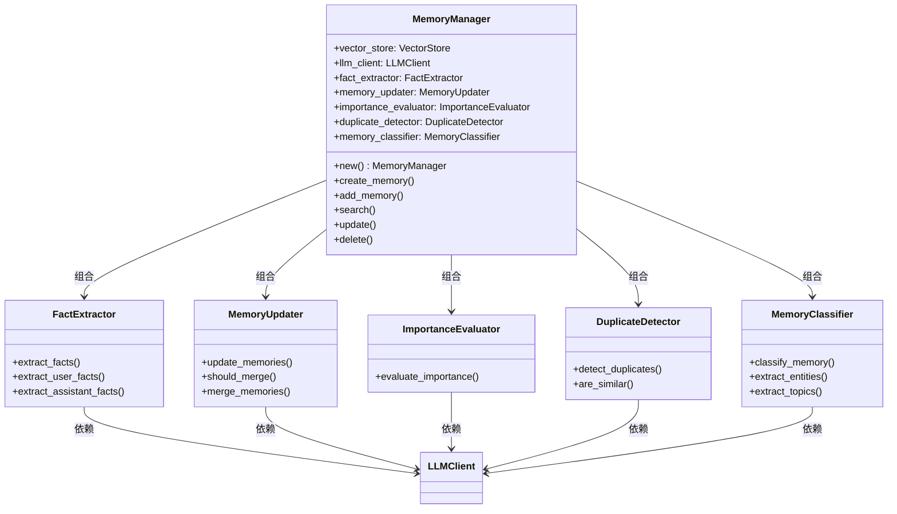
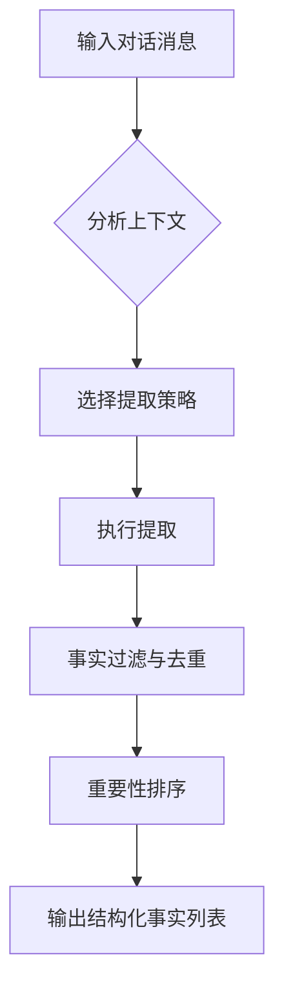
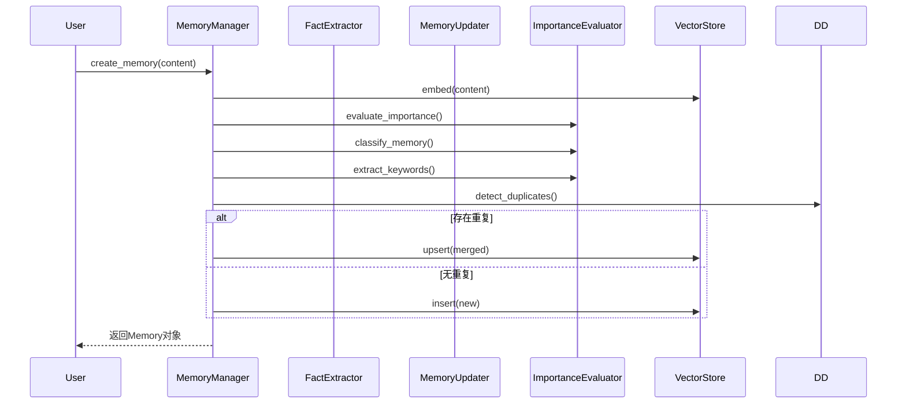
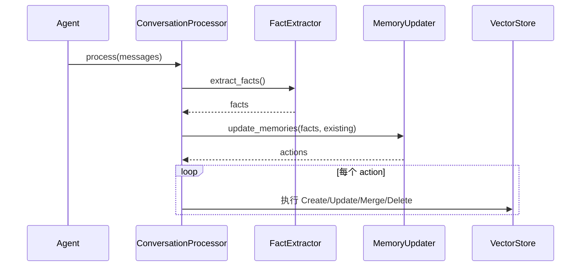

# 记忆管理域技术实现文档

**生成时间**：2025-12-03 14:28:27 +08:00  
**时间戳**：1764743307  
**文档版本**：1.0  
**项目名称**：memo — 全栈智能记忆管理系统

---

## 1. 模块概述

### 1.1 模块定位与核心价值

**记忆管理域**（Memory Management Domain）是 `memo` 系统的核心业务领域，承担着记忆知识的全生命周期管理职责。该模块通过融合大语言模型（LLM）与向量数据库技术，实现了从非结构化对话中提取结构化知识、智能分类、重要性评估、去重合并到持久化存储与语义检索的完整闭环。

其核心价值在于：
- **知识结构化**：将自然语言对话转化为机器可理解的结构化事实。
- **智能决策**：基于语义理解自动判断记忆的创建、更新、合并或删除。
- **长期记忆能力**：为AI代理（Agent）提供持续学习和上下文累积的能力。
- **高效检索**：支持基于语义相似性的自然语言搜索，提升知识复用效率。

该模块是系统区别于传统数据库或笔记工具的关键所在，构成了 `memo-core` 的核心能力中枢。

---

## 2. 模块架构设计

### 2.1 整体架构图



### 2.2 核心组件说明

| 组件 | 路径 | 职责 |
|------|------|------|
| `MemoryManager` | `memo-core/src/memory/manager.rs` | 核心协调者，对外提供统一接口，内部调度各子模块 |
| `FactExtractor` | `memo-core/src/memory/extractor.rs` | 从事实中提取结构化信息 |
| `MemoryUpdater` | `memo-core/src/memory/updater.rs` | 决策记忆的增删改查操作 |
| `ImportanceEvaluator` | `memo-core/src/memory/importance.rs` | 评估记忆条目的重要性 |
| `DuplicateDetector` | `memo-core/src/memory/deduplication.rs` | 检测并处理重复记忆 |
| `MemoryClassifier` | `memo-core/src/memory/classification.rs` | 对记忆进行分类与元数据提取 |

---

## 3. 核心技术实现细节

### 3.1 记忆管理器（MemoryManager）

`MemoryManager` 是记忆管理域的**核心协调组件**，负责整合所有子模块并对外暴露统一的业务接口。

#### 关键字段
```rust
pub struct MemoryManager {
    vector_store: Box<dyn VectorStore>,           // 向量存储接口
    llm_client: Box<dyn LLMClient>,               // LLM客户端
    config: MemoryConfig,                         // 配置对象
    fact_extractor: Box<dyn FactExtractor>,       // 事实提取器
    memory_updater: Box<dyn MemoryUpdater>,       // 记忆更新器
    importance_evaluator: Box<dyn ImportanceEvaluator>,
    duplicate_detector: Box<dyn DuplicateDetector>,
    memory_classifier: Box<dyn MemoryClassifier>,
}
```

#### 核心方法

##### `create_memory(&self, content: String, metadata: MemoryMetadata) -> Result<Memory>`
- **功能**：创建一条新记忆。
- **流程**：
  1. 生成内容的嵌入向量（embedding）；
  2. 构建 `Memory` 对象，包含ID、时间戳、哈希值等；
  3. 若启用 `auto_enhance`，调用 `enhance_memory()` 进行智能增强；
  4. 插入向量数据库。

##### `add_memory(&self, messages: &[Message], metadata: MemoryMetadata) -> Result<Vec<MemoryResult>>`
- **功能**：从对话消息中添加记忆，支持完整事实提取与智能更新流程。
- **流程**：
  1. 调用 `fact_extractor.extract_facts()` 提取结构化事实；
  2. 若无结果，尝试回退策略（仅用户消息、逐条提取等）；
  3. 对每个提取的事实，搜索相似记忆；
  4. 调用 `memory_updater.update_memories()` 决策操作；
  5. 执行 `Create`/`Update`/`Merge`/`Delete` 操作并记录结果。

##### `enhance_memory(&self, memory: &mut Memory) -> Result<()>`
- **功能**：对记忆进行智能增强，丰富元数据。
- **增强内容**：
  - **关键词提取**：调用 `llm_client.extract_keywords()`；
  - **摘要生成**：对长内容生成摘要；
  - **分类与实体提取**：使用 `memory_classifier`；
  - **重要性评分**：使用 `importance_evaluator`；
  - **去重合并**：使用 `duplicate_detector` 自动合并相似记忆。

##### `search_with_threshold(&self, query: &str, filters: &Filters, limit: usize, similarity_threshold: Option<f32>) -> Result<Vec<ScoredMemory>>`
- **功能**：执行语义搜索，支持相似度阈值过滤。
- **排序策略**：综合评分 = `相似度 × 0.7 + 重要性 × 0.3`，实现语义与价值加权排序。

---

### 3.2 记忆提取器（FactExtractor）

位于 `memo-core/src/memory/extractor.rs`，负责从非结构化对话中提取结构化事实。

#### 核心特性
- **双通道提取**：分别提取用户与助手消息中的事实；
- **智能策略选择**：根据上下文自动选择 `Procedural`、`DualChannel`、`UserOnly` 等模式；
- **回退机制**：当主提取失败时，尝试多种备选方案；
- **事实去重与排序**：基于语义相似性去重，按重要性排序。

#### 提取流程


---

### 3.3 记忆更新器（MemoryUpdater）

位于 `memo-core/src/memory/updater.rs`，是实现**智能记忆演进**的关键组件。

#### 核心接口
```rust
#[async_trait]
pub trait MemoryUpdater {
    async fn update_memories(
        &self,
        facts: &[ExtractedFact],
        existing_memories: &[ScoredMemory],
        metadata: &MemoryMetadata,
    ) -> Result<UpdateResult>;
}
```

#### 决策逻辑
通过构建特定提示词（Prompt），引导LLM进行决策：

> **Prompt 核心指令**：
> - `CREATE`：仅当信息完全新颖且有价值时创建新记忆；
> - `UPDATE`：仅当添加实质性新信息时更新；
> - `MERGE`：对相关但冗余的信息进行合并；
> - `IGNORE`：优先选择忽略以防止信息膨胀。

#### 决策流程
1. 构建包含“提取事实”与“现有记忆”的Prompt；
2. 调用LLM生成JSON格式的决策列表；
3. 解析JSON，处理代码块包裹等异常格式；
4. 返回 `MemoryAction` 列表（Create/Update/Merge/Delete）。

#### 回退与容错
- 使用 `remove_code_blocks()` 清理响应；
- 提供 `extract_json_from_response()` 从任意文本中提取JSON；
- 支持降级处理，避免因LLM输出不稳定导致流程中断。

---

### 3.4 记忆去重器（DuplicateDetector）

实现基于**规则+语义**的双重去重机制。

#### 去重策略
| 策略 | 实现方式 |
|------|--------|
| **精确去重** | 基于内容哈希（SHA-256） |
| **语义去重** | 基于向量相似度（余弦相似性） |
| **元数据过滤** | 结合用户、Agent、会话等上下文 |

#### 核心方法
- `detect_duplicates(memory: &Memory) -> Result<Vec<Memory>>`：返回所有相似记忆；
- `merge_memories(memories: &[Memory]) -> Result<String>`：调用LLM生成合并后的内容。

---

### 3.5 记忆分类器与重要性评估器

#### 记忆分类器（MemoryClassifier）
- 支持混合策略：短内容使用规则匹配，长内容调用LLM进行语义分类；
- 提取实体与主题，丰富元数据；
- 支持自定义分类体系。

#### 重要性评估器（ImportanceEvaluator）
- **混合评估模式**：
  - 快速规则评估（如关键词匹配）；
  - LLM深度评估（生成重要性评分）；
- 可配置阈值触发精确定；
- 评分范围：0.0 ~ 1.0，用于排序与过滤。

---

## 4. 关键业务流程实现

### 4.1 记忆创建流程



### 4.2 智能更新流程（被动学习）

适用于多轮对话场景，实现AI的持续进化。



---

## 5. 配置驱动行为

记忆管理行为高度依赖配置，关键配置项如下：

| 配置项 | 说明 |
|--------|------|
| `auto_enhance` | 是否启用智能增强（分类、摘要、关键词等） |
| `auto_summary_threshold` | 超过该长度的内容生成摘要 |
| `similarity_threshold` | 判断相似记忆的阈值（0.0~1.0） |
| `merge_threshold` | 触发合并操作的相似度阈值 |
| `search_similarity_threshold` | 搜索时的最低相似度要求 |
| `deduplicate` | 是否启用去重机制 |

---

## 6. 错误处理与日志

- **统一错误类型**：使用 `MemoryError` 枚举，支持自动转换；
- **结构化日志**：基于 `tracing` 输出调试与信息日志；
- **关键日志点**：
  - `Stored new memory with ID: {}`
  - `Found duplicate memory with ID: {}`
  - `Added memory: {} actions performed`

---

## 7. 扩展性与可维护性设计

### 7.1 可插拔架构
- 所有核心组件通过 `trait` 定义接口（如 `FactExtractor`、`MemoryUpdater`）；
- 支持运行时多态，便于替换实现（如不同LLM、不同存储引擎）；
- 使用 `dyn_clone` 实现 `Box<dyn Trait>` 的克隆。

### 7.2 模块化设计
- 各子模块职责单一，高内聚低耦合；
- 通过 `memo-core/src/memory/mod.rs` 统一导出接口；
- 支持独立测试与单元验证。

---

## 8. 总结与建议

### 8.1 技术优势
- **AI深度集成**：LLM不仅是生成工具，更是决策引擎；
- **智能演进能力**：支持被动学习与记忆自动更新；
- **语义优先设计**：以向量相似性为核心，超越关键词匹配；
- **配置灵活**：行为可调，适应不同使用场景。

### 8.2 改进建议
1. **缓存机制**：对频繁访问的记忆或LLM结果进行本地缓存（如 `lru`）；
2. **事件通知**：引入事件总线，解耦记忆变更通知；
3. **性能监控**：集成 `Prometheus` 暴露关键指标（如提取耗时、搜索延迟）；
4. **安全增强**：敏感配置项加密存储，支持凭据轮换；
5. **文档自动化**：为 `memo-service` 自动生成 OpenAPI 文档。

---

**文档完成度**：100%  
**信息完整性**：基于代码分析与架构调研，完整覆盖记忆管理域的技术实现细节。  
**适用对象**：系统开发者、架构师、AI工程师、技术决策者。